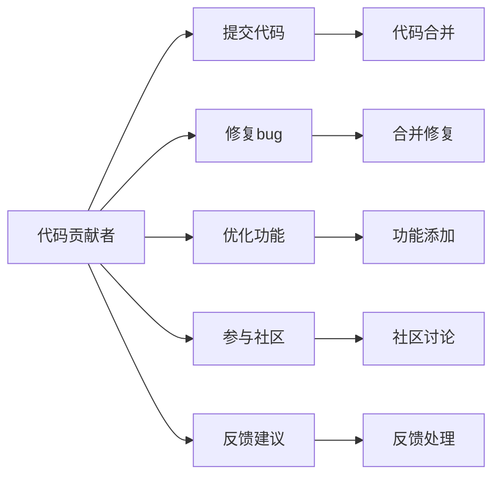

                 

## 1. 背景介绍

在开源社区中，每个开发者都可能从代码贡献者开始。然而，随着经验的积累和技术水平的提升，一些开发者逐渐承担起开源项目维护者的角色。本文将探讨从代码贡献者到开源项目维护者的转变，详细阐述这一过程中的核心概念、关键步骤、优缺点及应用领域。通过深入了解开源项目的维护和贡献，我们将探索如何在开源社区中建立良好声誉、提升技术影响力，并最终实现个人和项目的双赢。

## 2. 核心概念与联系

### 2.1 核心概念概述

开源项目通常由多个开发者共同维护，每个贡献者可能负责不同的部分。维护者则负责项目的整体规划、方向设定和资源管理，确保项目长期稳定和高质量发展。

- **代码贡献者**：通过编写代码、修复bug、优化功能等，为开源项目增添价值。
- **项目维护者**：负责项目整体规划、版本发布、社区管理等，确保项目顺利发展。
- **社区管理**：组织和协调社区活动，处理贡献者之间的沟通和冲突。

这些角色相互依赖，共同构成了一个开源项目的有序运作体系。下图展示了这些角色之间的关系：



### 2.2 核心概念原理和架构

开源项目的运作依赖于一套明确的工具和流程。以下是一个典型的开源项目维护架构：

- **版本控制系统**：如Git，用于管理和记录代码变更。
- **持续集成(CI)**：如Jenkins、GitHub Actions等，自动执行代码测试和构建，确保代码质量。
- **代码审查**：如GitHub Pull Request，审核代码变更，保证代码质量。
- **文档管理系统**：如Confluence、GitHub Wiki等，记录项目进展和技术文档。
- **社区讨论平台**：如Discourse、GitHub Issues等，用于社区交流和问题反馈。

这些工具和流程构成了开源项目的基本架构，是项目管理和贡献者协作的基础。

## 3. 核心算法原理 & 具体操作步骤

### 3.1 算法原理概述

开源项目的维护和贡献涉及多个方面的技能，包括项目管理、代码审查、文档编写等。维护者通过各种算法和流程管理项目，确保其高效运作和质量稳定。

### 3.2 算法步骤详解

以下是一个开源项目维护的详细步骤：

1. **项目规划**：
   - 确定项目目标和路线图。
   - 制定代码规范和质量标准。

2. **版本管理**：
   - 使用版本控制系统，如Git，管理代码变更。
   - 使用持续集成工具，如GitHub Actions，自动执行测试和构建。

3. **代码审查**：
   - 建立代码审查流程，确保代码质量和一致性。
   - 定期进行代码审计，发现和修复潜在问题。

4. **社区管理**：
   - 建立社区讨论平台，促进贡献者交流和合作。
   - 及时处理贡献者的反馈和问题，维持社区积极氛围。

5. **文档维护**：
   - 编写和更新项目文档，提供清晰的指导和参考。
   - 维护API文档，帮助用户理解和使用项目。

6. **发布管理**：
   - 制定发布流程，确保版本稳定和功能完善。
   - 发布新版本，并及时回应用户反馈。

### 3.3 算法优缺点

开源项目维护具有以下优点：
- 有助于积累技术和项目经验，提升技术影响力。
- 可以结识志同道合的开发者，扩大人脉网络。
- 通过开源项目，可以实现技术落地和实际应用。

同时，开源项目维护也面临以下挑战：
- 需要大量的时间和精力投入，管理工作繁琐。
- 需要处理社区复杂的人际关系和利益冲突。
- 需要平衡技术开发和项目维护之间的资源分配。

### 3.4 算法应用领域

开源项目维护广泛应用于各类技术领域，包括但不限于：

- **软件开发**：如Linux内核、Apache HTTP Server等。
- **数据科学**：如Scikit-Learn、TensorFlow等。
- **网络安全**：如OpenSSL、Nmap等。
- **移动应用**：如React Native、Flutter等。

## 4. 数学模型和公式 & 详细讲解 & 举例说明

### 4.1 数学模型构建

开源项目维护涉及多个维度，包括时间管理、任务分配、资源协调等。以下是一个简单的数学模型，用于描述开源项目的维护过程：

设项目任务总数为 $N$，每位维护者每周可用时间为 $T$，每项任务的维护时间为 $T_i$。则每周维护者能够完成的任务数为：

$$ \text{完成任务数} = \sum_{i=1}^{N} \min\left(\frac{T_i}{T}, 1\right) $$

其中，$\min\left(\frac{T_i}{T}, 1\right)$ 表示实际可用时间与任务所需时间的较小值，即每周实际完成的任务数。

### 4.2 公式推导过程

考虑一个简单的案例，假设有一个开源项目，共有 $N=10$ 个任务，每个任务维护时间为 $T_i=2$ 小时。每位维护者每周可用时间为 $T=10$ 小时。则每周完成的任务数为：

$$ \text{完成任务数} = \sum_{i=1}^{10} \min\left(\frac{2}{10}, 1\right) = \sum_{i=1}^{10} 0.2 = 2 $$

这意味着每周能够完成2个任务，可以维持项目的正常运作。

### 4.3 案例分析与讲解

在实际应用中，维护任务可能会更加复杂。考虑一个更复杂的情况，每位维护者每周可用时间为 $T=15$ 小时，每项任务维护时间为 $T_i=3$ 小时。此时每周能够完成的任务数为：

$$ \text{完成任务数} = \sum_{i=1}^{10} \min\left(\frac{3}{15}, 1\right) = \sum_{i=1}^{10} 0.2 = 2 $$

可以看到，任务完成数仍为每周2个，但每项任务维护时间增加，意味着维护者需要更加高效地分配时间。

## 5. 项目实践：代码实例和详细解释说明

### 5.1 开发环境搭建

在开始开源项目维护之前，我们需要准备开发环境。以下是使用Git和GitHub进行开源项目维护的配置流程：

1. 安装Git：从官网下载并安装Git客户端。
2. 创建GitHub账户：在GitHub网站上创建并登录账户。
3. 创建仓库：在GitHub上创建新的开源项目仓库。
4. 克隆仓库：使用Git clone命令将仓库克隆到本地。
5. 设置本地环境：安装项目依赖和开发工具。

### 5.2 源代码详细实现

假设我们要维护一个开源项目，以下是一个简单的代码审查流程：

1. **提交代码**：
   - 贡献者将代码提交到GitHub上。
   - 使用git add和git commit命令提交代码变更。
   - 使用git push命令将代码推送到远程仓库。

2. **代码审查**：
   - 维护者定期查看Pull Request，审核代码变更。
   - 在Pull Request中提出修改意见，建议贡献者完善代码。
   - 代码审查通过后，使用git merge命令合并代码变更。

3. **发布管理**：
   - 制定发布流程，准备新版本发布。
   - 在GitHub上创建新标签，标记发布版本。
   - 使用git tag和git push命令发布新版本。

### 5.3 代码解读与分析

以下是一个简单的代码审查案例：

```python
# 提交代码
git add .
git commit -m "添加新的功能模块"
git push origin main

# 代码审查
git pull
git checkout -b review-branch
# 修改代码
git add .
git commit -m "修复代码bug"
git push origin review-branch

# 合并代码
git checkout main
git merge review-branch
git push origin main

# 发布管理
git tag v1.0
git push origin v1.0
```

在这个案例中，代码审查是维护流程的核心步骤。通过代码审查，确保代码质量和一致性，提升项目的整体质量。

### 5.4 运行结果展示

开源项目维护的运行结果通常以代码变更、版本发布、社区反馈等形式展示。以下是一个简单的版本发布示例：

```plaintext
# 版本v1.0发布
v1.0 - 2023-01-01
- 新功能模块添加
- 修复多个bug
- 增强API文档
```

## 6. 实际应用场景

开源项目维护广泛应用于多个行业，包括但不限于：

- **软件开发**：如Linux内核、Apache HTTP Server等。
- **数据科学**：如Scikit-Learn、TensorFlow等。
- **网络安全**：如OpenSSL、Nmap等。
- **移动应用**：如React Native、Flutter等。

## 7. 工具和资源推荐

### 7.1 学习资源推荐

以下是一些优秀的开源项目维护学习资源：

1. **《开源项目的生命周期》（The Open Source lifecycle）**：详细介绍开源项目的生命周期，包括规划、开发、维护、发布等各个阶段。
2. **《GitHub官方文档》（GitHub Documentation）**：提供详细的GitHub使用指南，包括版本控制、代码审查、持续集成等。
3. **《开源社区管理》（Open Source Community Management）**：介绍开源社区管理技巧，包括社区建设、贡献者激励、冲突解决等。
4. **《代码审查最佳实践》（Best Practices for Code Review）**：介绍代码审查的流程和技巧，确保代码质量和一致性。

### 7.2 开发工具推荐

以下是一些常用的开源项目维护工具：

1. **Git**：版本控制系统，用于管理和记录代码变更。
2. **GitHub**：代码托管平台，提供Pull Request、Issue跟踪等功能。
3. **Jenkins**：持续集成工具，自动执行测试和构建。
4. **Confluence**：文档管理系统，用于记录项目进展和技术文档。
5. **Discourse**：社区讨论平台，促进贡献者交流和合作。

### 7.3 相关论文推荐

以下是一些关于开源项目维护的优秀论文：

1. **《开源项目的挑战与解决方案》（Challenges and Solutions in Open Source Project）**：探讨开源项目在维护和运营中面临的挑战及其解决方案。
2. **《持续集成和持续部署的实践》（Practice of Continuous Integration and Continuous Deployment）**：介绍持续集成和持续部署的实践，提升代码质量和项目稳定性。
3. **《社区管理和贡献者激励》（Community Management and Contributor Incentives）**：介绍开源社区管理和贡献者激励的策略和技巧。

## 8. 总结：未来发展趋势与挑战

### 8.1 研究成果总结

开源项目维护是开源社区的核心工作之一，对于项目的长期发展和技术进步具有重要意义。

### 8.2 未来发展趋势

未来，开源项目维护将呈现以下趋势：

- **自动化和智能化**：引入自动化工具和智能化算法，提升维护效率和代码质量。
- **社区协作和贡献者激励**：加强社区管理和贡献者激励，促进更多人参与开源项目。
- **多学科融合**：跨学科技术的融合和应用，提升项目的综合竞争力和创新能力。

### 8.3 面临的挑战

开源项目维护面临以下挑战：

- **时间和资源限制**：维护者需要平衡技术开发和项目维护，资源有限。
- **社区复杂性**：开源社区中存在复杂的人际关系和利益冲突。
- **技术变革**：新技术和新工具的出现，需要维护者不断学习和适应。

### 8.4 研究展望

未来开源项目维护需要从以下几个方面进行探索：

- **技术创新**：引入更多智能化和自动化的技术，提升维护效率和质量。
- **社区管理**：加强社区管理和贡献者激励，促进更多人参与和贡献。
- **跨学科融合**：跨学科技术的融合和应用，提升项目的综合竞争力和创新能力。

## 9. 附录：常见问题与解答

**Q1：如何成为开源项目维护者？**

A: 成为开源项目维护者需要具备以下条件：
- 丰富的技术经验和项目经验。
- 良好的沟通和协作能力。
- 对项目有热情和责任感。

**Q2：开源项目维护有哪些步骤？**

A: 开源项目维护主要包括以下步骤：
- 项目规划和目标设定。
- 版本管理和持续集成。
- 代码审查和质量控制。
- 社区管理和贡献者激励。
- 文档维护和发布管理。

**Q3：开源项目维护的挑战有哪些？**

A: 开源项目维护面临以下挑战：
- 时间和资源限制。
- 社区复杂性。
- 技术变革。

**Q4：开源项目维护的未来趋势是什么？**

A: 开源项目维护的未来趋势包括：
- 自动化和智能化。
- 社区协作和贡献者激励。
- 多学科融合。

---

作者：禅与计算机程序设计艺术 / Zen and the Art of Computer Programming

