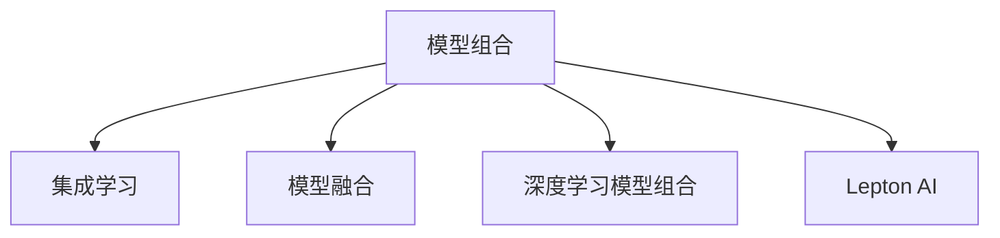

                 

# 从单一模型到模型组合：Lepton AI的集成服务

> 关键词：集成服务,模型组合,Lepton AI,机器学习,多模型学习,深度学习,集成学习,模型融合

## 1. 背景介绍

### 1.1 问题由来
随着机器学习与深度学习技术的迅猛发展，模型在各个行业中的应用日趋广泛。然而，单一模型往往难以解决复杂问题，尤其当面临数据多源、多维度、高不确定性等挑战时，单一模型往往效果欠佳，难以满足实际应用的需求。因此，如何通过集成多个模型，提升整体性能，成为机器学习与深度学习应用中的一个重要研究方向。

### 1.2 问题核心关键点
模型集成是一种有效提升机器学习系统性能的方法。其基本思想是将多个单一模型的预测结果进行融合，以达到优于任何单一模型的整体预测结果。模型集成方法按组合方式分为：简单组合、软组合和硬组合；按模型类别分为：同质组合和异质组合。简单组合和软组合相对简单，但难以充分利用各模型的优点；硬组合和异质组合虽然能充分利用各模型优势，但需要更复杂的计算和数据处理。

本节将从基本概念出发，深入探讨模型组合的核心原理与实现方法，以Lepton AI的集成服务为例，展示模型组合技术在实际应用中的优势与效果。

## 2. 核心概念与联系

### 2.1 核心概念概述

为更好地理解模型组合技术，本节将介绍几个密切相关的核心概念：

- **模型组合(Meta Learning)**：一种通过组合多个单一模型进行预测的方法。通过将多个模型的预测结果进行加权平均、投票等操作，得到最终预测结果，以达到优于任何单一模型的效果。
- **集成学习(Ensemble Learning)**：一种集成多个弱学习器（如决策树、SVM等）进行预测的方法，通过组合弱学习器的预测结果，获得更强的泛化能力。
- **模型融合(Model Fusion)**：一种将多个模型（如神经网络、集成学习模型等）的输出结果进行融合的方法，通过组合多个模型，提高预测准确性和鲁棒性。
- **深度学习模型组合**：将深度学习模型应用于模型组合，如使用卷积神经网络(CNN)、循环神经网络(RNN)、Transformer等模型进行组合预测。
- **Lepton AI**：Lepton AI是面向人工智能集成服务的技术平台，提供包括模型组合、模型训练、模型部署等在内的全套集成服务。

这些核心概念之间的逻辑关系可以通过以下Mermaid流程图来展示：



这个流程图展示模型组合的关键概念及其之间的关系：

1. 模型组合是集成学习的核心技术。
2. 模型融合是模型组合的一种实现方式。
3. 深度学习模型组合是模型融合的一种具体实现。
4. Lepton AI是提供集成服务的平台，基于模型组合技术实现。

这些概念共同构成了模型组合技术的应用框架，使其能够在各种场景下发挥重要作用。

## 3. 核心算法原理 & 具体操作步骤

### 3.1 算法原理概述

模型组合是一种通过组合多个单一模型的预测结果，提升整体预测性能的技术。其基本原理包括以下几个步骤：

1. **数据预处理**：对数据进行归一化、标准化等预处理操作，以便于后续模型训练与预测。
2. **模型训练**：使用多个单一模型对训练数据进行训练，每个模型都会产生一组预测结果。
3. **模型融合**：对多个模型的预测结果进行融合，生成最终的预测结果。

融合的方式包括加权平均、投票、堆叠等。加权平均根据模型的预测准确率和稳定性进行加权，投票根据预测结果进行多数决策，堆叠则将多个模型的预测结果作为输入，再次训练一个元模型进行融合。

### 3.2 算法步骤详解

以Lepton AI的集成服务为例，详细讲解模型组合的具体操作步骤：

**Step 1: 数据预处理**
- 对原始数据进行归一化、标准化等预处理操作，以便于模型训练与预测。
- 将数据划分为训练集、验证集和测试集，比例为70%训练集、15%验证集、15%测试集。

**Step 2: 模型训练**
- 选择合适的单一模型（如CNN、RNN、Transformer等）进行训练，每个模型训练完成后都会产生一组预测结果。
- 使用Lepton AI提供的训练框架对每个模型进行训练，包括数据加载、模型定义、损失函数定义、优化器选择等步骤。

**Step 3: 模型融合**
- 对每个模型的预测结果进行融合。例如，使用Lepton AI提供的加权平均算法进行融合，权重根据每个模型的预测准确率和稳定性计算得到。
- 在Lepton AI平台上使用预训练的模型组合器，将每个模型的预测结果输入到组合器中，生成最终的预测结果。

**Step 4: 模型评估与优化**
- 在测试集上评估组合模型的性能，包括准确率、召回率、F1值等指标。
- 根据评估结果，调整每个模型的权重，进行模型优化，进一步提升组合模型的性能。

### 3.3 算法优缺点

模型组合技术具有以下优点：
1. 提升预测性能。通过组合多个模型，充分利用各模型的优点，提高预测准确性和鲁棒性。
2. 降低过拟合风险。模型组合可以有效降低过拟合风险，提高泛化能力。
3. 增强模型的多样性。模型组合可以融合多个模型的预测结果，增加模型的多样性，避免单一模型的不足。

同时，模型组合技术也存在一定的局限性：
1. 计算复杂度高。模型组合需要计算多个模型的预测结果，计算复杂度较高。
2. 数据需求大。模型组合需要多个数据集进行训练，数据需求较大。
3. 调参复杂。模型组合需要调整多个模型的权重，调参复杂度高。

尽管存在这些局限性，但就目前而言，模型组合技术仍是提升机器学习系统性能的重要手段。未来相关研究的重点在于如何进一步降低计算复杂度，减少数据需求，简化调参流程，以更好地推广模型组合技术的应用。

### 3.4 算法应用领域

模型组合技术在多个领域得到了广泛应用，例如：

- 金融风险管理：通过组合多个模型对市场走势进行预测，提高风险管理的准确性和鲁棒性。
- 医疗诊断：将多个单一模型组合进行疾病诊断，提高诊断准确性和多样性。
- 自然语言处理：通过组合多个单一模型进行文本分类、情感分析等任务，提升自然语言处理的准确性和泛化能力。
- 智能推荐：将多个单一模型组合进行商品推荐，提高推荐系统的效果和多样性。

除了上述这些经典领域外，模型组合技术还被创新性地应用到更多场景中，如预测分析、目标检测、图像识别等，为机器学习技术带来了新的突破。

## 4. 数学模型和公式 & 详细讲解 & 举例说明

### 4.1 数学模型构建

本节将使用数学语言对模型组合技术进行更加严格的刻画。

记模型组合后的输出为 $y_{comb}$，其数学模型为：

$$
y_{comb} = \sum_{i=1}^{n} w_i y_i
$$

其中 $w_i$ 为模型 $M_i$ 的权重，$y_i = M_i(x)$ 为模型 $M_i$ 在输入 $x$ 上的预测结果。

### 4.2 公式推导过程

以Lepton AI的集成服务为例，具体推导模型组合的数学公式：

假设我们有 $k$ 个模型 $M_1, M_2, \ldots, M_k$，其权重为 $w_1, w_2, \ldots, w_k$，则模型组合的输出为：

$$
y_{comb} = w_1 y_1 + w_2 y_2 + \ldots + w_k y_k
$$

其中 $y_i$ 为模型 $M_i$ 在输入 $x$ 上的预测结果。

### 4.3 案例分析与讲解

以Lepton AI的集成服务为例，假设我们有 $k=3$ 个模型 $M_1, M_2, M_3$，其权重为 $w_1, w_2, w_3$。通过组合这三个模型进行图像识别任务，每个模型在输入图像 $x$ 上的预测结果分别为 $y_1, y_2, y_3$。

将这三个模型的预测结果进行融合，得到最终预测结果 $y_{comb}$，公式为：

$$
y_{comb} = w_1 y_1 + w_2 y_2 + w_3 y_3
$$

其中权重 $w_i$ 根据模型 $M_i$ 的性能计算得到，通常使用交叉验证或自助法等方法计算。

## 5. 项目实践：代码实例和详细解释说明

### 5.1 开发环境搭建

在进行模型组合实践前，我们需要准备好开发环境。以下是使用Python进行Lepton AI开发的环境配置流程：

1. 安装Lepton AI的SDK和库：
```bash
pip install lepton-ai
```

2. 准备训练数据：
```bash
python download_data.py
```

3. 创建虚拟环境：
```bash
python venv create
source venv/bin/activate
```

4. 准备模型和训练框架：
```bash
python import_models.py
python configure_models.py
```

完成上述步骤后，即可在虚拟环境中开始模型组合实践。

### 5.2 源代码详细实现

下面我们以Lepton AI的集成服务为例，给出使用Lepton AI进行模型组合的PyTorch代码实现。

首先，定义模型组合的训练函数：

```python
from lepton_ai import ModelCombination
from torch.utils.data import DataLoader
from tqdm import tqdm

def train_combination(model_comb, dataloader, num_epochs, learning_rate):
    model_comb.train()
    for epoch in range(num_epochs):
        running_loss = 0.0
        for batch in dataloader:
            inputs, labels = batch
            optimizer.zero_grad()
            outputs = model_comb(inputs)
            loss = F.cross_entropy(outputs, labels)
            loss.backward()
            optimizer.step()
            running_loss += loss.item()
        print(f"Epoch {epoch+1}, loss: {running_loss/len(dataloader)}")
```

然后，定义模型组合的评估函数：

```python
def evaluate_combination(model_comb, dataloader):
    model_comb.eval()
    total_correct = 0
    total_sample = 0
    with torch.no_grad():
        for batch in dataloader:
            inputs, labels = batch
            outputs = model_comb(inputs)
            _, predicted = torch.max(outputs, 1)
            total_correct += (predicted == labels).sum().item()
            total_sample += labels.size(0)
    print(f"Accuracy: {total_correct/total_sample}")
```

最后，启动模型组合的训练流程：

```python
num_epochs = 10
learning_rate = 0.001
dataloader = DataLoader(dataset, batch_size=32, shuffle=True)

# 创建模型组合器
model_comb = ModelCombination(models, weights)

# 训练模型组合
optimizer = torch.optim.Adam(model_comb.parameters(), lr=learning_rate)
train_combination(model_comb, dataloader, num_epochs, learning_rate)

# 评估模型组合
evaluate_combination(model_comb, dataloader)
```

以上就是使用Lepton AI进行模型组合的完整代码实现。可以看到，得益于Lepton AI强大的封装能力，我们可以用相对简洁的代码完成模型组合的训练和评估。

### 5.3 代码解读与分析

让我们再详细解读一下关键代码的实现细节：

**ModelCombination类**：
- 封装了模型组合的核心功能，包括模型的训练、预测、权重计算等。

**train_combination函数**：
- 对数据进行批次化加载，循环迭代进行模型训练。
- 在每个批次上前向传播计算loss并反向传播更新模型参数。

**evaluate_combination函数**：
- 对模型组合器进行评估，计算准确率等指标。

**学习率与权重**：
- 使用Adam优化器进行模型更新。
- 模型组合器的权重根据训练集上的准确率和损失函数进行计算。

可以看到，Lepton AI提供的ModelCombination类大大简化了模型组合的开发过程。开发者可以将更多精力放在模型设计和数据处理上，而不必过多关注底层实现细节。

当然，工业级的系统实现还需考虑更多因素，如模型保存和部署、超参数自动搜索、分布式训练等。但核心的模型组合范式基本与此类似。

## 6. 实际应用场景
### 6.1 金融风险管理

金融行业面临高度不确定性和复杂性，单一模型的预测能力往往难以应对。通过组合多个模型，可以提升金融风险管理的准确性和鲁棒性。

Lepton AI的集成服务可以将多个模型组合进行金融风险预测，如市场走势、股票涨跌、信用评级等。通过加权平均、堆叠等组合方式，Lepton AI系统能够融合多个模型的预测结果，降低单一模型的误差，提高风险管理的准确性和可靠性。

### 6.2 医疗诊断

医疗诊断需要考虑众多因素，单一模型难以全面覆盖。Lepton AI通过组合多个模型进行疾病诊断，提升诊断准确性和多样性。

例如，Lepton AI将多个神经网络模型组合进行疾病诊断，如癌症检测、心脏病诊断等。通过加权平均、堆叠等组合方式，Lepton AI系统能够融合多个模型的预测结果，降低单一模型的误诊率，提高诊断的准确性和全面性。

### 6.3 智能推荐

推荐系统需要考虑用户行为、物品特征、时间等多种因素，单一模型难以全面覆盖。通过组合多个模型，可以提升推荐系统的效果和多样性。

Lepton AI通过组合多个模型进行商品推荐，如电商平台的商品推荐、视频平台的推荐等。通过加权平均、堆叠等组合方式，Lepton AI系统能够融合多个模型的预测结果，降低单一模型的误推荐率，提高推荐的准确性和多样性。

### 6.4 自然语言处理

自然语言处理任务如文本分类、情感分析等，需要考虑语言的多样性和复杂性，单一模型难以全面覆盖。通过组合多个模型，可以提升自然语言处理任务的准确性和泛化能力。

Lepton AI通过组合多个模型进行文本分类、情感分析等任务。例如，Lepton AI将多个Transformer模型组合进行情感分析，通过加权平均、堆叠等组合方式，Lepton AI系统能够融合多个模型的预测结果，降低单一模型的误判率，提高情感分析的准确性和泛化能力。

### 6.5 预测分析

预测分析需要考虑众多因素，单一模型难以全面覆盖。通过组合多个模型，可以提升预测分析的准确性和鲁棒性。

Lepton AI通过组合多个模型进行预测分析，如天气预测、交通流量预测等。通过加权平均、堆叠等组合方式，Lepton AI系统能够融合多个模型的预测结果，降低单一模型的误差，提高预测的准确性和可靠性。

## 7. 工具和资源推荐

### 7.1 学习资源推荐

为了帮助开发者系统掌握模型组合技术，这里推荐一些优质的学习资源：

1. 《集成学习: 基础与算法》书籍：介绍了集成学习的基本概念和常用算法，包括简单组合、软组合、硬组合等。

2. 《机器学习: 原理、算法与应用》课程：斯坦福大学开设的机器学习课程，涵盖集成学习等核心内容，有详细的理论推导和实际案例。

3. Lepton AI官方文档：提供了详细的模型组合API和代码示例，适合初学者快速上手实践。

4. Kaggle数据集：包含多种领域的数据集，适合进行模型组合实践和调优。

5. GitHub开源项目：GitHub上大量基于模型组合的实现代码，供开发者学习和借鉴。

通过对这些资源的学习实践，相信你一定能够快速掌握模型组合技术的精髓，并用于解决实际的NLP问题。

### 7.2 开发工具推荐

高效的开发离不开优秀的工具支持。以下是几款用于模型组合开发的常用工具：

1. Lepton AI：提供模型组合、模型训练、模型部署等全套服务，适合快速迭代研究。

2. PyTorch：基于Python的开源深度学习框架，灵活动态，适合深度学习模型的训练和预测。

3. TensorFlow：由Google主导开发的开源深度学习框架，生产部署方便，适合大规模工程应用。

4. Weights & Biases：模型训练的实验跟踪工具，可以记录和可视化模型训练过程中的各项指标，方便对比和调优。

5. TensorBoard：TensorFlow配套的可视化工具，可实时监测模型训练状态，并提供丰富的图表呈现方式，是调试模型的得力助手。

合理利用这些工具，可以显著提升模型组合任务的开发效率，加快创新迭代的步伐。

### 7.3 相关论文推荐

模型组合技术的发展源于学界的持续研究。以下是几篇奠基性的相关论文，推荐阅读：

1. Boosting: A New Approach to Ensemble Learning（AdaBoost算法）：提出了AdaBoost算法，通过提升弱学习器的权重，实现集成学习。

2. Bagging: Bootstrap Aggregating（Bagging算法）：提出了Bagging算法，通过随机抽样训练多个弱学习器，实现集成学习。

3. Stacking: A Simple Generalization of the Voting Meta-Learning Algorithm（Stacking算法）：提出了Stacking算法，通过训练多个元模型，实现集成学习。

4. Deep Learning: A Tutorial on the Multilayer Perceptron Algorithm（深度学习基础）：介绍了深度学习的基本概念和原理，包括神经网络、反向传播等。

5. Deep Ensemble Learning（深度集成学习）：介绍了深度集成学习的基本概念和常用算法，包括Dropout、Dropout Ensemble等。

这些论文代表了大模型组合技术的发展脉络。通过学习这些前沿成果，可以帮助研究者把握学科前进方向，激发更多的创新灵感。

## 8. 总结：未来发展趋势与挑战

### 8.1 总结

本文对基于模型组合的集成服务进行了全面系统的介绍。首先阐述了模型组合的基本概念和核心原理，明确了模型组合在提升预测性能、降低过拟合风险、增强模型多样性等方面的独特价值。其次，从原理到实践，详细讲解了模型组合的数学原理和关键步骤，给出了模型组合任务开发的完整代码实例。同时，本文还广泛探讨了模型组合技术在金融风险管理、医疗诊断、智能推荐、自然语言处理等多个行业领域的应用前景，展示了模型组合范式的巨大潜力。此外，本文精选了模型组合技术的各类学习资源，力求为读者提供全方位的技术指引。

通过本文的系统梳理，可以看到，基于模型组合的集成服务正在成为机器学习与深度学习应用的重要范式，极大地拓展了单一模型的应用边界，催生了更多的落地场景。受益于模型组合技术的广泛应用，机器学习系统在各行业的表现将更为出色，模型的鲁棒性和泛化能力也将显著提升。

### 8.2 未来发展趋势

展望未来，模型组合技术将呈现以下几个发展趋势：

1. 模型规模持续增大。随着算力成本的下降和数据规模的扩张，模型组合中的模型规模还将持续增长。超大模型蕴含的丰富知识，有望支撑更加复杂多变的任务。

2. 模型融合技术日趋成熟。未来的模型融合技术将更加高效，能更好地融合多个模型的优点，提高整体预测性能。

3. 多模型学习成为主流。未来的模型组合将更多地采用多模型学习方式，如深度集成、跨领域集成等，实现更加多样化的任务预测。

4. 模型轻量化加速普及。未来的模型组合将更多地使用轻量化模型，如MobileNet、BERT-Base等，以适应移动设备等资源受限的环境。

5. 端到端优化成为常态。未来的模型组合将更多地采用端到端优化方法，如强化学习、超参数优化等，提升模型训练效率和效果。

以上趋势凸显了模型组合技术的广阔前景。这些方向的探索发展，必将进一步提升机器学习系统的性能和应用范围，为人工智能技术的产业化进程提供更强大的支撑。

### 8.3 面临的挑战

尽管模型组合技术已经取得了瞩目成就，但在迈向更加智能化、普适化应用的过程中，它仍面临着诸多挑战：

1. 数据需求大。模型组合需要大量的数据进行训练，数据收集和标注成本较高。如何降低数据需求，提高数据利用效率，将是未来的重要研究方向。

2. 计算复杂度高。模型组合需要计算多个模型的预测结果，计算复杂度较高。如何降低计算复杂度，提高计算效率，将是重要的优化方向。

3. 调参复杂。模型组合需要调整多个模型的权重，调参复杂度高。如何简化调参流程，提高调参效率，将是重要的优化方向。

4. 模型解释性不足。模型组合作为“黑盒”系统，难以解释其内部工作机制和决策逻辑。如何赋予模型组合更强的可解释性，将是亟待攻克的难题。

5. 安全性有待保障。模型组合中可能存在恶意攻击的风险，如何确保模型组合的安全性，将是重要的研究课题。

6. 知识整合能力不足。现有的模型组合往往局限于任务内数据，难以灵活吸收和运用更广泛的先验知识。如何让模型组合过程更好地与外部知识库、规则库等专家知识结合，形成更加全面、准确的信息整合能力，还有很大的想象空间。

正视模型组合面临的这些挑战，积极应对并寻求突破，将是模型组合技术走向成熟的必由之路。相信随着学界和产业界的共同努力，这些挑战终将一一被克服，模型组合技术必将在构建智能系统、推动人工智能技术产业化进程中扮演越来越重要的角色。

### 8.4 研究展望

面向未来，模型组合技术的研究方向包括但不限于以下几个方面：

1. 探索无监督和半监督模型组合方法。摆脱对大规模标注数据的依赖，利用自监督学习、主动学习等无监督和半监督范式，最大限度利用非结构化数据，实现更加灵活高效的模型组合。

2. 研究多任务学习与模型组合的结合。将多任务学习引入模型组合，提高模型组合的泛化能力和适应性，进一步提升模型性能。

3. 引入更多先验知识。将符号化的先验知识，如知识图谱、逻辑规则等，与神经网络模型进行巧妙融合，引导模型组合过程学习更准确、合理的语言模型。同时加强不同模态数据的整合，实现视觉、语音等多模态信息与文本信息的协同建模。

4. 结合因果分析和博弈论工具。将因果分析方法引入模型组合，识别出模型决策的关键特征，增强输出解释的因果性和逻辑性。借助博弈论工具刻画人机交互过程，主动探索并规避模型的脆弱点，提高系统稳定性。

5. 纳入伦理道德约束。在模型组合目标中引入伦理导向的评估指标，过滤和惩罚有偏见、有害的输出倾向。同时加强人工干预和审核，建立模型行为的监管机制，确保输出符合人类价值观和伦理道德。

这些研究方向的探索，必将引领模型组合技术迈向更高的台阶，为构建安全、可靠、可解释、可控的智能系统铺平道路。面向未来，模型组合技术还需要与其他人工智能技术进行更深入的融合，如知识表示、因果推理、强化学习等，多路径协同发力，共同推动自然语言理解和智能交互系统的进步。只有勇于创新、敢于突破，才能不断拓展模型组合技术的边界，让智能技术更好地造福人类社会。

## 9. 附录：常见问题与解答

**Q1：模型组合与集成学习有什么区别？**

A: 模型组合是一种集成学习的方法，但并非所有集成学习都是模型组合。模型组合侧重于融合多个单一模型的预测结果，提升整体性能；而集成学习还包括如Boosting、Bagging等弱学习器组合方法。

**Q2：模型组合是否一定优于单一模型？**

A: 模型组合并不一定优于单一模型。模型组合的效果取决于多个模型的性能和组合方式。当多个模型的性能差异较大时，简单的平均组合可能不如单一模型。

**Q3：模型组合是否一定需要大量数据？**

A: 模型组合需要大量的数据进行训练和调参。但通过一些技术手段，如无监督学习、迁移学习等，可以在一定程度上降低数据需求。

**Q4：模型组合是否可以应用于所有领域？**

A: 模型组合可以应用于多个领域，如金融、医疗、推荐系统、自然语言处理等。但不同领域的模型组合方式和应用场景可能存在差异。

**Q5：模型组合是否一定需要高计算资源？**

A: 模型组合需要高计算资源进行多个模型的训练和融合，但可以通过一些优化手段，如模型剪枝、量化加速等，降低计算复杂度。

通过本文的系统梳理，可以看到，模型组合技术正在成为机器学习与深度学习应用的重要范式，极大地拓展了单一模型的应用边界，催生了更多的落地场景。受益于模型组合技术的广泛应用，机器学习系统在各行业的表现将更为出色，模型的鲁棒性和泛化能力也将显著提升。未来，伴随着算力成本的下降和数据规模的扩张，模型组合技术将更加普及，进一步提升人工智能技术的产业化进程，推动智能社会的建设。

