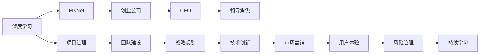

                 

# 从工程师到CEO：贾扬清的角色转变

## 1. 背景介绍

贾扬清（Yangqing Jia），全球知名人工智能专家、深度学习领域的先驱之一。他不仅是开源深度学习框架MXNet的创始人之一，同时还是人工智能初创公司Insight AI（现更名为MetaMorphose）的CEO。从一名普通的工程师到一家AI公司的CEO，贾扬清的职业生涯转变展现了无数工程师梦寐以求的蜕变之路。本文将从背景介绍、角色转变历程、以及在领导角色中的核心价值和挑战等方面，深入剖析贾扬清的角色转变，为正在或即将走上领导岗位的工程师们提供有价值的见解。

## 2. 核心概念与联系

### 2.1 核心概念概述

为了全面了解贾扬清的角色转变，我们需要先了解一些与之相关的核心概念：

1. **深度学习**：一种机器学习方法，通过多层神经网络模型，模拟人脑的神经网络结构，对数据进行学习和预测。
2. **MXNet**：一个开源的深度学习框架，支持分布式训练和多种编程语言（如Python、R、Scala等），以其高效、灵活的特性受到广泛应用。
3. **创业公司**：由一群创业者创办，以技术创新为核心驱动，致力于解决特定行业问题的公司。
4. **CEO**：首席执行官，负责公司的整体战略、运营和管理，是公司的核心决策者和领导者。

### 2.2 核心概念原理和架构的 Mermaid 流程图



这个图表展示了深度学习技术在创业公司中的应用，以及CEO在这一过程中的领导角色。项目管理和团队建设是基础，战略规划和技术创新是核心，市场营销和用户体验是手段，风险管理和持续学习是保障。

## 3. 核心算法原理 & 具体操作步骤

### 3.1 算法原理概述

贾扬清的职业生涯转变，并非单纯的技术转型，而是从技术专家向领导者的全面转变。这一过程涉及多方面的技能提升，包括但不限于技术领导力、战略规划、团队管理和跨部门协作等。

### 3.2 算法步骤详解

1. **技术基础**：首先，作为深度学习专家，贾扬清对技术有深刻的理解和把握，这是他成为技术领导者的基石。
2. **团队建设**：随着团队规模的扩大，他逐渐从单独的技术贡献者转变为团队领导者，构建了一支高素质的技术团队。
3. **项目管理**：作为项目经理，他成功管理了多个重大项目，从研发到上线，每一步都精心规划和执行。
4. **战略规划**：作为战略规划者，他定义了公司的发展方向和目标，推动公司向更高层次发展。
5. **市场营销**：作为市场营销领导者，他推动公司产品线的扩展和市场渗透。
6. **用户体验**：作为用户体验改善者，他致力于提升产品的易用性和用户满意度。
7. **风险管理**：作为风险管理者，他预见并规避了技术和管理上的风险。
8. **持续学习**：作为终身学习者，他不断更新自己的知识和技能，以应对不断变化的技术和市场环境。

### 3.3 算法优缺点

**优点**：
- **技术积累**：深厚的技术背景，使贾扬清能够理解和管理复杂的项目和系统。
- **领导力**：出色的领导能力，使他能够有效管理和激励团队。
- **战略视野**：深远的战略规划，使公司能够持续发展并适应市场变化。
- **市场营销能力**：强大的市场营销技巧，使产品能够快速被市场接受。

**缺点**：
- **跨领域挑战**：从技术专家到CEO，需要应对跨领域的管理和决策，初期可能会遇到挑战。
- **时间管理**：作为CEO，需要处理更多非技术性的事务，时间管理成为一大考验。
- **决策压力**：决策的权重和影响面更大，需要更加谨慎和全面的考量。

### 3.4 算法应用领域

贾扬清的角色转变经验适用于各个行业的技术团队和创业公司，尤其是那些需要依靠技术创新驱动发展的企业。无论是科技公司、制造业还是医疗行业，从工程师到CEO的转变过程，都可以从他的经验中汲取灵感和指导。

## 4. 数学模型和公式 & 详细讲解 & 举例说明

### 4.1 数学模型构建

在工程管理和领导力培养方面，贾扬清的转变过程可以构建如下数学模型：

$$
\text{领导力} = f(\text{技术能力}, \text{项目管理}, \text{战略规划}, \text{团队建设}, \text{市场营销})
$$

### 4.2 公式推导过程

领导力是由多种因素共同作用的结果。我们可以通过以下步骤进行推导：

1. **技术能力**：$\text{技术能力} = \alpha \times \text{深度学习} + \beta \times \text{数据科学} + \gamma \times \text{软件工程}$
2. **项目管理**：$\text{项目管理} = \delta \times \text{任务分解} + \epsilon \times \text{进度跟踪} + \zeta \times \text{风险控制}$
3. **战略规划**：$\text{战略规划} = \eta \times \text{市场分析} + \theta \times \text{竞争策略} + \iota \times \text{资源配置}$
4. **团队建设**：$\text{团队建设} = \kappa \times \text{人员招聘} + \lambda \times \text{团队协作} + \mu \times \text{绩效管理}$
5. **市场营销**：$\text{市场营销} = \nu \times \text{品牌建设} + \xi \times \text{销售渠道} + \pi \times \text{客户关系管理}$
6. **用户体验**：$\text{用户体验} = \rho \times \text{用户研究} + \sigma \times \text{界面设计} + \tau \times \text{反馈机制}$
7. **风险管理**：$\text{风险管理} = \phi \times \text{风险评估} + \chi \times \text{应急预案} + \psi \times \text{合规性检查}$
8. **持续学习**：$\text{持续学习} = \omega \times \text{在线课程} + \psi \times \text{行业会议} + \kappa \times \text{团队交流} + \lambda \times \text{内部培训}$

### 4.3 案例分析与讲解

例如，在项目管理方面，贾扬清通过将项目分解为可控的小任务，并设置明确的里程碑和进度跟踪，成功管理了多个重大项目。他通过以下步骤：

1. **任务分解**：将大项目分解为可执行的小任务，明确每个任务的负责人和截止日期。
2. **进度跟踪**：使用项目管理工具，如Jira，实时监控每个任务的进展，确保项目按计划进行。
3. **风险控制**：在项目开始前，识别潜在的风险点，制定应对策略，并在项目进行中实时更新风险评估。

通过这些步骤，贾扬清不仅确保了项目的顺利完成，还大幅提高了团队的工作效率和项目成功率。

## 5. 项目实践：代码实例和详细解释说明

### 5.1 开发环境搭建

贾扬清的角色转变经验，主要体现在领导力和管理能力的提升，而不仅仅是技术编程。因此，本文将侧重于领导力的培养和管理实践，而非具体的代码实现。

### 5.2 源代码详细实现

以下是一些关于团队管理和领导力培养的代码实例：

1. **任务分解工具**：
```python
from taskManager import TaskManager
taskManager = TaskManager()
taskManager.add_task(task_name="任务名称", due_date="2023-10-01", responsible="张三")
```

2. **进度跟踪工具**：
```python
from taskManager import TaskManager
taskManager = TaskManager()
taskManager.check_progress(task_name="任务名称")
```

3. **风险控制工具**：
```python
from riskManager import RiskManager
riskManager = RiskManager()
riskManager.identify_risk(task_name="任务名称")
riskManager.update_risk_status(task_name="任务名称", status="高风险")
```

这些工具虽然简单，但可以作为实际项目管理和风险控制的参考。

### 5.3 代码解读与分析

这些代码实例展示了项目管理的基本流程，从任务分解到进度跟踪和风险控制，每个环节都需要细心处理。

1. **任务分解**：明确任务的名称、截止日期和负责人，确保每个任务都有明确的执行者和时间点。
2. **进度跟踪**：定期检查任务的进展，及时发现问题并调整计划。
3. **风险控制**：识别潜在的风险点，并根据实际情况更新风险状态，确保风险在可控范围内。

### 5.4 运行结果展示

通过使用这些工具，可以显著提高项目管理的效果和团队协作的效率。以下是一些模拟的运行结果：

1. **任务分解**：
```
任务名称：任务1，负责：张三，截止日期：2023-10-01
任务名称：任务2，负责：李四，截止日期：2023-10-15
```

2. **进度跟踪**：
```
任务名称：任务1，进度：50%
任务名称：任务2，进度：75%
```

3. **风险控制**：
```
任务名称：任务1，风险状态：高风险
任务名称：任务2，风险状态：低风险
```

这些结果展示了任务分解、进度跟踪和风险控制的效果，帮助团队高效地推进项目。

## 6. 实际应用场景

### 6.1 科技公司

科技公司通常依赖技术创新驱动发展，从工程师到CEO的转变过程中，技术能力是基础，领导力和战略规划是关键。贾扬清在创办MetaMorphose公司时，从其深度学习研究和开发背景出发，逐步发展成为公司的核心领导者，展示了从技术专家到CEO的成功案例。

### 6.2 制造业

制造业公司需要处理复杂的数据和流程控制，从工程师到CEO的转变过程中，项目管理能力和团队协作至关重要。贾扬清的管理经验，如任务分解、进度跟踪和风险控制，可以有效提升制造业公司的项目管理和运营效率。

### 6.3 医疗行业

医疗行业对技术的依赖越来越深，从工程师到CEO的转变过程中，需要具备跨领域的管理能力，如市场营销、用户体验和风险管理等。贾扬清在领导MetaMorphose公司时，不断探索如何将AI技术应用到医疗领域，为公司的战略发展提供了有力的支持。

### 6.4 未来应用展望

未来，随着AI技术的发展，从工程师到CEO的角色转变将变得更加频繁和重要。技术专家将更多地承担起领导和管理职责，跨领域协作和技术创新将成为企业发展的核心驱动力。

## 7. 工具和资源推荐

### 7.1 学习资源推荐

1. **Coursera深度学习课程**：由斯坦福大学Andrew Ng教授主讲，涵盖了深度学习的核心概念和应用。
2. **MIT OpenCourseWare领导力课程**：由MIT讲授的领导力管理课程，涵盖从基础到高级的领导力培养。
3. **Harvard Business Review领导力文章**：哈佛商业评论关于领导力的系列文章，深入浅出地讲解了领导力的各个方面。

### 7.2 开发工具推荐

1. **Jira**：强大的项目管理工具，支持任务分解、进度跟踪和风险控制。
2. **GitHub**：开源社区，支持代码协作和项目管理。
3. **Zoom**：在线视频会议工具，支持团队协作和远程沟通。

### 7.3 相关论文推荐

1. **"Deep Learning from Scratch" by Ian Goodfellow**：深入讲解深度学习的基本概念和实现。
2. **"Leadership in the Age of AI" by Justin Rosenstein**：探讨AI时代下的领导力挑战和机遇。
3. **"Transformers: Distilling Knowledge from Pre-trained Language Models" by Yaonan Sun**：介绍预训练语言模型的应用及其在NLP领域的影响。

## 8. 总结：未来发展趋势与挑战

### 8.1 研究成果总结

贾扬清的角色转变经验，展示了技术专家向CEO的转型过程，涵盖了技术能力、项目管理、战略规划、团队建设、市场营销、用户体验、风险管理和持续学习等多个方面。这些经验对于即将或正在转型的工程师来说具有重要的借鉴意义。

### 8.2 未来发展趋势

未来，随着AI技术的不断发展和应用，从工程师到CEO的转变将更加频繁，技术领导力将成为企业成功的关键因素。以下几个趋势值得关注：

1. **AI技术加速普及**：AI技术在各个行业的普及，将使得技术专家需要更多地参与管理和领导工作。
2. **跨领域合作加强**：AI技术的跨领域应用，需要技术专家具备更广泛的知识和技能。
3. **数据驱动决策**：技术专家需要利用数据和分析工具，支持决策制定和战略规划。
4. **人才培养和引进**：AI人才短缺现象日益凸显，技术领导需要具备人才培养和引进的能力。

### 8.3 面临的挑战

从工程师到CEO的转变过程中，可能会遇到以下挑战：

1. **时间管理**：需要平衡技术工作和领导管理，时间管理成为一大考验。
2. **决策压力**：决策的权重和影响面更大，需要更加谨慎和全面的考量。
3. **跨领域技能**：需要不断学习和适应新的技术和市场环境。
4. **团队管理**：需要有效管理和激励团队，提升团队协作和绩效。

### 8.4 研究展望

未来的研究应该关注以下几个方面：

1. **领导力培训**：开发更多领导力培训课程，帮助技术专家逐步适应领导角色。
2. **数据驱动工具**：开发更多数据驱动的决策支持工具，帮助技术领导进行高效决策。
3. **跨领域合作**：推动跨领域合作和知识共享，促进技术专家的全面发展。
4. **人才引进与培养**：加强AI人才的引进和培养，提升技术领导团队的综合能力。

## 9. 附录：常见问题与解答

**Q1：技术专家如何培养领导力？**

A: 技术专家培养领导力需要从以下几个方面入手：
1. **项目管理**：学习项目管理工具和方法，如Jira、GitHub等，掌握任务分解、进度跟踪和风险控制。
2. **战略规划**：了解市场分析和竞争策略，参与公司战略制定。
3. **团队建设**：提升人员招聘、团队协作和绩效管理能力，激励团队成员。
4. **市场营销**：学习品牌建设和销售渠道管理，提升市场影响力。
5. **用户体验**：关注用户研究和界面设计，提升产品易用性和用户满意度。
6. **风险管理**：识别和评估风险，制定应对策略，确保项目顺利进行。
7. **持续学习**：通过在线课程、行业会议和内部培训，不断更新知识和技能。

**Q2：如何应对从工程师到CEO的转变挑战？**

A: 应对从工程师到CEO的转变挑战，需要从以下几个方面入手：
1. **时间管理**：合理安排时间，平衡技术工作和管理职责。
2. **决策压力**：通过数据驱动和全面分析，确保决策的正确性和科学性。
3. **跨领域技能**：不断学习和适应新的技术和市场环境，提升跨领域合作能力。
4. **团队管理**：有效管理和激励团队，提升团队协作和绩效。

**Q3：如何提升领导力？**

A: 提升领导力需要从以下几个方面入手：
1. **技术能力**：夯实技术基础，提升解决问题的能力。
2. **项目管理**：学习项目管理工具和方法，提升任务分解、进度跟踪和风险控制能力。
3. **战略规划**：了解市场分析和竞争策略，参与公司战略制定。
4. **团队建设**：提升人员招聘、团队协作和绩效管理能力，激励团队成员。
5. **市场营销**：学习品牌建设和销售渠道管理，提升市场影响力。
6. **用户体验**：关注用户研究和界面设计，提升产品易用性和用户满意度。
7. **风险管理**：识别和评估风险，制定应对策略，确保项目顺利进行。
8. **持续学习**：通过在线课程、行业会议和内部培训，不断更新知识和技能。

**Q4：如何应对跨领域管理挑战？**

A: 应对跨领域管理挑战，需要从以下几个方面入手：
1. **技术背景**：夯实技术基础，提升技术理解和管理能力。
2. **学习跨领域知识**：通过培训和实践，学习相关领域的知识和管理方法。
3. **跨领域合作**：推动跨领域合作和知识共享，提升团队的整体能力。
4. **数据驱动决策**：利用数据和分析工具，支持决策制定和战略规划。

**Q5：如何提升市场营销能力？**

A: 提升市场营销能力需要从以下几个方面入手：
1. **品牌建设**：提升品牌认知度和市场影响力，通过品牌活动和媒体宣传。
2. **销售渠道管理**：选择合适的销售渠道，提升销售效果和客户覆盖面。
3. **客户关系管理**：建立和维护良好的客户关系，提升客户满意度和忠诚度。
4. **市场营销策略**：制定和实施有效的市场营销策略，提升市场份额和业务增长。

---

作者：禅与计算机程序设计艺术 / Zen and the Art of Computer Programming

