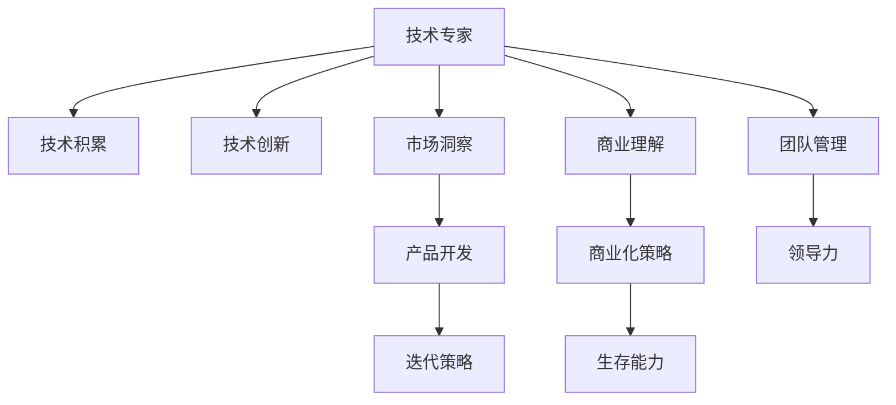

                 

# 从技术专家到科技创业者的转型之路

> 关键词：转型, 技术专家, 科技创业者, 技术管理, 产品开发, 创新驱动, 创业生存, 领导力, 商业化策略, 产品管理

## 1. 背景介绍

### 1.1 问题由来
在快速发展的科技行业，技术专家往往面临着一个挑战：从技术创新者到科技创业者的角色转型。科技创业者不仅需要具备深厚的技术背景，更需要理解市场、商业化运营、团队管理等复合能力。这种角色的转变，既充满机遇，也存在诸多挑战。本文将系统介绍技术专家如何从技术深入，跨越到科技创业者的角色转变，重点解析转型过程中所需的核心能力。

### 1.2 问题核心关键点
技术专家转型为科技创业者的过程中，核心关键点包括：
- 技术积累与创新能力
- 市场洞察与商业理解
- 团队管理与领导力
- 产品开发与迭代策略
- 商业化策略与生存能力

这些关键点共同构成技术专家转型为科技创业者的基本框架。本文将从以上各个维度，深入探讨技术专家的转型之路。

### 1.3 问题研究意义
研究技术专家向科技创业者转型的方法，对于推动技术创新和产业升级，具有重要意义：

1. 加速技术落地应用：科技创业者能够将技术转化为实际应用，推动技术在行业内的广泛应用。
2. 提升企业竞争力：科技创业者具备多维能力，能更有效地整合资源，提升企业核心竞争力。
3. 激发技术创新：科技创业者能够跨界融合多种技术，推动技术创新，开拓新的市场领域。
4. 优化产业生态：科技创业者能够搭建更好的生态系统，为技术进步提供良好的土壤。

## 2. 核心概念与联系

### 2.1 核心概念概述

为更好地理解技术专家向科技创业者转型的过程，本节将介绍几个密切相关的核心概念：

- **技术专家**：具备深厚技术背景，在特定技术领域内具有深入理解和应用能力的个人或团队。
- **科技创业者**：将技术转化为市场应用，具备市场洞察、商业理解、团队管理等多维能力的个体或组织。
- **技术积累**：在特定技术领域内长期的沉淀和实践经验。
- **技术创新**：在现有技术基础上进行突破和革新，推出具有竞争力的新技术或产品。
- **市场洞察**：理解市场需求、趋势和痛点，识别机会，为技术应用提供方向。
- **商业理解**：掌握商业模式、市场竞争、用户需求等商业要素，进行战略规划。
- **团队管理**：带领团队实现目标，协调资源，提高团队凝聚力和效率。
- **领导力**：在团队和个人层面展现出决策、激励和影响力。
- **产品开发**：从市场洞察到需求分析，再到产品设计、开发、测试、上线，实现从0到1的过程。
- **迭代策略**：通过快速迭代和反馈优化，不断提升产品竞争力。
- **商业化策略**：将技术转化为商业价值，实现从1到N的规模化。
- **生存能力**：在激烈的市场竞争中，保持企业可持续发展的能力。

这些核心概念之间的逻辑关系可以通过以下Mermaid流程图来展示：



这个流程图展示了这个转型的关键路径和所需的能力模块：

1. 技术专家通过技术积累和创新，形成核心技术。
2. 在技术应用时，结合市场洞察和商业理解，进行产品开发。
3. 产品开发过程中，团队管理与领导力至关重要。
4. 通过迭代策略和商业化策略，最终提升生存能力。

## 3. 核心算法原理 & 具体操作步骤
### 3.1 算法原理概述

技术专家转型为科技创业者的过程，本质上是一个从技术创新到商业应用的复杂过程。其核心思想是：将技术优势转化为市场竞争力，通过多维度能力提升，实现技术到商业的顺利跨越。

### 3.2 算法步骤详解

技术专家向科技创业者的转型可以按照以下步骤进行：

**Step 1: 技术积累与创新**
- 深入研究当前技术领域，掌握核心技术，积累丰富的技术经验。
- 保持技术的前沿性，持续关注最新技术进展，进行技术创新。

**Step 2: 市场洞察与商业理解**
- 通过调研、访谈、数据分析等方式，深入理解目标市场和用户需求。
- 分析市场竞争格局，识别市场机会和潜在风险，形成初步商业想法。

**Step 3: 团队管理与领导力提升**
- 构建合适的团队，吸纳不同背景的专业人才。
- 培养领导力，建立良好的团队文化，提升团队凝聚力。

**Step 4: 产品开发与迭代策略**
- 根据市场需求，设计产品原型，进行初步开发。
- 不断迭代优化产品，收集用户反馈，逐步提升产品竞争力。

**Step 5: 商业化策略与生存能力**
- 制定商业化策略，选择合适的商业模式，推动产品市场化。
- 通过有效的市场推广和销售策略，提高产品市场占有率。
- 关注财务健康，建立持续发展的商业模型，确保企业生存和增长。

### 3.3 算法优缺点

从技术专家到科技创业者转型的方法具有以下优点：
1. 综合运用多种能力，提升产品竞争力。
2. 技术专家深厚的技术背景为商业化提供坚实保障。
3. 创业过程更具系统性，风险可控。

同时，该方法也存在一定的局限性：
1. 需要较高的时间、资金投入，风险较高。
2. 需要具备多方面的复合能力，转型过程较长。
3. 转型初期，缺乏市场和商业经验，需要逐步积累。

尽管存在这些局限性，但就目前而言，从技术专家到科技创业者的转型方法仍是最主流和最有效的途径。未来相关研究的重点在于如何进一步优化转型过程，降低转型风险，同时兼顾技术深度和商业广度。

### 3.4 算法应用领域

技术专家的转型方法在多个行业领域都有应用，例如：

- 软件企业：从技术架构师到CTO的转型，推动企业技术创新和产品落地。
- 互联网公司：从技术工程师到产品经理的转变，实现技术到产品的无缝衔接。
- 硬件领域：从技术研发到市场推广的转变，提升产品市场占有率。
- 初创企业：技术专家加入初创团队，担任CTO或联合创始人，推动技术创新和商业化。

## 4. 数学模型和公式 & 详细讲解 & 举例说明
### 4.1 数学模型构建

本节将使用数学语言对技术专家向科技创业者转型的过程进行更加严格的刻画。

假设技术专家具备的技术能力为 $T$，市场洞察能力为 $M$，商业理解能力为 $B$，团队管理能力为 $C$，产品开发能力为 $P$，迭代策略能力为 $I$，生存能力为 $S$。转型目标为 $T_0$ 到 $T_1$，即从技术专家转型为科技创业者。

则转型过程的数学模型为：

$$
T_1 = f(T, M, B, C, P, I, S)
$$

其中 $f$ 为函数映射关系，代表技术专家通过多种能力提升和策略调整，最终实现转型。

### 4.2 公式推导过程

以下我们推导一个简化版的函数映射关系：

假设转型过程中，技术专家需要综合运用市场洞察能力、商业理解能力和产品开发能力。则有：

$$
T_1 = \alpha T + \beta M + \gamma B + \delta P
$$

其中 $\alpha, \beta, \gamma, \delta$ 为系数，代表各能力对转型的影响程度。

在实践中，不同领域和不同角色的 $\alpha, \beta, \gamma, \delta$ 的值可能不同。技术专家的能力提升，需要结合具体场景进行优化调整。

### 4.3 案例分析与讲解

假设一个软件开发工程师希望转型为CTO，市场洞察能力、商业理解能力和产品开发能力各占20%、30%和50%，则有：

$$
T_1 = 0.8T + 0.3M + 0.5P
$$

此时，该工程师需要在技术积累、市场洞察、商业理解、团队管理、产品开发等方面，综合提升以实现转型。

## 5. 项目实践：代码实例和详细解释说明
### 5.1 开发环境搭建

在进行转型实践前，我们需要准备好开发环境。以下是使用Python进行技术管理开发的常见环境配置流程：

1. 安装Anaconda：从官网下载并安装Anaconda，用于创建独立的Python环境。

2. 创建并激活虚拟环境：
```bash
conda create -n tech-management python=3.8 
conda activate tech-management
```

3. 安装必要的库：
```bash
pip install pandas numpy matplotlib sklearn jupyter notebook ipython
```

完成上述步骤后，即可在`tech-management`环境中开始技术管理实践。

### 5.2 源代码详细实现

这里我们以项目管理工具Trello为例，介绍如何使用Python进行团队任务管理和协作：

```python
import trello

# 创建Trello客户端
trello_api_key = 'your_api_key'
trello_api_secret = 'your_api_secret'
client = trello.Trello(trello_api_key, trello_api_secret)

# 创建Trello应用板
board_name = 'Project Management'
new_board = client.add_board(board_name)
board_id = new_board['id']

# 创建列表
lists = {
    'To Do': 'd6b34fa97c2d4a9090e39c4e',
    'In Progress': '7cf5e6fa1b814ac0a2dbed50',
    'Completed': '2849ece4dd1647f8a5712a7f',
}
for list_name, list_id in lists.items():
    client.add_list(board_id, list_name)

# 创建任务卡
card_data = {
    'name': 'Task 1',
    'description': 'Implement the core feature',
    'labels': ['To Do'],
    'due': '2023-01-01',
}
new_card = client.add_card(list_id, **card_data)

# 更新任务卡
client.update_card(new_card['id'], {'name': 'Task 1 - In Progress', 'labels': ['In Progress']})

# 关闭任务卡
client.update_card(new_card['id'], {'name': 'Task 1 - Completed', 'labels': ['Completed']})
```

以上代码实现了在Trello上创建应用板、添加任务列表、创建任务卡、更新任务状态和关闭任务卡的基本功能。

### 5.3 代码解读与分析

让我们再详细解读一下关键代码的实现细节：

**Trello客户端创建**：
- 使用Trello的官方Python库 `trello`，创建Trello客户端，并传入API Key和Secret。

**应用板创建**：
- 创建Trello应用板，命名并指定board ID。

**任务列表创建**：
- 创建三个任务列表，分别对应待办、进行中和完成状态。

**任务卡创建和更新**：
- 创建任务卡，并指定任务名称、描述、标签和截止日期。
- 通过更新任务卡的名称和标签，实现任务状态的变更。

**任务卡关闭**：
- 通过更新任务卡的名称和标签，完成任务卡的关闭。

可以看到，通过Python编程，可以轻松实现对Trello任务管理的自动化操作，极大提高了团队协作的效率。

## 6. 实际应用场景
### 6.1 软件公司项目管理
软件公司通常采用敏捷开发模式，需要高效的团队协作和任务管理。通过使用Trello等项目管理工具，可以实时跟踪任务进展，协调团队资源，提升开发效率。

### 6.2 产品上线流程管理
产品上线前，需要经过多个环节的审核和测试。通过建立明确的任务流程和责任人，使用项目管理工具进行任务分配和进度跟踪，确保产品按时上线。

### 6.3 技术文档管理
技术文档是团队协作和知识共享的重要工具。通过将文档任务化，定期更新，使用项目管理工具进行任务跟踪和文档版本管理，保持文档的及时性和准确性。

### 6.4 持续集成和部署
持续集成和部署是软件开发中的关键环节，通过项目管理工具进行任务编排和进度跟踪，确保代码按时发布和部署。

## 7. 工具和资源推荐
### 7.1 学习资源推荐

为了帮助开发者系统掌握技术管理的方法和实践，这里推荐一些优质的学习资源：

1. 《敏捷项目管理：原则、实践与工具》系列博文：详细介绍了敏捷开发模式、项目管理原则和最佳实践，适合项目管理者学习。

2. 《Scrum敏捷开发实战》课程：通过实际案例，讲解Scrum框架的应用，适合项目管理者和Scrum Master学习。

3. 《Kanban项目管理系统》书籍：介绍了Kanban管理方法，适用于软件团队协作和任务管理。

4. 《项目管理知识体系指南》(PMBOK)：项目管理领域权威指南，系统介绍了项目管理的各个方面。

5. 《DevOps：软件交付和持续集成与部署实践》书籍：介绍了DevOps理念和工具，适合软件工程和运维团队学习。

通过对这些资源的学习实践，相信你一定能够快速掌握技术管理的精髓，并用于解决实际的项目管理问题。

### 7.2 开发工具推荐

高效的开发离不开优秀的工具支持。以下是几款用于技术管理开发的常用工具：

1. Trello：在线任务管理工具，支持团队协作，实时跟踪任务进展。

2. Jira：专业的项目管理工具，适用于复杂的项目管理和任务跟踪。

3. GitHub：代码托管和版本控制工具，支持团队协作和代码审查。

4. Confluence：知识管理和文档协作工具，支持文档版本控制和共享。

5. Slack：实时通信和协作工具，支持团队成员的即时沟通和任务提醒。

合理利用这些工具，可以显著提升技术管理的效率，加快项目开发和部署的速度。

### 7.3 相关论文推荐

技术管理的发展源于学界的持续研究。以下是几篇奠基性的相关论文，推荐阅读：

1. "The Principles of Agile Development"：由Agile Manifesto的作者之一David Thomas撰写，系统介绍了敏捷开发的原则和实践。

2. "Kanban: Successful Evolutionary Change for Organizations"：Kanban方法的奠基论文，由David J. Anderson撰写，介绍了Kanban方法的应用和效果。

3. "Lean: The New Way to Run Your Business"：丰田精益生产方法，由James Womack和Daniel Jones合著，介绍了精益生产的基本原则和方法。

4. "The DevOps Handbook"：DevOps理念的权威书籍，由Patrick Debois和Jez Humble合著，介绍了DevOps的实践和工具。

5. "The Lean Startup: How Today's Entrepreneurs Use Continuous Innovation to Create Radically Successful Businesses"：Eric Ries的著作，介绍了精益创业和敏捷方法。

这些论文代表了大语言模型微调技术的发展脉络。通过学习这些前沿成果，可以帮助研究者把握学科前进方向，激发更多的创新灵感。

## 8. 总结：未来发展趋势与挑战

### 8.1 总结

本文对技术专家向科技创业者转型的过程进行了全面系统的介绍。首先阐述了转型过程的核心关键点，包括技术积累与创新、市场洞察与商业理解、团队管理与领导力、产品开发与迭代策略、商业化策略与生存能力等。其次，从原理到实践，详细讲解了转型的数学模型和关键步骤，给出了项目管理工具的具体使用实例。同时，本文还探讨了转型的实际应用场景和工具资源，为技术专家提供了转型的具体方法和案例分析。

通过本文的系统梳理，可以看到，技术专家向科技创业者转型的方法具有一定的系统性和可操作性。这一过程虽然充满挑战，但通过合理规划和努力，技术专家能够成功转型，实现从技术专家到科技创业者的顺利跨越。

### 8.2 未来发展趋势

展望未来，技术专家向科技创业者转型的方法将呈现以下几个发展趋势：

1. 敏捷开发和Scrum方法的普及：敏捷开发和Scrum方法将在更多企业中得到应用，提升项目管理的效率和灵活性。

2. Kanban管理的广泛采用：Kanban方法将帮助企业更好地进行任务管理和资源协调，提高项目的成功率。

3. DevOps理念的深入应用：DevOps文化将使软件开发和运维流程更加紧密结合，提升软件的持续交付和部署效率。

4. 团队协作工具的智能化：AI驱动的任务管理和协作工具将不断涌现，提升团队协作的智能化水平。

5. 项目管理方法的创新：结合AI和区块链技术，项目管理方法将不断创新，提升项目管理的科学性和公正性。

以上趋势凸显了技术管理的发展方向。这些方向的探索发展，必将进一步提升项目管理的效果，推动技术在更多领域的应用。

### 8.3 面临的挑战

尽管技术管理的发展取得了一定的进展，但在迈向更加智能化、高效化应用的过程中，仍然面临诸多挑战：

1. 团队协作难度：不同团队背景和专业技能的人合作，需要一定的协调和沟通成本。

2. 任务管理复杂度：项目任务多样化和复杂化，需要合理的任务分解和进度跟踪。

3. 持续集成和部署的稳定性：软件交付的频繁性带来持续集成和部署的稳定性问题。

4. 项目管理工具的易用性：复杂的管理工具可能导致用户的使用成本和误差。

5. 项目管理文化建设：建立良好的项目管理文化，提升团队成员的参与度和责任感。

6. 项目管理方法的普适性：不同项目规模和类型，需要不同的管理方法，灵活应对具有挑战。

正视这些挑战，积极应对并寻求突破，是推动技术管理不断进步的关键。相信随着学界和产业界的共同努力，这些挑战终将一一被克服，技术管理必将在构建高效、灵活的IT项目中扮演越来越重要的角色。

### 8.4 未来突破

面对技术管理所面临的种种挑战，未来的研究需要在以下几个方面寻求新的突破：

1. 引入AI技术优化项目管理：通过AI进行任务分配、进度预测和资源优化，提高项目管理的智能化水平。

2. 结合区块链技术提升项目透明度：利用区块链技术进行任务记录和审核，确保项目的公平和透明。

3. 推广DevOps文化，提升持续交付和部署效率：通过DevOps理念和工具，实现软件交付的高效和稳定。

4. 探索更灵活的项目管理方法：结合AI和区块链技术，探索更灵活、更高效的项目管理方法，适应不同类型的项目需求。

5. 提升团队协作效率：引入AI驱动的协作工具，提高团队沟通和协作的效率。

6. 构建更加规范的项目管理体系：建立标准化的项目管理流程和规范，提升项目管理的标准化和可重复性。

这些研究方向的探索，必将引领技术管理技术迈向更高的台阶，为构建高效、灵活的IT项目提供有力支撑。

## 9. 附录：常见问题与解答

**Q1：技术专家转型为科技创业者时，应该重点关注哪些能力提升？**

A: 技术专家转型为科技创业者时，重点需要提升以下几个能力：
1. 市场洞察：了解市场趋势、用户需求和竞争格局，形成初步商业想法。
2. 商业理解：掌握商业模式、市场竞争、用户需求等商业要素，进行战略规划。
3. 团队管理：构建合适的团队，吸纳不同背景的专业人才，培养领导力，提高团队凝聚力。
4. 产品开发：根据市场需求，设计产品原型，进行初步开发，迭代优化产品。
5. 商业化策略：选择合适的商业模式，推动产品市场化，提升市场占有率。

**Q2：如何应对技术管理过程中遇到的团队协作困难？**

A: 应对团队协作困难，可以采取以下措施：
1. 明确团队目标和责任：通过设定明确的目标和责任，提升团队成员的参与度和责任感。
2. 促进团队沟通：使用即时通信工具和定期会议，促进团队成员的沟通和交流。
3. 建立良好的团队文化：通过团队建设活动和团队奖励，提升团队的凝聚力和合作精神。
4. 使用协作工具：使用协作工具，如Trello、Jira等，提升任务分配和进度跟踪的效率。
5. 建立反馈机制：定期收集团队成员的反馈意见，及时调整和优化管理方法。

**Q3：如何选择适合的项目管理工具？**

A: 选择适合的项目管理工具，可以从以下几个方面考虑：
1. 工具的功能：根据项目需求，选择具备相应功能的工具，如任务分配、进度跟踪、文档协作等。
2. 工具的易用性：选择界面友好、操作简单的工具，降低用户的学习成本和使用难度。
3. 工具的稳定性：选择稳定可靠的工具，确保项目管理过程的连续性和安全性。
4. 工具的扩展性：选择具有良好扩展性和可定制性的工具，适应项目管理的动态变化。
5. 工具的集成性：选择与现有系统（如代码托管、文档管理、沟通工具）无缝集成的工具，提升工作效率。

**Q4：如何提高项目管理工具的易用性？**

A: 提高项目管理工具的易用性，可以从以下几个方面考虑：
1. 界面设计：设计简洁直观的界面，降低用户的学习成本和使用难度。
2. 操作流程：简化操作流程，减少不必要的步骤和复杂操作。
3. 用户引导：提供详细的使用指南和操作手册，帮助用户快速上手。
4. 实时反馈：提供及时的错误提示和操作反馈，降低用户的使用错误率。
5. 用户培训：定期开展用户培训，提升用户对工具的熟练度和使用技巧。

**Q5：如何提升项目管理的灵活性和适应性？**

A: 提升项目管理的灵活性和适应性，可以采取以下措施：
1. 采用敏捷开发方法：采用敏捷开发方法，如Scrum、Kanban等，提升项目管理的灵活性和适应性。
2. 引入AI技术：利用AI进行任务分配、进度预测和资源优化，提高项目管理的智能化水平。
3. 结合区块链技术：利用区块链技术进行任务记录和审核，确保项目的公平和透明。
4. 灵活的团队协作：根据项目需求，灵活调整团队结构和协作方式，提高团队的适应性。
5. 动态调整管理方法：根据项目进展和变化，及时调整和优化管理方法，确保项目顺利进行。

这些措施的实施，将有助于提升项目管理的效果和效率，使项目管理更加灵活和适应性强。

---

作者：禅与计算机程序设计艺术 / Zen and the Art of Computer Programming

