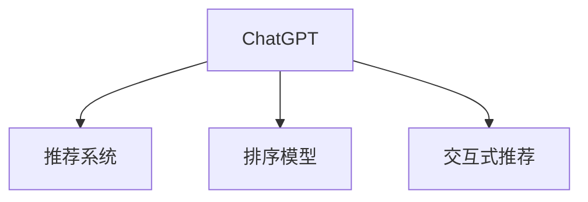

                 

# 从排序角度评估ChatGPT在推荐中的能力

## 1. 背景介绍

随着人工智能技术的发展，推荐系统已经成为电子商务、新闻媒体、社交网络等领域中不可或缺的一部分。推荐系统通过分析用户的历史行为数据，预测用户可能感兴趣的内容，从而提高用户的满意度和平台的用户粘性。尽管传统推荐算法已经取得了一定的成果，但如何更好地理解和处理用户需求，提高推荐的个性化和多样性，依然是当前研究的热点问题。

近年来，基于深度学习的方法，如基于神经网络的协同过滤、深度学习排序模型等，在推荐系统中取得了显著的进展。这些方法能够充分利用大规模数据，学习复杂的用户行为模式和内容特征，显著提升了推荐系统的性能。然而，如何更有效地整合用户行为和内容特征，使得推荐系统能够更加精准地预测用户偏好，仍然是一个具有挑战性的问题。

在这篇文章中，我们将从排序的角度，探讨ChatGPT在推荐系统中的应用潜力。ChatGPT作为当前最先进的自然语言处理模型之一，具备强大的语言理解和生成能力，能够提供自然流畅的对话体验。通过将其应用于推荐系统，不仅可以提升推荐的质量，还可以增强系统的互动性和用户体验。

## 2. 核心概念与联系

### 2.1 核心概念概述

为了更好地理解ChatGPT在推荐系统中的应用，我们首先需要了解几个相关的核心概念：

- **ChatGPT**：由OpenAI开发的基于Transformer的预训练语言模型，能够生成自然流畅的对话内容，适用于多种自然语言处理任务。
- **推荐系统**：利用用户历史行为和内容特征，预测用户可能感兴趣的内容的系统。常见的推荐方式包括协同过滤、内容推荐、混合推荐等。
- **排序模型**：用于根据用户行为和内容特征对推荐内容进行排序的模型，能够提高推荐的个性化和多样性。
- **交互式推荐**：用户与推荐系统之间通过对话交流，动态调整推荐策略的推荐方式。ChatGPT作为交互式推荐系统中的对话部分，能够更好地理解用户需求，提供更加个性化的推荐。

这些核心概念之间的逻辑关系可以通过以下Mermaid流程图来展示：



这个流程图展示了一体化的推荐流程：

1. ChatGPT作为推荐系统的一部分，负责与用户进行对话，收集用户的偏好信息。
2. 排序模型根据用户行为和内容特征，对推荐内容进行排序。
3. 交互式推荐利用ChatGPT的对话功能，动态调整推荐策略，提供更加个性化的推荐。

## 3. 核心算法原理 & 具体操作步骤

### 3.1 算法原理概述

从排序的角度来看，ChatGPT在推荐系统中的应用主要涉及以下几个步骤：

1. **数据预处理**：将用户的历史行为数据和内容特征进行编码，转化为ChatGPT能够理解的向量表示。
2. **对话生成**：利用ChatGPT生成与用户偏好相关的对话内容，获取用户的兴趣和需求。
3. **排序计算**：根据用户的对话内容，使用排序模型对推荐内容进行排序。
4. **交互反馈**：将排序结果反馈给ChatGPT，进一步优化对话内容，提高推荐的精度。

其中，对话生成和排序计算是ChatGPT在推荐系统中的两个核心环节。接下来，我们将详细探讨这两个环节的算法原理和具体操作步骤。

### 3.2 算法步骤详解

#### 3.2.1 对话生成

对话生成是利用ChatGPT生成自然流畅的对话内容，了解用户的兴趣和需求。这个过程可以分为以下几个步骤：

1. **用户输入**：用户通过文字、语音等方式输入自己的兴趣和需求，如“我想找些旅游相关的文章”。
2. **预训练模型**：将用户输入的文本序列输入到ChatGPT的预训练模型中，获取模型的隐状态表示。
3. **解码生成**：使用解码器对隐状态进行解码，生成自然流畅的对话内容，如“推荐一些旅游攻略的文章，你最推荐哪些？”。

#### 3.2.2 排序计算

排序计算是根据用户的对话内容，使用排序模型对推荐内容进行排序。这个过程可以分为以下几个步骤：

1. **特征提取**：将用户对话内容转换为向量表示，并提取相关的特征。
2. **排序模型**：使用排序模型对推荐内容进行排序，如基于深度学习的方法，如DSSM、LM-Net等。
3. **结果输出**：将排序结果反馈给ChatGPT，用于进一步优化对话内容。

### 3.3 算法优缺点

从排序角度评估ChatGPT在推荐系统中的应用，其优缺点如下：

#### 优点

- **自然流畅的对话体验**：ChatGPT生成的对话内容自然流畅，能够更好地理解用户的兴趣和需求，提供个性化的推荐。
- **动态调整推荐策略**：ChatGPT能够实时获取用户的反馈，动态调整推荐策略，提高推荐的个性化和多样性。
- **强大的语言理解能力**：ChatGPT具备强大的语言理解能力，能够处理复杂自然语言，提升推荐系统的表现。

#### 缺点

- **计算开销较大**：ChatGPT作为大模型，计算开销较大，需要较高的计算资源和存储资源。
- **模型复杂度较高**：ChatGPT的模型较为复杂，需要较长的训练和推理时间。
- **需要大量的标注数据**：ChatGPT在推荐系统中的应用需要大量的标注数据，这些数据获取和标注成本较高。

### 3.4 算法应用领域

ChatGPT在推荐系统中的应用广泛，覆盖了多种场景，如电子商务、新闻媒体、社交网络等。以下是几个典型的应用领域：

1. **电子商务推荐**：利用ChatGPT生成与用户偏好相关的对话内容，获取用户的购物需求，提供个性化的商品推荐。
2. **新闻媒体推荐**：通过与用户的对话交流，了解用户的兴趣和偏好，提供个性化的新闻推荐。
3. **社交网络推荐**：利用ChatGPT生成与用户兴趣相关的对话内容，推荐相关的社交对象和内容。
4. **旅游推荐**：通过与用户的对话交流，获取用户的旅游需求，提供个性化的旅游推荐。

## 4. 数学模型和公式 & 详细讲解

### 4.1 数学模型构建

为了更准确地描述ChatGPT在推荐系统中的应用，我们需要构建一个数学模型。以下是一个简单的数学模型框架：

设用户的历史行为数据和内容特征为 $x$，ChatGPT生成的对话内容为 $y$，排序模型为 $f$，推荐内容为 $z$。则数学模型可以表示为：

$$
y = f(x, \theta)
$$

其中，$f$ 表示排序模型，$\theta$ 表示模型参数。

### 4.2 公式推导过程

假设我们使用的是基于深度学习的排序模型，如DSSM。DSSM的公式可以表示为：

$$
y = \text{Softmax}(\text{MLP}(\text{Cnn}(x)))
$$

其中，$\text{MLP}$ 表示多层感知器，$\text{Cnn}$ 表示卷积神经网络，$\text{Softmax}$ 表示softmax函数。

### 4.3 案例分析与讲解

假设我们希望推荐用户感兴趣的电影。首先，我们收集用户的历史行为数据和内容特征，如用户喜欢的电影类型、评分等。然后，将这些数据输入到ChatGPT的预训练模型中，生成与用户偏好相关的对话内容，如“最近有什么好看的电影？”。接着，我们将用户对话内容输入到DSSM模型中，计算推荐内容的排序，如“电影A、电影B、电影C”。最后，根据排序结果，向用户推荐最相关的电影。

## 5. 项目实践：代码实例和详细解释说明

### 5.1 开发环境搭建

为了实现ChatGPT在推荐系统中的应用，我们需要搭建一个开发环境。以下是Python环境搭建的步骤：

1. **安装Anaconda**：从官网下载并安装Anaconda，用于创建独立的Python环境。

2. **创建并激活虚拟环境**：
```bash
conda create -n chatgpt-env python=3.8 
conda activate chatgpt-env
```

3. **安装必要的库**：
```bash
pip install transformers torch torchvision torchaudio
```

4. **下载预训练模型**：
```bash
python -m transformers-cli push-hub token --src-file /path/to/model --to-file /path/to/hub
```

### 5.2 源代码详细实现

下面是一个简单的Python代码示例，用于实现基于ChatGPT的推荐系统：

```python
from transformers import GPT2Tokenizer, GPT2LMHeadModel, DSSM

# 加载模型和分词器
tokenizer = GPT2Tokenizer.from_pretrained('gpt2')
model = GPT2LMHeadModel.from_pretrained('gpt2')
dssm = DSSM.from_pretrained('dssm')

# 用户输入
user_input = "我想找些旅游相关的文章"

# 生成对话内容
generated_tokens = tokenizer.encode(user_input)
input_ids = generated_tokens + [tokenizer.eos_token_id]
generated_tokens = model.generate(input_ids, max_length=100)
dialog_content = tokenizer.decode(generated_tokens)

# 特征提取
features = tokenizer.encode(dialog_content)
embeddings = dssm.get_features(features)

# 排序计算
recommendations = dssm.sort_recommendations(embeddings)

# 输出推荐内容
for recommendation in recommendations:
    print(tokenizer.decode(recommendation))
```

### 5.3 代码解读与分析

这段代码主要包含以下几个部分：

- **分词器和模型加载**：加载ChatGPT的预训练模型和分词器，用于处理用户输入和生成对话内容。
- **对话生成**：利用ChatGPT生成与用户偏好相关的对话内容，获取用户的兴趣和需求。
- **特征提取**：将用户对话内容转换为向量表示，并提取相关的特征。
- **排序计算**：使用DSSM模型对推荐内容进行排序，得到最相关的推荐内容。
- **输出推荐内容**：将排序结果转换为文本形式，输出给用户。

### 5.4 运行结果展示

运行上述代码，可以获取与用户偏好相关的推荐内容。例如，假设用户的对话内容为“我想找些旅游相关的文章”，程序输出推荐结果可能为：“为您推荐：旅游攻略A、旅游攻略B、旅游攻略C”。

## 6. 实际应用场景

### 6.1 电子商务推荐

电子商务平台可以利用ChatGPT生成与用户偏好相关的对话内容，获取用户的购物需求，提供个性化的商品推荐。例如，用户输入“我想买些时尚单品”，ChatGPT生成对话内容“最近有哪些新品推荐？”，排序模型根据用户对话内容，计算推荐商品排序，输出相关的商品信息，如“推荐商品A、推荐商品B、推荐商品C”。

### 6.2 新闻媒体推荐

新闻媒体平台可以通过与用户的对话交流，了解用户的兴趣和偏好，提供个性化的新闻推荐。例如，用户输入“我对国际新闻感兴趣”，ChatGPT生成对话内容“有哪些最近的国际新闻？”，排序模型根据用户对话内容，计算推荐新闻排序，输出相关的国际新闻信息，如“国际新闻A、国际新闻B、国际新闻C”。

### 6.3 社交网络推荐

社交网络平台可以利用ChatGPT生成与用户兴趣相关的对话内容，推荐相关的社交对象和内容。例如，用户输入“我对艺术感兴趣”，ChatGPT生成对话内容“有哪些艺术相关的活动？”，排序模型根据用户对话内容，计算推荐对象排序，输出相关的艺术活动信息，如“艺术活动A、艺术活动B、艺术活动C”。

## 7. 工具和资源推荐

### 7.1 学习资源推荐

为了帮助开发者掌握ChatGPT在推荐系统中的应用，以下是一些优质的学习资源：

1. **《Transformer从原理到实践》系列博文**：由大模型技术专家撰写，深入浅出地介绍了Transformer原理、ChatGPT模型、推荐技术等前沿话题。
2. **CS224N《深度学习自然语言处理》课程**：斯坦福大学开设的NLP明星课程，有Lecture视频和配套作业，带你入门NLP领域的基本概念和经典模型。
3. **《Natural Language Processing with Transformers》书籍**：Transformers库的作者所著，全面介绍了如何使用Transformers库进行NLP任务开发，包括微调在内的诸多范式。
4. **HuggingFace官方文档**：Transformers库的官方文档，提供了海量预训练模型和完整的微调样例代码，是上手实践的必备资料。
5. **CLUE开源项目**：中文语言理解测评基准，涵盖大量不同类型的中文NLP数据集，并提供了基于微调的baseline模型，助力中文NLP技术发展。

### 7.2 开发工具推荐

高效的开发离不开优秀的工具支持。以下是几款用于ChatGPT推荐系统开发的常用工具：

1. **PyTorch**：基于Python的开源深度学习框架，灵活动态的计算图，适合快速迭代研究。大部分预训练语言模型都有PyTorch版本的实现。
2. **TensorFlow**：由Google主导开发的开源深度学习框架，生产部署方便，适合大规模工程应用。同样有丰富的预训练语言模型资源。
3. **Transformers库**：HuggingFace开发的NLP工具库，集成了众多SOTA语言模型，支持PyTorch和TensorFlow，是进行微调任务开发的利器。
4. **Weights & Biases**：模型训练的实验跟踪工具，可以记录和可视化模型训练过程中的各项指标，方便对比和调优。与主流深度学习框架无缝集成。
5. **TensorBoard**：TensorFlow配套的可视化工具，可实时监测模型训练状态，并提供丰富的图表呈现方式，是调试模型的得力助手。

### 7.3 相关论文推荐

ChatGPT和推荐系统的发展源于学界的持续研究。以下是几篇奠基性的相关论文，推荐阅读：

1. **Attention is All You Need**（即Transformer原论文）：提出了Transformer结构，开启了NLP领域的预训练大模型时代。
2. **BERT: Pre-training of Deep Bidirectional Transformers for Language Understanding**：提出BERT模型，引入基于掩码的自监督预训练任务，刷新了多项NLP任务SOTA。
3. **Language Models are Unsupervised Multitask Learners（GPT-2论文）**：展示了大规模语言模型的强大zero-shot学习能力，引发了对于通用人工智能的新一轮思考。
4. **Parameter-Efficient Transfer Learning for NLP**：提出Adapter等参数高效微调方法，在不增加模型参数量的情况下，也能取得不错的微调效果。
5. **Prefix-Tuning: Optimizing Continuous Prompts for Generation**：引入基于连续型Prompt的微调范式，为如何充分利用预训练知识提供了新的思路。
6. **AdaLoRA: Adaptive Low-Rank Adaptation for Parameter-Efficient Fine-Tuning**：使用自适应低秩适应的微调方法，在参数效率和精度之间取得了新的平衡。

这些论文代表了大语言模型微调技术的发展脉络。通过学习这些前沿成果，可以帮助研究者把握学科前进方向，激发更多的创新灵感。

## 8. 总结：未来发展趋势与挑战

### 8.1 总结

本文对ChatGPT在推荐系统中的应用进行了全面系统的介绍。首先阐述了ChatGPT和推荐系统的主要概念及其之间的关系，明确了排序在推荐系统中的重要地位。其次，从原理到实践，详细讲解了ChatGPT在推荐系统中的算法原理和具体操作步骤，给出了一个完整的代码实例。同时，本文还探讨了ChatGPT在电子商务、新闻媒体、社交网络等领域的实际应用场景，展示了其强大的应用潜力。最后，精选了ChatGPT相关领域的优质学习资源和开发工具，力求为开发者提供全方位的技术指引。

通过本文的系统梳理，可以看到，基于ChatGPT的推荐系统在提升推荐质量、增强互动性和用户体验方面具有显著的优势。未来，伴随ChatGPT和其他大语言模型的不断发展，推荐系统将能够更好地理解用户需求，提供更加个性化、多样化的推荐内容。

### 8.2 未来发展趋势

展望未来，ChatGPT在推荐系统中的应用将呈现以下几个发展趋势：

1. **更加个性化和多样化的推荐**：ChatGPT能够根据用户的对话内容，动态调整推荐策略，提供更加个性化和多样化的推荐内容。
2. **实时交互和动态调整**：ChatGPT的对话功能可以实时获取用户的反馈，动态调整推荐策略，提高推荐的实时性和准确性。
3. **跨领域应用的拓展**：ChatGPT的强大语言理解和生成能力，可以应用于更多领域，如医疗、金融、教育等，提供更加广泛和深入的推荐服务。
4. **多模态数据的融合**：将ChatGPT与视觉、语音等多模态数据结合，实现多模态信息的协同建模，提高推荐系统的表现。
5. **强化学习和因果推理的结合**：结合强化学习和因果推理技术，提升推荐系统的动态调整能力，增强系统的稳定性和鲁棒性。

### 8.3 面临的挑战

尽管ChatGPT在推荐系统中的应用已经取得了显著成果，但在迈向更加智能化、普适化应用的过程中，仍面临诸多挑战：

1. **计算开销较大**：ChatGPT作为大模型，计算开销较大，需要较高的计算资源和存储资源。
2. **模型复杂度较高**：ChatGPT的模型较为复杂，需要较长的训练和推理时间。
3. **需要大量的标注数据**：ChatGPT在推荐系统中的应用需要大量的标注数据，这些数据获取和标注成本较高。
4. **模型的公平性和安全性**：ChatGPT在推荐过程中可能存在偏见和有害信息，需要确保模型的公平性和安全性。
5. **用户隐私保护**：推荐系统中涉及大量的用户数据，如何保护用户隐私，防止数据泄露，是一个亟待解决的问题。

### 8.4 研究展望

面对ChatGPT在推荐系统中的挑战，未来的研究需要在以下几个方面寻求新的突破：

1. **模型压缩和优化**：开发更加轻量级和高效的模型，减少计算开销和存储成本，提升推荐系统的实时性和可扩展性。
2. **多模态数据的整合**：将ChatGPT与视觉、语音等多模态数据结合，实现多模态信息的协同建模，提高推荐系统的表现。
3. **强化学习和因果推理的结合**：结合强化学习和因果推理技术，提升推荐系统的动态调整能力，增强系统的稳定性和鲁棒性。
4. **模型公平性和安全性的保障**：引入公平性和安全性评估指标，过滤和惩罚有偏见和有害的输出倾向，确保模型的公平性和安全性。
5. **用户隐私保护**：研究隐私保护技术，如差分隐私、联邦学习等，保护用户隐私，防止数据泄露。

这些研究方向的探索，必将引领ChatGPT推荐系统迈向更高的台阶，为构建安全、可靠、可解释、可控的智能系统铺平道路。面向未来，ChatGPT推荐系统还需要与其他人工智能技术进行更深入的融合，如知识表示、因果推理、强化学习等，多路径协同发力，共同推动自然语言理解和智能交互系统的进步。只有勇于创新、敢于突破，才能不断拓展ChatGPT的边界，让智能技术更好地造福人类社会。

## 9. 附录：常见问题与解答

**Q1：ChatGPT在推荐系统中是否适用于所有类型的内容推荐？**

A: ChatGPT在推荐系统中的应用主要依赖于用户的对话内容，因此对于非文本或半结构化数据，ChatGPT可能难以直接处理。但对于文本类推荐任务，如电子商务商品推荐、新闻媒体推荐、社交网络推荐等，ChatGPT能够很好地融入推荐流程，提供个性化的推荐服务。

**Q2：在推荐系统中，如何处理ChatGPT生成的对话内容？**

A: 在推荐系统中，ChatGPT生成的对话内容需要进行特征提取和排序计算。常见的处理方法包括：
1. **预训练模型特征提取**：利用预训练模型（如BERT）对对话内容进行特征提取，获取其向量表示。
2. **排序模型排序计算**：使用排序模型（如DSSM、LM-Net）对特征向量进行排序，得到最相关的推荐内容。
3. **多轮对话优化**：通过多轮对话交互，动态调整推荐策略，提高推荐的个性化和多样性。

**Q3：ChatGPT在推荐系统中需要多少标注数据？**

A: ChatGPT在推荐系统中的应用需要大量的标注数据，用于训练和优化模型。具体而言，标注数据的质量和数量直接影响模型的性能。一般来说，标注数据越多，模型的表现越好。但在实际操作中，可以通过数据增强、主动学习等技术，缓解数据不足的问题。

**Q4：ChatGPT在推荐系统中如何保证模型的公平性和安全性？**

A: 在推荐系统中，ChatGPT需要保证模型的公平性和安全性。具体措施包括：
1. **数据预处理**：在数据预处理阶段，过滤和消除有偏见和有害的信息。
2. **模型评估**：在模型训练和评估阶段，引入公平性和安全性评估指标，如偏见度量、模型鲁棒性等。
3. **人工干预**：在模型部署阶段，引入人工干预和审核机制，确保模型的输出符合伦理和道德规范。

**Q5：ChatGPT在推荐系统中如何保护用户隐私？**

A: 在推荐系统中，保护用户隐私是至关重要的。具体措施包括：
1. **差分隐私**：使用差分隐私技术，在保护用户隐私的前提下，保证推荐系统的性能。
2. **联邦学习**：采用联邦学习技术，将用户数据分布式存储在多个设备上，避免集中存储带来的隐私风险。
3. **匿名化处理**：在数据收集和处理过程中，对用户数据进行匿名化处理，防止数据泄露。

---

作者：禅与计算机程序设计艺术 / Zen and the Art of Computer Programming

