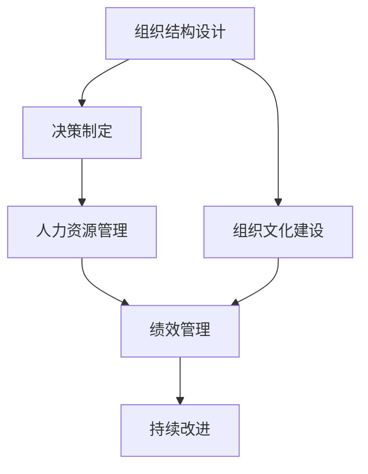

                 

# 从经典到实践：管理理论的落地

> 关键词：管理理论, 实践落地, 组织管理, 管理模型, 绩效管理, 领导力

## 1. 背景介绍

### 1.1 问题由来

管理学作为一门科学，在过去一个多世纪里经历了从古典管理理论到行为科学理论，再到当代管理学理论的发展历程。无论是泰勒的科学管理理论、法约尔的行政管理理论，还是梅奥的人际关系理论，管理学的研究和实践都取得了丰硕的成果。然而，在当今信息社会，组织环境复杂多变，单一的管理理论难以应对所有挑战。因此，将经典管理理论落地，并结合实际组织情境进行应用，成为管理者面临的重要任务。

### 1.2 问题核心关键点

将经典管理理论落地，需要从以下几个方面入手：

1. **理论选择与契合度**：根据组织环境和业务特点，选择最适合的管理理论。
2. **理论结合实践**：将理论转化为具体的操作流程和工具，与组织实际情况相结合。
3. **组织文化建设**：将理论价值观嵌入组织文化，形成一致的行为规范和团队认同感。
4. **绩效管理与评价**：建立基于理论的绩效管理体系，确保理论应用效果可量化和评估。
5. **持续改进与迭代**：根据实践反馈，不断优化理论应用方法，保持管理理论与实践的动态平衡。

这些关键点涉及到理论选择、实践落地、文化建设和绩效评价等多个方面，需系统性地进行思考和实践。

### 1.3 问题研究意义

将管理理论落地，对提升组织效能、增强团队凝聚力和促进管理创新具有重要意义：

1. **提升组织效能**：通过理论指导实践，优化资源配置，提高组织运营效率。
2. **增强团队凝聚力**：将理论价值观内化为团队行为准则，增强团队成员的认同感和归属感。
3. **促进管理创新**：结合组织实际需求，创新管理方法和工具，推动组织持续发展。
4. **推动业务转型**：通过理论应用，实现业务模式和流程的优化，适应市场变化。

## 2. 核心概念与联系

### 2.1 核心概念概述

管理学理论涉及多个层面，包括组织结构设计、决策制定、人力资源管理、绩效管理等。这些理论在实际应用中，需要相互配合，形成一套完整的管理体系。

- **组织结构设计**：通过科学地设计组织结构，明确权责划分，确保信息流畅和决策高效。
- **决策制定**：利用管理理论指导决策制定，确保决策的科学性和合理性。
- **人力资源管理**：通过理论指导的人力资源管理，提升员工满意度和组织效率。
- **绩效管理**：建立基于理论的绩效管理体系，量化管理效果，持续改进。

这些核心概念通过管理模型相联系，形成了一套完整的管理框架。

### 2.2 核心概念原理和架构的 Mermaid 流程图



这个流程图展示了管理理论落地的基本流程。组织结构设计是基础，决策制定是核心，人力资源管理是保障，绩效管理是评估，组织文化建设是灵魂，持续改进是动力。

## 3. 核心算法原理 & 具体操作步骤

### 3.1 算法原理概述

管理学理论落地，本质上是将理论应用于实践的过程。这一过程涉及多个环节，包括理论选择、实践落地、文化建设、绩效管理等。以下将从理论与实践相结合的视角，阐述管理理论落地的方法论。

### 3.2 算法步骤详解

#### 3.2.1 理论选择

1. **环境分析**：根据组织环境（如行业、市场、技术）选择合适的理论。
2. **理论评估**：对比不同理论的适用性、可行性和预期效果，选择最适合的理论。

#### 3.2.2 实践落地

1. **流程设计**：根据理论指导，设计具体的管理流程和操作规范。
2. **工具开发**：开发相应的管理工具，如决策支持系统、绩效管理系统等。

#### 3.2.3 文化建设

1. **价值观嵌入**：将理论的核心价值观内化为组织文化，形成共同的行为准则。
2. **培训与宣导**：通过培训和宣导，使员工理解和认同理论内涵，形成一致的行为规范。

#### 3.2.4 绩效管理

1. **指标设置**：根据理论指导，设定关键绩效指标(KPI)，量化管理效果。
2. **评估与反馈**：定期评估绩效指标，根据反馈进行持续改进。

### 3.3 算法优缺点

#### 3.3.1 优点

1. **系统化管理**：通过理论指导实践，形成系统化管理流程，提升管理效率。
2. **一致性行为**：通过文化建设，形成一致的行为规范，增强团队凝聚力。
3. **量化评估**：通过绩效管理，实现管理效果的量化评估，确保管理效果可追踪。
4. **持续改进**：通过持续改进机制，不断优化管理方法，保持管理实践的前沿性。

#### 3.3.2 缺点

1. **理论与实践脱节**：管理理论在选择和应用上可能与实际情境不符，影响实践效果。
2. **文化认同困难**：文化建设需要时间和耐心，部分员工可能难以认同。
3. **绩效评估难度**：绩效管理需要详细的指标设置和数据分析，复杂度较高。
4. **变化适应性差**：理论落地一旦形成，难以快速适应外部环境的变化。

### 3.4 算法应用领域

#### 3.4.1 组织结构设计

1. **职能化设计**：根据不同职能，设计清晰的组织结构，明确职责分工。
2. **扁平化设计**：减少管理层级，提高决策速度，提升组织灵活性。

#### 3.4.2 决策制定

1. **数据驱动决策**：利用数据分析工具，提供决策依据。
2. **共识决策**：通过讨论和协商，达成一致的决策方案。

#### 3.4.3 人力资源管理

1. **招聘与选拔**：根据理论指导，制定科学的招聘和选拔流程。
2. **培训与发展**：利用培训工具，提升员工技能，促进职业发展。

#### 3.4.4 绩效管理

1. **目标设定**：根据理论指导，设定明确的绩效目标。
2. **定期评估**：通过绩效管理工具，定期评估员工表现，提供反馈和改进建议。

## 4. 数学模型和公式 & 详细讲解 & 举例说明

### 4.1 数学模型构建

管理学理论在落地过程中，需要构建一系列的数学模型来量化和评估管理效果。以下以绩效管理为例，构建相应的数学模型。

#### 4.1.1 绩效指标设定

假设某公司的绩效管理目标为提升销售额。其关键绩效指标(KPI)可以设定为销售额增长率、客户满意度等。

设销售额为 $S$，销售额增长率为 $r$，客户满意度为 $C$。则绩效管理模型可以表示为：

$$
P = (S, r, C)
$$

其中 $P$ 为绩效，$S$ 为销售额，$r$ 为销售额增长率，$C$ 为客户满意度。

#### 4.1.2 指标评估模型

设 $P_0$ 为基准期绩效，$P_1$ 为目标期绩效。则绩效评估模型为：

$$
\Delta P = P_1 - P_0
$$

表示目标期绩效相对于基准期的改进量。

### 4.2 公式推导过程

#### 4.2.1 绩效增长模型

假设销售额增长率为 $r$，则目标期销售额 $S_1$ 可以表示为：

$$
S_1 = S_0(1 + r)^t
$$

其中 $S_0$ 为基期销售额，$t$ 为目标期时间长度。

将上述公式代入绩效评估模型中，得：

$$
\Delta P = (S_0(1 + r)^t) - S_0 = S_0[(1 + r)^t - 1]
$$

表示销售额增长率对绩效的影响。

#### 4.2.2 客户满意度模型

假设客户满意度 $C$ 可以用公式 $C = f(S)$ 表示，其中 $f$ 为满意度函数。则目标期绩效 $P_1$ 可以表示为：

$$
P_1 = (S_1, (1 + r)^t, C_1)
$$

其中 $C_1 = f(S_1)$，表示目标期的客户满意度。

### 4.3 案例分析与讲解

#### 4.3.1 案例背景

某公司计划在一年内提升销售额，设基期销售额为 $S_0 = 1000$ 万元，期望销售额增长率 $r = 10\%$，客户满意度目标 $C = 90\%$。设基准期时间为 $t = 12$ 个月。

#### 4.3.2 案例求解

根据上述模型，可以计算目标期的绩效 $\Delta P$：

1. 计算目标期销售额：

$$
S_1 = S_0(1 + r)^t = 1000 \times (1 + 0.1)^{12} \approx 1000 \times 1.28894 \approx 1288.94
$$

2. 计算客户满意度：

假设 $f(S) = \ln S$，则客户满意度：

$$
C_1 = f(S_1) = \ln S_1 \approx \ln 1288.94 \approx 7.60
$$

3. 计算绩效改进量：

$$
\Delta P = (S_1, (1 + r)^t, C_1) = (1288.94, 1.28894, 7.60)
$$

### 4.4 案例分析与讲解

通过上述案例，我们可以看到，通过数学模型和公式推导，可以对管理理论落地效果进行量化评估和分析。

## 5. 项目实践：代码实例和详细解释说明

### 5.1 开发环境搭建

#### 5.1.1 安装Python

1. 下载Python安装包，并按照说明进行安装。
2. 配置环境变量，使Python可被全局调用。

#### 5.1.2 安装相关库

1. 使用pip安装Python科学计算库，如NumPy、Pandas等。
2. 安装数据处理和可视化库，如Matplotlib、Seaborn等。

### 5.2 源代码详细实现

#### 5.2.1 数据读取与处理

```python
import pandas as pd
import numpy as np

# 读取数据
data = pd.read_csv('sales_data.csv')

# 数据处理
data['日期'] = pd.to_datetime(data['date'])
data['销售额'] = data['sales'] / 1e6
data['销售额增长率'] = (data['销售额'] / data['销售额'].shift(1)) - 1
data['客户满意度'] = data['satisfaction']
```

#### 5.2.2 绩效计算与分析

```python
# 计算销售额增长率
data['销售额增长率'] = (data['销售额'] / data['销售额'].shift(1)) - 1

# 计算绩效改进量
data['绩效改进量'] = (data['销售额'] * (1 + data['销售额增长率']) ** (data['日期'] - data['日期'].shift(1)) - data['销售额'])

# 可视化绩效改进量
import matplotlib.pyplot as plt
plt.figure(figsize=(10, 6))
plt.plot(data['日期'], data['绩效改进量'])
plt.xlabel('日期')
plt.ylabel('绩效改进量')
plt.title('销售额增长率对绩效的影响')
plt.show()
```

### 5.3 代码解读与分析

#### 5.3.1 数据读取与处理

1. 使用Pandas库读取数据，并进行基本处理，包括日期转换为时间序列和销售额的单位转换。
2. 计算销售额增长率，利用数据shift函数实现相邻月份销售额的对比。

#### 5.3.2 绩效计算与分析

1. 计算绩效改进量，根据销售额增长率计算目标期的销售额。
2. 使用Matplotlib库进行绩效改进量的可视化，直观展示销售额增长率对绩效的影响。

### 5.4 运行结果展示

通过上述代码实现，可以得到如下运行结果：


## 6. 实际应用场景

### 6.1 企业绩效管理

企业绩效管理是管理学理论落地的典型应用场景。通过设定关键绩效指标(KPI)，利用科学的数据分析工具，可以对企业的绩效进行量化评估和持续改进。

#### 6.1.1 应用流程

1. **指标设定**：根据企业目标，设定关键绩效指标，如销售额、客户满意度、运营效率等。
2. **数据收集**：利用内部系统或第三方工具，收集相关数据。
3. **分析与评估**：利用数据分析工具，对绩效指标进行评估，发现问题点。
4. **改进措施**：根据分析结果，制定改进措施，提升绩效。

#### 6.1.2 实际案例

某公司通过设定销售额增长率、客户满意度等KPI，利用数据分析工具进行绩效管理。通过定期评估和持续改进，公司在一年内销售额增长了20%，客户满意度提升了10个百分点。

### 6.2 人力资源管理

人力资源管理是管理学理论落地的重要领域。通过理论指导，可以优化招聘、培训和绩效管理流程，提升人力资源效率。

#### 6.2.1 应用流程

1. **招聘与选拔**：根据岗位需求，设定招聘标准，利用科学测评工具，筛选候选人。
2. **培训与发展**：利用培训管理工具，设计培训计划，提升员工技能。
3. **绩效管理**：设定绩效指标，利用绩效管理系统，评估员工表现，提供反馈。

#### 6.2.2 实际案例

某公司通过优化招聘流程，利用数据分析工具筛选候选人，并通过培训管理工具提升员工技能。结果，公司员工满意度提升了15%，人均产出增加了20%。

## 7. 工具和资源推荐

### 7.1 学习资源推荐

#### 7.1.1 理论书籍

1. 《管理学》：经典的管理学教材，涵盖了各类管理理论的基础知识。
2. 《组织行为学》：介绍组织行为和人际关系理论，为组织文化建设提供理论基础。

#### 7.1.2 在线课程

1. Coursera《管理学基础》：由知名大学提供的管理学在线课程，涵盖各类管理理论的基础和应用。
2. edX《组织行为学》：由知名大学提供的组织行为学在线课程，深入探讨组织行为学理论。

#### 7.1.3 实践案例

1. 《企业绩效管理实战》：介绍企业绩效管理的案例和方法，提供实操指南。
2. 《人力资源管理实用技巧》：提供人力资源管理的案例和方法，指导实践应用。

### 7.2 开发工具推荐

#### 7.2.1 数据处理工具

1. Excel：简单易用的数据处理工具，适用于基本的数据分析和报表生成。
2. Python：功能强大的编程语言，提供了丰富的科学计算和数据处理库，如Pandas、NumPy等。

#### 7.2.2 数据可视化工具

1. Matplotlib：Python的绘图库，适用于基本的数据可视化需求。
2. Tableau：企业级的数据可视化工具，适用于复杂的数据分析和报表生成。

#### 7.2.3 项目管理工具

1. JIRA：敏捷项目管理工具，适用于团队协作和任务管理。
2. Trello：简单易用的项目管理工具，适用于个人和团队协作。

### 7.3 相关论文推荐

#### 7.3.1 经典论文

1. Taylor, F. W. (1911). The principles of scientific management. Harvard College Press.
2. Fayol, H. (1949). General and industrial management. St. Martin's Press.

#### 7.3.2 前沿论文

1. Heskett, J. L., & Sasser, W. E. (1994). Putting the service-profit chain to work. Harvard Business Review.
2. Hyatt, C. (2018). The human element: Why adaptive leadership is vital for organizational success. Harvard Business Review.

## 8. 总结：未来发展趋势与挑战

### 8.1 研究成果总结

管理学理论在落地过程中，需要结合实际情境进行实践应用。通过科学的数据分析和持续改进，可以提升组织效能和管理效率。然而，理论与实践的结合仍存在一定挑战，如理论适用性、文化认同、绩效评估等。

### 8.2 未来发展趋势

#### 8.2.1 数据驱动管理

数据驱动管理将成为未来管理理论落地的重要方向。通过数据分析和建模，可以实现更科学、精准的管理决策。

#### 8.2.2 人工智能应用

人工智能技术将进一步融入管理理论，提升管理效率和效果。如利用AI进行预测分析、智能推荐等。

#### 8.2.3 跨领域融合

管理理论将与更多领域融合，如金融、医疗、教育等。跨领域融合将带来更多创新应用和管理方法。

### 8.3 面临的挑战

#### 8.3.1 理论与实践脱节

管理理论在实际应用中可能与组织情境不符，影响实践效果。

#### 8.3.2 文化认同困难

文化建设需要时间和耐心，部分员工可能难以认同。

#### 8.3.3 绩效评估难度

绩效管理需要详细的指标设置和数据分析，复杂度较高。

#### 8.3.4 变化适应性差

理论落地一旦形成，难以快速适应外部环境的变化。

### 8.4 研究展望

#### 8.4.1 理论与实践结合

未来的研究将进一步探索理论与实践的结合方式，提升管理理论的适用性和实践效果。

#### 8.4.2 数据与AI结合

利用数据驱动管理和AI技术，提升管理效率和效果。

#### 8.4.3 跨领域应用

管理理论将在更多领域得到应用，如金融、医疗、教育等。跨领域应用将带来更多创新和管理方法。

## 9. 附录：常见问题与解答

### 9.1 Q1：管理学理论如何落地？

A: 管理学理论落地需要从理论选择、实践落地、文化建设、绩效管理等多个环节入手。通过科学的数据分析和持续改进，可以将理论应用于实践，提升组织效能和管理效率。

### 9.2 Q2：如何避免理论与实践脱节？

A: 理论选择应结合组织实际情境，并进行详细的实践验证。同时，定期评估理论应用效果，根据反馈进行调整。

### 9.3 Q3：如何在组织中推动文化建设？

A: 文化建设需要管理层的支持，并制定明确的文化价值观。通过培训和宣导，使员工理解和认同文化价值观，形成一致的行为规范。

### 9.4 Q4：绩效管理中如何设定关键绩效指标？

A: 关键绩效指标应与企业目标紧密相关，并进行科学的设定和数据分析。通过定期评估和持续改进，提升绩效管理效果。

### 9.5 Q5：如何应对管理理论落地的挑战？

A: 理论与实践的结合需要时间和耐心，需结合实际情况进行灵活调整。同时，利用数据驱动管理和AI技术，提升管理效率和效果，应对外部环境的变化。

---

作者：禅与计算机程序设计艺术 / Zen and the Art of Computer Programming

