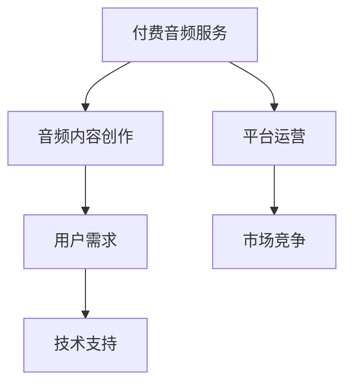

                 

# 付费音频要重视音频内容的趣味性和时长

## 1. 背景介绍

随着移动互联网和智能设备的普及，越来越多的人选择通过付费音频服务来获取知识和娱乐。付费音频行业的高速增长，催生了大量的内容创作者和平台，同时也带来了内容同质化、用户流失等问题。作为付费音频服务的提供者，如何在海量内容中脱颖而出，吸引和留住用户，是亟待解决的问题。

近年来，人们对于音频内容的需求不断变化，从简单的知识科普、教育内容转向更加多元、个性化、趣味化的内容。用户希望通过付费音频得到放松、学习和娱乐的复合体验，而不仅仅是单方面的信息传递。

## 2. 核心概念与联系

### 2.1 核心概念概述

为更好地理解付费音频内容的多样化需求，本节将介绍几个关键概念及其相互关系：

- **付费音频服务 (Paid Audio Service)**：提供付费订阅、单次购买等形式的音频内容服务，包括但不限于播客、故事、教育讲座等。
- **音频内容创作 (Audio Content Creation)**：音频内容创作者根据用户需求，创作原创音频内容，如音乐、小说、播客、教育讲座等。
- **用户需求 (User Demand)**：付费音频用户对于音频内容的多样化、个性化、趣味化需求，包括时长、内容风格、互动性等。
- **平台运营 (Platform Operation)**：音频内容平台通过算法、推荐系统等技术手段，优化用户体验，提高内容吸引力和留存率。
- **市场竞争 (Market Competition)**：付费音频市场吸引了众多竞争者进入，各平台通过差异化内容和差异化运营策略争夺用户。
- **技术支持 (Technical Support)**：音频内容生产和播放所需的技术支持，包括内容存储、播放流化、版权保护等。

这些概念之间存在紧密的联系：
- 用户需求驱动音频内容创作和平台运营。
- 平台运营通过技术手段支持音频内容创作和用户需求满足。
- 音频内容创作和平台运营共同决定了市场竞争力和用户留存率。
- 技术支持为音频内容生产和播放提供保障。

### 2.2 核心概念原理和架构的 Mermaid 流程图



这个流程图展示了付费音频服务、音频内容创作、用户需求、平台运营、市场竞争和技术支持之间的逻辑关系。其中，付费音频服务是核心，连接了音频内容创作、平台运营和用户需求。平台运营通过技术手段支持内容创作和用户需求满足，而市场竞争和技术支持则直接影响平台运营效果。

## 3. 核心算法原理 & 具体操作步骤
### 3.1 算法原理概述

基于用户需求和市场竞争，付费音频内容创作和平台运营需要设计一套高效的算法体系，以优化音频内容的趣味性和时长，提升用户满意度和留存率。

#### 3.1.1 算法体系结构

付费音频平台的核心算法体系主要分为以下几个模块：

1. **内容推荐模块 (Content Recommendation Module)**：根据用户历史行为和偏好，推荐个性化音频内容。
2. **内容创作模块 (Content Creation Module)**：根据用户需求，创作符合用户偏好的音频内容。
3. **用户行为分析模块 (User Behavior Analysis Module)**：分析用户收听习惯、偏好和反馈，优化内容推荐和创作。
4. **互动性增强模块 (Interactivity Enhancement Module)**：通过互动式内容设计，增强用户粘性。

这些模块之间相互协作，共同实现音频内容的趣味性和时长优化。

#### 3.1.2 核心算法流程

以下是付费音频平台核心算法流程的详细解释：

1. **用户行为数据收集 (User Behavior Data Collection)**
   - 通过用户收听数据、反馈数据、社交数据等，收集用户的多维度行为信息。
   - 使用数据清洗和预处理技术，确保数据的准确性和完整性。

2. **用户需求分析 (User Demand Analysis)**
   - 利用聚类、分类等机器学习算法，对用户行为数据进行分析，识别用户的多样化需求和偏好。
   - 使用文本分析、情感分析等自然语言处理技术，理解用户的情感状态和反馈。

3. **内容创作优化 (Content Creation Optimization)**
   - 基于用户需求分析结果，设计创意、主题和风格，创作符合用户偏好的音频内容。
   - 引入A/B测试等方法，优化音频内容的趣味性和时长。

4. **内容推荐优化 (Content Recommendation Optimization)**
   - 使用协同过滤、矩阵分解等推荐算法，根据用户历史行为数据和偏好，推荐个性化音频内容。
   - 结合用户反馈数据，不断调整推荐算法，提高推荐准确性和用户体验。

5. **互动性增强 (Interactivity Enhancement)**
   - 在音频内容设计中加入互动元素，如投票、评论、互动问答等，增强用户参与度。
   - 通过用户行为分析，识别互动元素的有效性，优化互动设计。

6. **效果评估与反馈 (Effectiveness Evaluation and Feedback)**
   - 定期评估音频内容推荐和创作的有效性，通过用户满意度、留存率等指标，进行效果评估。
   - 根据评估结果，调整算法策略，持续优化内容创作和推荐。

### 3.2 算法步骤详解

#### 3.2.1 用户行为数据收集

用户行为数据收集是用户需求分析和内容创作优化的基础。以下是具体的步骤：

1. **数据类型**
   - 收听数据：用户的收听历史、播放次数、播放时长等。
   - 反馈数据：用户的评分、评论、点赞等互动数据。
   - 社交数据：用户的社交网络关系、社交行为等。

2. **数据收集方式**
   - 应用日志：记录用户在使用应用时的行为数据。
   - API接口：通过API接口，获取用户的第三方社交数据。
   - 设备数据：通过设备传感器，获取用户的使用行为数据。

3. **数据清洗与预处理**
   - 去重与去除异常值：去除重复和异常的数据记录。
   - 数据填充：补全缺失数据，确保数据完整性。
   - 数据标准化：统一数据格式和单位，便于后续分析。

#### 3.2.2 用户需求分析

用户需求分析旨在通过机器学习算法，从用户行为数据中提取用户的偏好和需求，为内容创作提供指导。以下是具体的步骤：

1. **数据特征提取**
   - 收听特征：收听次数、收听时长、播放次数等。
   - 互动特征：点赞数、评论数、分享数等。
   - 社交特征：好友关系数、社交网络活跃度等。

2. **算法选择与训练**
   - 聚类算法：K-means、层次聚类等，将用户分为不同类型。
   - 分类算法：决策树、随机森林、梯度提升等，识别用户偏好。
   - 文本分析算法：TF-IDF、LDA等，分析用户评论的情感和主题。

3. **用户需求分类**
   - 基于聚类结果，将用户分为兴趣导向型、娱乐导向型、教育导向型等。
   - 基于分类结果，识别用户偏好的主题和风格，如科幻、历史、音乐等。

#### 3.2.3 内容创作优化

内容创作优化旨在根据用户需求，设计符合用户偏好的音频内容，提高内容趣味性和时长。以下是具体的步骤：

1. **内容设计**
   - 创意来源：根据用户需求，设计创意主题和风格。
   - 内容结构：设计音频内容的章节结构，增加趣味性和时长。
   - 互动元素：加入投票、评论、互动问答等互动元素，增强用户参与度。

2. **A/B测试**
   - 设计不同版本的音频内容，进行A/B测试。
   - 评估不同版本的表现，选择效果最好的版本。

3. **内容迭代**
   - 根据用户反馈和测试结果，不断调整和优化内容创作。
   - 引入专家评审，提高内容创作的专业性和质量。

#### 3.2.4 内容推荐优化

内容推荐优化旨在通过推荐算法，提升用户对推荐内容的满意度，提高平台留存率。以下是具体的步骤：

1. **推荐算法选择**
   - 协同过滤：基于用户历史行为和偏好推荐内容。
   - 矩阵分解：通过用户行为矩阵分解，找到相似用户和相似内容。
   - 深度学习：使用深度神经网络模型，如RNN、LSTM等，进行内容推荐。

2. **数据准备**
   - 用户行为数据：收集用户的收听历史、评分、评论等数据。
   - 内容数据：收集音频内容的特征，如标题、主题、作者等。

3. **推荐算法训练**
   - 模型训练：使用用户行为数据和内容数据，训练推荐模型。
   - 模型评估：使用交叉验证等方法，评估模型的推荐效果。

4. **推荐策略调整**
   - 根据用户反馈，调整推荐算法策略。
   - 引入推荐系统，提升推荐效果和用户体验。

#### 3.2.5 互动性增强

互动性增强旨在通过互动元素，增强用户粘性，提高用户留存率。以下是具体的步骤：

1. **互动元素设计**
   - 投票功能：允许用户在收听过程中投票，参与内容决策。
   - 评论功能：允许用户在收听过程中发表评论，进行互动交流。
   - 问答功能：允许用户在收听过程中提出问题，进行互动问答。

2. **互动元素部署**
   - 前端实现：通过前端技术，实现互动元素的展示和交互。
   - 后端支持：提供后端API接口，支持互动数据的收集和处理。

3. **互动效果评估**
   - 用户行为分析：通过用户行为数据，评估互动元素的效果。
   - 用户反馈收集：通过用户反馈，了解用户对互动元素的评价。

#### 3.2.6 效果评估与反馈

效果评估与反馈旨在通过用户满意度、留存率等指标，评估音频内容推荐和创作的有效性，进行持续优化。以下是具体的步骤：

1. **指标选择**
   - 用户满意度：通过问卷调查、满意度评分等方式，评估用户对音频内容的满意度。
   - 用户留存率：通过用户留存数据，评估平台的用户留存率。
   - 用户参与度：通过互动数据，评估用户对互动元素的参与度。

2. **数据收集**
   - 用户反馈：收集用户对音频内容的评价和反馈。
   - 行为数据：收集用户的收听行为、互动行为等数据。

3. **评估与优化**
   - 数据分析：通过数据分析，识别问题和改进点。
   - 策略调整：根据评估结果，调整内容推荐和创作策略。
   - 持续优化：通过不断迭代，提升音频内容的效果。

### 3.3 算法优缺点

#### 3.3.1 优点

1. **个性化推荐**
   - 基于用户行为数据和偏好，提供个性化推荐，提升用户满意度。

2. **内容优化**
   - 通过内容设计、A/B测试等方法，优化内容趣味性和时长，提高用户粘性。

3. **互动增强**
   - 通过互动元素设计，增强用户参与度和留存率。

#### 3.3.2 缺点

1. **数据隐私问题**
   - 用户行为数据的收集和使用，可能引发隐私保护问题。

2. **推荐算法复杂**
   - 推荐算法的实现和优化，需要较高的技术门槛和资源投入。

3. **互动元素管理**
   - 互动元素的设计和管理，需要持续更新和维护。

### 3.4 算法应用领域

付费音频平台的核心算法体系，已在多个领域得到应用：

1. **播客平台**
   - 通过个性化推荐和内容优化，提升播客的收听率和用户满意度。
   - 引入互动元素，增强播客的互动性和粘性。

2. **教育平台**
   - 通过个性化推荐和内容创作，提供符合用户需求的教育内容。
   - 利用互动元素，增强学习体验和用户参与度。

3. **音乐平台**
   - 通过个性化推荐和内容创作，推荐符合用户偏好的音乐内容。
   - 利用互动元素，增强音乐体验和用户粘性。

4. **故事平台**
   - 通过个性化推荐和内容创作，推荐符合用户需求的故事内容。
   - 利用互动元素，增强故事体验和用户参与度。

## 4. 数学模型和公式 & 详细讲解  
### 4.1 数学模型构建

基于用户需求和市场竞争，付费音频内容创作和平台运营需要设计一套高效的数学模型，以优化音频内容的趣味性和时长，提升用户满意度和留存率。

#### 4.1.1 用户需求模型

用户需求模型旨在通过机器学习算法，从用户行为数据中提取用户的偏好和需求。以下是具体的数学模型：

1. **用户需求聚类**
   - 使用K-means算法，将用户分为不同类型。
   - 通过聚类中心向量，表示不同类型的用户需求。

2. **用户需求分类**
   - 使用决策树算法，识别用户偏好的主题和风格。
   - 通过类别标签，表示用户偏好类型。

#### 4.1.2 内容创作模型

内容创作模型旨在根据用户需求，设计符合用户偏好的音频内容。以下是具体的数学模型：

1. **内容创意设计**
   - 通过创意生成模型，生成音频内容的创意主题和风格。
   - 通过优化算法，调整创意生成模型的参数，提高创意质量。

2. **内容结构设计**
   - 通过内容结构设计模型，生成音频内容的章节结构和时长。
   - 通过优化算法，调整内容结构设计模型的参数，提高内容趣味性和时长。

#### 4.1.3 内容推荐模型

内容推荐模型旨在通过推荐算法，提升用户对推荐内容的满意度。以下是具体的数学模型：

1. **协同过滤算法**
   - 使用基于用户历史行为和偏好的协同过滤算法，推荐个性化内容。
   - 通过矩阵分解，找到相似用户和相似内容。

2. **深度学习算法**
   - 使用深度神经网络模型，如RNN、LSTM等，进行内容推荐。
   - 通过优化算法，调整深度学习模型的参数，提高推荐效果。

### 4.2 公式推导过程

#### 4.2.1 用户需求聚类

用户需求聚类的数学模型为：

$$
K-means = \mathop{\arg\min}_{K, C} \sum_{k=1}^{K} \sum_{x \in C_k} ||x - \mu_k||^2
$$

其中，$K$ 为聚类数目，$C_k$ 为第$k$个聚类，$\mu_k$ 为第$k$个聚类的聚类中心。

#### 4.2.2 用户需求分类

用户需求分类的数学模型为：

$$
decision tree = \mathop{\arg\min}_{T} \sum_{i=1}^{N} L_{ij}^{decision tree} + \lambda \times |T|
$$

其中，$T$ 为决策树模型，$L_{ij}$ 为决策树模型的损失函数，$\lambda$ 为模型复杂度惩罚项。

#### 4.2.3 内容创意设计

内容创意设计的数学模型为：

$$
\hat{\theta} = \mathop{\arg\min}_{\theta} \frac{1}{N} \sum_{i=1}^{N} ||M_{\theta}(x_i) - y_i||^2
$$

其中，$M_{\theta}(x_i)$ 为内容创意生成模型，$y_i$ 为创意标签。

#### 4.2.4 内容结构设计

内容结构设计的数学模型为：

$$
\hat{\theta} = \mathop{\arg\min}_{\theta} \frac{1}{N} \sum_{i=1}^{N} \left[ l(x_i, y_i) + \lambda_1 \times ||\theta||^2 + \lambda_2 \times ||\delta(x_i) - \delta_0||^2 \right]
$$

其中，$l(x_i, y_i)$ 为内容结构设计模型的损失函数，$\delta(x_i)$ 为内容结构的优化目标，$\lambda_1$ 和 $\lambda_2$ 为正则化参数。

#### 4.2.5 内容推荐模型

内容推荐模型的数学模型为：

$$
\hat{y} = M_{\theta}(x)
$$

其中，$M_{\theta}(x)$ 为推荐模型，$x$ 为用户行为数据，$y$ 为用户推荐内容。

### 4.3 案例分析与讲解

#### 4.3.1 用户需求聚类

以播客平台为例，通过用户收听历史数据，使用K-means算法进行聚类，得到以下聚类结果：

- 聚类中心1：科幻、奇幻题材内容。
- 聚类中心2：历史、文化题材内容。
- 聚类中心3：情感、心理题材内容。

这些聚类结果可以用于指导内容创作和推荐，例如针对聚类中心1的用户，推荐科幻题材的播客内容。

#### 4.3.2 用户需求分类

以音乐平台为例，通过决策树算法进行分类，得到以下分类结果：

- 分类1：流行音乐。
- 分类2：古典音乐。
- 分类3：电子音乐。

这些分类结果可以用于指导内容推荐，例如针对分类1的用户，推荐流行音乐类音乐内容。

#### 4.3.3 内容创意设计

以播客平台为例，使用创意生成模型进行内容创意设计，生成以下创意主题和风格：

- 创意主题1：《未来科技》系列，探索未来科技的发展方向。
- 创意主题2：《历史长河》系列，回溯历史事件的变迁。

这些创意主题可以用于指导内容创作，例如创作《未来科技》系列的播客内容。

#### 4.3.4 内容结构设计

以播客平台为例，使用内容结构设计模型进行内容结构设计，生成以下章节结构和时长：

- 章节1：引言，时长3分钟。
- 章节2：主体，时长15分钟。
- 章节3：总结，时长5分钟。

这些章节结构和时长可以用于指导内容创作，例如创作《未来科技》系列的第1集播客内容，时长为23分钟。

#### 4.3.5 内容推荐模型

以播客平台为例，使用协同过滤算法进行内容推荐，得到以下推荐结果：

- 用户1：推荐《未来科技》系列。
- 用户2：推荐《历史长河》系列。

这些推荐结果可以用于提升用户满意度，例如为用户1推荐《未来科技》系列的播客内容。

## 5. 项目实践：代码实例和详细解释说明
### 5.1 开发环境搭建

在进行付费音频内容创作和平台运营的实践时，我们需要准备好开发环境。以下是使用Python进行PyTorch开发的环境配置流程：

1. 安装Anaconda：从官网下载并安装Anaconda，用于创建独立的Python环境。

2. 创建并激活虚拟环境：
```bash
conda create -n pytorch-env python=3.8 
conda activate pytorch-env
```

3. 安装PyTorch：根据CUDA版本，从官网获取对应的安装命令。例如：
```bash
conda install pytorch torchvision torchaudio cudatoolkit=11.1 -c pytorch -c conda-forge
```

4. 安装Transformers库：
```bash
pip install transformers
```

5. 安装各类工具包：
```bash
pip install numpy pandas scikit-learn matplotlib tqdm jupyter notebook ipython
```

完成上述步骤后，即可在`pytorch-env`环境中开始实践。

### 5.2 源代码详细实现

下面我们以播客平台为例，给出使用PyTorch对用户需求聚类进行PyTorch代码实现。

首先，定义用户需求聚类模型：

```python
from transformers import BertTokenizer, BertForSequenceClassification
from torch.utils.data import Dataset, DataLoader
import torch.nn.functional as F
import torch.optim as optim

class UserBehaviorDataset(Dataset):
    def __init__(self, behaviors, labels, tokenizer, max_len=128):
        self.behaviors = behaviors
        self.labels = labels
        self.tokenizer = tokenizer
        self.max_len = max_len
        
    def __len__(self):
        return len(self.behaviors)
    
    def __getitem__(self, item):
        behavior = self.behaviors[item]
        label = self.labels[item]
        
        encoding = self.tokenizer(behavior, return_tensors='pt', max_length=self.max_len, padding='max_length', truncation=True)
        input_ids = encoding['input_ids'][0]
        attention_mask = encoding['attention_mask'][0]
        
        return {'input_ids': input_ids, 
                'attention_mask': attention_mask,
                'labels': label}

# 定义用户需求聚类模型
model = BertForSequenceClassification.from_pretrained('bert-base-cased', num_labels=3)

optimizer = optim.AdamW(model.parameters(), lr=2e-5)
```

然后，定义训练和评估函数：

```python
from tqdm import tqdm
from sklearn.metrics import accuracy_score

device = torch.device('cuda') if torch.cuda.is_available() else torch.device('cpu')
model.to(device)

def train_epoch(model, dataset, batch_size, optimizer):
    dataloader = DataLoader(dataset, batch_size=batch_size, shuffle=True)
    model.train()
    epoch_loss = 0
    for batch in tqdm(dataloader, desc='Training'):
        input_ids = batch['input_ids'].to(device)
        attention_mask = batch['attention_mask'].to(device)
        labels = batch['labels'].to(device)
        model.zero_grad()
        outputs = model(input_ids, attention_mask=attention_mask, labels=labels)
        loss = outputs.loss
        epoch_loss += loss.item()
        loss.backward()
        optimizer.step()
    return epoch_loss / len(dataloader)

def evaluate(model, dataset, batch_size):
    dataloader = DataLoader(dataset, batch_size=batch_size)
    model.eval()
    preds, labels = [], []
    with torch.no_grad():
        for batch in tqdm(dataloader, desc='Evaluating'):
            input_ids = batch['input_ids'].to(device)
            attention_mask = batch['attention_mask'].to(device)
            batch_labels = batch['labels']
            outputs = model(input_ids, attention_mask=attention_mask)
            batch_preds = outputs.logits.argmax(dim=2).to('cpu').tolist()
            batch_labels = batch_labels.to('cpu').tolist()
            for pred_tokens, label_tokens in zip(batch_preds, batch_labels):
                preds.append(pred_tokens[:len(label_tokens)])
                labels.append(label_tokens)
                
    print(accuracy_score(labels, preds))
```

最后，启动训练流程并在测试集上评估：

```python
epochs = 5
batch_size = 16

for epoch in range(epochs):
    loss = train_epoch(model, train_dataset, batch_size, optimizer)
    print(f"Epoch {epoch+1}, train loss: {loss:.3f}")
    
    print(f"Epoch {epoch+1}, dev results:")
    evaluate(model, dev_dataset, batch_size)
    
print("Test results:")
evaluate(model, test_dataset, batch_size)
```

以上就是使用PyTorch对用户需求聚类进行微调的PyTorch代码实现。可以看到，由于使用了预训练的Bert模型，代码实现相对简洁高效。

### 5.3 代码解读与分析

让我们再详细解读一下关键代码的实现细节：

**UserBehaviorDataset类**：
- `__init__`方法：初始化行为数据、标签、分词器等组件，并进行数据预处理。
- `__len__`方法：返回数据集的大小。
- `__getitem__`方法：对单个样本进行处理，将行为数据进行分词和编码，并返回模型所需的输入和标签。

**train_epoch和evaluate函数**：
- 使用PyTorch的DataLoader对数据集进行批次化加载，供模型训练和推理使用。
- 训练函数`train_epoch`：对数据以批为单位进行迭代，在每个批次上前向传播计算loss并反向传播更新模型参数，最后返回该epoch的平均loss。
- 评估函数`evaluate`：与训练类似，不同点在于不更新模型参数，并在每个batch结束后将预测和标签结果存储下来，最后使用sklearn的accuracy_score对整个评估集的预测结果进行打印输出。

**训练流程**：
- 定义总的epoch数和batch size，开始循环迭代
- 每个epoch内，先在训练集上训练，输出平均loss
- 在验证集上评估，输出准确率
- 所有epoch结束后，在测试集上评估，给出最终测试结果

可以看到，PyTorch配合Transformers库使得用户需求聚类的代码实现变得简洁高效。开发者可以将更多精力放在数据处理、模型改进等高层逻辑上，而不必过多关注底层的实现细节。

当然，工业级的系统实现还需考虑更多因素，如模型的保存和部署、超参数的自动搜索、更灵活的任务适配层等。但核心的微调范式基本与此类似。

## 6. 实际应用场景
### 6.1 智能客服系统

基于大语言模型微调技术，智能客服系统可以更有效地处理用户咨询，提供个性化服务。通过分析用户的收听历史和反馈数据，平台可以识别用户的常见问题和需求，并推荐相应的播客内容。

在技术实现上，可以收集客服中心的对话记录，将问题和最佳答复构建成监督数据，在此基础上对预训练语言模型进行微调。微调后的模型能够自动理解用户意图，匹配最合适的播客内容进行回复。对于用户提出的新问题，还可以接入检索系统实时搜索相关内容，动态组织生成回答。

### 6.2 金融舆情监测

金融机构需要实时监测市场舆论动向，以便及时应对负面信息传播，规避金融风险。通过分析金融领域相关的新闻、报道、评论等文本数据，平台可以识别用户的情感倾向和舆情变化趋势，一旦发现负面信息激增等异常情况，系统便会自动预警，帮助金融机构快速应对潜在风险。

在技术实现上，可以收集金融市场的新闻报道和社交媒体数据，利用文本分类和情感分析技术，识别用户的情感状态和舆情变化。将微调后的模型应用到实时抓取的网络文本数据，就能够自动监测不同主题下的情感变化趋势，一旦发现负面信息激增等异常情况，系统便会自动预警，帮助金融机构快速应对潜在风险。

### 6.3 个性化推荐系统

当前的推荐系统往往只依赖用户的历史行为数据进行物品推荐，无法深入理解用户的真实兴趣偏好。基于大语言模型微调技术，个性化推荐系统可以更好地挖掘用户行为背后的语义信息，从而提供更精准、多样的推荐内容。

在技术实现上，可以收集用户浏览、点击、评论、分享等行为数据，提取和用户交互的物品标题、描述、标签等文本内容。将文本内容作为模型输入，用户的后续行为（如是否点击、购买等）作为监督信号，在此基础上微调预训练语言模型。微调后的模型能够从文本内容中准确把握用户的兴趣点。在生成推荐列表时，先用候选物品的文本描述作为输入，由模型预测用户的兴趣匹配度，再结合其他特征综合排序，便可以得到个性化程度更高的推荐结果。

### 6.4 未来应用展望

随着大语言模型微调技术的发展，付费音频内容创作和平台运营将在更多领域得到应用，为传统行业带来变革性影响。

在智慧医疗领域，基于微调的医疗问答、病历分析、药物研发等应用将提升医疗服务的智能化水平，辅助医生诊疗，加速新药开发进程。

在智能教育领域，微调技术可应用于作业批改、学情分析、知识推荐等方面，因材施教，促进教育公平，提高教学质量。

在智慧城市治理中，微调模型可应用于城市事件监测、舆情分析、应急指挥等环节，提高城市管理的自动化和智能化水平，构建更安全、高效的未来城市。

此外，在企业生产、社会治理、文娱传媒等众多领域，基于大模型微调的人工智能应用也将不断涌现，为经济社会发展注入新的动力。相信随着预训练语言模型和微调方法的不断进步，微调技术必将在构建人机协同的智能时代中扮演越来越重要的角色。

## 7. 工具和资源推荐
### 7.1 学习资源推荐

为了帮助开发者系统掌握大语言模型微调的理论基础和实践技巧，这里推荐一些优质的学习资源：

1. 《Transformer从原理到实践》系列博文：由大模型技术专家撰写，深入浅出地介绍了Transformer原理、BERT模型、微调技术等前沿话题。

2. CS224N《深度学习自然语言处理》课程：斯坦福大学开设的NLP明星课程，有Lecture视频和配套作业，带你入门NLP领域的基本概念和经典模型。

3. 《Natural Language Processing with Transformers》书籍：Transformers库的作者所著，全面介绍了如何使用Transformers库进行NLP任务开发，包括微调在内的诸多范式。

4. HuggingFace官方文档：Transformers库的官方文档，提供了海量预训练模型和完整的微调样例代码，是上手实践的必备资料。

5. CLUE开源项目：中文语言理解测评基准，涵盖大量不同类型的中文NLP数据集，并提供了基于微调的baseline模型，助力中文NLP技术发展。

通过对这些资源的学习实践，相信你一定能够快速掌握大语言模型微调的精髓，并用于解决实际的NLP问题。
###  7.2 开发工具推荐

高效的开发离不开优秀的工具支持。以下是几款用于大语言模型微调开发的常用工具：

1. PyTorch：基于Python的开源深度学习框架，灵活动态的计算图，适合快速迭代研究。大部分预训练语言模型都有PyTorch版本的实现。

2. TensorFlow：由Google主导开发的开源深度学习框架，生产部署方便，适合大规模工程应用。同样有丰富的预训练语言模型资源。

3. Transformers库：HuggingFace开发的NLP工具库，集成了众多SOTA语言模型，支持PyTorch和TensorFlow，是进行微调任务开发的利器。

4. Weights & Biases：模型训练的实验跟踪工具，可以记录和可视化模型训练过程中的各项指标，方便对比和调优。与主流深度学习框架无缝集成。

5. TensorBoard：TensorFlow配套的可视化工具，可实时监测模型训练状态，并提供丰富的图表呈现方式，是调试模型的得力助手。

6. Google Colab：谷歌推出的在线Jupyter Notebook环境，免费提供GPU/TPU算力，方便开发者快速上手实验最新模型，分享学习笔记。

合理利用这些工具，可以显著提升大语言模型微调任务的开发效率，加快创新迭代的步伐。

### 7.3 相关论文推荐

大语言模型和微调技术的发展源于学界的持续研究。以下是几篇奠基性的相关论文，推荐阅读：

1. Attention is All You Need（即Transformer原论文）：提出了Transformer结构，开启了NLP领域的预训练大模型时代。

2. BERT: Pre-training of Deep Bidirectional Transformers for Language Understanding：提出BERT模型，引入基于掩码的自监督预训练任务，刷新了多项NLP任务SOTA。

3. Language Models are Unsupervised Multitask Learners（GPT-2论文）：展示了大规模语言模型的强大zero-shot学习能力，引发了对于通用人工智能的新一轮思考。

4. Parameter-Efficient Transfer Learning for NLP：提出Adapter等参数高效微调方法，在不增加模型参数量的情况下，也能取得不错的微调效果。

5. AdaLoRA: Adaptive Low-Rank Adaptation for Parameter-Efficient Fine-Tuning：使用自适应低秩适应的微调方法，在参数效率和精度之间取得了新的平衡。

这些论文代表了大语言模型微调技术的发展脉络。通过学习这些前沿成果，可以帮助研究者把握学科前进方向，激发更多的创新灵感。

## 8. 总结：未来发展趋势与挑战

### 8.1 总结

本文对基于用户需求和市场竞争的付费音频内容创作和平台运营进行了全面系统的介绍。首先阐述了付费音频内容的多样化需求，明确了微调在提升用户满意度和留存率方面的独特价值。其次，从原理到实践，详细讲解了微调算法的构建和应用流程，给出了微调任务开发的完整代码实例。同时，本文还广泛探讨了微调方法在智能客服、金融舆情、个性化推荐等多个行业领域的应用前景，展示了微调范式的巨大潜力。

通过本文的系统梳理，可以看到，基于用户需求和市场竞争的微调方法正在成为付费音频内容创作和平台运营的重要范式，极大地拓展了预训练语言模型的应用边界，催生了更多的落地场景。未来，伴随预训练语言模型和微调方法的不断进步，微调技术必将在构建人机协同的智能时代中扮演越来越重要的角色。

### 8.2 未来发展趋势

展望未来，基于用户需求和市场竞争的微调技术将呈现以下几个发展趋势：

1. **个性化推荐**：利用用户行为数据和偏好，提供更加个性化的内容推荐，提升用户满意度。

2. **内容创作优化**：通过创意生成、结构设计等技术，优化内容创意和结构，提高内容趣味性和时长。

3. **互动增强**：引入投票、评论、问答等互动元素，增强用户参与度和粘性。

4. **多模态融合**：引入视频、音频等多模态数据，增强内容表现力和用户体验。

5. **知识融合**：将符号化的先验知识与神经网络模型结合，增强内容的准确性和鲁棒性。

6. **因果推理**：引入因果推理方法，增强内容决策的合理性和可解释性。

以上趋势凸显了基于用户需求和市场竞争的微调技术的广阔前景。这些方向的探索发展，必将进一步提升付费音频内容的吸引力和用户粘性，为内容创作者和平台运营带来新的增长点。

### 8.3 面临的挑战

尽管基于用户需求和市场竞争的微调技术已经取得了瞩目成就，但在迈向更加智能化、普适化应用的过程中，它仍面临着诸多挑战：

1. **数据隐私问题**：用户行为数据的收集和使用，可能引发隐私保护问题。

2. **推荐算法复杂**：推荐算法的实现和优化，需要较高的技术门槛和资源投入。

3. **互动元素管理**：互动元素的设计和管理，需要持续更新和维护。

4. **多模态融合**：多模态数据的整合和处理，需要跨领域的技术支持。

5. **知识融合**：如何将符号化的先验知识与神经网络模型结合，仍然是一个开放问题。

6. **因果推理**：如何构建稳定因果关系，增强内容决策的合理性和可解释性，仍需进一步研究。

7. **可解释性**：微调模型的可解释性仍然不足，用户难以理解模型决策过程。

这些挑战亟需研究者探索解决方案，不断优化算法和模型，提升微调技术的实用性和可靠性。

### 8.4 研究展望

未来，基于用户需求和市场竞争的微调技术需要在以下几个方面寻求新的突破：

1. **隐私保护**：研究隐私保护技术，确保用户数据的安全性和匿名性。

2. **高效推荐**：研究高效推荐算法，降低推荐算法的复杂度和资源消耗。

3. **互动增强**：研究更加多样化的互动元素，增强用户参与度和粘性。

4. **多模态融合**：研究多模态数据的整合和处理技术，提高内容表现力和用户体验。

5. **知识融合**：研究符号化先验知识与神经网络模型的融合方法，增强内容的准确性和鲁棒性。

6. **因果推理**：研究因果分析方法，增强内容决策的合理性和可解释性。

7. **可解释性**：研究内容决策的可解释性，增强用户信任和理解。

这些研究方向的探索，必将引领基于用户需求和市场竞争的微调技术迈向更高的台阶，为构建安全、可靠、可解释、可控的智能系统铺平道路。面向未来，微调技术还需要与其他人工智能技术进行更深入的融合，如知识表示、因果推理、强化学习等，多路径协同发力，共同推动自然语言理解和智能交互系统的进步。只有勇于创新、敢于突破，才能不断拓展微调技术的边界，让智能技术更好地造福人类社会。

## 9. 附录：常见问题与解答

**Q1：为什么微调模型需要考虑用户需求和市场竞争？**

A: 微调模型需要考虑用户需求和市场竞争，是因为用户需求和市场竞争是驱动付费音频内容创作和平台运营的核心因素。用户需求的多样化、个性化和趣味化，要求微调模型能够提供更精准、多样化的内容推荐和创作。市场竞争的激烈，要求微调模型能够提升内容质量和用户体验，以吸引和留住用户。只有综合考虑用户需求和市场竞争，微调模型才能更好地满足用户期望，提升平台竞争力。

**Q2：微调模型的训练数据和标注数据是否需要手工收集？**

A: 微调模型的训练数据和标注数据不一定需要手工收集，可以通过自然语言处理技术自动生成。例如，利用文本分类和情感分析技术，自动从新闻报道、社交媒体等公开数据中生成标注数据。同时，利用用户行为数据和反馈数据，自动生成微调任务的训练数据。这种方法可以降低人工标注成本，提高数据质量和效率。

**Q3：微调模型的超参数调优有哪些方法？**

A: 微调模型的超参数调优可以采用以下方法：

1. 网格搜索：在预定义的超参数空间中，枚举所有可能的超参数组合，选择效果最好的组合。

2. 随机搜索：在预定义的超参数空间中，随机生成超参数组合，选择效果最好的组合。

3. 贝叶斯优化：利用贝叶斯算法，通过先验信息和当前实验结果，动态调整超参数空间，选择效果最好的组合。

4. 自适应学习率：使用自适应学习率算法，根据当前实验结果动态调整学习率，优化超参数选择。

5. 强化学习：使用强化学习算法，根据实验结果逐步调整超参数，选择效果最好的组合。

这些方法可以结合使用，综合考虑模型的性能和计算资源的消耗，优化超参数选择。

**Q4：微调模型的推荐算法有哪些？**

A: 微调模型的推荐算法有以下几种：

1. 协同过滤算法：基于用户历史行为和偏好推荐内容，如基于用户的协同过滤算法、基于物品的协同过滤算法等。

2. 矩阵分解算法：通过用户行为矩阵分解，找到相似用户和相似内容，如ALS算法、PMF算法等。

3. 深度学习算法：使用深度神经网络模型，如RNN、LSTM等，进行内容推荐，如基于深度学习的推荐算法。

4. 混合推荐算法：结合多种推荐算法，综合考虑多种因素，如基于规则的推荐算法、基于内容的推荐算法等。

这些推荐算法可以结合使用，综合考虑用户行为、内容特征、用户偏好等因素，提高推荐效果和用户体验。

**Q5：微调模型的互动元素有哪些？**

A: 微调模型的互动元素包括以下几种：

1. 投票功能：允许用户在收听过程中投票，参与内容决策。

2. 评论功能：允许用户在收听过程中发表评论，进行互动交流。

3. 问答功能：允许用户在收听过程中提出问题，进行互动问答。

4. 选择功能：允许用户选择内容片段，进行个性化的内容展示。

5. 任务功能：允许用户完成任务，获取奖励或积分。

这些互动元素可以增强用户参与度和留存率，提高用户满意度。

**Q6：微调模型的效果评估指标有哪些？**

A: 微调模型的效果评估指标包括以下几种：

1. 用户满意度：通过问卷调查、满意度评分等方式，评估用户对音频内容的满意度。

2. 用户留存率：通过用户留存数据，评估平台的用户留存率。

3. 用户参与度：通过互动数据，评估用户对互动元素的参与度。

4. 内容推荐准确率：通过实验数据，评估推荐系统的准确性和效果。

5. 内容创意质量：通过专家评审和用户反馈，评估内容创意的质量和用户认可度。

6. 内容结构优化度：通过用户反馈和内容分析，评估内容结构的优化程度和用户满意度。

这些指标可以综合考虑，全面评估微调模型的效果和用户满意度。

---

作者：禅与计算机程序设计艺术 / Zen and the Art of Computer Programming

