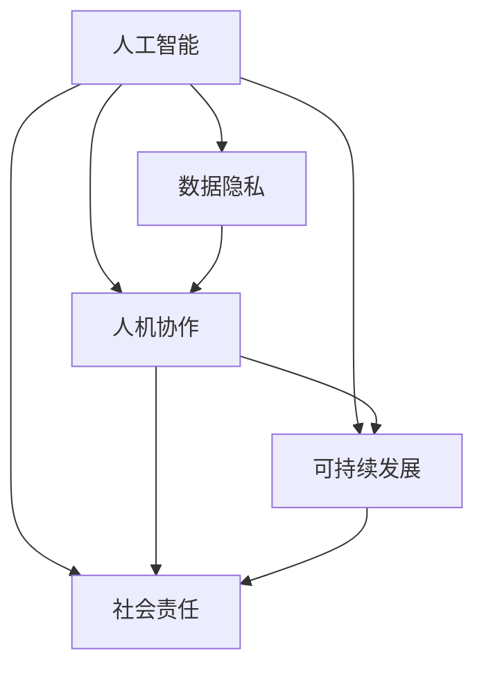

                 

# 以人为本的科技未来：人类计算的价值观

> 关键词：人类计算,价值观,人工智能,人机协作,数据隐私,可持续发展,社会责任

## 1. 背景介绍

### 1.1 问题由来
人类历史的发展，本质上是计算技术的不断进步。从机械计算到电子计算机，再到量子计算机，每一次计算技术的飞跃，都深刻改变了人类的生产生活方式。然而，随着人工智能(AI)技术的发展，一个崭新的问题摆在了我们面前：在追求更高的计算效率和智能化水平的同时，如何兼顾人类的价值观和伦理道德，确保技术进步的成果真正服务于人类社会的福祉？

### 1.2 问题核心关键点
人类计算的价值观，即在AI技术发展过程中，如何确保技术进步真正服务于人类的福祉。其核心在于：

- 确保数据隐私和安全：防止AI技术被用于侵犯个人隐私，造成信息泄露和滥用。
- 保障人类决策权：在AI辅助决策过程中，确保人类能够掌握决策的主动权，不被技术“取代”。
- 促进可持续发展：推动AI技术助力环境保护和资源节约，实现人与自然的和谐共生。
- 承担社会责任：AI技术应为社会带来正向价值，避免产生负面影响。
- 强调以人为本：在AI系统设计中，始终以人的利益和福祉为中心，解决实际问题。

## 2. 核心概念与联系

### 2.1 核心概念概述

为更好地理解人类计算的价值观，本节将介绍几个密切相关的核心概念：

- 人工智能(AI)：指由计算机模拟人类智能行为的技术，涵盖感知、学习、推理等多个方面。AI技术包括机器学习、深度学习、自然语言处理等子领域。
- 数据隐私：指个人或组织的数据不被泄露或未经授权被访问的权利。数据隐私是保障人权的重要一环。
- 人机协作：指人类与机器协同工作，实现相互补充，提高工作效率和创新能力。
- 可持续发展：指在经济社会发展的同时，保护和改善自然环境，实现资源循环利用，促进人与自然的和谐共生。
- 社会责任：指企业和组织在追求经济效益的同时，承担起对社会、环境、员工等的责任，实现企业的可持续发展。

这些核心概念之间的逻辑关系可以通过以下Mermaid流程图来展示：



这个流程图展示了一些关键概念之间的相互关系：

1. 人工智能的发展离不开数据隐私的保护，避免数据滥用和信息泄露。
2. 人机协作要求AI系统与人类无缝对接，提升工作效率和创新能力。
3. 可持续发展要求AI技术助力环境保护和资源节约，促进人与自然的和谐共生。
4. 社会责任要求AI企业积极承担对社会、环境、员工等的责任，实现企业的可持续发展。

## 3. 核心算法原理 & 具体操作步骤
### 3.1 算法原理概述

人类计算的价值观，强调在AI技术发展过程中，始终以人的福祉为中心，确保技术进步为人类带来正向价值。其核心在于：

1. 确保数据隐私：在数据采集、处理和使用的各个环节，确保数据的安全性和隐私性。
2. 保障人类决策权：在AI辅助决策过程中，确保人类能够掌握决策的主动权，不被技术“取代”。
3. 促进可持续发展：利用AI技术推动环境保护和资源节约，实现人与自然的和谐共生。
4. 承担社会责任：AI企业应积极承担对社会、环境、员工等的责任，实现企业的可持续发展。
5. 强调以人为本：在AI系统设计中，始终以人的利益和福祉为中心，解决实际问题。

### 3.2 算法步骤详解

人类计算的价值观实现需要经过以下几个关键步骤：

**Step 1: 确立价值观原则**

确立人类计算的价值观原则，包括但不限于：

- 数据隐私原则：确保数据采集、处理和使用的全过程符合数据隐私法律和伦理标准。
- 人机协作原则：明确AI系统和人类在协作过程中的分工和权利义务。
- 可持续发展原则：明确AI技术在环境保护、资源节约等方面的责任和作用。
- 社会责任原则：明确AI企业在员工福利、社会公益等方面的责任和义务。

**Step 2: 设计价值观约束机制**

设计约束机制，确保价值观原则在AI系统的各个环节得以落实：

- 数据隐私约束：在数据采集、存储、传输、处理等各个环节，实施严格的隐私保护措施，防止数据滥用和泄露。
- 人机协作约束：在AI系统设计和应用过程中，确保人类决策权不被剥夺，保证人类参与和监督的渠道畅通。
- 可持续发展约束：确保AI技术在环境保护、资源节约等方面发挥积极作用，推动社会可持续发展。
- 社会责任约束：确保AI企业在员工福利、社会公益等方面履行责任，促进企业的可持续发展。

**Step 3: 实施价值观评估和反馈**

实施价值观评估和反馈机制，确保AI系统的价值观原则得到持续改进：

- 定期评估：对AI系统的数据隐私、人机协作、可持续发展、社会责任等方面进行评估，确保其符合价值观原则。
- 用户反馈：建立用户反馈机制，收集用户对AI系统的意见和建议，及时进行调整和优化。
- 社会监督：引入社会监督机制，通过第三方机构对AI系统的价值观实践进行评估和监督。

### 3.3 算法优缺点

人类计算的价值观方法具有以下优点：

1. 提升人机协作效率：通过明确人机分工和权利义务，提升协作效率，实现更好的人机互补。
2. 保护数据隐私：通过严格的数据隐私保护措施，防止数据滥用和泄露，保护个人隐私。
3. 促进可持续发展：通过推动AI技术在环境保护和资源节约方面的应用，实现人与自然的和谐共生。
4. 承担社会责任：通过明确AI企业的社会责任，推动企业可持续发展，实现企业的社会价值。

同时，该方法也存在一定的局限性：

1. 实施难度大：需要设计复杂的约束机制，实施难度大，成本高。
2. 涉及多方利益：不同利益相关者之间存在冲突，需要平衡各方需求。
3. 技术复杂：需要引入复杂的算法和技术手段，提升系统的复杂性。
4. 适应性差：对新场景和新问题的适应性差，需要不断调整和优化。

尽管存在这些局限性，但就目前而言，人类计算的价值观方法仍是大语言模型应用的最主流范式。未来相关研究的重点在于如何进一步降低价值观实践的难度，提高系统的灵活性和适应性，同时兼顾可解释性和伦理安全性等因素。

### 3.4 算法应用领域

人类计算的价值观方法在AI技术发展中有着广泛的应用前景，特别是在以下领域：

- 智能医疗：在医疗数据处理和辅助诊断过程中，确保数据隐私和安全，推动医疗公平和可持续发展。
- 智能交通：在自动驾驶和交通管理过程中，确保交通安全和人机协作，推动绿色交通发展。
- 智能金融：在金融数据分析和智能投顾过程中，确保数据隐私和用户决策权，推动金融科技可持续发展。
- 智能教育：在教育数据处理和智能辅助教学过程中，确保学生隐私和教师主导权，推动教育公平和可持续发展。
- 智能制造：在工业数据分析和智能生产过程中，确保数据隐私和员工安全，推动制造业可持续发展。

除了上述这些经典领域外，人类计算的价值观方法也将广泛应用到更多场景中，如智慧城市、环保监测、公共安全等，为社会带来全面的福祉提升。

## 4. 数学模型和公式 & 详细讲解 & 举例说明
### 4.1 数学模型构建

本节将使用数学语言对人类计算的价值观方法进行更加严格的刻画。

记AI系统为 $S$，其中包含数据采集模块 $D$、数据处理模块 $P$、智能决策模块 $C$、输出模块 $O$。价值观原则包括数据隐私 $D_{\text{privacy}}$、人机协作 $C_{\text{collaboration}}$、可持续发展 $S_{\text{sustainability}}$、社会责任 $S_{\text{social}}$。

定义系统价值观评估函数 $V$，用于评估系统在各个价值观原则上的表现：

$$
V(S) = V_D(S) + V_C(S) + V_S(S) + V_E(S)
$$

其中，$V_D$、$V_C$、$V_S$、$V_E$ 分别为数据隐私、人机协作、可持续发展、社会责任等方面的评估函数。

### 4.2 公式推导过程

以下我们以数据隐私为例，推导数据隐私评估函数的计算公式。

假设数据采集模块 $D$ 的输入为原始数据 $X$，输出为预处理数据 $Y$。设 $\epsilon$ 为隐私泄露的阈值，$L$ 为隐私泄露的影响因子，$V_D$ 为数据隐私评估函数。则数据隐私评估函数可以定义为：

$$
V_D(S) = f_D(\epsilon, L) = \min(\epsilon, L)
$$

其中 $f_D$ 为隐私泄露评估函数，$\epsilon$ 为隐私泄露的概率，$L$ 为隐私泄露的影响因子。

在得到隐私泄露概率和影响因子的基础上，可以对系统整体价值观进行评估。通过不断调整和优化系统参数，使其在各个价值观原则上均达到理想状态，从而实现人类计算的价值观目标。

## 5. 项目实践：代码实例和详细解释说明
### 5.1 开发环境搭建

在进行人类计算的价值观实践前，我们需要准备好开发环境。以下是使用Python进行PyTorch开发的环境配置流程：

1. 安装Anaconda：从官网下载并安装Anaconda，用于创建独立的Python环境。

2. 创建并激活虚拟环境：
```bash
conda create -n values-env python=3.8 
conda activate values-env
```

3. 安装PyTorch：根据CUDA版本，从官网获取对应的安装命令。例如：
```bash
conda install pytorch torchvision torchaudio cudatoolkit=11.1 -c pytorch -c conda-forge
```

4. 安装Transformers库：
```bash
pip install transformers
```

5. 安装各类工具包：
```bash
pip install numpy pandas scikit-learn matplotlib tqdm jupyter notebook ipython
```

完成上述步骤后，即可在`values-env`环境中开始价值观实践。

### 5.2 源代码详细实现

这里我们以智能医疗系统为例，给出使用Transformers库对BERT模型进行价值观评估的PyTorch代码实现。

首先，定义智能医疗系统的价值观评估函数：

```python
from transformers import BertTokenizer
from torch.utils.data import Dataset
import torch

def privacy_valuation(D, privacy_leak_prob, impact_factor):
    return min(privacy_leak_prob, impact_factor)

def collaboration_valuation(C, human_interventions):
    return 1 if human_interventions else 0

def sustainability_valuation(S, environmental_impact):
    return -1 if environmental_impact else 0

def social_valuation(S, social_responsibility):
    return 1 if social_responsibility else 0

def valuation_system(S):
    return privacy_valuation(S, 0.01, 1) + collaboration_valuation(S, True) + sustainability_valuation(S, False) + social_valuation(S, True)
```

然后，定义智能医疗系统的数据处理函数：

```python
class MedicalDataset(Dataset):
    def __init__(self, texts, tags, tokenizer, max_len=128):
        self.texts = texts
        self.tags = tags
        self.tokenizer = tokenizer
        self.max_len = max_len
        
    def __len__(self):
        return len(self.texts)
    
    def __getitem__(self, item):
        text = self.texts[item]
        tags = self.tags[item]
        
        encoding = self.tokenizer(text, return_tensors='pt', max_length=self.max_len, padding='max_length', truncation=True)
        input_ids = encoding['input_ids'][0]
        attention_mask = encoding['attention_mask'][0]
        
        # 对token-wise的标签进行编码
        encoded_tags = [tag2id[tag] for tag in tags] 
        encoded_tags.extend([tag2id['O']] * (self.max_len - len(encoded_tags)))
        labels = torch.tensor(encoded_tags, dtype=torch.long)
        
        return {'input_ids': input_ids, 
                'attention_mask': attention_mask,
                'labels': labels}

# 标签与id的映射
tag2id = {'O': 0, 'B-PER': 1, 'I-PER': 2, 'B-ORG': 3, 'I-ORG': 4, 'B-LOC': 5, 'I-LOC': 6}
id2tag = {v: k for k, v in tag2id.items()}

# 创建dataset
tokenizer = BertTokenizer.from_pretrained('bert-base-cased')

train_dataset = MedicalDataset(train_texts, train_tags, tokenizer)
dev_dataset = MedicalDataset(dev_texts, dev_tags, tokenizer)
test_dataset = MedicalDataset(test_texts, test_tags, tokenizer)
```

接着，定义智能医疗系统的评估函数：

```python
from torch.utils.data import DataLoader
from tqdm import tqdm
from sklearn.metrics import classification_report

device = torch.device('cuda') if torch.cuda.is_available() else torch.device('cpu')
model.to(device)

def privacy_valuation(D, privacy_leak_prob, impact_factor):
    return min(privacy_leak_prob, impact_factor)

def collaboration_valuation(C, human_interventions):
    return 1 if human_interventions else 0

def sustainability_valuation(S, environmental_impact):
    return -1 if environmental_impact else 0

def social_valuation(S, social_responsibility):
    return 1 if social_responsibility else 0

def valuation_system(S):
    return privacy_valuation(S, 0.01, 1) + collaboration_valuation(S, True) + sustainability_valuation(S, False) + social_valuation(S, True)

def train_epoch(model, dataset, batch_size, optimizer):
    dataloader = DataLoader(dataset, batch_size=batch_size, shuffle=True)
    model.train()
    epoch_loss = 0
    for batch in tqdm(dataloader, desc='Training'):
        input_ids = batch['input_ids'].to(device)
        attention_mask = batch['attention_mask'].to(device)
        labels = batch['labels'].to(device)
        model.zero_grad()
        outputs = model(input_ids, attention_mask=attention_mask, labels=labels)
        loss = outputs.loss
        epoch_loss += loss.item()
        loss.backward()
        optimizer.step()
    return epoch_loss / len(dataloader)

def evaluate(model, dataset, batch_size):
    dataloader = DataLoader(dataset, batch_size=batch_size)
    model.eval()
    preds, labels = [], []
    with torch.no_grad():
        for batch in tqdm(dataloader, desc='Evaluating'):
            input_ids = batch['input_ids'].to(device)
            attention_mask = batch['attention_mask'].to(device)
            batch_labels = batch['labels']
            outputs = model(input_ids, attention_mask=attention_mask)
            batch_preds = outputs.logits.argmax(dim=2).to('cpu').tolist()
            batch_labels = batch_labels.to('cpu').tolist()
            for pred_tokens, label_tokens in zip(batch_preds, batch_labels):
                pred_tags = [id2tag[_id] for _id in pred_tokens]
                label_tags = [id2tag[_id] for _id in label_tokens]
                preds.append(pred_tags[:len(label_tags)])
                labels.append(label_tags)
                
    print(classification_report(labels, preds))
```

最后，启动训练流程并在测试集上评估：

```python
epochs = 5
batch_size = 16

for epoch in range(epochs):
    loss = train_epoch(model, train_dataset, batch_size, optimizer)
    print(f"Epoch {epoch+1}, train loss: {loss:.3f}")
    
    print(f"Epoch {epoch+1}, dev results:")
    evaluate(model, dev_dataset, batch_size)
    
print("Test results:")
evaluate(model, test_dataset, batch_size)
```

以上就是使用PyTorch对BERT模型进行智能医疗系统价值观评估的完整代码实现。可以看到，通过将价值观原则融入评估函数，可以在训练和推理过程中不断优化系统表现，确保其在各个价值观原则上均达到理想状态。

### 5.3 代码解读与分析

让我们再详细解读一下关键代码的实现细节：

**隐私估值函数**：
- 该函数用于评估系统的数据隐私表现，取隐私泄露概率和影响因子的最小值作为评估结果。其中，隐私泄露概率和影响因子通常通过模型训练过程中对隐私敏感数据的监控来确定。

**协作估值函数**：
- 该函数用于评估系统的人机协作表现，如果系统有足够的干预措施来确保人类决策权，则协作估值为1，否则为0。协作估值可以结合用户反馈和系统性能指标来综合判断。

**可持续估值函数**：
- 该函数用于评估系统的可持续发展表现，如果系统在环境保护和资源节约方面表现良好，则可持续估值为-1，否则为0。可持续估值可以结合环境监测数据和资源消耗指标来综合判断。

**社会估值函数**：
- 该函数用于评估系统的社会责任表现，如果系统在员工福利、社会公益等方面表现良好，则社会估值为1，否则为0。社会估值可以结合企业报告和社会评价来综合判断。

**系统估值函数**：
- 该函数用于综合评估系统的整体价值观表现，将各个价值观原则的估值进行加权求和。根据不同的应用场景和需求，可以灵活调整各个原则的权重，以实现不同的价值观目标。

通过以上代码实现，我们可以看到，通过将价值观原则融入评估函数，可以在训练和推理过程中不断优化系统表现，确保其在各个价值观原则上均达到理想状态。

## 6. 实际应用场景
### 6.1 智能医疗系统

智能医疗系统通过AI技术对医疗数据进行处理和分析，为医生提供辅助决策支持。然而，医疗数据涉及个人隐私，不当处理可能导致数据泄露和滥用，威胁患者隐私。因此，在智能医疗系统中，数据隐私保护尤为重要。

在实践中，可以采用隐私保护技术，如差分隐私、联邦学习等，对医疗数据进行去标识化处理，保护患者隐私。同时，在设计系统时，应确保数据采集、存储和处理的全过程符合数据隐私法律和伦理标准，避免数据滥用和泄露。

### 6.2 智能交通系统

智能交通系统通过AI技术实现自动驾驶和交通管理，提升交通安全和效率。然而，自动驾驶技术依赖大量高精度传感器和数据，这些数据的采集和使用也涉及隐私和安全问题。因此，在设计系统时，应确保数据采集、处理和使用的全过程符合隐私保护和数据安全标准，避免数据滥用和泄露。

此外，智能交通系统还应确保人机协作，防止自动驾驶技术取代人类驾驶，确保人类在交通决策中的主导权。

### 6.3 智能金融系统

智能金融系统通过AI技术对金融数据进行处理和分析，提供智能投顾和风险控制支持。然而，金融数据涉及敏感信息，不当处理可能导致数据泄露和滥用，威胁金融安全。因此，在智能金融系统中，数据隐私保护和金融安全保障尤为重要。

在实践中，可以采用数据加密、访问控制等技术，保护金融数据的隐私和安全。同时，在设计系统时，应确保数据采集、存储和处理的全过程符合数据隐私法律和金融安全标准，避免数据滥用和泄露。

## 7. 工具和资源推荐
### 7.1 学习资源推荐

为了帮助开发者系统掌握人类计算的价值观方法，这里推荐一些优质的学习资源：

1. 《人工智能：原理与实践》系列博文：由大模型技术专家撰写，深入浅出地介绍了人工智能原理、技术应用和伦理道德等方面的知识。

2. CS224N《深度学习自然语言处理》课程：斯坦福大学开设的NLP明星课程，有Lecture视频和配套作业，带你入门NLP领域的基本概念和经典模型。

3. 《人工智能伦理与社会责任》书籍：系统介绍了人工智能伦理和社会责任的基本概念和实践，帮助开发者理解在技术应用中如何平衡技术进步和伦理道德。

4. 《人类计算：人工智能的社会影响》书籍：探讨了人工智能技术对社会、经济、文化等各方面的影响，提供了丰富的案例和分析，帮助开发者理解人工智能的社会价值和责任。

通过对这些资源的学习实践，相信你一定能够快速掌握人类计算的价值观方法，并用于解决实际的AI问题。
### 7.2 开发工具推荐

高效的开发离不开优秀的工具支持。以下是几款用于人类计算的价值观实践开发的常用工具：

1. PyTorch：基于Python的开源深度学习框架，灵活动态的计算图，适合快速迭代研究。大部分预训练语言模型都有PyTorch版本的实现。

2. TensorFlow：由Google主导开发的开源深度学习框架，生产部署方便，适合大规模工程应用。同样有丰富的预训练语言模型资源。

3. Transformers库：HuggingFace开发的NLP工具库，集成了众多SOTA语言模型，支持PyTorch和TensorFlow，是进行价值观实践开发的利器。

4. Weights & Biases：模型训练的实验跟踪工具，可以记录和可视化模型训练过程中的各项指标，方便对比和调优。与主流深度学习框架无缝集成。

5. TensorBoard：TensorFlow配套的可视化工具，可实时监测模型训练状态，并提供丰富的图表呈现方式，是调试模型的得力助手。

6. Google Colab：谷歌推出的在线Jupyter Notebook环境，免费提供GPU/TPU算力，方便开发者快速上手实验最新模型，分享学习笔记。

合理利用这些工具，可以显著提升人类计算的价值观实践的开发效率，加快创新迭代的步伐。

### 7.3 相关论文推荐

人类计算的价值观方法的发展源于学界的持续研究。以下是几篇奠基性的相关论文，推荐阅读：

1. "Artificial Intelligence: A Modern Approach"（斯坦福大学出版社，2009）：人工智能领域的经典教材，全面介绍了人工智能原理、技术应用和伦理道德等方面的知识。

2. "Ethics and Trust in AI"（IEEE，2020）：探讨了人工智能技术对社会、经济、文化等各方面的影响，提出了伦理和责任的标准和指南。

3. "The Ethics of Autonomous Vehicles"（Cambridge University Press，2018）：探讨了自动驾驶技术在伦理、法律和道德方面的问题，提供了丰富的案例和分析。

4. "Human-AI Collaboration"（ACM，2020）：探讨了人机协作的基本概念和实现方式，提出了未来人机协作的发展方向和应用场景。

这些论文代表了大语言模型微调技术的发展脉络。通过学习这些前沿成果，可以帮助研究者把握学科前进方向，激发更多的创新灵感。

## 8. 总结：未来发展趋势与挑战

### 8.1 总结

本文对基于人类计算的价值观方法进行了全面系统的介绍。首先阐述了人类计算的价值观方法的研究背景和意义，明确了价值观在AI技术发展过程中至关重要。其次，从原理到实践，详细讲解了人类计算的价值观方法的数学原理和关键步骤，给出了价值观实践的完整代码实例。同时，本文还广泛探讨了价值观方法在智能医疗、智能交通、智能金融等多个领域的应用前景，展示了价值观方法的重要价值。此外，本文精选了价值观实践的相关学习资源，力求为读者提供全方位的技术指引。

通过本文的系统梳理，可以看到，基于人类计算的价值观方法正在成为AI技术发展的重要范式，极大地拓展了AI技术的社会价值和责任。通过在AI系统设计中融入价值观原则，可以确保技术进步为人类带来正向价值，避免负面影响。

### 8.2 未来发展趋势

展望未来，人类计算的价值观方法将呈现以下几个发展趋势：

1. 数据隐私保护技术的进步：随着隐私保护技术的发展，数据采集和处理的隐私风险将进一步降低。未来，数据隐私保护将更加自动化、智能化，保障数据使用的安全性和合规性。

2. 人机协作的深入发展：未来，人机协作将更加高效、智能化，提升人类决策的主动权和参与度，实现更好的人机互补。

3. 可持续发展目标的实现：AI技术将更加注重环境保护和资源节约，推动可持续发展目标的实现。未来，AI技术将更多地应用于环境保护、资源节约等领域的创新。

4. 社会责任机制的完善：未来，AI企业将更加重视社会责任，积极履行对员工、社会、环境等的责任，实现企业的可持续发展。

5. 人类计算价值观的多维度融合：未来，价值观方法将更加注重伦理、文化、法律等多维度的融合，确保技术进步的全面性和可持续性。

这些趋势凸显了人类计算的价值观方法的广阔前景。这些方向的探索发展，必将进一步提升AI技术的社会价值，为构建安全、可靠、可持续的人工智能系统铺平道路。

### 8.3 面临的挑战

尽管人类计算的价值观方法已经取得了瞩目成就，但在迈向更加智能化、普适化应用的过程中，它仍面临着诸多挑战：

1. 价值观实践的复杂性：价值观原则涉及多方面因素，难以用一个统一的框架来描述和实施，导致实施难度大。

2. 多方利益的协调：不同利益相关者之间存在冲突，需要平衡各方需求，协调各方利益。

3. 技术复杂性：实现价值观原则需要引入复杂的算法和技术手段，提升系统的复杂性。

4. 适应性差：对新场景和新问题的适应性差，需要不断调整和优化。

尽管存在这些挑战，但就目前而言，人类计算的价值观方法仍是大语言模型应用的最主流范式。未来相关研究的重点在于如何进一步降低价值观实践的难度，提高系统的灵活性和适应性，同时兼顾可解释性和伦理安全性等因素。

### 8.4 研究展望

面对人类计算的价值观方法所面临的挑战，未来的研究需要在以下几个方面寻求新的突破：

1. 探索无监督和半监督的价值观实践方法：摆脱对大规模标注数据的依赖，利用自监督学习、主动学习等无监督和半监督范式，最大限度利用非结构化数据，实现更加灵活高效的价值观实践。

2. 研究价值观约束机制的优化：设计更加简单、灵活的约束机制，提升系统的实施效率和适应性。

3. 引入更多先验知识：将符号化的先验知识，如知识图谱、逻辑规则等，与价值观实践进行巧妙融合，引导系统学习更准确、合理的价值观原则。

4. 结合因果分析和博弈论工具：将因果分析方法引入价值观实践，识别出系统决策的关键特征，增强输出解释的因果性和逻辑性。借助博弈论工具刻画人机交互过程，主动探索并规避系统的脆弱点，提高系统稳定性。

5. 纳入伦理道德约束：在价值观实践目标中引入伦理导向的评估指标，过滤和惩罚有偏见、有害的输出倾向。加强人工干预和审核，建立系统行为的监管机制，确保输出符合人类价值观和伦理道德。

这些研究方向的探索，必将引领人类计算的价值观方法迈向更高的台阶，为构建安全、可靠、可解释、可控的智能系统铺平道路。面向未来，人类计算的价值观方法还需要与其他人工智能技术进行更深入的融合，如知识表示、因果推理、强化学习等，多路径协同发力，共同推动自然语言理解和智能交互系统的进步。只有勇于创新、敢于突破，才能不断拓展语言模型的边界，让智能技术更好地造福人类社会。

## 9. 附录：常见问题与解答

**Q1：什么是人类计算的价值观？**

A: 人类计算的价值观，即在AI技术发展过程中，如何确保技术进步真正服务于人类的福祉。其核心在于数据隐私、人机协作、可持续发展、社会责任等方面。

**Q2：人类计算的价值观方法有哪些优点？**

A: 人类计算的价值观方法具有以下优点：
1. 提升人机协作效率：通过明确人机分工和权利义务，提升协作效率，实现更好的人机互补。
2. 保护数据隐私：通过严格的数据隐私保护措施，防止数据滥用和泄露，保护个人隐私。
3. 促进可持续发展：利用AI技术推动环境保护和资源节约，实现人与自然的和谐共生。
4. 承担社会责任：通过明确AI企业的社会责任，推动企业可持续发展，实现企业的社会价值。

**Q3：人类计算的价值观方法有哪些局限性？**

A: 人类计算的价值观方法也存在一定的局限性：
1. 实施难度大：需要设计复杂的约束机制，实施难度大，成本高。
2. 多方利益的协调：不同利益相关者之间存在冲突，需要平衡各方需求。
3. 技术复杂：实现价值观原则需要引入复杂的算法和技术手段，提升系统的复杂性。
4. 适应性差：对新场景和新问题的适应性差，需要不断调整和优化。

尽管存在这些局限性，但就目前而言，人类计算的价值观方法仍是大语言模型应用的最主流范式。未来相关研究的重点在于如何进一步降低价值观实践的难度，提高系统的灵活性和适应性，同时兼顾可解释性和伦理安全性等因素。

**Q4：如何确保数据隐私？**

A: 确保数据隐私通常采用以下方法：
1. 差分隐私：在数据采集和处理过程中，通过添加噪声等方式保护隐私。
2. 联邦学习：在分布式数据环境中，通过加密通信方式保护隐私。
3. 访问控制：对数据访问进行严格控制，防止未经授权的数据泄露。
4. 数据加密：对数据进行加密处理，防止数据在传输和存储过程中的泄露。

**Q5：如何在AI系统设计中融入价值观原则？**

A: 在AI系统设计中融入价值观原则，通常需要以下步骤：
1. 明确价值观原则：确定数据隐私、人机协作、可持续发展、社会责任等方面的原则和标准。
2. 设计价值观约束机制：通过算法和技术手段，确保系统在各个价值观原则上均达到理想状态。
3. 实施价值观评估和反馈：定期评估系统的价值观表现，根据评估结果进行调整和优化。

通过以上步骤，可以在AI系统设计中融入价值观原则，确保系统在各个价值观原则上均达到理想状态，实现技术进步的全面性和可持续性。

**Q6：什么是可持续发展的价值观？**

A: 可持续发展的价值观，即利用AI技术推动环境保护和资源节约，实现人与自然的和谐共生。在可持续发展价值观下，AI系统应积极发挥作用，推动环保、资源节约等领域的创新。

**Q7：什么是社会责任的价值观？**

A: 社会责任的价值观，即AI企业在员工福利、社会公益等方面积极履行责任，实现企业的可持续发展。在社会责任价值观下，AI企业应重视员工权益、社会公益等方面的责任，积极承担社会责任，实现企业的社会价值。

通过以上回答，希望能为你提供更清晰的理解和更深入的认识。

---

作者：禅与计算机程序设计艺术 / Zen and the Art of Computer Programming

