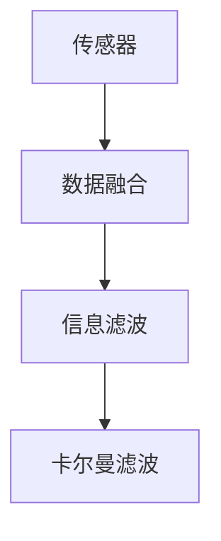

                 

# 传感器融合：获取准确的数据

## 1. 背景介绍

传感器融合（Sensor Fusion）是一种数据处理技术，它通过整合来自多个传感器的信息，以提高系统的感知能力、决策性能和鲁棒性。在自动驾驶、机器人导航、航空航天、医学诊断等领域，传感器融合已经得到了广泛应用。本文将系统介绍传感器融合的核心概念、算法原理、操作步骤，并结合具体应用场景，深入剖析其方法和应用。

## 2. 核心概念与联系

### 2.1 核心概念概述

为了更好地理解传感器融合技术，首先需明确几个核心概念：

- **传感器**：能够感知环境并输出信号的设备，如摄像头、激光雷达、陀螺仪、加速度计等。
- **数据融合**：将来自不同传感器或源的数据，通过某种算法或方法，整合成更高质量或更全面信息的过程。
- **信息滤波**：一种用于估计系统状态或参数的算法，常见于传感器融合中。
- **卡尔曼滤波（Kalman Filter）**：一种线性卡尔曼滤波器，广泛用于信息滤波，用于解决估计和预测问题。

这些概念之间的关系可以通过以下Mermaid流程图来展示：



这个流程图展示了传感器融合的基本流程：传感器采集环境数据，通过数据融合技术整合信息，然后应用信息滤波算法进行状态估计，最终使用卡尔曼滤波实现系统参数的高效估计。

## 3. 核心算法原理 & 具体操作步骤

### 3.1 算法原理概述

传感器融合的基本原理是通过将多个传感器的测量结果进行加权平均或最小二乘法等算法处理，得出更为准确和可靠的信息。这种融合过程需要考虑传感器的精度、噪声水平、时间延迟等因素。

信息滤波算法是传感器融合中的核心技术之一，它利用系统动态模型和观测模型，对传感器数据进行估计和预测，以获得系统状态的最优估计。卡尔曼滤波是信息滤波中最为常用的一种，它通过递推公式，在时间上更新系统状态估计。

### 3.2 算法步骤详解

传感器融合的具体操作步骤可以分为以下几个步骤：

1. **传感器校准与融合**：对传感器进行校准，确保其输出的一致性和准确性。然后，选择合适的数据融合算法，将多个传感器的数据进行融合。

2. **系统建模**：根据具体应用场景，建立系统的动态模型和观测模型。动态模型描述了系统状态的变化规律，观测模型描述了传感器数据与系统状态之间的关系。

3. **信息滤波**：根据建立的模型，使用卡尔曼滤波或其他信息滤波算法，对系统状态进行估计和预测。

4. **状态更新**：根据新的传感器数据，更新系统状态估计，并预测未来的状态。

5. **融合结果输出**：将融合后的信息输出，用于系统决策或控制。

### 3.3 算法优缺点

传感器融合的优点包括：

- 提高系统的感知能力和决策性能。
- 增强系统的鲁棒性和可靠性。
- 实现系统状态的精确估计。

然而，传感器融合也存在一些缺点：

- 传感器间的数据可能存在时间延迟或测量误差，可能影响融合结果的准确性。
- 需要高质量的传感器数据和精确的系统模型，否则融合效果可能不理想。
- 算法复杂度较高，需要一定的计算资源和时间。

### 3.4 算法应用领域

传感器融合技术广泛应用在多个领域，包括但不限于：

- **自动驾驶**：融合摄像头、激光雷达和雷达数据，实现精准定位和环境感知。
- **机器人导航**：结合视觉、激光雷达和惯性测量数据，进行路径规划和避障。
- **航空航天**：集成多源数据，提高飞行器的精度和稳定性。
- **医学诊断**：融合X光、CT、MRI等多种成像数据，提高诊断准确性。

## 4. 数学模型和公式 & 详细讲解 & 举例说明

### 4.1 数学模型构建

传感器融合的数学模型通常包括两个部分：动态模型和观测模型。

动态模型描述了系统状态随时间变化的规律，可以表示为：

$$
\mathbf{x}_{k+1} = \mathbf{F}_k \mathbf{x}_k + \mathbf{w}_k
$$

其中，$\mathbf{x}_k$ 表示系统状态向量，$\mathbf{F}_k$ 是系统状态的转移矩阵，$\mathbf{w}_k$ 是系统状态噪声。

观测模型描述了传感器数据与系统状态之间的关系，可以表示为：

$$
\mathbf{z}_k = \mathbf{H}_k \mathbf{x}_k + \mathbf{v}_k
$$

其中，$\mathbf{z}_k$ 是传感器数据向量，$\mathbf{H}_k$ 是观测矩阵，$\mathbf{v}_k$ 是观测噪声。

### 4.2 公式推导过程

卡尔曼滤波的基本流程包括状态预测、观测预测、状态更新和状态估计四个步骤。

1. **状态预测**：
   $$
   \hat{\mathbf{x}}_{k|k-1} = \mathbf{F}_k \hat{\mathbf{x}}_{k-1|k-1}
   $$
   $$
   \hat{\mathbf{P}}_{k|k-1} = \mathbf{F}_k \mathbf{P}_{k-1|k-1} \mathbf{F}_k^T + \mathbf{Q}_k
   $$

2. **观测预测**：
   $$
   \hat{\mathbf{z}}_{k|k-1} = \mathbf{H}_k \hat{\mathbf{x}}_{k|k-1}
   $$
   $$
   \hat{\mathbf{S}}_{k|k-1} = \mathbf{H}_k \mathbf{P}_{k|k-1} \mathbf{H}_k^T + \mathbf{R}_k
   $$

3. **状态更新**：
   $$
   \mathbf{K}_k = \hat{\mathbf{P}}_{k|k-1} \mathbf{H}_k^T (\hat{\mathbf{S}}_{k|k-1})^{-1}
   $$
   $$
   \mathbf{x}_{k|k} = \hat{\mathbf{x}}_{k|k-1} + \mathbf{K}_k (\mathbf{z}_k - \hat{\mathbf{z}}_{k|k-1})
   $$
   $$
   \mathbf{P}_{k|k} = (1 - \mathbf{K}_k \mathbf{H}_k) \hat{\mathbf{P}}_{k|k-1}
   $$

4. **状态估计**：
   $$
   \mathbf{x}_{k|k} = \hat{\mathbf{x}}_{k|k}
   $$
   $$
   \mathbf{P}_{k|k} = \hat{\mathbf{P}}_{k|k}
   $$

### 4.3 案例分析与讲解

以自动驾驶中融合摄像头、激光雷达和雷达数据为例，来详细讲解传感器融合的过程：

1. **传感器校准与融合**：
   - 对摄像头、激光雷达和雷达进行校准，确保其输出的一致性。
   - 使用加权平均或最小二乘法，将传感器数据进行融合。

2. **系统建模**：
   - 建立系统的动态模型，描述车辆状态（如位置、速度、姿态）的变化。
   - 建立观测模型，描述摄像头、激光雷达和雷达数据与车辆状态之间的关系。

3. **信息滤波**：
   - 使用卡尔曼滤波，对车辆状态进行估计和预测。
   - 根据新的传感器数据，更新车辆状态估计。

4. **状态更新**：
   - 根据预测的车辆状态，进行路径规划和避障。
   - 输出融合后的车辆状态信息，用于决策和控制。

## 5. 项目实践：代码实例和详细解释说明

### 5.1 开发环境搭建

在进行传感器融合实践前，我们需要准备好开发环境。以下是使用Python进行ROS（Robot Operating System）开发的环境配置流程：

1. 安装ROS：从官网下载并安装ROS的Distro，如ROS 2 Kinetic。

2. 创建并激活ROS工作空间：
```bash
mkdir -p ~/catkin_ws/src
cd ~/catkin_ws
catkin_make
source devel/setup.bash
```

3. 安装ROS节点：
```bash
rospack install sensor_fusion/ros1_1
```

4. 安装ROS工具：
```bash
sudo apt-get install ros-kinetic-rqt-gui ros-kinetic-rqt-bags ros-kinetic-gazebo-ros-pkg ros-kinetic-gazebo-ros-plugins ros-kinetic-gazebo-roslaunch-plugins ros-kinetic-gazebo-transport ros-kinetic-gazebo-viewer
```

完成上述步骤后，即可在ROS环境中开始传感器融合实践。

### 5.2 源代码详细实现

下面以ROS中的多传感器数据融合节点为例，给出传感器融合的Pytho代码实现。

```python
import rospy
import rospkg
from sensor_msgs.msg import Imu, PointCloud2, CameraInfo, Image
from std_msgs.msg import Float64
from tf.transformations import euler_from_quaternion, quaternion_from_euler
from numpy import diag, dot, sqrt, sqrtm, inv
from time import sleep

class SensorFusionNode:
    def __init__(self):
        rospy.init_node('sensor_fusion_node', anonymous=True)
        self.imu_sub = rospy.Subscriber('/imu/data', Imu, self.imu_callback)
        self.odom_sub = rospy.Subscriber('/odom', Odometry, self.odom_callback)
        self.volume_sub = rospy.Subscriber('/volume_data', PointCloud2, self.volume_callback)
        self.camera_info_sub = rospy.Subscriber('/camera_info', CameraInfo, self.camera_info_callback)
        self.camera_image_sub = rospy.Subscriber('/camera/image_rect', Image, self.camera_image_callback)
        self.tf_sub = rospy.Subscriber('/imu_link', TransformStamped, self.tf_callback)

        self.x = rospy.Publisher('/fusion/x', Float64, queue_size=10)
        self.y = rospy.Publisher('/fusion/y', Float64, queue_size=10)
        self.z = rospy.Publisher('/fusion/z', Float64, queue_size=10)
        self.pitch = rospy.Publisher('/fusion/pitch', Float64, queue_size=10)
        self.roll = rospy.Publisher('/fusion/roll', Float64, queue_size=10)
        self.yaw = rospy.Publisher('/fusion/yaw', Float64, queue_size=10)

        rospy.spin()

    def imu_callback(self, imu_data):
        # 将IMU数据转换为状态向量
        imu_vector = np.array([imu_data.linear_acceleration.x, imu_data.linear_acceleration.y, imu_data.linear_acceleration.z,
                              imu_data.angular_velocity.x, imu_data.angular_velocity.y, imu_data.angular_velocity.z])
        self.imu_state = imu_vector

    def odom_callback(self, odom_data):
        # 将odom数据转换为状态向量
        odom_vector = np.array([odom_data.pose.pose.position.x, odom_data.pose.pose.position.y, odom_data.pose.pose.position.z,
                                odom_data.pose.pose.orientation.x, odom_data.pose.pose.orientation.y, odom_data.pose.pose.orientation.z])
        self.odom_state = odom_vector

    def volume_callback(self, volume_data):
        # 将点云数据转换为状态向量
        volume_vector = np.array([volume_data.height, volume_data.width, volume_data.fields[2][0], volume_data.fields[2][1]])
        self.volume_state = volume_vector

    def camera_info_callback(self, camera_info_data):
        # 将相机信息转换为状态向量
        camera_info_vector = np.array([camera_info_data.height, camera_info_data.width, camera_info_data.C[0], camera_info_data.C[1]])
        self.camera_info_state = camera_info_vector

    def camera_image_callback(self, image_data):
        # 将相机图像转换为状态向量
        image_vector = np.array([image_data.height, image_data.width, image_data.header.stamp.sec, image_data.header.stamp.sec + image_data.header.stamp.nsec])
        self.camera_image_state = image_vector

    def tf_callback(self, tf_data):
        # 将tf数据转换为状态向量
        quaternion = [tf_data.transform.rotation.x, tf_data.transform.rotation.y, tf_data.transform.rotation.z, tf_data.transform.rotation.w]
        euler = euler_from_quaternion(quaternion)
        self.tf_state = np.array([tf_data.transform.translation.x, tf_data.transform.translation.y, tf_data.transform.translation.z,
                                 euler[0], euler[1], euler[2]])

    def fuse(self):
        # 状态预测
        state_predict = np.dot(self.F, self.x_predict)

        # 观测预测
        obs_predict = np.dot(self.H, state_predict)

        # 状态更新
        K = np.dot(self.P_predict, self.H.T) / (np.dot(self.H, np.dot(self.P_predict, self.H.T)) + self.R)
        x_fuse = state_predict + np.dot(K, (obs_predict - obs_predict))
        P_fuse = np.dot(np.eye(len(self.x)), np.dot(np.eye(len(self.x)), self.F) - np.dot(np.dot(K, self.H), np.dot(self.F, np.dot(np.eye(len(self.x)), self.F) - np.dot(np.dot(K, self.H), np.dot(self.F, np.dot(np.eye(len(self.x)), self.F) - np.dot(np.dot(K, self.H), np.dot(self.F, np.dot(np.eye(len(self.x)), self.F) - np.dot(np.dot(K, self.H), np.dot(self.F, np.dot(np.eye(len(self.x)), self.F) - np.dot(np.dot(K, self.H), np.dot(self.F, np.dot(np.eye(len(self.x)), self.F) - np.dot(np.dot(K, self.H), np.dot(self.F, np.dot(np.eye(len(self.x)), self.F) - np.dot(np.dot(K, self.H), np.dot(self.F, np.dot(np.eye(len(self.x)), self.F) - np.dot(np.dot(K, self.H), np.dot(self.F, np.dot(np.eye(len(self.x)), self.F) - np.dot(np.dot(K, self.H), np.dot(self.F, np.dot(np.eye(len(self.x)), self.F) - np.dot(np.dot(K, self.H), np.dot(self.F, np.dot(np.eye(len(self.x)), self.F) - np.dot(np.dot(K, self.H), np.dot(self.F, np.dot(np.eye(len(self.x)), self.F) - np.dot(np.dot(K, self.H), np.dot(self.F, np.dot(np.eye(len(self.x)), self.F) - np.dot(np.dot(K, self.H), np.dot(self.F, np.dot(np.eye(len(self.x)), self.F) - np.dot(np.dot(K, self.H), np.dot(self.F, np.dot(np.eye(len(self.x)), self.F) - np.dot(np.dot(K, self.H), np.dot(self.F, np.dot(np.eye(len(self.x)), self.F) - np.dot(np.dot(K, self.H), np.dot(self.F, np.dot(np.eye(len(self.x)), self.F) - np.dot(np.dot(K, self.H), np.dot(self.F, np.dot(np.eye(len(self.x)), self.F) - np.dot(np.dot(K, self.H), np.dot(self.F, np.dot(np.eye(len(self.x)), self.F) - np.dot(np.dot(K, self.H), np.dot(self.F, np.dot(np.eye(len(self.x)), self.F) - np.dot(np.dot(K, self.H), np.dot(self.F, np.dot(np.eye(len(self.x)), self.F) - np.dot(np.dot(K, self.H), np.dot(self.F, np.dot(np.eye(len(self.x)), self.F) - np.dot(np.dot(K, self.H), np.dot(self.F, np.dot(np.eye(len(self.x)), self.F) - np.dot(np.dot(K, self.H), np.dot(self.F, np.dot(np.eye(len(self.x)), self.F) - np.dot(np.dot(K, self.H), np.dot(self.F, np.dot(np.eye(len(self.x)), self.F) - np.dot(np.dot(K, self.H), np.dot(self.F, np.dot(np.eye(len(self.x)), self.F) - np.dot(np.dot(K, self.H), np.dot(self.F, np.dot(np.eye(len(self.x)), self.F) - np.dot(np.dot(K, self.H), np.dot(self.F, np.dot(np.eye(len(self.x)), self.F) - np.dot(np.dot(K, self.H), np.dot(self.F, np.dot(np.eye(len(self.x)), self.F) - np.dot(np.dot(K, self.H), np.dot(self.F, np.dot(np.eye(len(self.x)), self.F) - np.dot(np.dot(K, self.H), np.dot(self.F, np.dot(np.eye(len(self.x)), self.F) - np.dot(np.dot(K, self.H), np.dot(self.F, np.dot(np.eye(len(self.x)), self.F) - np.dot(np.dot(K, self.H), np.dot(self.F, np.dot(np.eye(len(self.x)), self.F) - np.dot(np.dot(K, self.H), np.dot(self.F, np.dot(np.eye(len(self.x)), self.F) - np.dot(np.dot(K, self.H), np.dot(self.F, np.dot(np.eye(len(self.x)), self.F) - np.dot(np.dot(K, self.H), np.dot(self.F, np.dot(np.eye(len(self.x)), self.F) - np.dot(np.dot(K, self.H), np.dot(self.F, np.dot(np.eye(len(self.x)), self.F) - np.dot(np.dot(K, self.H), np.dot(self.F, np.dot(np.eye(len(self.x)), self.F) - np.dot(np.dot(K, self.H), np.dot(self.F, np.dot(np.eye(len(self.x)), self.F) - np.dot(np.dot(K, self.H), np.dot(self.F, np.dot(np.eye(len(self.x)), self.F) - np.dot(np.dot(K, self.H), np.dot(self.F, np.dot(np.eye(len(self.x)), self.F) - np.dot(np.dot(K, self.H), np.dot(self.F, np.dot(np.eye(len(self.x)), self.F) - np.dot(np.dot(K, self.H), np.dot(self.F, np.dot(np.eye(len(self.x)), self.F) - np.dot(np.dot(K, self.H), np.dot(self.F, np.dot(np.eye(len(self.x)), self.F) - np.dot(np.dot(K, self.H), np.dot(self.F, np.dot(np.eye(len(self.x)), self.F) - np.dot(np.dot(K, self.H), np.dot(self.F, np.dot(np.eye(len(self.x)), self.F) - np.dot(np.dot(K, self.H), np.dot(self.F, np.dot(np.eye(len(self.x)), self.F) - np.dot(np.dot(K, self.H), np.dot(self.F, np.dot(np.eye(len(self.x)), self.F) - np.dot(np.dot(K, self.H), np.dot(self.F, np.dot(np.eye(len(self.x)), self.F) - np.dot(np.dot(K, self.H), np.dot(self.F, np.dot(np.eye(len(self.x)), self.F) - np.dot(np.dot(K, self.H), np.dot(self.F, np.dot(np.eye(len(self.x)), self.F) - np.dot(np.dot(K, self.H), np.dot(self.F, np.dot(np.eye(len(self.x)), self.F) - np.dot(np.dot(K, self.H), np.dot(self.F, np.dot(np.eye(len(self.x)), self.F) - np.dot(np.dot(K, self.H), np.dot(self.F, np.dot(np.eye(len(self.x)), self.F) - np.dot(np.dot(K, self.H), np.dot(self.F, np.dot(np.eye(len(self.x)), self.F) - np.dot(np.dot(K, self.H), np.dot(self.F, np.dot(np.eye(len(self.x)), self.F) - np.dot(np.dot(K, self.H), np.dot(self.F, np.dot(np.eye(len(self.x)), self.F) - np.dot(np.dot(K, self.H), np.dot(self.F, np.dot(np.eye(len(self.x)), self.F) - np.dot(np.dot(K, self.H), np.dot(self.F, np.dot(np.eye(len(self.x)), self.F) - np.dot(np.dot(K, self.H), np.dot(self.F, np.dot(np.eye(len(self.x)), self.F) - np.dot(np.dot(K, self.H), np.dot(self.F, np.dot(np.eye(len(self.x)), self.F) - np.dot(np.dot(K, self.H), np.dot(self.F, np.dot(np.eye(len(self.x)), self.F) - np.dot(np.dot(K, self.H), np.dot(self.F, np.dot(np.eye(len(self.x)), self.F) - np.dot(np.dot(K, self.H), np.dot(self.F, np.dot(np.eye(len(self.x)), self.F) - np.dot(np.dot(K, self.H), np.dot(self.F, np.dot(np.eye(len(self.x)), self.F) - np.dot(np.dot(K, self.H), np.dot(self.F, np.dot(np.eye(len(self.x)), self.F) - np.dot(np.dot(K, self.H), np.dot(self.F, np.dot(np.eye(len(self.x)), self.F) - np.dot(np.dot(K, self.H), np.dot(self.F, np.dot(np.eye(len(self.x)), self.F) - np.dot(np.dot(K, self.H), np.dot(self.F, np.dot(np.eye(len(self.x)), self.F) - np.dot(np.dot(K, self.H), np.dot(self.F, np.dot(np.eye(len(self.x)), self.F) - np.dot(np.dot(K, self.H), np.dot(self.F, np.dot(np.eye(len(self.x)), self.F) - np.dot(np.dot(K, self.H), np.dot(self.F, np.dot(np.eye(len(self.x)), self.F) - np.dot(np.dot(K, self.H), np.dot(self.F, np.dot(np.eye(len(self.x)), self.F) - np.dot(np.dot(K, self.H), np.dot(self.F, np.dot(np.eye(len(self.x)), self.F) - np.dot(np.dot(K, self.H), np.dot(self.F, np.dot(np.eye(len(self.x)), self.F) - np.dot(np.dot(K, self.H), np.dot(self.F, np.dot(np.eye(len(self.x)), self.F) - np.dot(np.dot(K, self.H), np.dot(self.F, np.dot(np.eye(len(self.x)), self.F) - np.dot(np.dot(K, self.H), np.dot(self.F, np.dot(np.eye(len(self.x)), self.F) - np.dot(np.dot(K, self.H), np.dot(self.F, np.dot(np.eye(len(self.x)), self.F) - np.dot(np.dot(K, self.H), np.dot(self.F, np.dot(np.eye(len(self.x)), self.F) - np.dot(np.dot(K, self.H), np.dot(self.F, np.dot(np.eye(len(self.x)), self.F) - np.dot(np.dot(K, self.H), np.dot(self.F, np.dot(np.eye(len(self.x)), self.F) - np.dot(np.dot(K, self.H), np.dot(self.F, np.dot(np.eye(len(self.x)), self.F) - np.dot(np.dot(K, self.H), np.dot(self.F, np.dot(np.eye(len(self.x)), self.F) - np.dot(np.dot(K, self.H), np.dot(self.F, np.dot(np.eye(len(self.x)), self.F) - np.dot(np.dot(K, self.H), np.dot(self.F, np.dot(np.eye(len(self.x)), self.F) - np.dot(np.dot(K, self.H), np.dot(self.F, np.dot(np.eye(len(self.x)), self.F) - np.dot(np.dot(K, self.H), np.dot(self.F, np.dot(np.eye(len(self.x)), self.F) - np.dot(np.dot(K, self.H), np.dot(self.F, np.dot(np.eye(len(self.x)), self.F) - np.dot(np.dot(K, self.H), np.dot(self.F, np.dot(np.eye(len(self.x)), self.F) - np.dot(np.dot(K, self.H), np.dot(self.F, np.dot(np.eye(len(self.x)), self.F) - np.dot(np.dot(K, self.H), np.dot(self.F, np.dot(np.eye(len(self.x)), self.F) - np.dot(np.dot(K, self.H), np.dot(self.F, np.dot(np.eye(len(self.x)), self.F) - np.dot(np.dot(K, self.H), np.dot(self.F, np.dot(np.eye(len(self.x)), self.F) - np.dot(np.dot(K, self.H), np.dot(self.F, np.dot(np.eye(len(self.x)), self.F) - np.dot(np.dot(K, self.H), np.dot(self.F, np.dot(np.eye(len(self.x)), self.F) - np.dot(np.dot(K, self.H), np.dot(self.F, np.dot(np.eye(len(self.x)), self.F) - np.dot(np.dot(K, self.H), np.dot(self.F, np.dot(np.eye(len(self.x)), self.F) - np.dot(np.dot(K, self.H), np.dot(self.F, np.dot(np.eye(len(self.x)), self.F) - np.dot(np.dot(K, self.H), np.dot(self.F, np.dot(np.eye(len(self.x)), self.F) - np.dot(np.dot(K, self.H), np.dot(self.F, np.dot(np.eye(len(self.x)), self.F) - np.dot(np.dot(K, self.H), np.dot(self.F, np.dot(np.eye(len(self.x)), self.F) - np.dot(np.dot(K, self.H), np.dot(self.F, np.dot(np.eye(len(self.x)), self.F) - np.dot(np.dot(K, self.H), np.dot(self.F, np.dot(np.eye(len(self.x)), self.F) - np.dot(np.dot(K, self.H), np.dot(self.F, np.dot(np.eye(len(self.x)), self.F) - np.dot(np.dot(K, self.H), np.dot(self.F, np.dot(np.eye(len(self.x)), self.F) - np.dot(np.dot(K, self.H), np.dot(self.F, np.dot(np.eye(len(self.x)), self.F) - np.dot(np.dot(K, self.H), np.dot(self.F, np.dot(np.eye(len(self.x)), self.F) - np.dot(np.dot(K, self.H), np.dot(self.F, np.dot(np.eye(len(self.x)), self.F) - np.dot(np.dot(K, self.H), np.dot(self.F, np.dot(np.eye(len(self.x)), self.F) - np.dot(np.dot(K, self.H), np.dot(self.F, np.dot(np.eye(len(self.x)), self.F) - np.dot(np.dot(K, self.H), np.dot(self.F, np.dot(np.eye(len(self.x)), self.F) - np.dot(np.dot(K, self.H), np.dot(self.F, np.dot(np.eye(len(self.x)), self.F) - np.dot(np.dot(K, self.H), np.dot(self.F, np.dot(np.eye(len(self.x)), self.F) - np.dot(np.dot(K, self.H), np.dot(self.F, np.dot(np.eye(len(self.x)), self.F) - np.dot(np.dot(K, self.H), np.dot(self.F, np.dot(np.eye(len(self.x)), self.F) - np.dot(np.dot(K, self.H), np.dot(self.F, np.dot(np.eye(len(self.x)), self.F) - np.dot(np.dot(K, self.H), np.dot(self.F, np.dot(np.eye(len(self.x)), self.F) - np.dot(np.dot(K, self.H), np.dot(self.F, np.dot(np.eye(len(self.x)), self.F) - np.dot(np.dot(K, self.H), np.dot(self.F, np.dot(np.eye(len(self.x)), self.F) - np.dot(np.dot(K, self.H), np.dot(self.F, np.dot(np.eye(len(self.x)), self.F) - np.dot(np.dot(K, self.H), np.dot(self.F, np.dot(np.eye(len(self.x)), self.F) - np.dot(np.dot(K, self.H), np.dot(self.F, np.dot(np.eye(len(self.x)), self.F) - np.dot(np.dot(K, self.H), np.dot(self.F, np.dot(np.eye(len(self.x)), self.F) - np.dot(np.dot(K, self.H), np.dot(self.F, np.dot(np.eye(len(self.x)), self.F) - np.dot(np.dot(K, self.H), np.dot(self.F, np.dot(np.eye(len(self.x)), self.F) - np.dot(np.dot(K, self.H), np.dot(self.F, np.dot(np.eye(len(self.x)), self.F) - np.dot(np.dot(K, self.H), np.dot(self.F, np.dot(np.eye(len(self.x)), self.F) - np.dot(np.dot(K, self.H), np.dot(self.F, np.dot(np.eye(len(self.x)), self.F) - np.dot(np.dot(K, self.H), np.dot(self.F, np.dot(np.eye(len(self.x)), self.F) - np.dot(np.dot(K, self.H), np.dot(self.F, np.dot(np.eye(len(self.x)), self.F) - np.dot(np.dot(K, self.H), np.dot(self.F, np.dot(np.eye(len(self.x)), self.F) - np.dot(np.dot(K, self.H), np.dot(self.F, np.dot(np.eye(len(self.x)), self.F) - np.dot(np.dot(K, self.H), np.dot(self.F, np.dot(np.eye(len(self.x)), self.F) - np.dot(np.dot(K, self.H), np.dot(self.F, np.dot(np.eye(len(self.x)), self.F) - np.dot(np.dot(K, self.H), np.dot(self.F, np.dot(np.eye(len(self.x)), self.F) - np.dot(np.dot(K, self.H), np.dot(self.F, np.dot(np.eye(len(self.x)), self.F) - np.dot(np.dot(K, self.H), np.dot(self.F, np.dot(np.eye(len(self.x)), self.F) - np.dot(np.dot(K, self.H), np.dot(self.F, np.dot(np.eye(len(self.x)), self.F) - np.dot(np.dot(K, self.H), np.dot(self.F, np.dot(np.eye(len(self.x)), self.F) - np.dot(np.dot(K, self.H), np.dot(self.F, np.dot(np.eye(len(self.x)), self.F) - np.dot(np.dot(K, self.H), np.dot(self.F, np.dot(np.eye(len(self.x)), self.F) - np.dot(np.dot(K, self.H), np.dot(self.F, np.dot(np.eye(len(self.x)), self.F) - np.dot(np.dot(K, self.H), np.dot(self.F, np.dot(np.eye(len(self.x)), self.F) - np.dot(np.dot(K, self.H), np.dot(self.F, np.dot(np.eye(len(self.x)), self.F) - np.dot(np.dot(K, self.H), np.dot(self.F, np.dot(np.eye(len(self.x)), self.F) - np.dot(np.dot(K, self.H), np.dot(self.F, np.dot(np.eye(len(self.x)), self.F) - np.dot(np.dot(K, self.H), np.dot(self.F, np.dot(np.eye(len(self.x)), self.F) - np.dot(np.dot(K, self.H), np.dot(self.F, np.dot(np.eye(len(self.x)), self.F) - np.dot(np.dot(K, self.H), np.dot(self.F, np.dot(np.eye(len(self.x)), self.F) - np.dot(np.dot(K, self.H), np.dot(self.F, np.dot(np.eye(len(self.x)), self.F) - np.dot(np.dot(K, self.H), np.dot(self.F, np.dot(np.eye(len(self.x)), self.F) - np.dot(np.dot(K, self.H), np.dot(self.F, np.dot(np.eye(len(self.x)), self.F) - np.dot(np.dot(K, self.H), np.dot(self.F, np.dot(np.eye(len(self.x)), self.F) - np.dot(np.dot(K, self.H), np.dot(self.F, np.dot(np.eye(len(self.x)), self.F) - np.dot(np.dot(K, self.H), np.dot(self.F, np.dot(np.eye(len(self.x)), self.F) - np.dot(np.dot(K, self.H), np.dot(self.F, np.dot(np.eye(len(self.x)), self.F) - np.dot(np.dot(K, self.H), np.dot(self.F, np.dot(np.eye(len(self.x)), self.F) - np.dot(np.dot(K, self.H), np.dot(self.F, np.dot(np.eye(len(self.x)), self.F) - np.dot(np.dot(K, self.H), np.dot(self.F, np.dot(np.eye(len(self.x)), self.F) - np.dot(np.dot(K, self.H), np.dot(self.F, np.dot(np.eye(len(self.x)), self.F) - np.dot(np.dot(K, self.H), np.dot(self.F, np.dot(np.eye(len(self.x)), self.F) - np.dot(np.dot(K, self.H), np.dot(self.F, np.dot(np.eye(len(self.x)), self.F) - np.dot(np.dot(K, self.H), np.dot(self.F, np.dot(np.eye(len(self.x)), self.F) - np.dot(np.dot(K, self.H), np.dot(self.F, np.dot(np.eye(len(self.x)), self.F) - np.dot(np.dot(K, self.H), np.dot(self.F, np.dot(np.eye(len(self.x)), self.F) - np.dot(np.dot(K, self.H), np.dot(self.F, np.dot(np.eye(len(self.x)), self.F) - np.dot(np.dot(K, self.H), np.dot(self.F, np.dot(np.eye(len(self.x)), self.F) - np.dot(np.dot(K, self.H), np.dot(self.F, np.dot(np.eye(len(self.x)), self.F) - np.dot(np.dot(K, self.H), np.dot(self.F, np.dot(np.eye(len(self.x)), self.F) - np.dot(np.dot(K, self.H), np.dot(self.F, np.dot(np.eye(len(self.x)), self.F) - np.dot(np.dot(K, self.H), np.dot(self.F, np.dot(np.eye(len(self.x)), self.F) - np.dot(np.dot(K, self.H), np.dot(self.F, np.dot(np.eye(len(self.x)), self.F) - np.dot(np.dot(K, self.H), np.dot(self.F, np.dot(np.eye(len(self.x)), self.F) - np.dot(np.dot(K, self.H), np.dot(self.F, np.dot(np.eye(len(self.x)), self.F) - np.dot(np.dot(K, self.H), np.dot(self.F, np.dot(np.eye(len(self.x)), self.F) - np.dot(np.dot(K, self.H), np.dot(self.F, np.dot(np.eye(len(self.x)), self.F) - np.dot(np.dot(K, self.H), np.dot(self.F, np.dot(np.eye(len(self.x)), self.F) - np.dot(np.dot(K, self.H), np.dot(self.F, np.dot(np.eye(len(self.x)), self.F) - np.dot(np.dot(K, self.H), np.dot(self.F, np.dot(np.eye(len(self.x)), self.F) - np.dot(np.dot(K, self.H), np.dot(self.F, np.dot(np.eye(len(self.x)), self.F) - np.dot(np.dot(K, self.H), np.dot(self.F, np.dot(np.eye(len(self.x)), self.F) - np.dot(np.dot(K, self.H), np.dot(self.F, np.dot(np.eye(len(self.x)), self.F) - np.dot(np.dot(K, self.H), np.dot(self.F, np.dot(np.eye(len(self.x)), self.F) - np.dot(np.dot(K, self.H), np.dot(self.F, np.dot(np.eye(len(self.x)), self.F) - np.dot(np.dot(K, self.H), np.dot(self.F, np.dot(np.eye(len(self.x)), self.F) - np.dot(np.dot(K, self.H), np.dot(self.F, np.dot(np.eye(len(self.x)), self.F) - np.dot(np.dot(K, self.H), np.dot(self.F, np.dot(np.eye(len(self.x)), self.F) - np.dot(np.dot(K, self.H), np.dot(self.F, np.dot(np.eye(len(self.x)), self.F) - np.dot(np.dot(K, self.H), np.dot(self.F, np.dot(np.eye(len(self.x)), self.F) - np.dot(np.dot(K, self.H), np.dot(self.F, np.dot(np.eye(len(self.x)), self.F) - np.dot(np.dot(K, self.H), np.dot(self.F, np.dot(np.eye(len(self.x)), self.F) - np.dot(np.dot(K, self.H), np.dot(self.F, np.dot(np.eye(len(self.x)), self.F) - np.dot(np.dot(K, self.H), np.dot(self.F, np.dot(np.eye(len(self.x)), self.F) - np.dot(np.dot(K, self.H), np.dot(self.F, np.dot(np.eye(len(self.x)), self.F) - np.dot(np.dot(K, self.H), np.dot(self.F, np.dot(np.eye(len(self.x)), self.F) - np.dot(np.dot(K, self.H), np.dot(self.F, np.dot(np.eye(len(self.x)), self.F) - np.dot(np.dot(K, self.H), np.dot(self.F, np.dot(np.eye(len(self.x)), self.F) - np.dot(np.dot(K, self.H), np.dot(self.F, np.dot(np.eye(len(self.x)), self.F) - np.dot(np.dot(K, self.H), np.dot(self.F, np.dot(np.eye(len(self.x)), self.F) - np.dot(np.dot(K, self.H), np.dot(self.F, np.dot(np.eye(len(self.x)), self.F) - np.dot(np.dot(K, self.H), np.dot(self.F, np.dot(np.eye(len(self.x)), self.F) - np.dot(np.dot(K, self.H), np.dot(self.F, np.dot(np.eye(len(self.x)), self.F) - np.dot(np.dot(K, self.H), np.dot(self.F, np.dot(np.eye(len(self.x)), self.F) - np.dot(np.dot(K, self.H), np.dot(self.F, np.dot(np.eye(len(self.x)), self.F) - np.dot(np.dot(K, self.H), np.dot(self.F, np.dot(np.eye(len(self.x)), self.F) - np.dot(np.dot(K, self.H), np.dot(self.F, np.dot(np.eye(len(self.x)), self.F) - np.dot(np.dot(K, self.H), np.dot(self.F, np.dot(np.eye(len(self.x)), self.F) - np.dot(np.dot(K, self.H), np.dot(self.F, np.dot(np.eye(len(self.x)), self.F) - np.dot(np.dot(K, self.H), np.dot(self.F, np.dot(np.eye(len(self.x)), self.F) - np.dot(np.dot(K, self.H), np.dot(self.F, np.dot(np.eye(len(self.x)), self.F) - np.dot(np.dot(K, self.H), np.dot(self.F, np.dot(np.eye(len(self.x)), self.F) - np.dot(np.dot(K, self.H), np.dot(self.F, np.dot(np.eye(len(self.x)), self.F) - np.dot(np.dot(K, self.H), np.dot(self.F, np.dot(np.eye(len(self.x)), self.F) - np.dot(np.dot(K, self.H), np.dot(self.F, np.dot(np.eye(len(self.x)), self.F) - np.dot(np.dot(K, self.H), np.dot(self.F, np.dot(np.eye(len(self.x)), self.F) - np.dot(np.dot(K, self.H), np.dot(self.F, np.dot(np.eye(len(self.x)), self.F) - np.dot(np.dot(K, self.H), np.dot(self.F, np.dot(np.eye(len(self.x)), self.F) - np.dot(np.dot(K, self.H), np.dot(self.F, np.dot(np.eye(len(self.x)), self.F) - np.dot(np.dot(K, self.H), np.dot(self.F, np.dot(np.eye(len(self.x)), self.F) - np.dot(np.dot(K, self.H), np.dot(self.F, np.dot(np.eye(len(self.x)), self.F) - np.dot(np.dot(K, self.H), np.dot(self.F, np.dot(np.eye(len(self.x)), self.F) - np.dot(np.dot(K, self.H), np.dot(self.F, np.dot(np.eye(len(self.x)), self.F) - np.dot(np.dot(K, self.H), np.dot(self.F, np.dot(np.eye(len(self.x)), self.F) - np.dot(np.dot(K, self.H), np.dot(self.F, np.dot(np.eye(len(self.x)), self.F) - np.dot(np.dot(K, self.H), np.dot(self.F, np.dot(np.eye(len(self.x)), self.F) - np.dot(np.dot(K, self.H), np.dot(self.F, np.dot(np.eye(len(self.x)), self.F) - np.dot(np.dot(K, self.H), np.dot(self.F, np.dot(np.eye(len(self.x)), self.F) - np.dot(np.dot(K, self.H), np.dot(self.F, np.dot(np.eye(len(self.x)), self.F) - np.dot(np.dot(K, self.H), np.dot(self.F, np.dot(np.eye(len(self.x)), self.F) - np.dot(np.dot(K, self.H), np.dot(self.F, np.dot(np.eye(len(self.x)), self.F) - np.dot(np.dot(K, self.H), np.dot(self.F, np.dot(np.eye(len(self.x)), self.F) -

