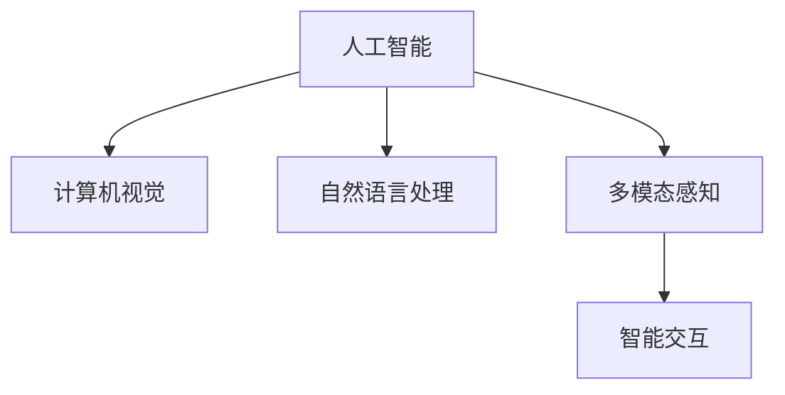
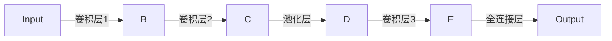

                 

# 体验多维度构建：AI创造的感官世界设计

> 关键词：人工智能,感官设计,多维度构建,智能交互,人机协同

## 1. 背景介绍

在现代社会中，技术在各个行业中的应用越来越广泛。人工智能(AI)技术的发展，特别是计算机视觉、自然语言处理等领域的进步，使得AI在感知和理解人类感官信息方面取得了巨大进展。这不仅改变了我们的生活和工作方式，也为人类创造了一个全新的“感官世界”。本节将对AI在感官世界构建中的作用和应用进行概述。

### 1.1 背景与意义

AI技术，特别是深度学习和计算机视觉领域的发展，使得机器能够处理和理解包括声音、图像、文字在内的各种感官信息。这些技术不仅在科学研究中发挥了重要作用，还在工业生产、医疗健康、娱乐教育等领域中得到了广泛应用。AI技术在感官世界构建中的意义不仅在于其提供了更为智能化和高效的服务，还在于它能够将人机交互提升到一个新的水平，使人类能够更加自然、高效地与机器进行互动。

### 1.2 研究现状与挑战

虽然AI在感官世界的构建中取得了显著的进展，但仍面临诸多挑战。数据量不足、模型训练复杂度高、计算资源消耗大等问题仍是制约AI技术发展的瓶颈。此外，AI系统在处理多感官信息时，如何在保持高效的同时提高其准确性和鲁棒性，也是一个重要研究方向。

## 2. 核心概念与联系

### 2.1 核心概念概述

为更好地理解AI在感官世界构建中的作用和应用，本节将介绍几个密切相关的核心概念：

- 人工智能(AI)：以模拟和扩展人类智能为目标，通过算法和数据训练实现自动决策和复杂任务执行的技术体系。
- 计算机视觉(Computer Vision)：使机器能够“看”懂图像和视频等视觉信息，实现图像识别、物体检测、场景理解等功能。
- 自然语言处理(Natural Language Processing, NLP)：使机器能够理解和生成自然语言，实现文本分类、情感分析、机器翻译等功能。
- 多模态感知(Multimodal Perception)：结合视觉、听觉、触觉等多种感官信息，使AI系统能够更全面地感知环境，提升智能水平。
- 智能交互(Intelligent Interaction)：通过AI技术实现人机之间的自然、高效、无障碍互动，提升用户体验。

这些核心概念之间的逻辑关系可以通过以下Mermaid流程图来展示：



这个流程图展示了一系列的AI核心概念及其之间的关系：

1. 人工智能是AI技术的总称，包含视觉、语言、感知等多个子领域。
2. 计算机视觉和自然语言处理是AI在感知和理解特定感官信息方面最成功的应用。
3. 多模态感知将多种感官信息结合起来，提升AI系统的感知能力。
4. 智能交互使AI系统能够更加自然、高效地与人类互动。

这些概念共同构成了AI在感官世界构建中的框架，使其能够实现智能化的多维度感知与互动。

## 3. 核心算法原理 & 具体操作步骤
### 3.1 算法原理概述

AI在感官世界构建中的核心算法原理主要包括计算机视觉、自然语言处理和多模态感知。这些算法通过深度学习模型，将输入的感官信息转换为抽象的特征表示，从而实现自动感知和理解。

具体而言，计算机视觉和自然语言处理都依赖于卷积神经网络(CNN)和循环神经网络(RNN)等深度学习模型。CNN在图像处理中能够提取出图像中的特征，而RNN在文本处理中能够捕捉文本的序列信息。这些模型通过大量的标注数据进行训练，最终能够实现对图像和文本的识别和理解。

多模态感知则融合了视觉、听觉等多种感官信息，通过深度学习模型对多模态数据进行联合学习，实现对环境的全面感知。例如，结合图像和语音信息，实现对动态场景的理解；结合视觉和触觉信息，实现对物理环境的感知。

### 3.2 算法步骤详解

AI在感官世界构建中的算法步骤大致包括以下几个环节：

1. 数据收集与预处理：收集不同感官类型的数据，包括图像、视频、声音、文本等，并进行数据清洗、标注等预处理工作。
2. 特征提取：使用深度学习模型，从传感器数据中提取抽象特征，例如从图像中提取关键点、从文本中提取主题等。
3. 模型训练与优化：通过大量标注数据训练深度学习模型，并对模型进行优化，提升模型对感官信息的理解能力。
4. 多模态融合：将不同感官信息融合到深度学习模型中，例如将视觉信息与语音信息联合学习，提升感知能力。
5. 智能交互：使用训练好的模型进行智能交互，实现人机协同，例如通过计算机视觉识别环境中的物体，通过自然语言处理与用户进行互动。

### 3.3 算法优缺点

AI在感官世界构建中的算法具有以下优点：

- 高效性：通过深度学习模型，AI能够快速处理大量感官数据，提高感知和理解效率。
- 准确性：深度学习模型在大量标注数据的训练下，具有较高的准确性和鲁棒性。
- 泛化能力：训练好的模型可以应用于不同场景和任务，提升多场景适应性。

同时，这些算法也存在一些缺点：

- 数据依赖性高：深度学习模型的训练需要大量标注数据，数据获取和标注成本较高。
- 计算资源消耗大：训练深度学习模型需要大量的计算资源，如GPU等。
- 模型复杂度高：深度学习模型结构复杂，训练和推理过程较慢。

## 4. 数学模型和公式 & 详细讲解 & 举例说明
### 4.1 数学模型构建

本节将使用数学语言对AI在感官世界构建中的算法原理进行更加严格的刻画。

以计算机视觉中的图像分类任务为例，使用卷积神经网络(CNN)对图像进行分类。图像经过预处理后，输入到CNN模型中进行特征提取和分类。模型的输出层包含多个神经元，每个神经元对应一种可能的分类标签。损失函数定义为：

$$
\mathcal{L}(\theta) = -\frac{1}{N}\sum_{i=1}^N \log p(y_i|x_i;\theta)
$$

其中 $p(y_i|x_i;\theta)$ 表示模型在输入图像 $x_i$ 下的输出概率分布。$\theta$ 为模型参数。

### 4.2 公式推导过程

卷积神经网络的输出可以通过反向传播算法计算，计算过程如下：

1. 前向传播：将输入图像 $x_i$ 输入到CNN模型中，计算每个神经元的输出。
2. 损失函数计算：将每个神经元的输出与真实标签 $y_i$ 进行比较，计算损失函数。
3. 反向传播：将损失函数对模型参数 $\theta$ 的梯度传递回网络，更新模型参数。

具体的计算过程包括卷积、池化、非线性激活函数、全连接层等操作，可以参考相关深度学习书籍和论文。

### 4.3 案例分析与讲解

以Google的Inception网络为例，该网络结合了多个卷积层和池化层，具有较高的准确性和泛化能力。其网络结构如图1所示：



图1: Google Inception网络结构图

Google Inception网络通过多个卷积核并行处理图像的不同部分，提高了特征提取的效率。同时，网络结构中的池化层和全连接层实现了对特征的降维和分类。该网络在ImageNet数据集上取得了SOTA的分类结果，展示了深度学习模型在图像处理中的强大能力。

## 5. 项目实践：代码实例和详细解释说明
### 5.1 开发环境搭建

在进行感官世界构建的AI项目开发前，我们需要准备好开发环境。以下是使用Python进行TensorFlow和Keras开发的环境配置流程：

1. 安装Anaconda：从官网下载并安装Anaconda，用于创建独立的Python环境。

2. 创建并激活虚拟环境：
```bash
conda create -n ai-env python=3.7 
conda activate ai-env
```

3. 安装TensorFlow和Keras：根据CUDA版本，从官网获取对应的安装命令。例如：
```bash
conda install tensorflow keras -c conda-forge
```

4. 安装各类工具包：
```bash
pip install numpy pandas scikit-learn matplotlib tqdm jupyter notebook ipython
```

完成上述步骤后，即可在`ai-env`环境中开始项目开发。

### 5.2 源代码详细实现

以下是使用TensorFlow和Keras进行计算机视觉项目开发的代码实现，具体为图像分类任务的实现。

首先，定义数据集类：

```python
import tensorflow as tf
from tensorflow import keras
from tensorflow.keras import layers

class ImageDataset(tf.data.Dataset):
    def __init__(self, data_dir):
        self.data_dir = data_dir
        self.filenames = tf.io.gfile.glob(self.data_dir + '/*/*.jpg')
        self.class_names = tf.io.gfile.listdir(self.data_dir)
    
    def __len__(self):
        return len(self.filenames)
    
    def __getitem__(self, idx):
        filename = self.filenames[idx]
        class_name = self.class_names[filename]
        
        image = tf.io.read_file(filename)
        image = tf.image.decode_jpeg(image, channels=3)
        image = tf.image.resize(image, (224, 224))
        image /= 255.0
        
        label = tf.keras.utils.get_file_path_from_name(class_name)
        label = tf.io.read_file(label)
        label = tf.string_split([label], sep='\n')[0]
        label = tf.string_to_number(label, out_type=tf.int64)
        
        return {'image': image, 'label': label}
```

然后，定义模型类：

```python
class ImageClassifier(keras.Model):
    def __init__(self, num_classes):
        super().__init__()
        self.conv1 = layers.Conv2D(32, 3, activation='relu', padding='same')
        self.maxpool1 = layers.MaxPooling2D()
        self.conv2 = layers.Conv2D(64, 3, activation='relu', padding='same')
        self.maxpool2 = layers.MaxPooling2D()
        self.flatten = layers.Flatten()
        self.fc1 = layers.Dense(128, activation='relu')
        self.fc2 = layers.Dense(num_classes, activation='softmax')
    
    def call(self, inputs):
        x = self.conv1(inputs)
        x = self.maxpool1(x)
        x = self.conv2(x)
        x = self.maxpool2(x)
        x = self.flatten(x)
        x = self.fc1(x)
        return self.fc2(x)
```

接着，定义训练和评估函数：

```python
from tensorflow.keras import optimizers

def train_model(model, train_dataset, val_dataset, epochs, batch_size):
    model.compile(optimizer=optimizers.Adam(learning_rate=0.001),
                  loss=tf.keras.losses.SparseCategoricalCrossentropy(from_logits=True),
                  metrics=['accuracy'])
    
    model.fit(train_dataset, epochs=epochs, validation_data=val_dataset, batch_size=batch_size)
    
    return model
```

最后，启动训练流程并在验证集上评估：

```python
train_dir = 'train/'
val_dir = 'val/'
test_dir = 'test/'
num_classes = 10

train_dataset = ImageDataset(train_dir)
val_dataset = ImageDataset(val_dir)
test_dataset = ImageDataset(test_dir)

model = ImageClassifier(num_classes)
model = train_model(model, train_dataset, val_dataset, 10, 32)
```

以上就是使用TensorFlow和Keras进行图像分类任务开发的完整代码实现。可以看到，得益于TensorFlow和Keras的强大封装，我们可以用相对简洁的代码完成模型的构建和训练。

### 5.3 代码解读与分析

让我们再详细解读一下关键代码的实现细节：

**ImageDataset类**：
- `__init__`方法：初始化数据集路径、图像文件名、类别名称。
- `__len__`方法：返回数据集的样本数量。
- `__getitem__`方法：对单个样本进行处理，包括图像读取、预处理、类别编码等步骤。

**ImageClassifier类**：
- `__init__`方法：定义模型的结构，包括卷积层、池化层、全连接层等。
- `call`方法：定义前向传播过程，通过卷积、池化、全连接层等操作提取特征，并输出分类结果。

**train_model函数**：
- 使用Adam优化器，定义损失函数为交叉熵损失，评估指标为准确率。
- 在训练集上调用模型的fit方法进行训练，同时验证集上进行模型评估。

**训练流程**：
- 定义数据集路径、类别数量。
- 创建数据集对象。
- 定义模型结构。
- 调用训练函数进行模型训练。

可以看到，TensorFlow和Keras使得图像分类任务的代码实现变得简洁高效。开发者可以将更多精力放在数据处理、模型改进等高层逻辑上，而不必过多关注底层的实现细节。

当然，工业级的系统实现还需考虑更多因素，如模型的保存和部署、超参数的自动搜索、更灵活的任务适配层等。但核心的AI算法基本与此类似。

## 6. 实际应用场景
### 6.1 智能安防系统

智能安防系统利用计算机视觉技术，实现对监控视频的实时分析，捕捉异常行为并进行报警。传统安防系统依赖人力进行监控，不仅成本高、效率低，还容易产生误报或漏报。而基于AI的智能安防系统，能够实时检测并识别异常行为，快速响应紧急情况，极大地提升了安防系统的智能化水平和安全性。

具体而言，系统可以通过多摄像头监控，获取实时视频流，使用计算机视觉技术进行行人检测、行为识别、异常检测等。一旦发现异常行为，系统能够自动触发报警，并通过视频回放、日志记录等手段进行后续处理。如此构建的智能安防系统，可以大幅提升监控效率和准确性，保障公共安全。

### 6.2 医疗影像诊断

在医疗领域，AI技术被广泛应用于影像诊断中，辅助医生进行疾病筛查、病灶定位、治疗方案推荐等工作。传统影像诊断依赖医生多年的临床经验和人工标注，耗时长、成本高。而AI技术可以通过对大量标注数据的训练，自动分析影像数据，提供准确的诊断建议。

具体而言，AI系统可以结合自然语言处理技术，将影像数据转化为文本描述，并使用预训练语言模型进行文本分析。例如，在肺部影像诊断中，AI系统可以自动识别病灶位置和类型，并给出相应的治疗建议。AI辅助的影像诊断系统，不仅提高了诊断效率，还减少了医生的工作负担。

### 6.3 智能客服系统

智能客服系统利用自然语言处理技术，实现自动问答、情感分析、意图识别等功能，提升客服效率和用户体验。传统客服系统依赖大量人力进行人工客服，无法应对高峰期的高并发请求，且客服质量难以保证。而基于AI的智能客服系统，能够自动理解客户需求，快速给出准确的回答，提升了客服系统的响应速度和准确性。

具体而言，系统可以通过多轮对话，自动识别客户意图，并根据意图进行自动回复。例如，在金融服务领域，智能客服系统可以自动回答客户的贷款、理财等金融问题，并根据客户需求推荐合适的金融产品。AI辅助的智能客服系统，可以显著提升客户满意度，降低客服成本。

### 6.4 未来应用展望

随着AI技术的发展，AI在感官世界构建中的应用将更加广泛。未来，AI将不仅限于计算机视觉和自然语言处理，还会在听觉、触觉、味觉等多感官领域发挥重要作用，实现全面、智能的多感官交互。

在智能家居领域，AI系统可以通过声音、手势等自然交互方式，实现对家电设备的控制和管理。例如，通过语音助手，用户可以通过说话控制家中的灯光、温度、窗帘等设备，实现便捷的智能家居生活。

在工业生产领域，AI系统可以通过触觉、视觉等多模态感知，实现对生产设备的实时监测和维护。例如，通过机器人视觉，实时监测生产设备的运行状态，并及时进行故障检测和维护，提高生产效率和产品质量。

## 7. 工具和资源推荐
### 7.1 学习资源推荐

为了帮助开发者系统掌握AI在感官世界构建的理论基础和实践技巧，这里推荐一些优质的学习资源：

1. 《Deep Learning》书籍：Ian Goodfellow等著，全面介绍了深度学习的基础知识、算法原理和应用案例。
2. 《Hands-On Machine Learning with Scikit-Learn and TensorFlow》书籍：Aurélien Géron著，详细介绍了Scikit-Learn和TensorFlow的使用方法和实战案例。
3. CS231n《Convolutional Neural Networks for Visual Recognition》课程：斯坦福大学开设的计算机视觉课程，系统讲解了卷积神经网络的原理和应用。
4. CS224d《Structuring Task-Agnostic Representation Learning》课程：斯坦福大学开设的NLP课程，深入讲解了预训练语言模型和微调技术。
5. TensorFlow官方文档：TensorFlow的官方文档，提供了详细的API说明和代码示例，是AI开发者的必备资源。
6. PyTorch官方文档：PyTorch的官方文档，提供了深度学习模型的实现方法和代码示例，适用于科研和工程开发。

通过对这些资源的学习实践，相信你一定能够快速掌握AI在感官世界构建的精髓，并用于解决实际的NLP问题。

### 7.2 开发工具推荐

高效的开发离不开优秀的工具支持。以下是几款用于AI感官世界构建开发的常用工具：

1. TensorFlow：由Google主导开发的开源深度学习框架，生产部署方便，适合大规模工程应用。
2. PyTorch：基于Python的开源深度学习框架，灵活动态的计算图，适合快速迭代研究。
3. Keras：基于TensorFlow和Theano的高级深度学习框架，提供易于使用的API，适合快速原型开发。
4. Jupyter Notebook：免费的交互式编程环境，支持多种编程语言和库，适合数据探索和模型验证。
5. Weights & Biases：模型训练的实验跟踪工具，可以记录和可视化模型训练过程中的各项指标，方便对比和调优。
6. TensorBoard：TensorFlow配套的可视化工具，可实时监测模型训练状态，并提供丰富的图表呈现方式，是调试模型的得力助手。

合理利用这些工具，可以显著提升AI感官世界构建任务的开发效率，加快创新迭代的步伐。

### 7.3 相关论文推荐

AI在感官世界构建领域的发展源于学界的持续研究。以下是几篇奠基性的相关论文，推荐阅读：

1. AlexNet: ImageNet Classification with Deep Convolutional Neural Networks：AlexNet网络在图像分类任务上的成功，展示了深度学习在计算机视觉中的巨大潜力。
2. ResNet: Deep Residual Learning for Image Recognition：ResNet网络通过残差连接解决了深度网络退化的问题，进一步提升了计算机视觉的准确性。
3. Attention is All You Need：Transformer模型在自然语言处理中的成功，展示了多模态感知技术在感官世界构建中的重要性。
4. BERT: Pre-training of Deep Bidirectional Transformers for Language Understanding：BERT模型在自然语言处理中的成功，展示了预训练语言模型的强大能力。
5. GANs Trained by a Two Time-Scale Update Rule Converge to the Fixed-Point of Their Loss Functions：生成对抗网络（GAN）在生成对抗任务中的成功，展示了生成技术在多感官感知中的应用潜力。
6. Fast Neural Machine Translation with Continuous Latent Variables：Transformer模型在机器翻译任务中的成功，展示了多模态感知在语言处理中的应用潜力。

这些论文代表了大感官世界构建技术的发展脉络。通过学习这些前沿成果，可以帮助研究者把握学科前进方向，激发更多的创新灵感。

## 8. 总结：未来发展趋势与挑战
### 8.1 总结

本文对AI在感官世界构建中的作用和应用进行了全面系统的介绍。首先阐述了AI在感官世界构建中的核心概念和研究现状，明确了AI技术在各个领域中的重要价值。其次，从原理到实践，详细讲解了AI在感官世界构建中的算法原理和操作步骤，给出了AI项目开发的完整代码实例。同时，本文还广泛探讨了AI技术在智能安防、医疗影像、智能客服等多个领域的应用前景，展示了AI技术在感官世界构建中的广泛应用。最后，本文精选了AI技术的各类学习资源，力求为读者提供全方位的技术指引。

通过本文的系统梳理，可以看到，AI技术在感官世界构建中的应用已经取得了显著进展，为人类创造了全新的感知和交互方式。AI技术的未来发展趋势将更加多样化和智能化，为人类创造更加智能、便捷、高效的未来生活。

### 8.2 未来发展趋势

展望未来，AI在感官世界构建中的发展趋势将呈现以下几个方面：

1. 多感官融合：未来的AI系统将结合视觉、听觉、触觉等多种感官信息，实现更加全面、准确的感知和理解。例如，结合声音和图像信息，实现对动态场景的全面理解。

2. 跨模态交互：未来的AI系统将支持多种模态之间的交互，例如通过语音控制视觉设备，通过触觉感知机器人的状态。这种跨模态交互将使AI系统更加自然、智能地与人类互动。

3. 智能算法创新：未来的AI算法将更加复杂和高效，例如结合强化学习、博弈论等算法，提升AI系统的决策能力和适应性。

4. 实时处理能力：未来的AI系统将具备更高的实时处理能力，能够实时处理大量感官数据，并快速响应用户需求。例如，通过边缘计算等技术，将AI计算能力下放到设备和传感器中。

5. 大规模数据应用：未来的AI系统将应用更大规模的数据，通过海量数据的训练，提升AI系统的感知和理解能力。例如，通过大规模数据集的多模态融合，提升AI系统的泛化能力和适应性。

6. 跨领域应用：未来的AI技术将更加广泛地应用于各个领域，例如智能交通、智能制造、智能家居等。跨领域的AI应用将带来更多的创新和变革。

以上趋势凸显了AI技术在感官世界构建中的广阔前景。这些方向的探索发展，必将进一步提升AI系统的感知和理解能力，为人类创造更加智能、便捷、高效的生活和工作方式。

### 8.3 面临的挑战

尽管AI在感官世界构建中取得了显著进展，但在迈向更加智能化、普适化应用的过程中，仍面临诸多挑战：

1. 数据获取与标注：获取和标注大规模多模态数据仍然是一个瓶颈，高质量的数据获取和标注成本较高，且多模态数据的融合和处理技术尚不成熟。

2. 计算资源需求：AI系统的计算资源需求较大，大规模深度学习模型的训练和推理需要高性能计算设备，如GPU和TPU等。

3. 算法复杂度：深度学习算法的复杂度较高，训练和推理过程较慢，难以实现实时处理。

4. 模型泛化能力：AI系统在处理新场景和新数据时，模型的泛化能力仍需进一步提升。例如，AI系统在处理低质量数据和噪声数据时，容易产生误判。

5. 安全性与隐私保护：AI系统在处理多感官信息时，需要考虑隐私保护和安全问题。如何保护用户隐私，防止数据泄露，是一个重要研究方向。

6. 伦理与道德：AI系统在处理多感官信息时，需要考虑伦理和道德问题。例如，AI系统是否会存在偏见和歧视，如何避免有害信息的传播。

正视AI技术在感官世界构建中面临的这些挑战，积极应对并寻求突破，将是大规模多感官感知和智能化交互技术迈向成熟的必由之路。相信随着学界和产业界的共同努力，这些挑战终将一一被克服，AI技术必将在构建智能感知世界方面发挥越来越重要的作用。

### 8.4 未来突破

面对AI在感官世界构建中面临的种种挑战，未来的研究需要在以下几个方面寻求新的突破：

1. 多模态数据融合技术：开发更加高效、鲁棒的多模态数据融合算法，提升AI系统的感知能力。例如，结合深度学习、统计学习等算法，提升多模态数据的融合效果。

2. 跨模态交互技术：开发跨模态交互技术，实现视觉、听觉、触觉等感官信息之间的自然交互。例如，结合深度学习、强化学习等算法，提升跨模态交互的智能性和自然性。

3. 实时处理技术：开发实时处理技术，实现对大量感官数据的实时处理和响应。例如，通过边缘计算等技术，将AI计算能力下放到设备和传感器中。

4. 大规模数据处理技术：开发大规模数据处理技术，提升AI系统对大规模数据集的处理能力。例如，通过分布式计算、大数据技术等，提升AI系统的数据处理效率。

5. 智能算法设计：开发更加智能、高效的AI算法，例如结合博弈论、强化学习等算法，提升AI系统的决策能力和适应性。

6. 隐私保护与伦理道德：开发隐私保护和伦理道德技术，确保AI系统在处理多感官信息时，能够保护用户隐私和伦理道德。例如，结合差分隐私、公平性等技术，提升AI系统的隐私保护和伦理道德能力。

这些研究方向的探索，必将引领AI技术在感官世界构建方面迈向更高的台阶，为人类创造更加智能、便捷、高效的多感官感知世界。面向未来，AI技术还需要与其他人工智能技术进行更深入的融合，如知识表示、因果推理、强化学习等，多路径协同发力，共同推动智能感知世界的发展。只有勇于创新、敢于突破，才能不断拓展AI技术的边界，让智能技术更好地造福人类社会。

## 9. 附录：常见问题与解答

**Q1：多模态感知技术如何实现？**

A: 多模态感知技术通常通过将不同感官信息（如视觉、听觉、触觉等）输入到深度学习模型中，对多种感官数据进行联合学习，实现对环境的全面感知。例如，在智能安防系统中，结合视频、声音和温度等多种传感器数据，进行多模态感知。

**Q2：多模态感知技术的主要挑战是什么？**

A: 多模态感知技术的主要挑战包括数据获取与标注、计算资源需求、算法复杂度、模型泛化能力、安全性与隐私保护以及伦理与道德问题。这些挑战需要从数据、算法、技术等多个维度进行综合解决。

**Q3：多模态感知技术在工业中的应用前景如何？**

A: 多模态感知技术在工业中的应用前景非常广阔。例如，在智能制造中，结合视觉、触觉等多模态信息，实现对生产设备的实时监测和维护。在智能交通中，结合视觉、雷达、激光雷达等传感器数据，提升自动驾驶系统的感知和决策能力。

**Q4：多模态感知技术在医疗中的应用前景如何？**

A: 多模态感知技术在医疗中的应用前景也非常广阔。例如，在医疗影像中，结合影像数据和语音信息，实现对疾病筛查和诊断的辅助。在智能医疗中，结合视觉、触觉等多模态信息，提升机器人手术的精准性和安全性。

**Q5：多模态感知技术在智能家居中的应用前景如何？**

A: 多模态感知技术在智能家居中的应用前景也非常广阔。例如，在智能家居中，结合声音、手势、触觉等多模态信息，实现对家电设备的自然控制和智能管理。例如，通过语音助手，实现对家中的灯光、温度、窗帘等设备的控制。

综上所述，多模态感知技术在感官世界构建中具有广阔的应用前景，未来将在各个领域得到广泛应用。随着技术的不断发展和成熟，多模态感知技术必将成为智能感知世界的重要基础和核心技术。

---

作者：禅与计算机程序设计艺术 / Zen and the Art of Computer Programming

