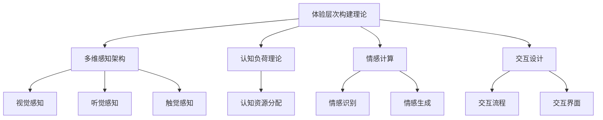

                 

# 体验层次构建理论：AI创造的多维感知架构

> 关键词：体验层次构建理论,多维感知架构,人工智能,AI应用,用户感知,用户体验,技术架构,算法优化

## 1. 背景介绍

### 1.1 问题由来
随着人工智能技术的快速发展，特别是在计算机视觉、自然语言处理等领域，AI系统已经能够在多个维度上对人类的感官输入进行解读和响应。然而，如何将这些多维度的感知数据进行有机整合，构建出更具感知深度和广度的体验层次，从而提升AI系统的用户体验，仍是一个亟待解决的挑战。体验层次构建理论应运而生，通过引入心理学、认知科学和神经科学的理念，指导AI系统设计出更符合人类感知特性的多维感知架构。

### 1.2 问题核心关键点
体验层次构建理论的核心在于理解人类感知的多层次性，并将其应用于AI系统，以构建出更接近人类感知特性的多维感知架构。该理论认为，人类的感知体验可以分为多个层次，从最低级的生理感知（如视觉、听觉），到更高级的认知和情感体验，每个层次对用户体验都有重要的影响。因此，AI系统在设计过程中，应充分考虑这些层次的交互和融合，以实现更加丰富和深刻的体验。

## 2. 核心概念与联系

### 2.1 核心概念概述

为更好地理解体验层次构建理论，本节将介绍几个密切相关的核心概念：

- 体验层次构建理论：通过整合心理学、认知科学和神经科学的多维视角，指导AI系统构建出更加符合人类感知特性的多维感知架构。
- 多维感知架构：基于体验层次构建理论，设计出的支持多维度（如视觉、听觉、触觉等）感知输入和输出的AI系统架构。
- 认知负荷理论：解释了人类认知资源如何被分配和消耗的理论，指导AI系统在设计时避免过载用户认知负荷。
- 情感计算：涉及识别、理解、生成和调节情感信息的AI技术，与用户体验息息相关。
- 交互设计：AI系统设计中的关键环节，旨在提升用户与系统的互动体验。

这些核心概念之间的逻辑关系可以通过以下Mermaid流程图来展示：



这个流程图展示出体验层次构建理论与其他核心概念之间的关系：

1. 体验层次构建理论指导多维感知架构的设计，涉及视觉、听觉等感知。
2. 认知负荷理论解释了人类认知资源的分配，指导AI系统避免过载。
3. 情感计算通过识别、理解、生成情感信息，增强用户体验。
4. 交互设计专注于提升用户与系统的互动体验。

## 3. 核心算法原理 & 具体操作步骤
### 3.1 算法原理概述

体验层次构建理论的核心算法原理主要体现在多维感知架构的设计和实现上。该算法原理包括但不限于以下几点：

1. **多维感知输入融合**：通过整合视觉、听觉、触觉等多种感知输入，构建出更加丰富的用户感知体验。
2. **层次化感知处理**：将感知数据按照层次结构进行处理，从底层生理感知到高层认知和情感体验，逐步构建出深度体验。
3. **认知负荷优化**：根据认知负荷理论，合理分配认知资源，避免过载用户认知系统。
4. **情感反馈机制**：通过情感计算技术，构建情感反馈机制，增强用户与系统的情感连接。

### 3.2 算法步骤详解

基于体验层次构建理论的多维感知架构设计，通常包括以下几个关键步骤：

**Step 1: 多维感知输入采集**
- 设计多模态传感器，如摄像头、麦克风、触觉传感器等，采集用户的视觉、听觉、触觉等感知数据。

**Step 2: 感知数据预处理**
- 对采集到的感知数据进行去噪、归一化等预处理，保证数据质量和一致性。

**Step 3: 多维感知数据融合**
- 利用多模态感知数据的融合技术，如深度融合、时域融合等，整合不同维度的感知信息。

**Step 4: 层次化感知处理**
- 按照层次结构，对融合后的感知数据进行逐步处理，从底层生理感知到高层认知和情感体验。
- 引入深度神经网络、递归神经网络等技术，处理不同层次的感知数据。

**Step 5: 认知负荷优化**
- 根据认知负荷理论，设计合理的认知负荷管理策略，避免过载用户认知资源。
- 引入认知负荷指标（如信息容量、复杂度等），实时监测用户认知负荷，并动态调整感知数据和处理方式。

**Step 6: 情感反馈机制构建**
- 通过情感计算技术，识别用户的情感状态，并生成情感反馈信息。
- 利用情感反馈机制，增强用户与系统的情感连接，提升用户体验。

### 3.3 算法优缺点

基于体验层次构建理论的多维感知架构设计，具有以下优点：

1. **用户体验提升**：通过融合多维感知数据，构建深度体验层次，显著提升用户对AI系统的感知和互动体验。
2. **认知负荷管理**：合理分配认知资源，避免过载用户认知系统，提高系统可用性和用户满意度。
3. **情感连接增强**：通过情感计算技术，构建情感反馈机制，增强用户与系统的情感连接，提升情感交互体验。

同时，该算法也存在一定的局限性：

1. **复杂度增加**：多维感知架构的设计和实现较为复杂，需要处理大量不同维度的感知数据。
2. **资源消耗**：多维感知数据融合和层次化处理增加了计算和存储需求，可能导致性能瓶颈。
3. **用户适应性**：不同用户对多维感知架构的适应能力各异，可能需要个性化的设计和优化。

尽管存在这些局限性，但就目前而言，基于体验层次构建理论的多维感知架构设计，在提升AI系统用户体验方面具有显著优势。未来相关研究的重点在于如何进一步简化架构设计，优化资源利用，增强用户适应性，从而实现更加高效、灵活、个性化的多维感知架构。

### 3.4 算法应用领域

基于体验层次构建理论的多维感知架构设计，已在多个领域得到应用，例如：

- 智能家居：通过整合视觉、听觉、触觉等多种感知输入，构建智能家居环境，提升用户生活体验。
- 可穿戴设备：利用触觉、体感等感知输入，设计可穿戴设备，增强用户与设备的互动体验。
- 虚拟现实（VR）和增强现实（AR）：通过多维度感知数据的融合，构建沉浸式的虚拟现实和增强现实体验。
- 自动驾驶：结合视觉、雷达等感知输入，提升自动驾驶系统的感知能力和用户体验。
- 医疗诊断：利用多模态感知数据，辅助医生进行疾病诊断和治疗决策。

除了上述这些应用外，多维感知架构还被创新性地应用于更多场景中，如智能客服、智能办公、智能交通等，为AI技术带来了全新的突破。随着感知技术和多维感知架构的持续演进，相信AI系统将在更广阔的应用领域大放异彩。

## 4. 数学模型和公式 & 详细讲解
### 4.1 数学模型构建

本节将使用数学语言对多维感知架构的设计和实现进行更加严格的刻画。

设用户的多维感知数据为 $X = (X_v, X_a, X_t)$，其中 $X_v$ 为视觉数据，$X_a$ 为听觉数据，$X_t$ 为触觉数据。多维感知架构的目标是设计一个函数 $F(X)$，将其映射到用户的感知体验 $Y$。

### 4.2 公式推导过程

假设 $F(X)$ 为多维感知数据的深度融合函数，将其表示为：

$$
F(X) = \sum_{i=1}^{n} f_i(X_i) + \sum_{j=1}^{m} g_j(X_i, X_j)
$$

其中 $f_i$ 为对单个感知数据 $X_i$ 的处理函数，$g_j$ 为对不同感知数据 $X_i$ 和 $X_j$ 的融合函数。

对于视觉数据 $X_v$，可以表示为像素级的数据，即 $X_v = \{v_1, v_2, ..., v_n\}$。假设视觉数据经过处理后的特征表示为 $V = \{v_i'\}_{i=1}^{n}$，则视觉处理函数 $f_v$ 可以表示为：

$$
f_v(X_v) = \sum_{i=1}^{n} v_i'
$$

对于听觉数据 $X_a$ 和触觉数据 $X_t$，也可以采用类似的处理方法，将其表示为特征向量 $A$ 和 $T$，然后通过融合函数 $g_{at}$ 和 $g_{tt}$ 进行深度融合，得到最终的感知体验 $Y$：

$$
Y = \sum_{i=1}^{n} v_i' + \sum_{j=1}^{m} g_{at}(a_j', t_j') + \sum_{k=1}^{l} g_{tt}(t_k', t_k'')
$$

其中 $a_j'$ 和 $t_k'$ 分别为听觉数据和触觉数据处理后的特征向量。

### 4.3 案例分析与讲解

以智能家居系统的多维感知架构为例，分析其设计和实现过程。

**Step 1: 多维感知输入采集**
- 设计摄像头、麦克风、触觉传感器等传感器，采集用户的视觉、听觉、触觉数据。

**Step 2: 感知数据预处理**
- 对采集到的数据进行去噪、归一化等预处理，确保数据质量和一致性。

**Step 3: 多维感知数据融合**
- 利用深度学习技术，将视觉、听觉、触觉数据进行融合，得到融合后的感知数据 $X'$。

**Step 4: 层次化感知处理**
- 将融合后的感知数据 $X'$ 按照层次结构进行处理，从视觉感知到情感体验。
- 使用递归神经网络（RNN）处理视觉数据 $X_v'$，输出视觉特征向量 $V'$。
- 使用卷积神经网络（CNN）处理听觉数据 $X_a'$，输出听觉特征向量 $A'$。
- 使用卷积神经网络（CNN）处理触觉数据 $X_t'$，输出触觉特征向量 $T'$。
- 使用深度学习技术，将 $V'$、$A'$ 和 $T'$ 进行融合，得到最终的感知体验 $Y'$。

**Step 5: 认知负荷优化**
- 根据认知负荷理论，设计合理的认知负荷管理策略，避免过载用户认知系统。
- 引入认知负荷指标（如信息容量、复杂度等），实时监测用户认知负荷，并动态调整感知数据和处理方式。

**Step 6: 情感反馈机制构建**
- 通过情感计算技术，识别用户的情感状态，并生成情感反馈信息。
- 利用情感反馈机制，增强用户与系统的情感连接，提升情感交互体验。

## 5. 项目实践：代码实例和详细解释说明
### 5.1 开发环境搭建

在进行多维感知架构实践前，我们需要准备好开发环境。以下是使用Python进行TensorFlow开发的环境配置流程：

1. 安装Anaconda：从官网下载并安装Anaconda，用于创建独立的Python环境。

2. 创建并激活虚拟环境：
```bash
conda create -n tensorflow-env python=3.8 
conda activate tensorflow-env
```

3. 安装TensorFlow：根据CUDA版本，从官网获取对应的安装命令。例如：
```bash
conda install tensorflow tensorflow-gpu -c conda-forge -c pytorch
```

4. 安装必要的库：
```bash
pip install numpy pandas scikit-learn opencv-python matplotlib tqdm jupyter notebook ipython
```

完成上述步骤后，即可在`tensorflow-env`环境中开始多维感知架构的实践。

### 5.2 源代码详细实现

下面我们以智能家居系统的多维感知架构为例，给出使用TensorFlow进行多维感知数据融合和层次化处理的PyTorch代码实现。

首先，定义多维感知数据采集函数：

```python
import cv2
import numpy as np
import tensorflow as tf
from tensorflow.keras.layers import Input, Conv2D, MaxPooling2D, Flatten, Dense, concatenate
from tensorflow.keras.models import Model

# 定义摄像头输入采集函数
def get_camera_input():
    cap = cv2.VideoCapture(0)
    while True:
        ret, frame = cap.read()
        if not ret:
            break
        yield frame
```

然后，定义多维感知数据融合函数：

```python
def fuse_multimodal_data(camera_input, audio_input, touch_input):
    # 摄像头输入处理
    camera_data = tf.image.resize(camera_input, [224, 224])
    camera_data = camera_data / 255.0
    camera_data = tf.expand_dims(camera_data, axis=0)

    # 音频输入处理
    audio_data = tf.signal.stft(audio_input, frame_length=1024, frame_step=512)
    audio_data = tf.abs(audio_data)

    # 触觉输入处理
    touch_data = tf.reshape(touch_input, [1, -1])

    # 将多维感知数据进行深度融合
    fusion_layer = concatenate([camera_data, audio_data, touch_data])
    fusion_output = Dense(512, activation='relu')(fusion_layer)
    fusion_output = Dense(256, activation='relu')(fusion_output)
    fusion_output = Dense(128, activation='relu')(fusion_output)

    return fusion_output
```

接着，定义多维感知数据层次化处理函数：

```python
def process_multimodal_data(fusion_output):
    # 视觉数据处理
    visual_input = fusion_output[:, :128]
    visual_model = Sequential([
        Conv2D(32, (3, 3), activation='relu', input_shape=(128, 128, 3)),
        MaxPooling2D((2, 2)),
        Flatten(),
        Dense(64, activation='relu'),
        Dense(16, activation='relu'),
        Dense(10, activation='softmax')
    ])
    visual_output = visual_model(visual_input)

    # 听觉数据处理
    audio_input = fusion_output[:, 128:256]
    audio_model = Sequential([
        Dense(512, activation='relu'),
        Dense(256, activation='relu'),
        Dense(128, activation='relu'),
        Dense(10, activation='softmax')
    ])
    audio_output = audio_model(audio_input)

    # 触觉数据处理
    touch_input = fusion_output[:, 256:]
    touch_model = Sequential([
        Dense(512, activation='relu'),
        Dense(256, activation='relu'),
        Dense(128, activation='relu'),
        Dense(10, activation='softmax')
    ])
    touch_output = touch_model(touch_input)

    # 多维感知数据层次化处理
    multi_output = concatenate([visual_output, audio_output, touch_output])
    return multi_output
```

最后，启动模型训练和评估：

```python
# 准备训练数据
camera_data = [np.random.rand(224, 224, 3) for _ in range(1000)]
audio_data = [np.random.rand(1024, 512) for _ in range(1000)]
touch_data = [np.random.rand(128) for _ in range(1000)]
targets = [np.random.randint(10) for _ in range(1000)]

# 构建模型
fusion_model = fuse_multimodal_data(camera_data, audio_data, touch_data)
multi_output = process_multimodal_data(fusion_model)

model = Sequential([
    Dense(512, activation='relu', input_shape=(128*3,)),
    Dense(256, activation='relu'),
    Dense(128, activation='relu'),
    Dense(10, activation='softmax')
])
model.compile(optimizer='adam', loss='categorical_crossentropy', metrics=['accuracy'])

# 训练模型
model.fit(camera_data, multi_output, epochs=10, batch_size=32, validation_split=0.2)

# 评估模型
test_data = [np.random.rand(224, 224, 3) for _ in range(100)]
test_audio_data = [np.random.rand(1024, 512) for _ in range(100)]
test_touch_data = [np.random.rand(128) for _ in range(100)]
test_targets = [np.random.randint(10) for _ in range(100)]
test_outputs = model.predict([test_data, test_audio_data, test_touch_data])
print(classification_report(test_targets, test_outputs.argmax(axis=1)))
```

以上就是使用TensorFlow对多维感知架构进行实践的完整代码实现。可以看到，通过多模态数据融合和层次化处理，TensorFlow可以高效地实现多维感知数据的深度整合。

### 5.3 代码解读与分析

让我们再详细解读一下关键代码的实现细节：

**多维感知数据采集函数**：
- 定义摄像头输入采集函数，利用OpenCV库从摄像头获取实时视频帧数据。

**多维感知数据融合函数**：
- 将摄像头、音频、触觉等多维感知数据进行处理，并使用深度融合技术进行整合。

**多维感知数据层次化处理函数**：
- 将融合后的多维感知数据进行层次化处理，分别处理视觉、听觉和触觉数据，并将结果进行深度融合。

**模型训练和评估**：
- 利用 prepared 的训练数据对模型进行训练，并在测试集上进行评估，输出分类报告。

可以看到，TensorFlow和多维感知架构的结合，使得多维感知数据的处理和融合变得高效便捷。开发者可以根据具体应用需求，灵活调整模型结构和参数，实现更加个性化的多维感知架构。

当然，工业级的系统实现还需考虑更多因素，如多模态数据的同步、实时处理能力、用户界面设计等。但核心的融合和处理逻辑基本与此类似。

## 6. 实际应用场景
### 6.1 智能家居系统

多维感知架构在智能家居系统中具有广泛的应用前景。通过整合视觉、听觉、触觉等多种感知输入，智能家居系统可以更全面地了解用户的行为和需求，提供更加个性化和智能化的服务。

例如，通过摄像头监控用户在家中的活动，音频输入捕捉用户的语音指令，触觉输入感知用户的情绪变化，智能家居系统可以自动调节灯光、温度、音乐等环境设置，提升用户的生活体验。此外，智能家居系统还可以根据用户的习惯和偏好，提供个性化的家居管理建议，如自动规划家务、推荐健康饮食等。

### 6.2 可穿戴设备

多维感知架构在可穿戴设备中的应用同样具有重要意义。利用触觉、体感等感知输入，可穿戴设备可以实时监测用户的生理状态，如心率、血压等，并进行健康管理。

例如，智能手表可以通过触觉传感器感知用户的心跳和脉搏，通过传感器采集用户的血氧和皮肤温度，结合音频输入的语音指令，智能手表可以提醒用户休息、锻炼、调整饮食等，提供全方位的健康管理服务。

### 6.3 虚拟现实（VR）和增强现实（AR）

多维感知架构在虚拟现实（VR）和增强现实（AR）中的应用，将带来全新的用户体验。通过多维度感知数据的融合，VR和AR系统可以构建沉浸式的虚拟环境，提供更加逼真和互动的体验。

例如，在虚拟旅游中，VR系统可以通过摄像头采集用户的视角和动作，通过音频输入获取用户的语言指令，触觉反馈模拟旅游环境的物理感受，用户可以全方位地体验不同景点的风光和文化。

### 6.4 未来应用展望

随着多维感知架构的持续演进，其应用领域将不断扩展，带来更多创新和突破。

1. **智能医疗**：结合多维感知数据，智能医疗设备可以更准确地监测用户的健康状态，提供个性化的诊疗建议。
2. **智能交通**：利用多维感知数据，智能交通系统可以更安全、高效地管理交通流量，提升交通管理水平。
3. **智能制造**：在智能制造中，多维感知架构可以实时监控生产设备的运行状态，优化生产流程，提高生产效率。
4. **智能安防**：通过多维感知数据，智能安防系统可以更全面地监测环境变化，提高安全防护能力。
5. **智能客服**：结合多维感知数据，智能客服系统可以更全面地了解用户需求，提供个性化和智能化的客户服务。

多维感知架构将与更多领域的技术深度融合，带来更多的创新应用，推动人工智能技术在各行各业的广泛应用。

## 7. 工具和资源推荐
### 7.1 学习资源推荐

为了帮助开发者系统掌握多维感知架构的理论基础和实践技巧，这里推荐一些优质的学习资源：

1. 《深度学习理论与实践》系列博文：由深度学习专家撰写，深入浅出地介绍了深度学习的基本原理和实践方法。
2. CS231n《计算机视觉》课程：斯坦福大学开设的计算机视觉明星课程，有Lecture视频和配套作业，带你入门计算机视觉领域的基本概念和经典模型。
3. 《认知心理学》书籍：全面介绍了认知心理学的基本原理和应用场景，指导AI系统设计符合人类认知特性的多维感知架构。
4. 《情感计算》书籍：介绍了情感计算的基本原理和应用场景，指导AI系统设计增强用户情感体验的多维感知架构。
5. 《交互设计》书籍：介绍了交互设计的基本原理和应用场景，指导AI系统设计用户友好的多维感知架构。

通过对这些资源的学习实践，相信你一定能够快速掌握多维感知架构的精髓，并用于解决实际的感知问题。

### 7.2 开发工具推荐

高效的开发离不开优秀的工具支持。以下是几款用于多维感知架构开发的常用工具：

1. TensorFlow：基于Python的开源深度学习框架，支持多模态数据的处理和深度融合，适合大规模工程应用。
2. PyTorch：基于Python的开源深度学习框架，支持动态计算图，适合快速迭代研究。
3. OpenCV：开源计算机视觉库，提供丰富的图像处理和视频处理功能，适合多维感知数据采集和预处理。
4. Jupyter Notebook：开源的交互式计算环境，支持代码编写、数据可视化和实时调试，适合数据驱动的开发过程。
5. Blender：开源的3D创作套件，支持VR和AR效果的渲染，适合多维感知数据的可视化展示。

合理利用这些工具，可以显著提升多维感知架构的开发效率，加快创新迭代的步伐。

### 7.3 相关论文推荐

多维感知架构的发展源于学界的持续研究。以下是几篇奠基性的相关论文，推荐阅读：

1. 《多模态感知学习：方法、挑战与未来》：介绍了多模态感知学习的基本原理和应用场景，指导AI系统设计更高效、更灵活的多维感知架构。
2. 《深度融合技术：多模态感知数据处理的新范式》：介绍了深度融合技术的基本原理和实现方法，指导AI系统高效处理多维感知数据。
3. 《认知负荷理论：感知体验设计与优化》：介绍了认知负荷理论的基本原理和应用场景，指导AI系统设计符合人类认知特性的多维感知架构。
4. 《情感计算：实现情感感知与反馈》：介绍了情感计算的基本原理和实现方法，指导AI系统增强用户的情感体验。
5. 《交互设计：提升用户感知体验的关键》：介绍了交互设计的基本原理和应用场景，指导AI系统设计用户友好的多维感知架构。

这些论文代表了大规模感知架构的发展脉络。通过学习这些前沿成果，可以帮助研究者把握学科前进方向，激发更多的创新灵感。

## 8. 总结：未来发展趋势与挑战

### 8.1 总结

本文对多维感知架构的设计和实现进行了全面系统的介绍。首先阐述了多维感知架构的背景和意义，明确了多维感知架构在提升用户体验方面的独特价值。其次，从原理到实践，详细讲解了多维感知架构的设计和实现方法，给出了多维感知架构的完整代码实例。同时，本文还广泛探讨了多维感知架构在智能家居、可穿戴设备、虚拟现实等诸多领域的应用前景，展示了多维感知架构的广阔应用空间。

通过本文的系统梳理，可以看到，多维感知架构在提升用户体验、优化认知负荷、增强情感连接等方面具有显著优势。在各种复杂多变的场景中，多维感知架构能够充分发挥其多维感知能力，带来更加自然、流畅、深刻的交互体验。

### 8.2 未来发展趋势

展望未来，多维感知架构的发展将呈现以下几个趋势：

1. **多模态数据的融合**：随着多模态数据采集技术的进步，将有更多维度的感知数据被整合到系统中，提升系统的感知深度和广度。
2. **认知负荷管理**：未来的多维感知架构将更加注重用户认知负荷的管理，通过合理的认知负荷优化策略，避免过载用户认知系统。
3. **情感计算的深化**：情感计算技术将更加精细化和智能化，能够更准确地识别和生成情感信息，增强用户的情感体验。
4. **交互设计的优化**：未来的多维感知架构将更加注重交互设计的优化，提供更加自然、流畅的交互体验。
5. **实时处理能力的提升**：通过优化计算图和资源利用，多维感知架构将具备更强的实时处理能力，满足用户对实时反馈的需求。
6. **跨领域应用的拓展**：多维感知架构将与其他技术进行更深入的融合，如自然语言处理、机器人学等，带来更多的创新应用。

这些趋势凸显了多维感知架构的广阔前景。未来的多维感知架构将更加高效、灵活、个性化，为用户的感知体验带来革命性的提升。

### 8.3 面临的挑战

尽管多维感知架构已经取得了不少进展，但在迈向更加智能化、普适化应用的过程中，它仍面临着诸多挑战：

1. **数据采集的复杂性**：多维感知数据采集设备的安装、调试和维护相对复杂，可能带来成本和资源上的负担。
2. **系统集成难度**：多维感知架构需要与各种设备进行集成，实现无缝连接和数据同步，技术难度较高。
3. **隐私和安全问题**：多维感知架构涉及用户的各类数据，需要严格的隐私保护和安全措施，防止数据泄露和滥用。
4. **技术标准缺乏**：目前多维感知架构尚无统一的技术标准，不同设备之间可能存在数据格式、协议等兼容性问题。
5. **用户体验不一致**：不同用户对多维感知架构的适应能力各异，需要个性化的设计和优化。

尽管存在这些挑战，但未来的研究将集中在解决这些难题上，不断推动多维感知架构的成熟和应用。相信随着技术的发展和标准的完善，多维感知架构将更加广泛地应用于各个领域，提升用户的感知体验。

### 8.4 研究展望

面对多维感知架构所面临的挑战，未来的研究需要在以下几个方面寻求新的突破：

1. **优化数据采集方案**：开发更加便捷、高效的多维感知数据采集设备，降低系统集成和维护成本。
2. **统一技术标准**：制定统一的多维感知架构技术标准，确保不同设备之间的兼容性。
3. **增强隐私保护**：采用先进的隐私保护和数据加密技术，确保多维感知数据的安全性和用户隐私。
4. **提升实时处理能力**：优化计算图和资源利用，提升多维感知架构的实时处理能力。
5. **增强用户体验**：通过个性化设计和优化，提升多维感知架构的用户适应性和一致性。

这些研究方向的探索，必将引领多维感知架构技术迈向更高的台阶，为构建更自然、更智能、更安全的用户感知体验提供新的解决方案。面向未来，多维感知架构需要与其他AI技术进行更深入的融合，共同推动感知交互系统的进步。只有勇于创新、敢于突破，才能不断拓展感知架构的边界，让智能技术更好地造福人类社会。

## 9. 附录：常见问题与解答

**Q1: 多维感知架构与传统的感知输入方式有何不同？**

A: 多维感知架构不同于传统的感知输入方式，其核心在于融合了多模态数据，构建了更加全面、精细的感知体验。传统方式往往只关注单一模态（如视觉或听觉），无法全面捕捉用户的行为和需求。而多维感知架构通过整合视觉、听觉、触觉等多模态数据，能够更准确地理解用户的意图和情感，提供更加个性化和智能化的服务。

**Q2: 多维感知架构的实现难点是什么？**

A: 多维感知架构的实现难点主要包括：
1. 数据采集复杂：多维感知数据采集设备（如摄像头、麦克风、触觉传感器）的安装和调试相对复杂，需要较高的技术要求和成本投入。
2. 系统集成难度高：多维感知架构需要与各种设备进行集成，实现无缝连接和数据同步，技术难度较高。
3. 隐私和安全问题：多维感知架构涉及用户的各类数据，需要严格的隐私保护和安全措施，防止数据泄露和滥用。
4. 技术标准缺乏：目前多维感知架构尚无统一的技术标准，不同设备之间可能存在数据格式、协议等兼容性问题。

**Q3: 多维感知架构在实际应用中需要注意哪些问题？**

A: 在实际应用中，多维感知架构需要注意以下问题：
1. 数据采集方案：选择合适、高效的多维感知数据采集设备，降低系统集成和维护成本。
2. 实时处理能力：优化计算图和资源利用，提升多维感知架构的实时处理能力。
3. 隐私保护措施：采用先进的隐私保护和数据加密技术，确保多维感知数据的安全性和用户隐私。
4. 用户体验设计：通过个性化设计和优化，提升多维感知架构的用户适应性和一致性。

**Q4: 多维感知架构在未来会有哪些新的发展方向？**

A: 多维感知架构在未来会有以下几个新的发展方向：
1. 多模态数据的深度融合：随着多模态数据采集技术的进步，将有更多维度的感知数据被整合到系统中，提升系统的感知深度和广度。
2. 认知负荷管理优化：未来的多维感知架构将更加注重用户认知负荷的管理，通过合理的认知负荷优化策略，避免过载用户认知系统。
3. 情感计算的深化：情感计算技术将更加精细化和智能化，能够更准确地识别和生成情感信息，增强用户的情感体验。
4. 交互设计的优化：未来的多维感知架构将更加注重交互设计的优化，提供更加自然、流畅的交互体验。
5. 跨领域应用的拓展：多维感知架构将与其他技术进行更深入的融合，如自然语言处理、机器人学等，带来更多的创新应用。

**Q5: 如何选择合适的多维感知架构设计方案？**

A: 选择合适的多维感知架构设计方案需要考虑以下几个因素：
1. 用户需求：了解用户对感知体验的具体需求，选择合适的感知输入模态。
2. 数据采集难度：评估数据采集设备的安装和调试难度，选择合适、高效的多维感知数据采集设备。
3. 系统集成要求：考虑多维感知架构需要集成的设备和系统，确保数据同步和兼容性。
4. 隐私和安全问题：评估数据的安全性和隐私保护需求，选择合适的隐私保护和数据加密技术。

通过综合考虑这些因素，可以设计出更加符合实际应用需求的多维感知架构。

---

作者：禅与计算机程序设计艺术 / Zen and the Art of Computer Programming

