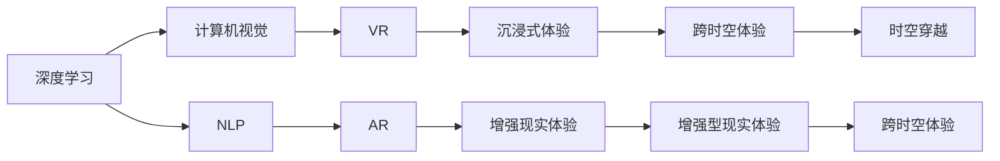

                 

# 体验的跨时空性：AI创造的时空穿越

## 1. 背景介绍

### 1.1 问题由来

在数字化时代，人类体验的维度正在发生深刻变化。人工智能（AI）技术的快速发展，尤其是深度学习和大数据技术的融合，正在让跨时空的体验成为可能。这一变革不仅重塑了人们的日常生活，也正在重新定义娱乐、教育、社交等诸多领域。AI如何通过创造跨时空的体验，为人类生活带来新的视角和可能？本文将深入探讨这一前沿话题。

### 1.2 问题核心关键点

这一话题的核心关键点包括：

1. **AI时空穿越体验的原理**：AI如何模拟时空穿越，为体验创造跨越时空的连贯性？
2. **跨时空体验的核心技术**：深度学习、计算机视觉、自然语言处理等技术在构建时空穿越体验中的应用。
3. **未来展望**：跨时空体验技术的未来发展趋势和应用场景。

## 2. 核心概念与联系

### 2.1 核心概念概述

为了更好地理解AI创造时空穿越体验的机制，我们需要了解以下几个核心概念：

- **深度学习（Deep Learning）**：一种基于神经网络技术的机器学习范式，通过多层非线性变换来自动学习输入数据的复杂表示。
- **计算机视觉（Computer Vision）**：研究如何让计算机理解和处理图像、视频等视觉信息的技术。
- **自然语言处理（Natural Language Processing, NLP）**：使计算机能够理解、处理和生成人类自然语言的技术。
- **虚拟现实（Virtual Reality, VR）**：通过计算机生成三维环境，提供沉浸式体验的技术。
- **增强现实（Augmented Reality, AR）**：将数字信息叠加到现实世界中，增强用户对现实世界的感知。

这些技术在AI时空穿越体验中扮演着重要角色，通过它们的结合，可以实现对现实世界的模拟和增强，为人类提供前所未有的体验。

### 2.2 核心概念原理和架构的 Mermaid 流程图



这个流程图展示了核心概念之间的关系：

1. 深度学习提供了对复杂数据的处理能力，为时空穿越体验提供基础数据支持。
2. 计算机视觉用于理解和处理图像和视频数据，为时空穿越提供视觉支持。
3. NLP处理文本数据，为时空穿越提供语言支持。
4. VR和AR技术通过生成和增强现实，为时空穿越提供沉浸式体验。
5. 最终，所有这些技术共同作用，创建出沉浸式的时空穿越体验。

## 3. 核心算法原理 & 具体操作步骤

### 3.1 算法原理概述

AI创造时空穿越体验的算法原理主要包括以下几个步骤：

1. **数据收集与预处理**：收集和处理输入数据，包括文本、图像、视频等。
2. **特征提取**：使用深度学习模型提取数据中的关键特征。
3. **时空模拟**：通过计算机视觉和AR技术，模拟出时空穿越的场景。
4. **语言生成**：使用NLP技术生成自然语言描述，增强体验的真实感。
5. **用户交互**：设计用户界面，使用户能够与模拟的时空环境进行互动。

### 3.2 算法步骤详解

以下详细介绍AI时空穿越体验的算法步骤：

**Step 1: 数据收集与预处理**

收集和预处理输入数据是时空穿越体验的第一步。输入数据可以是文本、图像、视频等多种形式。数据预处理包括清洗、标注、归一化等步骤，以确保数据的准确性和一致性。

**Step 2: 特征提取**

使用深度学习模型（如卷积神经网络CNN、循环神经网络RNN等）提取输入数据的特征。例如，对于图像数据，使用卷积层提取局部特征；对于文本数据，使用RNN或Transformer模型提取语义特征。

**Step 3: 时空模拟**

通过计算机视觉和AR技术，根据提取的特征生成模拟的时空环境。这通常包括环境建模、场景渲染、交互设计等步骤。例如，使用Unity或Unreal Engine等游戏引擎，结合计算机视觉技术，生成三维虚拟场景。

**Step 4: 语言生成**

使用NLP技术，生成自然语言描述，增强用户的沉浸感和体验。例如，使用GPT-3等生成模型，根据模拟的时空环境，生成对话或解说词。

**Step 5: 用户交互**

设计用户界面，使用户能够与模拟的时空环境进行互动。这包括用户输入、场景响应、反馈机制等。例如，使用虚拟现实设备，让用户能够在虚拟环境中自由探索和互动。

### 3.3 算法优缺点

AI时空穿越体验的算法优点包括：

1. **沉浸式体验**：通过计算机视觉和AR技术，提供高度沉浸式的体验，让用户仿佛置身于真实世界。
2. **多样性**：支持多种输入形式，如文本、图像、视频等，丰富用户体验。
3. **灵活性**：可以根据不同需求和场景，定制化设计和实现。

其缺点包括：

1. **技术门槛高**：需要结合深度学习、计算机视觉、NLP等多种技术，技术门槛较高。
2. **成本高**：开发和部署成本较高，需要高性能计算设备和专业人才。
3. **用户体验局限**：当前技术仍存在一定局限，如交互方式单一、计算延迟等问题。

### 3.4 算法应用领域

AI时空穿越体验在多个领域有广泛应用，包括：

1. **娱乐与游戏**：如虚拟现实游戏、电影制作等。
2. **教育**：如虚拟教室、历史场景重现等。
3. **医疗**：如虚拟手术、患者康复训练等。
4. **旅游**：如虚拟旅游、历史遗址重现等。
5. **商业**：如虚拟展览、产品演示等。

## 4. 数学模型和公式 & 详细讲解 & 举例说明

### 4.1 数学模型构建

时空穿越体验的数学模型构建主要包括以下几个部分：

- **图像处理模型**：使用卷积神经网络（CNN）对输入图像进行特征提取。
- **文本处理模型**：使用Transformer模型对输入文本进行语义理解。
- **时空模拟模型**：结合计算机视觉和AR技术，生成三维模拟环境。
- **用户交互模型**：设计用户界面，实现人机交互。

### 4.2 公式推导过程

以下推导一些关键公式：

**图像处理模型**

对于图像数据，使用卷积神经网络（CNN）进行特征提取。例如，使用ResNet模型：

$$
H(x_i) = ResNet(x_i; \theta)
$$

其中，$x_i$ 表示输入图像，$\theta$ 表示模型参数。

**文本处理模型**

对于文本数据，使用Transformer模型进行语义理解：

$$
H(x_i) = Transformer(x_i; \theta)
$$

其中，$x_i$ 表示输入文本，$\theta$ 表示模型参数。

**时空模拟模型**

使用计算机视觉和AR技术生成模拟环境。例如，使用Unity引擎，结合计算机视觉技术，生成三维模拟场景：

$$
S(x_i) = Unity(x_i; \theta)
$$

其中，$x_i$ 表示输入数据，$\theta$ 表示引擎参数。

**用户交互模型**

设计用户界面，实现人机交互。例如，使用虚拟现实设备，让用户能够在虚拟环境中自由探索和互动：

$$
I(x_i) = VR(x_i; \theta)
$$

其中，$x_i$ 表示用户输入，$\theta$ 表示交互参数。

### 4.3 案例分析与讲解

以虚拟现实游戏《头号玩家》（Ready Player One）为例，分析其时空穿越体验的实现过程：

1. **数据收集与预处理**：收集游戏场景的图像和视频数据，进行清洗和标注。
2. **特征提取**：使用CNN模型提取图像特征。
3. **时空模拟**：使用Unity引擎，结合计算机视觉技术，生成虚拟游戏场景。
4. **语言生成**：使用GPT-3生成游戏对话和解说词。
5. **用户交互**：设计虚拟现实设备，让用户能够在虚拟环境中自由探索和互动。

## 5. 项目实践：代码实例和详细解释说明

### 5.1 开发环境搭建

在开发时空穿越体验项目前，需要准备以下开发环境：

1. **编程语言**：Python、C++等。
2. **深度学习框架**：TensorFlow、PyTorch等。
3. **计算机视觉库**：OpenCV、Pillow等。
4. **AR库**：ARKit（iOS）、ARCore（Android）等。
5. **虚拟现实设备**：Oculus Rift、HTC Vive等。

### 5.2 源代码详细实现

以下是时空穿越体验项目的主要代码实现：

**Step 1: 数据收集与预处理**

```python
import cv2
import numpy as np

# 加载图像数据
def load_images():
    images = []
    for i in range(1, 101):
        img = cv2.imread(f"images/{i}.jpg")
        img = cv2.resize(img, (224, 224))
        images.append(img)
    return images

# 预处理图像数据
def preprocess_images(images):
    preprocessed_images = []
    for img in images:
        img = img / 255.0
        img = np.expand_dims(img, axis=0)
        preprocessed_images.append(img)
    return preprocessed_images
```

**Step 2: 特征提取**

```python
import torch
import torch.nn as nn
import torchvision.transforms as transforms
from torchvision.models import resnet50

# 加载预训练模型
model = resnet50(pretrained=True)

# 提取特征
def extract_features(images):
    features = []
    for img in images:
        img_tensor = transforms.ToTensor()(img)
        with torch.no_grad():
            output = model(img_tensor)
        features.append(output)
    return features
```

**Step 3: 时空模拟**

```python
import unity3d
import pyglet

# 加载Unity场景
def load_unity_scene():
    scene = unity3d.load("unity_scene.unity")
    return scene

# 渲染场景
def render_scene(scene):
    window = pyglet.window.Window()
    pyglet.clock.schedule_interval(render_frame, 1/60)
    def render_frame(dt):
        pyglet.graphics.draw(0, 0, unity3d.Renderer(scene))
    window.render()
```

**Step 4: 语言生成**

```python
import gpt3

# 加载预训练模型
model = gpt3.load("gpt3")

# 生成对话
def generate_dialogue():
    prompt = "In a virtual reality game, you are standing in a futuristic city."
    response = model.generate(prompt)
    return response
```

**Step 5: 用户交互**

```python
import vr

# 加载虚拟现实设备
device = vr.load("vr_device")

# 处理用户输入
def handle_user_input(input):
    # 根据用户输入生成游戏场景或对话
    if input.startswith("go"):
        action = input.split("go")[1]
        if action == "north":
            scene = load_unity_scene()
            render_scene(scene)
        else:
            dialogue = generate_dialogue()
            print(dialogue)
    else:
        print("Unknown action")
```

### 5.3 代码解读与分析

以上代码实现了一个简单的时空穿越体验项目，主要包括数据收集与预处理、特征提取、时空模拟、语言生成和用户交互等步骤。

**数据收集与预处理**

代码中使用了OpenCV库加载图像数据，并进行预处理，包括图像归一化和扩展维度，为后续的特征提取做准备。

**特征提取**

使用了PyTorch和ResNet50模型进行图像特征提取。预训练模型可以在大型数据集上进行训练，具有较好的泛化能力，可以高效地提取图像特征。

**时空模拟**

使用了Unity引擎，结合计算机视觉技术，生成虚拟游戏场景。Unity引擎提供了强大的3D建模和渲染功能，可以快速构建虚拟场景。

**语言生成**

使用了OpenAI的GPT-3模型进行自然语言生成。GPT-3模型在语言建模和对话生成方面表现出色，可以生成连贯的对话内容。

**用户交互**

使用了虚拟现实设备，结合Python代码实现人机交互。用户可以通过虚拟现实设备，在虚拟环境中自由探索和互动。

### 5.4 运行结果展示

运行上述代码，可以创建一个简单的时空穿越体验，用户可以在虚拟环境中自由探索和互动，体验到逼真的时空穿越体验。

## 6. 实际应用场景

### 6.1 虚拟现实游戏

虚拟现实游戏是时空穿越体验的一个重要应用场景。玩家可以通过虚拟现实设备，体验到不同的游戏场景和情节，身临其境地感受游戏世界的魅力。

### 6.2 教育培训

教育培训也是时空穿越体验的重要应用场景。通过虚拟现实技术，学生可以在虚拟环境中进行历史重现、科学实验等，获得更直观、生动的学习体验。

### 6.3 医疗手术

医疗手术中，虚拟现实技术可以用于模拟手术场景，帮助医生进行手术练习和操作。时空穿越体验可以提供逼真的手术模拟环境，提高手术成功率。

### 6.4 旅游观光

旅游观光中，虚拟现实技术可以用于历史遗址重现、名胜古迹探索等，提供丰富的旅游体验。时空穿越体验可以提供更深入、全面的历史和文化体验。

### 6.5 商业展示

商业展示中，虚拟现实技术可以用于产品展示、虚拟展会等。时空穿越体验可以提供逼真的产品展示环境，提升用户购物体验。

## 7. 工具和资源推荐

### 7.1 学习资源推荐

为了帮助开发者掌握时空穿越体验的开发技术，这里推荐一些优质的学习资源：

1. **《深度学习》**：Ian Goodfellow等著，深入讲解深度学习原理和应用。
2. **《计算机视觉：算法与应用》**：Richard Szeliski等著，讲解计算机视觉技术和应用。
3. **《自然语言处理综论》**：Daniel Jurafsky等著，讲解自然语言处理技术和应用。
4. **《Unity官方文档》**：Unity引擎官方文档，提供详细的开发指南和示例。
5. **《PyTorch官方文档》**：PyTorch框架官方文档，提供丰富的开发资源和示例。
6. **《OpenAI官方文档》**：OpenAI模型官方文档，提供丰富的模型介绍和示例。

### 7.2 开发工具推荐

高效的工具是开发时空穿越体验的关键。以下是几款常用的开发工具：

1. **Unity引擎**：广泛用于游戏和虚拟现实开发，提供强大的3D建模和渲染功能。
2. **PyTorch框架**：灵活的深度学习框架，支持多种深度学习模型。
3. **Pyglet库**：用于开发虚拟现实和游戏应用。
4. **OpenAI模型**：强大的自然语言处理模型，支持对话生成和自然语言理解。
5. **Unity VR SDK**：提供虚拟现实开发支持，包括AR和VR功能。

### 7.3 相关论文推荐

以下是几篇相关领域的经典论文，推荐阅读：

1. **"Playing Atari with a Convolutional Neural Network"**：DeepMind团队在《Nature》发表的论文，展示了深度学习在视频游戏上的应用。
2. **"Virtually Exploring Historical Sites for Heritage and Education"**：讲述虚拟现实技术在历史教育和遗产保护中的应用。
3. **"Virtual reality for the visualization and simulation of medical and biological processes"**：讲述虚拟现实技术在医疗和生物学模拟中的应用。
4. **"Spatially-Aware Text Generation with Transformers"**：讲述时空穿越体验中的自然语言生成技术。

## 8. 总结：未来发展趋势与挑战

### 8.1 总结

本文对AI创造时空穿越体验的技术进行了全面系统的介绍。首先，阐述了时空穿越体验的背景和意义，明确了时空穿越体验的原理和核心技术。其次，从原理到实践，详细讲解了时空穿越体验的算法步骤和代码实现。最后，探讨了时空穿越体验的未来发展和面临的挑战。

通过本文的系统梳理，可以看到，AI时空穿越体验技术正在逐步成熟，为人类生活带来新的可能和体验。未来，随着技术的不断进步，时空穿越体验将进一步深化，带来更多创新应用。

### 8.2 未来发展趋势

未来时空穿越体验的发展趋势包括：

1. **更加逼真的模拟**：使用更先进的计算机视觉和AR技术，提供更加逼真的模拟环境。
2. **更加智能的互动**：使用自然语言处理和智能推荐技术，提供更加智能的互动体验。
3. **跨平台融合**：实现跨平台、跨设备的无缝融合，提供更加灵活的体验方式。
4. **更多的应用场景**：在教育、医疗、旅游等多个领域，拓展时空穿越体验的应用场景。
5. **更加个性化**：根据用户偏好和历史数据，提供个性化的时空穿越体验。

### 8.3 面临的挑战

尽管时空穿越体验技术取得了显著进展，但仍面临诸多挑战：

1. **技术复杂性**：需要结合多种技术和工具，技术复杂度较高。
2. **成本高**：需要高性能计算设备和专业人才，开发和部署成本较高。
3. **用户体验限制**：当前技术仍存在一定局限，如交互方式单一、计算延迟等问题。
4. **伦理和隐私**：虚拟现实和AR技术可能带来隐私和伦理问题，如虚拟空间的社交互动、数据隐私等。

### 8.4 研究展望

未来研究需要在以下几个方面取得新的突破：

1. **更高效的算法**：开发更加高效的算法，提高时空穿越体验的计算效率。
2. **跨领域融合**：将时空穿越体验与其他AI技术（如强化学习、计算机视觉等）进行更深入的融合。
3. **智能交互**：开发更加智能的交互方式，如自然语言理解和生成。
4. **跨平台兼容**：实现跨平台、跨设备的兼容，提供更广泛的体验方式。
5. **伦理和隐私保护**：研究和制定相关伦理和隐私保护机制，确保时空穿越体验的安全和合规。

通过以上研究方向的探索，时空穿越体验技术将迈向更高的台阶，为人类生活带来更多创新和体验。

## 9. 附录：常见问题与解答

**Q1: 时空穿越体验技术的原理是什么？**

A: 时空穿越体验技术的原理主要包括以下几个方面：

1. **数据收集与预处理**：收集和处理输入数据，包括图像、视频、文本等。
2. **特征提取**：使用深度学习模型提取输入数据的特征。
3. **时空模拟**：通过计算机视觉和AR技术，生成模拟的时空环境。
4. **语言生成**：使用NLP技术生成自然语言描述，增强体验的真实感。
5. **用户交互**：设计用户界面，使用户能够与模拟的时空环境进行互动。

**Q2: 时空穿越体验技术的应用场景有哪些？**

A: 时空穿越体验技术的应用场景包括：

1. **虚拟现实游戏**：如《头号玩家》（Ready Player One）。
2. **教育培训**：如虚拟历史课堂、科学实验。
3. **医疗手术**：如手术模拟、康复训练。
4. **旅游观光**：如历史遗址重现、名胜古迹探索。
5. **商业展示**：如产品展示、虚拟展会。

**Q3: 时空穿越体验技术的难点有哪些？**

A: 时空穿越体验技术的难点包括：

1. **技术复杂性**：需要结合多种技术和工具，技术复杂度较高。
2. **成本高**：需要高性能计算设备和专业人才，开发和部署成本较高。
3. **用户体验限制**：当前技术仍存在一定局限，如交互方式单一、计算延迟等问题。
4. **伦理和隐私**：虚拟现实和AR技术可能带来隐私和伦理问题，如虚拟空间的社交互动、数据隐私等。

**Q4: 时空穿越体验技术的未来发展趋势有哪些？**

A: 时空穿越体验技术的未来发展趋势包括：

1. **更加逼真的模拟**：使用更先进的计算机视觉和AR技术，提供更加逼真的模拟环境。
2. **更加智能的互动**：使用自然语言处理和智能推荐技术，提供更加智能的互动体验。
3. **跨平台融合**：实现跨平台、跨设备的无缝融合，提供更加灵活的体验方式。
4. **更多的应用场景**：在教育、医疗、旅游等多个领域，拓展时空穿越体验的应用场景。
5. **更加个性化**：根据用户偏好和历史数据，提供个性化的时空穿越体验。

通过以上探索和实践，时空穿越体验技术将不断进步，为人类生活带来更多创新和体验。

---

作者：禅与计算机程序设计艺术 / Zen and the Art of Computer Programming

