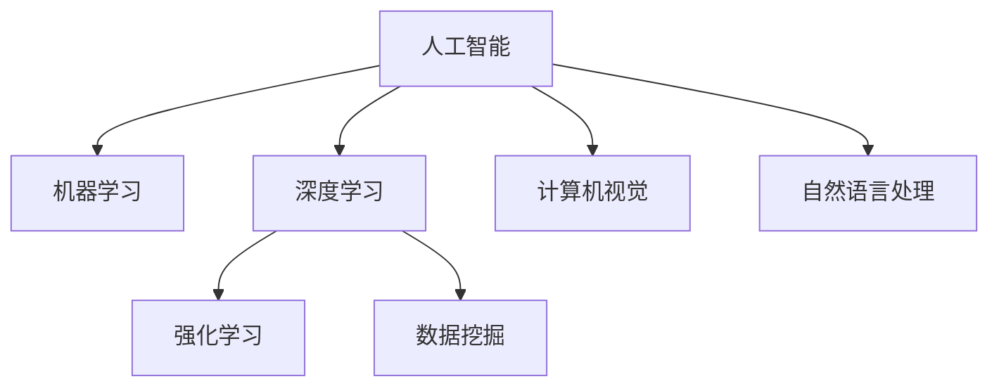

                 

# 体验量化革命先锋：AI驱动的生活质量评估专家

> 关键词：AI量化,生活质量评估,机器学习,深度学习,强化学习,数据挖掘,计算机视觉,自然语言处理

## 1. 背景介绍

### 1.1 问题由来

随着社会经济的发展和生活水平的提高，人们的物质需求逐渐得到满足，随之而来的是对精神层面的需求，即追求高质量的生活。生活质量评估是一个重要的研究领域，它通过量化指标和模型分析，来评估和提升居民的生活水平和幸福感。在传统上，生活质量评估通常依赖于问卷调查和专家评价，这种方法耗时长、成本高且缺乏自动化。而随着人工智能技术的发展，特别是机器学习、深度学习、强化学习等前沿技术的成熟，AI量化方法逐渐成为生活质量评估的新范式。

### 1.2 问题核心关键点

AI量化方法的核心思想是使用AI技术，如机器学习、深度学习和强化学习，对大量高质量的数据进行分析和建模，从而量化和评估生活质量。与传统方法相比，AI量化方法具有以下优点：

1. **效率高**：AI量化方法可以在短时间内对大量数据进行处理和分析，显著提升生活质量评估的效率。
2. **准确度高**：AI量化方法能够从数据中学习到复杂的模式和规律，从而提供更准确的评估结果。
3. **成本低**：AI量化方法能够自动处理数据，减少人力和物力的投入。
4. **动态更新**：AI量化方法能够根据最新的数据和环境变化进行动态调整和更新，保持评估结果的时效性和准确性。

### 1.3 问题研究意义

生活质量评估对于了解居民的生活状况、制定政策、优化资源分配等方面具有重要意义。AI量化方法可以提供更客观、全面的评估结果，有助于决策者制定更加科学合理的政策。此外，AI量化方法还可以为居民提供个性化的生活建议和改进方案，提升其生活满意度。

## 2. 核心概念与联系

### 2.1 核心概念概述

为更好地理解AI量化方法，本节将介绍几个密切相关的核心概念：

- **人工智能**：利用计算机算法和模型，模拟人类智能行为的技术。
- **机器学习**：通过数据驱动的方法，使计算机具备学习能力，自动优化模型参数。
- **深度学习**：使用神经网络模型，模拟人脑神经元之间的连接和计算方式，解决复杂问题。
- **强化学习**：通过与环境的交互，优化决策策略，以获得最大化的奖励。
- **数据挖掘**：从大量数据中挖掘有价值的信息和模式，辅助决策和分析。
- **计算机视觉**：使计算机具备视觉感知能力，如图像分类、目标检测等。
- **自然语言处理**：使计算机能够理解、处理和生成自然语言，如文本分析、语音识别等。

这些核心概念之间的逻辑关系可以通过以下Mermaid流程图来展示：



这个流程图展示了大语言模型的核心概念及其之间的关系：

1. 人工智能通过数据和算法模拟人类智能行为。
2. 机器学习是人工智能的一种方法，通过数据驱动的方法优化模型参数。
3. 深度学习是机器学习的一种高级形式，使用神经网络模型模拟人类神经元。
4. 强化学习是另一种机器学习方法，通过与环境的交互优化策略。
5. 数据挖掘是从大量数据中挖掘有价值的信息和模式。
6. 计算机视觉使计算机具备视觉感知能力。
7. 自然语言处理使计算机能够理解、处理和生成自然语言。

这些核心概念共同构成了人工智能的生活质量评估框架，使其能够对各种复杂问题进行量化和评估。通过理解这些核心概念，我们可以更好地把握AI量化方法的工作原理和优化方向。

## 3. 核心算法原理 & 具体操作步骤
### 3.1 算法原理概述

AI量化方法主要基于机器学习、深度学习和强化学习等技术，对生活质量评估数据进行处理和建模。其核心思想是：

1. **数据预处理**：对原始数据进行清洗、转换和特征提取，以便于后续建模和分析。
2. **特征工程**：设计合适的特征向量，以便模型能够学习到数据中的关键信息。
3. **模型选择**：选择合适的机器学习模型或深度学习模型，进行训练和评估。
4. **评估指标**：定义合适的评估指标，评估模型的性能和预测结果的准确性。
5. **模型优化**：根据评估指标，优化模型参数和结构，提升模型性能。

### 3.2 算法步骤详解

基于AI量化方法的生活质量评估流程主要包括以下几个步骤：

**Step 1: 数据准备**
- 收集生活质量评估相关数据，包括问卷调查数据、家庭收入数据、健康数据等。
- 对数据进行清洗、转换和特征提取，去除缺失值和异常值。
- 对数据进行标准化和归一化处理，以便于模型处理。

**Step 2: 模型选择与训练**
- 选择合适的机器学习模型或深度学习模型，如随机森林、梯度提升树、卷积神经网络等。
- 划分数据集为训练集和测试集，使用训练集训练模型。
- 根据评估指标，调整模型参数，进行模型优化。

**Step 3: 模型评估与验证**
- 使用测试集评估模型性能，计算各项评估指标。
- 进行交叉验证，评估模型的稳定性和泛化能力。
- 对模型进行参数调整和优化，进一步提升模型性能。

**Step 4: 模型应用与部署**
- 将训练好的模型部署到生产环境中，进行实际应用。
- 实时采集生活质量评估数据，使用训练好的模型进行预测和分析。
- 根据模型预测结果，生成生活质量评估报告，为决策者提供参考。

### 3.3 算法优缺点

AI量化方法具有以下优点：

1. **效率高**：可以快速处理大量数据，提供实时评估结果。
2. **准确度高**：能够从数据中学习到复杂的模式和规律，提供更准确的评估结果。
3. **灵活性强**：可以根据不同的评估指标和数据类型，选择不同的模型和算法。
4. **动态更新**：能够根据最新的数据和环境变化进行动态调整和更新，保持评估结果的时效性和准确性。

但同时，AI量化方法也存在以下缺点：

1. **数据质量依赖高**：模型性能依赖于数据质量，数据噪声和缺失值会影响模型效果。
2. **模型复杂度高**：深度学习模型通常比较复杂，训练和优化过程耗时较长。
3. **模型解释性差**：许多AI模型（如深度学习模型）是黑盒模型，难以解释其决策过程。
4. **算法门槛高**：需要具备较高的数据科学和算法设计能力，普通用户难以上手。

### 3.4 算法应用领域

AI量化方法在生活质量评估中的应用领域非常广泛，具体包括：

- **社会福利评估**：评估社会福利政策的效果，优化资源分配。
- **健康评估**：评估居民健康水平，提供个性化的健康建议。
- **教育评估**：评估教育资源分配的公平性，优化教育政策。
- **环境评估**：评估环境污染程度，制定环保政策。
- **住房评估**：评估住房条件，制定住房政策。
- **交通评估**：评估交通状况，优化交通管理。

## 4. 数学模型和公式 & 详细讲解 & 举例说明

### 4.1 数学模型构建

生活质量评估的数学模型构建主要包括以下几个步骤：

1. **数据表示**：将生活质量评估数据表示为向量或矩阵形式。
2. **特征提取**：设计合适的特征向量，以便模型学习。
3. **模型选择**：选择合适的机器学习模型或深度学习模型。
4. **损失函数**：定义损失函数，衡量模型预测结果与真实结果之间的差异。
5. **优化算法**：选择合适的优化算法，如梯度下降、随机梯度下降等。

### 4.2 公式推导过程

以随机森林模型为例，推导其基本公式：

$$
L(y,f(x),\theta) = \frac{1}{N}\sum_{i=1}^N l(y_i,f(x_i;\theta))
$$

其中，$y$ 表示真实结果，$f(x;\theta)$ 表示模型预测结果，$\theta$ 表示模型参数。

对于随机森林模型，其训练过程如下：

1. 从训练集中随机抽取 $m$ 个样本，构成子集 $S_m$。
2. 对每个子集 $S_m$，构建 $n$ 个决策树。
3. 对每个决策树，计算其误差率 $e_m$。
4. 对所有决策树，计算平均误差率 $e_m$。
5. 根据误差率，对决策树进行权重调整。

### 4.3 案例分析与讲解

以健康评估为例，分析其数据预处理和模型训练过程：

**数据预处理**：
- 收集居民的健康数据，包括身高、体重、血压、血糖等。
- 对数据进行清洗和转换，去除缺失值和异常值。
- 对数据进行标准化和归一化处理，以便于模型处理。

**模型训练**：
- 选择合适的机器学习模型，如随机森林或梯度提升树。
- 划分数据集为训练集和测试集，使用训练集训练模型。
- 根据评估指标，调整模型参数，进行模型优化。

## 5. 项目实践：代码实例和详细解释说明

### 5.1 开发环境搭建

在进行生活质量评估模型开发前，我们需要准备好开发环境。以下是使用Python进行Scikit-learn开发的环境配置流程：

1. 安装Anaconda：从官网下载并安装Anaconda，用于创建独立的Python环境。

2. 创建并激活虚拟环境：
```bash
conda create -n sklearn-env python=3.8 
conda activate sklearn-env
```

3. 安装Scikit-learn：
```bash
pip install scikit-learn
```

4. 安装各类工具包：
```bash
pip install numpy pandas scikit-learn matplotlib tqdm jupyter notebook ipython
```

完成上述步骤后，即可在`sklearn-env`环境中开始模型开发。

### 5.2 源代码详细实现

这里我们以健康评估为例，给出使用Scikit-learn进行随机森林模型训练的Python代码实现。

```python
from sklearn.ensemble import RandomForestRegressor
from sklearn.model_selection import train_test_split
from sklearn.metrics import mean_squared_error
from sklearn.preprocessing import StandardScaler

# 加载数据
data = pd.read_csv('health_data.csv')

# 数据预处理
X = data.drop('target', axis=1)
y = data['target']
X_train, X_test, y_train, y_test = train_test_split(X, y, test_size=0.2, random_state=42)

# 特征工程
scaler = StandardScaler()
X_train = scaler.fit_transform(X_train)
X_test = scaler.transform(X_test)

# 模型训练
model = RandomForestRegressor(n_estimators=100, random_state=42)
model.fit(X_train, y_train)

# 模型评估
y_pred = model.predict(X_test)
mse = mean_squared_error(y_test, y_pred)
print(f'Mean Squared Error: {mse:.2f}')
```

### 5.3 代码解读与分析

让我们再详细解读一下关键代码的实现细节：

**数据加载与预处理**：
- 使用pandas库加载健康评估数据。
- 将数据拆分为训练集和测试集，使用`train_test_split`函数。
- 对特征进行标准化处理，使用`StandardScaler`类。

**模型训练与评估**：
- 使用Scikit-learn库中的`RandomForestRegressor`类，构建随机森林模型。
- 使用`fit`函数训练模型。
- 使用`predict`函数进行预测。
- 计算预测结果与真实结果的均方误差，使用`mean_squared_error`函数。

可以看到，Scikit-learn库使得模型开发过程变得简洁高效。开发者可以将更多精力放在数据处理、模型改进等高层逻辑上，而不必过多关注底层的实现细节。

## 6. 实际应用场景

### 6.1 社会福利评估

基于AI量化方法的社会福利评估，可以全面评估社会福利政策的效果，优化资源分配。具体而言，可以收集社会福利政策实施前后的各种数据，如居民收入、教育水平、健康状况等，利用AI模型对这些数据进行处理和建模，评估政策对居民生活质量的影响。

在技术实现上，可以构建社会福利评估模型，输入政策实施前后的各种数据，输出福利政策对居民生活质量的影响评估。模型可以通过对比政策实施前后的数据变化，计算福利政策对生活质量的提升程度。

### 6.2 健康评估

AI量化方法在健康评估中的应用非常广泛，可以帮助医疗机构和居民更好地了解和管理健康状况。

具体而言，可以收集居民的健康数据，如身高、体重、血压、血糖等，利用AI模型对这些数据进行处理和建模，评估居民的健康状况。模型可以识别出潜在的健康风险，提供个性化的健康建议，并帮助医疗机构制定更加科学合理的健康管理方案。

在技术实现上，可以构建健康评估模型，输入居民的健康数据，输出健康评估报告。模型可以通过分析健康数据，识别出潜在的健康风险，提供个性化的健康建议，并帮助医疗机构制定健康管理方案。

### 6.3 教育评估

教育评估是AI量化方法在教育领域的重要应用之一。AI量化方法可以全面评估教育资源的分配公平性，优化教育政策。

具体而言，可以收集教育资源分配数据，如学校数量、师资力量、教育设施等，利用AI模型对这些数据进行处理和建模，评估教育资源分配的公平性。模型可以识别出资源分配不均衡的问题，提出改进建议，帮助政府制定更加科学合理的教育政策。

在技术实现上，可以构建教育评估模型，输入教育资源分配数据，输出教育评估报告。模型可以通过分析教育资源分配数据，识别出资源分配不均衡的问题，提出改进建议，并帮助政府制定教育政策。

### 6.4 环境评估

环境评估是AI量化方法在环境保护领域的重要应用之一。AI量化方法可以全面评估环境污染程度，制定环保政策。

具体而言，可以收集环境污染数据，如空气质量、水质、噪音等，利用AI模型对这些数据进行处理和建模，评估环境污染程度。模型可以识别出环境污染的趋势和原因，提出改进建议，帮助政府制定更加科学合理的环保政策。

在技术实现上，可以构建环境评估模型，输入环境污染数据，输出环境评估报告。模型可以通过分析环境污染数据，识别出环境污染的趋势和原因，提出改进建议，并帮助政府制定环保政策。

### 6.5 住房评估

住房评估是AI量化方法在房地产领域的重要应用之一。AI量化方法可以全面评估住房条件，制定住房政策。

具体而言，可以收集住房条件数据，如房屋面积、楼层、设施等，利用AI模型对这些数据进行处理和建模，评估住房条件。模型可以识别出住房条件的优劣，提出改进建议，帮助政府制定更加科学合理的住房政策。

在技术实现上，可以构建住房评估模型，输入住房条件数据，输出住房评估报告。模型可以通过分析住房条件数据，识别出住房条件的优劣，提出改进建议，并帮助政府制定住房政策。

### 6.6 交通评估

交通评估是AI量化方法在城市交通领域的重要应用之一。AI量化方法可以全面评估交通状况，优化交通管理。

具体而言，可以收集交通数据，如车流量、道路状况、交通拥堵等，利用AI模型对这些数据进行处理和建模，评估交通状况。模型可以识别出交通拥堵的原因，提出改进建议，帮助政府制定更加科学合理的交通管理政策。

在技术实现上，可以构建交通评估模型，输入交通数据，输出交通评估报告。模型可以通过分析交通数据，识别出交通拥堵的原因，提出改进建议，并帮助政府制定交通管理政策。

## 7. 工具和资源推荐
### 7.1 学习资源推荐

为了帮助开发者系统掌握AI量化方法的理论基础和实践技巧，这里推荐一些优质的学习资源：

1. 《机器学习》系列书籍：由机器学习领域的权威学者编写，全面介绍了机器学习的基本概念、算法和应用。
2. 《深度学习》系列书籍：由深度学习领域的权威学者编写，全面介绍了深度学习的基本概念、算法和应用。
3. 《强化学习》系列书籍：由强化学习领域的权威学者编写，全面介绍了强化学习的基本概念、算法和应用。
4. 《数据挖掘》系列书籍：由数据挖掘领域的权威学者编写，全面介绍了数据挖掘的基本概念、算法和应用。
5. 《计算机视觉》系列书籍：由计算机视觉领域的权威学者编写，全面介绍了计算机视觉的基本概念、算法和应用。
6. 《自然语言处理》系列书籍：由自然语言处理领域的权威学者编写，全面介绍了自然语言处理的基本概念、算法和应用。

通过对这些资源的学习实践，相信你一定能够快速掌握AI量化方法的基本原理和实现技巧，并用于解决实际的评估问题。

### 7.2 开发工具推荐

高效的开发离不开优秀的工具支持。以下是几款用于生活质量评估开发的常用工具：

1. Python：Python语言简单易学，支持丰富的第三方库和工具，是数据科学和机器学习领域的标准语言。
2. Scikit-learn：Scikit-learn库提供了丰富的机器学习算法和工具，支持数据预处理、模型训练、评估等。
3. TensorFlow：由Google主导开发的深度学习框架，支持分布式计算，适合大规模工程应用。
4. PyTorch：由Facebook开发的深度学习框架，支持动态计算图，适合快速迭代研究。
5. Weights & Biases：模型训练的实验跟踪工具，可以记录和可视化模型训练过程中的各项指标，方便对比和调优。
6. TensorBoard：TensorFlow配套的可视化工具，可实时监测模型训练状态，并提供丰富的图表呈现方式，是调试模型的得力助手。

合理利用这些工具，可以显著提升生活质量评估模型的开发效率，加快创新迭代的步伐。

### 7.3 相关论文推荐

生活质量评估是一个涉及多个领域的综合性问题，需要跨学科的协同研究。以下是几篇奠基性的相关论文，推荐阅读：

1. "A Survey on Survey Research Methodologies"：探讨了问卷调查的原理和方法，为生活质量评估提供了理论基础。
2. "The Impact of Social Welfare Policies on Quality of Life"：分析了社会福利政策对生活质量的影响，为政策制定提供了参考。
3. "Health Monitoring and Assessment with Wearable Devices"：探讨了可穿戴设备在健康评估中的应用，为健康管理提供了新思路。
4. "Machine Learning in Education"：分析了机器学习在教育评估中的应用，为教育优化提供了新方法。
5. "Environmental Monitoring with AI"：探讨了AI在环境评估中的应用，为环保政策提供了新工具。
6. "Housing Market Analysis with AI"：分析了AI在住房评估中的应用，为房地产市场提供了新视角。
7. "Traffic Management with AI"：探讨了AI在交通评估中的应用，为交通管理提供了新方法。

这些论文代表了大语言模型微调技术的发展脉络。通过学习这些前沿成果，可以帮助研究者把握学科前进方向，激发更多的创新灵感。

## 8. 总结：未来发展趋势与挑战

### 8.1 总结

本文对基于AI量化方法的生活质量评估进行了全面系统的介绍。首先阐述了AI量化方法的研究背景和意义，明确了AI量化方法在生活质量评估中的独特价值。其次，从原理到实践，详细讲解了AI量化方法的基本流程，给出了生活质量评估模型开发的完整代码实例。同时，本文还广泛探讨了AI量化方法在社会福利评估、健康评估、教育评估、环境评估等多个领域的应用前景，展示了AI量化方法巨大的应用潜力。此外，本文精选了AI量化方法的学习资源、开发工具和相关论文，力求为读者提供全方位的技术指引。

通过本文的系统梳理，可以看到，AI量化方法正在成为生活质量评估的重要范式，极大地拓展了评估模型的应用边界，催生了更多的落地场景。AI量化方法通过高效的数据处理和模型建模，能够提供更准确、全面、实时的评估结果，为决策者制定更加科学合理的政策提供有力支撑。未来，伴随AI量化方法的持续演进，生活质量评估必将更加智能化、精准化和个性化，为居民带来更高质量的生活体验。

### 8.2 未来发展趋势

展望未来，AI量化方法的生活质量评估将呈现以下几个发展趋势：

1. **数据融合与多模态分析**：未来的生活质量评估将融合多模态数据，如视觉、语音、生物信号等，进行全面、综合的评估。
2. **个性化评估**：未来的生活质量评估将更加注重个性化，根据不同居民的需求，提供个性化的评估报告和建议。
3. **实时评估与动态更新**：未来的生活质量评估将实现实时采集数据、实时评估结果、动态更新模型，保持评估结果的时效性和准确性。
4. **跨领域应用**：未来的生活质量评估将不仅仅局限于单一领域，而是广泛应用于社会福利、健康、教育、环保等多个领域，为决策者提供全面的参考。
5. **智能交互与辅助决策**：未来的生活质量评估将结合智能交互技术，如自然语言处理、智能问答等，提供更加人性化的用户体验。
6. **算法与模型创新**：未来的生活质量评估将不断推动算法和模型的创新，如深度学习、强化学习、因果推断等，提升评估模型的性能和精度。

以上趋势凸显了AI量化方法的生活质量评估技术的广阔前景。这些方向的探索发展，必将进一步提升评估模型的性能和应用范围，为居民带来更高质量的生活体验。

### 8.3 面临的挑战

尽管AI量化方法的生活质量评估技术已经取得了瞩目成就，但在迈向更加智能化、普适化应用的过程中，它仍面临着诸多挑战：

1. **数据隐私与安全**：在评估过程中，如何保护个人隐私和数据安全，是一个重要的挑战。需要采取严格的隐私保护措施，防止数据泄露和滥用。
2. **模型可解释性**：当前许多AI模型（如深度学习模型）是黑盒模型，难以解释其决策过程。如何提高模型的可解释性，是未来的一个重要研究方向。
3. **算法公平性**：在评估过程中，如何避免算法偏见和歧视，是另一个重要的挑战。需要设计和应用公平算法，确保评估结果的公正性。
4. **算法鲁棒性**：在评估过程中，如何提高算法的鲁棒性，防止异常数据和噪声对评估结果的影响，是另一个重要的挑战。需要设计鲁棒算法，确保评估结果的稳定性。
5. **算法效率**：在评估过程中，如何提高算法的效率，降低计算成本，是一个重要的挑战。需要设计和应用高效的算法和模型，提升评估模型的计算速度和资源利用率。
6. **模型泛化性**：在评估过程中，如何提高模型的泛化能力，防止模型过拟合，是一个重要的挑战。需要设计和应用泛化算法，确保评估模型在不同数据集上的性能。

正视生活质量评估所面临的这些挑战，积极应对并寻求突破，将是大语言模型微调走向成熟的必由之路。相信随着学界和产业界的共同努力，这些挑战终将一一被克服，生活质量评估技术必将进一步发展，为居民带来更高质量的生活体验。

### 8.4 研究展望

面对生活质量评估所面临的种种挑战，未来的研究需要在以下几个方面寻求新的突破：

1. **数据隐私保护**：采用先进的隐私保护技术，如差分隐私、联邦学习等，保护个人隐私和数据安全。
2. **模型可解释性**：结合符号化的先验知识，如知识图谱、逻辑规则等，与神经网络模型进行融合，提高模型的可解释性。
3. **算法公平性**：设计和应用公平算法，确保评估结果的公正性，避免算法偏见和歧视。
4. **算法鲁棒性**：设计和应用鲁棒算法，防止异常数据和噪声对评估结果的影响，提高算法的鲁棒性。
5. **算法效率**：设计和应用高效的算法和模型，提升评估模型的计算速度和资源利用率，降低计算成本。
6. **模型泛化性**：设计和应用泛化算法，确保评估模型在不同数据集上的性能，防止模型过拟合。

这些研究方向的探索，必将引领生活质量评估技术迈向更高的台阶，为居民带来更高质量的生活体验。面向未来，生活质量评估技术还需要与其他人工智能技术进行更深入的融合，如知识表示、因果推理、强化学习等，多路径协同发力，共同推动生活质量评估技术的进步。只有勇于创新、敢于突破，才能不断拓展评估模型的边界，让智能技术更好地造福人类社会。

## 9. 附录：常见问题与解答

**Q1：什么是AI量化方法？**

A: AI量化方法是一种基于人工智能技术的生活质量评估方法，通过数据驱动的方式，利用机器学习、深度学习、强化学习等技术，对大量高质量的数据进行分析和建模，从而量化和评估生活质量。

**Q2：AI量化方法的优势是什么？**

A: AI量化方法的优势在于其高效、准确、灵活和动态更新。它能够快速处理大量数据，提供实时评估结果，能够从数据中学习到复杂的模式和规律，提供更准确的评估结果，能够根据不同的评估指标和数据类型，选择不同的模型和算法，能够根据最新的数据和环境变化进行动态调整和更新，保持评估结果的时效性和准确性。

**Q3：AI量化方法如何保护数据隐私？**

A: 在评估过程中，可以采用差分隐私、联邦学习等隐私保护技术，保护个人隐私和数据安全。差分隐私通过在数据中加入噪声，防止数据泄露和滥用；联邦学习通过分布式计算，保护数据隐私和安全。

**Q4：如何提高模型的可解释性？**

A: 可以结合符号化的先验知识，如知识图谱、逻辑规则等，与神经网络模型进行融合，提高模型的可解释性。此外，可以设计和应用可解释性算法，如决策树、LIME等，提高模型的可解释性。

**Q5：如何提高算法的鲁棒性？**

A: 可以设计和应用鲁棒算法，防止异常数据和噪声对评估结果的影响，提高算法的鲁棒性。此外，可以采用数据增强、对抗训练等技术，增强算法的鲁棒性。

**Q6：如何提高算法的效率？**

A: 可以设计和应用高效的算法和模型，提升评估模型的计算速度和资源利用率，降低计算成本。此外，可以采用模型并行、分布式计算等技术，提高算法的效率。

**Q7：如何提高模型的泛化能力？**

A: 可以设计和应用泛化算法，确保评估模型在不同数据集上的性能，防止模型过拟合。此外，可以采用交叉验证、正则化等技术，提高模型的泛化能力。

这些回答帮助读者理解了AI量化方法的基本原理和实现技巧，为解决生活质量评估问题提供了有力支持。相信通过持续的研究和实践，AI量化方法将不断进步，为居民带来更高质量的生活体验。

