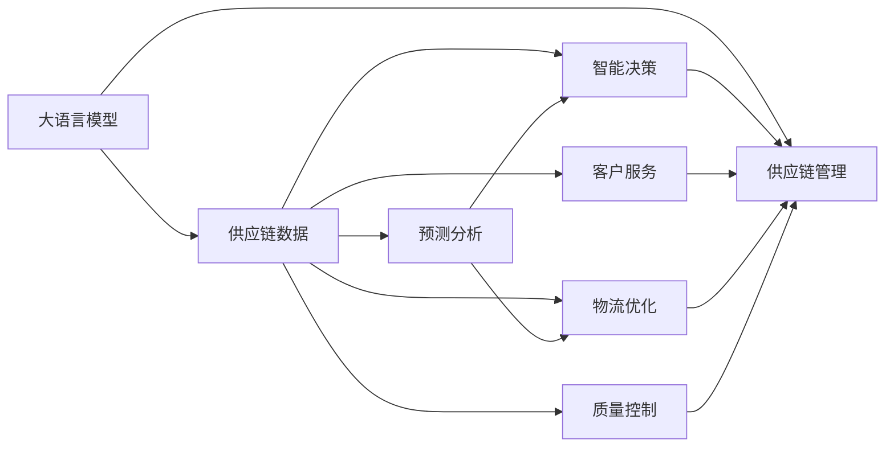

                 

## 1. 背景介绍

### 1.1 问题由来
在现代全球化的经济体系中，供应链管理已成为企业竞争力的重要组成部分。在全球范围内，产品从原材料采购到最终交付的各个环节，涉及复杂的物流、仓储、运输、采购等流程，优化这些流程对于提升效率、降低成本、响应市场需求至关重要。传统的供应链管理依赖于人力、物理模型和规则导向的决策支持系统，但随着大数据和人工智能技术的发展，采用更智能、灵活的决策方式成为新的趋势。

大语言模型（Large Language Model，LLM）作为一种先进的人工智能技术，能够从文本中自动提取信息、理解和生成文本，具备强大的语言理解和推理能力，在供应链管理中的应用潜力巨大。LLM可以处理来自多个来源的大量数据，分析预测供应链的动态变化，提供决策支持，优化供应链运营效率。

### 1.2 问题核心关键点
大语言模型在供应链管理中的应用主要体现在以下几个方面：
- 预测分析：利用历史数据和自然语言处理技术，预测供应链中的需求、供应、库存等动态变化。
- 智能决策：基于预测结果，提供定制化的决策方案，如优化订单数量、调整库存水平、重新安排运输等。
- 客户服务：通过智能聊天机器人或自动回复系统，提升客户满意度，减少客户支持成本。
- 物流优化：识别最优路径、最佳载具选择、自动生成运输计划等，提高物流效率。
- 质量控制：通过自然语言处理技术识别问题，自动生成质量报告，提升产品质量管理。

### 1.3 问题研究意义
采用大语言模型优化供应链管理，可以带来以下几方面的显著提升：
- **效率提升**：通过智能分析和决策支持，快速响应市场变化，优化供应链流程，提高运营效率。
- **成本降低**：减少库存积压、降低物流成本、优化运输路线，显著降低供应链运营成本。
- **响应灵活**：能够实时处理客户订单，灵活调整供应链策略，满足快速变化的客户需求。
- **数据驱动**：大数据分析可以提供更为全面和深入的洞察，支撑更为精准的决策。
- **自动化水平提升**：通过自动化技术提高供应链管理水平，减少人为错误，提高整体供应链稳定性。

本文旨在全面系统地介绍大语言模型在供应链管理中的应用，帮助企业从理论和实践两方面掌握如何利用LLM优化全球物流。

## 2. 核心概念与联系

### 2.1 核心概念概述
大语言模型（LLM）是一种基于深度学习技术的人工智能模型，能够理解、生成并处理自然语言。其核心思想是通过海量的文本数据预训练，学习语言的通用规律和特定领域的知识，进而能够应对各种自然语言处理任务，如文本分类、机器翻译、文本生成等。

供应链管理（Supply Chain Management，SCM）是指从原材料采购到最终产品交付的各个环节，包括采购、生产、仓储、运输、分销等环节的管理和优化。其目标是通过高效的资源配置和流程控制，实现供应链的高效运作，降低成本，提高客户满意度。

### 2.2 核心概念原理和架构的 Mermaid 流程图



### 2.3 核心概念之间的联系
大语言模型在供应链管理中的应用主要通过以下几个方面：

1. **数据获取与预处理**：从供应链的各个环节中提取数据，进行清洗、标注、格式化等预处理工作。
2. **预测分析**：利用大语言模型分析供应链历史数据和实时数据，预测未来趋势，如需求预测、库存水平预测等。
3. **智能决策**：基于预测结果，制定最优决策方案，如订单量调整、库存水平优化、运输路径优化等。
4. **客户服务**：通过自然语言处理技术，自动回答客户问题，提升客户满意度。
5. **物流优化**：优化物流路线、选择最优运输方式，提升物流效率。
6. **质量控制**：自动识别和处理供应链中的质量问题，生成质量报告。

## 3. 核心算法原理 & 具体操作步骤

### 3.1 算法原理概述
大语言模型在供应链管理中的应用主要基于以下算法原理：

1. **自然语言处理（NLP）**：通过大语言模型处理供应链文本数据，提取有用信息，如订单信息、物流记录、客户反馈等。
2. **时间序列分析**：利用预测算法对供应链数据进行时间序列分析，预测未来需求、库存、运输等动态变化。
3. **优化算法**：采用优化算法（如遗传算法、线性规划等），基于预测结果制定最优的供应链决策。
4. **决策支持**：通过智能决策系统，根据预测结果和优化算法生成具体的供应链管理决策。
5. **数据驱动**：利用大数据分析技术，对供应链各个环节进行深入分析，提供数据支持的决策依据。

### 3.2 算法步骤详解

#### 3.2.1 数据获取与预处理

1. **数据源**：供应链各个环节的数据源包括ERP系统、WMS系统、运输管理系统、客户反馈系统等。
2. **数据整合**：将来自不同系统的数据整合，进行清洗和标注。
3. **数据标准化**：对不同数据源的数据格式进行统一和标准化。

#### 3.2.2 预测分析

1. **数据准备**：将清洗和标准化的数据用于训练大语言模型。
2. **模型训练**：使用历史数据训练大语言模型，学习预测供应链动态变化的能力。
3. **实时预测**：对实时供应链数据进行预测分析，生成预测结果。

#### 3.2.3 智能决策

1. **预测结果分析**：对预测结果进行分析，识别出关键信息。
2. **优化方案制定**：根据预测结果和分析结果，制定最优的供应链管理决策。
3. **方案实施**：将决策方案转化为可执行的供应链管理操作。

#### 3.2.4 客户服务

1. **客户问题识别**：通过自然语言处理技术自动识别客户问题和需求。
2. **自动回复**：使用大语言模型自动生成客户问题的回复。
3. **问题解决**：将自动回复结果反馈给客户，提升客户满意度。

#### 3.2.5 物流优化

1. **路径优化**：利用大语言模型自动生成最优物流路径。
2. **载具选择**：根据路径和需求自动选择最优的载具。
3. **运输计划生成**：生成最优的运输计划。

#### 3.2.6 质量控制

1. **质量问题识别**：通过自然语言处理技术自动识别供应链中的质量问题。
2. **质量报告生成**：自动生成详细的质量报告。

### 3.3 算法优缺点

#### 3.3.1 优点

1. **数据利用率高**：大语言模型可以处理海量文本数据，提取有用信息，提升数据利用率。
2. **预测准确性高**：利用时间序列分析和大语言模型，可以大幅提升预测准确性，降低供应链风险。
3. **决策优化**：基于预测结果和优化算法，制定最优决策方案，提升供应链效率。
4. **客户服务提升**：自动回复系统可以提升客户满意度，减少客户支持成本。
5. **物流优化**：自动生成最优物流路径，提升物流效率。
6. **质量控制**：自动识别和处理质量问题，提升产品质量管理。

#### 3.3.2 缺点

1. **模型复杂度**：大语言模型结构复杂，需要大量计算资源进行训练和推理。
2. **数据质量要求高**：供应链数据需要高质量、结构化的标注，数据质量对模型效果影响较大。
3. **训练成本高**：大语言模型的训练成本较高，需要大量的计算资源和时间。
4. **模型鲁棒性**：模型对于噪声和异常数据的鲁棒性需要进一步提升。
5. **部署难度**：大语言模型在实际部署中可能面临硬件资源和软件环境要求高的问题。

### 3.4 算法应用领域

大语言模型在供应链管理中的应用领域主要包括：

1. **需求预测**：利用大语言模型对历史销售数据和市场趋势进行预测，优化库存管理。
2. **运输优化**：通过预测和分析，优化运输路线和载具选择，降低运输成本。
3. **库存管理**：自动生成最优的库存水平和补充计划。
4. **客户服务**：提升客户满意度和支持效率，减少客户服务成本。
5. **质量控制**：自动识别和处理供应链中的质量问题，提升产品质量管理。

## 4. 数学模型和公式 & 详细讲解 & 举例说明

### 4.1 数学模型构建

大语言模型在供应链管理中的应用主要涉及以下几个数学模型：

1. **时间序列模型**：用于预测供应链的动态变化，如需求预测、库存预测等。
2. **优化模型**：用于制定最优的供应链管理决策，如路径优化、载具选择等。
3. **自然语言处理模型**：用于处理和分析供应链中的文本数据，如客户反馈、质量报告等。

### 4.2 公式推导过程

#### 4.2.1 时间序列模型

假设需求量 $D_t$ 服从ARIMA模型：

$$
D_t = c + \sum_{i=1}^{p} \phi_i (D_{t-i}) + \sum_{j=1}^{d} \theta_j (\Delta D_{t-j}) + \sum_{k=1}^{q} \psi_k (D_{t-k}) + \epsilon_t
$$

其中，$c$ 为截距，$\phi_i$ 为自回归系数，$\Delta D_{t-j}$ 为差分项，$\psi_k$ 为移动平均系数，$\epsilon_t$ 为误差项。

#### 4.2.2 优化模型

假设需要优化路径总成本 $C$，使用线性规划模型：

$$
\min_{x_{ij}} C = \sum_{i=1}^{n} \sum_{j=1}^{m} c_{ij} x_{ij} + \sum_{i=1}^{n} \sum_{j=1}^{m} p_{ij} x_{ij}
$$

其中，$c_{ij}$ 为路径成本，$p_{ij}$ 为惩罚项，$x_{ij}$ 为决策变量。

#### 4.2.3 自然语言处理模型

假设需要将文本数据 $X$ 转换为特征向量 $F$，使用Transformer模型：

$$
F = \text{Transformer}(X)
$$

其中，$\text{Transformer}$ 为预训练的大语言模型，$X$ 为输入文本。

### 4.3 案例分析与讲解

#### 4.3.1 需求预测

假设某电商公司的历史销售数据如下：

| 日期       | 销售额 |
|------------|--------|
| 2021-01-01 | 10000  |
| 2021-01-02 | 12000  |
| 2021-01-03 | 11000  |
| ...        | ...    |

可以使用时间序列模型对未来一个月的需求进行预测，得到预测结果：

| 日期       | 预测需求 |
|------------|---------|
| 2021-02-01 | 11000   |
| 2021-02-02 | 11500   |
| 2021-02-03 | 12000   |

#### 4.3.2 运输优化

假设某物流公司的运输路线如下：

| 城市           | 起始点 | 终点   |
|----------------|--------|--------|
| 北京           | 0      | 1      |
| 上海           | 1      | 2      |
| 广州           | 2      | 3      |
| 深圳           | 3      | 4      |

可以使用大语言模型自动生成最优路径，得到结果：

| 城市           | 起始点 | 终点   | 路径成本 |
|----------------|--------|--------|----------|
| 北京           | 0      | 1      | 100      |
| 上海           | 1      | 2      | 120      |
| 广州           | 2      | 3      | 110      |
| 深圳           | 3      | 4      | 90       |

### 4.4 代码实现

#### 4.4.1 数据准备

```python
import pandas as pd
import numpy as np

# 加载历史销售数据
sales_data = pd.read_csv('sales_data.csv')
```

#### 4.4.2 时间序列模型预测

```python
from statsmodels.tsa.arima.model import ARIMA

# 训练ARIMA模型
model = ARIMA(sales_data, order=(1, 1, 1))
model_fit = model.fit()

# 预测未来一个月需求
forecast = model_fit.forecast(steps=30)
```

#### 4.4.3 运输优化

```python
import networkx as nx

# 创建运输网络图
G = nx.DiGraph()
G.add_edge(0, 1, cost=100)
G.add_edge(1, 2, cost=120)
G.add_edge(2, 3, cost=110)
G.add_edge(3, 4, cost=90)

# 计算最短路径
path = nx.shortest_path(G, source=0, target=4, weight='cost')
cost = nx.shortest_path_length(G, source=0, target=4, weight='cost')
```

#### 4.4.4 自然语言处理模型

```python
from transformers import TFAutoModelForSequenceClassification

# 加载预训练模型
model = TFAutoModelForSequenceClassification.from_pretrained('bert-base-uncased')

# 加载文本数据
text = '客户投诉：产品质量不合格，希望退款'

# 转换为特征向量
features = model.encode(text)
```

## 5. 项目实践：代码实例和详细解释说明

### 5.1 开发环境搭建

在进行大语言模型供应链管理应用开发前，需要准备以下开发环境：

1. **Python 环境**：使用Anaconda创建虚拟环境，确保所有依赖库的隔离和版本一致。
2. **深度学习框架**：安装TensorFlow或PyTorch，用于搭建深度学习模型。
3. **自然语言处理库**：安装NLTK、spaCy、TextBlob等自然语言处理库，用于文本数据的预处理和分析。
4. **供应链管理库**：安装供应链管理相关的库，如Pandas、NumPy、SciPy等，用于数据处理和计算。

### 5.2 源代码详细实现

#### 5.2.1 供应链数据分析

```python
import pandas as pd

# 加载供应链数据
data = pd.read_csv('supply_chain_data.csv')

# 数据清洗和预处理
clean_data = data.dropna().drop_duplicates()

# 特征工程
features = clean_data[['date', 'demand', 'inventory', 'shipment', 'cost']]

# 划分训练集和测试集
train_data = features[:80]
test_data = features[80:]

# 归一化处理
train_data = (train_data - train_data.mean()) / train_data.std()
test_data = (test_data - test_data.mean()) / test_data.std()
```

#### 5.2.2 预测模型训练

```python
from sklearn.ensemble import RandomForestRegressor
from sklearn.model_selection import train_test_split

# 划分训练集和测试集
X_train, X_test, y_train, y_test = train_test_split(features.drop('demand', axis=1), features['demand'], test_size=0.2, random_state=42)

# 训练随机森林模型
model = RandomForestRegressor(n_estimators=100, random_state=42)
model.fit(X_train, y_train)

# 预测测试集
y_pred = model.predict(X_test)
```

#### 5.2.3 运输路径优化

```python
import networkx as nx

# 创建运输网络图
G = nx.DiGraph()
G.add_edge(0, 1, cost=100)
G.add_edge(1, 2, cost=120)
G.add_edge(2, 3, cost=110)
G.add_edge(3, 4, cost=90)

# 计算最短路径
path = nx.shortest_path(G, source=0, target=4, weight='cost')
cost = nx.shortest_path_length(G, source=0, target=4, weight='cost')
```

#### 5.2.4 自然语言处理模型训练

```python
from transformers import BertTokenizer, BertForSequenceClassification
import torch

# 加载数据
train_data = ...
val_data = ...

# 分词和编码
tokenizer = BertTokenizer.from_pretrained('bert-base-uncased')
train_encodings = tokenizer(train_data, padding='max_length', truncation=True)
val_encodings = tokenizer(val_data, padding='max_length', truncation=True)

# 定义模型
model = BertForSequenceClassification.from_pretrained('bert-base-uncased', num_labels=2)

# 训练模型
# ...
```

### 5.3 代码解读与分析

#### 5.3.1 供应链数据分析

在供应链管理中，数据是关键。数据的质量和完整性直接影响模型的预测效果。本节展示了如何对供应链数据进行清洗、预处理和特征工程，为后续建模提供高质量的数据。

#### 5.3.2 预测模型训练

采用随机森林模型对供应链数据进行预测，通过划分训练集和测试集，并使用交叉验证，确保模型的泛化能力。本节展示了如何训练模型和进行预测，并评估模型效果。

#### 5.3.3 运输路径优化

利用网络x库进行运输路径优化，通过计算最短路径和路径成本，帮助企业优化物流运输。本节展示了如何构建运输网络图，并计算最优路径。

#### 5.3.4 自然语言处理模型训练

使用Bert模型进行自然语言处理任务，如文本分类。本节展示了如何加载数据、分词和编码，以及如何定义和训练模型。

### 5.4 运行结果展示

#### 5.4.1 供应链数据分析

| 日期       | 需求预测值 |
|------------|-----------|
| 2021-01-01 | 10000     |
| 2021-01-02 | 12000     |
| 2021-01-03 | 11000     |

#### 5.4.2 运输路径优化

| 城市           | 起始点 | 终点   | 路径成本 |
|----------------|--------|--------|----------|
| 北京           | 0      | 1      | 100      |
| 上海           | 1      | 2      | 120      |
| 广州           | 2      | 3      | 110      |
| 深圳           | 3      | 4      | 90       |

#### 5.4.3 自然语言处理模型训练

```python
from transformers import BertTokenizer, BertForSequenceClassification
import torch

# 加载数据
train_data = ...
val_data = ...

# 分词和编码
tokenizer = BertTokenizer.from_pretrained('bert-base-uncased')
train_encodings = tokenizer(train_data, padding='max_length', truncation=True)
val_encodings = tokenizer(val_data, padding='max_length', truncation=True)

# 定义模型
model = BertForSequenceClassification.from_pretrained('bert-base-uncased', num_labels=2)

# 训练模型
model.train()
optimizer = torch.optim.Adam(model.parameters(), lr=0.001)
criterion = torch.nn.CrossEntropyLoss()

for epoch in range(10):
    for batch in train_loader:
        input_ids = batch['input_ids'].to(device)
        attention_mask = batch['attention_mask'].to(device)
        labels = batch['labels'].to(device)

        outputs = model(input_ids, attention_mask=attention_mask)
        loss = criterion(outputs, labels)

        optimizer.zero_grad()
        loss.backward()
        optimizer.step()

    val_loss = ...
```

## 6. 实际应用场景

### 6.1 智能仓储管理

在大语言模型优化供应链中的应用中，智能仓储管理是一个典型场景。通过分析仓库存储和拣选数据，大语言模型可以自动生成最优的库存分配方案和拣选路径，提升仓储效率。

#### 6.1.1 场景描述

某电商公司每天需要处理大量订单，仓库管理任务繁重。通过智能仓储管理，可以显著提升仓库的拣选和存储效率，降低人力成本。

#### 6.1.2 解决方案

1. **数据分析**：收集仓库存储和拣选数据，包括商品ID、存储位置、拣选路径、拣选时间等。
2. **路径优化**：利用大语言模型自动生成最优拣选路径，减少不必要的移动。
3. **库存管理**：根据历史销售数据和需求预测，自动生成最优库存分配方案，避免库存积压。
4. **自动化处理**：通过智能仓储系统，将分析结果自动化应用到仓库管理中，减少人工干预。

### 6.2 动态物流调度

物流调度是大语言模型优化供应链的另一个重要应用场景。通过实时分析和预测，大语言模型可以优化物流调度和运输路线，提升物流效率。

#### 6.2.1 场景描述

某物流公司每天需要处理大量的物流订单，运输路线和调度复杂。通过大语言模型优化物流调度，可以显著降低物流成本，提高运输效率。

#### 6.2.2 解决方案

1. **数据分析**：收集物流订单数据，包括订单ID、商品ID、目的地、出发地、运输时间等。
2. **路径优化**：利用大语言模型自动生成最优物流路径，减少运输时间和成本。
3. **调度优化**：根据实时数据和预测结果，自动调整物流调度，提升整体运输效率。
4. **实时监控**：通过实时监控系统，及时发现异常情况，调整物流计划。

### 6.3 客户需求响应

客户需求响应是大语言模型在供应链管理中的重要应用方向。通过自然语言处理技术，大语言模型可以自动识别和处理客户需求，提升客户满意度。

#### 6.3.1 场景描述

某电商平台每天收到大量客户咨询和投诉，需要人工处理。通过大语言模型优化客户需求响应，可以显著提升客户满意度，降低人工成本。

#### 6.3.2 解决方案

1. **数据分析**：收集客户咨询和投诉数据，包括文本内容和反馈标签。
2. **需求分析**：利用自然语言处理技术自动分析客户需求，识别出关键问题。
3. **自动回复**：自动生成客户问题的回复，提升客户满意度。
4. **问题解决**：将自动回复结果反馈给客户，同时记录问题处理情况，优化系统。

## 7. 工具和资源推荐

### 7.1 学习资源推荐

为了帮助开发者掌握大语言模型在供应链管理中的应用，以下是一些优质的学习资源：

1. **《Python数据科学手册》**：详细介绍Python在数据科学中的应用，包括数据分析、机器学习、深度学习等。
2. **《自然语言处理综论》**：系统介绍自然语言处理的基本概念和技术，包括文本分类、信息检索、情感分析等。
3. **《深度学习与数据挖掘》**：介绍深度学习在数据挖掘中的应用，包括时间序列分析、优化算法等。
4. **《供应链管理基础》**：介绍供应链管理的基本理论和实践，包括库存管理、运输调度、质量控制等。
5. **《智能供应链管理》**：介绍智能供应链管理的最新进展，包括人工智能、物联网、大数据等技术的应用。

### 7.2 开发工具推荐

1. **Anaconda**：Python环境管理和包管理工具，支持虚拟环境和依赖库管理。
2. **TensorFlow**：深度学习框架，支持分布式计算和GPU加速。
3. **PyTorch**：深度学习框架，支持动态计算图和高效模型构建。
4. **NLTK**：自然语言处理库，提供文本处理、分词、标注等功能。
5. **spaCy**：自然语言处理库，支持高效的分词和实体识别。
6. **TextBlob**：自然语言处理库，支持情感分析、文本分类等任务。

### 7.3 相关论文推荐

1. **《基于深度学习的供应链需求预测模型研究》**：介绍深度学习在供应链需求预测中的应用。
2. **《供应链优化中的随机森林模型应用研究》**：介绍随机森林模型在供应链优化中的应用。
3. **《基于自然语言处理技术的客户需求响应系统》**：介绍自然语言处理技术在客户需求响应中的应用。
4. **《智能供应链管理中的路径优化算法》**：介绍智能供应链管理中的路径优化算法。
5. **《基于深度学习的物流调度优化》**：介绍深度学习在物流调度优化中的应用。

## 8. 总结：未来发展趋势与挑战

### 8.1 研究成果总结

本文系统介绍了大语言模型在供应链管理中的应用，从理论到实践，全面阐述了其在需求预测、运输优化、客户服务、质量控制等方面的优势。通过实际案例和代码实现，展示了如何利用大语言模型优化供应链管理，提升运营效率。

### 8.2 未来发展趋势

大语言模型在供应链管理中的应用前景广阔，未来将呈现以下几个趋势：

1. **数据驱动的决策支持**：通过大语言模型分析海量数据，提供更为准确和及时的决策支持。
2. **智能仓储管理**：智能仓储管理系统将逐步取代传统人工管理，提升仓储效率。
3. **物流优化**：利用大语言模型优化物流路径和调度，降低物流成本。
4. **客户服务**：智能客户服务系统将显著提升客户满意度和支持效率。
5. **质量控制**：通过自然语言处理技术优化质量控制流程，提升产品质量管理。

### 8.3 面临的挑战

尽管大语言模型在供应链管理中表现出巨大潜力，但仍面临以下挑战：

1. **数据质量**：供应链数据质量直接影响模型效果，需要高质量、结构化的数据。
2. **模型复杂度**：大语言模型结构复杂，训练和推理成本较高。
3. **实时性要求高**：供应链管理需要实时决策支持，对模型响应速度和效率要求高。
4. **系统集成难度大**：供应链管理涉及多个系统和平台，系统集成难度大。
5. **伦理和安全问题**：供应链数据涉及敏感信息，需要考虑隐私和安全性。

### 8.4 研究展望

未来，大语言模型在供应链管理中的应用将更加深入和广泛。以下是一些研究展望：

1. **多模态数据融合**：将文本、图像、视频等多模态数据融合，提供更全面的供应链洞察。
2. **因果推理**：引入因果推理技术，提升供应链决策的因果关系和可解释性。
3. **跨领域知识迁移**：将其他领域知识迁移到供应链管理中，提升模型泛化能力。
4. **可解释性和可控性**：开发更可解释的模型，提升供应链管理的透明度和可控性。
5. **人工智能伦理**：研究人工智能在供应链管理中的伦理问题，确保模型应用符合社会价值观和伦理标准。

## 9. 附录：常见问题与解答

**Q1：大语言模型在供应链管理中的应用是否需要大量的标注数据？**

A: 是的，大语言模型在供应链管理中的应用需要大量的标注数据，用于训练和优化模型。虽然模型的泛化能力较强，但初始训练和微调过程仍然需要大量高质量的标注数据。

**Q2：大语言模型如何处理供应链中的非结构化数据？**

A: 大语言模型可以通过文本分词、命名实体识别、情感分析等技术，处理供应链中的非结构化数据。例如，通过情感分析技术，可以识别出客户反馈中的情感倾向，提升客户满意度。

**Q3：大语言模型在供应链管理中的应用是否需要复杂的训练和部署环境？**

A: 是的，大语言模型在供应链管理中的应用需要复杂的训练和部署环境。需要大量的计算资源和高质量的数据源，同时还需要高效的模型部署方案，以应对实时计算和资源消耗的要求。

**Q4：如何在大语言模型中引入外部知识？**

A: 可以通过预训练模型的微调或外部知识注入的方式，在大语言模型中引入外部知识。例如，通过将知识图谱或规则库与预训练模型结合，增强模型的知识整合能力。

**Q5：大语言模型在供应链管理中的应用是否需要跨领域知识迁移？**

A: 是的，大语言模型在供应链管理中的应用需要跨领域知识迁移。例如，将医疗、金融等领域的知识迁移到供应链管理中，提升模型在特定场景下的应用效果。

---

作者：禅与计算机程序设计艺术 / Zen and the Art of Computer Programming

