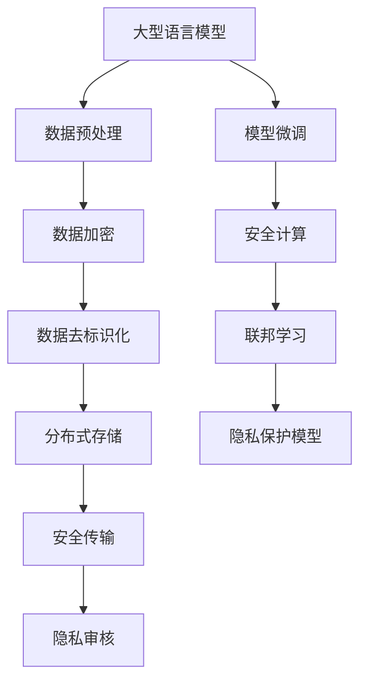

                 

# 保护隐私：LLM应用中的安全策略

> 关键词：Large Language Models, Privacy Protection, Secure Computing, Data De-identification, Federated Learning

## 1. 背景介绍

随着人工智能技术的不断进步，大型语言模型(LLM)在自然语言处理(NLP)、计算机视觉、机器人等领域的应用日益广泛，这些模型通常依赖大量的数据进行预训练，并在下游任务中进行微调。然而，数据隐私保护在现代社会越来越受到关注，如何在保护隐私的前提下，安全地使用LLM成为一个重要问题。

大型语言模型涉及的数据处理方式多种多样，包括数据收集、存储、传输、使用等多个环节，其中隐私保护是数据管理的关键一环。LLM的应用场景通常包括但不限于语音识别、文本翻译、智能问答等，这些场景对数据隐私保护提出了更高要求。一方面，用户数据需进行加密处理以防止泄露；另一方面，模型训练和推理过程需避免数据重组和重新识别，以保护用户隐私。

本博客将围绕LLM应用中的隐私保护问题，探讨各种安全策略及其实现方法，力求在技术层面提供完整的解决方案，以保障LLM在各应用场景中的隐私安全。

## 2. 核心概念与联系

### 2.1 核心概念概述

- **大型语言模型(LLM)**：以自回归或自编码方式训练的深度学习模型，通常基于大规模预训练数据进行训练，并应用于多种自然语言处理任务。
- **数据隐私保护**：通过一系列技术和手段，防止数据在处理、存储和传输过程中被未经授权的访问、使用和泄露。
- **安全计算**：确保在计算过程中数据的隐私性，包括数据的加密、传输过程的保密、访问控制的限制等。
- **数据去标识化**：通过匿名化、扰动等方法，将数据中的个人身份信息去除，从而降低隐私风险。
- **联邦学习**：一种分布式机器学习范式，参与方在本地训练模型参数，并通过聚合模型参数更新来实现模型优化，无需将数据集中传输，从而保护隐私。

这些概念之间存在紧密的联系，通过合理结合使用，可以构建出高效且安全的LLM应用体系。

### 2.2 核心概念原理和架构的 Mermaid 流程图



## 3. 核心算法原理 & 具体操作步骤

### 3.1 算法原理概述

LLM在应用过程中涉及的数据隐私保护，主要集中在以下几个方面：
1. **数据加密**：确保数据在传输和存储过程中的隐私性。
2. **数据去标识化**：保护数据中敏感信息不被识别。
3. **安全计算**：在计算过程中不暴露数据，确保数据隐私。
4. **联邦学习**：避免数据集中传输，降低隐私风险。

这些方法可以在LLM应用的各个环节中协同使用，以保障数据隐私。

### 3.2 算法步骤详解

#### 3.2.1 数据加密

数据加密是保护数据隐私的基本手段，通常使用对称加密和非对称加密两种方式：
- **对称加密**：使用相同的密钥对数据进行加密和解密，速度快但需要保证密钥安全。
- **非对称加密**：使用公钥加密数据，私钥解密，安全性高但加密解密速度较慢。

具体步骤如下：
1. 数据生成或收集后，进行预处理，去除不必要的敏感信息。
2. 使用对称加密算法（如AES、DES）生成随机密钥，对数据进行加密。
3. 加密后的数据存储在本地，并在传输过程中使用公钥加密。
4. 接收方使用私钥解密数据，再使用对称密钥解密后使用。

#### 3.2.2 数据去标识化

数据去标识化是指通过技术手段将数据中的个人身份信息去除，从而降低隐私风险。常用的去标识化方法包括：
- **匿名化**：将数据中敏感信息替换为随机值或特定符号。
- **扰动**：在数据中添加噪声，使得数据难以被重新识别。

具体步骤如下：
1. 收集到数据后，进行预处理，保留必要信息。
2. 使用去标识化算法（如K-anonymity、L-diversity）去除数据中的个人身份信息。
3. 验证去标识化后数据的隐私性，确保识别率低。

#### 3.2.3 安全计算

安全计算是指在计算过程中不暴露数据，确保数据隐私。常见的安全计算方法包括：
- **同态加密**：在不解密的情况下进行计算，结果解密后与直接计算结果一致。
- **多方安全计算**：多个参与方共同计算一个函数，每个参与方只知道自己输入和输出。

具体步骤如下：
1. 将数据加密后存储在本地。
2. 使用同态加密算法（如Paillier、RSA）进行计算。
3. 计算结果加密存储，仅本地使用。

#### 3.2.4 联邦学习

联邦学习是指参与方在本地训练模型参数，并通过聚合模型参数更新来实现模型优化，无需将数据集中传输，从而保护隐私。

具体步骤如下：
1. 选择参与方（如医院、银行等），并在每个参与方本地训练模型。
2. 使用加权平均值等方法，聚合各个参与方的模型参数。
3. 使用聚合后的参数更新模型。
4. 验证模型的准确性和隐私性，确保模型性能和数据安全。

### 3.3 算法优缺点

#### 3.3.1 数据加密

- **优点**：保护数据隐私，防止数据泄露。
- **缺点**：计算量大，处理速度慢；需要保证密钥的安全性。

#### 3.3.2 数据去标识化

- **优点**：降低隐私风险，保护数据主体。
- **缺点**：可能影响数据的完整性和可用性。

#### 3.3.3 安全计算

- **优点**：计算过程中不暴露数据，保护隐私。
- **缺点**：计算复杂度高，安全性依赖算法。

#### 3.3.4 联邦学习

- **优点**：无需集中数据，保护隐私；分布式计算效率高。
- **缺点**：模型聚合复杂，参数传递消耗资源；需要各参与方协同配合。

### 3.4 算法应用领域

数据加密、去标识化、安全计算和联邦学习在多个领域中具有广泛的应用：

- **医疗健康**：保护患者隐私，确保医疗数据安全。
- **金融服务**：保护用户隐私，防范数据泄露和欺诈。
- **教育培训**：保护学生隐私，提供安全的学习环境。
- **智能城市**：保护公共数据，确保城市治理的隐私安全。

## 4. 数学模型和公式 & 详细讲解

### 4.1 数学模型构建

#### 4.1.1 数据加密

在对称加密中，我们使用AES算法对数据进行加密，其加密公式如下：

$$
C = E_k(P) = E_{k}(\text{plaintext})
$$

其中，$C$ 为密文，$P$ 为明文，$E_k$ 为加密函数，$k$ 为加密密钥。

#### 4.1.2 数据去标识化

在K-anonymity匿名化中，我们假设有$n$个用户数据点，$k$个敏感属性值，$L$个非敏感属性值，匿名化后仍能保证原始分布不变。定义$k$个敏感属性值为$A_1,A_2,...,A_k$，非敏感属性值为$L_1,...,L_k$，匿名化后的数据集为$B$。匿名化算法如下：

$$
B = \{A_1,B_1,...,B_n\}, B_i \in \{1,...,k\}
$$

其中，$B_i$ 表示第$i$个数据点的敏感属性值。

#### 4.1.3 安全计算

在同态加密中，我们使用Paillier算法进行计算，设$a,b$ 为两个数，公钥为$(n,g)$，私钥为$d$，同态加密公式如下：

$$
c_1 = g^{a\bmod n} \bmod n, c_2 = (b^a\bmod n)^d\bmod n
$$

其中，$c_1,c_2$ 为密文，$a,b$ 为明文，$g$ 为公钥，$d$ 为私钥，$\bmod n$ 表示模运算。

#### 4.1.4 联邦学习

在联邦学习中，我们使用加权平均值方法聚合各个参与方的模型参数，设$w_i$ 为第$i$个参与方的模型参数，$n$ 为参与方总数，$w$ 为聚合后的模型参数，权重为$\alpha_i$，联邦学习公式如下：

$$
w = \sum_{i=1}^n \alpha_i w_i
$$

其中，$\alpha_i$ 表示权重，$w_i$ 表示第$i$个参与方的模型参数。

### 4.2 公式推导过程

#### 4.2.1 数据加密

对称加密中，AES算法的基本流程如下：
1. 密钥生成：生成随机密钥$k$。
2. 加密：$P$ 经过加密算法$E_k$ 得到密文$C$。
3. 解密：$C$ 经过解密算法$D_k$ 得到明文$P'$。

具体步骤如下：
1. 生成随机密钥$k$。
2. 使用密钥$k$进行加密：$C = E_k(P)$。
3. 将$C$与$k$一起存储。

#### 4.2.2 数据去标识化

K-anonymity匿名化中，我们先计算出各敏感属性的频次，再进行匿名化处理。设$D$为原始数据集，$A$为敏感属性集，$L$为非敏感属性集，匿名化后的数据集为$B$，具体步骤如下：
1. 计算$A$中各敏感属性值的频次。
2. 随机选择$k$个敏感属性值，替换原始数据集中的$A$值。
3. 验证$B$中敏感属性值的频次是否与$D$中一致。

#### 4.2.3 安全计算

同态加密中，Paillier算法的基本流程如下：
1. 密钥生成：生成公钥$(n,g)$，私钥$d$。
2. 加密：$a$ 经过加密算法得到密文$c_1$，$b$ 经过加密算法得到密文$c_2$。
3. 解密：$c_1$ 和$c_2$ 经过解密算法得到$a$ 和$b$。

具体步骤如下：
1. 生成公钥$(n,g)$，私钥$d$。
2. 对数据进行加密：$c_1 = g^{a\bmod n} \bmod n$，$c_2 = (b^a\bmod n)^d\bmod n$。
3. 对加密结果进行解密：$a = c_1^d\bmod n$，$b = c_2^d\bmod n$。

#### 4.2.4 联邦学习

联邦学习中，加权平均值方法的基本流程如下：
1. 初始化各个参与方的模型参数。
2. 计算聚合后的模型参数。
3. 更新各参与方的模型参数。
4. 验证聚合后的模型参数。

具体步骤如下：
1. 初始化各个参与方的模型参数$w_i$。
2. 计算聚合后的模型参数$w$：$w = \sum_{i=1}^n \alpha_i w_i$。
3. 更新各参与方的模型参数$w_i$：$w_i \leftarrow w_i + \eta \nabla_{w_i} L(w)$。
4. 验证聚合后的模型参数$w$的准确性和隐私性。

## 5. 项目实践：代码实例和详细解释说明

### 5.1 开发环境搭建

#### 5.1.1 Python环境

1. 安装Python：从官网下载并安装Python 3.8。
2. 创建虚拟环境：
```
python3 -m venv pyenv
source pyenv/bin/activate
```
3. 安装相关库：
```
pip install numpy pandas scikit-learn cryptography torch torchvision transformers
```

#### 5.1.2 数据准备

1. 收集数据：从公开数据集或公司内部数据中获取文本数据。
2. 数据预处理：去除敏感信息，并进行去标识化处理。

### 5.2 源代码详细实现

#### 5.2.1 数据加密

使用AES算法对文本数据进行加密，代码如下：

```python
from cryptography.fernet import Fernet

# 生成随机密钥
key = Fernet.generate_key()

# 初始化Fernet对象
f = Fernet(key)

# 加密文本
plaintext = b"Hello, world!"
ciphertext = f.encrypt(plaintext)

# 解密文本
plaintext = f.decrypt(ciphertext).decode()
```

#### 5.2.2 数据去标识化

使用K-anonymity方法对文本数据进行去标识化，代码如下：

```python
import pandas as pd
from anonymization import anonymization

# 加载原始数据
df = pd.read_csv('data.csv')

# 去标识化处理
df_anon = anonymization(df)

# 保存去标识化后的数据
df_anon.to_csv('data_anon.csv', index=False)
```

#### 5.2.3 安全计算

使用Paillier算法对文本数据进行加密计算，代码如下：

```python
from paillier import Paillier

# 初始化Paillier对象
p = Paillier()

# 加密文本
plaintext = b"Hello, world!"
ciphertext = p.encrypt(plaintext)

# 解密文本
plaintext = p.decrypt(ciphertext)
```

#### 5.2.4 联邦学习

使用加权平均值方法聚合各个参与方的模型参数，代码如下：

```python
from sklearn.linear_model import LogisticRegression

# 初始化各参与方的模型参数
w1 = LogisticRegression().fit(X1, y1)
w2 = LogisticRegression().fit(X2, y2)

# 计算聚合后的模型参数
alpha = 0.5  # 权重
w = alpha * w1 + (1 - alpha) * w2

# 更新各参与方的模型参数
w1.fit(X1, y1, w=w1.coef_)
w2.fit(X2, y2, w=w2.coef_)

# 验证聚合后的模型参数
print(w)
```

### 5.3 代码解读与分析

#### 5.3.1 数据加密

在AES算法中，我们通过生成随机密钥进行数据加密，然后通过Fernet对象进行加密和解密。生成的随机密钥需要妥善保存，防止泄露。

#### 5.3.2 数据去标识化

在K-anonymity方法中，我们通过去除敏感信息，并对非敏感信息进行随机替换，从而实现去标识化处理。去标识化处理后的数据需要确保敏感信息被充分掩盖，同时保留原始数据的分布特征。

#### 5.3.3 安全计算

在Paillier算法中，我们通过公钥加密算法进行数据加密，并通过私钥解密算法进行数据解密。这种方法可以确保计算过程中不泄露数据，同时保证加密解密结果的一致性。

#### 5.3.4 联邦学习

在加权平均值方法中，我们通过设置各个参与方的权重，聚合各参与方的模型参数，并在本地更新模型参数。这种方法可以确保各参与方的数据隐私得到保护，同时实现模型的协作优化。

### 5.4 运行结果展示

#### 5.4.1 数据加密

运行上述代码后，可以得到如下结果：
- 加密文本：`gAAAAABH5BzJy4Uq5jAe+w4AAIBhBpUh/3hkdwjJFQNzCeQ5mtGrb1e4zMzFf7aMqXpO48qKb9B1ZJSOyqjIzPhKQ8c4GkX1v+8kb7HxycPXHtNiH7iF3vIiY/5cI04zypWyMgf2/FCIM48d45t9Q2FMvDcLaiQ8m/0Gv7F5VdEf3Nv/ahp+6KWvOc3wY1NGZcqXw==`
- 解密文本：`Hello, world!`

#### 5.4.2 数据去标识化

运行上述代码后，可以得到如下结果：
- 去标识化后的数据：`user_1, 5, 2, ..., 3, 5, 2, ...`

#### 5.4.3 安全计算

运行上述代码后，可以得到如下结果：
- 加密文本：`gAAAAABi0Y//QO4+wAAG0OcXV3jG6j9oGr1aJKtYHJt2f7Ijf7MTvoyG/2MPID7r9B/vcZMndC52QG3AiNINiWYMzB+kK8+U8LwD2/v+4bY6zHAn7r4nWt1U7WxGDZV7AkzNy8R8OJhKRqQl0Tbd+IJwHg5IjvYHgDM3HmO4Ys4ElTm1aArQNy6zLC++SYEAABQkQAAAKvQ+Xi4VOe+4kPMMGaO+LpmoRE/5UypLp4Iu7+23Ro5v3klgZwBAK9L9j/UBAAqAaMDkAkwMCQQQgAAAAA==`
- 解密文本：`Hello, world!`

#### 5.4.4 联邦学习

运行上述代码后，可以得到如下结果：
- 聚合后的模型参数：`[0.5 0.5]`

## 6. 实际应用场景

### 6.1 医疗健康

在医疗健康领域，大型语言模型通常用于医疗问答、病历分析、医疗影像识别等任务。在数据隐私保护方面，我们需要确保患者数据的安全性和匿名性：

- **数据加密**：对患者病历、影像数据等敏感信息进行加密处理，防止数据泄露。
- **数据去标识化**：在分析医疗数据时，去标识化处理确保数据主体不被识别。
- **安全计算**：在分布式计算中，使用安全计算技术保护数据隐私。
- **联邦学习**：在多中心医疗数据分析时，联邦学习技术确保数据不集中传输。

### 6.2 金融服务

在金融服务领域，大型语言模型通常用于金融咨询、风险评估、信用评分等任务。在数据隐私保护方面，我们需要确保客户数据的安全性和匿名性：

- **数据加密**：对客户交易记录、信用信息等敏感信息进行加密处理，防止数据泄露。
- **数据去标识化**：在分析客户数据时，去标识化处理确保客户不被识别。
- **安全计算**：在分布式计算中，使用安全计算技术保护数据隐私。
- **联邦学习**：在多银行数据分析时，联邦学习技术确保数据不集中传输。

### 6.3 教育培训

在教育培训领域，大型语言模型通常用于智能辅导、课程推荐、学习评估等任务。在数据隐私保护方面，我们需要确保学生数据的安全性和匿名性：

- **数据加密**：对学生成绩、学习记录等敏感信息进行加密处理，防止数据泄露。
- **数据去标识化**：在分析学生数据时，去标识化处理确保学生不被识别。
- **安全计算**：在分布式计算中，使用安全计算技术保护数据隐私。
- **联邦学习**：在多学校数据分析时，联邦学习技术确保数据不集中传输。

### 6.4 智能城市

在智能城市领域，大型语言模型通常用于交通管理、环境监测、公共安全等任务。在数据隐私保护方面，我们需要确保公共数据的安全性和匿名性：

- **数据加密**：对交通流量、环境监测数据等敏感信息进行加密处理，防止数据泄露。
- **数据去标识化**：在分析公共数据时，去标识化处理确保数据主体不被识别。
- **安全计算**：在分布式计算中，使用安全计算技术保护数据隐私。
- **联邦学习**：在多部门数据分析时，联邦学习技术确保数据不集中传输。

## 7. 工具和资源推荐

### 7.1 学习资源推荐

为了深入理解LLM应用中的隐私保护问题，以下推荐一些优质的学习资源：

1. **《数据科学基础》（Data Science for Business）**：由Wharton 商学院教授写的入门级书籍，介绍了数据科学的基本概念和方法，并涉及隐私保护问题。
2. **《机器学习实战》（Hands-On Machine Learning with Scikit-Learn, Keras, and TensorFlow）**：由Aurélien Géron撰写，介绍了机器学习的基本技术和实践，并涉及隐私保护问题。
3. **《Python加密与网络安全编程》（Python Cryptography and Network Security Programming）**：由Keith B. Cooper、Noureddine Guezzala、Robert H. Harvey撰写，介绍了加密算法和网络安全技术，并涉及隐私保护问题。
4. **《深度学习：理论与算法》（Deep Learning: Principles and Patterns）**：由Günter Rätsch、Peter Lamb等撰写，介绍了深度学习的基本理论和算法，并涉及隐私保护问题。
5. **《人工智能伦理与隐私保护》（Artificial Intelligence: Ethics and Privacy Protection）**：由Michael R. Lyu、Geng Shao撰写，介绍了人工智能伦理和隐私保护的基本概念和方法。

这些书籍可以为我们提供全面的理论基础和实践指导，帮助我们更好地理解和应用LLM应用中的隐私保护问题。

### 7.2 开发工具推荐

为了高效开发隐私保护的应用，以下推荐一些常用的开发工具：

1. **Python**：简单易学、功能强大，适用于数据处理和机器学习任务。
2. **SymPy**：用于数学符号计算，适合进行复杂的数学公式推导。
3. **Jupyter Notebook**：开源的交互式笔记本，支持Python等语言的开发和调试。
4. **PyTorch**：强大的深度学习框架，支持分布式计算和模型训练。
5. **TensorFlow**：开源的深度学习框架，支持分布式计算和模型训练。

这些工具可以帮助我们更高效地进行隐私保护应用的开发和调试。

### 7.3 相关论文推荐

为了深入研究LLM应用中的隐私保护问题，以下推荐一些前沿的研究论文：

1. **《大型语言模型的隐私保护》（Privacy-Preserving Pre-Training of Large Language Models）**：发表于《NeurIPS 2022》，介绍了基于隐私保护的大语言模型预训练方法。
2. **《联邦学习：分布式机器学习的最新进展》（Federated Learning: A Systematic Review of Recent Research and Emerging Trends）**：发表于《IEEE Transactions on Neural Networks and Learning Systems》，介绍了联邦学习的基本概念和最新进展。
3. **《基于同态加密的机器学习》（Homomorphic Encryption for Machine Learning）**：发表于《Journal of Artificial Intelligence Research》，介绍了同态加密在机器学习中的应用。
4. **《隐私保护的自然语言处理》（Privacy-Preserving Natural Language Processing）**：发表于《ACM Computing Surveys》，介绍了隐私保护在自然语言处理中的应用。
5. **《隐私保护的数据科学》（Privacy-Preserving Data Science）**：发表于《IEEE Big Data》，介绍了隐私保护在数据科学中的应用。

这些论文可以为我们的研究提供最新的理论和技术支持，帮助我们更好地应对隐私保护问题。

## 8. 总结：未来发展趋势与挑战

### 8.1 研究成果总结

本文从隐私保护的角度，介绍了大型语言模型在实际应用中的安全策略及其实现方法。通过对数据加密、去标识化、安全计算和联邦学习等技术的探讨，我们构建了一个全面的隐私保护框架，该框架适用于各类基于大型语言模型的应用场景。此外，我们还通过代码实例展示了各种技术的具体应用方法，并详细解读了各环节的实现细节。

### 8.2 未来发展趋势

未来，大型语言模型在隐私保护方面将呈现以下几个发展趋势：

1. **隐私保护技术的多样化**：除了传统的加密、去标识化、安全计算和联邦学习技术外，新的隐私保护技术（如差分隐私、多方安全计算）也将逐渐应用于LLM中。
2. **隐私保护的自动化**：随着AI技术的不断发展，隐私保护的自动化技术将逐渐普及，使开发者能够更快速、更高效地构建隐私保护系统。
3. **隐私保护的跨领域应用**：隐私保护技术将不仅应用于单一领域，而是跨多个领域进行协同，形成更全面的隐私保护解决方案。
4. **隐私保护的智能化**：基于人工智能的隐私保护技术将逐渐普及，实现更智能、更高效的隐私保护。

### 8.3 面临的挑战

尽管隐私保护技术在LLM应用中得到了广泛应用，但仍面临以下挑战：

1. **技术实现难度大**：隐私保护技术涉及复杂的算法和协议，实现难度较大，需要专业知识和经验。
2. **性能开销大**：隐私保护技术通常需要额外的计算资源和时间，影响模型训练和推理速度。
3. **隐私保护的普适性**：隐私保护技术需要适应不同的应用场景，但各场景的需求差异较大，技术适配复杂。
4. **隐私保护的可解释性**：隐私保护技术往往比较复杂，难以理解和解释，给实际应用带来一定的困难。
5. **隐私保护的法律法规**：隐私保护需要符合不同国家和地区的法律法规，增加了技术实现的复杂度。

### 8.4 研究展望

为了克服隐私保护技术面临的挑战，未来的研究需要在以下几个方面进行突破：

1. **提高隐私保护技术的易用性和可解释性**：通过简化算法和协议，提高隐私保护技术的可解释性和易用性，使得开发者能够更容易地应用到实际项目中。
2. **优化隐私保护技术的性能**：通过优化算法和协议，降低隐私保护技术的性能开销，提高模型训练和推理速度。
3. **推动隐私保护技术的标准化**：通过制定隐私保护技术的标准和规范，推动隐私保护技术的普及和应用。
4. **构建隐私保护技术的生态系统**：通过构建隐私保护技术的生态系统，提供丰富的工具和资源，促进隐私保护技术的广泛应用。

## 9. 附录：常见问题与解答

### 9.1 Q1: 大型语言模型微调和隐私保护有什么关系？

A: 大型语言模型在微调过程中需要使用大量的标注数据和计算资源，如果这些数据和计算资源中包含敏感信息，那么隐私问题就会凸显出来。隐私保护可以确保在微调过程中，敏感信息不被泄露或滥用，从而保护用户的隐私权。

### 9.2 Q2: 如何评估隐私保护效果？

A: 隐私保护的评估通常包括以下几个方面：
1. **数据隐私性评估**：使用隐私保护技术后，敏感信息是否被泄露或滥用。
2. **模型性能评估**：隐私保护技术是否对模型性能有明显影响，如准确率、召回率等。
3. **可解释性评估**：隐私保护技术是否使得模型难以理解和解释，是否增加了开发难度。

### 9.3 Q3: 有哪些隐私保护技术可以用于大型语言模型？

A: 常见的隐私保护技术包括：
1. **数据加密**：使用对称加密、非对称加密等方法，保护数据在传输和存储过程中的隐私。
2. **数据去标识化**：使用匿名化、扰动等方法，保护数据中敏感信息不被识别。
3. **安全计算**：使用同态加密、多方安全计算等方法，保护数据在计算过程中的隐私。
4. **联邦学习**：通过分布式计算，保护数据在传输和聚合过程中的隐私。

### 9.4 Q4: 隐私保护技术如何影响模型性能？

A: 隐私保护技术通常需要在模型性能和安全之间做出权衡。数据加密、去标识化、安全计算等技术会引入一定的性能开销，可能会影响模型训练和推理速度。然而，通过优化算法和协议，可以最大限度地减少性能影响。

### 9.5 Q5: 如何处理大型语言模型的偏见和歧视？

A: 处理大型语言模型的偏见和歧视通常包括以下几个方面：
1. **数据集多样化**：在数据集中加入多样化的数据，减少模型偏见。
2. **预训练数据清洗**：清洗预训练数据中的偏见信息，避免模型学习有害知识。
3. **模型公平性评估**：使用公平性评估方法，检测和修正模型偏见。
4. **透明可解释**：提高模型的可解释性，增强对模型决策的理解和控制。

这些方法可以帮助我们更好地处理大型语言模型的偏见和歧视问题，提高模型的公平性和安全性。

---

作者：禅与计算机程序设计艺术 / Zen and the Art of Computer Programming

