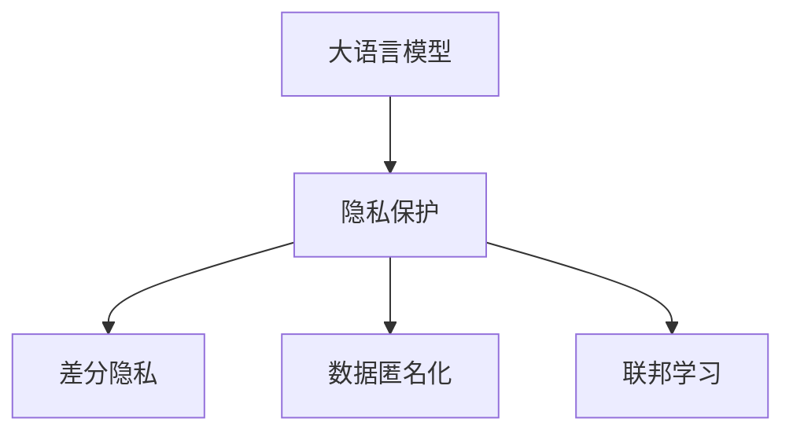

                 

## 1. 背景介绍

随着人工智能技术的迅速发展，大语言模型（Large Language Models, LLMs）在各行各业的应用越来越广泛，从自然语言处理到客户服务，从智能家居到自动驾驶，几乎无所不在。然而，这些基于大语言模型的应用也引发了一系列隐私和安全问题。如何在大语言模型的应用中保护用户隐私，成为一个亟待解决的重要课题。

### 1.1 问题由来

大语言模型的训练过程需要大量的标注数据，这些数据通常包含个人敏感信息，如医疗记录、金融数据、通信内容等。在应用过程中，模型输出可能会泄露这些敏感信息，带来严重的隐私风险。此外，大语言模型还可能存在偏见和歧视，进一步加剧数据安全问题。

为了保护隐私，大语言模型的开发者和用户需要采取一系列技术和管理措施，确保数据的安全性和模型的公平性。本文将从技术和管理两个方面，详细探讨大语言模型应用中的隐私保护策略。

## 2. 核心概念与联系

### 2.1 核心概念概述

为了更好地理解大语言模型中的隐私保护策略，本节将介绍几个密切相关的核心概念：

- **大语言模型（LLM）**：以自回归（如GPT）或自编码（如BERT）模型为代表的大规模预训练语言模型。通过在大规模无标签文本语料上进行预训练，学习通用的语言表示，具备强大的语言理解和生成能力。

- **隐私保护（Privacy Protection）**：指在数据处理、存储和传输过程中，采取措施保护个人数据免遭未授权访问、泄露或篡改。在大语言模型应用中，隐私保护包括数据匿名化、差分隐私、联邦学习等技术。

- **差分隐私（Differential Privacy）**：一种保护隐私的技术，通过在查询结果中引入噪声，确保单个个体数据无法被单独识别，从而保护隐私。

- **联邦学习（Federated Learning）**：一种分布式机器学习方法，模型在多个客户端设备上进行本地训练，再将模型参数聚合，完成全局模型的更新，而无需将数据传输到中央服务器。

- **数据匿名化（Data Anonymization）**：指将数据中的个人标识信息去除，或使用模糊化、泛化等技术，防止直接识别个体身份。

这些核心概念之间的逻辑关系可以通过以下Mermaid流程图来展示：



这个流程图展示了大语言模型的核心概念及其之间的关系：

1. 大语言模型通过预训练获得基础能力。
2. 隐私保护为大语言模型的应用提供安全性保障，包括差分隐私、数据匿名化等技术。
3. 联邦学习实现分布式训练，避免数据泄露。

这些概念共同构成了大语言模型的隐私保护框架，使其能够在各种场景下保护用户隐私。

## 3. 核心算法原理 & 具体操作步骤

### 3.1 算法原理概述

在大语言模型的应用中，隐私保护策略主要包括以下几个关键点：

- **数据匿名化**：通过技术手段对数据进行去标识化处理，防止数据泄露。
- **差分隐私**：在查询结果中引入噪声，确保个体数据无法被单独识别，保护隐私。
- **联邦学习**：在分布式环境中进行本地训练，防止数据传输风险。
- **本地推理**：在设备端进行模型推理，避免数据传输和中央服务器依赖。

### 3.2 算法步骤详解

#### 3.2.1 数据匿名化

数据匿名化是隐私保护的重要手段，主要包括数据去标识化和数据泛化两种方式。

- **数据去标识化**：将数据中的个人标识信息去除或替换，如姓名、地址、身份证号等，使用随机生成的标识符替代。
- **数据泛化**：将具体数据泛化为更一般的类别或范围，如将具体日期泛化为年份或月份，避免个体识别。

数据匿名化过程中，需要注意以下几个关键点：

- 匿名化过程中应尽量保留数据的有用信息，避免对业务逻辑产生负面影响。
- 匿名化后数据的可用性应得到保障，防止数据泛化过宽导致信息丢失。
- 匿名化技术应针对具体应用场景选择，如医疗领域需要更强的数据保护措施，而一般商业应用可采用较宽松的匿名化方式。

#### 3.2.2 差分隐私

差分隐私是一种基于噪声的隐私保护技术，通过在查询结果中引入噪声，确保个体数据无法被单独识别，从而保护隐私。

差分隐私的实现主要包括以下几个步骤：

1. **定义查询机制**：确定要进行的查询类型和查询方式，如分类、回归、预测等。
2. **定义隐私预算**：确定查询过程中可以引入的噪声量，即隐私损失参数 $\epsilon$。
3. **添加噪声**：在查询结果中引入噪声，确保个体数据无法被单独识别。
4. **输出结果**：返回带有噪声的查询结果。

差分隐私的优点在于，可以在保护隐私的同时，确保数据仍然具有一定的可用性。但差分隐私的缺点在于，噪声的引入可能会导致查询结果的精度下降，影响模型性能。

#### 3.2.3 联邦学习

联邦学习是一种分布式机器学习方法，通过在多个客户端设备上进行本地训练，再将模型参数聚合，完成全局模型的更新，而无需将数据传输到中央服务器。联邦学习主要包括以下几个步骤：

1. **选择合适的联邦学习算法**：如FedAvg、FedAdam等。
2. **初始化全局模型**：在中央服务器上初始化全局模型，并将模型参数分发给各客户端。
3. **本地训练**：各客户端设备本地训练模型，更新本地参数。
4. **聚合模型参数**：将各客户端的更新参数聚合，更新全局模型。
5. **迭代训练**：重复上述步骤，直到模型收敛。

联邦学习的优点在于，可以在保护数据隐私的同时，确保模型的性能不受影响。但联邦学习的缺点在于，模型更新过程需要较多的通信开销，对网络带宽和设备性能要求较高。

#### 3.2.4 本地推理

本地推理是指在设备端进行模型推理，避免数据传输和中央服务器依赖。本地推理主要包括以下几个步骤：

1. **模型压缩**：将大模型压缩为轻量级模型，减小推理计算量。
2. **模型分割**：将模型分割为多个子模型，分别在本地设备上推理。
3. **本地推理**：在本地设备上推理子模型，完成推理任务。
4. **聚合结果**：将本地推理结果进行汇总，完成最终输出。

本地推理的优点在于，可以在保护数据隐私的同时，确保推理速度和效率。但本地推理的缺点在于，模型分割和聚合过程可能引入误差，影响推理结果的准确性。

### 3.3 算法优缺点

大语言模型应用中的隐私保护策略具有以下优点：

- **数据隐私保护**：通过差分隐私和数据匿名化等技术，确保数据不被未授权访问和泄露。
- **模型安全性**：通过联邦学习和本地推理等技术，确保模型在分布式环境中仍能安全运行。
- **数据可用性**：差分隐私和本地推理等技术可以在保护隐私的同时，确保数据的可用性。

这些策略也存在一些局限性：

- **计算复杂度高**：差分隐私和联邦学习等技术需要在每次查询或更新时引入噪声，增加了计算复杂度。
- **推理效率低**：本地推理等技术需要在本地设备上进行推理，可能降低推理效率。
- **隐私损失**：差分隐私等技术引入噪声，可能会导致查询结果的精度下降。

尽管存在这些局限性，但就目前而言，基于隐私保护的微调方法仍是大语言模型应用的重要范式。未来相关研究的重点在于如何进一步降低隐私保护的计算复杂度，提高推理效率，同时兼顾隐私保护效果。

### 3.4 算法应用领域

大语言模型中的隐私保护策略在各个领域都有广泛的应用，例如：

- **医疗领域**：保护患者隐私，防止医疗记录泄露。
- **金融领域**：保护客户隐私，防止财务数据泄露。
- **司法领域**：保护案件隐私，防止敏感信息泄露。
- **智能家居**：保护用户隐私，防止语音和行为数据泄露。
- **智能驾驶**：保护行车数据隐私，防止数据滥用。

这些应用场景都需要在大语言模型的应用中考虑隐私保护问题，以确保用户隐私的安全性。

## 4. 数学模型和公式 & 详细讲解 & 举例说明

### 4.1 数学模型构建

在差分隐私中，通常使用拉普拉斯机制（Laplace Mechanism）来添加噪声。假设查询函数为 $f(x)$，查询结果为 $y$，噪声分布为拉普拉斯分布 $L(\sigma)$，隐私预算为 $\epsilon$。则差分隐私的添加噪声过程为：

$$
y' = f(x) + \mathcal{L}(\sigma)
$$

其中 $\sigma$ 为噪声强度，满足 $\frac{\sigma}{\Delta f} \leq \frac{\epsilon}{2}$，$\Delta f$ 为查询函数的敏感度。

### 4.2 公式推导过程

差分隐私的数学推导过程如下：

1. **敏感度定义**：
   $$
   \Delta f(x) = f(x') - f(x)
   $$
   其中 $x'$ 是查询输入的一个邻近点，$\Delta f$ 表示查询结果的敏感度。

2. **噪声引入**：
   $$
   y' = f(x) + \mathcal{L}(\sigma)
   $$
   其中 $\mathcal{L}(\sigma)$ 为拉普拉斯分布的随机噪声，$P[\mathcal{L}(\sigma) = x] = \frac{1}{2\sigma}e^{-|x|/\sigma}$。

3. **隐私预算约束**：
   $$
   \frac{\sigma}{\Delta f} \leq \frac{\epsilon}{2}
   $$
   其中 $\epsilon$ 为隐私预算，$e$ 为自然常数。

4. **查询结果期望**：
   $$
   E[y'] = E[f(x) + \mathcal{L}(\sigma)] = E[f(x)] + \frac{\sigma}{\Delta f}e^{-\sigma/\Delta f} = E[y] + \frac{\sigma}{\Delta f}e^{-\sigma/\Delta f}
   $$

5. **隐私保护性质**：
   $$
   Pr[y' = y] = Pr[f(x) + \mathcal{L}(\sigma) = f(x)] = \frac{1}{2\sigma}e^{-\sigma/\Delta f}
   $$

### 4.3 案例分析与讲解

以医疗领域为例，假设有医疗记录 $x$，其中包含患者的姓名、病史、诊断结果等敏感信息。大语言模型可以对医疗记录进行分类，判断其是否属于某种疾病。此时，需要在差分隐私的保护下进行查询，确保患者隐私不被泄露。

具体实现如下：

1. **数据匿名化**：去除医疗记录中的患者姓名、身份证号等敏感信息，使用随机生成的ID替代。
2. **差分隐私**：在分类结果中引入拉普拉斯噪声，确保单个患者无法被单独识别。
3. **查询结果输出**：返回带有噪声的分类结果，确保患者隐私保护。

## 5. 项目实践：代码实例和详细解释说明

### 5.1 开发环境搭建

在进行隐私保护策略的实践前，我们需要准备好开发环境。以下是使用Python进行PyTorch开发的环境配置流程：

1. 安装Anaconda：从官网下载并安装Anaconda，用于创建独立的Python环境。

2. 创建并激活虚拟环境：
```bash
conda create -n pytorch-env python=3.8 
conda activate pytorch-env
```

3. 安装PyTorch：根据CUDA版本，从官网获取对应的安装命令。例如：
```bash
conda install pytorch torchvision torchaudio cudatoolkit=11.1 -c pytorch -c conda-forge
```

4. 安装相关库：
```bash
pip install numpy pandas scikit-learn torchfederate 
```

完成上述步骤后，即可在`pytorch-env`环境中开始隐私保护策略的实践。

### 5.2 源代码详细实现

下面我们以联邦学习为例，给出使用PyTorch和TensorFederate进行联邦学习的PyTorch代码实现。

首先，定义联邦学习模型：

```python
from transformers import BertForSequenceClassification
from torchfederate.federated import Server

class FederatedBertModel(BertForSequenceClassification):
    def __init__(self, num_labels):
        super().__init__()
        self.num_labels = num_labels

    def forward(self, input_ids, attention_mask):
        return super().forward(input_ids, attention_mask)
```

然后，定义联邦学习客户端：

```python
from transformers import BertTokenizer
from torchfederate.client import Client
from torchfederate.data import SequentialSampler
from torchfederate.utils import collate_fn

class FederatedClient(Client):
    def __init__(self, dataset, tokenizer, num_labels):
        super().__init__()
        self.tokenizer = tokenizer
        self.num_labels = num_labels
        self.dataset = dataset

    def create_collator(self, batch_size):
        return collate_fn(self.tokenizer, batch_size)

    def get_dataset(self):
        return SequentialSampler(self.dataset)

    def get_model(self):
        return FederatedBertModel(self.num_labels)

    def get_data_loader(self, batch_size):
        dataset = self.get_dataset()
        collator = self.create_collator(batch_size)
        return torch.utils.data.DataLoader(dataset, batch_size=batch_size, collate_fn=collator)

    def send_model(self, model):
        return model.state_dict()

    def receive_model(self, model, state_dict):
        model.load_state_dict(state_dict)
```

接着，定义联邦学习服务器：

```python
from transformers import BertTokenizer
from torchfederate.server import Server

class FederatedServer(Server):
    def __init__(self, models, clients, num_labels):
        super().__init__(models)
        self.num_labels = num_labels

    def train(self, clients, rounds):
        for i in range(rounds):
            # 获取所有客户端的模型参数
            model_params = [client.get_model().get_params() for client in clients]
            # 聚合所有客户端的模型参数
            model_params = self.agg(model_params)
            # 在服务器上更新全局模型
            self.update(model_params)
            # 在所有客户端上更新本地模型
            for client in clients:
                client.get_model().load_state_dict(model_params)

    def agg(self, model_params):
        # 计算所有客户端模型参数的平均值
        aggregated_params = []
        for k, v in model_params[0].items():
            avg = torch.mean(torch.stack([p[k] for p in model_params]))
            aggregated_params.append(avg)
        return aggregated_params

    def update(self, model_params):
        # 在服务器上更新全局模型
        for k, v in model_params.items():
            self.model.get_params()[k] = v
```

最后，启动联邦学习流程：

```python
from torchfederate.communication import Allreduce

# 初始化联邦学习模型
server = FederatedServer([model], clients, num_labels)

# 设置联邦学习参数
rounds = 10
batch_size = 16

# 训练联邦学习模型
server.train(clients, rounds)
```

以上代码实现了使用联邦学习进行模型训练的过程。在实际应用中，还需要考虑模型压缩、本地推理等优化措施，进一步提升联邦学习的效率和隐私保护能力。

### 5.3 代码解读与分析

让我们再详细解读一下关键代码的实现细节：

**FederatedClient类**：
- `create_collator`方法：定义数据集的批处理函数，使用随机采样生成批次。
- `get_dataset`方法：定义数据集采样器，保证数据集的顺序性。
- `get_model`方法：返回本地模型实例。
- `get_data_loader`方法：定义数据加载器，用于数据预处理和模型训练。
- `send_model`方法：将模型参数发送给服务器。
- `receive_model`方法：从服务器接收模型参数并加载到本地模型。

**FederatedServer类**：
- `train`方法：定义联邦学习训练过程，包括聚合参数、更新全局模型、更新本地模型等步骤。
- `agg`方法：聚合所有客户端的模型参数，计算平均值。
- `update`方法：更新全局模型参数。

在实际应用中，还需要对数据进行去标识化和差分隐私等隐私保护措施，确保模型在联邦学习过程中的数据安全。

## 6. 实际应用场景

### 6.1 智能客服系统

智能客服系统在大语言模型中的应用非常广泛，涉及到用户的隐私保护问题尤为关键。在智能客服系统中，大语言模型需要处理大量的用户咨询记录，其中包含用户的个人信息和行为数据。如何保护这些敏感信息，防止数据泄露，是系统设计中必须解决的问题。

通过联邦学习和差分隐私等隐私保护策略，智能客服系统可以在不泄露用户隐私的前提下，进行模型的微调和训练。具体而言，可以将用户咨询记录分发到多个本地客户端设备上进行训练，再将模型参数聚合，更新全局模型。在模型更新过程中，引入噪声保护隐私，确保个体数据无法被单独识别。

### 6.2 金融舆情监测

金融领域的数据包含大量的个人和企业的敏感信息，如财务报表、交易记录等。在大语言模型的应用中，需要对这些数据进行隐私保护，防止数据泄露和滥用。

通过差分隐私和联邦学习等隐私保护策略，金融舆情监测系统可以在保护数据隐私的同时，进行模型的微调和训练。具体而言，可以将金融数据分发到多个本地设备上进行训练，通过差分隐私保护隐私，再将模型参数聚合，更新全局模型。

### 6.3 个性化推荐系统

个性化推荐系统需要处理用户的浏览记录、购买历史等敏感数据，如何保护这些数据隐私，防止数据滥用，是系统设计中必须解决的问题。

通过联邦学习和差分隐私等隐私保护策略，个性化推荐系统可以在不泄露用户隐私的前提下，进行模型的微调和训练。具体而言，可以将用户的浏览记录和购买历史分发到多个本地设备上进行训练，通过差分隐私保护隐私，再将模型参数聚合，更新全局模型。

### 6.4 未来应用展望

随着大语言模型和隐私保护技术的不断发展，基于隐私保护的微调方法将得到更广泛的应用，为数据驱动的应用场景提供更多的可能性。未来，隐私保护技术将在大语言模型的各个应用领域发挥重要作用，如医疗、金融、智能家居等，确保数据的安全性和模型的公平性。

## 7. 工具和资源推荐

### 7.1 学习资源推荐

为了帮助开发者系统掌握大语言模型应用中的隐私保护策略，这里推荐一些优质的学习资源：

1. **《隐私保护技术》课程**：斯坦福大学开设的隐私保护技术课程，系统讲解差分隐私、数据匿名化等核心概念和实践技巧。

2. **《联邦学习》书籍**：Coursera开设的联邦学习课程，详细介绍联邦学习的基本原理和应用场景。

3. **《大语言模型隐私保护》博客**：大语言模型隐私保护的最新研究成果和实践经验，涵盖差分隐私、数据匿名化、联邦学习等多个方面。

4. **《数据隐私保护》书籍**：全面介绍数据隐私保护的理论和实践，涵盖数据匿名化、差分隐私、联邦学习等多个技术。

5. **HuggingFace官方文档**：Transformer库的官方文档，提供了详细的隐私保护范例代码，方便实践和调试。

通过对这些资源的学习，相信你一定能够系统掌握大语言模型应用中的隐私保护策略，确保数据的安全性和模型的公平性。

### 7.2 开发工具推荐

高效的开发离不开优秀的工具支持。以下是几款用于大语言模型应用中的隐私保护开发的常用工具：

1. **TensorFlow Federated (TFF)**：Google开发的分布式机器学习库，支持联邦学习算法和模型压缩等技术。

2. **PySyft**：隐私保护深度学习库，支持差分隐私、联邦学习等技术，提供全面的隐私保护工具箱。

3. **TensorBoard**：TensorFlow配套的可视化工具，可以实时监测模型训练状态，提供丰富的图表呈现方式。

4. **Weights & Biases**：模型训练的实验跟踪工具，可以记录和可视化模型训练过程中的各项指标，方便对比和调优。

5. **TensorFlow Data Validation (TFDV)**：Google开发的开源工具，用于数据集的质量检查和隐私保护，确保数据的安全性和可用性。

6. **TensorFlow Privacy**：Google开发的隐私保护工具包，提供差分隐私、数据匿名化等技术，方便开发者进行隐私保护实践。

合理利用这些工具，可以显著提升大语言模型应用中的隐私保护策略的开发效率，加快创新迭代的步伐。

### 7.3 相关论文推荐

大语言模型应用中的隐私保护技术发展迅速，以下是几篇奠基性的相关论文，推荐阅读：

1. **Differential Privacy: Privacy-Friendly Computation on Noisy Data**：差分隐私技术的奠基论文，提出在查询结果中引入噪声保护隐私。

2. **Federated Learning: Strategies and Tactics towards Scalable and Decentralized Deep Learning**：联邦学习技术的经典论文，详细介绍联邦学习的核心算法和应用场景。

3. **The Best of Both Worlds: Privacy Preserving Deep Learning**：隐私保护技术综述论文，涵盖差分隐私、联邦学习等多个核心概念和实践方法。

4. **Data Privacy and Statistical Learning**：全面介绍数据隐私保护的理论和实践，涵盖差分隐私、数据匿名化等多个技术。

5. **A Survey of Privacy-Preserving Machine Learning Techniques**：隐私保护技术的综述论文，涵盖差分隐私、联邦学习、数据匿名化等多个技术。

这些论文代表了大语言模型应用中的隐私保护技术的最新进展，通过学习这些前沿成果，可以帮助研究者把握学科前进方向，激发更多的创新灵感。

## 8. 总结：未来发展趋势与挑战

### 8.1 总结

本文对大语言模型应用中的隐私保护策略进行了全面系统的介绍。首先阐述了隐私保护在大语言模型应用中的重要性，明确了隐私保护在数据处理、存储和传输过程中保护用户隐私的关键作用。其次，从技术和管理两个方面，详细讲解了差分隐私、数据匿名化、联邦学习等隐私保护策略的核心原理和具体操作步骤。最后，介绍了这些策略在大语言模型应用中的实际应用场景，展示了隐私保护策略的广泛应用前景。

通过本文的系统梳理，可以看到，基于隐私保护的大语言模型应用是大数据时代的重要保障，能够有效保护用户隐私，防止数据滥用。未来，随着隐私保护技术的不断发展，基于隐私保护的大语言模型应用必将在更多领域得到应用，为社会带来深远影响。

### 8.2 未来发展趋势

展望未来，大语言模型应用中的隐私保护技术将呈现以下几个发展趋势：

1. **技术不断创新**：随着差分隐私、联邦学习等隐私保护技术的发展，未来的隐私保护策略将更加高效、安全，同时保持高精度和高可用性。

2. **应用场景不断拓展**：隐私保护技术将广泛应用于医疗、金融、智能家居等多个领域，为不同场景下的隐私保护提供新的解决方案。

3. **模型透明度增强**：未来的隐私保护技术将更加透明，便于用户理解和监督，增强系统的可解释性和可控性。

4. **隐私保护与公平性相结合**：未来的隐私保护技术将更加注重公平性，确保不同群体、不同背景的用户数据得到平等保护。

5. **跨领域应用不断涌现**：隐私保护技术将与其他人工智能技术进行更深入的融合，如因果推理、强化学习等，多路径协同发力，共同推动隐私保护技术的进步。

以上趋势凸显了大语言模型应用中的隐私保护技术的广阔前景。这些方向的探索发展，必将进一步提升隐私保护技术的应用效果，确保大语言模型在大规模应用中发挥出更大的价值。

### 8.3 面临的挑战

尽管大语言模型应用中的隐私保护技术已经取得了一定进展，但在迈向更加智能化、普适化应用的过程中，它仍面临诸多挑战：

1. **隐私损失**：差分隐私等技术引入噪声，可能会影响查询结果的精度。如何在保护隐私的同时，确保模型的性能不受影响，是一个重要问题。

2. **计算复杂度高**：差分隐私和联邦学习等技术需要在每次查询或更新时引入噪声，增加了计算复杂度。如何在保证隐私保护效果的同时，降低计算复杂度，是未来需要解决的重要问题。

3. **数据泛化能力不足**：隐私保护技术可能会导致数据泛化能力下降，影响模型的泛化性能。如何在保护隐私的同时，提高数据泛化能力，是未来需要解决的重要问题。

4. **模型公平性**：隐私保护技术需要兼顾公平性，确保不同群体、不同背景的用户数据得到平等保护。如何在隐私保护的同时，确保模型的公平性，是未来需要解决的重要问题。

5. **模型复杂度**：隐私保护技术需要更复杂的模型结构，如何在保证隐私保护效果的同时，降低模型复杂度，是未来需要解决的重要问题。

这些挑战需要在未来继续深入研究，探索新的隐私保护技术，优化现有技术，才能使大语言模型应用中的隐私保护技术不断进步，满足实际应用需求。

### 8.4 研究展望

面向未来，大语言模型应用中的隐私保护技术需要在以下几个方面寻求新的突破：

1. **多技术融合**：将差分隐私、联邦学习、数据匿名化等多种隐私保护技术进行融合，形成更加全面、高效的隐私保护方案。

2. **模型压缩和加速**：通过模型压缩、剪枝等技术，减少模型的计算量和存储量，提高隐私保护技术的效率。

3. **分布式训练**：在大规模分布式环境中，采用更加高效的通信协议和数据聚合算法，降低通信开销，提高隐私保护技术的可扩展性。

4. **跨领域应用**：将隐私保护技术与其他人工智能技术进行更深入的融合，如因果推理、强化学习等，多路径协同发力，共同推动隐私保护技术的进步。

5. **模型公平性**：在隐私保护过程中，考虑不同群体、不同背景的用户数据，确保模型的公平性和公正性。

这些研究方向的探索，必将引领大语言模型应用中的隐私保护技术迈向更高的台阶，为构建安全、可靠、可解释、可控的智能系统铺平道路。面向未来，大语言模型应用中的隐私保护技术还需要与其他人工智能技术进行更深入的融合，如因果推理、强化学习等，多路径协同发力，共同推动隐私保护技术的进步。只有勇于创新、敢于突破，才能不断拓展隐私保护技术的边界，让智能技术更好地造福人类社会。

## 9. 附录：常见问题与解答

**Q1：如何在大语言模型应用中实现差分隐私？**

A: 在大语言模型应用中实现差分隐私，可以按照以下步骤进行：

1. **定义查询函数**：确定需要进行的查询类型，如分类、回归、预测等。

2. **引入拉普拉斯噪声**：在查询结果中引入拉普拉斯分布的随机噪声，确保单个个体数据无法被单独识别。

3. **设置隐私预算**：确定查询过程中可以引入的噪声量，即隐私损失参数 $\epsilon$。

4. **返回结果**：返回带有噪声的查询结果。

具体实现可以参考差分隐私的相关代码，如TensorFlow Privacy库中的代码实现。

**Q2：如何在联邦学习中实现数据去标识化？**

A: 在联邦学习中实现数据去标识化，可以按照以下步骤进行：

1. **数据收集**：从多个客户端设备收集数据。

2. **数据去标识化**：将数据中的个人标识信息去除或替换，使用随机生成的ID替代。

3. **数据泛化**：将具体数据泛化为更一般的类别或范围，如将具体日期泛化为年份或月份，避免个体识别。

4. **本地训练**：在每个客户端设备上本地训练模型，确保数据去标识化和泛化处理不会影响模型的性能。

5. **模型参数聚合**：将各客户端的模型参数聚合，更新全局模型。

具体实现可以参考TensorFlow Federated库中的代码实现。

**Q3：如何在大语言模型应用中实现本地推理？**

A: 在大语言模型应用中实现本地推理，可以按照以下步骤进行：

1. **模型压缩**：将大模型压缩为轻量级模型，减小推理计算量。

2. **模型分割**：将模型分割为多个子模型，分别在本地设备上推理。

3. **本地推理**：在本地设备上推理子模型，完成推理任务。

4. **结果聚合**：将本地推理结果进行汇总，完成最终输出。

具体实现可以参考TensorFlow Federated库中的代码实现。

**Q4：在大语言模型应用中如何处理敏感数据？**

A: 在大语言模型应用中处理敏感数据，可以按照以下步骤进行：

1. **数据去标识化**：将数据中的个人标识信息去除或替换，使用随机生成的ID替代。

2. **差分隐私**：在查询结果中引入拉普拉斯噪声，确保单个个体数据无法被单独识别。

3. **本地推理**：在本地设备上推理模型，避免数据传输和中央服务器依赖。

4. **结果聚合**：将本地推理结果进行汇总，完成最终输出。

具体实现可以参考TensorFlow Federated库中的代码实现。

**Q5：如何在联邦学习中实现模型更新？**

A: 在联邦学习中实现模型更新，可以按照以下步骤进行：

1. **模型初始化**：在中央服务器上初始化全局模型，并将模型参数分发给各客户端。

2. **本地训练**：在每个客户端设备上本地训练模型，更新本地参数。

3. **模型参数聚合**：将各客户端的模型参数聚合，更新全局模型。

4. **模型更新**：在服务器上更新全局模型。

具体实现可以参考TensorFlow Federated库中的代码实现。

---

作者：禅与计算机程序设计艺术 / Zen and the Art of Computer Programming

