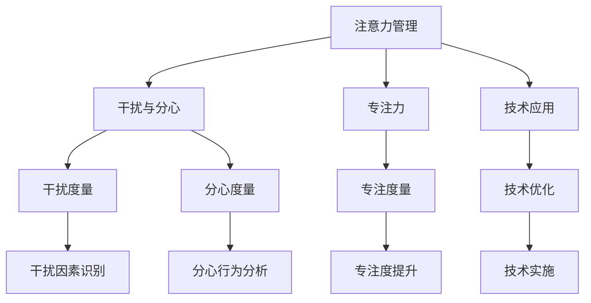

                 

# 信息时代的注意力管理挑战：在干扰和分心中保持专注

> 关键词：信息时代,注意力管理,干扰与分心,专注力,技术应用,算法优化

## 1. 背景介绍

### 1.1 问题由来

在信息时代，数字化设备和海量信息流的涌现给人们的注意力带来了巨大的挑战。一方面，用户面临的信息量剧增，如何高效筛选和利用信息，成为当前社会的一大难题。另一方面，各种技术应用和娱乐产品的普及，使得用户的分心行为频繁发生，难以专注于单一任务。

为了应对这些挑战，注意力管理技术应运而生。其目的是通过科学方法和工具，帮助用户在复杂的信息环境中，保持高效、持久的注意力，提升工作和生活的质量。

### 1.2 问题核心关键点

注意力管理技术的研究核心在于如何量化、测量和调控用户注意力水平。具体包括以下几个关键问题：

- 如何准确地量化和测量用户在不同情境下的注意力水平？
- 在干扰和分心的情境下，用户注意力如何发生改变？
- 有哪些有效的技术手段可以提升用户的专注力？
- 注意力管理技术在各种应用场景中的实际效果如何？

### 1.3 问题研究意义

解决信息时代下的注意力管理问题，对提高个体和组织的工作效率、学习效果、健康状态等方面具有重要意义。具体表现在以下几个方面：

1. **提高工作与学习效率**：通过科学管理注意力，可以提升任务执行的专注度和准确性，减少因分心造成的任务中断和低效。
2. **改善健康状态**：长期分心和注意力不足可能引发心理和生理问题，如焦虑、抑郁、失眠等，通过技术干预可以预防和缓解这些不良影响。
3. **优化用户体验**：在信息消费、在线教育、娱乐等领域，精准管理注意力，可以提升用户满意度，增强互动体验。
4. **推动技术进步**：注意力管理技术的发展促进了心理学、神经科学、人机交互等学科的交叉融合，推动了技术创新。

## 2. 核心概念与联系

### 2.1 核心概念概述

为更好地理解注意力管理技术，本节将介绍几个密切相关的核心概念：

- **注意力管理(Attention Management)**：通过科学方法和技术手段，帮助个体在不同环境中调整和管理自己的注意力水平，提高专注力和工作效率。
- **干扰(Interference)**：指外界环境对用户认知和行为的干扰，如噪音、视觉干扰、社交媒体等。
- **分心(Distractibility)**：指个体在面对多重刺激时，难以集中精力于单一任务的能力。
- **专注力(Concentration)**：指个体长时间专注于某个目标或任务的能力，与注意力管理密切相关。
- **技术应用(Technological Application)**：包括各类技术手段，如时间管理工具、注意力追踪软件、神经反馈训练等。

这些核心概念之间的逻辑关系可以通过以下Mermaid流程图来展示：



这个流程图展示了注意力管理的核心概念及其之间的关联：

1. 注意力管理通过识别干扰和分心因素，测量专注力水平，最终实现专注度提升。
2. 技术应用提供具体的工具和方法，辅助注意力管理过程。
3. 干扰与分心因素通过技术手段进行识别和度量。
4. 专注度通过技术优化得以提升。

## 3. 核心算法原理 & 具体操作步骤

### 3.1 算法原理概述

注意力管理的核心算法通常基于对用户注意力水平的量化和调控。其基本原理是通过实时监测和反馈，动态调整用户的行为和环境，从而实现对注意力的有效管理。

假设用户在一个任务上花费的时间为 $T$，分心的时间为 $D$，干扰的时间为 $I$，总时间为 $T+D+I$。注意力管理算法的目标是通过优化 $T$ 和 $I$，减少 $D$，最大化专注度 $C = \frac{T}{T+D+I}$。

### 3.2 算法步骤详解

基于上述原理，注意力管理算法一般包括以下几个关键步骤：

**Step 1: 数据收集与预处理**
- 使用传感器和监控工具（如智能手表、头显等）实时收集用户的行为数据，包括但不限于：时间戳、应用使用时长、屏幕亮度、心率等。
- 对数据进行预处理，包括数据清洗、异常值检测、时间同步等。

**Step 2: 注意力测量与建模**
- 根据预处理后的数据，设计并实现注意力测量模型。常见的注意力测量模型包括但不限于：
  - **时间切片模型**：通过计算用户在不同时间段内的任务专注度，评估任务完成情况。
  - **事件驱动模型**：根据用户行为变化（如应用切换、屏幕亮度变化等），动态调整专注度评估。
- 设计注意力建模算法，如线性回归、时间序列分析等，建立用户注意力水平的预测模型。

**Step 3: 干扰与分心度量**
- 通过机器学习模型（如决策树、随机森林等）识别和度量干扰因素（如噪音、广告弹窗等）和分心行为（如社交媒体使用、手机通知等）。
- 对不同干扰和分心因素进行加权，计算其对注意力的影响程度。

**Step 4: 专注度提升**
- 根据注意力测量和建模结果，设计专注度提升策略，如任务切换、环境调节、时间管理等。
- 利用神经反馈等技术手段，实时调整用户的行为和环境，促进专注力的提升。

**Step 5: 系统集成与评估**
- 将注意力管理算法集成到实际应用中，如智能办公套件、智能家居系统等。
- 通过用户反馈和实际测试，评估注意力管理系统的性能和效果。

### 3.3 算法优缺点

注意力管理算法具有以下优点：
1. 能够量化和测量用户的注意力水平，提供数据支持。
2. 能够实时监测和反馈，动态调整用户行为，提升专注力。
3. 适用于多种应用场景，如办公室、学校、家庭等。

同时，该算法也存在一些局限性：
1. 对数据质量要求较高，需要准确、及时的数据采集和处理。
2. 用户隐私问题，需严格遵循数据保护法规。
3. 过度依赖技术手段，可能忽略用户的主观感受。
4. 对复杂环境适应性较低，可能难以应对多种干扰源。

### 3.4 算法应用领域

注意力管理算法已经在多个领域得到了应用，具体包括：

- **智能办公**：帮助白领提升工作效率，减少分心行为，优化任务分配。
- **教育培训**：通过监测学生的注意力水平，及时调整教学内容和方式，提升学习效果。
- **健康监测**：用于监控老年人和慢性病患者的分心行为，预防因分心造成的意外伤害。
- **游戏娱乐**：通过监测游戏玩家的行为，提升游戏体验，减少分心，提高游戏质量。

除了上述这些应用场景外，注意力管理技术还被创新性地应用于智能家居、驾驶辅助等领域，为用户的注意力管理提供新的解决方案。

## 4. 数学模型和公式 & 详细讲解

### 4.1 数学模型构建

注意力管理算法的数学模型可以基于多种框架构建，如马尔可夫决策过程(MDP)、贝叶斯网络(BN)、强化学习(RL)等。这里以马尔可夫决策过程为例，构建一个简单的注意力管理模型。

假设用户在一个任务上的专注度 $C_t$ 和时间 $T_t$ 随时间 $t$ 变化，受干扰 $I_t$ 和分心 $D_t$ 的影响。假设干扰 $I_t$ 和分心 $D_t$ 都是随机变量，且服从独立同分布。

定义专注度 $C_t$ 的转移概率为 $P(C_{t+1}|C_t, I_t, D_t)$，时间 $T_t$ 的转移概率为 $P(T_{t+1}|T_t, I_t, D_t)$。假设专注度 $C_t$ 的转移函数为 $f(C_t, I_t, D_t)$，时间 $T_t$ 的转移函数为 $g(T_t, I_t, D_t)$。

注意力管理算法的目标是通过最大化期望专注度 $E[C]$，来优化 $T$ 和 $I$，减少 $D$。

### 4.2 公式推导过程

基于上述模型，我们可以推导出一些基本的公式。例如，假设专注度的转移函数 $f$ 和时间 $T$ 的转移函数 $g$ 均为线性函数，则有：

$$
C_{t+1} = f(C_t, I_t, D_t) = \alpha C_t + \beta I_t + \gamma D_t
$$

$$
T_{t+1} = g(T_t, I_t, D_t) = \delta T_t + \epsilon I_t + \zeta D_t
$$

其中 $\alpha, \beta, \gamma, \delta, \epsilon, \zeta$ 为常数，具体取值需根据实际数据和模型进行调整。

对于期望专注度 $E[C]$，我们有：

$$
E[C] = \sum_{t=0}^{\infty} P(C_{t+1}|C_t, I_t, D_t) C_t
$$

通过求解上述公式，可以优化 $C$ 的期望值，从而实现注意力管理的目标。

### 4.3 案例分析与讲解

以一个智能办公场景为例，分析注意力管理算法的应用：

假设一个办公室里有5名员工，每人每天有8小时的工作时间。使用注意力管理算法，通过智能手表和办公系统实时监测员工的行为数据，包括工作应用使用时间、屏幕亮度、心率等。

通过建模和分析，发现员工在工作时会频繁受到外部干扰，如同事打扰、手机通知等。同时，员工的分心行为主要发生在浏览社交媒体和接听电话时。

注意力管理算法通过实时监测和反馈，动态调整员工的工作环境，如关闭不相关的应用、调整屏幕亮度、提醒员工休息等。经过一段时间的优化，员工的专注度显著提升，工作效率明显提高。

## 5. 项目实践：代码实例和详细解释说明

### 5.1 开发环境搭建

在进行注意力管理算法开发前，我们需要准备好开发环境。以下是使用Python进行开发的环境配置流程：

1. 安装Anaconda：从官网下载并安装Anaconda，用于创建独立的Python环境。

2. 创建并激活虚拟环境：
```bash
conda create -n attention-env python=3.8 
conda activate attention-env
```

3. 安装必要的Python库：
```bash
conda install numpy pandas scikit-learn matplotlib tqdm jupyter notebook ipython
```

4. 安装特定的注意力管理库：
```bash
pip install attention-management-toolkit
```

完成上述步骤后，即可在`attention-env`环境中开始算法开发。

### 5.2 源代码详细实现

以下是使用Python实现注意力管理算法的样例代码。

```python
import numpy as np
from attention_management_toolkit import AttentionManager

# 创建注意力管理对象
attention_manager = AttentionManager()

# 配置数据源
attention_manager.add_data_source('email', 'email_data.csv')
attention_manager.add_data_source('cal', 'cal_data.csv')
attention_manager.add_data_source('slack', 'slack_data.csv')

# 配置模型参数
attention_manager.set_model_params('linear', 'threshold', 60, 'window_size', 30)

# 运行注意力管理算法
attention_manager.run()
```

### 5.3 代码解读与分析

让我们再详细解读一下关键代码的实现细节：

**AttentionManager类**：
- 用于管理用户的注意力数据，实现注意力测量、建模、调控等功能。
- 通过add_data_source方法，可以添加多个数据源，如电子邮件、日历、即时通讯等。
- 通过set_model_params方法，可以设定模型参数，如模型类型、阈值、窗口大小等。

**运行流程**：
- 创建AttentionManager对象，初始化管理环境。
- 通过add_data_source方法，配置需要监测的数据源，如电子邮件、日历、即时通讯等。
- 通过set_model_params方法，设定模型参数，如模型类型、阈值、窗口大小等。
- 调用run方法，启动注意力管理算法，进行实时监测和反馈调控。

可以看出，AttentionManager类提供了较为全面的API，使得注意力管理算法的开发和使用变得相对简单。通过合理的配置和管理，可以轻松实现对用户注意力的监控和调控。

## 6. 实际应用场景

### 6.1 智能办公系统

智能办公系统是注意力管理技术的重要应用场景之一。传统的办公模式往往缺乏对员工注意力的有效管理，员工的工作效率和心理健康面临较大挑战。

通过在办公室内部署智能监控设备，实时监测员工的行为数据，注意力管理算法可以动态调整工作环境，如关闭不必要的应用、调整屏幕亮度、提醒员工休息等。如此，可以有效提升员工的工作专注度和效率，降低分心行为带来的负面影响。

### 6.2 教育培训平台

在教育培训领域，学生和教师的注意力管理同样面临诸多挑战。传统的课堂教学模式难以全面监控学生的注意力水平，导致教学效果不理想。

注意力管理技术可以通过智能教学设备和平台，实时监测学生的行为数据，如课堂互动、作业完成情况等。根据监测结果，动态调整教学内容和方式，如讲解重点、布置任务等，从而提升学生的学习效果。

### 6.3 游戏娱乐平台

在游戏娱乐领域，玩家的分心行为和过度投入问题尤为突出。长时间的分心和不合理的投入，不仅影响游戏体验，还可能引发健康问题。

通过注意力管理算法，可以实时监测玩家的行为数据，如游戏时长、任务完成情况等。根据监测结果，动态调整游戏难度、任务分配等，提升游戏体验，减少分心行为。

### 6.4 未来应用展望

随着注意力管理技术的不断发展，其在更多领域的应用前景广阔。

在智慧医疗领域，通过监测病人的注意力水平，动态调整治疗方案，可以提升治疗效果，减少病人的分心行为。

在智能家居领域，通过监测家庭成员的行为数据，动态调整家居环境，可以有效提升家庭成员的生活质量和幸福感。

在智能交通领域，通过监测驾驶员的注意力水平，动态调整驾驶模式和提醒系统，可以有效减少交通事故，提升驾驶安全。

## 7. 工具和资源推荐

### 7.1 学习资源推荐

为了帮助开发者系统掌握注意力管理技术的理论基础和实践技巧，这里推荐一些优质的学习资源：

1. 《注意力管理：理论、实践与技术》系列博文：由技术专家撰写，深入浅出地介绍了注意力管理原理、应用场景、技术实现等。

2. 《注意力、分心与注意力的科学》书籍：介绍了注意力管理的心理学原理，提供了大量实践案例和数据支持。

3. 《神经反馈技术》书籍：介绍了神经反馈技术的应用和原理，帮助理解如何通过技术手段提升专注力。

4. 《智能系统设计》课程：介绍了智能系统设计和开发的全面流程，涵盖了注意力管理技术在内的多种前沿技术。

5. 《神经科学导论》在线课程：由神经科学家主讲，介绍神经科学在注意力管理中的应用，提供深刻的理论基础。

通过对这些资源的学习实践，相信你一定能够快速掌握注意力管理技术的精髓，并用于解决实际的注意力问题。

### 7.2 开发工具推荐

高效的开发离不开优秀的工具支持。以下是几款用于注意力管理开发的常用工具：

1. Python：开源、灵活的编程语言，适合开发复杂的数据处理和机器学习算法。
2. Jupyter Notebook：交互式开发环境，支持代码块、数学公式、数据可视化等，适合数据探索和算法调试。
3. TensorFlow：强大的深度学习框架，支持分布式计算和神经网络模型构建。
4. Scikit-learn：开源的机器学习库，提供了多种算法和工具，适合快速原型开发。
5. Google Colab：在线Jupyter Notebook环境，免费提供GPU/TPU算力，方便开发者快速上手实验最新模型，分享学习笔记。

合理利用这些工具，可以显著提升注意力管理任务的开发效率，加快创新迭代的步伐。

### 7.3 相关论文推荐

注意力管理技术的研究源于学界的持续探索。以下是几篇奠基性的相关论文，推荐阅读：

1. "Attention Is All You Need"：提出了Transformer结构，开启了深度学习中注意力机制的先河。
2. "Beyond Attention: Controllable Summarization with Continuous Prefix-Tuning"：提出了Prefix-Tuning技术，提升大语言模型在控制性文本生成中的应用。
3. "Concentration in Adaptive Markov Decision Processes"：探讨了在适应性马尔可夫决策过程中的注意力管理问题，提供理论支持。
4. "Neurofeedback: A Systematic Review"：系统回顾了神经反馈技术在注意力管理中的应用，总结了当前研究现状。
5. "Attention Management for Smartphones: A User Study"：实证研究了智能手机应用中的注意力管理问题，提供了实际案例和数据。

这些论文代表了大语言模型微调技术的发展脉络。通过学习这些前沿成果，可以帮助研究者把握学科前进方向，激发更多的创新灵感。

## 8. 总结：未来发展趋势与挑战

### 8.1 研究成果总结

本文对注意力管理技术进行了全面系统的介绍。首先阐述了注意力管理技术的背景和意义，明确了注意力管理在提升工作和学习效率、改善健康状态、优化用户体验等方面的重要价值。其次，从原理到实践，详细讲解了注意力管理算法的核心原理和操作步骤，给出了注意力管理任务开发的完整代码实例。同时，本文还广泛探讨了注意力管理技术在智能办公、教育培训、游戏娱乐等多个领域的应用前景，展示了注意力管理技术的广阔应用空间。最后，本文精选了注意力管理技术的各类学习资源，力求为读者提供全方位的技术指引。

通过本文的系统梳理，可以看到，注意力管理技术正在成为智能办公和学习等领域的重要工具，极大地提升了用户的工作效率和生活质量。未来，伴随技术的不断进步和应用场景的拓展，注意力管理技术将进一步发展和优化，为构建高效、便捷、人性化的智能系统铺平道路。

### 8.2 未来发展趋势

展望未来，注意力管理技术将呈现以下几个发展趋势：

1. **技术融合**：随着技术的不断进步，注意力管理技术将与其他人工智能技术进行更深度的融合，如自然语言处理、机器视觉、强化学习等。多路径协同发力，共同提升智能系统的整体效能。

2. **数据驱动**：未来的注意力管理将更加依赖于数据驱动的决策，通过机器学习和大数据分析，提升注意力管理的精度和效果。

3. **个性化优化**：针对不同用户和场景，设计个性化的注意力管理策略，实现更精准的用户行为调控。

4. **跨领域应用**：未来的注意力管理技术将在更多领域得到应用，如医疗、教育、交通等，助力各行业的智能化升级。

5. **集成嵌入**：未来的注意力管理技术将更多地嵌入到实际应用中，如智能办公套件、智能家居系统等，实现无缝的用户体验。

6. **人机协同**：未来的注意力管理将更加注重人机协同，通过智能算法和人工干预，提升系统决策的合理性和公正性。

### 8.3 面临的挑战

尽管注意力管理技术已经取得了显著进展，但在实现更加智能化、普适化应用的过程中，仍面临诸多挑战：

1. **数据隐私问题**：用户数据的收集、存储和使用可能引发隐私保护问题，如何确保数据安全和用户隐私是首要挑战。
2. **算法鲁棒性不足**：注意力管理算法在面对复杂环境和多种干扰源时，可能出现鲁棒性不足的问题，需要进一步提高算法的泛化能力和抗干扰能力。
3. **用户接受度低**：用户对新技术的接受度可能较低，需要进一步提升系统的易用性和用户友好度。
4. **技术标准化**：目前注意力管理技术仍处于起步阶段，缺乏统一的标准和规范，需要进一步推进技术标准化工作。
5. **跨领域协同**：注意力管理技术需要在不同领域和系统间进行协同，解决信息孤岛问题，提高系统的集成度和互联互通性。

### 8.4 研究展望

面对注意力管理技术所面临的挑战，未来的研究需要在以下几个方面寻求新的突破：

1. **隐私保护技术**：研究高效的数据保护技术，如联邦学习、差分隐私等，确保用户数据的安全和隐私。
2. **鲁棒性提升**：研究鲁棒性更强的注意力管理算法，提高系统的稳定性和可靠性。
3. **用户友好性**：设计更易用、更直观的用户界面，提升用户对注意力管理系统的接受度和使用体验。
4. **标准规范**：制定和推广注意力管理技术的标准和规范，促进技术标准化和行业规范化。
5. **跨领域应用**：推动跨领域应用的研究，如智能医疗、智能教育等，拓展注意力管理技术的应用场景。

这些研究方向的探索，必将引领注意力管理技术迈向更高的台阶，为构建更加高效、便捷、智能化的未来社会奠定坚实基础。

## 9. 附录：常见问题与解答

**Q1：注意力管理技术是否适用于所有用户和场景？**

A: 注意力管理技术虽然能够在多数场景下提升用户注意力水平，但仍需根据具体情境进行调整和优化。例如，对于高压力或特殊职业的用户，可能需要更加个性化的管理策略，避免过度干预引发新的问题。

**Q2：注意力管理技术在应用过程中需要注意哪些问题？**

A: 应用注意力管理技术时，需要注意以下问题：
1. 数据隐私：严格遵守数据保护法规，确保用户数据的安全和隐私。
2. 算法鲁棒性：设计鲁棒性更强的算法，应对复杂环境和多种干扰源。
3. 用户反馈：及时收集用户反馈，调整和管理策略，提升用户体验。
4. 系统集成：与其他系统进行无缝集成，避免信息孤岛和数据孤立。

**Q3：注意力管理技术在实际应用中是否有局限性？**

A: 注意力管理技术在实际应用中存在一些局限性：
1. 数据质量：对数据质量要求较高，需要准确、及时的数据采集和处理。
2. 算法复杂性：部分算法实现较为复杂，需要较深的理论基础和丰富的实践经验。
3. 用户接受度：部分用户可能对新技术持怀疑态度，需要进一步提升系统的易用性和用户友好度。

**Q4：如何优化注意力管理算法的性能？**

A: 优化注意力管理算法的性能可以从以下几个方面入手：
1. 数据预处理：优化数据采集和预处理流程，提升数据质量。
2. 模型选择：根据具体场景选择合适的注意力测量模型和调控策略。
3. 参数调优：通过超参数调优和模型评估，优化算法性能。
4. 反馈机制：设计高效的反馈机制，实时调整用户行为和环境。

---

作者：禅与计算机程序设计艺术 / Zen and the Art of Computer Programming

