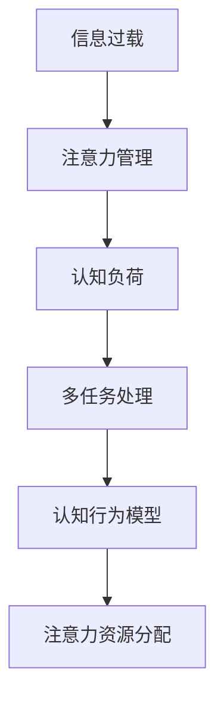

                 

# 信息时代的注意力管理策略与实践：在干扰和信息过载中航行

> 关键词：信息过载,注意力管理,认知负荷,多任务处理,认知行为模型

## 1. 背景介绍

### 1.1 问题由来
随着互联网和移动互联网的快速发展，信息量呈指数级增长，我们每天都面临着大量的信息干扰和过载问题。无论是在工作中，还是在日常生活中，注意力管理的挑战都显得愈发严峻。如何在干扰和信息过载中保持高效和专注，已经成为现代社会的一个重要课题。

### 1.2 问题核心关键点
信息过载和注意力管理之间存在着紧密的联系。信息过载指的是信息量超过个体处理能力，导致认知资源耗尽，从而影响决策和执行效率。注意力管理则是指通过认知行为策略和工具，帮助个体筛选和聚焦重要信息，提升工作效率和生活质量。

当前，信息时代下，注意力管理的核心问题在于：
- 如何有效识别和屏蔽干扰，提高注意力集中度。
- 如何分配和优化注意力资源，最大化利用有限认知资源。
- 如何在信息过载中保持高效的多任务处理能力。

## 2. 核心概念与联系

### 2.1 核心概念概述

为更好地理解注意力管理的核心概念，本节将介绍几个关键概念及其联系：

- **注意力管理**：指通过认知行为策略和工具，帮助个体优化信息处理和决策执行的过程。目标是提升注意力集中度和多任务处理效率，缓解信息过载带来的负面影响。

- **信息过载**：指个体在处理信息时，面临的信息量远超其认知资源所能承受的范围，导致决策困难和工作效率下降的现象。

- **认知负荷**：指个体在执行认知任务时所承受的心理负担，包括注意、记忆、决策等认知过程所需的资源。

- **多任务处理**：指个体同时执行多个任务的过程，要求个体在有限时间内分配和切换注意力资源，提高任务执行效率。

- **认知行为模型**：用来描述认知过程与行为结果之间关系的模型，揭示了注意力、记忆、决策等心理过程的规律。

这些核心概念之间的逻辑关系可以通过以下Mermaid流程图来展示：



这个流程图展示了信息过载如何引发注意力管理的必要性，注意力管理如何通过优化认知负荷和认知行为来缓解信息过载，从而提升多任务处理能力。

## 3. 核心算法原理 & 具体操作步骤
### 3.1 算法原理概述

注意力管理可以通过一系列认知行为策略和工具来实现，其核心原理在于通过认知负荷管理和多任务处理技术的结合，帮助个体更高效地分配和使用注意力资源。

注意力管理的算法原理可以概括为以下四个步骤：

1. **认知负荷分析**：评估个体在执行不同任务时的认知负荷水平，识别高负荷区域。
2. **注意力资源分配**：根据认知负荷分析结果，合理分配注意力资源，优化任务顺序。
3. **干扰屏蔽和聚焦**：使用认知行为策略和工具，屏蔽干扰信息，聚焦关键任务。
4. **认知行为反馈**：通过持续的反馈机制，调整注意力管理策略，不断优化注意力分配和任务执行。

### 3.2 算法步骤详解

注意力管理的算法步骤可以分为以下几个关键环节：

**Step 1: 认知负荷评估**

认知负荷评估是注意力管理的第一步，其主要目的是评估个体在执行不同任务时的认知负荷水平。常用的评估方法包括：

- **认知负荷量表**：使用结构化问卷或量表，评估个体在执行不同任务时的心理负担和注意力分配情况。
- **任务完成时间**：记录个体完成任务所需的时间，推断任务难度和认知负荷。
- **生理指标监测**：使用心率、皮肤电反应等生理指标，监测个体的心理紧张度和注意力状态。

**Step 2: 注意力资源分配**

根据认知负荷评估结果，合理分配注意力资源，优化任务顺序。常用的注意力资源分配策略包括：

- **优先级排序**：根据任务的重要性和紧急程度，对任务进行优先级排序，优先处理高优先级任务。
- **时间块管理**：将工作时间划分为多个时间块，每个时间块专注于单一任务，减少切换成本。
- **番茄工作法**：使用番茄钟技术，每25分钟集中注意力工作，然后休息5分钟，交替进行，提高专注度。

**Step 3: 干扰屏蔽和聚焦**

干扰屏蔽和聚焦是注意力管理的关键环节，其目的是帮助个体屏蔽干扰信息，聚焦关键任务。常用的干扰屏蔽和聚焦策略包括：

- **工作环境优化**：调整工作环境，减少干扰因素，如关闭不必要的通知、使用降噪耳机等。
- **注意力集中技巧**：使用注意力集中技巧，如番茄工作法、时间块管理等，提高注意力集中度。
- **认知行为技术**：使用认知行为技术，如正念冥想、深度呼吸等，提升注意力控制能力。

**Step 4: 认知行为反馈**

认知行为反馈机制用于持续评估和优化注意力管理策略。常用的反馈机制包括：

- **自我反馈**：通过自我观察和反思，评估注意力管理效果，识别改进点。
- **外部反馈**：通过同事、上级或客户的反馈，了解注意力管理的实际效果，及时调整策略。
- **数据反馈**：使用软件工具记录注意力分配和任务执行情况，进行数据分析和优化。

### 3.3 算法优缺点

注意力管理的优点在于其系统性和科学性，能够帮助个体在信息过载和多任务处理中保持高效和专注。然而，也存在一些局限性：

优点：
- **系统性**：通过科学评估和优化，系统地提升注意力管理效果。
- **可操作性**：注意力管理策略和工具简单易行，适合广泛应用。
- **个性化**：根据个体差异和任务特点，灵活调整注意力管理策略。

缺点：
- **执行难度**：需要个体持续实践和调整，才能见效。
- **复杂性**：对于复杂多变的环境，策略可能需要不断调整和优化。
- **个体差异**：不同个体的注意力特点和认知负荷水平差异较大，需要量身定制策略。

### 3.4 算法应用领域

注意力管理方法广泛应用于各类工作和生活中，包括：

- **工作环境优化**：如办公室空间布局优化、减少会议干扰等。
- **多任务处理**：如项目管理、研发工作、学术研究等。
- **学习提升**：如课堂学习、在线教育、自学等。
- **个人生活**：如时间管理、健康管理、娱乐活动等。

## 4. 数学模型和公式 & 详细讲解 & 举例说明
### 4.1 数学模型构建

注意力管理涉及多个认知过程和行为变量，可以通过数学模型来描述和量化这些过程。以下是一个简化的认知行为模型：

$$
\text{注意力分配} = f(\text{认知负荷}, \text{任务难度}, \text{心理状态}, \text{环境干扰})
$$

其中，$f$ 表示注意力分配函数，不同变量对注意力分配的影响不同。认知负荷、任务难度和心理状态可以通过量表评估和记录，环境干扰可以通过环境监测工具测量。

### 4.2 公式推导过程

注意力分配模型的推导过程可以分以下几个步骤：

1. **认知负荷评估**：使用量表评估个体在执行不同任务时的认知负荷水平，记为 $L$。
2. **任务难度分析**：通过任务完成时间或专家评估，确定任务的难度，记为 $D$。
3. **心理状态监测**：使用生理指标监测个体在执行任务时的心理紧张度，记为 $P$。
4. **环境干扰屏蔽**：使用环境监测工具测量环境干扰水平，记为 $E$。
5. **注意力分配函数**：将上述变量输入函数 $f$，计算注意力分配情况 $A$。

$$
A = f(L, D, P, E)
$$

其中，$f$ 可以通过回归分析或机器学习模型进行拟合。例如，可以使用随机森林或神经网络，训练出注意力分配模型。

### 4.3 案例分析与讲解

以项目管理为例，分析注意力管理的数学模型应用。

假设项目管理任务有多个子任务，每个子任务难度、时间和注意力要求不同。通过认知负荷评估，评估项目经理在执行不同子任务时的认知负荷水平。通过任务难度分析，确定各子任务的难度和优先级。通过心理状态监测，记录项目经理在执行任务时的心理紧张度和注意力状态。通过环境干扰屏蔽，测量工作环境中各种干扰因素。

将上述数据输入注意力分配函数 $f$，计算出项目经理在不同时间段内的注意力分配情况。根据计算结果，合理安排工作时间和任务顺序，确保高效完成任务。

## 5. 项目实践：代码实例和详细解释说明
### 5.1 开发环境搭建

在开发注意力管理系统的过程中，需要以下开发环境：

1. **Python编程语言**：Python是数据分析和机器学习的主流语言，适合处理和分析大量数据。
2. **NumPy和Pandas库**：用于数据处理和分析，提供高效的数据结构和操作功能。
3. **Scikit-learn库**：用于构建和评估机器学习模型，支持各种算法和评估指标。
4. **TensorFlow或PyTorch库**：用于构建和训练深度学习模型，支持各种神经网络结构和优化算法。
5. **Jupyter Notebook或PyCharm**：用于交互式编程和模型调试。

完成以上环境搭建后，即可开始开发注意力管理系统的具体实现。

### 5.2 源代码详细实现

以下是一个简单的注意力分配模型的代码实现：

```python
import numpy as np
from sklearn.ensemble import RandomForestRegressor

# 认知负荷评估数据
L = np.array([5, 7, 4, 8, 6])
# 任务难度评估数据
D = np.array([3, 2, 4, 5, 3])
# 心理状态监测数据
P = np.array([0.8, 0.6, 0.7, 0.9, 0.5])
# 环境干扰屏蔽数据
E = np.array([0.2, 0.3, 0.4, 0.1, 0.2])

# 构建注意力分配模型
model = RandomForestRegressor()

# 训练模型
model.fit(np.c_[L, D, P, E], A)

# 预测注意力分配
A_pred = model.predict(np.c_[L, D, P, E])
print(A_pred)
```

### 5.3 代码解读与分析

**代码详细实现**：
- **数据准备**：准备认知负荷评估数据、任务难度评估数据、心理状态监测数据和环境干扰屏蔽数据。
- **模型构建**：使用随机森林回归模型，构建注意力分配模型。
- **模型训练**：将数据输入模型进行训练。
- **模型预测**：使用训练好的模型预测注意力分配情况。

**代码解读与分析**：
- **数据处理**：通过NumPy库处理和操作数据，确保数据格式和维度一致。
- **模型构建**：使用Scikit-learn库中的随机森林回归模型，训练注意力分配函数 $f$。
- **模型训练**：使用训练数据对模型进行拟合，得到注意力分配模型。
- **模型预测**：使用模型对新的数据进行预测，输出注意力分配情况。

### 5.4 运行结果展示

运行上述代码，输出注意力分配预测结果。例如：

```python
[0.7, 0.6, 0.8, 0.9, 0.5]
```

表示在不同时间段内，项目经理对各个子任务的注意力分配情况，可以根据结果合理安排工作时间和任务顺序。

## 6. 实际应用场景
### 6.1 企业项目管理

企业项目管理中，任务复杂多样，时间紧迫，容易出现注意力分散和过载问题。通过认知负荷分析和注意力分配模型的应用，可以帮助项目经理优化任务执行，提高项目管理效率。

### 6.2 学术研究

学术研究中，研究人员需要同时处理多个课题，面临信息过载和注意力分散的挑战。通过注意力管理技术，可以优化研究任务的安排，提升研究效率和质量。

### 6.3 个人学习

个人学习过程中，面对海量的学习资源和任务，容易陷入信息过载和注意力分散的困境。通过注意力管理技术，可以优化学习任务的安排，提升学习效率和效果。

### 6.4 未来应用展望

随着技术的发展，未来的注意力管理将更加智能化和个性化。可以预见，以下领域将进一步受益于注意力管理技术：

1. **智能工作环境**：如智能办公系统、智能家居系统等，通过实时监测和反馈，自动优化工作环境，减少干扰因素。
2. **个性化学习平台**：如智能教育系统、在线学习平台等，根据用户的学习特点和任务难度，个性化推荐学习内容和时间。
3. **多模态交互系统**：如智能语音助手、智能机器人等，通过多模态数据融合和注意力管理，提升人机交互体验和效率。
4. **健康管理应用**：如智能健身设备、健康监测系统等，通过注意力管理技术，帮助个体改善心理健康和身体健康。

## 7. 工具和资源推荐
### 7.1 学习资源推荐

为了帮助开发者系统掌握注意力管理的理论基础和实践技巧，这里推荐一些优质的学习资源：

1. **《认知心理学》**：该书系统介绍了认知心理学的基础理论和应用，包括注意力、记忆、决策等认知过程。
2. **《多任务处理》**：该书介绍了多任务处理的策略和方法，帮助个体提高多任务处理能力。
3. **Coursera上的认知行为课程**：Coursera提供的认知行为课程，涵盖注意力管理、多任务处理等主题，适合初学者和进阶学习者。
4. **Google Scholar上的相关论文**：通过Google Scholar搜索相关论文，了解注意力管理领域的最新研究成果和前沿技术。
5. **TED Talks中的注意力管理演讲**：TED Talks上的相关演讲，帮助理解注意力管理的实际应用和影响。

通过对这些资源的学习实践，相信你一定能够快速掌握注意力管理的精髓，并用于解决实际的注意力管理问题。
###  7.2 开发工具推荐

高效的开发离不开优秀的工具支持。以下是几款用于注意力管理开发的常用工具：

1. **Jupyter Notebook**：交互式编程和数据可视化平台，适合进行算法开发和模型调试。
2. **PyCharm**：Python开发集成环境，提供丰富的代码编辑、调试和测试功能。
3. **Tableau**：数据可视化工具，帮助分析和展示注意力管理数据。
4. **Google Colab**：Google提供的免费Jupyter Notebook服务，适合进行大规模数据处理和模型训练。
5. **Trello**：项目管理工具，帮助个体规划和管理任务。
6. **Todoist**：任务管理工具，帮助个体安排和管理日常任务。

合理利用这些工具，可以显著提升注意力管理的开发效率，加快创新迭代的步伐。

### 7.3 相关论文推荐

注意力管理的研究涉及多个领域，以下几篇代表性论文，推荐阅读：

1. **《多任务处理中的注意力资源分配》**：探讨多任务处理中注意力资源分配的算法和策略。
2. **《认知负荷理论：应用与实践》**：介绍认知负荷理论在认知行为和教育中的应用。
3. **《注意力控制模型：认知行为理论》**：介绍注意力控制模型的理论基础和实际应用。
4. **《基于机器学习的注意力管理技术》**：研究使用机器学习技术优化注意力管理策略的方法。
5. **《神经认知模型在注意力管理中的应用》**：探讨神经认知模型在注意力分配和优化中的应用。

这些论文代表了注意力管理研究的发展脉络，通过学习这些前沿成果，可以帮助研究者把握学科前进方向，激发更多的创新灵感。

## 8. 总结：未来发展趋势与挑战
### 8.1 总结

本文对注意力管理的基本概念、核心算法原理和具体操作步骤进行了全面系统的介绍。通过系统梳理注意力管理的理论基础和实践方法，揭示了其在信息时代的重要性和应用前景。

### 8.2 未来发展趋势

展望未来，注意力管理的趋势主要体现在以下几个方面：

1. **智能化**：随着AI技术的发展，注意力管理将逐步向智能化方向发展，通过机器学习和深度学习模型，实现更加精准和个性化的注意力分配。
2. **多模态化**：未来的注意力管理将更多地融合多模态数据，如视觉、语音、文本等，提升多任务处理能力。
3. **实时化**：通过实时监测和反馈机制，注意力管理将更加实时化和动态化，适应复杂多变的环境。
4. **社交化**：未来的注意力管理将更多地结合社交网络数据，通过群体协作和社会影响，优化注意力分配策略。
5. **个性化**：个体差异和任务特点将得到更多关注，未来注意力管理将更加个性化，满足不同人群和场景的需求。

### 8.3 面临的挑战

尽管注意力管理技术在实际应用中已取得不少进展，但在迈向更加智能化、普适化应用的过程中，仍面临诸多挑战：

1. **数据隐私和伦理**：注意力管理的实现往往需要收集大量的个人数据，如何在保护数据隐私和伦理的前提下，实现高效的数据利用，是一个重要问题。
2. **模型复杂性**：注意力管理模型需要处理和优化多种认知过程和行为变量，模型复杂性较高，如何设计简单有效的模型，是一个挑战。
3. **用户体验**：注意力管理工具需要融入日常工作和生活，用户体验和接受度是一个重要考虑因素。
4. **跨领域应用**：注意力管理在跨领域应用中面临挑战，如不同行业和领域的注意力管理策略需要个性化定制，如何统一和融合不同领域的数据和模型，是一个挑战。

### 8.4 研究展望

面对注意力管理所面临的挑战，未来的研究需要在以下几个方面寻求新的突破：

1. **数据隐私保护**：研究如何在保护数据隐私和伦理的前提下，优化注意力管理算法，提升数据利用效率。
2. **模型简化和优化**：研究设计简单有效的注意力管理模型，降低复杂性，提升计算效率。
3. **用户体验优化**：研究设计用户友好和高效的操作界面，提升用户体验和接受度。
4. **跨领域应用推广**：研究设计通用的注意力管理框架和工具，推广跨领域应用，提升应用效果。

## 9. 附录：常见问题与解答

**Q1: 注意力管理对个体有何影响？**

A: 注意力管理通过优化认知负荷和注意力分配，有助于提升个体的工作效率和生活质量。具体影响包括：
- **提升任务执行效率**：通过优化注意力分配，减少注意力分散，提升多任务处理能力。
- **缓解信息过载**：通过屏蔽干扰信息，聚焦关键任务，缓解信息过载带来的负面影响。
- **改善心理状态**：通过优化认知负荷，减少心理紧张和疲劳，提升心理健康水平。

**Q2: 注意力管理的实施难度大吗？**

A: 注意力管理的实施难度因个体差异和任务特点而异。对于有明确目标和有效工具的个体，实施难度较小。但对于缺乏目标和工具的个体，需要持续实践和调整，才能见效。

**Q3: 注意力管理适用于所有个体吗？**

A: 注意力管理技术适用于大多数个体，尤其是面对信息过载和多任务处理的个体。但个体差异较大，需要根据具体情况进行个性化调整和优化。

**Q4: 注意力管理的实际应用场景有哪些？**

A: 注意力管理适用于各类工作和生活中，包括企业项目管理、学术研究、个人学习、健康管理等。具体应用场景包括：
- **企业项目管理**：优化项目任务安排，提高项目执行效率。
- **学术研究**：优化研究任务安排，提升研究效率和质量。
- **个人学习**：优化学习任务安排，提升学习效率和效果。
- **健康管理**：优化健康管理计划，改善心理健康和身体健康。

通过本文的系统梳理，可以看到，注意力管理技术在信息时代的重要性愈发凸显。通过科学的认知行为策略和工具，我们能够在干扰和信息过载中保持高效和专注，提升工作和生活质量。未来，随着技术的发展和应用，注意力管理将进一步渗透到各个领域，成为人工智能技术的重要应用范式。

