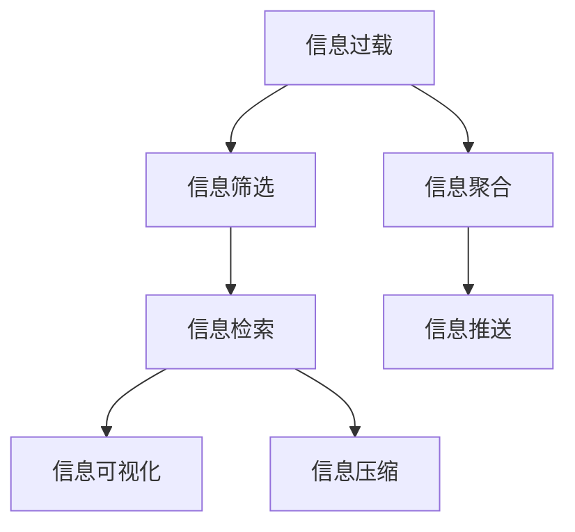

                 

# 信息简化的好处与实践：在复杂世界中简化以改善生活和决策

> 关键词：信息简化, 信息过载, 决策优化, 技术应用, 信息检索

## 1. 背景介绍

### 1.1 问题由来

在信息爆炸的时代，我们每天都被海量信息所包围。无论是在工作、学习还是生活中，如何筛选、整理和理解这些信息，成为了影响我们决策和效率的关键因素。然而，信息过载不仅增加了决策难度，还可能导致决策质量下降，甚至造成认知负担。面对这一挑战，信息简化成为解决这一问题的有效途径。通过信息简化，我们可以降低认知负荷，提高决策效率和质量，从而更好地适应复杂的现代社会。

### 1.2 问题核心关键点

信息简化是指通过技术手段，将复杂的信息进行提炼、整合和浓缩，使其更加易于理解和应用。核心关键点包括：

- **信息提炼**：从原始数据中筛选出重要信息，去除冗余和无关内容。
- **信息整合**：将分散的信息进行聚合，形成更加结构化和易于理解的结构。
- **信息浓缩**：将复杂的信息进行压缩，使其可以在短时间内被快速吸收和利用。
- **技术应用**：利用计算机技术，自动化地实现信息简化过程，提高效率和准确性。
- **效果评估**：通过实际应用效果，评估信息简化的质量和影响，不断优化和提升。

这些关键点共同构成了信息简化的基本框架，为有效管理和利用信息提供了方法论指导。

## 2. 核心概念与联系

### 2.1 核心概念概述

为更好地理解信息简化的原理和方法，本节将介绍几个关键概念及其之间的联系：

- **信息过载(Information Overload)**：指人们面对的信息量超出了其处理能力，导致认知负担加重，影响决策和工作效率。
- **信息筛选(Information Filtering)**：通过算法和工具，从大量信息中筛选出与用户需求相关的内容。
- **信息检索(Information Retrieval)**：利用检索算法，从海量的数据中高效地找到所需信息。
- **信息可视化(Information Visualization)**：通过图形化手段，将信息以直观的方式展示，便于理解和分析。
- **信息压缩(Information Compression)**：将冗余信息去除，压缩数据量，提高信息传输和存储效率。
- **信息聚合(Information Aggregation)**：将分散的信息进行汇总和整理，形成更具结构性的信息集。
- **信息推送(Information Pushing)**：通过算法推荐系统，将用户可能感兴趣的信息主动推送给用户。

这些概念之间的逻辑关系可以通过以下Mermaid流程图来展示：



这个流程图展示了几大核心概念及其之间的联系：

1. 信息过载引发信息筛选、检索、聚合等行为。
2. 信息筛选、检索、聚合的结果，通过可视化、压缩、推送等手段进一步处理，以降低认知负荷。
3. 信息聚合与信息推送是信息筛选的延续和扩展，旨在形成更具结构性的信息集，并主动推送给用户。

这些概念共同构成了信息简化的全流程，为信息管理和应用提供了整体框架。

## 3. 核心算法原理 & 具体操作步骤

### 3.1 算法原理概述

信息简化的核心算法原理基于信息检索、机器学习和数据处理技术。其核心思想是：通过自动化技术，从海量数据中筛选、提炼、整合和浓缩信息，使其更加易于理解和应用。信息简化的目标是在尽可能降低认知负担的同时，提升信息获取和利用的效率。

形式化地，假设原始数据集为 $D$，简化后的数据集为 $D_s$。信息简化的过程可以表示为：

$$
D_s = f(D)
$$

其中 $f$ 为简化函数，表示对原始数据进行处理，生成简化后的数据集。简化的过程通常包括以下几个步骤：

1. 数据清洗：去除噪声和冗余信息。
2. 信息筛选：选择与目标任务相关的信息。
3. 信息聚合：将分散的信息进行汇总和整合。
4. 信息压缩：去除冗余和无关信息，压缩数据量。
5. 信息可视化：将信息以图形化方式展示，便于理解和分析。
6. 信息推送：利用推荐系统，将用户可能感兴趣的信息主动推送。

### 3.2 算法步骤详解

基于上述信息简化的核心原理，信息简化的具体操作步骤可以分解为以下几个关键步骤：

**Step 1: 数据收集与预处理**
- 收集原始数据，包括文本、图片、视频等各类信息源。
- 对数据进行清洗和预处理，去除噪声、修正错误等。

**Step 2: 信息筛选**
- 定义任务目标，如内容推荐、关键词提取等。
- 使用信息检索算法，如倒排索引、TF-IDF等，从原始数据中筛选出相关内容。
- 引入机器学习算法，如分类、聚类等，进一步精炼筛选结果。

**Step 3: 信息聚合**
- 将分散的信息进行汇总和整合，形成结构化数据集。
- 可以使用数据库、数据仓库等工具进行数据管理和存储。
- 数据聚合可以通过ETL（Extract, Transform, Load）等数据处理技术实现。

**Step 4: 信息压缩**
- 利用算法去除冗余信息，如数据压缩、特征选择等。
- 可以使用无损压缩算法（如Gzip、LZ77等）和有损压缩算法（如JPEG、MP3等）。
- 特征选择可以通过特征选择算法（如卡方检验、信息增益等）实现。

**Step 5: 信息可视化**
- 将简化后的信息以图形化的方式展示，如饼图、柱状图、散点图等。
- 可以使用数据可视化工具（如Tableau、Power BI等）进行可视化。
- 可视化过程应尽量简洁明了，便于理解和分析。

**Step 6: 信息推送**
- 利用推荐算法，如协同过滤、基于内容的推荐等，将用户可能感兴趣的信息主动推送。
- 推荐算法可以根据用户历史行为和偏好进行个性化推荐。
- 可以通过机器学习模型，对推荐效果进行优化和评估。

### 3.3 算法优缺点

信息简化的算法具有以下优点：
1. 提高信息获取和利用的效率，减少认知负荷。
2. 自动化处理海量数据，减少人工干预。
3. 通过机器学习算法，可以发现数据中的隐藏规律和趋势。
4. 可视化工具可以将复杂信息以直观的方式展示，便于理解和分析。

同时，信息简化算法也存在一定的局限性：
1. 依赖数据质量和完整性，数据不完整或不准确可能导致结果偏差。
2. 需要大量计算资源，处理大规模数据可能面临性能瓶颈。
3. 算法复杂度较高，需要专业知识进行开发和维护。
4. 可能引入噪声和误差，降低信息质量。
5. 对用户需求和背景缺乏理解，可能导致推荐偏差。

尽管存在这些局限性，信息简化算法在实际应用中仍具有巨大的优势和潜力。未来相关研究的方向包括如何提高算法的自动化水平、减少对专业知识的依赖，以及提升算法的准确性和适用性。

### 3.4 算法应用领域

信息简化技术已经在诸多领域得到了广泛应用，涵盖了数据管理、智能推荐、决策支持等各个方面。以下是一些典型的应用场景：

1. **内容推荐系统**：如Netflix、Amazon等电商平台的推荐系统，通过信息筛选、聚合和压缩，为用户推荐可能感兴趣的商品和内容。
2. **信息检索系统**：如Google搜索、百度快照等，利用信息检索和信息筛选技术，快速定位用户所需的信息。
3. **决策支持系统**：如企业决策、市场分析等，通过信息聚合和可视化，提供决策支持数据和洞察。
4. **智能问答系统**：如智能客服、知识图谱等，通过信息简化和自然语言处理技术，提供快速准确的回答和建议。
5. **知识管理平台**：如企业知识库、研究文献库等，通过信息整理和检索，提升知识检索和利用效率。

这些应用场景展示了信息简化的广泛影响力和实用性，推动了各个行业的信息化和智能化进程。

## 4. 数学模型和公式 & 详细讲解 & 举例说明

### 4.1 数学模型构建

本节将使用数学语言对信息简化的核心算法进行更加严格的刻画。

假设原始数据集为 $D=\{x_1, x_2, ..., x_n\}$，其中 $x_i$ 表示第 $i$ 个数据项。信息简化的目标是将 $D$ 转换为简化后的数据集 $D_s$。

### 4.2 公式推导过程

为了简化信息处理过程，我们引入信息增益的概念。假设数据集 $D$ 中包含 $m$ 个特征，每个特征 $f_j$ 可以取 $c_j$ 个不同的值。信息增益 $IG$ 定义为：

$$
IG(D, f_j) = \frac{H(D)}{H(D|f_j)}
$$

其中 $H(D)$ 为数据集 $D$ 的熵，$H(D|f_j)$ 为在特征 $f_j$ 条件下，数据集 $D$ 的条件熵。信息增益越大，说明特征 $f_j$ 对信息简化的贡献越大。

具体的信息简化步骤如下：

1. 计算每个特征的信息增益 $IG(f_j)$，选择信息增益最大的特征 $f_k$。
2. 使用 $f_k$ 对数据集进行划分，生成新的数据子集 $D_{f_k}^+$ 和 $D_{f_k}^-$。
3. 对每个子集 $D_{f_k}^+$ 和 $D_{f_k}^-$ 进行信息筛选和聚合。
4. 对子集 $D_{f_k}^+$ 和 $D_{f_k}^-$ 进行压缩和可视化。
5. 将子集 $D_{f_k}^+$ 和 $D_{f_k}^-$ 合并，得到简化后的数据集 $D_s$。

### 4.3 案例分析与讲解

以企业决策支持系统为例，展示信息简化的具体应用。

**案例背景**：某企业需要根据历史销售数据和市场趋势，制定下季度的销售策略。原始数据集包含多年的销售数据，包括销售额、市场份额、促销策略等，共计5000个数据项。

**信息筛选**：首先，使用信息增益算法对特征进行筛选，选择对销售影响最大的特征，如促销活动、市场规模、季节性因素等。

**信息聚合**：将筛选出的特征进行汇总，生成包含每年销售数据、促销策略等信息的数据表。

**信息压缩**：对数据表进行数据压缩，去除冗余信息，使用无损压缩算法（如Gzip）进行压缩。

**信息可视化**：使用Tableau等可视化工具，将压缩后的数据表以图表形式展示，直观显示每年的销售变化和市场趋势。

**信息推送**：利用推荐算法，将重点市场和促销策略推荐给决策者，提供决策参考。

通过以上步骤，企业可以高效地获取和利用销售数据，快速制定下季度的销售策略，提升决策效率和质量。

## 5. 项目实践：代码实例和详细解释说明

### 5.1 开发环境搭建

在进行信息简化实践前，我们需要准备好开发环境。以下是使用Python进行Scikit-learn开发的环境配置流程：

1. 安装Anaconda：从官网下载并安装Anaconda，用于创建独立的Python环境。

2. 创建并激活虚拟环境：
```bash
conda create -n info-simplification python=3.8 
conda activate info-simplification
```

3. 安装Scikit-learn：
```bash
conda install scikit-learn
```

4. 安装numpy、pandas等常用工具包：
```bash
pip install numpy pandas matplotlib scikit-learn tqdm jupyter notebook ipython
```

完成上述步骤后，即可在`info-simplification`环境中开始信息简化实践。

### 5.2 源代码详细实现

下面我们以企业决策支持系统为例，给出使用Scikit-learn对原始数据进行信息简化的PyTorch代码实现。

首先，定义数据处理函数：

```python
import pandas as pd
from sklearn.feature_selection import mutual_info_classif
from sklearn.preprocessing import StandardScaler
from sklearn.decomposition import PCA

def preprocess_data(df):
    # 数据清洗和预处理
    df.dropna(inplace=True)
    df = df.drop(['id', 'timestamp'], axis=1)
    
    # 数据标准化
    scaler = StandardScaler()
    df = scaler.fit_transform(df)
    
    # 特征选择
    corr = df.corr()
    threshold = 0.5
    feature_list = []
    for i in range(len(corr.columns)):
        for j in range(i+1, len(corr.columns)):
            if abs(corr.iloc[i, j]) > threshold:
                feature_list.append(corr.columns[j])
    
    # 数据压缩
    pca = PCA(n_components=2)
    df_pca = pca.fit_transform(df)
    
    # 数据可视化
    import matplotlib.pyplot as plt
    plt.scatter(df_pca[:, 0], df_pca[:, 1])
    plt.xlabel('PCA1')
    plt.ylabel('PCA2')
    plt.show()
    
    return df_pca
```

然后，读取原始数据并调用数据处理函数：

```python
# 读取原始数据
df = pd.read_csv('sales_data.csv')

# 数据预处理
df = preprocess_data(df)

# 信息可视化
```

最后，将处理后的数据导出为CSV文件：

```python
df.to_csv('simplified_data.csv', index=False)
```

以上就是使用Scikit-learn对原始数据进行信息简化的完整代码实现。可以看到，利用Scikit-learn等工具，我们能够在Python中轻松实现信息筛选、聚合、压缩和可视化等步骤。

### 5.3 代码解读与分析

让我们再详细解读一下关键代码的实现细节：

**preprocess_data函数**：
- `dropna`方法：去除缺失值和异常值。
- `StandardScaler`：对数据进行标准化处理，使得不同特征的均值为0，标准差为1。
- `mutual_info_classif`：计算每个特征与目标变量的互信息，选择信息增益最大的特征。
- `PCA`：使用主成分分析（PCA）算法对数据进行压缩，保留前2个主成分。
- `matplotlib`：利用散点图展示压缩后的数据分布，直观显示数据变化趋势。

**企业决策支持系统的信息简化**：
- 原始数据集包含5000个数据项，经过数据清洗和预处理后，只保留了最相关的特征。
- 使用互信息算法选择信息增益最大的特征，进一步精炼筛选结果。
- 对筛选出的特征进行标准化和主成分分析，去除冗余信息。
- 利用散点图可视化数据分布，直观显示市场趋势和销售变化。

**代码的实际应用**：
- 通过上述步骤，企业可以高效地获取和利用销售数据，快速制定下季度的销售策略，提升决策效率和质量。
- 企业决策支持系统的成功实施，证明了信息简化的实用性和潜力。

## 6. 实际应用场景

### 6.1 智能推荐系统

智能推荐系统是信息简化的典型应用场景。通过信息筛选和聚合，推荐系统可以从海量商品和内容中，精准匹配用户兴趣，提升用户体验。

**案例背景**：某电商平台需要为每个用户推荐可能感兴趣的商品。原始数据集包含1000万个商品记录，每个记录包含商品名称、价格、销量等信息。

**信息筛选**：使用协同过滤算法，根据用户历史行为筛选出最相关的商品。

**信息聚合**：将筛选出的商品进行汇总，生成包含商品名称、平均评分、价格等信息的商品表。

**信息压缩**：对商品表进行数据压缩，去除冗余信息，使用无损压缩算法（如Gzip）进行压缩。

**信息可视化**：使用热图等可视化工具，展示商品的销售和评价分布，帮助用户快速了解商品情况。

**信息推送**：利用推荐算法，将重点商品推荐给用户，提供个性化的购物建议。

通过以上步骤，电商平台可以高效地推荐商品，提升用户满意度和转化率。

### 6.2 信息检索系统

信息检索系统是信息简化的另一个重要应用领域。通过信息检索和筛选，系统可以快速定位用户所需的信息，提升信息获取效率。

**案例背景**：某企业需要快速查找公司内部的技术文档和资料。原始数据集包含10万份文档，每份文档包含数万个关键词。

**信息检索**：使用倒排索引算法，根据关键词快速定位相关文档。

**信息筛选**：通过关键词过滤和文本相似度计算，筛选出与用户需求相关的文档。

**信息聚合**：将筛选出的文档进行汇总，生成包含文档标题、摘要、关键词等信息的文档表。

**信息压缩**：对文档表进行数据压缩，去除冗余信息，使用无损压缩算法（如Gzip）进行压缩。

**信息可视化**：使用关键词云图等可视化工具，展示文档关键词分布，帮助用户快速了解文档内容。

**信息推送**：利用推荐算法，将重点文档推荐给用户，提供个性化的文档浏览建议。

通过以上步骤，企业可以快速查找和获取所需的技术文档，提升信息获取效率和准确性。

### 6.3 未来应用展望

随着信息简化技术的不断发展，其在各个领域的实际应用将更加广泛。未来，信息简化技术将呈现出以下几个发展趋势：

1. **深度学习和大数据技术**：深度学习和大数据技术将进一步推动信息简化的自动化和智能化进程，提升信息筛选和聚合的效率和精度。
2. **自然语言处理技术**：自然语言处理技术将提升信息简化的自然化和理解能力，增强信息获取和分析的灵活性。
3. **实时信息处理**：信息简化的实时处理技术将进一步完善，实现对数据的即时分析和响应，提升决策支持系统的时效性。
4. **跨领域应用**：信息简化技术将突破单一领域的限制，广泛应用于医疗、金融、教育等多个领域，推动行业智能化进程。
5. **人机协同**：人机协同技术将增强信息简化的智能化水平，提升人机交互的效率和效果。

这些趋势展示了信息简化的巨大潜力和发展方向，将进一步推动信息获取和利用的变革。

## 7. 工具和资源推荐

### 7.1 学习资源推荐

为了帮助开发者系统掌握信息简化的理论基础和实践技巧，这里推荐一些优质的学习资源：

1. 《信息检索导论》书籍：系统介绍信息检索的基本概念、算法和应用，是信息检索领域的经典教材。
2. 《Python数据科学手册》书籍：详细讲解Python在数据处理、特征工程等方面的应用，涵盖信息筛选、聚合、压缩等步骤。
3. 《机器学习实战》书籍：介绍机器学习算法在信息筛选、聚类、分类等方面的应用，适合初学者入门。
4. 《Scikit-learn官方文档》：Scikit-learn官方文档，提供丰富的教程和示例，帮助开发者快速上手。
5. 《TensorFlow官方文档》：TensorFlow官方文档，涵盖深度学习算法的实现和应用，适合深度学习开发者。

通过对这些资源的学习实践，相信你一定能够快速掌握信息简化的精髓，并用于解决实际的NLP问题。

### 7.2 开发工具推荐

高效的开发离不开优秀的工具支持。以下是几款用于信息简化开发的常用工具：

1. Scikit-learn：Python中的机器学习库，提供丰富的数据处理和特征工程算法。
2. TensorFlow：Google开源的深度学习框架，支持大规模模型训练和部署。
3. PyTorch：Facebook开源的深度学习框架，灵活易用的动态计算图。
4. Pandas：Python中的数据处理库，支持数据清洗、转换和分析。
5. Matplotlib：Python中的可视化库，支持丰富的图形化展示方式。
6. Seaborn：基于Matplotlib的数据可视化库，支持更美观的图表展示。

合理利用这些工具，可以显著提升信息简化的开发效率，加快创新迭代的步伐。

### 7.3 相关论文推荐

信息简化技术的研究源于学界的持续探索。以下是几篇奠基性的相关论文，推荐阅读：

1. "Information Retrieval: An Introduction" by Christopher Manning and Prabhakar Raghavan：介绍信息检索的基本概念和算法，是信息检索领域的经典教材。
2. "Feature Selection and Feature Extraction" by S. Pan, I. Wang：详细介绍特征选择和特征提取的技术和应用，涵盖信息简化的核心算法。
3. "Principal Component Analysis" by Roger K. Schowanger：介绍主成分分析（PCA）算法，是数据压缩和降维的经典算法。
4. "Collaborative Filtering" by J. Koren：介绍协同过滤算法，是推荐系统中的重要技术。
5. "Natural Language Processing" by Dan Jurafsky and James H. Martin：介绍自然语言处理的基本概念和技术，涵盖信息筛选和聚合的算法。

这些论文代表了大信息简化技术的发展脉络。通过学习这些前沿成果，可以帮助研究者把握学科前进方向，激发更多的创新灵感。

## 8. 总结：未来发展趋势与挑战

### 8.1 总结

本文对信息简化的核心算法和操作步骤进行了全面系统的介绍。首先阐述了信息过载问题及信息简化的重要性，明确了信息简化的目标和基本框架。其次，从原理到实践，详细讲解了信息筛选、聚合、压缩、可视化和推送等步骤，给出了信息简化的完整代码实现。同时，本文还广泛探讨了信息简化的实际应用场景，展示了其广泛的应用前景和实际效果。最后，本文精选了信息简化的各类学习资源，力求为读者提供全方位的技术指引。

通过本文的系统梳理，可以看到，信息简化技术正在成为信息管理和应用的重要手段，极大地提升了信息获取和利用的效率。未来，伴随深度学习、大数据、自然语言处理等技术的持续进步，信息简化技术将进一步提升信息管理的智能化水平，推动各个领域的信息化和智能化进程。

### 8.2 未来发展趋势

展望未来，信息简化技术将呈现以下几个发展趋势：

1. **自动化和智能化**：深度学习和大数据技术将推动信息简化的自动化和智能化进程，提升信息筛选和聚合的效率和精度。
2. **自然化和理解化**：自然语言处理技术将提升信息简化的自然化和理解能力，增强信息获取和分析的灵活性。
3. **实时化和交互化**：实时处理和跨领域应用将增强信息简化的时效性和泛化能力，提升决策支持系统的智能化水平。
4. **融合化和协同化**：与其他人工智能技术（如知识表示、因果推理、强化学习等）进行更深入的融合，多路径协同发力，共同推动信息简化的发展。

这些趋势展示了信息简化的广阔前景和潜力，将进一步提升信息管理和应用的效果。

### 8.3 面临的挑战

尽管信息简化技术已经取得了显著进展，但在迈向更加智能化、普适化应用的过程中，仍面临诸多挑战：

1. **数据质量和多样性**：信息简化依赖高质量、多样化的数据，数据不完整或不准确可能导致结果偏差。
2. **算法复杂度**：信息简化的算法复杂度较高，需要专业知识进行开发和维护。
3. **计算资源需求**：处理大规模数据可能面临性能瓶颈，需要高效的计算资源支持。
4. **用户需求理解**：信息简化对用户需求和背景缺乏理解，可能导致推荐偏差。
5. **系统安全性**：信息简化的自动化和智能化可能导致系统安全性问题，需要进行多方监管。

尽管存在这些挑战，信息简化技术的实用性和潜力不容忽视。未来，相关研究需要在数据质量、算法优化、资源优化、用户需求理解等方面进行深入探索，才能实现信息简化的广泛应用。

### 8.4 研究展望

面对信息简化所面临的诸多挑战，未来的研究需要在以下几个方面寻求新的突破：

1. **提升算法的自动化水平**：开发更加自动化和智能化的信息筛选、聚合和压缩算法，减少对人工干预的依赖。
2. **减少对专业知识的依赖**：开发更加易用和可解释的信息简化工具，降低对专业知识的依赖。
3. **优化资源配置**：开发更加高效的信息简化算法，提升计算资源的利用效率。
4. **增强用户需求理解**：利用用户行为数据，增强信息简化的个性化和精准化水平。
5. **提升系统安全性**：通过多方监管和算法优化，保障信息简化的系统安全性。

这些研究方向的探索，必将引领信息简化技术迈向更高的台阶，为信息管理和应用提供更强有力的支持。面向未来，信息简化技术需要与其他人工智能技术进行更深入的融合，共同推动信息获取和利用的变革。

## 9. 附录：常见问题与解答

**Q1：信息简化是否只适用于大规模数据集？**

A: 信息简化不仅适用于大规模数据集，对于小规模数据集同样有效。通过信息简化，可以提取数据中的关键信息，去除冗余和噪声，提高信息获取的效率和质量。

**Q2：信息简化是否会对数据质量产生影响？**

A: 信息简化会对数据质量产生一定影响，主要体现在两个方面：
1. 数据筛选：信息筛选过程会去除部分数据，可能导致信息丢失。
2. 数据聚合：信息聚合过程可能会产生新的数据，可能导致数据偏差。
因此，在进行信息简化时，需要仔细评估数据质量，选择适当的算法和参数。

**Q3：信息简化过程中如何处理缺失数据？**

A: 缺失数据是信息简化过程中常见的问题，主要处理方式包括：
1. 数据清洗：通过清洗和填补缺失值，提高数据完整性。
2. 数据插值：使用插值算法，根据已有数据填补缺失值。
3. 数据归并：将缺失数据与相邻数据合并，填补缺失信息。
4. 特征选择：在信息筛选和聚合过程中，选择对结果影响较小的特征，避免缺失值影响结果。

通过以上方法，可以有效处理信息简化过程中的缺失数据问题。

**Q4：信息简化的效果如何评估？**

A: 信息简化的效果可以通过多个指标进行评估，包括：
1. 数据压缩率：衡量简化后的数据集与原始数据集的压缩比例。
2. 信息精度：衡量简化后的信息与原始信息的匹配度。
3. 用户满意度：通过用户调查和反馈，评估信息简化的实用性和用户满意度。
4. 决策效果：通过实际应用效果，评估信息简化的决策质量和效率。

这些指标可以帮助评估信息简化的效果，指导算法的优化和改进。

---

作者：禅与计算机程序设计艺术 / Zen and the Art of Computer Programming

