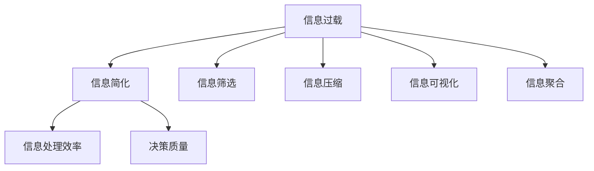

                 

# 信息简化的好处与实践：在复杂世界中简化以改善生活和决策

## 1. 背景介绍

### 1.1 问题由来

在现代信息爆炸的时代，我们被各类信息所包围，从电子邮件、社交媒体、新闻到网页、文档、报告等，信息量呈指数级增长。这无疑给我们的生活、工作、学习和决策带来了巨大的挑战。如何在海量信息中迅速识别有用信息，筛选并整合关键信息，做出明智决策，成为迫切需要解决的问题。

### 1.2 问题核心关键点

信息简化，即在处理复杂信息时，通过聚焦关键信息、去除冗余和噪声，从而提高信息处理效率和决策准确性。它的核心在于识别和强调最重要、最有用的信息，并将其提炼、浓缩和清晰呈现，避免因信息过载导致的认知负担和决策失误。

### 1.3 问题研究意义

信息简化不仅能帮助我们有效管理海量信息，提升信息处理效率，还能在复杂多变的社会和经济环境中做出更加精准、合理的决策，助力个人和组织的成功。它还可以提升用户体验，优化产品和服务，推动技术创新，从而促进社会的整体发展和进步。

## 2. 核心概念与联系

### 2.1 核心概念概述

为更好地理解信息简化的原理和方法，本节将介绍几个密切相关的核心概念：

- **信息简化**：从复杂的信息中提炼关键要点，去除冗余和噪声，提升信息处理效率和决策质量。
- **信息过载**：当信息量超出处理能力，导致认知负荷过大，影响信息处理和决策质量的现象。
- **信息筛选**：通过设置过滤条件，自动或手动筛选出与特定需求相关的信息，聚焦关键内容。
- **信息压缩**：将信息转化为更短、更精炼的形式，便于存储、传输和检索。
- **信息可视化**：利用图表、图形等视觉手段，将复杂信息直观展现，便于理解和决策。
- **信息聚合**：将不同来源的信息汇总，形成综合性的知识库，辅助深入分析和决策。

这些核心概念之间的逻辑关系可以通过以下Mermaid流程图来展示：



这个流程图展示的信息简化核心概念及其之间的关系：

1. 信息过载是信息简化的原因。
2. 信息简化包括信息筛选、压缩、可视化和聚合等多种手段。
3. 信息简化可以显著提升信息处理效率和决策质量。

## 3. 核心算法原理 & 具体操作步骤

### 3.1 算法原理概述

信息简化技术主要包括信息筛选、压缩、可视化和聚合等核心步骤。它们利用不同的算法和技术手段，旨在从复杂的信息海洋中提炼关键要素，并形成易于理解和使用的形式。

### 3.2 算法步骤详解

#### 3.2.1 信息筛选

信息筛选通常采用以下步骤：

1. **定义筛选标准**：确定筛选条件，如时间、重要性、相关性等。
2. **数据预处理**：清洗、去重、归一化等处理步骤，准备数据输入。
3. **筛选算法应用**：应用规则、算法或模型对数据进行筛选，如关键词匹配、文本相似度分析、机器学习分类等。
4. **结果评估与优化**：评估筛选结果，通过反馈迭代优化筛选算法。

#### 3.2.2 信息压缩

信息压缩的目的是将复杂的信息转化成更短、更精炼的形式。常用的压缩算法包括：

1. **文本压缩**：如LZW算法、Huffman编码等。
2. **图像压缩**：如JPEG、PNG等。
3. **视频压缩**：如H.264、H.265等。
4. **音频压缩**：如MP3、AAC等。

#### 3.2.3 信息可视化

信息可视化是将复杂信息以图形、图表等直观形式展示的技术，常用的技术包括：

1. **数据图表**：如柱状图、折线图、散点图等。
2. **地图**：地理信息展示，如热力图、轨迹图等。
3. **交互式图表**：如D3.js、Tableau等工具生成的交互式图形。
4. **数据仪表盘**：如Power BI、Tableau等工具生成的综合仪表盘。

#### 3.2.4 信息聚合

信息聚合是将不同来源、不同格式的信息汇总，形成综合性的知识库，常用的方法包括：

1. **数据融合**：将不同数据源的信息整合，形成统一的数据集。
2. **数据挖掘**：从大量数据中挖掘出有价值的信息和模式。
3. **数据仓库**：使用数据库技术存储和查询聚合数据。
4. **数据仪表板**：综合展示聚合数据，便于分析和决策。

### 3.3 算法优缺点

信息简化技术具有以下优点：

1. **提升信息处理效率**：通过筛选、压缩、可视化和聚合等技术，快速识别关键信息，减少信息过载。
2. **增强决策质量**：聚焦关键信息，避免因信息过载导致的认知负担和决策失误。
3. **提高用户体验**：通过信息可视化，使信息更易于理解和使用，提升用户体验。
4. **优化产品和服务**：整合信息聚合和可视化技术，提供更全面、更准确的产品和服务。

同时，该技术也存在一定的局限性：

1. **依赖人工干预**：信息筛选和压缩等步骤需要人工参与，效率较低。
2. **复杂信息处理**：对于复杂的多模态信息，如文本、图像、音频等，处理难度较大。
3. **数据质量和隐私问题**：筛选和聚合信息时，需要保证数据的质量和隐私安全。
4. **技术门槛较高**：实现信息简化涉及多种技术，需要一定的技术储备和实践经验。

尽管存在这些局限性，但信息简化技术在信息管理和决策支持方面发挥着重要作用，其应用前景广阔。

### 3.4 算法应用领域

信息简化技术广泛应用于各个领域，包括但不限于：

- **商业智能(BI)**：通过信息筛选、聚合和可视化，帮助企业做出决策。
- **金融分析**：对财务数据进行压缩和聚合，提升市场分析和风险评估能力。
- **医疗健康**：整合患者数据，提供个性化医疗服务。
- **政府决策**：综合各类社会和经济数据，辅助政策制定。
- **教育培训**：筛选和压缩教育资源，提升教学效果。
- **媒体新闻**：提炼关键信息，制作新闻摘要和标题。
- **科学研究**：整合和可视化数据，支持科学研究和发现。

## 4. 数学模型和公式 & 详细讲解 & 举例说明

### 4.1 数学模型构建

在信息简化过程中，数学模型和算法起到了至关重要的作用。以下是一个基本的数学模型框架，用于信息筛选和压缩。

假设我们有一组信息数据集 $D=\{x_1, x_2, ..., x_n\}$，其中每个信息 $x_i$ 由特征向量 $f_i=(f_{i1}, f_{i2}, ..., f_{in})$ 表示。我们定义一个权重向量 $w=(w_1, w_2, ..., w_n)$，表示每个特征的重要性。

### 4.2 公式推导过程

根据上述假设，信息简化问题可以转化为一个线性优化问题：

$$
\min_{w} \sum_{i=1}^n w_i \cdot f_{i1}^2
$$

其中，$f_{i1}^2$ 为信息 $x_i$ 的特征向量中第1个特征的平方，表示其重要程度。通过求解该优化问题，可以得到每个特征的权重 $w_i$。

通过矩阵形式，上述优化问题可以表示为：

$$
\min_{w} \frac{1}{2} \mathbf{w}^T \mathbf{A} \mathbf{w}
$$

其中，$\mathbf{A}$ 为特征重要性的协方差矩阵，$\mathbf{w}$ 为权重向量。

求解上述问题，可以通过求解线性回归方程：

$$
\mathbf{w} = (\mathbf{A}^T \mathbf{A})^{-1} \mathbf{A}^T \mathbf{y}
$$

其中，$\mathbf{y}$ 为信息数据的特征向量。

### 4.3 案例分析与讲解

假设我们有一组股票市场数据，包含日期、开盘价、收盘价、成交量等特征。我们希望筛选出最重要的特征，并用于预测股票价格变化。

使用上述数学模型，我们可以计算每个特征的权重，得到最重要的特征，如开盘价和成交量。接着，使用文本压缩算法，将数据集压缩到更短的形式，便于存储和传输。最后，使用信息可视化技术，将压缩后的数据转换为图表形式，便于观察和分析。

## 5. 项目实践：代码实例和详细解释说明

### 5.1 开发环境搭建

在进行信息简化实践前，我们需要准备好开发环境。以下是使用Python进行Scikit-learn开发的环境配置流程：

1. 安装Anaconda：从官网下载并安装Anaconda，用于创建独立的Python环境。

2. 创建并激活虚拟环境：
```bash
conda create -n scikit-env python=3.8 
conda activate scikit-env
```

3. 安装Scikit-learn：
```bash
conda install scikit-learn
```

4. 安装其他依赖库：
```bash
pip install numpy pandas matplotlib seaborn
```

完成上述步骤后，即可在`scikit-env`环境中开始信息简化实践。

### 5.2 源代码详细实现

以下是一个使用Scikit-learn进行信息筛选和可视化的Python代码示例：

```python
import numpy as np
import pandas as pd
import matplotlib.pyplot as plt
from sklearn.decomposition import PCA
from sklearn.preprocessing import StandardScaler

# 创建数据集
data = pd.DataFrame({
    'date': ['2021-01-01', '2021-01-02', '2021-01-03', '2021-01-04', '2021-01-05'],
    'open_price': [100, 110, 120, 130, 140],
    'close_price': [110, 115, 125, 135, 145],
    'volume': [1000, 2000, 3000, 4000, 5000]
})

# 将日期转换为数值
data['date'] = pd.to_datetime(data['date']).astype(int) // 10**9

# 标准化处理
scaler = StandardScaler()
data_scaled = scaler.fit_transform(data[['open_price', 'close_price', 'volume']])

# 使用PCA进行降维
pca = PCA(n_components=2)
data_pca = pca.fit_transform(data_scaled)

# 可视化结果
plt.figure(figsize=(8, 6))
plt.scatter(data_pca[:, 0], data_pca[:, 1], c=data['open_price'], cmap='coolwarm')
plt.xlabel('PC1')
plt.ylabel('PC2')
plt.title('PCA for Stock Price Prediction')
plt.show()
```

### 5.3 代码解读与分析

让我们再详细解读一下关键代码的实现细节：

**创建数据集**：
- 创建包含日期、开盘价、收盘价和成交量的数据集，用Pandas库进行数据处理。

**日期转换**：
- 将日期字符串转换为数值型，便于机器学习模型的处理。

**标准化处理**：
- 使用Scikit-learn的StandardScaler进行特征标准化，避免因特征量级差异导致的影响。

**PCA降维**：
- 使用PCA算法对数据进行降维，减少特征维度，便于后续可视化。

**可视化结果**：
- 使用Matplotlib库将降维后的数据可视化，直观展示信息的结构。

通过以上代码示例，我们可以看到，信息简化不仅仅是数据处理和算法应用，还包括数据可视化等环节，可以显著提升信息的可读性和决策的准确性。

## 6. 实际应用场景

### 6.1 商业智能(BI)

商业智能领域广泛应用信息简化技术，帮助企业快速洞察业务趋势，做出精准决策。例如，通过数据筛选和聚合，BI系统可以快速生成各种报表和仪表盘，辅助管理层进行战略规划和业务优化。

### 6.2 金融分析

金融分析师在分析市场数据时，常常面临信息过载问题。利用信息简化技术，可以从大量历史和实时数据中提取关键特征，生成模型输入，提升预测准确性和交易效率。例如，通过PCA算法对高维股票数据进行降维，可以生成更易于理解的特征，辅助金融决策。

### 6.3 医疗健康

在医疗领域，信息简化技术用于整合患者数据、医疗记录等，提升医疗服务质量。例如，通过文本挖掘和可视化，医生可以快速了解患者的病史和治疗记录，制定更全面的诊疗方案。

### 6.4 政府决策

政府在制定政策时，需要综合分析大量社会和经济数据。信息简化技术可以帮助快速筛选和聚合数据，生成可视化报表，支持决策过程。例如，通过地图和图表，政府可以直观展示各种统计数据，辅助制定区域发展战略。

## 7. 工具和资源推荐

### 7.1 学习资源推荐

为了帮助开发者系统掌握信息简化的理论基础和实践技巧，这里推荐一些优质的学习资源：

1. **《Python数据科学手册》**：由数据科学专家撰写，全面介绍了Python数据处理、可视化、机器学习等技术，适合初学者入门。

2. **《数据科学实战》**：由Kaggle竞赛冠军撰写，涵盖数据清洗、特征工程、模型选择等实战经验，适合进阶学习。

3. **Coursera《数据科学基础》**：由斯坦福大学开设的入门课程，介绍了数据处理、统计分析、机器学习等基本概念和工具，适合零基础学习者。

4. **Udacity《深度学习》**：由深度学习专家撰写，涵盖深度学习模型、算法和应用，适合对深度学习感兴趣的学习者。

5. **《信息可视化》**：由可视化专家撰写，全面介绍了信息可视化的原理、工具和应用，适合需要掌握信息可视化技术的学习者。

通过对这些资源的学习实践，相信你一定能够快速掌握信息简化的精髓，并用于解决实际的信息处理和决策问题。

### 7.2 开发工具推荐

高效的开发离不开优秀的工具支持。以下是几款用于信息简化开发的常用工具：

1. **Python**：作为数据科学和机器学习的主流语言，Python拥有丰富的数据处理和分析库，如Pandas、NumPy、Scikit-learn等，适合数据处理和算法实现。

2. **R语言**：作为数据科学和统计分析的主流语言，R拥有强大的数据处理和统计分析功能，如ggplot2、dplyr等，适合数据可视化和分析。

3. **Tableau**：商业智能领域广泛使用的数据可视化工具，支持拖拽式操作，快速生成报表和仪表盘。

4. **Power BI**：微软推出的商业智能工具，支持大规模数据处理和可视化，适合企业级应用。

5. **Matplotlib**：Python的数据可视化库，支持多种图表类型，适合自定义可视化需求。

6. **D3.js**：JavaScript数据可视化库，支持动态交互式图表，适合Web应用和移动端。

合理利用这些工具，可以显著提升信息简化的开发效率，加快创新迭代的步伐。

### 7.3 相关论文推荐

信息简化技术的发展源于学界的持续研究。以下是几篇奠基性的相关论文，推荐阅读：

1. **《信息过滤: 理论与技术》**：介绍了信息过滤的基本原理和算法，包括文本分类、协同过滤等方法。

2. **《信息抽取与理解》**：介绍了信息抽取和理解的原理和方法，涵盖文本挖掘、知识图谱等技术。

3. **《数据压缩算法》**：详细介绍了各种数据压缩算法，如LZW、Huffman、Lempel-Ziv-Welch等。

4. **《信息可视化》**：介绍了信息可视化的基本原理和工具，涵盖图形、图表、地图等技术。

5. **《机器学习在信息筛选中的应用》**：介绍了机器学习在信息筛选中的方法，包括特征选择、分类、聚类等技术。

这些论文代表了大数据处理和信息简化的前沿成果，通过学习这些前沿研究成果，可以帮助研究者把握学科前进方向，激发更多的创新灵感。

## 8. 总结：未来发展趋势与挑战

### 8.1 总结

本文对信息简化的原理和实践进行了全面系统的介绍。首先阐述了信息过载的问题由来，明确了信息简化的重要性。其次，从原理到实践，详细讲解了信息筛选、压缩、可视化和聚合等关键步骤，给出了信息简化的完整代码实现。同时，本文还广泛探讨了信息简化技术在商业智能、金融分析、医疗健康、政府决策等领域的广泛应用，展示了信息简化技术的巨大潜力。最后，本文精选了信息简化的各类学习资源和开发工具，力求为读者提供全方位的技术指引。

通过本文的系统梳理，可以看到，信息简化技术在处理海量信息、提升决策质量等方面发挥着重要作用。它不仅帮助个体提升信息处理能力，还推动了商业、金融、医疗、政府等领域的发展进步。未来，伴随技术的发展和应用的深化，信息简化技术将有更广阔的应用前景。

### 8.2 未来发展趋势

展望未来，信息简化技术将呈现以下几个发展趋势：

1. **自动化和智能化**：随着机器学习和大数据技术的发展，信息筛选、压缩和可视化的自动化水平将不断提高，智能化程度也将不断提升。

2. **多模态信息处理**：信息简化技术将越来越多地应用于多模态数据处理，如图像、音频、视频等多模态信息的融合和可视化。

3. **跨领域应用**：信息简化技术将在更多领域得到应用，如智慧城市、智能家居、智能交通等，提升这些领域的智能化水平。

4. **信息安全**：信息简化的过程中，将更加注重数据隐私和安全，通过加密、去标识化等手段，保障数据安全。

5. **人机协同**：信息简化的过程中，将更多地利用人类的智慧和经验，进行人工干预和审核，提升系统的可靠性和安全性。

以上趋势凸显了信息简化技术的广阔前景。这些方向的探索发展，必将进一步提升信息处理的效率和决策的准确性，为社会和经济的发展提供有力支持。

### 8.3 面临的挑战

尽管信息简化技术已经取得了显著成果，但在迈向更加智能化、普适化应用的过程中，仍面临诸多挑战：

1. **数据质量和多样性**：信息简化的过程中，需要保证数据的质量和多样性，避免因数据偏差导致的误导。

2. **技术复杂性和门槛**：信息简化的过程中，涉及多种技术和算法，需要较高的技术储备和实践经验。

3. **隐私和安全问题**：信息简化的过程中，需要保证数据的隐私和安全，避免因信息泄露或滥用导致的风险。

4. **系统可靠性和鲁棒性**：信息简化的过程中，需要保证系统的可靠性和鲁棒性，避免因系统故障或攻击导致的误导。

5. **成本和资源消耗**：信息简化的过程中，需要大量的计算资源和存储资源，成本较高。

正视信息简化面临的这些挑战，积极应对并寻求突破，将是大数据处理和信息简化技术的未来发展方向。

### 8.4 研究展望

未来的研究需要在以下几个方面寻求新的突破：

1. **自动化和智能化**：开发更加自动化的信息筛选和可视化工具，减少人工干预，提升效率和准确性。

2. **多模态信息处理**：研究多模态信息融合的算法和技术，提升信息简化的多模态处理能力。

3. **跨领域应用**：研究信息简化在跨领域应用中的技术，提升其在智慧城市、智能家居、智能交通等领域的应用效果。

4. **信息安全**：研究数据隐私和安全保护技术，保障信息简化的过程中数据的隐私和安全。

5. **系统可靠性和鲁棒性**：研究信息简化的系统优化技术，提升系统的可靠性和鲁棒性。

6. **成本和资源消耗**：研究高效的信息处理和存储技术，降低信息简化的成本和资源消耗。

这些研究方向的前景广阔，需要学界和产业界的共同努力，推动信息简化技术的不断进步。

## 9. 附录：常见问题与解答

**Q1：信息简化是否适用于所有信息处理场景？**

A: 信息简化技术适用于大部分信息处理场景，特别是在信息过载和数据量较大的情况下。但对于一些特定场景，如实时动态数据、传感器数据等，需要结合其他技术手段进行综合处理。

**Q2：如何选择合适的信息简化算法？**

A: 选择信息简化算法需要考虑数据类型、数据量、应用场景等多个因素。一般来说，对于文本数据，可以使用TF-IDF、LDA等文本处理算法；对于图像和视频数据，可以使用PCA、HOG等算法；对于数值数据，可以使用PCA、PCA+LDA等算法。

**Q3：信息简化的过程中如何平衡数据质量和效率？**

A: 信息简化的过程中，需要平衡数据质量和效率，一般采用以下策略：
1. 数据清洗和预处理，保证数据质量。
2. 选择合适的信息简化算法，提升简化效率。
3. 进行参数调优和模型优化，提升简化效果。

**Q4：信息简化的过程中如何处理噪声和异常值？**

A: 信息简化的过程中，噪声和异常值会严重影响结果。一般采用以下策略：
1. 进行数据清洗和预处理，去除噪声和异常值。
2. 使用鲁棒性较强的算法，如 robust PCA、t-SNE 等。
3. 结合人工干预，进行二次筛选和校验。

**Q5：信息简化的过程中如何保证数据的隐私和安全？**

A: 信息简化的过程中，需要保证数据的隐私和安全，一般采用以下策略：
1. 对数据进行去标识化处理，去除敏感信息。
2. 使用加密技术，对数据进行加密保护。
3. 对系统进行安全防护，防止攻击和数据泄露。

这些问题的解答，有助于更好地理解信息简化的应用场景和实现细节，推动信息简化技术的不断发展。

---

作者：禅与计算机程序设计艺术 / Zen and the Art of Computer Programming

