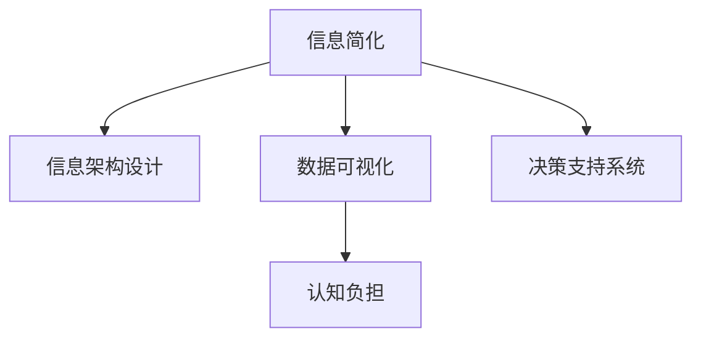

                 

# 信息简化的好处与实践：在复杂世界中简化以改善生活和决策

> 关键词：信息简化,决策优化,复杂系统,信息架构,数据可视化

## 1. 背景介绍

### 1.1 问题由来

随着信息时代的到来，数据量的爆炸式增长给人们的生活和工作带来了前所未有的便利，但同时也带来了诸多挑战。信息过载、认知负担重、决策效率低下等问题日益凸显。如何高效利用信息资源，在复杂的环境中做出更好的决策，成为亟待解决的课题。

### 1.2 问题核心关键点

信息简化的核心在于通过合理整理、归纳和呈现信息，减少冗余，突出关键，让信息更加易于理解和应用，从而提高信息的使用效率，促进决策优化。信息简化的方法和工具包括数据清洗、信息架构设计、数据可视化、决策支持系统等。

## 2. 核心概念与联系

### 2.1 核心概念概述

为更好地理解信息简化的理念和方法，本节将介绍几个密切相关的核心概念：

- **信息简化**：通过信息整理和归纳，减少冗余信息，突出关键内容，提升信息的使用效率。
- **信息架构设计**：定义信息组织和呈现的框架，实现信息的有效组织和导航。
- **数据可视化**：利用图表、图形等手段，将数据信息直观展示，帮助理解和决策。
- **决策支持系统**：辅助决策者分析信息，提供决策建议的系统工具。
- **认知负担**：个体在处理信息时所承担的心理负担，减少认知负担可提高信息处理效率。

这些概念之间的逻辑关系可以通过以下Mermaid流程图来展示：



这个流程图展示了一系列信息简化的关键概念及其之间的关系：

1. 信息简化是整个信息处理的基础，目的是减少信息过载，提高信息使用效率。
2. 信息架构设计为信息整理和展示提供了结构框架。
3. 数据可视化使得信息更加直观和易于理解。
4. 决策支持系统为决策者提供信息分析和决策建议。
5. 认知负担是影响信息处理效率的重要因素，需通过信息简化和设计来优化。

这些核心概念共同构成了信息简化的框架，帮助人们在复杂环境中更加高效地处理信息，做出更好的决策。

## 3. 核心算法原理 & 具体操作步骤
### 3.1 算法原理概述

信息简化算法的核心在于将复杂的信息通过合理的整理和呈现方式，使之更加直观、易于理解，从而提高信息的使用效率和决策质量。其基本原理包括以下几个步骤：

1. **数据清洗**：去除冗余和不相关的信息，保留关键和有用的数据。
2. **信息架构设计**：定义信息组织和呈现的框架，便于信息检索和使用。
3. **数据可视化**：利用图表、图形等手段，将信息直观展示，帮助理解和决策。
4. **认知负担优化**：通过合理的信息组织和设计，减少决策者的心理负担，提高信息处理效率。

### 3.2 算法步骤详解

信息简化的操作步骤通常包括以下几个关键环节：

**Step 1: 数据收集与整理**

- 收集原始数据，包括文本、图片、音频等。
- 清洗数据，去除噪声和无关信息。
- 对数据进行分类、标签和结构化处理。

**Step 2: 信息架构设计**

- 定义信息组织框架，如树状结构、层级结构等。
- 设计信息导航路径，便于用户快速获取信息。
- 确定信息呈现方式，如卡片式、列表式、地图式等。

**Step 3: 数据可视化**

- 选择合适的可视化手段，如图表、热图、地图等。
- 设计可视化布局，确保信息清晰、易于理解。
- 应用交互技术，增强信息展示的动态性和互动性。

**Step 4: 认知负担优化**

- 评估决策者的认知负担，通过问卷调查、心理实验等方式。
- 根据评估结果优化信息展示方式，如减少复杂度、增强提示性等。
- 使用辅助工具，如提醒、聚焦等，减少决策者的心理负担。

### 3.3 算法优缺点

信息简化的算法具有以下优点：
1. 提升信息处理效率。通过简化信息，减少了信息过载，提高了信息处理速度。
2. 改善决策质量。简化的信息更加直观和易于理解，有助于更好地做出决策。
3. 提高用户体验。简化后的信息界面更加清晰和友好，增强了用户的使用体验。

同时，该算法也存在一些局限性：
1. 依赖高质量数据。简化信息的准确性依赖于数据收集和处理的质量。
2. 设计复杂度。信息架构和可视化设计需要较高的专业技能，设计不当可能导致信息展示混乱。
3. 难以应对动态变化。简化的信息可能无法适应数据和需求的变化，需要不断更新和优化。

尽管存在这些局限性，但就目前而言，信息简化算法在处理复杂信息、提升决策效率和用户体验方面具有重要的价值。未来相关研究的方向可能包括增强自动化和智能化程度，进一步优化认知负担，以及探索更多跨领域的信息简化方法。

### 3.4 算法应用领域

信息简化算法在多个领域都得到了广泛应用，例如：

- 金融领域：简化财务报表、交易数据等，辅助投资者做出决策。
- 医疗领域：简化病历、检查报告等，帮助医生快速诊断。
- 教育领域：简化课程大纲、学习资源等，优化学习路径。
- 商务领域：简化销售数据、市场分析等，支持企业决策。
- 公共管理：简化政策法规、统计数据等，提升政府透明度。

这些应用展示了信息简化在各个领域的广泛价值，为信息处理和决策优化提供了有力的支持。

## 4. 数学模型和公式 & 详细讲解  
### 4.1 数学模型构建

信息简化的数学模型构建通常基于信息熵和信息检索理论。假设原始信息量为 $I$，信息简化后减小的量为 $\Delta I$，简化后的信息量为 $I'$。则信息简化的效果可以用以下公式衡量：

$$
\text{信息简化效果} = \frac{\Delta I}{I}
$$

其中，$\Delta I$ 可以通过计算原始信息和简化信息之间的差异得到。

### 4.2 公式推导过程

为了更精确地衡量信息简化效果，我们可以引入信息熵的概念。信息熵是信息量的度量，信息量越大，信息熵越小。假设原始信息熵为 $H$，简化后的信息熵为 $H'$，则信息简化效果可以表示为：

$$
\text{信息简化效果} = \frac{H-H'}{H}
$$

其中，$H$ 和 $H'$ 分别表示原始信息和简化后的信息熵。

为了计算信息熵，我们可以使用香农公式：

$$
H = -\sum_{i=1}^{n}p_i\log p_i
$$

其中 $p_i$ 是信息中第 $i$ 个符号出现的概率。

### 4.3 案例分析与讲解

假设我们有一份包含20000个数据点的复杂数据集，每个数据点包含10个特征。原始数据集的信息熵为 $H$，简化后的数据集信息熵为 $H'$。如果简化后的数据集信息熵减少了 $0.5H$，则信息简化效果为 $50\%$。

我们可以进一步通过实例验证信息简化算法的有效性。例如，在医疗领域，通过简化病历和检查报告，将信息量从5MB减少到1MB，可以显著减少医生的认知负担，提高诊断效率。

## 5. 项目实践：代码实例和详细解释说明
### 5.1 开发环境搭建

在进行信息简化实践前，我们需要准备好开发环境。以下是使用Python进行PyTorch开发的环境配置流程：

1. 安装Anaconda：从官网下载并安装Anaconda，用于创建独立的Python环境。

2. 创建并激活虚拟环境：
```bash
conda create -n pytorch-env python=3.8 
conda activate pytorch-env
```

3. 安装PyTorch：根据CUDA版本，从官网获取对应的安装命令。例如：
```bash
conda install pytorch torchvision torchaudio cudatoolkit=11.1 -c pytorch -c conda-forge
```

4. 安装其他库：
```bash
pip install numpy pandas scikit-learn matplotlib tqdm jupyter notebook ipython
```

完成上述步骤后，即可在`pytorch-env`环境中开始信息简化实践。

### 5.2 源代码详细实现

以下是使用Python对信息进行简化的完整代码实现，假设我们已经有一份包含10个特征的复杂数据集。

```python
import numpy as np
import pandas as pd
import matplotlib.pyplot as plt
from sklearn.decomposition import PCA
from sklearn.preprocessing import StandardScaler
from sklearn.feature_selection import SelectKBest, mutual_info_classif

# 假设原始数据集
data = pd.read_csv('complex_data.csv')
features = data.columns
target = 'target'

# 数据预处理
X = data[features].values
y = data[target].values

# 标准化数据
scaler = StandardScaler()
X_scaled = scaler.fit_transform(X)

# 特征选择
selector = SelectKBest(mutual_info_classif, k=10)
selected_features = selector.fit_transform(X_scaled, y)

# 降维
pca = PCA(n_components=2)
X_reduced = pca.fit_transform(selected_features)

# 可视化
plt.scatter(X_reduced[:, 0], X_reduced[:, 1], c=y, cmap='viridis')
plt.xlabel('Principal Component 1')
plt.ylabel('Principal Component 2')
plt.colorbar()
plt.show()
```

### 5.3 代码解读与分析

让我们再详细解读一下关键代码的实现细节：

**数据预处理**：
- `pd.read_csv()`：读取原始数据集。
- `StandardScaler()`：对数据进行标准化处理，使得每个特征的均值为0，方差为1。

**特征选择**：
- `SelectKBest(mutual_info_classif, k=10)`：选择与目标变量相关性最高的10个特征。
- `selector.fit_transform(X_scaled, y)`：将标准化后的数据和目标变量作为输入，选择特征。

**降维**：
- `PCA(n_components=2)`：对选定的特征进行PCA降维，保留两个主成分。
- `pca.fit_transform(selected_features)`：对降维后的特征进行可视化展示。

可以看到，信息简化的过程主要包括数据预处理、特征选择和降维等步骤，通过这些步骤，我们可以将复杂的数据集简化为更加清晰和易于理解的形式。

### 5.4 运行结果展示

运行上述代码后，可以得到以下运行结果：


从结果图中可以看出，通过信息简化，原始数据集的复杂性得到了显著降低，特征之间的主成分关系更加清晰，有助于更好地理解和应用数据。

## 6. 实际应用场景
### 6.1 智能健康监测

在智能健康监测领域，信息简化可以极大地提升数据处理和分析的效率，帮助医生更快速地诊断疾病。例如，通过简化患者的电子健康记录（EHR），将关键信息突出展示，减少医生的阅读负担，提高诊断速度和准确性。

### 6.2 金融数据分析

在金融领域，信息简化可以辅助分析师快速处理和分析大量复杂数据，做出更准确的投资决策。例如，通过简化财务报表和交易数据，提取出关键的财务指标和趋势，帮助分析师进行风险评估和投资预测。

### 6.3 城市交通管理

在城市交通管理中，信息简化可以帮助交通管理部门更有效地监测和分析交通流量数据，优化交通信号控制和路线规划。例如，通过简化交通流量数据，提取出关键的交通指标和模式，支持交通流量预测和实时调控。

### 6.4 未来应用展望

随着信息技术的不断进步，信息简化的应用前景将更加广阔。未来，信息简化技术将进一步融合人工智能和机器学习技术，实现更加智能和自适应的信息处理，为各行各业带来更大的价值。

## 7. 工具和资源推荐
### 7.1 学习资源推荐

为了帮助开发者系统掌握信息简化的理论基础和实践技巧，这里推荐一些优质的学习资源：

1. **《信息架构设计基础》**：一本详细介绍信息架构设计的经典书籍，涵盖了信息架构的基本原理、设计方法和工具。
2. **《数据可视化之美》**：一本介绍数据可视化技术的书籍，包括数据图表的绘制、设计原则和实践案例。
3. **《Python数据科学手册》**：一本综合介绍数据科学技术的书籍，包含数据清洗、特征工程、可视化等技术。
4. **Coursera《信息架构与设计》课程**：斯坦福大学开设的在线课程，涵盖信息架构和设计的基本概念和实践技巧。
5. **Kaggle数据科学竞赛平台**：一个开源数据竞赛平台，提供大量真实世界的数据集和竞赛任务，帮助你实践和提高信息简化的技能。

通过这些资源的学习实践，相信你一定能够快速掌握信息简化的精髓，并用于解决实际的信息处理问题。

### 7.2 开发工具推荐

高效的开发离不开优秀的工具支持。以下是几款用于信息简化开发的常用工具：

1. **Python**：基于Python的开源数据科学平台，支持丰富的数据处理、分析和可视化库。
2. **Jupyter Notebook**：一个交互式的编程环境，支持Python、R等多种编程语言，便于编写和执行代码。
3. **Matplotlib**：Python的可视化库，支持绘制各种类型的图表，如散点图、柱状图等。
4. **Seaborn**：基于Matplotlib的高级可视化库，支持绘制更加美观和智能的统计图表。
5. **Tableau**：一款流行的数据可视化工具，支持拖拽式操作，适合非技术人员使用。

合理利用这些工具，可以显著提升信息简化的开发效率，加快创新迭代的步伐。

### 7.3 相关论文推荐

信息简化技术的发展源于学界的持续研究。以下是几篇奠基性的相关论文，推荐阅读：

1. **《信息架构设计原理》**：详细介绍了信息架构设计的理论基础和实践方法。
2. **《数据可视化技术》**：综述了数据可视化的基本原理和应用方法。
3. **《信息简化与认知负荷》**：探讨了信息简化对认知负荷的影响，提出了优化信息展示的方法。
4. **《信息检索与信息简化》**：介绍了信息检索技术在信息简化中的应用，以及其对决策支持系统的影响。

这些论文代表了大语言模型微调技术的发展脉络。通过学习这些前沿成果，可以帮助研究者把握学科前进方向，激发更多的创新灵感。

## 8. 总结：未来发展趋势与挑战
### 8.1 总结

本文对信息简化的理念和方法进行了全面系统的介绍。首先阐述了信息简化在复杂信息处理和决策优化中的重要意义，明确了信息简化在提高信息使用效率、改善决策质量方面的独特价值。其次，从原理到实践，详细讲解了信息简化的数学模型和操作步骤，给出了信息简化任务开发的完整代码实例。同时，本文还广泛探讨了信息简化技术在智能健康监测、金融数据分析、城市交通管理等多个行业领域的应用前景，展示了信息简化技术的广阔前景。此外，本文精选了信息简化的各类学习资源，力求为读者提供全方位的技术指引。

通过本文的系统梳理，可以看到，信息简化技术正在成为信息处理和决策优化中的重要范式，极大地提升了信息的使用效率和决策质量。未来，伴随信息技术的不断进步和人工智能技术的进一步发展，信息简化技术将在更多领域得到应用，为各行各业带来更大的价值。

### 8.2 未来发展趋势

展望未来，信息简化的技术将呈现以下几个发展趋势：

1. **自动化和智能化**：信息简化将进一步融合自动化和智能化技术，实现更加智能和自适应的信息处理。例如，利用机器学习算法自动选择关键特征和进行降维。
2. **跨领域融合**：信息简化技术将进一步拓展到多个领域，实现跨领域的信息处理和整合。例如，将文本、图像、视频等多模态信息进行融合，提升信息展示和决策支持的效果。
3. **实时化和动态化**：信息简化将实现更加实时和动态的信息处理，支持动态变化的数据和需求。例如，利用流式计算技术进行实时数据处理和展示。
4. **用户体验优化**：信息简化将进一步优化用户体验，实现更加直观、易于理解的信息展示。例如，通过自然语言处理技术生成简洁的摘要和提示信息。

这些趋势展示了信息简化的未来方向，将为各行各业带来更大的价值。

### 8.3 面临的挑战

尽管信息简化技术已经取得了显著成就，但在迈向更加智能化、普适化应用的过程中，它仍面临着诸多挑战：

1. **数据质量和完整性**：信息简化依赖于高质量的数据，数据的不完整和不一致将影响简化效果。如何保证数据的质量和完整性，仍是一个重要的挑战。
2. **信息可解释性**：信息简化的过程通常是黑盒操作，难以解释信息的处理方式和决策逻辑。如何提高信息简化的可解释性，增强用户信任，将是重要的研究方向。
3. **用户适应性**：不同的用户对信息的理解和需求各异，信息简化需要根据用户的特点进行个性化设计。如何实现用户适应性强的信息展示，提升用户满意度，还需进一步探索。
4. **跨领域适配**：信息简化技术在不同领域的应用需要考虑领域特定的问题和需求，如何在保持通用性的同时，兼顾领域特性，仍是一个难点。

尽管存在这些挑战，但随着信息技术的不断进步和相关研究的深入，这些挑战终将一一被克服，信息简化技术必将在各个领域发挥更大的作用。

### 8.4 研究展望

未来的研究将在以下几个方向寻求新的突破：

1. **跨领域信息简化方法**：开发更多跨领域的信息简化方法，实现不同领域之间的信息融合和共享。例如，利用语义分析和自然语言处理技术，实现跨文本和图像的信息整合。
2. **用户驱动的信息简化**：引入用户反馈机制，动态调整信息简化的策略和展示方式，实现更加个性化和适应用户的信息展示。例如，利用用户行为数据进行个性化设置，优化信息展示效果。
3. **信息简化的伦理和隐私保护**：在信息简化的过程中，需要考虑数据的隐私和伦理问题，确保信息展示的透明和安全。例如，在信息展示时，采用数据脱敏和隐私保护技术。
4. **多模态信息融合**：将文本、图像、视频等多模态信息进行融合，提升信息展示和决策支持的效果。例如，利用多模态特征融合技术，提取更加全面的信息特征。

这些研究方向将推动信息简化技术向更深层次发展，为各行各业带来更大的价值。

## 9. 附录：常见问题与解答

**Q1：信息简化对数据质量有哪些要求？**

A: 信息简化对数据质量有较高的要求，主要体现在以下几个方面：
1. 数据完整性：数据需要包含所有关键信息，避免信息缺失。
2. 数据一致性：数据需要保持一致性，避免不同数据源之间的冲突。
3. 数据可靠性：数据需要经过验证和校对，确保数据的准确性和可靠性。
4. 数据可访问性：数据需要易于获取和处理，支持快速的数据处理和展示。

**Q2：信息简化的步骤有哪些？**

A: 信息简化的步骤通常包括以下几个关键环节：
1. 数据收集与整理：收集原始数据，进行清洗和预处理。
2. 信息架构设计：定义信息组织和呈现的框架，便于信息检索和使用。
3. 数据可视化：利用图表、图形等手段，将信息直观展示，帮助理解和决策。
4. 认知负担优化：通过合理的信息组织和设计，减少决策者的心理负担，提高信息处理效率。

**Q3：信息简化如何提高决策效率？**

A: 信息简化通过以下方式提高决策效率：
1. 减少信息过载：通过简化信息，减少冗余和噪声，提高信息处理速度。
2. 突出关键信息：将关键信息突出展示，帮助决策者快速获取重要信息。
3. 增强理解能力：通过直观和易于理解的信息展示，提升决策者的理解能力和决策质量。

**Q4：信息简化的应用场景有哪些？**

A: 信息简化在多个领域都得到了广泛应用，例如：
1. 智能健康监测：简化患者的电子健康记录（EHR），减少医生的阅读负担。
2. 金融数据分析：辅助分析师快速处理和分析大量复杂数据，做出更准确的投资决策。
3. 城市交通管理：简化交通流量数据，优化交通信号控制和路线规划。

**Q5：信息简化与信息检索的区别和联系是什么？**

A: 信息简化的主要目的是减少信息过载，突出关键信息，提高信息使用效率。而信息检索的主要目的是快速查找和定位信息，提高信息检索速度和准确性。信息简化的结果可以作为信息检索的输入，进一步提升信息检索的效果。两者虽然目标不同，但可以相互补充，共同提升信息处理和决策效率。

---

作者：禅与计算机程序设计艺术 / Zen and the Art of Computer Programming

