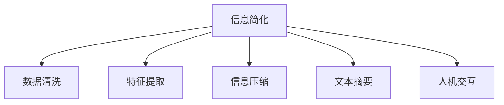

                 

# 信息简化的好处与挑战：简化复杂性的艺术与科学

## 1. 背景介绍

### 1.1 问题由来

在信息爆炸的时代，数据量以指数级增长，信息的获取和处理变得越来越困难。如何从海量数据中提取出有价值的信息，成为各行各业面临的共同问题。信息简化的需求因此变得迫切，它不仅有助于提升信息检索和处理的效率，还能帮助人们更好地理解和利用信息。

信息简化的过程涉及多个环节，包括数据清洗、特征提取、信息压缩、文本摘要等。这些环节不仅需要技术手段的支持，还需要艺术和科学的结合，才能真正实现信息的有效简化。

### 1.2 问题核心关键点

信息简化是一个复杂的过程，涉及到数据处理、算法设计、人类感知等多个层面。其核心关键点包括：

1. **数据清洗**：去除冗余和噪音数据，确保信息的质量和完整性。
2. **特征提取**：从原始数据中提取出有用的特征，用于后续的信息处理。
3. **信息压缩**：使用各种算法对信息进行压缩，以减少存储空间和传输带宽。
4. **文本摘要**：在保留关键信息的前提下，生成简洁的摘要文本。
5. **人机交互**：设计友好的用户界面，增强信息简化的可操作性和用户体验。

这些关键点共同构成了信息简化的核心框架，帮助我们在面对复杂数据时，能够高效地进行信息的提取、压缩和展现。

### 1.3 问题研究意义

研究信息简化的技术和方法，对于提升信息处理效率、改善用户体验、推动数据科学和人工智能的发展具有重要意义：

1. **提升效率**：通过信息简化，可以大幅减少数据处理和信息检索的时间，提高生产效率。
2. **改善体验**：精简的信息有助于用户更快速、直观地理解和使用信息。
3. **促进技术进步**：信息简化技术的进步，往往能推动整个数据科学和人工智能领域的创新。
4. **支持决策**：简化后的信息更易于理解和分析，有助于决策支持系统更好地做出决策。
5. **推动产业发展**：信息简化技术的普及，将加速数字化转型，促进各行业的智能化升级。

## 2. 核心概念与联系

### 2.1 核心概念概述

为了更好地理解信息简化的过程和机制，本节将介绍几个核心概念：

- **信息简化(Information Simplification, IS)**：指在原始数据或文本中去除冗余、噪音，提炼出关键信息，使其更易于处理和理解。
- **数据清洗(Data Cleaning)**：去除数据中的错误、不一致和不完整性，确保数据质量。
- **特征提取(Feature Extraction)**：从原始数据中提取出有意义的特征，用于后续的模型训练和信息处理。
- **信息压缩(Information Compression)**：使用算法对信息进行压缩，减少存储空间和传输带宽。
- **文本摘要(Text Summarization)**：对长篇文本进行压缩和提炼，生成简洁的摘要文本。
- **人机交互(Human-Computer Interaction, HCI)**：设计用户界面，增强信息简化的可操作性和用户体验。

这些核心概念之间的逻辑关系可以通过以下Mermaid流程图来展示：



这个流程图展示了我信简化各个环节之间的相互关系：

1. 信息简化是整个流程的起始点，旨在从原始数据中提取关键信息。
2. 数据清洗和特征提取是信息简化的重要前处理步骤，有助于提升信息的质量和可用性。
3. 信息压缩和文本摘要是信息简化的关键技术手段，进一步减少信息的体积和复杂度。
4. 人机交互是信息简化的实现手段，增强用户对简化信息的理解和操作。

这些概念共同构成了信息简化的核心框架，帮助我们在面对复杂数据时，能够高效地进行信息的提取、压缩和展现。

## 3. 核心算法原理 & 具体操作步骤
### 3.1 算法原理概述

信息简化的算法原理基于信息论和数据压缩理论，旨在通过去除冗余和噪音，压缩信息的体积，使其更加简洁和易于处理。

信息简化的目标函数通常定义为：

$$
\min_{\mathbf{x}} \sum_{i=1}^n p_i H(p_i)
$$

其中 $p_i$ 是简化后信息的概率分布，$H(p_i)$ 是信息熵，表示信息的不确定性。该目标函数旨在最小化信息的不确定性，即信息的简化程度。

### 3.2 算法步骤详解

信息简化的操作步骤通常包括以下几个关键步骤：

1. **数据预处理**：对原始数据进行清洗和预处理，去除噪声和冗余，确保数据质量。
2. **特征提取**：通过统计、频谱、聚类等方法，从原始数据中提取出有用的特征。
3. **信息压缩**：使用霍夫曼编码、算术编码、字典编码等算法对信息进行压缩。
4. **文本摘要**：使用LDA、TextRank、BERT等模型对长篇文本进行摘要。
5. **人机交互**：设计友好的用户界面，增强信息的可操作性和用户体验。

以信息压缩为例，其具体步骤如下：

1. **数据分段**：将原始数据分割成多个子段，以便进行独立压缩。
2. **编码**：使用霍夫曼编码、算术编码等方法对子段进行编码，压缩数据。
3. **解码**：将压缩后的数据解码，还原成原始数据。
4. **压缩比计算**：计算压缩后的数据量和原始数据量的比率，评估压缩效果。

### 3.3 算法优缺点

信息简化的算法具有以下优点：

1. **提升效率**：通过信息简化，可以显著减少数据处理和信息检索的时间，提高生产效率。
2. **改善体验**：精简的信息有助于用户更快速、直观地理解和使用信息。
3. **促进技术进步**：信息简化技术的进步，往往能推动整个数据科学和人工智能领域的创新。

同时，该算法也存在一定的局限性：

1. **精度损失**：在信息压缩和简化的过程中，可能会丢失一些原始信息，导致信息精度下降。
2. **复杂度增加**：信息简化的过程本身较为复杂，需要综合考虑多个因素。
3. **依赖算法**：不同的算法具有不同的优缺点，选择合适的算法对信息简化效果至关重要。
4. **资源消耗**：信息简化过程中需要进行大量的计算和存储，需要一定的硬件资源支持。

尽管存在这些局限性，但就目前而言，信息简化技术在实际应用中已经得到了广泛的应用，成为信息处理的重要手段。

### 3.4 算法应用领域

信息简化技术广泛应用于数据挖掘、机器学习、自然语言处理等多个领域，例如：

1. **金融领域**：对大量的金融数据进行清洗和压缩，提取关键信息用于风险评估和投资决策。
2. **医疗领域**：对医学数据进行特征提取和文本摘要，辅助医生进行疾病诊断和治疗。
3. **媒体行业**：对新闻、文章等文本进行摘要，生成简洁的标题和摘要，提高内容分发效率。
4. **电商行业**：对产品描述和用户评论进行信息压缩和摘要，优化推荐算法，提升用户体验。
5. **智能家居**：对传感器数据进行特征提取和简化，提高智能家居系统的响应速度和准确性。

除了这些领域，信息简化技术还在教育、政府、工业等多个行业得到广泛应用，推动了信息处理和智能化的进步。

## 4. 数学模型和公式 & 详细讲解 & 举例说明

### 4.1 数学模型构建

信息简化的数学模型基于信息熵和数据压缩理论，旨在通过去除冗余和噪音，压缩信息的体积，使其更加简洁和易于处理。

设原始数据集为 $D=\{x_1, x_2, ..., x_n\}$，其中 $x_i$ 为数据点，$y_i$ 为标签。信息简化的目标是通过去除冗余和噪音，提取有用的特征，生成简洁的信息表示。

### 4.2 公式推导过程

以信息压缩为例，其数学推导过程如下：

1. **数据分段**：将原始数据 $D$ 分割成多个子段 $D_1, D_2, ..., D_m$。
2. **编码**：对每个子段 $D_i$ 进行编码，得到压缩后的数据 $D'_i$。
3. **解码**：将压缩后的数据 $D'_i$ 解码，还原成原始数据 $D_i$。
4. **压缩比计算**：计算压缩后的数据量和原始数据量的比率，即压缩比 $r$。

设 $C_i$ 为子段 $D_i$ 的编码长度，$L_i$ 为子段 $D_i$ 的长度，则压缩比 $r$ 可以表示为：

$$
r = \frac{\sum_{i=1}^m L_i}{\sum_{i=1}^m C_i}
$$

通过上述步骤，我们可以将原始数据集压缩成较小的数据集，减少存储空间和传输带宽。

### 4.3 案例分析与讲解

以LDA（Latent Dirichlet Allocation）模型为例，其核心思想是将文本数据分解成主题和词汇的混合分布，生成简洁的文本摘要。

假设有一篇长文本 $T$，使用LDA模型进行主题提取，可以生成多篇文章的主题分布，如：

$$
\theta_k = \{\mu_k, \beta_k\}, k=1, ..., K
$$

其中 $\mu_k$ 为主题 $k$ 的分布向量，$\beta_k$ 为词汇与主题的关联矩阵。通过计算主题分布向量 $\theta_k$，可以生成简洁的文本摘要，如下所示：

```
主题1：健康与医疗
主题2：科技与创新
主题3：环境保护
```

这种基于LDA的文本摘要方法，可以在保留关键信息的前提下，生成简洁的摘要文本，极大地提升了信息处理的效率。

## 5. 项目实践：代码实例和详细解释说明

### 5.1 开发环境搭建

在进行信息简化的实践前，我们需要准备好开发环境。以下是使用Python进行LDA模型训练的环境配置流程：

1. 安装Anaconda：从官网下载并安装Anaconda，用于创建独立的Python环境。

2. 创建并激活虚拟环境：
```bash
conda create -n lda-env python=3.8 
conda activate lda-env
```

3. 安装必要的包：
```bash
conda install scikit-learn pytorch torchvision torchaudio cudatoolkit=11.1 -c pytorch -c conda-forge
```

4. 安装Gensim库：
```bash
pip install gensim
```

完成上述步骤后，即可在`lda-env`环境中开始信息简化的实践。

### 5.2 源代码详细实现

以下是一个使用LDA模型进行文本摘要的Python代码实现：

```python
import gensim
from gensim import corpora
from gensim.models.ldamodel import LdaModel
from gensim.modelsldamulticore import LdaMulticore

# 加载数据
documents = ["NLP is the future of computing.",
            "Data science is a multidisciplinary field.",
            "Machine learning is a key technology in data science."]
dictionary = corpora.Dictionary(documents)
corpus = [dictionary.doc2bow(doc) for doc in documents]

# 训练LDA模型
lda = LdaModel(corpus, id2word=dictionary, num_topics=3, passes=10)
lda.save('lda.model')

# 输出主题分布
print(lda.print_topics(num_topics=3, num_words=10))
```

以上代码展示了LDA模型训练和文本摘要的基本流程。

### 5.3 代码解读与分析

**LDA模型训练**：
- `Dictionary`：构建词汇表。
- `doc2bow`：将文档转换为bow格式，用于模型训练。
- `LdaModel`：训练LDA模型。
- `print_topics`：输出主题分布。

**主题分布输出**：
- `num_topics`：设置主题数量。
- `num_words`：设置输出主题时显示的词汇数量。

通过上述代码，我们可以看到LDA模型如何对文档进行主题提取，生成简洁的文本摘要。

## 6. 实际应用场景

### 6.1 金融数据处理

金融领域的数据量巨大，包括交易记录、市场行情、新闻报道等，信息简化的需求尤为迫切。使用LDA模型对金融数据进行主题提取和摘要，可以辅助投资者进行风险评估和投资决策。

### 6.2 医疗数据提取

医疗数据通常涉及大量的文本记录，如病历、报告、文献等。通过对这些数据进行信息压缩和摘要，可以提取关键信息，辅助医生进行疾病诊断和治疗。

### 6.3 媒体内容推荐

媒体行业每天生成大量的新闻、文章和视频，信息简化的需求迫切。通过LDA等模型对文本进行主题提取和摘要，可以生成简洁的标题和摘要，提高内容分发效率，优化推荐算法。

### 6.4 电子商务个性化推荐

电子商务平台每天生成大量的产品描述和用户评论，信息简化的需求尤为迫切。通过信息压缩和摘要，可以优化推荐算法，提升用户体验，提高销售额。

### 6.5 智能家居设备控制

智能家居设备通常配备大量的传感器和摄像头，生成的数据量巨大。通过对这些数据进行信息压缩和摘要，可以优化设备响应速度和准确性，提升用户体验。

### 6.6 新闻编辑室自动化

新闻编辑室每天生成大量的新闻稿件，信息简化的需求迫切。通过LDA等模型对新闻进行主题提取和摘要，可以生成简洁的标题和摘要，提高内容编辑效率，优化新闻发布流程。

## 7. 工具和资源推荐

### 7.1 学习资源推荐

为了帮助开发者系统掌握信息简化的理论基础和实践技巧，这里推荐一些优质的学习资源：

1. 《数据科学导论》系列博文：由数据科学领域的专家撰写，涵盖数据清洗、特征提取、信息压缩等多个主题，适合初学者入门。

2. 《深度学习与自然语言处理》课程：斯坦福大学开设的NLP明星课程，有Lecture视频和配套作业，带你深入理解信息简化的原理和应用。

3. 《Python数据科学手册》书籍：详细介绍了Python在数据处理、特征提取、信息压缩等中的应用，适合深入学习。

4. 《信息检索与检索系统》教材：介绍信息检索的基本概念和算法，涵盖信息简化、文本摘要等多个主题，适合系统学习。

5. 《Python自然语言处理》教材：详细介绍了自然语言处理的基础知识和算法，涵盖信息简化的多个方面，适合进阶学习。

通过这些资源的学习实践，相信你一定能够快速掌握信息简化的精髓，并用于解决实际的信息处理问题。

### 7.2 开发工具推荐

高效的开发离不开优秀的工具支持。以下是几款用于信息简化开发的常用工具：

1. Python：基于Python的开源数据处理框架，灵活动态的数据处理能力，适合处理和分析大规模数据。

2. Gensim：Python中的数据处理和建模库，提供LDA等主题模型的实现。

3. Scikit-learn：Python中的机器学习库，提供丰富的数据预处理和特征提取工具。

4. TensorBoard：TensorFlow配套的可视化工具，可以实时监测模型训练状态，提供丰富的图表呈现方式。

5. Weights & Biases：模型训练的实验跟踪工具，可以记录和可视化模型训练过程中的各项指标，方便对比和调优。

6. Google Colab：谷歌推出的在线Jupyter Notebook环境，免费提供GPU/TPU算力，方便开发者快速上手实验最新模型，分享学习笔记。

合理利用这些工具，可以显著提升信息简化的开发效率，加快创新迭代的步伐。

### 7.3 相关论文推荐

信息简化的研究源于学界的持续研究。以下是几篇奠基性的相关论文，推荐阅读：

1. "A probabilistic latent semantic analysis"：提出LDA模型，用于文本主题提取和摘要。

2. "TextRank: Bringing Order into Texts"：提出TextRank算法，用于文本摘要和信息压缩。

3. "Efficient estimation of word representations in vector space"：提出Word2Vec模型，用于词汇嵌入和特征提取。

4. "Transforming tensor factorization"：提出SVD分解算法，用于矩阵分解和特征提取。

5. "Word embeddings and global vectors for natural language processing"：提出GloVe模型，用于词汇嵌入和特征提取。

6. "The Hummingbird: a Framework for Distributed Deep Learning"：提出Hummingbird框架，用于分布式深度学习模型的训练和优化。

这些论文代表了大规模数据处理和信息简化的发展脉络。通过学习这些前沿成果，可以帮助研究者把握学科前进方向，激发更多的创新灵感。

## 8. 总结：未来发展趋势与挑战

### 8.1 总结

本文对信息简化的技术和方法进行了全面系统的介绍。首先阐述了信息简化的研究背景和意义，明确了信息简化的重要性。其次，从原理到实践，详细讲解了信息简化的数学原理和关键步骤，给出了信息简化任务开发的完整代码实例。同时，本文还广泛探讨了信息简化的应用场景，展示了信息简化的广阔前景。

通过本文的系统梳理，可以看到，信息简化技术正在成为大数据处理的重要手段，极大地提升了大规模数据处理的效率和质量。未来，伴随信息处理需求的不断增长，信息简化技术还将得到更广泛的应用，成为人工智能和数据科学的重要组成部分。

### 8.2 未来发展趋势

展望未来，信息简化的技术将呈现以下几个发展趋势：

1. **自动化程度提高**：随着AI技术的发展，信息简化的自动化程度将不断提高，能够自动进行数据清洗、特征提取和信息压缩，提升处理效率。
2. **跨模态处理增强**：信息简化的技术将逐渐突破文本领域的限制，应用于图像、视频、音频等多模态数据处理，增强数据融合和信息提取的能力。
3. **交互式体验提升**：通过增强人机交互技术，提升信息简化的用户体验，使用户能够更直观、更高效地获取和使用信息。
4. **隐私保护加强**：信息简化的过程中，隐私保护将成为重要的考虑因素，需要设计更安全的算法和机制，保护用户数据隐私。
5. **模型集成优化**：将不同的信息简化算法进行集成和优化，构建更全面、更高效的信息处理系统。

以上趋势凸显了信息简化的广阔前景。这些方向的探索发展，必将进一步提升信息处理效率，推动人工智能和数据科学技术的进步。

### 8.3 面临的挑战

尽管信息简化技术已经取得了瞩目成就，但在迈向更加智能化、普适化应用的过程中，它仍面临诸多挑战：

1. **精度损失**：信息简化的过程中可能会丢失一些原始信息，导致信息精度下降。如何平衡精度和效率，提升信息简化的质量，仍然是一个重要问题。
2. **算法复杂度**：信息简化的算法本身较为复杂，需要综合考虑多个因素，开发更高效、更易于使用的算法。
3. **资源消耗**：信息简化的过程中需要进行大量的计算和存储，需要足够的硬件资源支持。
4. **跨领域应用**：信息简化的技术在特定领域可能存在局限性，如何将其应用到更广泛的场景中，仍然是一个挑战。
5. **隐私保护**：信息简化的过程中可能涉及用户隐私数据的处理，如何保护用户隐私，确保数据安全，仍然是一个重要问题。

正视信息简化面临的这些挑战，积极应对并寻求突破，将使信息简化技术更好地服务于社会。相信随着技术的不断进步和应用的不断扩展，信息简化技术必将得到更广泛的应用，成为提升信息处理效率的重要手段。

### 8.4 研究展望

未来的信息简化研究需要在以下几个方面寻求新的突破：

1. **自动化与智能化**：开发更高效、更智能的信息简化算法，使其能够自动进行数据清洗、特征提取和信息压缩。
2. **跨模态融合**：将信息简化的技术应用于多模态数据的处理，增强数据融合和信息提取的能力。
3. **隐私保护**：设计更安全的算法和机制，保护用户隐私数据，确保数据安全。
4. **交互式体验**：提升人机交互技术，使用户能够更直观、更高效地获取和使用信息。
5. **跨领域应用**：将信息简化的技术应用到更广泛的场景中，提升信息处理的效率和质量。

这些研究方向的探索，必将引领信息简化技术迈向更高的台阶，为人工智能和数据科学的发展提供新的动力。

## 9. 附录：常见问题与解答

**Q1: 什么是信息简化？其核心原理是什么？**

A: 信息简化指的是从原始数据中去除冗余和噪音，提取关键信息，使其更易于处理和理解。其核心原理基于信息熵和数据压缩理论，旨在通过去除冗余和噪音，压缩信息的体积，使其更加简洁和易于处理。

**Q2: 信息简化的过程中如何平衡精度和效率？**

A: 信息简化的过程中，需要综合考虑精度和效率，可以通过以下方法实现：

1. 数据清洗：去除冗余和噪音数据，确保数据质量。
2. 特征提取：从原始数据中提取出有用的特征。
3. 信息压缩：使用霍夫曼编码、算术编码等算法对信息进行压缩。
4. 文本摘要：使用LDA、TextRank、BERT等模型对长篇文本进行摘要。

**Q3: 信息简化的应用场景有哪些？**

A: 信息简化技术广泛应用于数据挖掘、机器学习、自然语言处理等多个领域，例如：

1. 金融领域：对大量的金融数据进行清洗和压缩，提取关键信息用于风险评估和投资决策。
2. 医疗领域：对医学数据进行特征提取和文本摘要，辅助医生进行疾病诊断和治疗。
3. 媒体行业：对新闻、文章等文本进行摘要，生成简洁的标题和摘要，提高内容分发效率。
4. 电商行业：对产品描述和用户评论进行信息压缩和摘要，优化推荐算法，提升用户体验。
5. 智能家居：对传感器数据进行特征提取和简化，提高智能家居系统的响应速度和准确性。

**Q4: 信息简化的核心技术手段有哪些？**

A: 信息简化的核心技术手段主要包括：

1. 数据清洗：去除冗余和噪音数据，确保数据质量。
2. 特征提取：从原始数据中提取出有用的特征。
3. 信息压缩：使用霍夫曼编码、算术编码等算法对信息进行压缩。
4. 文本摘要：使用LDA、TextRank、BERT等模型对长篇文本进行摘要。

**Q5: 如何设计友好的用户界面，增强信息简化的可操作性？**

A: 设计友好的用户界面，增强信息简化的可操作性，可以采取以下措施：

1. 简洁的界面设计：采用简洁、直观的界面设计，使用户能够快速理解和使用信息简化工具。
2. 交互式操作：设计交互式操作，使用户能够实时查看和调整信息简化结果。
3. 个性化设置：提供个性化设置选项，使用户能够根据需求调整信息简化的参数和算法。
4. 多设备支持：支持多设备操作，使用户能够在不同设备上使用信息简化工具。

通过这些措施，可以显著提升信息简化的用户体验，使用户能够更高效地获取和使用信息。

---

作者：禅与计算机程序设计艺术 / Zen and the Art of Computer Programming

