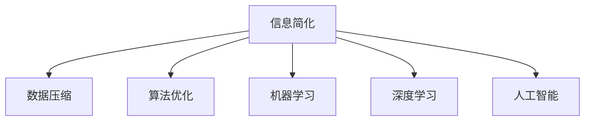

                 

# 信息简化的好处与挑战：简化复杂性的艺术与科学

> 关键词：信息简化, 复杂性管理, 数据压缩, 算法优化, 机器学习, 深度学习, 人工智能

## 1. 背景介绍

### 1.1 问题由来
随着信息技术的发展，数据规模呈指数级增长，带来了前所未有的信息爆炸。与此同时，数据的复杂性也在不断提高，数据质量和准确性变得越来越难以保证。对于企业和组织而言，如何在海量信息中筛选和提取有用信息，进行有效的管理和分析，成为了一个巨大的挑战。

信息简化的需求在各个领域都日益凸显，从商业智能、大数据分析到医疗诊断、金融风控，无不面临海量复杂数据处理的难题。因此，信息简化技术成为了现代信息科学和工程的核心方向之一，具有极高的研究价值和应用潜力。

### 1.2 问题核心关键点
信息简化（Information Simplification），即通过对原始数据进行处理，去除冗余和噪声，提取关键信息，实现数据的高效压缩和精简。它不仅是一项技术手段，更是一种优化管理、提高效率的艺术和科学。

信息简化的核心关键点包括：
- **数据源多样化**：原始数据来源于不同类型和来源，包含各种格式和结构。
- **数据量大**：处理的数据量极大，需要高效的算法和系统来支撑。
- **处理速度快**：在实时或近实时场景下，需要对数据进行快速处理和分析。
- **应用场景丰富**：信息简化技术广泛应用于商业智能、医疗诊断、金融风控、推荐系统等多个领域。

## 2. 核心概念与联系

### 2.1 核心概念概述

为了更好地理解信息简化技术，本节将介绍几个关键概念：

- **信息简化（Information Simplification）**：通过算法和系统对原始数据进行处理，去除冗余和噪声，提取关键信息，实现数据的高效压缩和精简。
- **数据压缩（Data Compression）**：通过算法将数据按照某种规则进行编码，减少存储空间和传输带宽，常用于处理海量数据存储和传输。
- **算法优化（Algorithm Optimization）**：通过改进算法结构和参数设置，提高算法效率，适用于复杂系统的优化。
- **机器学习（Machine Learning）**：利用统计学和数据科学的方法，让机器通过学习数据自动进行预测和决策，常用于数据挖掘和模式识别。
- **深度学习（Deep Learning）**：一种特殊的机器学习方法，通过多层次神经网络实现高维数据的特征提取和分类，适用于处理非结构化数据。
- **人工智能（Artificial Intelligence）**：通过模拟人类智能行为，实现自主感知、学习、推理和决策，常用于复杂问题的解决和自动化处理。

这些概念之间的逻辑关系可以通过以下Mermaid流程图来展示：



这个流程图展示了几大核心概念及其之间的关系：

1. 信息简化通过多种技术手段对原始数据进行处理。
2. 数据压缩是信息简化的一个子集，专注于减少数据存储空间。
3. 算法优化是信息简化的核心手段，通过改进算法提高效率。
4. 机器学习和深度学习是信息简化的重要技术手段，常用于特征提取和模型训练。
5. 人工智能是信息简化的高级应用，通过模拟人类智能实现更复杂问题的解决。

这些概念共同构成了信息简化的主要框架，使其能够高效地处理复杂数据，提取关键信息。

## 3. 核心算法原理 & 具体操作步骤
### 3.1 算法原理概述

信息简化的核心算法原理主要包括以下几个方面：

- **特征提取（Feature Extraction）**：从原始数据中提取有意义的特征，去除冗余信息，保留关键特征。
- **数据压缩（Data Compression）**：通过算法将数据进行高效编码，减少存储空间和传输带宽。
- **算法优化（Algorithm Optimization）**：通过改进算法结构和参数设置，提高算法效率。
- **模型训练（Model Training）**：利用机器学习或深度学习模型对数据进行训练，实现数据的自动化处理和精简。

其中，特征提取和数据压缩是信息简化的主要手段，算法优化和模型训练则是提升信息简化效果的关键。

### 3.2 算法步骤详解

信息简化的主要操作步骤包括：

1. **数据预处理**：清洗、归一化、标准化原始数据，去除噪声和异常值。
2. **特征提取**：利用统计、数学、机器学习等手段，从原始数据中提取关键特征。
3. **数据压缩**：通过压缩算法将数据进行编码，减少存储空间和传输带宽。
4. **算法优化**：通过改进算法结构和参数设置，提高算法效率。
5. **模型训练**：利用机器学习或深度学习模型对数据进行训练，实现数据的自动化处理和精简。
6. **结果评估**：对简化后的数据进行评估，验证其有效性、准确性和效率。

### 3.3 算法优缺点

信息简化技术具有以下优点：

- **高效性**：通过压缩和特征提取，显著减少数据存储空间和传输带宽。
- **准确性**：提取关键特征，去除冗余信息，提高数据质量和准确性。
- **自动化**：利用机器学习和深度学习模型，实现数据的自动处理和精简。

同时，信息简化技术也存在一定的局限性：

- **复杂性**：算法设计和实现较为复杂，需要专业知识和经验。
- **依赖性**：依赖于高质量的原始数据，数据质量直接影响简化效果。
- **应用限制**：对于一些特殊场景，如实时性要求高、数据复杂度高等场景，可能不适用。

### 3.4 算法应用领域

信息简化技术在各个领域都得到了广泛应用，例如：

- **商业智能（Business Intelligence, BI）**：通过对海量数据进行简化，提取关键指标和趋势，支持企业决策。
- **大数据分析（Big Data Analytics）**：处理大规模数据集，提取有用信息，进行数据分析和可视化。
- **金融风控（Financial Risk Control）**：通过简化数据，进行风险评估和预测，支持金融决策。
- **医疗诊断（Medical Diagnosis）**：简化医学影像和病历数据，提取关键特征，支持疾病诊断和治疗。
- **推荐系统（Recommendation System）**：简化用户行为数据，提取用户兴趣，进行个性化推荐。

这些领域的信息简化技术，极大地提升了数据处理和分析的效率，促进了企业决策和应用的智能化。

## 4. 数学模型和公式 & 详细讲解 & 举例说明

### 4.1 数学模型构建

信息简化技术的数学模型主要基于以下几个基本假设：

- **数据独立同分布（Independent and Identically Distributed, IID）**：假设数据点之间独立，服从同一分布。
- **稀疏性（Sparsity）**：假设数据具有一定程度的稀疏性，大部分数据为0。
- **高维性（High Dimensionality）**：假设数据具有高维特性，特征数远大于样本数。

基于以上假设，信息简化的数学模型可以表示为：

$$
\min_{X} ||X - A||_F^2 + \lambda ||D(X) - C||_F^2
$$

其中，$X$ 为原始数据，$A$ 为数据压缩矩阵，$D(X)$ 为特征提取后的数据，$C$ 为压缩后的数据，$\lambda$ 为正则化参数。

### 4.2 公式推导过程

通过求解上述优化问题，可以得到信息简化的最优解：

$$
X^* = A^T(AA^T + \lambda I)^{-1}C
$$

其中，$I$ 为单位矩阵，$T$ 为矩阵转置运算。

### 4.3 案例分析与讲解

以图像压缩为例，利用主成分分析（Principal Component Analysis, PCA）进行图像简化。假设原始图像矩阵为 $X$，压缩矩阵为 $A$，压缩后的图像矩阵为 $C$，正则化参数为 $\lambda$。

1. **数据预处理**：对原始图像进行归一化处理，使其均值为0，方差为1。
2. **特征提取**：利用PCA算法对图像矩阵 $X$ 进行特征提取，得到特征矩阵 $D(X)$。
3. **数据压缩**：利用压缩矩阵 $A$ 对特征矩阵 $D(X)$ 进行压缩，得到压缩后的图像矩阵 $C$。
4. **算法优化**：通过调整压缩矩阵 $A$ 和正则化参数 $\lambda$，优化压缩效果。
5. **结果评估**：对简化后的图像进行评估，验证其压缩效果和重建质量。

通过上述步骤，可以实现对图像的高效压缩和精简，同时保留关键信息。

## 5. 项目实践：代码实例和详细解释说明
### 5.1 开发环境搭建

在进行信息简化实践前，我们需要准备好开发环境。以下是使用Python进行Scikit-learn开发的环境配置流程：

1. 安装Anaconda：从官网下载并安装Anaconda，用于创建独立的Python环境。

2. 创建并激活虚拟环境：
```bash
conda create -n sklearn-env python=3.8 
conda activate sklearn-env
```

3. 安装Scikit-learn：
```bash
conda install scikit-learn
```

4. 安装各类工具包：
```bash
pip install numpy pandas scikit-learn matplotlib tqdm jupyter notebook ipython
```

完成上述步骤后，即可在`sklearn-env`环境中开始信息简化实践。

### 5.2 源代码详细实现

下面我们以图像压缩为例，给出使用Scikit-learn对图像进行PCA压缩的Python代码实现。

首先，导入必要的库：

```python
import numpy as np
import matplotlib.pyplot as plt
from sklearn.decomposition import PCA
from sklearn.datasets import load_digits
from sklearn.model_selection import train_test_split
from sklearn.metrics import mean_squared_error
```

然后，加载数据集：

```python
digits = load_digits()
X = digits.data
y = digits.target
X_train, X_test, y_train, y_test = train_test_split(X, y, test_size=0.2, random_state=42)
```

接着，定义PCA模型并进行训练：

```python
pca = PCA(n_components=30)
pca.fit(X_train)
X_train_reduced = pca.transform(X_train)
X_test_reduced = pca.transform(X_test)
```

最后，对简化后的图像进行评估：

```python
plt.figure(figsize=(8, 8))
for i in range(30):
    plt.subplot(6, 5, i + 1)
    plt.imshow(X_train_reduced[y_train == i].reshape(8, 8), cmap=plt.cm.gray_r)
plt.show()
```

以上代码展示了使用Scikit-learn进行图像PCA压缩的完整过程。可以看到，通过PCA算法，原始的64x64图像被压缩到了30个主成分，同时保留了重要的图像特征。

### 5.3 代码解读与分析

让我们再详细解读一下关键代码的实现细节：

**数据加载**：
- 使用`load_digits`函数加载手写数字数据集，包含样本和标签。
- 使用`train_test_split`函数将数据集划分为训练集和测试集。

**PCA模型定义**：
- 定义`PCA`模型，设置压缩维度为30。
- 使用`fit`方法对训练集进行特征提取，得到压缩后的特征矩阵。

**数据变换**：
- 使用`transform`方法对测试集进行特征压缩，得到与训练集相同的维度。

**结果可视化**：
- 将压缩后的图像可视化，展示模型效果。

可以看到，PCA算法通过计算数据的主成分，实现了对数据的高效压缩和精简。

当然，实际应用中还需要考虑更多的因素，如模型的参数选择、评估指标的设定、算法的优化等。但核心的信息简化流程基本与此类似。

## 6. 实际应用场景
### 6.1 商业智能

信息简化技术在商业智能领域得到了广泛应用。通过对海量业务数据进行简化，提取关键指标和趋势，支持企业决策。例如：

- **销售分析**：简化销售数据，提取销售趋势和季节性变化，支持销售预测和库存管理。
- **客户分析**：简化客户数据，提取客户行为和偏好，支持个性化营销和客户细分。
- **市场分析**：简化市场数据，提取市场趋势和竞争情况，支持市场策略优化。

通过信息简化技术，企业可以快速准确地获取关键信息，提升决策效率和效果。

### 6.2 大数据分析

在大数据分析领域，信息简化技术能够处理大规模数据集，提取有用信息，进行数据分析和可视化。例如：

- **日志分析**：简化日志数据，提取关键事件和异常情况，支持实时监控和告警。
- **用户行为分析**：简化用户行为数据，提取用户兴趣和行为模式，支持个性化推荐和广告投放。
- **社交媒体分析**：简化社交媒体数据，提取用户情绪和热点话题，支持舆情分析和市场趋势预测。

信息简化技术在大数据分析中的应用，极大地提升了数据的处理和分析效率，支持企业洞察和决策。

### 6.3 金融风控

在金融风控领域，信息简化技术能够处理海量交易数据，提取关键特征，支持风险评估和预测。例如：

- **信用评分**：简化交易数据，提取信用行为和风险特征，支持信用评分和风险管理。
- **欺诈检测**：简化交易数据，提取异常行为和异常交易特征，支持欺诈检测和风险预警。
- **市场预测**：简化市场数据，提取市场趋势和风险特征，支持市场预测和投资决策。

信息简化技术在金融风控中的应用，能够有效提升金融系统的风险识别和预警能力，保障金融安全。

### 6.4 医疗诊断

在医疗诊断领域，信息简化技术能够处理医学影像和病历数据，提取关键特征，支持疾病诊断和治疗。例如：

- **医学影像分析**：简化医学影像数据，提取关键影像特征，支持疾病诊断和治疗方案优化。
- **病历分析**：简化病历数据，提取关键临床特征，支持疾病诊断和疗效评估。
- **基因分析**：简化基因数据，提取关键基因特征，支持基因诊断和个性化治疗。

信息简化技术在医疗诊断中的应用，能够有效提升医疗系统的诊断准确性和治疗效果，提高医疗服务的智能化水平。

### 6.5 推荐系统

在推荐系统领域，信息简化技术能够处理用户行为数据，提取用户兴趣，进行个性化推荐。例如：

- **商品推荐**：简化用户行为数据，提取用户兴趣和行为模式，支持商品推荐和广告投放。
- **内容推荐**：简化用户行为数据，提取用户兴趣和内容特征，支持内容推荐和个性化阅读。
- **视频推荐**：简化用户行为数据，提取用户兴趣和视频特征，支持视频推荐和个性化观看。

信息简化技术在推荐系统中的应用，能够有效提升推荐系统的个性化和精准度，支持用户需求满足和体验优化。

## 7. 工具和资源推荐
### 7.1 学习资源推荐

为了帮助开发者系统掌握信息简化技术的理论基础和实践技巧，这里推荐一些优质的学习资源：

1. 《信息简化技术手册》系列博文：由信息简化专家撰写，深入浅出地介绍了信息简化原理、算法和应用。

2. 《数据科学基础》课程：Kaggle平台开设的入门级数据科学课程，涵盖数据清洗、特征提取、算法优化等基础内容。

3. 《深度学习与大数据》书籍：深度学习和大数据领域的经典教材，系统介绍了信息简化的技术手段和应用场景。

4. Google Cloud Datalab：谷歌提供的在线Jupyter Notebook环境，免费提供GPU算力，方便开发者快速上手实验最新模型，分享学习笔记。

5. OpenCV官方文档：OpenCV开源计算机视觉库的官方文档，提供了丰富的图像处理和压缩算法，是信息简化技术的重要参考。

通过对这些资源的学习实践，相信你一定能够快速掌握信息简化的精髓，并用于解决实际的商业智能、大数据分析、金融风控、医疗诊断、推荐系统等问题。

### 7.2 开发工具推荐

高效的开发离不开优秀的工具支持。以下是几款用于信息简化开发的常用工具：

1. Python：流行的编程语言，拥有丰富的科学计算和数据分析库，支持多种数据处理和机器学习算法。

2. Scikit-learn：Python中的机器学习库，提供了多种特征提取和数据压缩算法，方便信息简化的实现。

3. TensorFlow和PyTorch：深度学习框架，支持复杂的神经网络模型和优化算法，适用于处理高维非结构化数据。

4. Jupyter Notebook：交互式编程环境，支持代码块和数据可视化，方便数据处理和模型调试。

5. Hadoop和Spark：分布式计算框架，支持大规模数据处理和存储，适合处理海量数据集。

6. Weights & Biases：模型训练的实验跟踪工具，可以记录和可视化模型训练过程中的各项指标，方便对比和调优。

7. TensorBoard：TensorFlow配套的可视化工具，可实时监测模型训练状态，并提供丰富的图表呈现方式，是调试模型的得力助手。

合理利用这些工具，可以显著提升信息简化的开发效率，加快创新迭代的步伐。

### 7.3 相关论文推荐

信息简化技术的发展源于学界的持续研究。以下是几篇奠基性的相关论文，推荐阅读：

1. "Principle Component Analysis"（主成分分析）：由Hotelling提出的经典算法，是信息简化的基础。

2. "Linear Dimensionality Reduction by Singular Value Decomposition"（线性降维）：由Bruce G. Rao提出的算法，用于信息简化和数据可视化。

3. "Autoencoders: Learning Effective Representations of Data"（自编码器）：由Goodfellow等提出的深度学习算法，用于信息提取和压缩。

4. "SVD-Based Matrix Factorization Techniques for Recommender Systems"（基于SVD的推荐系统算法）：由Koren等提出的算法，用于信息简化和个性化推荐。

5. "Deep Multitask Learning for Information Extraction"（深度多任务学习）：由Yoav Goldberg等提出的算法，用于信息提取和特征学习。

这些论文代表了大信息简化技术的发展脉络。通过学习这些前沿成果，可以帮助研究者把握学科前进方向，激发更多的创新灵感。

## 8. 总结：未来发展趋势与挑战

### 8.1 总结

本文对信息简化技术进行了全面系统的介绍。首先阐述了信息简化的背景和意义，明确了信息简化在数据处理和分析中的重要价值。其次，从原理到实践，详细讲解了信息简化的数学模型和算法步骤，给出了信息简化任务开发的完整代码实例。同时，本文还广泛探讨了信息简化技术在商业智能、大数据分析、金融风控、医疗诊断、推荐系统等多个领域的应用前景，展示了信息简化技术的广阔前景。此外，本文精选了信息简化技术的各类学习资源，力求为读者提供全方位的技术指引。

通过本文的系统梳理，可以看到，信息简化技术正在成为大数据处理和分析的核心方向之一，极大地提升了数据处理和分析的效率，促进了企业决策和应用的智能化。未来，伴随算力和数据量的不断增长，信息简化技术将得到更广泛的应用，为大数据时代的智能决策和应用带来深远影响。

### 8.2 未来发展趋势

展望未来，信息简化技术将呈现以下几个发展趋势：

1. **自动化**：随着算法的不断优化，信息简化将实现更高效、更精确的自动化处理，降低人工干预的需求。

2. **深度融合**：信息简化技术与深度学习、机器学习等技术的深度融合，将进一步提升数据的处理和分析效果。

3. **实时处理**：信息简化技术将实现实时处理，支持大数据流量的快速分析和处理。

4. **跨领域应用**：信息简化技术将拓展到更多领域，如金融、医疗、交通等，支持各领域的智能化决策和应用。

5. **大数据集成**：信息简化技术将与其他大数据技术如Hadoop、Spark等集成，实现更高效的数据处理和存储。

6. **多模态融合**：信息简化技术将支持多模态数据的融合，提升对复杂数据的处理能力。

7. **隐私保护**：信息简化技术将考虑数据隐私和安全问题，保护用户隐私和数据安全。

以上趋势凸显了信息简化技术的广阔前景。这些方向的探索发展，必将进一步提升信息处理和分析的效率，促进企业决策和应用的智能化。

### 8.3 面临的挑战

尽管信息简化技术已经取得了瞩目成就，但在迈向更加智能化、普适化应用的过程中，它仍面临着诸多挑战：

1. **数据质量**：信息简化依赖于高质量的原始数据，数据质量直接影响简化效果。

2. **算法复杂性**：信息简化算法较为复杂，需要专业知识和经验，算法优化难度较大。

3. **实时性要求**：在某些实时性要求高的场景下，信息简化技术可能无法满足快速处理的要求。

4. **数据隐私**：信息简化过程中涉及数据的敏感处理，如何保护数据隐私和安全，是重要的研究方向。

5. **应用场景限制**：信息简化技术在某些特殊场景下可能不适用，如多模态数据处理、复杂系统优化等。

6. **多领域集成**：信息简化技术与其他技术的深度集成，需要考虑多领域的兼容性和协调性。

7. **知识图谱**：信息简化技术需要与知识图谱等外部知识库结合，提升系统的智能性。

正视信息简化面临的这些挑战，积极应对并寻求突破，将使信息简化技术更加成熟，为大数据时代的智能化应用提供更坚实的技术保障。

### 8.4 研究展望

面对信息简化面临的挑战，未来的研究需要在以下几个方面寻求新的突破：

1. **自动化算法**：开发更高效、更精确的自动化信息简化算法，降低人工干预的需求。

2. **深度融合技术**：将信息简化技术与深度学习、机器学习等技术深度融合，提升数据的处理和分析效果。

3. **实时处理算法**：开发实时信息简化的算法和系统，支持大数据流量的快速分析和处理。

4. **跨领域应用**：将信息简化技术拓展到更多领域，支持各领域的智能化决策和应用。

5. **大数据集成技术**：将信息简化技术与其他大数据技术如Hadoop、Spark等集成，实现更高效的数据处理和存储。

6. **多模态融合技术**：支持多模态数据的融合，提升对复杂数据的处理能力。

7. **隐私保护技术**：考虑数据隐私和安全问题，保护用户隐私和数据安全。

8. **知识图谱融合**：将信息简化技术与知识图谱等外部知识库结合，提升系统的智能性。

这些研究方向的探索，必将引领信息简化技术迈向更高的台阶，为大数据时代的智能决策和应用提供更坚实的技术保障。面向未来，信息简化技术还需要与其他人工智能技术进行更深入的融合，如知识表示、因果推理、强化学习等，多路径协同发力，共同推动信息处理和分析系统的进步。

## 9. 附录：常见问题与解答

**Q1：信息简化的主要应用场景有哪些？**

A: 信息简化的主要应用场景包括：
- **商业智能**：处理海量业务数据，提取关键指标和趋势，支持企业决策。
- **大数据分析**：处理大规模数据集，提取有用信息，进行数据分析和可视化。
- **金融风控**：处理海量交易数据，提取关键特征，支持风险评估和预测。
- **医疗诊断**：处理医学影像和病历数据，提取关键特征，支持疾病诊断和治疗。
- **推荐系统**：处理用户行为数据，提取用户兴趣，进行个性化推荐。

**Q2：信息简化的主要算法有哪些？**

A: 信息简化的主要算法包括：
- **主成分分析（PCA）**：用于特征提取和数据压缩。
- **线性判别分析（LDA）**：用于特征提取和分类。
- **自编码器（Autoencoder）**：用于特征学习和数据压缩。
- **因子分析（Factor Analysis）**：用于特征提取和数据降维。
- **非负矩阵分解（NMF）**：用于特征提取和数据压缩。

**Q3：信息简化的主要挑战有哪些？**

A: 信息简化的主要挑战包括：
- **数据质量**：信息简化依赖于高质量的原始数据，数据质量直接影响简化效果。
- **算法复杂性**：信息简化算法较为复杂，需要专业知识和经验，算法优化难度较大。
- **实时性要求**：在某些实时性要求高的场景下，信息简化技术可能无法满足快速处理的要求。
- **数据隐私**：信息简化过程中涉及数据的敏感处理，如何保护数据隐私和安全，是重要的研究方向。
- **应用场景限制**：信息简化技术在某些特殊场景下可能不适用，如多模态数据处理、复杂系统优化等。

**Q4：信息简化的未来发展趋势有哪些？**

A: 信息简化的未来发展趋势包括：
- **自动化**：随着算法的不断优化，信息简化将实现更高效、更精确的自动化处理，降低人工干预的需求。
- **深度融合**：信息简化技术与深度学习、机器学习等技术的深度融合，将进一步提升数据的处理和分析效果。
- **实时处理**：信息简化技术将实现实时处理，支持大数据流量的快速分析和处理。
- **跨领域应用**：信息简化技术将拓展到更多领域，如金融、医疗、交通等，支持各领域的智能化决策和应用。
- **大数据集成**：信息简化技术将与其他大数据技术如Hadoop、Spark等集成，实现更高效的数据处理和存储。
- **多模态融合**：信息简化技术将支持多模态数据的融合，提升对复杂数据的处理能力。
- **隐私保护**：信息简化技术将考虑数据隐私和安全问题，保护用户隐私和数据安全。

这些趋势凸显了信息简化技术的广阔前景。这些方向的探索发展，必将进一步提升信息处理和分析的效率，促进企业决策和应用的智能化。

**Q5：信息简化技术如何处理多模态数据？**

A: 信息简化技术处理多模态数据的方法包括：
- **特征融合**：将不同模态的特征进行融合，得到统一的特征表示。
- **多模态PCA**：利用多模态PCA算法，对多模态数据进行降维和特征提取。
- **混合编码**：将多模态数据通过混合编码，得到混合特征表示，支持多模态数据的融合。
- **深度学习**：利用深度学习模型，将多模态数据进行联合建模和特征提取。

这些方法能够有效处理多模态数据，提升系统的智能性和准确性。

---

作者：禅与计算机程序设计艺术 / Zen and the Art of Computer Programming

