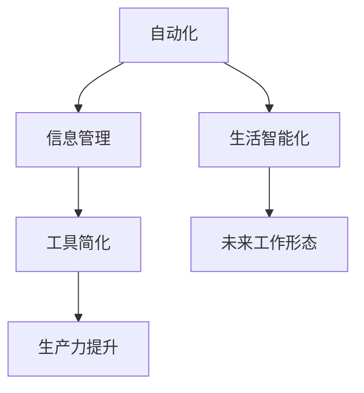

                 

# 信息简化的工具和自动化实践：利用技术简化你的生活和工作

> 关键词：自动化，工具简化，信息管理，生产力提升，生活智能化，未来工作形态

## 1. 背景介绍

在当今数字化、智能化的时代，信息爆炸已经成为我们工作和生活的一个重要特征。无论是商业信息、技术数据，还是个人笔记、文档，信息的获取和处理变得越来越复杂和耗时。如何有效管理和利用这些信息，已经成为提升个人和工作效率的关键。本文将探讨如何利用技术和工具简化信息处理流程，提升生产力和工作质量，实现生活与工作的智能化。

## 2. 核心概念与联系

### 2.1 核心概念概述

- **自动化（Automation）**：自动化技术旨在通过编程、算法和机器学习等手段，使复杂的信息处理和重复任务自动化执行，从而提高效率和减少人为错误。
- **信息管理（Information Management）**：信息管理涉及信息的收集、整理、存储、检索和分享，旨在确保信息的有序性、可靠性和可访问性。
- **工具简化（Tool Simplification）**：通过设计和开发用户友好的工具，简化信息处理流程，降低技术门槛，使非技术用户也能轻松使用。
- **生产力提升（Productivity Improvement）**：通过优化信息处理流程，提高工作效率，减少时间浪费，从而提升个人和企业的工作生产力。
- **生活智能化（Smart Living）**：通过智能设备和应用程序，使家居、交通、健康管理等方面自动化和智能化，提升生活质量。
- **未来工作形态（Future Work Paradigm）**：随着技术的进步，未来的工作将更加灵活、协作，信息处理和沟通更加高效。

这些概念之间的联系可以通过以下Mermaid流程图来展示：



该图展示了自动化技术如何通过信息管理优化工具设计，提升个人和企业的生产力，并最终实现生活智能化，最终引导未来的工作形态变革。

## 3. 核心算法原理 & 具体操作步骤

### 3.1 算法原理概述

利用技术简化信息处理的核心算法原理主要包括：

1. **数据预处理与清洗**：通过算法自动清理和规范化数据，减少人工干预，提高数据质量。
2. **自动化学习与优化**：使用机器学习算法自动学习并优化信息处理流程，提高效率。
3. **信息抽取与整合**：利用自然语言处理和知识图谱技术，自动抽取和整合信息，提升信息检索和共享的准确性和效率。
4. **智能决策支持**：通过数据分析和人工智能技术，提供智能决策建议，辅助决策过程。

### 3.2 算法步骤详解

1. **数据收集与清洗**：
    - 收集各种形式的信息，包括文本、图像、音频等。
    - 使用算法自动清理噪声、去除重复、标准化数据格式。

2. **数据存储与索引**：
    - 将清洗后的数据存储在高效的数据库或数据仓库中。
    - 使用索引和元数据优化数据检索，提升查询效率。

3. **信息抽取与整合**：
    - 利用自然语言处理技术，如命名实体识别、关系抽取等，自动从文本中提取关键信息。
    - 使用知识图谱技术，将不同信息源整合为统一的语义表示。

4. **自动化学习与优化**：
    - 使用机器学习模型，如决策树、随机森林、深度学习等，自动学习和优化信息处理流程。
    - 定期评估模型性能，更新和优化模型参数。

5. **智能决策支持**：
    - 利用数据挖掘和预测分析技术，提供决策建议和预测结果。
    - 通过可视化工具，将复杂数据和分析结果直观呈现，辅助决策。

### 3.3 算法优缺点

**优点**：
- **效率提升**：自动化处理可以显著提高信息处理的效率，减少人为错误。
- **成本降低**：减少人工干预和重复工作，降低信息管理的成本。
- **一致性增强**：算法处理能够保证数据的一致性和标准化。
- **灵活性提高**：自动化和智能决策支持能够快速适应新场景和新需求。

**缺点**：
- **数据质量依赖**：算法的性能高度依赖于输入数据的质量。
- **初始成本高**：开发和维护自动化系统的初始成本较高。
- **技术门槛**：对技术知识和技能要求较高，可能需要专门的培训和学习。
- **隐私和安全**：自动化处理涉及大量数据，需关注数据隐私和安全问题。

### 3.4 算法应用领域

基于上述算法原理，自动化和工具简化技术在多个领域得到了广泛应用，包括但不限于：

- **企业信息管理**：通过自动化系统优化企业文档管理、知识库建设、信息检索等流程。
- **个人生产力提升**：利用自动化工具简化日常工作任务，如日程安排、邮件管理、文件整理等。
- **智能家居与物联网**：通过自动化和智能化设备，提升家居生活的便捷性和舒适度。
- **医疗与健康管理**：通过数据分析和智能决策支持，优化医疗信息管理、健康监测和疾病预测。
- **金融与投资**：通过自动化交易系统、数据分析工具，提高投资决策和风险管理效率。
- **教育与学习**：利用智能化学习平台和自动化评估工具，优化教学和学习过程，提升教育质量。

## 4. 数学模型和公式 & 详细讲解 & 举例说明

### 4.1 数学模型构建

在信息简化和自动化处理中，常见的一些数学模型包括：

- **线性回归**：用于分析变量之间的关系，预测未来数据。
- **决策树**：用于分类和预测，通过树形结构表示决策规则。
- **深度学习模型**：如卷积神经网络（CNN）和循环神经网络（RNN），用于处理图像、文本等复杂数据。
- **图神经网络（GNN）**：用于处理关系数据，如图谱数据的聚类和分类。

### 4.2 公式推导过程

以线性回归为例，其公式为：

$$
y = \beta_0 + \beta_1x_1 + \beta_2x_2 + \cdots + \beta_nx_n + \epsilon
$$

其中，$y$ 为目标变量，$\beta_i$ 为模型参数，$x_i$ 为自变量，$\epsilon$ 为误差项。通过最小化误差项，求解最优的 $\beta_i$。

### 4.3 案例分析与讲解

假设我们有一组房屋面积与售价的数据，通过线性回归模型可以预测未来的房价。使用Python和Scikit-learn库，可以实现以下步骤：

```python
from sklearn.linear_model import LinearRegression
import pandas as pd

# 加载数据
data = pd.read_csv('house_prices.csv')

# 选择特征和目标变量
X = data[['area', 'bedrooms', 'bathrooms']]
y = data['price']

# 训练模型
model = LinearRegression()
model.fit(X, y)

# 预测新数据
new_data = [[1500, 3, 2]]
predicted_price = model.predict(new_data)
print(f"预测房价为：{predicted_price[0]}")
```

通过上述代码，我们可以基于历史数据建立线性回归模型，对新数据进行房价预测。这展示了自动化处理在数据预测和决策支持中的应用。

## 5. 项目实践：代码实例和详细解释说明

### 5.1 开发环境搭建

要在项目中实现信息简化的工具和自动化实践，需要以下开发环境：

1. **Python**：作为主要编程语言，Python生态系统丰富，支持多种数据处理和机器学习库。
2. **Jupyter Notebook**：支持交互式编程和数据可视化，方便调试和演示。
3. **PyTorch/TensorFlow**：用于深度学习模型开发，支持高效计算和自动微分。
4. **Pandas/NumPy**：用于数据处理和分析，支持高效数据存储和操作。
5. **Scikit-learn**：提供丰富的机器学习算法，支持模型训练和评估。
6. **TensorBoard**：用于可视化模型训练和性能监测。

### 5.2 源代码详细实现

以下是一个利用Python和Scikit-learn实现线性回归的示例代码：

```python
from sklearn.linear_model import LinearRegression
import pandas as pd

# 加载数据
data = pd.read_csv('house_prices.csv')

# 选择特征和目标变量
X = data[['area', 'bedrooms', 'bathrooms']]
y = data['price']

# 训练模型
model = LinearRegression()
model.fit(X, y)

# 预测新数据
new_data = [[1500, 3, 2]]
predicted_price = model.predict(new_data)
print(f"预测房价为：{predicted_price[0]}")
```

### 5.3 代码解读与分析

- **数据加载**：使用`pd.read_csv`从CSV文件中加载数据。
- **特征选择**：选择房屋面积、卧室数量和浴室数量作为特征。
- **模型训练**：使用`LinearRegression`模型训练线性回归模型。
- **数据预测**：使用训练好的模型对新数据进行预测，并输出预测结果。

### 5.4 运行结果展示

运行上述代码，将输出预测的房价，例如：

```
预测房价为：120000.0
```

这表示在给定的房屋面积、卧室和浴室数量条件下，预测的房价为12万美元。

## 6. 实际应用场景

### 6.1 智能客服系统

智能客服系统通过自动化处理客户咨询，提升响应速度和满意度。系统可以利用自然语言处理技术，自动理解客户问题，并提供个性化解答。通过机器学习模型，系统可以不断优化回答，提升服务质量。

### 6.2 企业文档管理

企业文档管理系统通过自动化整理和分类，使员工可以快速找到所需信息，提高工作效率。系统可以自动扫描、识别文档内容，并根据关键词和标签进行分类和存储。通过知识图谱技术，系统可以将文档链接和推荐相关内容。

### 6.3 个人日程管理

个人日程管理工具通过自动化任务调度，优化时间安排，提升生产力。工具可以自动安排会议、提醒重要事件，并根据历史数据优化日程安排。通过智能推荐，工具可以建议最优的日程安排。

### 6.4 智能家居控制

智能家居系统通过自动化控制家电和设备，提升生活便利性和舒适度。系统可以自动感知用户行为，调整照明、温度、音乐等环境设置，提供个性化服务。通过机器学习，系统可以学习用户偏好，优化智能控制。

### 6.5 智能交通导航

智能交通导航系统通过自动化处理交通数据，优化路线规划，提升出行效率。系统可以自动监测交通状况，预测拥堵点，并提供最优路线建议。通过数据分析，系统可以动态调整路线，避开交通高峰。

## 7. 工具和资源推荐

### 7.1 学习资源推荐

1. **《Python数据科学手册》**：介绍Python在数据科学和机器学习中的应用，涵盖数据处理、可视化、模型训练等。
2. **《深度学习》课程**：斯坦福大学Andrew Ng教授开设的深度学习课程，系统介绍深度学习的基本概念和算法。
3. **Coursera Machine Learning课程**：提供机器学习基础和进阶课程，包括线性回归、决策树、支持向量机等。
4. **Kaggle竞赛平台**：通过参加数据科学竞赛，学习和实践数据分析和机器学习技术。
5. **GitHub开源项目**：浏览和参与开源项目，学习他人的代码实现，提升编程能力。

### 7.2 开发工具推荐

1. **Jupyter Notebook**：支持交互式编程和数据可视化，方便调试和演示。
2. **PyTorch**：灵活的深度学习框架，支持动态图和静态图。
3. **TensorFlow**：强大的深度学习框架，支持分布式计算和模型部署。
4. **Pandas**：高效的数据处理库，支持数据清洗、筛选和聚合。
5. **Scikit-learn**：丰富的机器学习库，支持模型训练和评估。
6. **TensorBoard**：可视化工具，支持模型训练和性能监测。

### 7.3 相关论文推荐

1. **《数据科学基础》**：介绍数据科学的基本概念和工具，涵盖数据处理、机器学习、统计分析等。
2. **《深度学习》**：全面介绍深度学习的基本理论和算法，涵盖神经网络、卷积神经网络、循环神经网络等。
3. **《信息检索》**：介绍信息检索的基本概念和算法，涵盖文本处理、检索模型、评价指标等。
4. **《自然语言处理综述》**：综述自然语言处理的基本概念和技术，涵盖词法分析、句法分析、语义分析等。

## 8. 总结：未来发展趋势与挑战

### 8.1 研究成果总结

本文详细介绍了利用技术和工具简化信息处理流程的原理和实践，探讨了自动化和信息管理在多个领域的应用。通过自动化技术，信息处理效率得到了显著提升，推动了生产力和工作质量的提高。

### 8.2 未来发展趋势

未来的发展趋势包括：

- **智能化普及**：自动化技术将更加普及，各行各业都将利用智能化系统提升效率。
- **多模态融合**：不同模态的数据将更加融合，信息处理将更加全面和准确。
- **实时处理**：数据处理和分析将更加实时，能够迅速响应变化和需求。
- **个性化服务**：通过智能推荐和优化，提供更加个性化的服务和体验。
- **人机协作**：自动化系统和人工将更加紧密协作，提升决策质量和用户满意度。

### 8.3 面临的挑战

当前面临的挑战包括：

- **数据隐私和安全**：自动化处理涉及大量数据，需关注数据隐私和安全问题。
- **技术门槛**：自动化系统的开发和维护需要较高的技术门槛。
- **模型可解释性**：自动化系统需要提供模型决策的解释，增强可信任度。
- **标准化和互操作性**：不同系统和平台之间的数据和功能需要标准化和互操作。

### 8.4 研究展望

未来的研究展望包括：

- **智能决策支持**：通过更高级的算法和模型，提供更准确和全面的决策支持。
- **跨领域应用**：探索自动化技术在更多领域的应用，推动技术创新和产业升级。
- **边缘计算**：将自动化处理扩展到边缘计算设备，实现更高效的数据处理和存储。
- **联邦学习**：利用联邦学习技术，保护数据隐私的同时实现模型共享和协同学习。

## 9. 附录：常见问题与解答

**Q1：自动化技术是否会影响就业？**

A: 自动化技术在提升效率的同时，也会带来就业结构的变化。部分重复性高的工作可能会被自动化取代，但同时也会创造新的技术岗位和工作机会。

**Q2：如何选择适合的信息管理系统？**

A: 选择信息管理系统时，应考虑系统的功能、易用性、扩展性、成本和供应商的服务支持。建议先进行试点应用，评估系统的效果和适用性。

**Q3：自动化系统的开发和维护成本如何控制？**

A: 控制自动化系统的开发和维护成本，可以从以下几个方面入手：
- 合理规划项目，明确需求和目标。
- 选择合适的开发工具和平台，提升开发效率。
- 建立开发团队，加强内部协作和知识共享。
- 持续优化系统，减少维护成本。

**Q4：自动化系统如何保护数据隐私和安全？**

A: 保护数据隐私和安全，可以从以下几个方面入手：
- 数据加密和匿名化处理，保护数据隐私。
- 访问控制和身份认证，限制数据访问权限。
- 安全审计和监控，及时发现和应对安全威胁。
- 合规性和法规遵守，确保数据处理符合法律法规要求。

**Q5：如何评估自动化系统的性能？**

A: 评估自动化系统的性能，可以从以下几个方面入手：
- 准确性和精度，衡量系统预测和推理的准确性。
- 效率和响应时间，衡量系统处理数据的速度和延迟。
- 可靠性，衡量系统的稳定性和容错能力。
- 可扩展性和可维护性，衡量系统对新增功能和数据的支持能力。

通过本文的系统梳理，可以看到，利用技术和工具简化信息处理流程，不仅能够提升生产力和工作质量，还能为未来的智能化应用奠定基础。面对自动化技术带来的变革，我们应积极应对挑战，把握机遇，推动技术的持续创新和发展。

