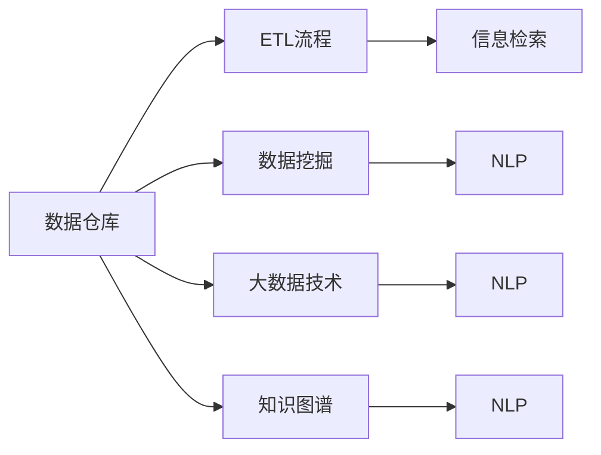

                 

## 1. 背景介绍

### 1.1 问题由来

在信息时代，人类社会正面临着前所未有的信息爆炸。据统计，每天世界上产生的数据量已超过2.5 quintillion bytes。在这样的背景下，如何有效地组织、管理和利用这些海量的数据成为了一个重要的研究课题。不仅企业和组织，个人也需要面对如何筛选、保存、检索和处理信息的问题。传统的基于人工的组织方式显然无法适应现代社会的需要，因此，需要发展一种新的信息组织和管理系统。

### 1.2 问题核心关键点

解决信息过载问题，需要从信息收集、存储、检索、利用等环节进行全方位考虑。本文将聚焦于信息组织和管理系统，尤其是基于计算机科学的解决方案。通过这些技术手段，可以自动化地收集、存储和检索信息，极大地提升信息处理的效率。

## 2. 核心概念与联系

### 2.1 核心概念概述

为更好地理解信息组织和管理系统的原理，我们首先介绍一些核心概念：

- **数据仓库**：一个用于存储企业数据的中心化平台，通常包括从不同来源收集的数据。数据仓库通过ETL(Extract, Transform, Load)流程，将各种异构数据源转化为统一的格式存储。

- **数据挖掘**：从数据仓库中提取有用的信息，通过分析发现数据中隐藏的模式和关联。数据挖掘通常需要利用机器学习算法。

- **大数据技术**：指处理和分析大规模数据集的技术，包括分布式计算、数据流处理、实时分析等。大数据技术通常利用集群和分布式存储系统。

- **知识图谱**：一种语义化的信息组织方式，通过节点和边的形式表示实体和它们之间的关系。知识图谱能够进行复杂的推理和关联查询。

- **信息检索**：从大量文本数据中快速检索出用户需要的信息。信息检索技术利用倒排索引、TF-IDF等算法，实现高效检索。

- **自然语言处理(NLP)**：使计算机能够理解、分析、生成自然语言的技术。NLP涉及语言模型、文本分类、情感分析等多个领域。

这些概念之间的逻辑关系可以通过以下Mermaid流程图来展示：



这个流程图展示了数据仓库与各核心技术之间的连接，展示了信息组织和管理系统如何从数据仓库中提取出有用的信息，通过数据挖掘、大数据技术、知识图谱和信息检索等技术手段，进行分析和检索，最终通过NLP技术实现对信息的理解、分析和生成。

## 3. 核心算法原理 & 具体操作步骤

### 3.1 算法原理概述

信息组织和管理系统通常涉及多种算法和技术，这里着重介绍基于机器学习的信息检索和数据挖掘算法。

#### 3.1.1 信息检索

信息检索的本质是匹配查询与文档的相似度。常用的信息检索算法包括：

- **基于倒排索引**：将文本转换为词汇表，并记录每个词汇在文档中出现的次数，以实现高效的检索。

- **TF-IDF算法**：通过计算每个词汇在文档中出现的频率和在整个语料库中的出现频率，评估词汇的重要性。

- **深度学习算法**：如BERT、GPT等，通过预训练模型学习文本表示，进行语义匹配检索。

#### 3.1.2 数据挖掘

数据挖掘的目标是从数据中提取有用的知识，常用的数据挖掘算法包括：

- **关联规则挖掘**：通过统计分析，发现不同属性之间的关联关系。

- **分类算法**：如决策树、随机森林、神经网络等，对数据进行分类，并预测新数据属于哪一类。

- **聚类算法**：如K-means、层次聚类等，将数据划分为不同的类别，便于进一步分析。

### 3.2 算法步骤详解

#### 3.2.1 信息检索

1. **数据预处理**：对文本进行分词、去除停用词、词干提取等预处理，以便于后续处理。

2. **建立倒排索引**：将文本转换为词汇表，记录每个词汇在文档中出现的次数和位置。

3. **查询匹配**：通过TF-IDF算法或其他相似度度量方法，计算查询与文档的相似度，找到最相关的文档。

4. **结果排序**：根据相似度得分对搜索结果进行排序，通常会使用如BM25算法等改进技术。

#### 3.2.2 数据挖掘

1. **数据收集**：从不同数据源收集数据，并进行清洗和整合。

2. **特征工程**：提取数据中的特征，如频率、权重、情感极性等，并进行归一化处理。

3. **模型训练**：选择合适的机器学习模型，并进行训练，如K-means、SVM、神经网络等。

4. **结果分析**：对模型结果进行分析，发现数据中的规律和关联，如关联规则、分类结果等。

### 3.3 算法优缺点

信息组织和管理系统的算法具有以下优点：

- **高效性**：通过自动化处理，可以大大提高信息检索和数据挖掘的效率。

- **准确性**：基于机器学习的算法，可以实现高精度的匹配和分类。

- **可扩展性**：随着数据量的增加，系统可以动态扩展，处理更多的数据。

但同时，这些算法也存在一些局限性：

- **计算资源消耗大**：如深度学习模型需要大量的计算资源，且训练时间较长。

- **数据隐私问题**：大规模数据处理可能涉及数据隐私和安全问题，需要额外的保护措施。

- **模型鲁棒性不足**：对于噪声和异常数据，模型可能出现误判。

- **模型解释性差**：机器学习模型通常是"黑盒"模型，难以解释其决策过程。

### 3.4 算法应用领域

信息组织和管理系统的算法广泛应用于以下几个领域：

- **电子商务**：通过信息检索和推荐系统，提升用户体验，增加销售额。

- **金融行业**：利用数据挖掘和风险管理模型，进行风险评估和欺诈检测。

- **医疗保健**：通过数据分析和知识图谱，提高诊断和治疗的效率。

- **教育领域**：利用数据挖掘和信息检索，个性化推荐学习内容，提高学习效果。

- **公共管理**：通过数据挖掘和信息检索，优化公共服务，提高政府效率。

## 4. 数学模型和公式 & 详细讲解 & 举例说明

### 4.1 数学模型构建

#### 4.1.1 信息检索

假设文本集合为 $D=\{d_1, d_2, ..., d_n\}$，查询为 $q$，建立倒排索引，索引结构为 $I=\{(i_1, w_1, pos_1), (i_2, w_2, pos_2), ..., (i_m, w_m, pos_m)\}$，其中 $i_k$ 是词汇表中的第 $k$ 个词汇，$w_k$ 是该词汇在查询 $q$ 中的权重，$pos_k$ 是该词汇在文档中的位置。

基于TF-IDF算法，查询 $q$ 与文档 $d_i$ 的相似度为：

$$
\text{sim}(q, d_i) = \sum_{k=1}^{m} (w_k \times tf_k \times idf_k)
$$

其中 $tf_k$ 是词汇 $w_k$ 在文档 $d_i$ 中的词频，$idf_k$ 是词汇 $w_k$ 在整个语料库中的逆文档频率。

#### 4.1.2 数据挖掘

假设数据集为 $D=\{x_1, x_2, ..., x_n\}$，模型为 $M$，训练样本为 $T=\{(x_i, y_i)\}_{i=1}^N$，其中 $y_i \in \{0, 1\}$ 表示类别标签。

分类模型的目标是最小化损失函数 $L(y_i, \hat{y_i})$，其中 $\hat{y_i}$ 是模型对 $x_i$ 的预测结果。常用的损失函数包括交叉熵损失函数：

$$
L(y_i, \hat{y_i}) = -y_i\log \hat{y_i} - (1-y_i)\log (1-\hat{y_i})
$$

### 4.2 公式推导过程

#### 4.2.1 信息检索

基于TF-IDF算法的信息检索，假设查询 $q$ 和文档 $d_i$ 的长度分别为 $l_q$ 和 $l_i$，则查询与文档的相似度为：

$$
\text{sim}(q, d_i) = \frac{\sum_{k=1}^{m} (w_k \times tf_k \times idf_k)}{\sqrt{\sum_{k=1}^{m} (w_k \times tf_k) \times \sum_{k=1}^{m} (w_k \times idf_k)}
$$

其中 $w_k$ 为查询中第 $k$ 个词汇的权重。

#### 4.2.2 数据挖掘

以K-means算法为例，假设 $D=\{x_1, x_2, ..., x_n\}$ 为数据集，$K$ 为聚类数，$C=\{c_1, c_2, ..., c_K\}$ 为聚类中心。聚类过程如下：

1. 随机初始化 $K$ 个聚类中心 $c_1, c_2, ..., c_K$。

2. 对每个数据点 $x_i$，计算其到每个聚类中心的距离 $d_i^k = \|x_i - c_k\|$。

3. 将 $x_i$ 分配到最近的聚类中心 $c_k$，形成新的聚类中心 $C'$。

4. 重复步骤2和3，直到聚类中心不再变化或达到预设的迭代次数。

### 4.3 案例分析与讲解

#### 4.3.1 信息检索

假设有一个包含100,000篇文档的数据库，现在有一个查询 "机器学习"。我们可以先构建倒排索引，然后计算查询与每个文档的相似度，最终返回最相关的10篇文档。

#### 4.3.2 数据挖掘

假设有一个医疗数据集，包含100,000个病人的信息，我们需要对这些病人进行分类，分为 "高风险" 和 "低风险" 两类。我们可以使用K-means算法进行聚类，得到两个聚类中心，每个病人根据其距离聚类中心的距离被分配到对应的类别。

## 5. 项目实践：代码实例和详细解释说明

### 5.1 开发环境搭建

在开始项目实践之前，我们需要准备好开发环境。以下是使用Python进行信息组织和管理系统开发的环境配置流程：

1. 安装Anaconda：从官网下载并安装Anaconda，用于创建独立的Python环境。

2. 创建并激活虚拟环境：
```bash
conda create -n info-system python=3.8 
conda activate info-system
```

3. 安装相关库：
```bash
pip install pandas numpy scikit-learn torch transformers
```

### 5.2 源代码详细实现

下面我们以基于TF-IDF算法的信息检索系统为例，给出使用Python的实现。

```python
import pandas as pd
from sklearn.feature_extraction.text import TfidfVectorizer
from sklearn.metrics.pairwise import cosine_similarity

# 读取文本数据
df = pd.read_csv('data.txt', sep='\t', header=None)
df.columns = ['id', 'text']

# 构建倒排索引
vectorizer = TfidfVectorizer(stop_words='english')
tfidf_matrix = vectorizer.fit_transform(df['text'])

# 计算相似度
query = 'machine learning'
query_vector = vectorizer.transform([query])
similarity = cosine_similarity(query_vector, tfidf_matrix).flatten()

# 返回最相关的文档
top_documents = df['id'].iloc[similarity.argsort()[-10:]][::-1]
print(top_documents)
```

### 5.3 代码解读与分析

这里我们详细解读一下关键代码的实现细节：

- **数据预处理**：使用pandas库读取文本数据，并进行分列处理。
- **构建倒排索引**：使用sklearn库的TfidfVectorizer构建TF-IDF矩阵，去除停用词。
- **计算相似度**：使用sklearn库的cosine_similarity计算查询与文档的相似度。
- **返回最相关的文档**：根据相似度排序，返回最相关的10篇文档。

## 6. 实际应用场景

### 6.1 电子商务

在电子商务领域，信息检索和推荐系统被广泛应用。通过信息检索系统，客户可以快速找到所需的产品信息，提高购物体验。通过推荐系统，可以根据客户的历史行为和偏好，推荐相关产品，增加销售额。

### 6.2 金融行业

金融行业需要实时监测市场动态，以便及时做出决策。通过数据挖掘和知识图谱，可以对市场数据进行分析和预测，进行风险评估和欺诈检测。

### 6.3 医疗保健

医疗保健行业需要大量医疗数据进行分析和处理。通过数据挖掘和信息检索，可以提高诊断和治疗的效率，减少误诊和漏诊。

### 6.4 教育领域

教育领域需要根据学生的学习数据进行个性化推荐，提高学习效果。通过数据挖掘和信息检索，可以为每个学生推荐适合的课程和教材。

## 7. 工具和资源推荐

### 7.1 学习资源推荐

为了帮助开发者系统掌握信息组织和管理系统的理论基础和实践技巧，这里推荐一些优质的学习资源：

1. 《数据科学与机器学习》课程：由斯坦福大学开设，涵盖数据科学和机器学习的核心内容，包括数据预处理、特征工程、模型训练等。

2. 《大数据技术与应用》书籍：深入浅出地介绍了大数据技术的原理和应用，涵盖Hadoop、Spark、Hive等主流技术。

3. 《深度学习》书籍：全面介绍了深度学习的基础知识和应用，涵盖卷积神经网络、循环神经网络、生成对抗网络等。

4. 《信息检索与数据挖掘》课程：由北京大学开设，涵盖信息检索和数据挖掘的基本概念和算法，包括TF-IDF、K-means等。

5. 《知识图谱构建与分析》课程：由清华大学开设，涵盖知识图谱的构建和分析方法，包括节点嵌入、图神经网络等。

通过对这些资源的学习实践，相信你一定能够快速掌握信息组织和管理系统的精髓，并用于解决实际的信息处理问题。

### 7.2 开发工具推荐

高效的开发离不开优秀的工具支持。以下是几款用于信息组织和管理系统开发的常用工具：

1. Apache Hadoop：一个开源的分布式计算框架，用于处理大规模数据。

2. Apache Spark：一个快速的分布式计算框架，支持流式处理和机器学习。

3. Apache Hive：一个基于Hadoop的数据仓库系统，支持SQL查询。

4. Elasticsearch：一个全文搜索引擎，用于高效的信息检索和文本分析。

5. TensorFlow：由Google主导开发的深度学习框架，支持分布式训练。

6. PyTorch：一个基于Python的深度学习框架，灵活的动态计算图，适合快速迭代研究。

合理利用这些工具，可以显著提升信息组织和管理系统的开发效率，加快创新迭代的步伐。

### 7.3 相关论文推荐

信息组织和管理系统的研究领域十分广泛，以下是几篇奠基性的相关论文，推荐阅读：

1. "Introduction to Information Retrieval" by Christopher D. Manning and Prabhakar Raghavan（《信息检索导论》）。

2. "Machine Learning for Health Data Science" by Andrew Ng（《健康数据科学中的机器学习》）。

3. "Data Mining: Concepts and Techniques" by Han, Kamber and Pei（《数据挖掘概念与技术》）。

4. "Knowledge Graphs: Concepts, Approaches, Methods and Applications" by Zhiqing He（《知识图谱：概念、方法与应用》）。

5. "Semantic Search and Semantic Information Retrieval" by Bhaskar Dasgupta and Tomás晒了哥斯达黎加（《语义搜索与语义信息检索》）。

这些论文代表了大规模数据处理和信息组织技术的发展脉络。通过学习这些前沿成果，可以帮助研究者把握学科前进方向，激发更多的创新灵感。

## 8. 总结：未来发展趋势与挑战

### 8.1 总结

本文对信息组织和管理系统的原理和实践进行了全面系统的介绍。首先阐述了信息过载问题的背景和关键点，明确了信息组织和管理系统的重要性和作用。其次，从信息检索和数据挖掘的算法角度，详细讲解了算法的原理和操作步骤，给出了代码实例和详细解释。同时，本文还广泛探讨了信息组织和管理系统在多个行业领域的应用前景，展示了系统的广泛适用性。此外，本文精选了信息组织和管理技术的各类学习资源，力求为读者提供全方位的技术指引。

通过本文的系统梳理，可以看到，信息组织和管理系统在处理海量数据、提升信息检索和数据挖掘效率方面具有重要作用。这些技术手段不仅在学术界得到了广泛应用，也在工业界产生了巨大的经济效益。未来，伴随技术的不断进步，信息组织和管理系统将进一步优化，为各行业带来更多价值。

### 8.2 未来发展趋势

展望未来，信息组织和管理系统的发展趋势如下：

1. **自动化程度提升**：随着AI技术的发展，信息组织和管理系统将越来越自动化，数据预处理、特征工程、模型训练等环节将更加智能化。

2. **实时性增强**：数据流处理和实时分析技术的成熟，将使信息组织和管理系统能够实时处理和分析数据，满足高时效性的需求。

3. **跨领域融合**：信息组织和管理技术将与其他技术领域（如机器视觉、语音识别等）进行深度融合，形成跨领域的信息处理系统。

4. **分布式计算**：大规模数据处理需要分布式计算框架的支持，信息组织和管理系统将进一步优化分布式算法，提高系统的可扩展性和计算效率。

5. **隐私保护**：数据隐私和安全问题将日益受到重视，信息组织和管理系统需要设计更加完善的隐私保护机制，确保数据安全。

6. **模型可解释性**：信息组织和管理系统的模型需要具备更好的可解释性，便于用户理解和信任，解决"黑盒"模型的局限性。

以上趋势凸显了信息组织和管理技术的广阔前景。这些方向的探索发展，必将进一步提升系统的性能和应用范围，为信息处理带来新的突破。

### 8.3 面临的挑战

尽管信息组织和管理系统已经取得了显著成就，但在迈向更加智能化、普适化应用的过程中，它仍面临着诸多挑战：

1. **计算资源消耗大**：大规模数据处理需要高性能计算资源，如何降低计算成本，提高计算效率，是一个重要挑战。

2. **数据隐私问题**：大规模数据处理可能涉及数据隐私和安全问题，如何保护数据隐私，避免数据泄露，是一个重要问题。

3. **模型鲁棒性不足**：模型面对噪声和异常数据时，可能出现误判，如何提高模型的鲁棒性和泛化性，是一个重要研究方向。

4. **模型可解释性差**：信息组织和管理系统的模型通常是"黑盒"模型，难以解释其决策过程，如何提高模型的可解释性，是一个重要研究方向。

5. **数据标注成本高**：信息检索和数据挖掘需要大量标注数据，如何降低数据标注成本，提高数据质量，是一个重要问题。

6. **数据质量问题**：数据质量问题可能影响信息检索和数据挖掘的精度，如何提高数据质量，是一个重要研究方向。

正视信息组织和管理系统面临的这些挑战，积极应对并寻求突破，将是大规模数据处理技术走向成熟的必由之路。相信随着学界和产业界的共同努力，这些挑战终将一一被克服，信息组织和管理系统必将在构建智能信息处理系统中扮演越来越重要的角色。

### 8.4 研究展望

未来，信息组织和管理技术的研究方向如下：

1. **自动化预处理**：开发自动化数据预处理工具，减少人工干预，提高数据处理效率。

2. **深度学习应用**：探索深度学习在信息检索和数据挖掘中的应用，提升系统的精度和效果。

3. **跨领域融合**：探索信息组织和管理技术与其他技术领域的融合，形成跨领域的信息处理系统。

4. **分布式计算**：开发分布式计算框架，提高大规模数据处理的效率和可扩展性。

5. **隐私保护**：设计更加完善的隐私保护机制，保护数据隐私和安全。

6. **模型可解释性**：研究提高模型可解释性的方法，增强系统的透明度和可信度。

7. **实时处理**：探索实时数据处理技术，实现高时效性的信息组织和管理。

这些研究方向将推动信息组织和管理技术的不断进步，为构建智能信息处理系统提供更强大的技术支持。面向未来，信息组织和管理技术需要不断突破现有技术瓶颈，应对新的挑战，以实现更加智能化、普适化的应用。

## 9. 附录：常见问题与解答

**Q1: 信息组织和管理系统与传统的信息管理系统的区别是什么？**

A: 信息组织和管理系统使用自动化的技术手段，通过机器学习、数据挖掘等方法，对信息进行智能化处理和分析，而传统的信息管理系统主要依靠人工操作和规则处理。自动化技术使得信息组织和管理系统可以处理更大量、更复杂的信息，具有更高的处理效率和准确性。

**Q2: 如何选择合适的算法进行信息检索和数据挖掘？**

A: 选择合适的算法需要考虑数据类型、任务需求、计算资源等多个因素。通常情况下，对于大规模文本数据，可以使用TF-IDF等基于词频的算法；对于结构化数据，可以使用分类和聚类算法。需要根据具体任务选择合适的算法，并进行实验验证。

**Q3: 信息组织和管理系统在实际应用中需要注意哪些问题？**

A: 在实际应用中，需要注意以下几个问题：
1. 数据预处理：对数据进行清洗和标准化，减少噪声和异常数据的影响。
2. 特征工程：提取有意义的特征，提高模型的精度。
3. 模型训练：选择合适的模型和算法，并进行充分训练。
4. 模型评估：使用合适的评估指标，如准确率、召回率等，评估模型的性能。
5. 数据隐私：保护数据隐私和安全，防止数据泄露。
6. 系统部署：合理设计系统架构，提高系统的稳定性和可扩展性。

这些问题的解决是确保信息组织和管理系统有效运行的关键。

**Q4: 如何提高信息组织和管理系统的可解释性？**

A: 提高系统可解释性是当前研究的一个重要方向。可以通过以下方法提高系统的可解释性：
1. 使用可解释的模型：选择可解释性较高的模型，如决策树、逻辑回归等。
2. 生成可解释的特征：提取有意义的特征，生成可解释的输出。
3. 提供可视化工具：开发可视化工具，帮助用户理解系统的内部工作机制。
4. 文档化系统：编写系统文档，详细描述系统的设计和实现细节。
5. 进行解释性分析：通过模型解释方法，分析模型的决策过程。

通过以上方法，可以提高系统的透明度和可信度，增强用户对系统的信任和理解。

---

作者：禅与计算机程序设计艺术 / Zen and the Art of Computer Programming

