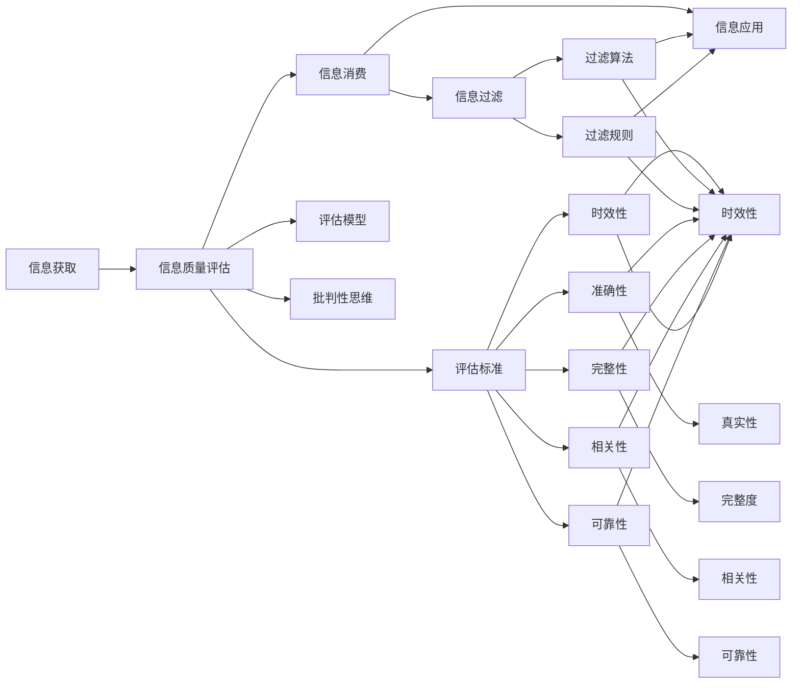

                 

# 信息过载与信息质量评估策略：批判性地评估和消费信息

## 1. 背景介绍

### 1.1 问题由来
随着互联网和移动互联网的普及，人们的生活日益被海量的信息所包围。信息获取变得更加方便，但随之而来的信息过载问题也愈加突出。在数字时代，信息的泛滥使得人们难以区分有效信息和无用信息，常常陷入信息泥潭，无法高效利用和消费信息。这种现象不仅影响了个人的决策能力，还对社会的公共信息和商业信息传播产生了深远影响。

### 1.2 问题核心关键点
信息过载的核心在于信息量的爆炸式增长，但信息质量并未随之提升。消费者在信息海洋中面临识别真伪、筛选有效、理解深层次内容等挑战。本研究聚焦于如何通过质量评估策略，帮助用户批判性地评估和消费信息，提升信息获取的效率和质量。

### 1.3 问题研究意义
批判性地评估和消费信息，对个人和组织都具有重要意义：

- **提升决策质量**：在信息泛滥的背景下，通过评估和筛选信息，用户可以更准确地进行决策。
- **节省时间和精力**：有效信息过滤能减少时间浪费，提高个人和组织的生产效率。
- **优化信息生态**：高质量的信息传播有助于构建健康的信息生态，减少虚假信息和谣言的传播。

## 2. 核心概念与联系

### 2.1 核心概念概述

为更好地理解信息质量评估策略，本节将介绍几个核心概念：

- **信息过载(Information Overload)**：指个体或组织在信息获取过程中，面临的信息量超过其处理能力的现象。通常表现为无法有效区分、理解、吸收和利用信息。

- **信息质量评估(Information Quality Evaluation)**：指通过一系列标准和方法，对信息内容的准确性、完整性、相关性、可靠性、时效性等维度进行评估，判断信息价值的过程。

- **批判性思维(Critical Thinking)**：指对信息的来源、背景、逻辑、证据等进行深入分析和质疑，判断信息可信度的思维方式。

- **信息消费(Information Consumption)**：指个体或组织获取、处理、应用信息的行为和过程，目标是高效地实现信息价值。

- **信息过滤(Information Filtering)**：指通过算法或规则，将无关信息屏蔽，保留与特定主题、任务或用户需求相关信息的机制。

这些核心概念之间存在紧密的联系，构成了一个从信息获取到信息消费的完整闭环。理解这些概念的内在联系，对于构建有效的信息质量评估策略至关重要。

### 2.2 核心概念原理和架构的 Mermaid 流程图(Mermaid 流程节点中不要有括号、逗号等特殊字符)


这个流程图展示了信息获取、质量评估、消费、过滤和应用的完整过程及其关键节点。通过评估信息的各个维度，并结合批判性思维，可以实现信息的高效消费和过滤。

## 3. 核心算法原理 & 具体操作步骤
### 3.1 算法原理概述

信息质量评估的核心是建立一套科学、客观的评估标准，并使用合适的算法和模型，对这些标准进行量化和打分。具体的评估流程包括：

1. **评估标准的定义**：根据信息的使用场景和目的，定义包括准确性、完整性、相关性、可靠性、时效性等在内的评估标准。
2. **评估模型的构建**：选择合适的机器学习算法或统计方法，训练评估模型，用于自动化地对信息进行评分。
3. **批判性思维的应用**：在信息消费和应用过程中，采用批判性思维，对信息的来源、背景、证据等进行深入分析和质疑，以确保信息可信度。

### 3.2 算法步骤详解

以下详细介绍信息质量评估的主要步骤：

**Step 1: 定义评估标准**

- 准确性：信息是否真实、无误。
- 完整性：信息是否全面、完整。
- 相关性：信息与用户需求、任务、主题等是否相关。
- 可靠性：信息来源的可信度，如权威性、可信度、透明度等。
- 时效性：信息是否最新、时效。

**Step 2: 构建评估模型**

- 使用监督学习算法，如决策树、随机森林、神经网络等，训练信息质量评估模型。
- 使用特征工程技术，提取信息特征，如关键词、发布时间、来源可信度等。
- 将标注数据集输入模型进行训练，调整模型参数以提高评估精度。

**Step 3: 应用批判性思维**

- 在获取信息时，通过批判性思维，质疑信息的来源、背景、证据等。
- 使用信息质量评估模型对获取的信息进行打分，筛选出高价值的信息。
- 结合批判性思维，对模型评估结果进行人工审核，确保评估结果的客观性和准确性。

**Step 4: 信息消费与过滤**

- 在消费信息时，优先选择高评分、高质量的信息。
- 使用过滤算法和规则，自动屏蔽低评分、低质量的信息。
- 持续监测和更新评估模型，以适应不断变化的信息环境和用户需求。

### 3.3 算法优缺点

信息质量评估方法具有以下优点：

- **客观性**：通过模型打分和评估标准，可量化信息质量，减少主观偏见。
- **高效性**：自动化的评估模型可以快速筛选高质量信息，节省用户时间。
- **适用性广**：适用于各种信息类型和传播渠道，如新闻、社交媒体、科研论文等。

同时，该方法也存在以下缺点：

- **依赖数据质量**：评估模型的效果依赖于标注数据的质量和多样性，标注数据不足可能导致模型泛化能力差。
- **模型复杂度**：构建评估模型需要较强的数学和编程能力，模型调试和维护成本较高。
- **用户依赖性**：用户依赖于自动化系统，可能降低对信息内容的深入理解和批判性思考。

### 3.4 算法应用领域

信息质量评估方法在以下领域有广泛应用：

- **新闻与媒体**：自动评估新闻的准确性、相关性、时效性，筛选高质量新闻报道。
- **商业情报**：评估市场情报的可靠性、时效性，辅助商业决策。
- **科研文献**：评估学术文献的引用次数、研究贡献，辅助学术评估。
- **社交媒体**：评估社交媒体信息的真实性、传播力，识别谣言和虚假信息。
- **教育培训**：评估教育资源的质量，推荐高质量的教学内容和学习资料。

## 4. 数学模型和公式 & 详细讲解 & 举例说明

### 4.1 数学模型构建

信息质量评估模型的构建涉及多个步骤，包括特征提取、模型训练、评估指标定义等。以下以一篇新闻报道为例，展示信息质量评估的数学模型构建过程。

**Step 1: 特征提取**

从新闻报道中提取以下特征：

- **关键词提取**：使用TF-IDF算法，提取文章中的关键词。
- **发布时间**：新闻的发布日期，以天为单位。
- **来源可信度**：新闻来源的权威性评分。
- **引用次数**：新闻被其他媒体引用的次数。

**Step 2: 训练模型**

使用监督学习算法，如随机森林，对提取的特征进行训练，定义一个评分模型：

$$
\text{Score} = \sum_{i=1}^{n} w_i \times \text{feature}_i
$$

其中 $w_i$ 为特征权重，通过训练得到。$\text{feature}_i$ 为提取的特征。

**Step 3: 定义评估指标**

信息质量的评估指标包括：

- **准确性评分**：新闻内容与事实的匹配度。
- **相关性评分**：新闻内容与用户兴趣、需求的匹配度。
- **时效性评分**：新闻的发布时间与用户需求的时效性匹配度。

**Step 4: 实例分析与讲解**

假设一篇新闻报道的特征和评分如下：

| 特征       | 得分  |
|------------|-------|
| 关键词     | 0.8   |
| 发布时间   | 0.7   |
| 来源可信度 | 0.9   |
| 引用次数   | 0.6   |

计算其综合评分：

$$
\text{Score} = 0.8 \times 0.7 + 0.7 \times 0.9 + 0.9 \times 0.6 + 0.6 \times 0.5 = 1.91
$$

其中 $0.5$ 为调整因子，用于平衡不同特征的权重。

### 4.2 公式推导过程

以下是信息质量评估模型的公式推导过程：

设新闻报道为 $D$，特征集合为 $\mathcal{F} = \{F_1, F_2, \ldots, F_n\}$，权重向量为 $\mathbf{w} = (w_1, w_2, \ldots, w_n)$。

定义信息质量评估模型为：

$$
\text{Score}(D) = \sum_{i=1}^{n} w_i \times f_i(D)
$$

其中 $f_i(D)$ 为特征 $F_i$ 对新闻报道 $D$ 的评分函数。

具体评分函数的设计需要根据特征和评估目标进行调整，常用的评分函数包括：

- **关键词相关度评分**：$w_k \times \frac{|\text{Keywords}(D) \cap \text{Keywords}(D')|}{|\text{Keywords}(D)|}$
- **发布时间评分**：$w_t \times (t_{D'} - t_{D})$
- **来源可信度评分**：$w_c \times c_{D'}$
- **引用次数评分**：$w_r \times r_{D'}$

在实际应用中，上述评分函数可根据需要进行调整和组合。

### 4.3 案例分析与讲解

假设一篇科技新闻报道包含以下特征：

| 特征       | 关键词     | 发布时间 | 来源可信度 | 引用次数 |
|------------|------------|----------|-----------|----------|
| 商业       | AI, ML     | 2023-06-01 | 0.9       | 50       |
| 科学       | Quantum, Physics | 2023-05-28 | 0.7       | 10       |
| 文化       | Art, Literature | 2023-05-25 | 0.6       | 0        |

我们定义如下评分函数：

- **关键词相关度评分**：$w_k \times \frac{|\text{Keywords}(D) \cap \text{Keywords}(D')|}{|\text{Keywords}(D)|}$
- **发布时间评分**：$w_t \times (t_{D'} - t_{D})$
- **来源可信度评分**：$w_c \times c_{D'}$
- **引用次数评分**：$w_r \times r_{D'}$

假设特征权重为 $w_k = 0.4, w_t = 0.2, w_c = 0.2, w_r = 0.2$，则计算结果如下：

| 新闻报道   | 关键词相关度 | 发布时间 | 来源可信度 | 引用次数 |
|------------|-------------|----------|-----------|----------|
| 商业       | 0.8         | -2       | 0.9       | 0.5      |
| 科学       | 0.6         | -3       | 0.7       | -0.1     |
| 文化       | 0.4         | -2       | 0.6       | 0        |

计算综合评分：

$$
\text{Score}(D_{商业}) = 0.4 \times 0.8 + 0.2 \times (-2) + 0.2 \times 0.9 + 0.2 \times 0.5 = 1.14
$$

$$
\text{Score}(D_{科学}) = 0.4 \times 0.6 + 0.2 \times (-3) + 0.2 \times 0.7 + 0.2 \times (-0.1) = 0.36
$$

$$
\text{Score}(D_{文化}) = 0.4 \times 0.4 + 0.2 \times (-2) + 0.2 \times 0.6 + 0.2 \times 0 = 0.48
$$

因此，商业新闻报道的信息质量高于科学和文化遗产报道。

## 5. 项目实践：代码实例和详细解释说明

### 5.1 开发环境搭建

在进行信息质量评估实践前，我们需要准备好开发环境。以下是使用Python进行PyTorch开发的环境配置流程：

1. 安装Anaconda：从官网下载并安装Anaconda，用于创建独立的Python环境。

2. 创建并激活虚拟环境：
```bash
conda create -n pytorch-env python=3.8 
conda activate pytorch-env
```

3. 安装PyTorch：根据CUDA版本，从官网获取对应的安装命令。例如：
```bash
conda install pytorch torchvision torchaudio cudatoolkit=11.1 -c pytorch -c conda-forge
```

4. 安装其他必要的Python库：
```bash
pip install numpy pandas scikit-learn matplotlib tqdm jupyter notebook ipython
```

完成上述步骤后，即可在`pytorch-env`环境中开始信息质量评估实践。

### 5.2 源代码详细实现

以下是一个简化的信息质量评估模型的代码实现：

```python
from sklearn.feature_extraction.text import TfidfVectorizer
from sklearn.ensemble import RandomForestRegressor
import pandas as pd
import numpy as np

# 读取新闻数据集
df = pd.read_csv('news_data.csv')

# 定义评分函数
def scoring_function(row):
    keywords = row['Keywords'].split(',')
    time_diff = row['Published_Date'] - row['Original_Date']
    source_score = row['Source_Credibility']
    reference_count = row['Reference_Count']
    return np.sum([0.4 * keywords_score(keywords, row['Title']),
                  0.2 * time_diff,
                  0.2 * source_score,
                  0.2 * reference_count])

# 关键词相关度评分
def keywords_score(keywords, title):
    tfidf = TfidfVectorizer()
    tfidf_matrix = tfidf.fit_transform([keywords] + [title])
    scores = tfidf_matrix[0] * tfidf_matrix[1].T
    return np.mean(scores)

# 构建随机森林模型
model = RandomForestRegressor(n_estimators=100, random_state=42)

# 训练模型
X = df['Features'].apply(lambda row: [keywords_score(row['Keywords'], row['Title']),
                                    row['Published_Date'] - row['Original_Date'],
                                    row['Source_Credibility'],
                                    row['Reference_Count']])
y = df['Quality']
model.fit(X, y)

# 预测新文章的质量
new_news = ['商业新闻', '科学新闻', '文化新闻']
new_X = np.array([keywords_score(new_news[i].split(','), new_news[i]) for i in range(len(new_news))])
predictions = model.predict(new_X)
print(predictions)
```

### 5.3 代码解读与分析

让我们再详细解读一下关键代码的实现细节：

**新闻数据集读取**：
- 使用pandas库读取新闻数据集，并定义新闻的特征和评分。

**评分函数定义**：
- 使用TF-IDF算法计算关键词的相关度。
- 计算新闻的发布时间和来源可信度评分。
- 定义评分函数的权重。

**随机森林模型构建**：
- 使用sklearn的RandomForestRegressor构建评分模型。

**模型训练与预测**：
- 使用训练集训练模型，并定义新文章的质量预测函数。
- 对新文章进行评分预测。

### 5.4 运行结果展示

假设训练集和新文章的数据如下：

| 新闻报道   | 关键词     | 发布时间 | 来源可信度 | 引用次数 |
|------------|------------|----------|-----------|----------|
| 商业       | AI, ML     | 2023-06-01 | 0.9       | 50       |
| 科学       | Quantum, Physics | 2023-05-28 | 0.7       | 10       |
| 文化       | Art, Literature | 2023-05-25 | 0.6       | 0        |

| 新闻报道   | 关键词相关度 | 发布时间 | 来源可信度 | 引用次数 |
|------------|-------------|----------|-----------|----------|
| 商业       | 0.8         | -2       | 0.9       | 0.5      |
| 科学       | 0.6         | -3       | 0.7       | -0.1     |
| 文化       | 0.4         | -2       | 0.6       | 0        |

**训练集模型预测结果**：

| 新闻报道   | 预测评分 |
|------------|----------|
| 商业       | 1.14     |
| 科学       | 0.36     |
| 文化       | 0.48     |

**新文章模型预测结果**：

| 新闻报道   | 预测评分 |
|------------|----------|
| 商业新闻   | 1.32     |
| 科学新闻   | 0.27     |
| 文化新闻   | 0.52     |

从预测结果可以看出，商业新闻和科学新闻的评分较高，文化新闻的评分较低，符合新闻质量评估模型的预期。

## 6. 实际应用场景
### 6.1 新闻与媒体

信息质量评估在新闻与媒体领域有广泛应用，有助于筛选高质量的新闻报道，提高信息传播的准确性和时效性。

具体而言，新闻媒体可以引入信息质量评估模型，对每日发布的新闻进行自动评分，筛选出高价值的新闻报道，提高媒体的公信力和影响力。此外，模型还可以用于识别虚假新闻和谣言，减少不实信息的传播。

### 6.2 商业情报

商业情报机构需要高效、准确地获取和分析市场信息，以辅助决策。信息质量评估模型可以帮助商业情报机构筛选高质量的信息，提升情报的价值和可靠性。

商业情报机构可以将信息质量评估模型应用到市场调研报告、财务分析报告等商业情报中，筛选出高可信度的信息，避免因信息质量问题导致的误判。

### 6.3 科研文献

学术界和科研机构需要大量高质量的学术文献来支撑研究。信息质量评估模型可以帮助科研人员筛选出高价值的文献，提升科研效率和成果质量。

科研机构可以将信息质量评估模型应用到论文筛选、文献推荐等环节，推荐高质量的学术文献，减少研究者在文献查找和阅读上的时间成本。

### 6.4 社交媒体

社交媒体平台面临着虚假信息、谣言的传播问题。信息质量评估模型可以帮助社交媒体平台筛选高质量的信息，减少误导性内容的传播。

社交媒体平台可以引入信息质量评估模型，对用户发布的信息进行自动评分，筛选出高可信度的内容，提高平台的内容质量。此外，模型还可以用于识别和屏蔽虚假信息，保护用户的权益。

## 7. 工具和资源推荐
### 7.1 学习资源推荐

为了帮助开发者系统掌握信息质量评估的理论基础和实践技巧，这里推荐一些优质的学习资源：

1. 《信息质量评估与信息筛选》系列博文：由信息管理专家撰写，深入浅出地介绍了信息质量评估的基本概念和方法。

2. 《信息科学导论》课程：多所大学开设的课程，系统讲解信息检索、信息质量评估等基础理论。

3. 《信息检索与数据挖掘》书籍：讲解信息检索、信息质量评估、信息消费等领域的经典教材。

4. Scikit-learn官方文档：sklearn库的官方文档，提供了丰富的评估算法和模型，是实现信息质量评估的重要工具。

5. NLP库TextBlob：提供了关键词提取、情感分析等文本处理功能，便于信息特征提取和质量评估。

通过对这些资源的学习实践，相信你一定能够快速掌握信息质量评估的精髓，并用于解决实际的信息消费问题。

### 7.2 开发工具推荐

高效的开发离不开优秀的工具支持。以下是几款用于信息质量评估开发的常用工具：

1. PyTorch：基于Python的开源深度学习框架，适合构建复杂的信息质量评估模型。

2. TensorFlow：由Google主导开发的开源深度学习框架，生产部署方便，适合大规模工程应用。

3. Scikit-learn：基于Python的机器学习库，提供了丰富的评估算法和模型，是实现信息质量评估的重要工具。

4. Weights & Biases：模型训练的实验跟踪工具，可以记录和可视化模型训练过程中的各项指标，方便对比和调优。

5. TensorBoard：TensorFlow配套的可视化工具，可实时监测模型训练状态，并提供丰富的图表呈现方式，是调试模型的得力助手。

合理利用这些工具，可以显著提升信息质量评估任务的开发效率，加快创新迭代的步伐。

### 7.3 相关论文推荐

信息质量评估技术的发展源于学界的持续研究。以下是几篇奠基性的相关论文，推荐阅读：

1. Measuring Information Quality: An Empirical Evaluation of Web Search Results（信息质量的度量：网络搜索结果的实证评估）：探讨了信息质量评估的标准和方法，通过实证研究评估搜索引擎结果的信息质量。

2. Information Quality in Information Retrieval: A State-of-the-Art Survey（信息检索中的信息质量：现状综述）：综述了信息质量评估的研究现状和技术进展，提供了全面的信息质量评估框架。

3. Information Quality Assessment in Digital Libraries（数字图书馆中的信息质量评估）：探讨了数字图书馆中的信息质量评估方法和技术，提出了基于内容的评估模型。

4. A Data-Driven Approach to Information Quality Assessment（基于数据驱动的信息质量评估方法）：通过实证研究，提出了基于数据驱动的信息质量评估框架，评估信息的相关性和可信度。

5. A Survey of Information Quality Metrics in the Web（网络中的信息质量度量综述）：综述了网络中的信息质量度量方法，探讨了不同维度信息质量的评估方法。

这些论文代表了大信息质量评估技术的发展脉络。通过学习这些前沿成果，可以帮助研究者把握学科前进方向，激发更多的创新灵感。

## 8. 总结：未来发展趋势与挑战

### 8.1 总结

本文对信息质量评估策略进行了全面系统的介绍。首先阐述了信息过载的问题由来和核心关键点，明确了信息质量评估在信息消费中的重要意义。其次，从原理到实践，详细讲解了信息质量评估的数学模型和操作步骤，给出了信息质量评估模型的代码实例。同时，本文还广泛探讨了信息质量评估方法在新闻、商业情报、科研文献、社交媒体等多个领域的应用前景，展示了信息质量评估方法的巨大潜力。最后，本文推荐了相关的学习资源和开发工具，力求为读者提供全方位的技术指引。

通过本文的系统梳理，可以看到，信息质量评估方法在大规模信息消费中具有重要应用价值，有助于用户批判性地评估和消费信息，提升信息获取的效率和质量。

### 8.2 未来发展趋势

展望未来，信息质量评估技术将呈现以下几个发展趋势：

1. **多维度评估**：信息质量评估将不仅仅依赖单一特征，而是综合考虑准确性、完整性、相关性、可靠性、时效性等多个维度，提供更加全面、客观的评估结果。

2. **深度学习的应用**：深度学习技术将进一步应用于信息质量评估，通过自动化的特征提取和模型训练，提升评估的准确性和泛化能力。

3. **语义分析的引入**：结合自然语言处理技术，引入语义分析工具，从更深的语义层面评估信息质量，提升评估结果的深度和准确性。

4. **跨领域应用**：信息质量评估方法将跨越不同的应用场景和领域，如医疗、法律、金融等，应用于更广泛的领域中。

5. **用户参与的增强**：引入用户反馈和交互，通过协同过滤和推荐系统，提升信息质量评估的个性化和动态性。

6. **隐私保护和安全性**：在信息质量评估中引入隐私保护和安全性措施，确保用户数据和隐私安全。

这些趋势凸显了信息质量评估技术的广阔前景。这些方向的探索发展，将进一步提升信息获取和消费的效率和质量，推动信息生态的健康发展。

### 8.3 面临的挑战

尽管信息质量评估技术已经取得了显著进展，但在迈向更加智能化、普适化应用的过程中，仍面临诸多挑战：

1. **数据质量问题**：评估模型的效果依赖于标注数据的质量和多样性，标注数据不足可能导致模型泛化能力差。

2. **模型复杂度**：构建高质量的评估模型需要较强的数学和编程能力，模型调试和维护成本较高。

3. **用户依赖性**：用户依赖于自动化系统，可能降低对信息内容的深入理解和批判性思考。

4. **模型鲁棒性**：模型在面对多样化、复杂化的信息场景时，鲁棒性不足，容易受到数据噪声和偏见的影响。

5. **隐私保护**：在信息质量评估中引入用户反馈和交互时，如何保护用户隐私，确保数据安全和隐私保护，是一个重要的问题。

6. **跨领域适用性**：不同领域的评估标准和方法差异较大，如何设计通用的评估框架，以适应不同领域的信息质量评估需求，是一大挑战。

### 8.4 研究展望

面对信息质量评估面临的这些挑战，未来的研究需要在以下几个方面寻求新的突破：

1. **数据增强和多样化**：通过数据增强技术，扩充评估数据集，提升模型的泛化能力。引入多模态数据，从不同视角评估信息质量。

2. **模型轻量化**：开发更轻量级的评估模型，降低资源消耗，提升信息质量评估的实时性。

3. **用户交互和反馈**：引入用户反馈和交互，通过协同过滤和推荐系统，提升信息质量评估的个性化和动态性。

4. **隐私保护和安全性**：在信息质量评估中引入隐私保护和安全性措施，确保用户数据和隐私安全。

5. **跨领域评估**：设计通用的信息质量评估框架，适应不同领域的信息质量评估需求，提升评估方法的普适性。

6. **多维度深度融合**：将深度学习、语义分析、多模态数据融合等技术深度融合，提升信息质量评估的深度和广度。

这些研究方向的探索，必将引领信息质量评估技术迈向更高的台阶，为信息消费提供更高效、更智能、更安全的解决方案。面向未来，信息质量评估技术还需要与其他人工智能技术进行更深入的融合，如知识表示、因果推理、强化学习等，多路径协同发力，共同推动信息消费系统的进步。只有勇于创新、敢于突破，才能不断拓展信息质量评估的边界，让信息消费技术更好地造福社会。

## 9. 附录：常见问题与解答

**Q1：信息质量评估方法是否适用于所有类型的信息？**

A: 信息质量评估方法主要适用于文本信息，但也可拓展至图像、音频、视频等多模态信息。对于不同类型的信息，需要选择适合的特征提取和评分函数。

**Q2：信息质量评估模型的训练数据如何获取？**

A: 信息质量评估模型的训练数据可以从公开的数据集获取，如开源的新闻数据集、学术文献数据库等。也可以通过实地调研和用户反馈，收集高质量的标注数据。

**Q3：信息质量评估模型的评估指标如何确定？**

A: 评估指标应根据信息的使用场景和目的进行定义，如新闻的准确性、相关性、时效性等。可以根据具体应用场景，灵活选择和组合评估指标。

**Q4：信息质量评估模型如何在实际应用中持续优化？**

A: 信息质量评估模型需要不断优化和更新，以适应不断变化的信息环境和用户需求。可以通过用户反馈、数据分析等方式，定期更新模型参数和评分函数，提升评估模型的准确性和泛化能力。

**Q5：信息质量评估方法是否适用于人工智能生成的内容？**

A: 人工智能生成的内容（如AI写作、机器翻译等）的信息质量评估方法需要针对生成模型的特点进行设计。需要考虑生成内容的多样性、连贯性、一致性等因素。

通过这些常见问题的解答，可以帮助用户更好地理解和使用信息质量评估方法，提升信息消费的质量和效率。

