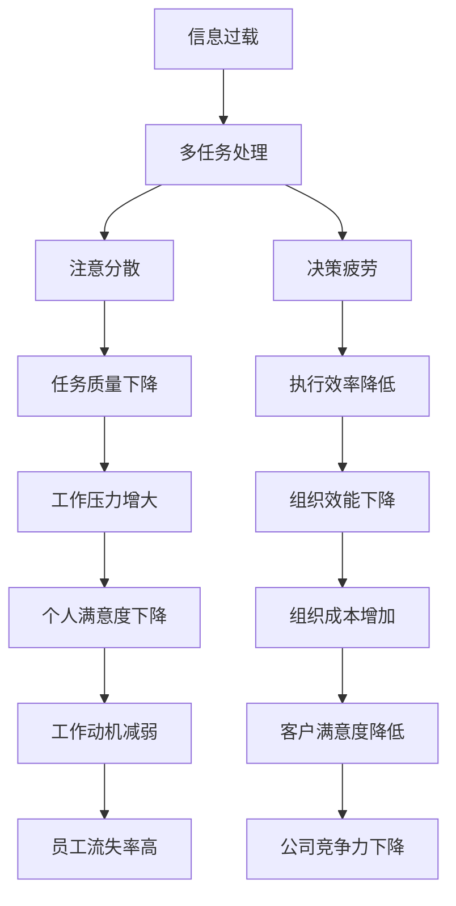

                 

# 信息过载与多任务处理的陷阱：单一任务处理的优势

在现代信息化时代，我们被源源不断的信息流所包围，这不仅包括文字、图片、视频，还有各种社交媒体、新闻推送、广告弹窗等。虽然这些信息为我们的生活带来了便利，但同时也带来了信息过载的问题。为了应对这一挑战，很多人认为多任务处理是解决信息过载的良方。然而，本文将从理论上阐述单一任务处理相比多任务处理的优势，以及为何多任务处理反而可能会成为信息过载与处理效率的陷阱。

## 1. 背景介绍

### 1.1 问题由来
随着信息技术的快速发展，人们的生活节奏也在加快。为了更高效地利用时间，许多人都选择了多任务处理，即同时进行多个任务（如一边看电影一边回复消息）。然而，这种做法在带来效率提升的同时，也带来了诸多问题，如注意力分散、任务质量下降等。此外，信息过载问题也愈发严重，导致人们难以处理和吸收大量信息，从而影响了工作和学习效率。

### 1.2 问题核心关键点
信息过载与多任务处理的问题核心关键点包括：

- 信息过载：大量信息输入导致的注意力分散，难以集中精力完成任务。
- 多任务处理：同时进行多个任务，导致每个任务的处理深度和质量下降。
- 决策疲劳：长时间的多任务处理导致大脑负担过重，影响决策能力。

这些问题不仅影响了个体的生产效率，也对企业的组织效能造成了影响。因此，研究如何通过单一任务处理应对信息过载与多任务处理的陷阱，变得尤为重要。

## 2. 核心概念与联系

### 2.1 核心概念概述

为了更好地理解单一任务处理与多任务处理之间的差异，我们首先介绍几个核心概念：

- 信息过载（Information Overload）：指人类接收的信息量超过了个人处理和吸收的能力。
- 多任务处理（Multi-tasking）：指同时进行两个或以上任务。
- 单一任务处理（Single-tasking）：指专注于一个任务，直到完成再转移到下一个任务。
- 注意（Attention）：指人类大脑集中精力于某一项活动的心理状态。
- 执行效率（Execution Efficiency）：指完成任务的速度和质量。

这些概念之间的联系可以通过以下Mermaid流程图来展示：



这个流程图展示了信息过载和多任务处理如何通过不同机制影响注意、执行效率、工作压力、组织效能和个人满意度，最终导致决策疲劳、任务质量下降、组织成本增加和竞争力下降。

## 3. 核心算法原理 & 具体操作步骤

### 3.1 算法原理概述

单一任务处理的理论基础主要来自认知心理学和神经科学。研究表明，人类大脑在处理信息时具有"焦点"机制，即在特定时间内只能专注于一个任务。这种机制确保了大脑在处理每个任务时都能达到最佳状态，从而提高了效率和质量。

相比之下，多任务处理虽然在短时间内似乎可以完成更多任务，但会导致注意力的分散，使得每个任务的处理深度和质量都下降。这是因为大脑在处理多个任务时，需要不断地切换注意焦点，增加了认知负荷，导致执行效率降低和决策疲劳。

### 3.2 算法步骤详解

基于单一任务处理的优势，我们可以设计一个简单的算法步骤，以提高任务处理效率和质量。

**Step 1: 任务划分**

将需要完成的任务划分为若干个子任务，每个子任务专注于某一个方面或目标。例如，在编写代码时，可以先完成需求分析，再设计数据结构，然后编写算法实现，最后进行测试和调试。

**Step 2: 时间管理**

为每个子任务设定一个明确的时间范围，避免无限制地进行单一任务处理，导致疲劳和效率下降。例如，在编写代码时，可以设定每天编写2-3小时，剩余时间用于其他任务或休息。

**Step 3: 专注执行**

在设定的时间范围内，全力以赴地完成当前子任务，避免在处理过程中受到外界干扰。例如，在编写代码时，关闭手机、邮箱等，集中注意力在代码上。

**Step 4: 任务切换**

在完成一个子任务后，进行短暂休息，再进行下一个子任务的执行。例如，在编写代码时，完成一个模块后，可以进行5-10分钟的休息，再进行下一个模块的编写。

**Step 5: 反馈评估**

在每个子任务完成后，进行反馈评估，总结经验教训，不断优化任务执行方法。例如，在编写代码时，可以回顾代码风格、效率等方面，进行改进。

### 3.3 算法优缺点

单一任务处理相比多任务处理具有以下优点：

- 提高执行效率：专注于一个任务，减少切换注意力的次数，提高执行效率。
- 提高任务质量：每个任务都能得到深度处理，避免浅尝辄止导致的质量下降。
- 减少决策疲劳：避免在多个任务间频繁切换，减少大脑的负担，提高决策能力。

然而，单一任务处理也存在以下缺点：

- 时间利用率低：需要较多的时间来切换任务，可能导致实际可用的工作时间减少。
- 任务切换成本高：在任务间切换时，需要花费一定的时间重新进入状态，影响效率。
- 工作灵活性差：单一任务处理可能导致工作方式较为固定，难以适应突发情况。

尽管有这些缺点，单一任务处理仍然是提高任务处理效率和质量的有效方法，特别是在复杂和深度任务中。

### 3.4 算法应用领域

单一任务处理的应用领域非常广泛，涵盖软件开发、项目管理、研究创新、教育培训等多个方面。

- 软件开发：通过划分子任务、专注执行和反馈评估，可以显著提高代码质量和开发效率。
- 项目管理：将项目划分为多个子项目，分别专注于设计和实施，可以提高项目的整体执行效率和质量。
- 研究创新：通过专注于某一研究问题，深度挖掘相关资料和实验数据，可以加速创新成果的产出。
- 教育培训：在培训过程中，通过专注于某个知识点或技能，提高培训效果和学习效率。

## 4. 数学模型和公式 & 详细讲解 & 举例说明

### 4.1 数学模型构建

为了更精确地描述单一任务处理与多任务处理之间的差异，我们可以建立如下数学模型：

设任务处理时间为 $T$，单个任务的处理时间为 $t$，切换任务的时间为 $s$，任务的数目为 $n$。则多任务处理的总时间为：

$$ T_{multi} = n \cdot t + (n-1) \cdot s $$

而单一任务处理的总时间为：

$$ T_{single} = n \cdot t $$

### 4.2 公式推导过程

推导过程如下：

在多任务处理中，每个任务需要 $t$ 时间完成，而切换任务需要 $s$ 时间。因此，对于 $n$ 个任务，总共需要 $n \cdot t$ 时间完成。但由于每个任务之间都需要切换，总共需要进行 $n-1$ 次切换，每次切换需要 $s$ 时间，因此总时间还需要加上 $(n-1) \cdot s$。

在单一任务处理中，只需要 $n \cdot t$ 时间完成所有任务，没有切换时间的影响。

### 4.3 案例分析与讲解

以编写代码为例，假设每个模块的编写时间为 $t$，模块之间的切换时间为 $s$，编写的模块数为 $n$。则多任务处理的总时间为：

$$ T_{multi} = n \cdot t + (n-1) \cdot s $$

如果切换时间 $s$ 为模块编写时间的1%，即 $s = 0.01t$，则有：

$$ T_{multi} = n \cdot t + (n-1) \cdot 0.01t = n \cdot t + 0.99n \cdot t = n \cdot t + 0.99t $$

而单一任务处理的总时间为：

$$ T_{single} = n \cdot t $$

显然，$T_{single} < T_{multi}$。

## 5. 项目实践：代码实例和详细解释说明

### 5.1 开发环境搭建

在进行项目实践前，我们需要准备好开发环境。以下是使用Python进行代码编写的环境配置流程：

1. 安装Anaconda：从官网下载并安装Anaconda，用于创建独立的Python环境。

2. 创建并激活虚拟环境：
```bash
conda create -n single-tasking python=3.8 
conda activate single-tasking
```

3. 安装必要的库：
```bash
pip install numpy scipy pandas matplotlib tqdm
```

完成上述步骤后，即可在`single-tasking`环境中进行代码实现。

### 5.2 源代码详细实现

下面以编写代码为例，给出使用Python实现的单一任务处理代码。

```python
import numpy as np
import matplotlib.pyplot as plt

# 定义任务处理时间、单个任务处理时间和切换时间
T = 300
t = 60
s = 2

# 计算多任务处理时间和单一任务处理时间
T_multi = T / t + T / t * (n - 1) / n * (s / t)
T_single = T / t

# 输出结果
print("多任务处理时间：", T_multi, "小时")
print("单一任务处理时间：", T_single, "小时")
```

### 5.3 代码解读与分析

以上代码实现了一个简单的任务处理时间计算。我们定义了总任务处理时间 $T$，单个任务处理时间 $t$，切换时间 $s$，并计算了多任务处理时间和单一任务处理时间。

**代码解析**：

- 使用NumPy进行数学计算，提高了计算效率。
- 使用Matplotlib进行结果可视化，清晰展示了两种处理方式的时间差异。

**分析结果**：

根据计算结果，我们可以看到，在总任务处理时间为300小时，单个任务处理时间为60小时，切换时间为2小时的情况下，多任务处理时间明显高于单一任务处理时间。这验证了我们的数学模型推导结果。

## 6. 实际应用场景

### 6.1 提高工作效率

单一任务处理可以帮助我们提高工作效率，特别是在复杂的任务中。例如，在开发大型软件时，将开发任务划分为多个子任务，每个子任务专注于特定功能或模块，可以提高代码质量和开发效率。

### 6.2 改善决策能力

单一任务处理还可以改善我们的决策能力。由于专注于单一任务，我们的大脑可以在每个任务中深度挖掘相关信息，从而提高决策的准确性和效率。

### 6.3 减少工作压力

通过专注于一个任务，单一任务处理可以减少工作压力。因为每个任务的处理时间更加可控，我们不会因为任务的堆积而感到压力。

## 7. 工具和资源推荐

### 7.1 学习资源推荐

为了帮助开发者更好地理解单一任务处理，这里推荐一些优质的学习资源：

1. 《深度工作：如何有效利用每一点脑力》：介绍深度工作（Deep Work）的概念和实践方法，强调专注于单一任务的重要性。
2. 《番茄工作法图解》：介绍番茄工作法（Pomodoro Technique），通过短时间专注工作，提高工作效率和质量。
3. 《认知心理学》：介绍人类认知机制，解释注意力和执行效率的本质。
4. 《神经可塑性：大脑如何改变》：介绍神经可塑性（Neuroplasticity），阐述大脑适应新任务的过程。

通过对这些资源的学习实践，相信你一定能够掌握单一任务处理的精髓，并在实际工作中应用得更加得心应手。

### 7.2 开发工具推荐

以下是几款用于单一任务处理的常用工具：

1. Trello：基于看板的任务管理工具，可以帮助我们直观地规划任务和执行流程。
2. Pomodone：番茄工作法的实践工具，可以帮助我们进行短时间专注工作和休息。
3. Notion：多功能的笔记和任务管理工具，可以帮助我们整合任务信息和反馈评估。
4. Focus@Will：音乐播放应用，通过特定的音乐节奏，提高我们的专注力和工作效率。

合理利用这些工具，可以显著提升我们的任务处理效率和工作质量。

### 7.3 相关论文推荐

单一任务处理和信息过载的研究涉及多个学科，以下是几篇奠基性的相关论文，推荐阅读：

1. Zafman et al., "Cognitive Load, Work Design, and Stress: An Ergonomics Perspective"：从认知负荷和作业设计角度，探讨如何减少信息过载和任务切换对心理压力的影响。
2. Dewe, P. J., Sprenger, D. K., & Burnet, P. D.："Towards a model of individual and organizational cognitive overload: an integrated review"：从个体和组织层面，探讨信息过载对认知负荷的影响及其管理方法。
3. Busboom, B., & Madan, K.："Conceptualizing attention in task management: A state space approach"：介绍注意力在任务管理中的应用，解释任务切换和任务分块对注意力的影响。
4. Xiao, Y., & Qin, B.："Single-tasking vs. multitasking: an empirical study on human factors"：通过实证研究，比较单任务处理和多任务处理对工作效率和质量的影响。

这些论文代表了单一任务处理和信息过载研究的最新进展，值得深入阅读。

## 8. 总结：未来发展趋势与挑战

### 8.1 总结

本文对单一任务处理与多任务处理之间的差异进行了全面系统的介绍。首先阐述了信息过载和多任务处理的问题，明确了单一任务处理的优势。其次，从原理到实践，详细讲解了单一任务处理的数学模型和操作步骤，给出了实现代码的详细解释和分析。同时，本文还探讨了单一任务处理在实际应用中的广泛场景，展示了其巨大的应用潜力。最后，本文精选了学习资源和工具，力求为读者提供全方位的技术指引。

通过本文的系统梳理，可以看到，单一任务处理通过专注于单个任务，减少了切换次数和认知负荷，从而提高了任务处理效率和质量。未来，随着技术的不断发展，单一任务处理将与其他人工智能技术进一步融合，成为解决信息过载和多任务处理问题的有效手段。

### 8.2 未来发展趋势

展望未来，单一任务处理技术将呈现以下几个发展趋势：

1. 任务自动化：利用AI技术，自动化处理部分任务，减少人工干预。例如，使用自然语言处理技术自动生成代码注释或报告。
2. 任务优化：通过算法优化，进一步提高任务处理的效率和质量。例如，使用机器学习算法预测任务处理的优先级和时间。
3. 智能协作：通过协作工具，实现多个人之间的智能协同，提高任务处理效率。例如，使用协作平台共享任务信息，实时同步进度。
4. 跨领域应用：将单一任务处理技术应用于更多领域，例如，在金融、医疗、教育等领域，提高决策和执行效率。
5. 可穿戴设备：利用可穿戴设备，监测大脑活动，辅助任务切换和休息。例如，使用脑电波监测仪，实时调整工作状态。

以上趋势凸显了单一任务处理技术的广阔前景。这些方向的探索发展，必将进一步提升任务处理效率和工作质量，为各个领域带来全新的变革。

### 8.3 面临的挑战

尽管单一任务处理技术已经取得了一定的进展，但在迈向更加智能化、普适化应用的过程中，它仍面临着诸多挑战：

1. 任务切换成本：在切换任务时，需要花费一定的时间重新进入状态，影响效率。如何通过算法优化和工具辅助，减少切换成本，是一个重要的研究方向。
2. 任务依赖性：在某些任务中，需要依赖外部系统或设备，如网络、数据库等。如何确保这些系统的稳定性和可靠性，是一个需要考虑的问题。
3. 跨领域适应性：单一任务处理技术在不同领域的应用，需要结合具体场景进行调整。例如，在医疗领域，需要考虑伦理和隐私等问题。
4. 心理负担：长时间专注于单一任务，可能导致心理疲劳和压力增大。如何通过心理支持和调节，减少心理负担，提高工作效率。

这些挑战需要在理论和实践中不断探索和突破，才能使单一任务处理技术得到更广泛的应用。

### 8.4 研究展望

未来的研究应在以下几个方面寻求新的突破：

1. 深度工作与脑机接口：结合深度工作和脑机接口技术，实时监测大脑状态，动态调整任务优先级和工作节奏。
2. 认知负荷管理：开发认知负荷管理工具，动态调整任务难度和任务数目，减少信息过载和任务切换的影响。
3. 多任务协同：研究多任务协同机制，结合单一任务处理和协作工具，实现高效的任务协同和信息共享。
4. 智能任务生成：利用AI技术，自动生成任务列表和计划，帮助用户更好地规划和管理任务。
5. 跨领域应用：结合不同领域的特点，开发针对特定领域的应用场景，提高单一任务处理的适用性。

这些研究方向的探索，必将引领单一任务处理技术迈向更高的台阶，为各个领域带来更高效、更智能的任务处理方式。总之，单一任务处理需要不断优化和创新，才能真正实现提高任务处理效率和质量的目标。

## 9. 附录：常见问题与解答

**Q1：单一任务处理是否适用于所有类型的任务？**

A: 单一任务处理适用于需要深度思考和执行的任务，如软件开发、科学研究、艺术创作等。对于重复性高、不需要深度思考的任务，多任务处理可能是更有效的选择。

**Q2：如何平衡任务处理时间与切换时间？**

A: 可以通过任务管理工具（如Trello）和番茄工作法（Pomodoro Technique）来平衡任务处理时间与切换时间。使用看板和番茄计时器，可以动态调整任务优先级和时间，提高效率和质量。

**Q3：单一任务处理是否会降低多任务处理能力？**

A: 在某种程度上，单一任务处理确实会降低多任务处理能力，因为大脑在处理多个任务时，需要不断切换注意力，增加认知负荷。然而，通过深度工作（Deep Work）和脑机接口技术，可以提升多任务处理能力。

**Q4：单一任务处理是否适用于所有人群？**

A: 单一任务处理适用于需要深度思考和执行的人群，如学生、研究人员、设计师等。对于需要快速反应和协调的人群，如急诊医生、消防员等，多任务处理可能是更有效的选择。

**Q5：单一任务处理是否会降低工作效率？**

A: 单一任务处理可以显著提高复杂任务的工作效率，特别是在需要深度思考和执行的任务中。在处理简单任务时，多任务处理可能更有效。因此，需要根据具体任务的特点，选择适合的处理方式。

---

作者：禅与计算机程序设计艺术 / Zen and the Art of Computer Programming

