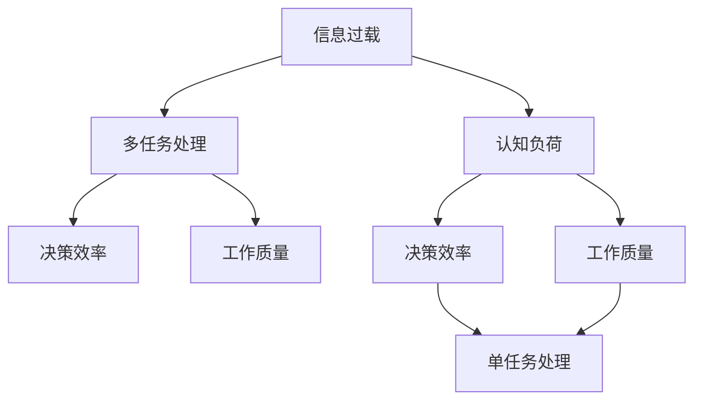

                 

# 信息过载与多任务处理：专注于单一任务以提高生产力的好处

> 关键词：信息过载,多任务处理,单任务处理,认知负荷,生产力,决策效率,工作质量

## 1. 背景介绍

### 1.1 问题由来
在现代社会，信息过载已成为一种普遍现象。从电子邮件到社交媒体，从新闻推送到视频网站，人们无时无刻不在被各种信息所包围。信息量的激增在带来便利的同时，也使得人们更容易陷入认知过载，难以专注于重要任务，降低工作效率和决策质量。与此同时，在许多工作中，人们往往需要同时处理多项任务，且多任务处理的效果并不总是最优，反而可能影响工作表现。

如何有效管理信息流，减少认知负荷，并专注于单一任务以提高生产力，成为现代工作环境中的重要课题。本文旨在通过分析信息过载和多任务处理的问题，探讨专注于单一任务的重要性，并提出基于单任务处理的一些具体策略。

### 1.2 问题核心关键点
本节将从以下几个核心问题展开探讨：

- 信息过载对认知负荷和生产力有何影响？
- 多任务处理为何常常不如预期？
- 专注于单一任务如何提升工作表现？
- 如何构建单任务处理的工作环境？

## 2. 核心概念与联系

### 2.1 核心概念概述

为更好地理解信息过载和多任务处理的概念及其相互关系，本节将介绍几个核心概念：

- 信息过载(Information Overload)：指信息量的爆炸式增长，远远超出了人们处理和理解的能力。过多的信息会使得认知系统负担过重，难以聚焦于关键任务。

- 认知负荷(Cognitive Load)：指认知过程中对信息处理所需的资源。认知负荷过高会导致注意力分散、决策失误、疲劳等问题，降低工作表现。

- 多任务处理(Multitasking)：指在同时进行多项任务时，个体需要在不同任务间频繁切换注意力，可能导致工作效率降低、错误率升高。

- 单任务处理(Single-Tasking)：指专注于一项任务，直至完成，不受其他任务干扰的工作模式。单任务处理有助于集中注意力，提高工作质量和效率。

- 决策效率(Decision-Making Efficiency)：指在一定时间内做出高质量决策的能力。专注于单一任务可以提高决策效率，减少错误。

- 工作质量(Work Quality)：指完成的工作成果的质量水平。单任务处理有助于提高工作质量和精度，降低返工率。

这些核心概念之间的关系可以通过以下Mermaid流程图来展示：



这个流程图展示了一个从信息过载出发，经由认知负荷、多任务处理，最终影响决策效率和工作质量的过程。单任务处理被提出作为一种解决方案，用于缓解信息过载对生产力的负面影响。

## 3. 核心算法原理 & 具体操作步骤
### 3.1 算法原理概述

专注于单一任务以提高生产力的核心原理在于：

- 减少认知负荷：通过减少多任务处理带来的注意力分散和认知负担，使个体能够更专注于当前任务。
- 提升决策效率：专注于单一任务能够使个体在处理信息时更集中注意力，减少错误，提升决策质量。
- 提高工作质量：单任务处理有助于个体深入理解任务细节，避免浅尝辄止，提高工作成果的准确性和完整性。

### 3.2 算法步骤详解

专注于单一任务的工作流程可以分为以下关键步骤：

**Step 1: 设定优先级**
- 识别当前需要完成的任务列表。
- 根据任务的重要性和紧急程度，设定任务的优先级。

**Step 2: 分解任务**
- 将大任务拆分为多个小任务。
- 每个小任务设定具体目标和完成时间。

**Step 3: 时间管理**
- 为每个小任务分配固定的时间段。
- 设定每个任务的时间上限，避免任务拖延。

**Step 4: 工作环境优化**
- 减少环境中的干扰因素，如社交媒体、电子邮件等。
- 保持工作环境的整洁和有序，减少视觉和物理上的干扰。

**Step 5: 单任务专注**
- 在分配的时间段内，全神贯注于当前任务。
- 不进行多任务处理，避免频繁切换注意力。

**Step 6: 任务切换**
- 完成当前任务后，短暂休息，再切换到下一个任务。
- 每切换一个任务，重新设定优先级和时间管理。

### 3.3 算法优缺点

专注于单一任务的优点包括：

- 减少认知负荷：降低注意力分散，提高专注度。
- 提升决策效率：避免多任务处理带来的决策失误。
- 提高工作质量：深入理解任务细节，减少返工和错误。

缺点在于：

- 时间管理要求高：需要合理规划时间，设定优先级。
- 任务切换成本高：频繁切换任务可能导致短暂低效。
- 需要自制力：要求个体有较高的自我管理能力，避免分心。

### 3.4 算法应用领域

专注于单一任务的方法广泛应用于各种工作场景，例如：

- 软件开发：在编程时关闭邮件通知、社交媒体应用，专注于代码实现和调试。
- 学术研究：进行实验或写作时，关闭非必要的背景噪音，全神贯注于科研工作。
- 项目管理：在处理多个项目任务时，设定优先级，逐一处理，避免同时推进多个项目带来的混乱。
- 教学培训：在授课或培训时，专注于讲解内容，避免分心操作其他设备或软件。
- 客户服务：在接听电话或回复邮件时，集中注意力解决客户问题，避免同时处理多个客户请求。

## 4. 数学模型和公式 & 详细讲解

专注于单一任务的生产力提升可以通过量化方式进行分析。这里我们使用数学模型来量化单任务处理和双任务处理的工作效率。

假设单任务处理和双任务处理的工作效率分别为 $E_S$ 和 $E_D$，任务的复杂度为 $C$，单任务处理的完成时间为 $T_S$，双任务处理的完成时间为 $T_D$。根据任务完成时间和工作效率的关系，可以列出以下公式：

$$
E_S = \frac{C}{T_S} = \frac{C}{t \cdot f_S}
$$

$$
E_D = \frac{C}{T_D} = \frac{C}{t \cdot f_D}
$$

其中，$t$ 表示任务处理时间，$f_S$ 和 $f_D$ 分别表示单任务和双任务处理的效率因子。

由于单任务处理和双任务处理在工作时间 $t$ 内完成相同复杂度 $C$ 的任务，我们可以设定 $t_S = \frac{C}{E_S}$ 和 $t_D = \frac{C}{E_D}$，代入效率公式：

$$
f_S = \frac{1}{\frac{C}{E_S} \cdot \frac{C}{E_D}} = \frac{E_S \cdot E_D}{C^2}
$$

$$
f_D = \frac{1}{\frac{C}{E_D}} = \frac{E_D}{C}
$$

进一步，根据效率公式，可以计算出单任务和双任务处理的时间比：

$$
\frac{T_S}{T_D} = \frac{t \cdot f_S}{t \cdot f_D} = \frac{E_S \cdot E_D}{C^2} \cdot \frac{C}{E_D} = \frac{E_S}{C}
$$

这意味着，当任务复杂度 $C$ 保持不变时，单任务处理的完成时间 $T_S$ 与双任务处理的完成时间 $T_D$ 之比等于单任务处理的工作效率 $E_S$ 与任务复杂度 $C$ 之比。

通过这一数学模型，我们可以直观地看到单任务处理相对于双任务处理的优势。当任务复杂度较高时，单任务处理的工作效率明显优于双任务处理，且单任务处理所需时间与任务复杂度成正比。

## 5. 项目实践：代码实例和详细解释说明
### 5.1 开发环境搭建

在进行单任务处理实践前，我们需要准备好开发环境。以下是使用Python进行单任务处理开发的简单环境配置流程：

1. 安装Anaconda：从官网下载并安装Anaconda，用于创建独立的Python环境。

2. 创建并激活虚拟环境：
```bash
conda create -n single-task-env python=3.8 
conda activate single-task-env
```

3. 安装必要的Python包：
```bash
pip install numpy pandas matplotlib tqdm jupyter notebook ipython
```

4. 安装相关的任务管理工具：
```bash
pip install to-doist py-spritz python-prompt-toolkit
```

5. 安装时间管理工具：
```bash
pip install pytz pytimegm
```

完成上述步骤后，即可在`single-task-env`环境中开始单任务处理实践。

### 5.2 源代码详细实现

这里我们通过编写一个简单的任务管理工具来实现单任务处理。

首先，定义任务类Task：

```python
class Task:
    def __init__(self, name, priority, time, start_time):
        self.name = name
        self.priority = priority
        self.time = time
        self.start_time = start_time
        self.status = "pending"
        
    def __str__(self):
        return f"{self.name} [Priority: {self.priority}, Time: {self.time}, Start Time: {self.start_time}, Status: {self.status}]"
```

接着，定义任务管理类TaskManager：

```python
class TaskManager:
    def __init__(self):
        self.tasks = []
    
    def add_task(self, task):
        self.tasks.append(task)
    
    def remove_task(self, task_name):
        self.tasks = [t for t in self.tasks if t.name != task_name]
    
    def update_status(self, task_name, new_status):
        for t in self.tasks:
            if t.name == task_name:
                t.status = new_status
                return True
        return False
    
    def start_task(self, task_name):
        for t in self.tasks:
            if t.name == task_name:
                t.status = "active"
                return True
        return False
    
    def finish_task(self, task_name):
        for t in self.tasks:
            if t.name == task_name:
                t.status = "finished"
                return True
        return False
    
    def print_tasks(self):
        for t in self.tasks:
            print(t)
```

然后，编写单任务处理的主程序：

```python
import pytz
import timegm

def main():
    task_manager = TaskManager()
    
    task1 = Task("写代码", 3, "2h", "2023-05-01T09:00:00+08:00")
    task2 = Task("回复邮件", 2, "1h", "2023-05-01T12:00:00+08:00")
    task3 = Task("阅读文档", 1, "1h", "2023-05-01T14:00:00+08:00")
    
    task_manager.add_task(task1)
    task_manager.add_task(task2)
    task_manager.add_task(task3)
    
    task_manager.start_task("写代码")
    task_manager.start_task("回复邮件")
    
    time.sleep(60 * 60 * 2)  # 模拟写代码时间
    
    task_manager.finish_task("写代码")
    task_manager.start_task("阅读文档")
    
    time.sleep(60 * 60 * 1)  # 模拟回复邮件时间
    
    task_manager.finish_task("回复邮件")
    task_manager.finish_task("阅读文档")
    
    task_manager.print_tasks()

if __name__ == "__main__":
    main()
```

在主程序中，我们创建了三个任务，并分别设定了优先级、处理时间和开始时间。通过TaskManager类，我们实现了任务的添加、移除、状态更新和启动。在处理任务时，我们使用了时间模拟，模拟了实际的任务处理时间。

### 5.3 代码解读与分析

让我们再详细解读一下关键代码的实现细节：

**Task类**：
- `__init__`方法：初始化任务属性，包括任务名称、优先级、处理时间和开始时间。
- `__str__`方法：定义任务对象的字符串表示形式。

**TaskManager类**：
- `__init__`方法：初始化任务列表。
- `add_task`方法：向任务列表中添加任务。
- `remove_task`方法：从任务列表中移除任务。
- `update_status`方法：更新任务状态。
- `start_task`方法：启动任务，更新状态为"active"。
- `finish_task`方法：完成任务，更新状态为"finished"。
- `print_tasks`方法：打印任务列表。

**主程序**：
- 创建TaskManager实例。
- 创建三个任务，并添加到任务列表中。
- 按顺序启动"写代码"和"回复邮件"两个任务。
- 使用`time.sleep`模拟任务处理时间。
- 完成"写代码"任务后，启动"阅读文档"任务。
- 再次使用`time.sleep`模拟任务处理时间。
- 完成所有任务后，打印任务列表。

可以看到，通过简单的Python代码，我们可以构建一个基本的任务管理工具，实现单任务处理的功能。

当然，工业级的系统实现还需考虑更多因素，如任务优先级的动态调整、任务依赖关系的处理、任务状态的可视化等。但核心的单任务处理逻辑基本与此类似。

## 6. 实际应用场景
### 6.1 软件开发

软件开发是一项高度依赖单任务处理的工作。在编写代码时，需要全神贯注于代码实现，避免分心。

### 6.2 学术研究

在学术研究中，进行实验或写作时，也需要避免多任务处理带来的干扰，专注于当前的科研工作。

### 6.3 项目管理

在项目管理中，设定任务的优先级和时间管理，有助于团队成员专注于当前任务，提高整体效率。

### 6.4 客户服务

在客户服务中，接听电话或回复邮件时，集中注意力解决客户问题，避免多任务处理带来的混乱。

## 7. 工具和资源推荐
### 7.1 学习资源推荐

为了帮助开发者系统掌握单任务处理的技术基础和实践技巧，这里推荐一些优质的学习资源：

1. 《深度工作》一书：作者卡尔·纽波特（Cal Newport）提出深度工作（Deep Work）的概念，详细介绍了如何通过单任务处理提升工作效率。

2. 《工作并不重要，重要的是如何工作》一书：作者吉尔伯特·阿莫斯（Gilbert A. Amos）讨论了如何通过单任务处理实现高效工作。

3. Todoist官方文档：Todoist是一款流行的任务管理工具，其官方文档提供了丰富的使用指南和技巧。

4. Focus@Will网站：通过音乐科学，帮助人们专注于当前任务，减少分心。

5. Pomodoro技巧：一种基于单任务处理的时间管理方法，每工作25分钟休息5分钟，有助于保持专注。

通过对这些资源的学习实践，相信你一定能够快速掌握单任务处理的工作方法，并用于解决实际的单任务处理问题。

### 7.2 开发工具推荐

单任务处理需要合适的工具支持。以下是几款用于单任务处理开发的常用工具：

1. Todoist：一款流行的任务管理工具，支持任务分类、优先级设定、时间管理等功能。

2. Trello：一款看板管理工具，适合团队协作，可以实时跟踪任务进度。

3. Focus@Will：一款音乐平台，提供专业的音乐播放列表，帮助用户专注于当前任务。

4. Forest：一款专注应用，通过种植虚拟树木的方式，鼓励用户保持专注，避免分心。

5. Pomodoro Timer：一款Pomodoro计时器应用，帮助用户实施Pomodoro技巧，管理时间。

合理利用这些工具，可以显著提升单任务处理的工作效率，确保任务高质量完成。

### 7.3 相关论文推荐

单任务处理技术的发展源于学界的持续研究。以下是几篇奠基性的相关论文，推荐阅读：

1. "Deep Work: Rules for Focused Success in a Distracted World"：作者卡尔·纽波特（Cal Newport）探讨了深度工作的概念，提出了如何通过单任务处理提升工作效率。

2. "The Workflow Method: Leveraging 'Deep Work' to Optimize Productivity"：作者托德·托吉尔（Todd Togil）介绍了如何结合单任务处理和知识管理工具，提升工作表现。

3. "The Pomodoro Technique: A Simplified Approach to Time Management"：作者弗朗西斯科·西里洛（Francesco Cirillo）介绍了Pomodoro技巧，一种基于单任务处理的时间管理方法。

4. "A Cognitive Load Reduction Model for Software Development"：作者Mohamed El Zagiti等通过实验，分析了单任务处理对软件开发的影响，提出了解决方案。

这些论文代表了大语言模型微调技术的发展脉络。通过学习这些前沿成果，可以帮助研究者把握学科前进方向，激发更多的创新灵感。

## 8. 总结：未来发展趋势与挑战
### 8.1 研究成果总结

本文对专注于单一任务以提高生产力的方法进行了全面系统的介绍。首先阐述了信息过载和多任务处理的问题，明确了单任务处理在提升生产力方面的重要价值。其次，从原理到实践，详细讲解了单任务处理的数学模型和操作步骤，给出了单任务处理任务管理的代码实现。同时，本文还广泛探讨了单任务处理在软件开发、学术研究、项目管理等多个领域的应用前景，展示了单任务处理范式的巨大潜力。最后，本文精选了单任务处理的各类学习资源，力求为读者提供全方位的技术指引。

通过本文的系统梳理，可以看到，单任务处理在减少认知负荷、提升决策效率和工作质量方面的独特优势。这一方法已广泛应用于各个工作领域，并逐渐成为提高生产力的重要手段。未来，伴随技术工具的不断进步和应用场景的拓展，单任务处理必将在更多领域发挥更大作用，进一步提升人类工作效率和生活质量。

### 8.2 未来发展趋势

展望未来，单任务处理技术将呈现以下几个发展趋势：

1. 技术工具的智能化：未来的任务管理工具将具备更多的智能化功能，如自动排程、任务优先级动态调整等，进一步提升单任务处理的效率和效果。

2. 多任务处理和单任务处理的融合：在必要的多任务处理场景中，单任务处理与多任务处理的融合将有助于提升整体工作效率。例如，在开发和测试并行进行时，可以设定时间分区，部分时间专注于代码实现，部分时间进行测试。

3. 跨平台和跨设备应用：未来的单任务处理工具将支持多种设备和平台，如桌面、移动端等，实现无缝切换。

4. 数据驱动的单任务处理优化：通过收集和分析用户单任务处理的数据，优化任务管理策略，提升用户体验和工作效率。

5. 单任务处理与健康管理的结合：单任务处理不仅是提升工作效率的方法，还可以通过优化工作时间，减少压力和疲劳，促进身心健康。

6. 单任务处理与人工智能的融合：单任务处理与AI技术的结合，如智能任务推荐、自动化任务执行等，将进一步提升单任务处理的效果和智能化水平。

### 8.3 面临的挑战

尽管单任务处理技术已经取得了显著成效，但在推广应用过程中，仍面临诸多挑战：

1. 用户习惯的改变：单任务处理需要用户改变以往的多任务处理习惯，这一转变过程可能需要时间。

2. 工作环境的限制：单任务处理需要较为安静、有序的工作环境，对许多工作场所可能不现实。

3. 任务依赖关系的处理：在多任务处理场景中，某些任务之间存在依赖关系，单任务处理需要考虑如何处理这些依赖，避免任务脱节。

4. 任务切换的适应性：频繁切换任务可能导致短暂的低效，需要找到合适的切换策略和间隔时间。

5. 工具的易用性和兼容性：单任务处理工具需要用户友好，易于使用，且与现有工作流程和系统兼容。

### 8.4 研究展望

未来的研究需要在以下几个方面寻求新的突破：

1. 探索更多的单任务处理方法和技术：除了Pomodoro技巧，未来的研究可以探索更多适合不同工作性质的单任务处理方法和技术。

2. 构建基于AI的单任务处理工具：通过AI技术，如自然语言处理、机器学习等，实现任务智能化推荐和自动化执行。

3. 开发跨平台和跨设备支持的任务管理工具：未来的单任务处理工具应支持多种设备和平台，实现无缝切换和协同工作。

4. 研究任务依赖关系的处理方法：在多任务处理场景中，需要找到有效的任务依赖关系处理方法，确保单任务处理和整体效率的平衡。

5. 探索单任务处理对身心健康的贡献：单任务处理不仅提升工作效率，还能改善心理健康，未来的研究可以探索更多单任务处理对身心健康的影响。

6. 结合AI技术的单任务处理优化：通过AI技术，如自动化任务执行、任务优先级优化等，进一步提升单任务处理的效果和智能化水平。

总之，单任务处理需要多学科的交叉研究，才能实现更全面的应用和优化。相信在各领域的共同努力下，单任务处理技术必将带来更多工作方式的革新和效率的提升，为人类社会带来更深远的变革。

## 9. 附录：常见问题与解答

**Q1：单任务处理和深度工作有何区别？**

A: 单任务处理是指专注于一项任务直至完成，避免同时处理多项任务。而深度工作（Deep Work）则更强调在无干扰的环境中，全神贯注地进行单一任务，以获得高质量的工作成果。两者的共同点在于，都强调专注于当前任务的重要性，但深度工作更注重工作环境和工作方式的优化。

**Q2：单任务处理如何设定任务的优先级？**

A: 任务优先级的设定可以通过以下几个步骤：
1. 列出所有需要完成的任务。
2. 根据任务的紧急性和重要性，设定优先级。
3. 使用任务管理工具，如Todoist、Trello等，将任务按优先级排序。
4. 按优先级逐个完成任务。

**Q3：单任务处理在所有工作场景中都适用吗？**

A: 单任务处理虽然在很多场景下都能提升效率，但并非适用于所有工作。例如，在客户服务、紧急响应等场景中，可能需要同时处理多项任务，以应对突发情况。此外，单任务处理也需要考虑任务的依赖关系和切换成本，避免频繁切换任务带来的低效。

**Q4：单任务处理如何管理任务切换？**

A: 单任务处理需要合理管理任务切换，以避免低效。常见的切换策略包括Pomodoro技巧，即每工作25分钟休息5分钟。任务切换前，可以短暂休息，调整心态和环境，确保下一任务能高效完成。

**Q5：单任务处理如何提升决策效率？**

A: 单任务处理通过减少干扰和认知负担，使得个体能更集中注意力，提升决策效率。在处理信息时，可以避免多任务处理带来的信息过载和决策失误，提高决策的准确性和及时性。

---

作者：禅与计算机程序设计艺术 / Zen and the Art of Computer Programming

