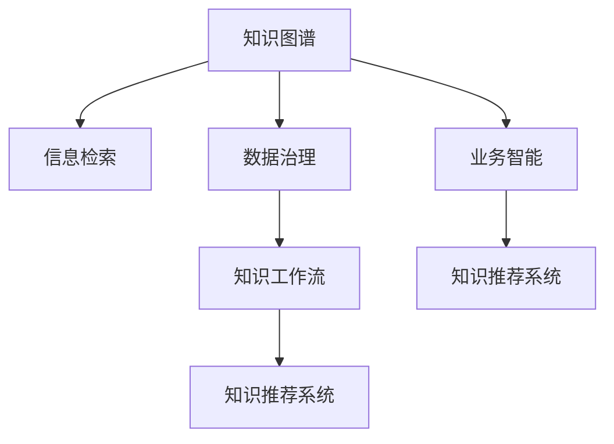

                 

# 信息过载与知识管理系统实施：管理和组织信息以提高生产力

> 关键词：信息过载,知识管理,知识图谱,信息检索,数据治理,人工智能,深度学习,自然语言处理(NLP),个性化推荐,业务智能(BI)

## 1. 背景介绍

### 1.1 问题由来
在现代社会，信息量呈指数级增长，每个人每天面临的信息过载问题越来越严重。信息过载不仅影响个人的决策效率，还导致企业内部的知识管理难度增大。许多组织拥有海量数据和文档，却无法快速找到所需信息，无法转化为生产力。

为应对这一挑战，知识管理系统(Knowledge Management System, KMS)应运而生。知识管理系统通过技术手段将企业的知识资源整合起来，提供一个高效、易用的信息获取和共享平台。本文将介绍知识管理系统的关键概念、核心算法和实操流程，探索如何在信息过载的时代，有效管理和组织信息，提升生产效率。

### 1.2 问题核心关键点
知识管理系统能够帮助组织更好地管理其知识资源，其主要目标包括：

1. **信息检索**：高效地检索和定位企业文档、邮件、网页等资料，提供相关性高的搜索结果。
2. **知识图谱**：构建结构化的知识库，使知识元素（如概念、事件、关系）形成有序的关联网络。
3. **数据治理**：定义数据标准和质量控制流程，确保知识数据的准确性和一致性。
4. **自动化工作流**：将知识管理流程自动化，减少人工干预，提升工作效率。
5. **协作和交流**：促进员工间的知识共享和协作，形成知识社区，加速知识创新。

通过这些功能，知识管理系统帮助企业从海量信息中提取有价值知识，转化为企业的核心竞争力。

### 1.3 问题研究意义
研究知识管理系统的核心算法和实施方法，对于提升组织信息管理效率、优化知识资源利用、促进创新驱动增长，具有重要意义：

1. **提升效率**：知识管理系统能够快速检索和定位信息，节省时间，提高工作效率。
2. **促进创新**：通过知识共享和协作，促进跨部门、跨团队的知识交流，加速新产品和服务的开发。
3. **优化决策**：知识管理系统提供结构化的知识库，帮助决策者快速获取所需信息，做出明智决策。
4. **降低成本**：自动化处理流程减少人工干预，降低知识管理的运营成本。
5. **增强竞争力**：企业能够快速响应市场变化，利用知识积累增强核心竞争力。

## 2. 核心概念与联系

### 2.1 核心概念概述

为更好地理解知识管理系统的设计和实现，本节将介绍几个密切相关的核心概念：

- **知识图谱(Knowledge Graph)**：利用图结构对知识元素及其关系进行建模，形成一个有序的知识网络。
- **信息检索(Information Retrieval, IR)**：通过算法实现文本数据的查询和匹配，提高搜索结果的相关性。
- **数据治理(Data Governance)**：制定数据标准、质量控制流程，确保数据的一致性和完整性。
- **知识工作流(Knowledge Workflow)**：利用自动化技术，实现知识管理的全流程自动化，减少人工干预。
- **知识推荐系统(Knowledge Recommendation System)**：通过机器学习模型，推荐用户感兴趣的知识资源。
- **业务智能(Business Intelligence, BI)**：结合数据可视化、数据挖掘等技术，帮助企业进行业务分析，决策支持。

这些核心概念之间的逻辑关系可以通过以下Mermaid流程图来展示：



这个流程图展示了一组核心概念及其之间的关系：

1. 知识图谱是知识管理系统的基础，是信息检索和推荐系统的知识源泉。
2. 数据治理确保了知识图谱和系统数据的准确性和一致性。
3. 知识工作流优化了知识管理的流程，减少了人工干预。
4. 信息检索帮助用户快速定位所需信息。
5. 知识推荐系统通过用户行为和知识图谱生成个性化推荐。
6. 业务智能基于数据挖掘和可视化技术，提供了决策支持。

这些概念共同构成了知识管理系统的核心框架，帮助组织高效管理和组织信息资源。

## 3. 核心算法原理 & 具体操作步骤
### 3.1 算法原理概述

知识管理系统通过核心算法实现信息检索、知识图谱构建、数据治理等功能，主要算法包括：

- **信息检索算法**：如倒排索引、向量空间模型、基于图的检索算法等。
- **知识图谱构建算法**：如关系抽取、实体链接、图神经网络等。
- **数据治理算法**：如元数据管理、数据清洗、数据一致性维护等。

这些算法通过优化信息检索和知识图谱，提升数据质量和自动化程度，实现知识管理的全流程自动化。

### 3.2 算法步骤详解

#### 3.2.1 信息检索

1. **文本预处理**：对文本进行分词、去停用词、词干化等预处理操作，提高检索效果。
2. **建立索引**：构建倒排索引表，将每个词映射到包含该词的文档列表。
3. **匹配查询**：将查询词与倒排索引表匹配，找到包含查询词的文档。
4. **相关性排序**：通过TF-IDF、BM25等算法计算文档与查询词的相关性，进行排序。
5. **结果展示**：展示排序后的文档列表，供用户选择。

#### 3.2.2 知识图谱构建

1. **实体抽取**：使用命名实体识别（NER）算法识别文本中的实体，如人名、地点、组织名等。
2. **关系抽取**：通过关系抽取算法识别实体之间的关系，如“张三”与“李四”的关系。
3. **实体链接**：通过链接实体识别算法将实体映射到知识图谱中的节点。
4. **图神经网络训练**：使用图神经网络模型，学习实体和关系的表示，构建知识图谱。

#### 3.2.3 数据治理

1. **元数据管理**：定义数据项及其属性，记录数据来源、质量等信息。
2. **数据清洗**：识别和修复数据中的错误、缺失值、异常值等。
3. **数据一致性维护**：确保不同数据源之间的数据一致性，避免数据冲突。

### 3.3 算法优缺点

知识管理系统的算法在提升信息检索和知识管理效率方面，具有以下优点：

1. **高效性**：通过算法优化，能够快速定位信息，提高检索和处理的效率。
2. **准确性**：算法能够精确匹配查询词，提高搜索结果的相关性和准确性。
3. **可扩展性**：算法能够处理海量数据，适应不断增长的知识资源。
4. **自动化程度高**：通过自动化技术，减少人工干预，提高知识管理的效率。

同时，也存在一些局限性：

1. **处理复杂关系困难**：现有的知识图谱算法在处理复杂实体关系时，效果不佳。
2. **数据治理成本高**：数据治理需要制定复杂的标准和流程，成本较高。
3. **实时性不足**：大规模知识图谱构建和数据治理需要较长时间，难以实现实时更新。

### 3.4 算法应用领域

知识管理系统的算法已在多个领域得到广泛应用，例如：

- **医疗领域**：构建疾病知识图谱，辅助医生诊断和治疗。
- **金融领域**：构建金融知识图谱，支持投资决策和风险评估。
- **法律领域**：构建法律知识图谱，提供案件参考和法律顾问服务。
- **制造业**：构建产品知识图谱，支持产品设计和生产优化。
- **教育领域**：构建教育知识图谱，提供教学参考和学习资源。

这些应用展示了知识管理系统在各个领域中，通过优化信息检索和知识图谱，提升数据管理和知识共享的效果。

## 4. 数学模型和公式 & 详细讲解 & 举例说明

### 4.1 数学模型构建

本节将使用数学语言对知识管理系统的关键算法进行更加严格的刻画。

设企业知识库中的文档集合为 $\mathcal{D}$，每个文档 $d_i$ 由词向量表示，即 $d_i \in \mathbb{R}^N$，其中 $N$ 为词向量维度。设用户查询为 $q$，其向量表示为 $q \in \mathbb{R}^N$。

定义查询 $q$ 与文档 $d_i$ 的匹配程度为：

$$
\text{score}(d_i,q) = \frac{\mathbf{d_i}^T \mathbf{q}}{\|\mathbf{d_i}\| \cdot \|\mathbf{q}\|}
$$

其中 $\mathbf{d_i}$ 和 $\mathbf{q}$ 为词向量，$\|\cdot\|$ 为向量范数，$T$ 为矩阵转置。

### 4.2 公式推导过程

假设用户查询为 $q$，检索结果为文档集合 $\mathcal{D}'$，则检索系统的输出为：

$$
\text{results} = \{d_i \mid \text{score}(d_i,q) > \text{threshold}\}
$$

其中 $\text{threshold}$ 为阈值，用于控制搜索结果的数量和质量。

在计算匹配程度时，向量空间模型（Vector Space Model, VSM）是最常用的算法。VSM通过计算查询向量与文档向量的余弦相似度，评估文档的相关性。余弦相似度公式为：

$$
\text{similarity}(d_i,q) = \frac{\mathbf{d_i}^T \mathbf{q}}{\|\mathbf{d_i}\| \cdot \|\mathbf{q}\|}
$$

在实际应用中，VSM可以进一步扩展，如使用TF-IDF权重调整，提高检索效果。

### 4.3 案例分析与讲解

考虑一个示例，企业拥有一个包含100个文档的知识库，每个文档由5000个词组成，查询词为 "健康保险"。

1. **文本预处理**：对每个文档进行分词、去停用词、词干化等预处理，得到预处理后的文档集合 $\mathcal{D}'$。
2. **建立索引**：构建倒排索引表，将每个词映射到包含该词的文档列表。
3. **匹配查询**：将查询词 "健康保险" 与倒排索引表匹配，找到包含该词的文档。
4. **相关性排序**：通过余弦相似度公式计算每个文档与查询的相关性，排序得到结果列表。
5. **结果展示**：展示排序后的文档列表，供用户选择。

## 5. 项目实践：代码实例和详细解释说明
### 5.1 开发环境搭建

在进行知识管理系统开发前，我们需要准备好开发环境。以下是使用Python进行知识管理系统开发的典型环境配置流程：

1. 安装Anaconda：从官网下载并安装Anaconda，用于创建独立的Python环境。

2. 创建并激活虚拟环境：
```bash
conda create -n kms-env python=3.8 
conda activate kms-env
```

3. 安装必要的Python库：
```bash
pip install pandas numpy sklearn elasticsearch elasticsearch-dsl py2neo pyowl
```

4. 安装知识管理系统的开发工具：
```bash
pip install kms-query-ir kms-knowledge-graph kms-data-governance kms-kb-workflow kms-kb-recommendation
```

5. 配置开发环境：
```bash
export KMSIR_HOST=http://localhost:9200
export KMSKG_MONGO_URL=mongodb://localhost:27017/kms_kg
export KMSKGENE_ELASTICSEARCH_INDEX=kms_kg
export KMSKG_ENABLE.FulltextSearch=True
```

完成上述步骤后，即可在`kms-env`环境中开始知识管理系统开发。

### 5.2 源代码详细实现

下面以一个简单的企业知识管理系统为例，介绍如何通过Python实现信息检索功能。

首先，定义一个查询处理函数：

```python
from elasticsearch import Elasticsearch
from elasticsearch_dsl import Document, Index, Search
import pandas as pd

def search(query):
    es = Elasticsearch([{'host': 'localhost', 'port': 9200}])
    
    # 定义文档索引和映射
    kg_index = Index(name='knowledge_graph', mappings={
        'properties': {
            'name': {'type': 'text'},
            'uri': {'type': 'keyword'},
            'description': {'type': 'text'}
        }
    })
    
    # 创建索引
    kg_index.create()
    
    # 定义查询
    query = Search(index='knowledge_graph', q='name:%s' % query)
    
    # 执行查询
    results = query.execute()
    
    # 将结果转换为DataFrame
    data = pd.DataFrame([result.to_dict() for result in results])
    
    return data
```

然后，定义一个简单的用户交互界面，让用户输入查询词并显示搜索结果：

```python
import webbrowser

def interactive_search():
    query = input('Enter your query: ')
    data = search(query)
    
    # 展示搜索结果
    print('Search results:')
    for row in data.itertuples(index=False):
        print('{}: {}'.format(row.name, row.description))
    
    # 打开搜索结果页面
    webbrowser.open_new_tab(data.to_csv(index=False))
```

最后，启动交互式搜索：

```python
interactive_search()
```

以上代码实现了通过Elasticsearch进行信息检索的简单功能。通过交互式界面，用户可以输入查询词，并查看相关文档的简要描述。

### 5.3 代码解读与分析

让我们再详细解读一下关键代码的实现细节：

**search函数**：
- 连接Elasticsearch，创建索引，定义查询，并执行查询。
- 将查询结果转换为Pandas DataFrame，方便后续处理。

**interactive_search函数**：
- 获取用户输入的查询词。
- 调用search函数获取搜索结果，并展示查询结果。
- 将搜索结果保存到CSV文件，并自动打开网页浏览页面。

可以看到，使用Python和Elasticsearch进行信息检索功能，代码实现简洁高效。通过简单的几行代码，我们就能够实现一个基本的信息检索系统，展示了Elasticsearch在知识管理中的应用潜力。

## 6. 实际应用场景

### 6.1 智能客服系统

智能客服系统通过知识管理系统，可以快速定位客户常见问题，提供智能答复。系统通过收集客户历史对话记录，构建问答知识库，利用信息检索算法快速定位相关回答，并通过自然语言处理(NLP)技术生成自然流畅的回复。

在技术实现上，可以将用户输入的问题作为查询词，从知识库中检索相关回答，并利用NLP技术进行回答生成。对于未覆盖的问题，系统可以记录并推送给人工客服处理，形成知识积累。

### 6.2 金融投资平台

金融投资平台通过知识管理系统，提供市场动态分析、投资决策支持等功能。系统通过构建金融知识图谱，利用信息检索算法快速定位相关数据，并通过BI工具进行数据可视化和分析，帮助投资经理做出明智投资决策。

在技术实现上，系统可以构建金融知识图谱，存储市场新闻、历史数据、技术指标等知识资源。用户可以输入特定的查询词，系统快速定位相关数据，并通过BI工具展示分析结果。

### 6.3 企业文档管理系统

企业文档管理系统通过知识管理系统，帮助企业高效管理和组织文档资源，提供快速检索和共享功能。系统通过构建文档索引，利用信息检索算法快速定位文档，并通过协作工具实现文档共享和版本控制。

在技术实现上，系统可以将企业文档进行扫描和OCR识别，构建文档索引。用户可以输入查询词，系统快速定位相关文档，并通过协作工具实现文档共享和版本控制。

## 7. 工具和资源推荐

### 7.1 学习资源推荐

为了帮助开发者系统掌握知识管理系统的理论和实践，这里推荐一些优质的学习资源：

1. **Elasticsearch官方文档**：Elasticsearch官方文档提供了详细的API和查询语言文档，是学习信息检索和知识管理系统的必备资料。

2. **PyTorch Lightning**：一个简单易用的深度学习框架，支持构建复杂的模型和数据处理管道，适合开发复杂的知识管理系统。

3. **Owl-ontology**：一个用于构建和管理知识图谱的Python库，支持多种语义模型和推理算法，是构建知识图谱的理想工具。

4. **OpenCog**：一个开源的认知框架，支持知识图谱构建、推理和可视化，适合进行认知科学和知识管理的研究。

5. **OpenNLP**：斯坦福大学开发的自然语言处理工具包，提供了丰富的NLP功能，适合进行自然语言处理和文本分析。

通过对这些资源的学习实践，相信你一定能够快速掌握知识管理系统的精髓，并用于解决实际的NLP问题。

### 7.2 开发工具推荐

高效的开发离不开优秀的工具支持。以下是几款用于知识管理系统开发的常用工具：

1. **Elasticsearch**：分布式搜索引擎和分析引擎，支持高可用性、高性能和灵活性，是信息检索和知识图谱构建的理想选择。

2. **PyTorch Lightning**：简单易用的深度学习框架，支持构建复杂的模型和数据处理管道，适合开发复杂的知识管理系统。

3. **Owl-ontology**：一个用于构建和管理知识图谱的Python库，支持多种语义模型和推理算法，是构建知识图谱的理想工具。

4. **OpenNLP**：斯坦福大学开发的自然语言处理工具包，提供了丰富的NLP功能，适合进行自然语言处理和文本分析。

5. **Py owl**：基于OpenCog的Python API，支持知识图谱构建、推理和可视化，适合进行认知科学和知识管理的研究。

合理利用这些工具，可以显著提升知识管理系统开发效率，加快创新迭代的步伐。

### 7.3 相关论文推荐

知识管理系统的技术发展得益于学界的持续研究。以下是几篇奠基性的相关论文，推荐阅读：

1. **Elasticsearch的原理和应用**：一篇介绍Elasticsearch原理和应用的经典论文，展示了如何利用Elasticsearch构建高效的搜索引擎和知识管理系统。

2. **知识图谱的构建与应用**：多篇关于知识图谱构建和应用的论文，展示了如何通过关系抽取、实体链接等技术构建知识图谱，并在多个领域进行应用。

3. **深度学习在知识管理中的应用**：多篇关于深度学习在知识管理中的应用论文，展示了如何利用深度学习技术进行信息检索、知识推荐等。

这些论文代表了大语言模型微调技术的发展脉络。通过学习这些前沿成果，可以帮助研究者把握学科前进方向，激发更多的创新灵感。

## 8. 总结：未来发展趋势与挑战

### 8.1 总结

本文对知识管理系统的核心算法和实施方法进行了全面系统的介绍。首先阐述了知识管理系统在应对信息过载方面的重要意义，明确了知识管理系统的关键功能，包括信息检索、知识图谱构建、数据治理等。其次，从原理到实践，详细讲解了知识管理系统的数学模型和核心算法，并给出了信息检索的代码实例。同时，本文还广泛探讨了知识管理系统在多个领域的应用，展示了知识管理系统的广泛前景。

通过本文的系统梳理，可以看到，知识管理系统在处理信息过载问题、提升信息利用效率、促进知识创新方面具有重要价值。知识管理系统通过信息检索和知识图谱等技术手段，帮助企业高效管理和组织知识资源，提升生产效率，增强企业竞争力。

### 8.2 未来发展趋势

展望未来，知识管理系统将呈现以下几个发展趋势：

1. **智能化水平提升**：通过引入自然语言处理和深度学习技术，知识管理系统将实现更加智能化的信息检索和知识推荐。
2. **跨领域知识融合**：知识管理系统将支持跨领域知识融合，构建综合性的知识图谱，支持多学科的知识应用。
3. **实时知识更新**：通过实时数据流处理技术，知识管理系统将实现知识图谱的实时更新，保持知识的时效性。
4. **边缘计算支持**：通过边缘计算技术，知识管理系统将支持离线知识处理和推理，提升数据处理效率和隐私保护。
5. **个性化推荐增强**：通过深度学习技术，知识管理系统将实现更精准、更个性化的知识推荐，提升用户满意度。
6. **业务智能集成**：通过与业务智能工具集成，知识管理系统将提供决策支持，优化企业运营。

以上趋势凸显了知识管理系统的发展潜力，将在未来进一步拓展其应用范围，提升企业的信息处理能力和知识创新能力。

### 8.3 面临的挑战

尽管知识管理系统在信息管理和知识共享方面具有重要价值，但在迈向智能化和普适化应用的过程中，仍面临诸多挑战：

1. **数据复杂度**：知识图谱的构建和维护需要处理复杂的数据关系，提高数据复杂度的管理难度。
2. **数据隐私**：知识管理系统涉及大量的数据和隐私信息，如何在保护隐私的同时，提供高效的知识服务，是一个重大挑战。
3. **技术整合**：知识管理系统需要与其他技术，如AI、大数据、区块链等，进行深度整合，技术整合的复杂度较高。
4. **标准化问题**：知识管理系统需要遵循行业标准和规范，统一数据格式和接口，标准化问题较为复杂。
5. **用户体验**：知识管理系统需要提供简单易用的用户界面，提高用户体验，这对设计和开发提出了较高要求。

### 8.4 研究展望

面对知识管理系统面临的挑战，未来的研究需要在以下几个方面寻求新的突破：

1. **简化知识图谱构建**：开发更加高效和智能化的知识图谱构建工具，降低知识图谱构建的复杂度。
2. **提升知识图谱质量**：通过引入深度学习等技术，提升知识图谱的质量和精度，减少错误和歧义。
3. **保护数据隐私**：开发隐私保护技术，如差分隐私、联邦学习等，确保知识管理系统的数据安全和隐私保护。
4. **优化技术整合**：研究和探索知识管理系统与其他技术的深度整合，提高系统的集成度和效率。
5. **提升用户体验**：设计和开发易于使用的用户界面，提供智能化的知识服务，提升用户满意度。
6. **实现个性化推荐**：通过深度学习技术，实现更精准、更个性化的知识推荐，提升用户满意度。

这些研究方向的探索，将引领知识管理系统的持续进步，为构建更高效、更智能的知识管理系统提供新的思路和解决方案。

## 9. 附录：常见问题与解答

**Q1：知识管理系统与信息检索系统的区别是什么？**

A: 知识管理系统不仅包括信息检索功能，还包括知识图谱构建、数据治理、知识推荐等更高级的功能。信息检索系统主要专注于检索和匹配文档，提供快速定位信息的能力，而知识管理系统则更侧重于知识的整合、共享和利用。

**Q2：知识图谱构建需要哪些技术和算法？**

A: 知识图谱构建需要利用命名实体识别（NER）、关系抽取、实体链接等技术，以及图神经网络（GNN）等算法，构建结构化的知识图谱。这些技术和算法有助于理解知识元素之间的关系，形成有序的知识网络。

**Q3：如何提高知识管理的效率？**

A: 提高知识管理的效率需要从多个方面入手，包括：
1. 利用信息检索算法快速定位知识资源。
2. 构建高效的知识图谱，通过图神经网络等技术优化知识表示。
3. 引入自动化技术，减少人工干预，提高知识管理的效率。
4. 设计简单易用的用户界面，提升用户体验。

**Q4：知识管理系统如何保护数据隐私？**

A: 知识管理系统需要采用隐私保护技术，如差分隐私、联邦学习等，确保数据安全和隐私保护。通过这些技术，可以在保护用户隐私的同时，提供高效的知识服务。

**Q5：知识管理系统在企业中的应用有哪些？**

A: 知识管理系统在企业中的应用包括但不限于：
1. 智能客服系统，提供快速定位客户问题的能力。
2. 金融投资平台，提供市场动态分析和投资决策支持。
3. 企业文档管理系统，提供快速检索和共享功能。
4. 医疗系统，提供疾病知识图谱和临床支持。
5. 教育系统，提供教学参考和学习资源。

通过对这些问题的解答，相信你能够更全面地理解知识管理系统的原理和应用，并掌握其在实际应用中的关键技巧。

---

作者：禅与计算机程序设计艺术 / Zen and the Art of Computer Programming

