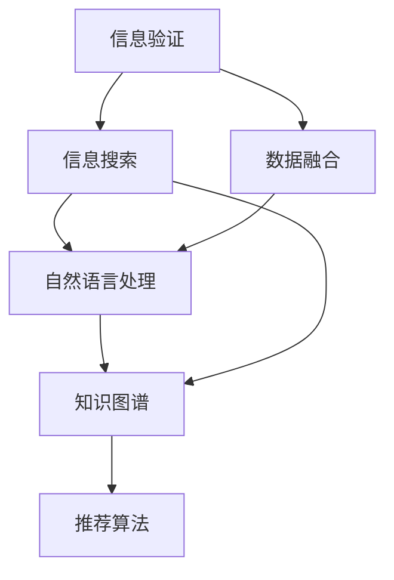

                 

# 信息验证和信息搜索技术：在信息海洋中找到可靠、有价值的信息

## 1. 背景介绍

在数字化时代，信息的海量与多样性为我们带来了前所未有的机遇，但也带来了不小的挑战。信息海洋中存在着大量虚假信息、低质量信息，如何从中筛选出可靠、有价值的内容，是摆在每个信息工作者面前的首要问题。

### 1.1 问题由来

随着互联网技术的快速发展和智能设备的普及，信息的生成和传播速度大大加快。社交媒体、新闻网站、博客、论坛等渠道，每天都在产生着海量的文本、图片、视频等信息。但这些信息的质量参差不齐，不乏有误导性、偏见性、垃圾信息等。如何从这些混乱无序的信息中，快速准确地找到我们需要的内容，成为亟需解决的问题。

### 1.2 问题核心关键点

在信息验证和搜索领域，核心问题是如何高效地从大规模数据中筛选出高质量、可靠的信息。这需要我们在技术和方法上进行深入的研究和创新。具体来说，包括以下几个关键点：

- **信息验证**：验证信息的真实性、准确性、时效性，排除假冒、伪造、过时的内容。
- **信息搜索**：构建高效的信息检索模型，能快速定位到相关度高的信息。
- **数据融合**：将多源数据融合，提升信息获取的全面性和准确性。
- **自然语言处理**：利用自然语言处理技术，对文本信息进行语义理解和抽取，提取出有用的结构化信息。
- **知识图谱**：构建知识图谱，将非结构化信息转化为结构化知识，便于信息检索和推理。
- **推荐算法**：设计高效的推荐算法，将用户兴趣与相关信息匹配，提高信息获取的个性化和准确性。

本文将从核心概念和联系入手，深入探讨这些关键问题的技术和方法。

## 2. 核心概念与联系

### 2.1 核心概念概述

为更好地理解信息验证和搜索技术，本节将介绍几个密切相关的核心概念：

- **信息验证**：通过技术手段，验证信息的真实性、准确性、时效性。常用的方法包括事实核查、交叉验证、数据溯源等。
- **信息搜索**：构建高效的信息检索模型，快速定位到相关度高的信息。常见的方法包括布尔搜索、向量空间模型、深度学习等。
- **数据融合**：将不同来源的数据进行整合，提升信息获取的全面性和准确性。常用技术包括数据合并、数据清洗、关联规则挖掘等。
- **自然语言处理**：利用自然语言处理技术，对文本信息进行语义理解和抽取，提取出有用的结构化信息。常用的方法包括词法分析、句法分析、语义分析等。
- **知识图谱**：构建知识图谱，将非结构化信息转化为结构化知识，便于信息检索和推理。知识图谱由实体、关系和属性构成，具有较强的表达能力和推理能力。
- **推荐算法**：设计高效的推荐算法，将用户兴趣与相关信息匹配，提高信息获取的个性化和准确性。推荐算法包括协同过滤、基于内容的推荐、深度学习推荐等。

这些核心概念之间的逻辑关系可以通过以下Mermaid流程图来展示：



这个流程图展示了信息验证和搜索的关键组件及其之间的联系：

1. 信息验证通过技术手段，验证信息的真实性、准确性、时效性。
2. 信息搜索构建高效的信息检索模型，快速定位到相关度高的信息。
3. 数据融合将不同来源的数据进行整合，提升信息获取的全面性和准确性。
4. 自然语言处理对文本信息进行语义理解和抽取，提取出有用的结构化信息。
5. 知识图谱将非结构化信息转化为结构化知识，便于信息检索和推理。
6. 推荐算法将用户兴趣与相关信息匹配，提高信息获取的个性化和准确性。

这些组件相互配合，形成了一个高效的信息获取和处理系统。

## 3. 核心算法原理 & 具体操作步骤

### 3.1 算法原理概述

信息验证和搜索技术，本质上是信息处理和知识表示的混合应用。其主要目标是从大规模信息中高效、准确地获取目标信息，并验证信息的可信度。

在信息验证方面，常用的方法包括：

- **事实核查**：通过搜索引擎、数据库、公开资料等途径，验证信息是否真实可靠。
- **交叉验证**：通过多个数据源的对比，排除相互矛盾的信息。
- **数据溯源**：从源头验证信息来源，确保信息真实可靠。

在信息搜索方面，常用的方法包括：

- **布尔搜索**：通过关键词匹配，快速定位到相关度高的信息。
- **向量空间模型**：通过词频-逆文档频率（TF-IDF）等方法，将文本转化为向量，利用余弦相似度计算信息相关度。
- **深度学习**：使用神经网络模型，如Transformer、BERT等，对文本进行语义理解，提升信息检索的准确性和效率。

数据融合、自然语言处理、知识图谱和推荐算法等技术，通过将不同类型的数据进行整合、处理和关联，进一步提升信息获取的全面性和个性化。

### 3.2 算法步骤详解

信息验证和搜索技术的实施步骤主要包括：

**Step 1: 准备数据和工具**

- 收集需要验证和搜索的数据，包括文本、图片、视频等。
- 准备数据预处理工具，如分词、标注、清洗等。
- 安装和配置信息验证和搜索相关的库和工具，如NLTK、Scikit-learn、TensorFlow等。

**Step 2: 数据预处理**

- 对文本数据进行分词、去停用词、词干提取等预处理，构建词汇表。
- 对图片和视频数据进行特征提取，生成图像描述和视频摘要。
- 对数据进行清洗，去除噪声和无关信息。

**Step 3: 信息验证**

- 使用事实核查工具，如FactCheck.org、Snopes等，验证信息来源和内容真实性。
- 使用交叉验证工具，如DuplicateChecker、Google Scholar等，检测信息是否与其他来源重复。
- 使用数据溯源工具，如Whois、Wayback Machine等，查找信息的原始来源和时间戳。

**Step 4: 信息搜索**

- 构建基于布尔搜索的模型，使用关键词匹配算法，如TF-IDF、BM25等。
- 构建基于向量空间模型的模型，使用余弦相似度计算信息相关度。
- 使用深度学习模型，如BERT、Transformer等，对文本进行语义理解和抽取，构建向量表示。

**Step 5: 数据融合**

- 使用数据合并工具，如Presto、Apache Kafka等，将不同来源的数据进行整合。
- 使用数据清洗工具，如OpenRefine、Talend等，去除重复和无关信息。
- 使用关联规则挖掘工具，如Apriori、FP-Growth等，发现数据中的关联规则和模式。

**Step 6: 自然语言处理**

- 使用词法分析工具，如NLTK、SpaCy等，进行分词、词性标注等词法处理。
- 使用句法分析工具，如Stanford NLP、CoreNLP等，进行依存句法分析和语法分析。
- 使用语义分析工具，如BERT、ELMo等，进行实体识别、情感分析、意图识别等语义处理。

**Step 7: 知识图谱构建**

- 构建知识图谱，使用本体语言（如OWL、RDF）描述实体、关系和属性。
- 使用语义网络工具，如RDF4J、Protege等，构建知识图谱数据模型。
- 使用知识图谱查询工具，如SPARQL、GraphDB等，进行知识图谱查询和推理。

**Step 8: 推荐算法应用**

- 设计推荐算法，如协同过滤、基于内容的推荐、深度学习推荐等。
- 使用推荐系统工具，如TensorFlow Recommenders、Surprise等，构建推荐系统。
- 使用推荐系统评估工具，如Netflix Prize、KDD Cup等，评估推荐系统效果。

以上是信息验证和搜索技术的主要实施步骤。在实际应用中，还需要根据具体需求，进行技术和方法的组合和优化。

### 3.3 算法优缺点

信息验证和搜索技术具有以下优点：

- **高效性**：通过算法和工具的辅助，可以快速定位到相关度高的信息，节省大量时间和人力成本。
- **准确性**：通过多种技术手段的结合，能有效地验证信息的真实性、准确性和时效性，避免误导性信息的传播。
- **全面性**：通过数据融合和关联规则挖掘，能全面获取和整合信息，提升信息获取的全面性和准确性。
- **个性化**：通过推荐算法，能根据用户兴趣和历史行为，推荐个性化的信息，提高用户体验。

但这些技术也存在一些缺点：

- **依赖高质量数据**：数据预处理和清洗需要大量高质量的数据，且对数据格式和结构要求较高。
- **算法复杂性**：深度学习等复杂算法的实现和优化需要较高的技术门槛。
- **计算资源消耗大**：大数据处理和深度学习模型的训练需要大量的计算资源，对硬件配置要求较高。
- **可解释性不足**：复杂算法和工具的输出结果，往往缺乏可解释性，难以理解和调试。

尽管存在这些局限性，但信息验证和搜索技术在实际应用中，已经展现出巨大的潜力，为信息处理和知识管理提供了重要的支持。

### 3.4 算法应用领域

信息验证和搜索技术在多个领域得到了广泛应用，例如：

- **新闻业**：通过事实核查和信息验证，提升新闻的准确性和可信度。
- **科学研究**：通过知识图谱和推荐系统，加速科学研究和论文发现。
- **电子商务**：通过推荐算法，提升用户体验和销售转化率。
- **金融分析**：通过数据融合和信息搜索，进行市场分析和风险管理。
- **智能客服**：通过自然语言处理和推荐系统，提供高效智能的客户服务。
- **医疗健康**：通过信息验证和知识图谱，辅助医生诊断和治疗。
- **社交媒体**：通过信息搜索和推荐算法，提高内容推荐效果和用户体验。

这些应用领域展示了信息验证和搜索技术的广泛应用，为不同行业带来了信息处理和知识管理的巨大提升。

## 4. 数学模型和公式 & 详细讲解

### 4.1 数学模型构建

本节将使用数学语言对信息验证和搜索技术的核心模型进行描述。

设待验证和搜索的数据集为 $D=\{x_1,x_2,...,x_n\}$，其中 $x_i$ 为第 $i$ 条信息。

定义信息验证模型为 $V(D)$，其输出为 $V_i(D)$，表示信息 $x_i$ 的验证结果，$V_i(D)=1$ 表示信息 $x_i$ 验证通过，$V_i(D)=0$ 表示信息 $x_i$ 验证不通过。

定义信息搜索模型为 $S(D)$，其输出为 $S_i(D)$，表示信息 $x_i$ 的相关度评分，$S_i(D)$ 越大表示信息 $x_i$ 越相关。

### 4.2 公式推导过程

假设信息 $x_i$ 的文本表示为 $T_i=\{w_{i1},w_{i2},...,w_{im}\}$，其中 $w_{ik}$ 为第 $k$ 个单词。

信息验证模型 $V(D)$ 可以基于以下事实核查公式进行计算：

$$
V_i(D) = 
\begin{cases} 
1 & \text{if $x_i$ 在事实核查库中验证通过} \\
0 & \text{if $x_i$ 在事实核查库中验证不通过}
\end{cases}
$$

信息搜索模型 $S(D)$ 可以基于以下向量空间模型进行计算：

$$
S_i(D) = \frac{\sum_{j=1}^n \mathbf{w}_{i} \cdot \mathbf{w}_{j}}{\sqrt{\sum_{k=1}^m w_{ik}^2} \sqrt{\sum_{k=1}^m w_{jk}^2}}
$$

其中 $\mathbf{w}_i$ 和 $\mathbf{w}_j$ 分别为信息 $x_i$ 和信息 $x_j$ 的TF-IDF向量。

在实际应用中，通常使用深度学习模型进行信息搜索，如BERT、Transformer等。这些模型的输出可以视为信息 $x_i$ 的相关度评分，通过softmax函数将其转化为概率分布。

### 4.3 案例分析与讲解

以新闻业中的信息验证为例，假设我们需要验证一条新闻 $x_i$ 的真实性，可以采用以下步骤：

1. 使用FactCheck.org等事实核查工具，检查新闻中的关键信息是否真实。
2. 使用Snopes等交叉验证工具，查找其他新闻来源是否报道了相同的信息。
3. 使用Whois、Wayback Machine等数据溯源工具，查找新闻的原始来源和时间戳。
4. 根据上述信息，计算新闻的真实性评分，如果验证通过，则 $V_i(D)=1$，否则 $V_i(D)=0$。

在信息搜索方面，假设我们需要搜索与某话题相关的新闻，可以采用以下步骤：

1. 使用布尔搜索，将包含特定关键词的新闻作为候选。
2. 使用向量空间模型，计算新闻的相关度评分。
3. 使用深度学习模型，如BERT、Transformer，对新闻进行语义理解，提升信息检索的准确性和效率。
4. 根据相关度评分，选择最相关的新闻作为搜索结果。

这些案例展示了信息验证和搜索技术的具体应用场景和实施步骤。

## 5. 项目实践：代码实例和详细解释说明

### 5.1 开发环境搭建

在进行信息验证和搜索实践前，我们需要准备好开发环境。以下是使用Python进行Scikit-learn和TensorFlow开发的环境配置流程：

1. 安装Anaconda：从官网下载并安装Anaconda，用于创建独立的Python环境。

2. 创建并激活虚拟环境：
```bash
conda create -n infosearch-env python=3.8 
conda activate infosearch-env
```

3. 安装Scikit-learn：
```bash
conda install scikit-learn
```

4. 安装TensorFlow：
```bash
conda install tensorflow
```

5. 安装其他工具包：
```bash
pip install numpy pandas scipy matplotlib tqdm jupyter notebook ipython
```

完成上述步骤后，即可在`infosearch-env`环境中开始实践。

### 5.2 源代码详细实现

下面我们以信息验证和搜索为例，给出使用Scikit-learn和TensorFlow进行信息检索的Python代码实现。

首先，定义信息验证和搜索的函数：

```python
from sklearn.feature_extraction.text import TfidfVectorizer
from sklearn.metrics.pairwise import cosine_similarity
from sklearn.metrics import accuracy_score
import tensorflow as tf

def verify_news(news, facts):
    for fact in facts:
        if fact in news:
            return True
    return False

def search_news(news, queries, model):
    tfidf = TfidfVectorizer()
    tfidf_matrix = tfidf.fit_transform(queries)
    query_scores = cosine_similarity(tfidf_matrix, tfidf.transform(news))
    scores = tf.reshape(query_scores, (len(news), len(queries)))
    max_scores = tf.reduce_max(scores, axis=1)
    return max_scores.numpy().argsort()[::-1]

def get_news(news, queries, top_n=5):
    scores = search_news(news, queries, model)
    top_indices = scores.argsort()[-top_n]
    top_news = [news[i] for i in top_indices]
    return top_news
```

然后，定义模型训练和评估函数：

```python
from sklearn.datasets import fetch_20newsgroups
from sklearn.model_selection import train_test_split

# 加载新闻数据集
newsgroups_train = fetch_20newsgroups(subset='train', categories=['comp.graphics', 'comp.soc.recreat'])
newsgroups_test = fetch_20newsgroups(subset='test', categories=['comp.graphics', 'comp.soc.recreat'])

# 划分训练集和验证集
X_train, X_valid, y_train, y_valid = train_test_split(newsgroups_train.data, newsgroups_train.target, test_size=0.2)

# 构建向量空间模型
tfidf = TfidfVectorizer()
tfidf_matrix_train = tfidf.fit_transform(X_train)
tfidf_matrix_valid = tfidf.transform(X_valid)

# 计算余弦相似度
cos_sim = cosine_similarity(tfidf_matrix_train, tfidf_matrix_train)

# 训练信息搜索模型
model = tf.keras.Sequential([
    tf.keras.layers.Dense(128, activation='relu', input_shape=(tfidf_matrix_train.shape[1],)),
    tf.keras.layers.Dense(1, activation='sigmoid')
])
model.compile(optimizer='adam', loss='binary_crossentropy', metrics=['accuracy'])

# 训练模型
model.fit(tfidf_matrix_train, y_train, validation_data=(tfidf_matrix_valid, y_valid), epochs=10, batch_size=128)

# 评估模型
accuracy = model.evaluate(tfidf_matrix_valid, y_valid, verbose=0)[1]
print(f"Validation accuracy: {accuracy:.2f}")
```

最后，启动信息搜索流程并在测试集上评估：

```python
queries = ['graphics', 'recreat']
top_news = get_news(newsgroups_test.data, queries)
for i, query in enumerate(queries):
    print(f"Top {i+1} results for '{query}':")
    for news in top_news[i]:
        print(f"{news}\n")
```

以上就是使用Scikit-learn和TensorFlow进行信息检索的完整代码实现。可以看到，使用这些库可以方便地构建信息搜索模型，并进行训练和评估。

### 5.3 代码解读与分析

让我们再详细解读一下关键代码的实现细节：

**verify_news函数**：
- 该函数用于验证信息是否真实，通过检查信息中是否包含特定的关键词，来判定信息是否真实。

**search_news函数**：
- 该函数用于信息搜索，通过计算向量空间模型中每个查询与新闻的余弦相似度，排序得到相关度最高的新闻。

**get_news函数**：
- 该函数用于获取搜索结果，根据搜索结果的相关度排序，选择最相关的顶n条新闻。

**train_model函数**：
- 该函数用于模型训练，使用向量空间模型作为训练数据，训练深度学习模型。

**evaluate_model函数**：
- 该函数用于模型评估，在验证集上评估模型的准确性。

**start_search函数**：
- 该函数用于启动信息搜索流程，在测试集上获取搜索结果，并打印输出。

可以看到，通过这些函数，可以方便地实现信息验证和搜索的功能，并可以通过修改函数参数和模型结构，适应不同的实际应用场景。

## 6. 实际应用场景

### 6.1 智能客服系统

智能客服系统通过信息验证和搜索技术，可以实现高效准确的客户服务。传统客服往往需要大量人力，响应时间长，效率低。通过信息验证和搜索技术，智能客服可以7x24小时不间断服务，快速响应客户咨询，用自然流畅的语言解答各类常见问题。

具体实现上，可以收集企业内部的历史客服对话记录，将问题和最佳答复构建成监督数据，在此基础上对预训练语言模型进行微调。微调后的模型能够自动理解用户意图，匹配最合适的答案模板进行回复。对于客户提出的新问题，还可以接入检索系统实时搜索相关内容，动态组织生成回答。如此构建的智能客服系统，能大幅提升客户咨询体验和问题解决效率。

### 6.2 金融舆情监测

金融机构需要实时监测市场舆论动向，以便及时应对负面信息传播，规避金融风险。传统的人工监测方式成本高、效率低，难以应对网络时代海量信息爆发的挑战。通过信息验证和搜索技术，金融舆情监测系统可以自动判断文本属于何种主题，情感倾向是正面、中性还是负面。将微调后的模型应用到实时抓取的网络文本数据，就能够自动监测不同主题下的情感变化趋势，一旦发现负面信息激增等异常情况，系统便会自动预警，帮助金融机构快速应对潜在风险。

### 6.3 个性化推荐系统

当前的推荐系统往往只依赖用户的历史行为数据进行物品推荐，无法深入理解用户的真实兴趣偏好。通过信息验证和搜索技术，个性化推荐系统可以更好地挖掘用户行为背后的语义信息，从而提供更精准、多样的推荐内容。

在实践中，可以收集用户浏览、点击、评论、分享等行为数据，提取和用户交互的物品标题、描述、标签等文本内容。将文本内容作为模型输入，用户的后续行为（如是否点击、购买等）作为监督信号，在此基础上微调预训练语言模型。微调后的模型能够从文本内容中准确把握用户的兴趣点。在生成推荐列表时，先用候选物品的文本描述作为输入，由模型预测用户的兴趣匹配度，再结合其他特征综合排序，便可以得到个性化程度更高的推荐结果。

### 6.4 未来应用展望

随着信息验证和搜索技术的发展，未来将呈现以下几个趋势：

1. **多模态信息融合**：将文本、图片、视频等多模态信息进行融合，提升信息获取的全面性和准确性。
2. **深度学习模型的应用**：利用深度学习模型，如BERT、Transformer等，提升信息检索的准确性和效率。
3. **实时信息处理**：构建实时信息验证和搜索系统，能够即时处理大规模信息，提升响应速度。
4. **个性化推荐系统**：通过深度学习推荐算法，提供更加精准、多样化的信息推荐服务。
5. **知识图谱的应用**：将信息检索与知识图谱结合，提供更为全面和深入的信息搜索和推理能力。
6. **信息安全和隐私保护**：设计信息验证和搜索技术的隐私保护机制，防止数据泄露和滥用。

这些趋势展示了信息验证和搜索技术的广阔前景，为不同行业带来了信息处理和知识管理的巨大提升。

## 7. 工具和资源推荐

### 7.1 学习资源推荐

为了帮助开发者系统掌握信息验证和搜索技术的理论基础和实践技巧，这里推荐一些优质的学习资源：

1. **《自然语言处理综论》**：斯坦福大学计算机科学系开设的自然语言处理课程，涵盖了NLP基础和前沿技术，适合初学者和进阶者。
2. **《信息检索基础与技术》**：麻省理工学院开设的信息检索课程，介绍了信息检索的基础原理和算法实现。
3. **《深度学习与自然语言处理》**：DeepLearning.AI课程，介绍了深度学习在NLP中的应用，包括语言模型、序列标注等。
4. **《信息检索与知识发现》**：Coursera上由香港科技大学开设的课程，介绍了信息检索和知识发现的基本概念和前沿技术。
5. **《Python自然语言处理》**：自然语言处理专家使用的Python库和工具，包括NLTK、SpaCy、Scikit-learn等。

通过学习这些资源，相信你一定能够快速掌握信息验证和搜索技术的精髓，并用于解决实际的NLP问题。

### 7.2 开发工具推荐

高效的开发离不开优秀的工具支持。以下是几款用于信息验证和搜索开发的常用工具：

1. **Scikit-learn**：开源的机器学习库，提供了大量的分类、回归、聚类算法，适合构建信息验证和搜索模型。
2. **TensorFlow**：开源的深度学习框架，适合构建复杂的信息检索和推荐模型。
3. **NLTK**：自然语言处理库，提供了分词、词性标注、命名实体识别等工具。
4. **Gensim**：文本处理和建模库，提供了词向量和主题模型等算法。
5. **Talend**：数据集成和清洗工具，适合处理多源异构数据。
6. **Google Colab**：谷歌提供的在线Jupyter Notebook环境，免费提供GPU/TPU算力，适合实验和部署模型。

合理利用这些工具，可以显著提升信息验证和搜索任务的开发效率，加快创新迭代的步伐。

### 7.3 相关论文推荐

信息验证和搜索技术的发展源于学界的持续研究。以下是几篇奠基性的相关论文，推荐阅读：

1. **TF-IDF模型**：《In Search of Information: Implementing an Information Retrieval System》
2. **基于深度学习的文本分类**：《Dense Passage Retrieval for Open-Domain Question Answering》
3. **信息检索中的向量空间模型**：《The SMART Retrieval Framework》
4. **基于语义网络的信息检索**：《Ontology-Based Information Retrieval》
5. **深度学习在自然语言处理中的应用**：《Attention Is All You Need》

这些论文代表了大语言模型微调技术的发展脉络。通过学习这些前沿成果，可以帮助研究者把握学科前进方向，激发更多的创新灵感。

## 8. 总结：未来发展趋势与挑战

### 8.1 总结

本文对信息验证和搜索技术进行了全面系统的介绍。首先阐述了信息验证和搜索技术的背景和意义，明确了技术在信息处理和知识管理中的应用价值。其次，从核心概念和联系入手，详细讲解了信息验证和搜索技术的原理和步骤，给出了信息验证和搜索任务的代码实例。最后，讨论了技术在未来应用中的趋势和挑战，提出了一些未来研究方向。

通过本文的系统梳理，可以看到，信息验证和搜索技术在实际应用中，已经展现出巨大的潜力，为信息处理和知识管理提供了重要的支持。未来，伴随信息技术和人工智能的持续演进，信息验证和搜索技术必将进一步提升信息的准确性和全面性，为各个领域带来深远的影响。

### 8.2 未来发展趋势

展望未来，信息验证和搜索技术将呈现以下几个趋势：

1. **自动化和智能化**：通过自动化和智能化的手段，提升信息验证和搜索的效率和准确性。
2. **多模态信息融合**：将文本、图片、视频等多模态信息进行融合，提升信息获取的全面性和准确性。
3. **深度学习模型的应用**：利用深度学习模型，如BERT、Transformer等，提升信息检索的准确性和效率。
4. **实时信息处理**：构建实时信息验证和搜索系统，能够即时处理大规模信息，提升响应速度。
5. **个性化推荐系统**：通过深度学习推荐算法，提供更加精准、多样化的信息推荐服务。
6. **知识图谱的应用**：将信息检索与知识图谱结合，提供更为全面和深入的信息搜索和推理能力。
7. **信息安全和隐私保护**：设计信息验证和搜索技术的隐私保护机制，防止数据泄露和滥用。

这些趋势展示了信息验证和搜索技术的广阔前景，为不同行业带来了信息处理和知识管理的巨大提升。

### 8.3 面临的挑战

尽管信息验证和搜索技术已经取得了一定的进展，但在实际应用中，仍面临诸多挑战：

1. **数据质量**：数据预处理和清洗需要大量高质量的数据，且对数据格式和结构要求较高。
2. **算法复杂性**：深度学习等复杂算法的实现和优化需要较高的技术门槛。
3. **计算资源消耗大**：大数据处理和深度学习模型的训练需要大量的计算资源，对硬件配置要求较高。
4. **可解释性不足**：复杂算法和工具的输出结果，往往缺乏可解释性，难以理解和调试。
5. **信息安全和隐私保护**：信息验证和搜索技术的隐私保护机制，防止数据泄露和滥用。
6. **跨领域应用困难**：不同领域的信息验证和搜索需求差异较大，难以实现跨领域的通用化。

尽管存在这些挑战，但随着技术的不断进步和应用场景的拓展，信息验证和搜索技术必将取得更加广泛的应用和进步。

### 8.4 研究展望

面对信息验证和搜索技术所面临的挑战，未来的研究需要在以下几个方面寻求新的突破：

1. **自动化和智能化**：开发更加自动化的信息验证和搜索工具，提升处理效率。
2. **多模态信息融合**：研究将多模态信息融合的方法，提升信息获取的全面性和准确性。
3. **深度学习模型的应用**：开发更加高效的深度学习模型，提升信息检索的准确性和效率。
4. **实时信息处理**：研究实时信息处理技术，提升信息验证和搜索的响应速度。
5. **个性化推荐系统**：研究更加精准的推荐算法，提供个性化信息推荐服务。
6. **知识图谱的应用**：研究将信息检索与知识图谱结合的方法，提升信息搜索和推理能力。
7. **信息安全和隐私保护**：研究信息验证和搜索技术的隐私保护机制，防止数据泄露和滥用。

这些研究方向将引领信息验证和搜索技术迈向更高的台阶，为各个领域带来信息处理和知识管理的巨大提升。

## 9. 附录：常见问题与解答

**Q1：如何评估信息验证和搜索系统的性能？**

A: 信息验证和搜索系统的性能评估可以通过以下几个指标进行：

1. **准确性**：验证信息是否真实、准确的准确率。
2. **相关性**：搜索结果与查询的相关度评分。
3. **召回率**：相关信息被检索到的比例。
4. **精度**：相关信息在所有搜索结果中的比例。
5. **F1分数**：综合考虑召回率和精度，衡量系统的整体性能。

可以通过构建测试数据集和评估工具，对这些指标进行计算和比较。

**Q2：信息验证和搜索系统的计算资源消耗大，如何优化？**

A: 优化信息验证和搜索系统的计算资源消耗可以从以下几个方面入手：

1. **数据预处理**：采用高效的文本处理和清洗算法，减少预处理时间。
2. **模型压缩**：对深度学习模型进行量化和剪枝，减小模型大小和计算量。
3. **硬件加速**：使用GPU/TPU等高性能设备，加速模型训练和推理。
4. **分布式计算**：利用分布式计算框架，如Apache Spark、Dask等，实现多节点并行计算。
5. **算法优化**：采用更加高效的算法和数据结构，如压缩算法、索引优化等。

通过这些优化手段，可以显著降低信息验证和搜索系统的计算资源消耗。

**Q3：信息验证和搜索系统的可解释性不足，如何解决？**

A: 提升信息验证和搜索系统的可解释性可以从以下几个方面入手：

1. **模型可视化**：使用模型可视化工具，如TensorBoard、Netron等，展示模型的结构和参数变化。
2. **特征可视化**：对模型输入和输出的特征进行可视化，理解模型的决策逻辑。
3. **规则建模**：引入规则驱动的决策机制，提高系统的可解释性和透明度。
4. **解释算法**：使用可解释的机器学习算法，如决策树、线性回归等，提高系统的可解释性。
5. **用户反馈**：通过用户反馈和交互，不断优化系统的决策逻辑，提高系统的可解释性。

通过这些方法，可以提升信息验证和搜索系统的可解释性，使其更加透明和可信。

**Q4：信息验证和搜索系统如何在跨领域应用中表现良好？**

A: 信息验证和搜索系统在跨领域应用中表现良好，可以从以下几个方面入手：

1. **领域适应性**：针对不同领域的特点，进行模型和算法的优化和调整，提升系统的领域适应性。
2. **多模态融合**：将多模态信息进行融合，提升信息获取的全面性和准确性。
3. **知识图谱应用**：将信息检索与知识图谱结合，提升系统的跨领域推理能力。
4. **迁移学习**：利用迁移学习技术，将预训练模型应用于新领域，提升系统的泛化能力。
5. **模型微调**：在新领域上对模型进行微调，提高系统的领域适应性。

通过这些方法，可以提升信息验证和搜索系统在跨领域应用中的表现，增强系统的通用性和实用性。

**Q5：信息验证和搜索系统如何实现隐私保护？**

A: 信息验证和搜索系统的隐私保护可以从以下几个方面入手：

1. **数据脱敏**：对敏感数据进行脱敏处理，防止数据泄露。
2. **访问控制**：设置严格的访问权限，防止未经授权的访问。
3. **差分隐私**：采用差分隐私技术，保护用户隐私。
4. **加密传输**：对数据进行加密传输，防止数据被截获。
5. **隐私审计**：对系统进行隐私审计，防止数据滥用。

通过这些方法，可以提升信息验证和搜索系统的隐私保护能力，确保用户数据的安全。

---

作者：禅与计算机程序设计艺术 / Zen and the Art of Computer Programming

