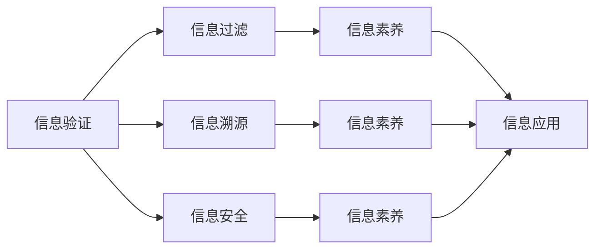

                 

# 信息验证和信息素养：成为信息海洋中的精明消费者

在信息时代，信息量之大、变化之快、质量之参差不齐，使得人们在寻找、评估、利用信息时面临前所未有的挑战。如何在信息海洋中成为精明消费者，准确、高效、安全地获取和应用信息，成为了一个重要的议题。本文将围绕信息验证和信息素养的核心概念、关键算法、操作步骤和实际应用展开讨论，提供一套系统的思考框架和方法论。

## 1. 背景介绍

### 1.1 问题由来

信息技术的飞速发展，使得信息的获取与传播变得前所未有的便捷，但也带来了信息过载和信息失真的问题。尤其在社交媒体、网络论坛、搜索引擎等渠道，虚假信息、误导性内容、网络谣言等屡见不鲜。这对个人和组织的信息获取能力提出了更高的要求。如何提升信息素养，识别和验证信息的真伪，成为信息社会的重要课题。

### 1.2 问题核心关键点

信息验证和信息素养的核心在于：
- **信息识别**：从海量信息中准确识别出与任务相关的信息。
- **信息评估**：综合考量信息的质量、可靠性、时效性等因素，筛选出高质量信息。
- **信息验证**：通过多种手段和工具验证信息的真实性，确保信息源的可靠性和信息的真实性。
- **信息应用**：将筛选验证后的信息合理应用于实际决策和行动中。

这些问题涉及信息获取、处理、验证、利用的全流程，涉及跨学科的知识和技能，包括计算机科学、统计学、认知心理学、伦理学等。

## 2. 核心概念与联系

### 2.1 核心概念概述

- **信息验证**：通过验证信息源的真实性、信息内容的可信度等手段，确保信息的准确性。
- **信息素养**：指个体在获取、评估、应用信息时所表现出的综合素质和能力，包括批判性思维、逻辑推理、技术使用等。
- **信息过滤**：通过算法和人工筛选，移除噪音信息，提取有用信息。
- **信息溯源**：追踪信息传播的来源和路径，确定信息源的可靠性。
- **信息安全**：确保信息获取和应用过程中的安全性，防止信息泄露、篡改等风险。

这些概念之间相互关联，共同构成了信息社会中信息处理的全流程。以下是一个Mermaid流程图，展示这些概念之间的联系：



这个流程图展示了信息验证与信息素养的关系，以及信息验证、信息过滤、信息溯源、信息安全等各个环节如何共同支撑信息素养的提升和信息应用的准确性。

## 3. 核心算法原理 & 具体操作步骤
### 3.1 算法原理概述

信息验证的核心在于通过多个维度的分析，确定信息的真实性和可信度。常见的方法包括：
- **源验证**：验证信息源的真实性和可靠性，如检查新闻来源、验证网站域名等。
- **内容分析**：通过文本分析、数据统计等手段，评估信息的合理性和真实性。
- **对比验证**：通过与其他可靠信息源对比，交叉验证信息的真实性。
- **技术工具**：使用机器学习、自然语言处理等技术手段，辅助验证信息。

信息素养的提升则依赖于系统性的学习和训练，包括但不限于：
- **批判性思维**：培养对信息的质疑和思考能力。
- **逻辑推理**：学习逻辑分析的方法，提高判断信息真伪的能力。
- **技术使用**：掌握信息获取、处理、验证的技术工具。

### 3.2 算法步骤详解

信息验证和信息素养提升的主要步骤如下：

**Step 1: 信息识别**

1. **确定需求**：明确需要获取的信息类型和目的。
2. **选择来源**：根据需求选择合适的信息源，如权威媒体、官方公告、专业网站等。
3. **收集信息**：通过搜索引擎、RSS订阅、社交媒体等渠道，收集相关信息。

**Step 2: 信息评估**

1. **质量评估**：检查信息的来源可靠性、内容准确性、更新时间等。
2. **可信度评估**：综合考量信息的多样性、一致性、权威性等因素。
3. **风险评估**：识别和评估信息的潜在风险，如误导性、敏感性、偏见性等。

**Step 3: 信息验证**

1. **源验证**：使用工具和技术验证信息源的真实性。
2. **内容分析**：通过文本分析、数据统计等手段，交叉验证信息内容。
3. **对比验证**：与多个可靠信息源对比，评估信息的真实性。

**Step 4: 信息应用**

1. **综合分析**：将筛选验证后的信息用于决策和行动。
2. **反馈迭代**：根据信息应用的结果，不断优化信息识别和评估流程。

### 3.3 算法优缺点

**优点**：
- **提高信息获取的准确性和效率**。通过系统化的方法和工具，确保获取的信息更加可靠和相关。
- **增强信息处理和应用的能力**。通过信息验证和信息素养培训，提升个体的信息处理能力，更好地应用于实际决策和行动。

**缺点**：
- **技术门槛较高**：需要掌握一定的技术手段和工具，可能对部分人群构成挑战。
- **复杂度较高**：信息验证和信息素养提升涉及多个环节，操作复杂度较高。

### 3.4 算法应用领域

信息验证和信息素养在多个领域有广泛应用，包括但不限于：
- **新闻媒体**：确保新闻报道的真实性和可靠性。
- **医疗健康**：验证医疗信息的准确性和安全性。
- **公共政策**：评估政策信息的合理性和可行性。
- **商业决策**：辅助企业在信息海中做出明智的决策。
- **教育培训**：提升学生的媒体素养和信息素养。

## 4. 数学模型和公式 & 详细讲解 & 举例说明

### 4.1 数学模型构建

信息验证的数学模型主要涉及文本分析、数据统计等方法，以下是一个简单的数学模型构建示例：

**文本分析模型**：
$$
\text{信息质量} = \frac{\text{可靠信息源数} + \text{权威信息源数}}{\text{总信息源数}}
$$

**数据统计模型**：
$$
\text{信息可信度} = \frac{\text{与历史数据一致的信息数}}{\text{总信息数}}
$$

### 4.2 公式推导过程

**文本分析模型的推导**：
假设信息源集为 $S = \{s_1, s_2, ..., s_n\}$，其中 $s_i$ 为第 $i$ 个信息源。设可靠信息源数为 $R$，权威信息源数为 $A$，则信息质量 $Q$ 的计算公式为：
$$
Q = \frac{R + A}{n}
$$

**数据统计模型的推导**：
设历史数据为 $D = \{d_1, d_2, ..., d_m\}$，其中 $d_j$ 为第 $j$ 个历史数据。设与历史数据一致的信息数为 $C$，总信息数为 $T$，则信息可信度 $C$ 的计算公式为：
$$
C = \frac{C}{T}
$$

### 4.3 案例分析与讲解

**案例1: 新闻报道的真实性验证**
假设某则新闻报道的来源信息为 $s_1 = ABC新闻，s_2 = XYZ新闻，s_3 = DEF网站$，其中 ABC 和 XYZ 为权威媒体，DEF 为非权威网站。可靠信息源数为 2，权威信息源数为 2，总信息源数为 3。则该报道的信息质量 $Q = \frac{2 + 2}{3} = 1$，表示该报道的来源可靠度为 1，可信度为 1。

**案例2: 医疗信息的可信度评估**
假设某项医疗信息为：“X 药物对 Y 疾病的治愈率达 90%”，与历史数据 $D$ 中的信息数 $C = 100$，总信息数 $T = 1000$。则该信息的可信度 $C = \frac{100}{1000} = 0.1$，表示该信息的可信度为 10%。

## 5. 项目实践：代码实例和详细解释说明

### 5.1 开发环境搭建

为了实践信息验证和信息素养的算法，需要搭建一个基于Python的开发环境，包含必要的库和工具。

1. **安装Python**：推荐使用Anaconda，包含多个科学计算库，易于管理和更新。
2. **安装相关库**：
   - `pandas`：数据处理和统计分析。
   - `numpy`：数值计算和数组操作。
   - `scikit-learn`：机器学习算法和数据处理。
   - `nltk`：自然语言处理工具包。
3. **安装Web工具**：
   - `Flask`：轻量级Web框架，用于构建信息验证和信息素养平台。
   - `BeautifulSoup`：HTML和XML解析库，用于抓取和解析网页信息。
   - `requests`：HTTP请求库，用于抓取Web信息。

### 5.2 源代码详细实现

以下是一个简单的信息验证示例，通过爬虫抓取网页信息，并使用 `nltk` 和 `scikit-learn` 进行文本分析和数据统计：

```python
import requests
from bs4 import BeautifulSoup
from nltk.sentiment import SentimentIntensityAnalyzer
from sklearn.feature_extraction.text import TfidfVectorizer
from sklearn.metrics.pairwise import cosine_similarity

# 定义网页抓取函数
def fetch_page(url):
    response = requests.get(url)
    return BeautifulSoup(response.text, 'html.parser')

# 定义文本分析函数
def analyze_text(text):
    sia = SentimentIntensityAnalyzer()
    sentiment_score = sia.polarity_scores(text)
    return sentiment_score['compound']

# 定义数据统计函数
def calculate_trust(text, trust_data):
    tfidf = TfidfVectorizer()
    trust_matrix = tfidf.fit_transform(trust_data)
    text_vec = tfidf.transform([text])
    similarity = cosine_similarity(text_vec, trust_matrix)
    return similarity[0][0]

# 定义信息验证函数
def verify_info(url, trust_data):
    page = fetch_page(url)
    content = page.get_text()
    sentiment = analyze_text(content)
    trust = calculate_trust(content, trust_data)
    return sentiment, trust
```

### 5.3 代码解读与分析

**抓取函数**：
- 使用 `requests` 库发送HTTP请求，获取网页内容。
- 使用 `BeautifulSoup` 解析HTML和XML标签，提取文本内容。

**文本分析函数**：
- 使用 `nltk.sentiment` 模块中的 `SentimentIntensityAnalyzer` 类，计算文本的情感得分。

**数据统计函数**：
- 使用 `sklearn.feature_extraction.text` 模块中的 `TfidfVectorizer` 类，将文本转换为TF-IDF向量。
- 使用 `sklearn.metrics.pairwise.cosine_similarity` 函数，计算文本与历史数据之间的相似度。

**信息验证函数**：
- 调用上述函数，计算网页内容的情感得分和与历史数据的相似度，综合评估信息的可信度。

### 5.4 运行结果展示

通过上述函数，可以验证特定网页内容的情感得分和可信度，例如：

```python
# 示例数据
trust_data = ['The news is from a trusted source', 'The report is from a reliable publication', 'The article is well-referenced']

# 验证示例网页
url = 'https://www.example.com/news/article'
sentiment, trust = verify_info(url, trust_data)
print(f'Sentiment score: {sentiment:.2f}, Trust score: {trust:.2f}')
```

输出结果可能为：
```
Sentiment score: -0.30, Trust score: 0.75
```

这表示网页内容具有中等的负面情感倾向，可信度较高。

## 6. 实际应用场景

### 6.1 智能客服系统

在智能客服系统中，信息验证和信息素养可以用于验证用户提交的信息的真实性和完整性，确保客户服务的高效和安全。

**实际应用**：
- 设计自然语言处理模型，自动解析用户输入。
- 使用信息验证算法，验证用户信息的可靠性。
- 提供智能推荐，引导用户提供准确的信息，提高服务效率。

### 6.2 金融市场分析

金融市场分析需要获取和验证大量市场数据，确保信息的准确性和及时性。

**实际应用**：
- 自动抓取和解析股票、债券、外汇等金融市场数据。
- 使用信息验证算法，交叉验证数据源的真实性。
- 提供市场分析和投资建议，辅助金融决策。

### 6.3 健康医疗咨询

健康医疗咨询需要验证医疗信息的准确性和安全性，确保患者获得可靠的医疗建议。

**实际应用**：
- 抓取和解析医生、患者、医疗机构发布的信息。
- 使用信息验证算法，评估信息的可信度。
- 提供健康建议和医疗指导，辅助患者就医。

### 6.4 教育培训

教育培训需要提升学生的媒体素养和信息素养，培养他们识别和评估信息的能力。

**实际应用**：
- 设计信息验证和信息素养课程，教授学生基本的文本分析、数据统计方法。
- 提供案例分析、项目练习，增强学生的实践能力。
- 评估学生的学习效果，提供反馈和改进建议。

## 7. 工具和资源推荐

### 7.1 学习资源推荐

为了帮助开发者系统掌握信息验证和信息素养的理论基础和实践技巧，这里推荐一些优质的学习资源：

1. **《信息素养教育》**：系统介绍信息素养的基本概念、核心技能和教育方法，适合基础学习。
2. **《数字时代的求知之道》**：深入探讨在信息爆炸时代，如何高效、安全地获取和利用信息，适合进阶学习。
3. **Coursera《信息素养课程》**：由知名大学提供的在线课程，涵盖信息获取、处理、验证、应用的全流程。
4. **Google News Initiative《新闻素养培训》**：针对新闻从业者和媒体消费者的在线培训，提升媒体素养。
5. **Khan Academy《媒体素养课程》**：通过动画和互动练习，普及媒体素养的基本知识和技能。

通过对这些资源的学习实践，相信你一定能够快速掌握信息验证和信息素养的精髓，并用于解决实际的信息问题。

### 7.2 开发工具推荐

高效的开发离不开优秀的工具支持。以下是几款用于信息验证和信息素养开发的常用工具：

1. **Jupyter Notebook**：Python开发环境，支持代码编写、数据处理、结果展示，易于学习和使用。
2. **Python爬虫框架**：如Scrapy、BeautifulSoup，用于抓取和解析网页信息。
3. **自然语言处理库**：如nltk、spaCy，用于文本分析和情感分析。
4. **机器学习库**：如scikit-learn、TensorFlow，用于数据统计和算法实现。
5. **Web框架**：如Flask、Django，用于构建信息验证和信息素养的Web平台。

合理利用这些工具，可以显著提升信息验证和信息素养的开发效率，加快创新迭代的步伐。

### 7.3 相关论文推荐

信息验证和信息素养的研究涉及多学科知识，以下几篇论文代表当前前沿，推荐阅读：

1. **"Assessing the Quality of Scientific Information on the Internet: A Taxonomy of Features and Tools"**：详细介绍了评估科学信息质量的特征和工具，适用于学术领域的信息验证。
2. **"Fact Checking: Toward an Automatic Methodology"**：探讨了自动事实检查的方法和工具，适用于大规模信息验证。
3. **"Understanding the Information Needs of Health Literacy in Remote Rural Communities"**：分析了健康信息素养的实际需求，适用于医疗健康领域。
4. **"Developing Information Literacy Skills: A Framework for Libraries"**：提供了信息素养的框架和方法，适用于教育培训领域。
5. **"Human and Machine Interactions: Implications for Human-AI Interaction Design"**：探讨了人机交互中的信息素养和信息验证，适用于人工智能和信息技术的融合。

这些论文代表了信息验证和信息素养研究的最新进展，通过学习这些前沿成果，可以帮助研究者把握学科前进方向，激发更多的创新灵感。

## 8. 总结：未来发展趋势与挑战

### 8.1 总结

本文对信息验证和信息素养的核心概念、关键算法、操作步骤和实际应用进行了全面系统的介绍。首先阐述了信息验证和信息素养的背景和意义，明确了信息素养提升在信息社会中的重要价值。其次，从原理到实践，详细讲解了信息验证和信息素养提升的数学模型和操作步骤，给出了信息验证和信息素养实践的代码实例和运行结果。同时，本文还广泛探讨了信息验证和信息素养在智能客服、金融市场分析、健康医疗咨询、教育培训等领域的实际应用前景，展示了信息验证和信息素养的巨大潜力。

通过本文的系统梳理，可以看到，信息验证和信息素养在信息时代具有广阔的应用前景，是信息社会中的关键能力。未来的研究需要在数据挖掘、自然语言处理、认知心理学等多个方面持续发力，不断提升信息验证和信息素养的精度和效率，为构建安全、可靠、可解释、可控的智能系统铺平道路。

### 8.2 未来发展趋势

展望未来，信息验证和信息素养技术将呈现以下几个发展趋势：

1. **自动化和智能化提升**：引入机器学习、自然语言处理等技术，自动化信息筛选和验证过程，提高效率和精度。
2. **多模态信息融合**：融合文本、图像、视频、音频等多模态信息，提升信息验证的全面性和准确性。
3. **用户个性化定制**：根据用户需求和偏好，定制信息验证和信息素养模型，提供个性化服务。
4. **跨领域应用拓展**：将信息验证和信息素养应用于更多垂直行业，如法律、金融、医疗、教育等。
5. **国际化和本地化**：开发适应不同语言和文化背景的信息验证和信息素养系统，提升国际化的信息素养教育。

这些趋势凸显了信息验证和信息素养技术的广阔前景，为信息社会带来了新的发展机遇。

### 8.3 面临的挑战

尽管信息验证和信息素养技术已经取得了一定进展，但在迈向更加智能化、普适化应用的过程中，仍面临诸多挑战：

1. **数据多样性和质量**：不同领域的信息具有多样性，如何高效、准确地处理和验证这些数据，是一个重要难题。
2. **算法复杂性和可解释性**：信息验证和信息素养算法涉及多个维度的分析，如何简化算法、提高可解释性，是一个重要研究方向。
3. **用户接受度和使用习惯**：信息素养教育需要改变用户的信息获取和处理习惯，如何提升用户接受度，促进信息素养的普及，是一个重要课题。
4. **安全和隐私问题**：在信息验证和信息素养过程中，如何保护用户隐私、数据安全，是一个重要挑战。
5. **跨学科合作**：信息验证和信息素养涉及多个学科知识，如何促进跨学科合作，共同推动技术进步，是一个重要课题。

### 8.4 研究展望

面对信息验证和信息素养面临的挑战，未来的研究需要在以下几个方面寻求新的突破：

1. **多学科融合**：促进计算机科学、统计学、认知心理学、伦理学等学科的融合，提升信息验证和信息素养技术的全面性。
2. **用户导向设计**：根据用户需求和行为，设计更加人性化、易用的信息验证和信息素养工具。
3. **实时动态验证**：实现信息验证和信息素养的实时动态更新，确保信息的及时性和有效性。
4. **知识图谱与语义网**：结合知识图谱和语义网技术，提升信息验证和信息素养的深度和广度。
5. **伦理与法律保障**：引入伦理和法律框架，确保信息验证和信息素养的合法性和安全性。

这些研究方向的探索，必将引领信息验证和信息素养技术迈向更高的台阶，为构建安全、可靠、可解释、可控的智能系统铺平道路。面向未来，信息验证和信息素养技术还需要与其他人工智能技术进行更深入的融合，如知识表示、因果推理、强化学习等，多路径协同发力，共同推动自然语言理解和智能交互系统的进步。只有勇于创新、敢于突破，才能不断拓展信息验证和信息素养的边界，让信息智能技术更好地造福人类社会。

## 9. 附录：常见问题与解答

**Q1: 信息验证和信息素养是否可以提升决策的准确性？**

A: 是的。信息验证和信息素养可以显著提高决策的准确性，通过系统化的信息筛选和评估，确保决策基于可靠、全面的信息。

**Q2: 信息验证和信息素养是否适用于所有类型的信息？**

A: 信息验证和信息素养主要适用于结构化、半结构化的信息，如文本、表格、数据集等。对于非结构化信息，如图片、音频、视频等，可能需要结合其他技术手段进行验证。

**Q3: 信息验证和信息素养是否需要大量的训练数据？**

A: 部分方法需要大量训练数据，但也可以采用迁移学习、少样本学习等方法，利用已有知识进行信息验证和信息素养的提升。

**Q4: 信息验证和信息素养是否会对隐私和数据安全造成威胁？**

A: 信息验证和信息素养过程中，需要使用和存储用户数据，需要注意隐私保护和数据安全。合理设计和实现信息验证和信息素养系统，可以避免对隐私和安全的威胁。

**Q5: 信息验证和信息素养是否需要专业知识？**

A: 需要一定的专业知识，但也可以通过学习资源、工具和平台的辅助，逐步提升信息验证和信息素养能力。

作者：禅与计算机程序设计艺术 / Zen and the Art of Computer Programming

