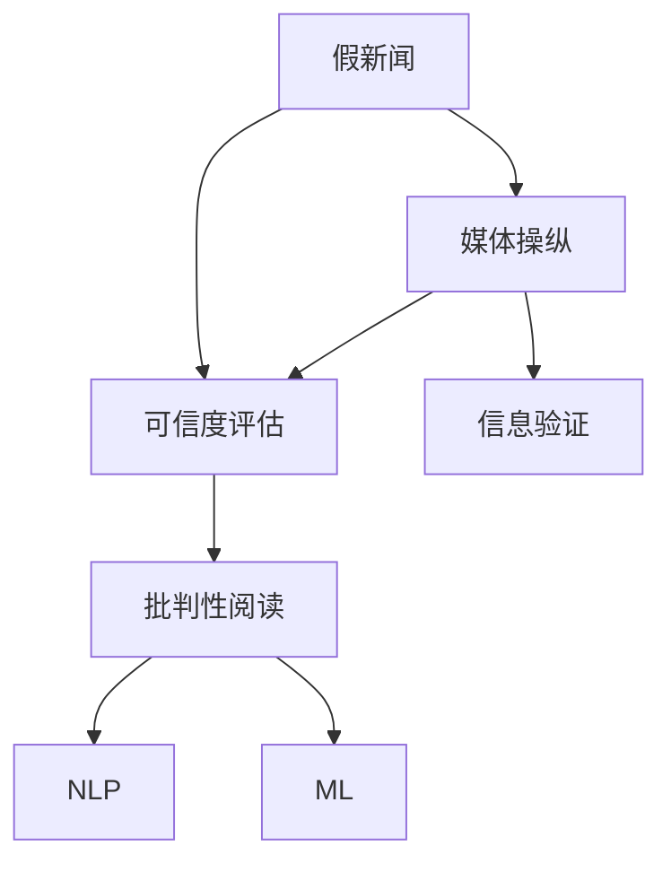

                 

# 信息验证和批判性阅读指南：在假新闻和媒体操纵时代导航

> 关键词：信息验证, 假新闻, 媒体操纵, 批判性阅读, 自动检测, 可信度评估, 人工智能, 数据挖掘, 机器学习

## 1. 背景介绍

在信息爆炸的互联网时代，新闻和信息的传播速度越来越快，但同时，信息的质量和真实性问题也日益凸显。假新闻、媒体操纵、信息误导等现象层出不穷，严重干扰了公众的认知和判断。如何提高信息的真实性和可信度，成为了一个亟待解决的问题。

本文将系统介绍信息验证和批判性阅读的相关技术和方法，探讨如何利用人工智能和大数据技术来检测假新闻、评估媒体可信度，并指导公众进行批判性阅读。通过学习本文，你将掌握如何利用技术手段提高信息的可靠性，避免被假新闻所误导。

## 2. 核心概念与联系

### 2.1 核心概念概述

在信息验证和批判性阅读领域，涉及多个关键概念和技术。本节将对这些核心概念进行简要介绍，并说明它们之间的联系。

- **假新闻（False News）**：故意编造或夸大事实，用以误导公众的新闻报道。
- **媒体操纵（Media Manipulation）**：通过有意修改、选择或扭曲信息，达到特定目的的行为。
- **可信度评估（Credibility Assessment）**：通过算法模型评估信息源或内容可信度的过程。
- **信息验证（Information Verification）**：通过技术和人工手段验证信息真实性和准确性的过程。
- **批判性阅读（Critical Reading）**：在阅读过程中，识别、分析和评估信息的可靠性，提升判断能力。
- **自然语言处理（Natural Language Processing, NLP）**：使用计算机科学和人工智能技术，对文本数据进行处理和分析的技术。
- **机器学习（Machine Learning, ML）**：使计算机系统具备学习能力，通过数据训练优化算法。

这些概念之间的联系如下图所示：



在信息验证和批判性阅读的过程中，媒体操纵是产生假新闻的源头，可信度评估用于检测媒体操纵，信息验证是关键手段，而批判性阅读则是提高公众判断力的目标。这些概念共同构成了信息时代新闻和信息管理的核心框架。

## 3. 核心算法原理 & 具体操作步骤
### 3.1 算法原理概述

信息验证和批判性阅读的技术手段多种多样，但核心原理均围绕可信度评估展开。可信度评估模型的基本思想是通过对信息源和内容的多个特征进行综合分析，给出其可信度得分。这些特征包括但不限于：

- **信息源特征**：如作者背景、出版平台、历史表现等。
- **内容特征**：如语言风格、逻辑连贯性、事实准确性等。

可信度评估模型的构建，通常包括以下几个步骤：

1. **特征工程**：从新闻数据中提取和构造相关特征。
2. **模型训练**：使用标注数据训练机器学习模型，学习特征与可信度之间的关系。
3. **预测评估**：使用测试集对模型进行评估，调整参数和特征以优化性能。

### 3.2 算法步骤详解

#### 3.2.1 特征工程

特征工程是可信度评估模型的关键步骤。新闻和信息的多样性意味着需要提取多种特征。以下是一个特征工程的简单示例：

- **作者背景**：提取作者的职业、教育背景、过往发布文章的质量等。
- **出版平台**：评估出版平台的权威性和公正性，如是否有历史不实报道记录等。
- **内容语言特征**：分析文本中的语义复杂度、语气、用词选择等，判断是否存在夸大或误导性。
- **事实准确性**：通过数据库或公开信息验证文章中提到的事实是否准确。

#### 3.2.2 模型训练

常用的机器学习模型包括支持向量机（SVM）、随机森林（Random Forest）、深度学习（如LSTM、Transformer）等。以LSTM模型为例，训练过程包括：

1. 准备标注数据集：收集标注好的假新闻和真实新闻，用于模型训练。
2. 数据预处理：清洗和标准化数据，提取特征。
3. 模型构建：使用LSTM搭建模型，设置损失函数和优化器。
4. 训练过程：迭代训练模型，最小化损失函数。
5. 模型评估：使用验证集评估模型性能，调整超参数。

#### 3.2.3 预测评估

评估模型的效果时，通常使用F1分数、准确率、召回率等指标。具体评估步骤如下：

1. 准备测试集：使用与训练集无关的测试数据集。
2. 预测可信度：输入测试集样本，输出可信度评分。
3. 评估指标：计算预测结果与真实标签的匹配度，如F1分数。

### 3.3 算法优缺点

可信度评估模型具有以下优点：

- **自动化**：使用机器学习技术，可以快速处理大量数据，提高评估效率。
- **客观性**：基于数据和模型训练，减少人工评估的主观偏差。

但同时也存在一些局限：

- **数据依赖**：模型的性能依赖于标注数据的质量和数量，标注成本较高。
- **模型复杂性**：复杂的模型可能需要更多的计算资源和时间进行训练。
- **动态变化**：模型的性能可能受到信息源和内容的变化而下降。

### 3.4 算法应用领域

可信度评估技术可以广泛应用于多个领域，包括但不限于：

- **新闻媒体**：评估新闻媒体的报道可信度，防止假新闻传播。
- **社交网络**：检测和筛选社交媒体上的假信息和误导性内容。
- **政府和企业**：用于评估公开信息的可靠性，保护公共利益。
- **教育领域**：帮助教师和学生区分可信和不可信的信息来源。

## 4. 数学模型和公式 & 详细讲解  
### 4.1 数学模型构建

假设可信度评估模型为$f(x)$，其中$x$为输入的新闻特征向量。模型的输出为可信度评分，通常取值范围为[0,1]，0表示完全不可信，1表示完全可信。

模型构建过程可以表示为：

$$
\theta^* = \arg\min_\theta \mathcal{L}(\theta)
$$

其中，$\theta$为模型参数，$\mathcal{L}$为损失函数，常用的损失函数有交叉熵损失、均方误差损失等。

### 4.2 公式推导过程

以交叉熵损失为例，假设模型的预测可信度为$\hat{y}$，真实标签为$y$，则交叉熵损失为：

$$
\mathcal{L} = -\frac{1}{N} \sum_{i=1}^N y_i \log \hat{y}_i + (1-y_i) \log (1-\hat{y}_i)
$$

其中$N$为样本数。

使用梯度下降等优化算法更新模型参数$\theta$：

$$
\theta \leftarrow \theta - \eta \nabla_{\theta}\mathcal{L}(\theta)
$$

其中$\eta$为学习率，$\nabla_{\theta}\mathcal{L}(\theta)$为损失函数对模型参数的梯度。

### 4.3 案例分析与讲解

以下是一个简单的可信度评估案例：

1. 准备数据集：收集200篇新闻文章，其中100篇为假新闻，100篇为真实新闻。
2. 提取特征：提取每篇新闻的作者背景、发布平台、用词频率等特征。
3. 训练模型：使用支持向量机（SVM）训练模型，设置交叉验证，优化参数。
4. 评估模型：使用测试集评估模型性能，计算F1分数。

## 5. 项目实践：代码实例和详细解释说明
### 5.1 开发环境搭建

本节将介绍如何搭建开发环境，包括安装Python、TensorFlow等工具和库。

1. 安装Anaconda：从官网下载并安装Anaconda，用于创建独立的Python环境。
2. 创建虚拟环境：
```bash
conda create -n my_env python=3.8
conda activate my_env
```
3. 安装TensorFlow和其他依赖库：
```bash
pip install tensorflow numpy scipy pandas sklearn matplotlib
```

### 5.2 源代码详细实现

以下是一个基于TensorFlow的可信度评估模型实现示例。

```python
import tensorflow as tf
from sklearn.model_selection import train_test_split
from sklearn.metrics import f1_score
import numpy as np

# 定义模型
class CredibilityModel(tf.keras.Model):
    def __init__(self):
        super(CredibilityModel, self).__init__()
        self.dense1 = tf.keras.layers.Dense(64, activation='relu')
        self.dense2 = tf.keras.layers.Dense(1, activation='sigmoid')

    def call(self, x):
        x = self.dense1(x)
        x = self.dense2(x)
        return x

# 准备数据
def prepare_data():
    # 读取新闻数据
    with open('news.csv', 'r') as f:
        lines = f.readlines()
    # 提取特征和标签
    X = []
    y = []
    for line in lines:
        data = line.split(',')
        X.append(data[:-1])
        y.append(int(data[-1]))
    # 数据标准化
    X = np.array(X)
    X = (X - np.mean(X, axis=0)) / np.std(X, axis=0)
    # 划分训练集和测试集
    X_train, X_test, y_train, y_test = train_test_split(X, y, test_size=0.2, random_state=42)
    # 转换为TensorFlow格式
    X_train = tf.convert_to_tensor(X_train)
    X_test = tf.convert_to_tensor(X_test)
    y_train = tf.convert_to_tensor(y_train)
    y_test = tf.convert_to_tensor(y_test)
    return X_train, X_test, y_train, y_test

# 训练模型
def train_model(model, X_train, X_test, y_train, y_test):
    # 定义损失函数和优化器
    loss_fn = tf.keras.losses.BinaryCrossentropy()
    optimizer = tf.keras.optimizers.Adam()
    # 训练过程
    for epoch in range(100):
        with tf.GradientTape() as tape:
            y_pred = model(X_train)
            loss = loss_fn(y_pred, y_train)
        gradients = tape.gradient(loss, model.trainable_variables)
        optimizer.apply_gradients(zip(gradients, model.trainable_variables))
        # 评估模型
        if epoch % 10 == 0:
            y_pred = model(X_test)
            f1 = f1_score(y_test, np.round(y_pred.numpy()))

# 测试模型
def test_model(model, X_test, y_test):
    y_pred = model(X_test)
    f1 = f1_score(y_test, np.round(y_pred.numpy()))
    print(f'F1 score: {f1}')

# 主程序
if __name__ == '__main__':
    X_train, X_test, y_train, y_test = prepare_data()
    model = CredibilityModel()
    train_model(model, X_train, X_test, y_train, y_test)
    test_model(model, X_test, y_test)
```

### 5.3 代码解读与分析

本节将对示例代码进行详细解读：

1. `prepare_data`函数：读取数据集，提取特征和标签，并转换为TensorFlow格式。
2. `train_model`函数：定义模型、损失函数和优化器，使用梯度下降优化模型参数。
3. `test_model`函数：评估模型性能，计算F1分数。
4. 主程序：加载数据，训练模型，评估模型。

## 6. 实际应用场景
### 6.1 新闻媒体

在新闻媒体领域，可信度评估可以用于新闻筛选和推荐。例如，社交新闻平台可以通过可信度评估模型，对新闻文章进行自动筛选和推荐，减少假新闻的传播。

### 6.2 社交网络

社交网络平台可以应用可信度评估技术，对用户发布的内容进行审核和标注，防止假信息和误导性内容传播。

### 6.3 政府和企业

政府和企业可以使用可信度评估技术，评估公开信息的可信度，提升信息透明度和公信力。

### 6.4 未来应用展望

未来，可信度评估技术将进一步发展，融入更多先进的算法和数据处理技术。例如：

- **深度学习模型**：使用Transformer等深度学习模型，提升模型的精度和泛化能力。
- **多模态融合**：结合文本、图像、音频等多模态数据，提升模型的综合分析能力。
- **实时评估**：引入实时数据流和在线学习，提高模型对动态信息源和内容的适应性。

## 7. 工具和资源推荐
### 7.1 学习资源推荐

1. **《深度学习基础》**：吴恩达的Coursera课程，系统介绍深度学习基础知识和应用。
2. **《TensorFlow官方文档》**：详细介绍了TensorFlow的使用方法和高级技巧。
3. **《自然语言处理入门》**：斯坦福大学NLP课程，涵盖NLP的基本概念和前沿技术。
4. **Kaggle竞赛平台**：参与NLP相关的竞赛，实践和提升技术能力。
5. **Hugging Face博客**：提供最新的NLP技术进展和应用案例。

### 7.2 开发工具推荐

1. **PyTorch**：强大的深度学习框架，支持动态图计算和GPU加速。
2. **TensorFlow**：Google开发的深度学习框架，支持分布式计算和GPU加速。
3. **Transformers**：自然语言处理工具库，提供了多种预训练语言模型。
4. **Scikit-learn**：Python数据挖掘和机器学习库，提供多种机器学习算法。
5. **NLTK**：自然语言处理工具包，提供文本处理和分析功能。

### 7.3 相关论文推荐

1. **《深度学习在假新闻检测中的应用》**：介绍深度学习在假新闻检测中的应用，以及相关算法和模型。
2. **《基于深度学习的可信度评估模型》**：详细介绍了基于深度学习的可信度评估模型及其应用。
3. **《自然语言处理中的信息验证》**：探讨自然语言处理中的信息验证技术及其发展趋势。
4. **《可信度评估框架》**：介绍可信度评估框架及其应用，涵盖多个领域的案例。
5. **《批判性阅读与人工智能》**：探讨批判性阅读和人工智能的结合，提高公众信息素养。

## 8. 总结：未来发展趋势与挑战
### 8.1 研究成果总结

本文系统介绍了信息验证和批判性阅读的技术，包括可信度评估模型的构建、特征工程、模型训练和预测评估等关键环节。通过详细讲解，读者可以理解信息验证和批判性阅读的基本原理和操作步骤，掌握其核心技术和应用方法。

### 8.2 未来发展趋势

未来，可信度评估技术将持续发展和创新，主要趋势包括：

1. **深度学习模型**：使用更先进的深度学习模型，提升模型的精度和泛化能力。
2. **多模态融合**：结合文本、图像、音频等多模态数据，提升模型的综合分析能力。
3. **实时评估**：引入实时数据流和在线学习，提高模型对动态信息源和内容的适应性。
4. **联邦学习**：使用联邦学习技术，保护隐私的同时提高模型的泛化能力。
5. **对抗性鲁棒性**：提升模型对对抗样本的鲁棒性，防止恶意攻击。

### 8.3 面临的挑战

尽管可信度评估技术取得了一定的进展，但仍面临以下挑战：

1. **数据质量**：标注数据的获取和维护成本较高，数据质量直接影响模型的性能。
2. **模型泛化**：模型的泛化能力有限，可能对新出现的信息源和内容适应性不足。
3. **计算资源**：深度学习模型的训练和推理需要大量计算资源，可能对普通用户造成高门槛。
4. **隐私保护**：在信息验证和批判性阅读中，如何保护用户隐私，防止数据泄露。

### 8.4 研究展望

未来的研究应重点关注以下几个方面：

1. **数据增强技术**：开发更高效的数据增强方法，提升模型的泛化能力。
2. **模型优化**：研究更加高效的模型结构和优化算法，提升模型的性能和效率。
3. **联邦学习**：利用联邦学习技术，保护隐私的同时提升模型的泛化能力。
4. **对抗性鲁棒性**：研究模型对抗性鲁棒性，防止恶意攻击。
5. **伦理和法律**：研究和制定可信度评估的伦理和法律框架，保护用户隐私和权益。

## 9. 附录：常见问题与解答

**Q1：可信度评估模型是否适用于所有类型的新闻和信息？**

A: 可信度评估模型主要依赖数据进行训练，不同类型的新闻和信息可能具有不同的特征，需要针对性地进行特征提取和模型训练。例如，新闻报道和社交媒体内容具有不同的语言风格和传播特点，需要设计不同的特征和模型结构。

**Q2：如何保证可信度评估模型的公平性和准确性？**

A: 保证可信度评估模型的公平性和准确性，主要依赖以下措施：

1. **数据多样性**：收集多样化的数据集，涵盖不同类型和来源的新闻和信息，避免模型对特定类型数据的过拟合。
2. **公开透明**：公开模型训练过程和结果，接受学术和公众的监督和审查。
3. **定期更新**：定期更新模型和数据集，保持模型的时效性和适应性。
4. **人工验证**：结合人工验证手段，对模型输出进行复核，确保结果的可靠性。

**Q3：可信度评估模型的应用过程中，如何处理假新闻检测的误报和漏报？**

A: 在假新闻检测过程中，误报和漏报是常见的现象。处理这些问题的措施包括：

1. **阈值调整**：通过调整可信度评分阈值，控制模型的误报率和漏报率。
2. **人工审核**：引入人工审核机制，对模型输出的结果进行复核，确保检测结果的准确性。
3. **模型优化**：通过优化模型结构和参数，减少误报和漏报。
4. **多模型集成**：使用多个可信度评估模型进行集成，提高检测结果的鲁棒性。

---

作者：禅与计算机程序设计艺术 / Zen and the Art of Computer Programming

