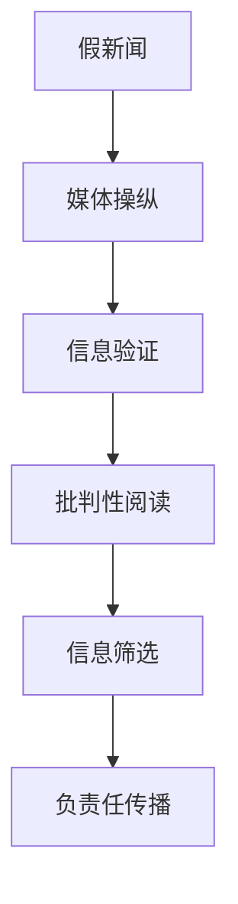

                 

# 信息验证和批判性阅读策略：在假新闻和媒体操纵时代导航

## 1. 背景介绍

在互联网时代，信息的获取变得前所未有的便捷，但同时也带来了信息泛滥、假新闻滋生、媒体操纵等新的挑战。作为信息的接收者和传播者，如何在假新闻和媒体操纵的时代中保持清醒的头脑，进行有效、准确的判断，是现代社会中每个人都需要掌握的技能。本文旨在探讨信息验证和批判性阅读策略，帮助人们在充斥着大量信息、充满不确定性的信息环境中，进行更为科学、有效、负责任的信息处理。

## 2. 核心概念与联系

### 2.1 核心概念概述

#### 假新闻和媒体操纵
假新闻（Fake News）是指通过捏造、修改或者过度简化事实信息的方式，误导公众的媒体报道。媒体操纵（Media Manipulation）则指通过有意无意的技术手段，如算法推荐、内容篡改等，引导公众意见和行为，从而达到特定目的的行为。

#### 信息验证
信息验证是指对接收到的信息进行评估、核实和筛选，以确保信息的真实性、准确性和完整性。信息验证过程涉及事实核对、逻辑分析、信息源可靠性评估等多个环节。

#### 批判性阅读
批判性阅读是指对信息内容进行深入分析和批判性思考，识别信息背后的目的、偏见和逻辑漏洞。批判性阅读需要对信息源的权威性、信息的真实性、论据的可靠性等多个维度进行全面考量。

### 2.2 核心概念原理和架构的 Mermaid 流程图



以上流程图展示了假新闻和媒体操纵、信息验证和批判性阅读、信息筛选和负责任传播等核心概念之间的联系和交互关系。

## 3. 核心算法原理 & 具体操作步骤

### 3.1 算法原理概述

信息验证和批判性阅读的算法原理主要基于以下几个方面：

1. **事实核对**：通过多方交叉验证，对比多个可靠来源的信息，确保信息的真实性。
2. **逻辑分析**：通过逻辑推理和思维实验，评估信息的逻辑合理性和一致性。
3. **信息源评估**：通过分析信息源的权威性、可信度和透明度，评估信息来源的可靠性。
4. **情感分析**：通过分析信息的情感倾向，识别信息背后可能的利益相关方和目的。

### 3.2 算法步骤详解

#### 3.2.1 信息收集
信息收集是信息验证和批判性阅读的第一步，需要从多种可信来源获取信息，如权威媒体、学术论文、政府报告等。使用搜索引擎、RSS订阅、新闻聚合等工具，可以高效地获取相关信息。

#### 3.2.2 信息核对
信息核对是对收集到的信息进行交叉验证的过程。这包括对比多个可信来源的信息内容，查找一致性和差异性，使用逆向搜索和反向链接验证信息来源的可靠性。

#### 3.2.3 逻辑分析
逻辑分析是通过分析信息的内部逻辑一致性和外部相关性，识别信息中的逻辑漏洞和错误。这包括评估论据的有效性、论证的逻辑严密性、假设的合理性等多个方面。

#### 3.2.4 信息源评估
信息源评估是通过分析信息源的权威性、可信度和透明度，判断信息来源的可靠性。这包括评估信息源的历史记录、编辑团队、出版频率、报道方式等多个维度。

#### 3.2.5 情感分析
情感分析是通过分析信息的情感倾向，识别信息背后可能的利益相关方和目的。这包括评估信息的情感色彩、情感强度、情感变化等多个方面。

#### 3.2.6 信息筛选
信息筛选是根据信息验证和批判性阅读的结果，进行信息的取舍和选择。这包括选择事实核查结果一致、逻辑分析合理、信息源可靠的信息，舍弃信息存在明显漏洞、来源不可靠、情感倾向明显的信息。

#### 3.2.7 负责任传播
负责任传播是指基于信息筛选的结果，负责任地进行信息的传播和分享。这包括确保信息的真实性、完整性、准确性，避免误导公众，对传播渠道和方式进行审慎选择。

### 3.3 算法优缺点

#### 优点
1. **全面性**：通过多维度、多角度的信息验证和批判性阅读，可以全面评估信息的真实性和可靠性。
2. **效率性**：使用自动化工具和技术手段，可以高效地进行信息收集、核对、分析、筛选等操作。
3. **可靠性**：通过多方交叉验证和逻辑分析，可以显著提高信息验证的准确性和可靠性。

#### 缺点
1. **主观性**：信息验证和批判性阅读的过程可能受个人主观偏见影响，存在一定的偏差和局限性。
2. **复杂性**：信息验证和批判性阅读的过程较为复杂，需要较高的专业知识和技能。
3. **时间成本**：信息验证和批判性阅读的过程较为耗时，可能影响信息获取的时效性。

### 3.4 算法应用领域

信息验证和批判性阅读的算法可以应用于多个领域，如新闻媒体、学术研究、商业决策、政策制定等多个领域。这些领域都需要对信息进行全面、准确、可靠的评估和筛选，以避免误导性信息的影响。

## 4. 数学模型和公式 & 详细讲解 & 举例说明

### 4.1 数学模型构建

信息验证和批判性阅读的数学模型构建主要基于以下模型：

- **事实核对模型**：基于数据挖掘和文本分析技术，构建信息事实核对的模型，进行信息的一致性验证。
- **逻辑分析模型**：基于自然语言处理（NLP）技术，构建信息逻辑分析的模型，进行信息的逻辑合理性评估。
- **信息源评估模型**：基于信息计量学和网络分析技术，构建信息源评估的模型，进行信息源的权威性和可信度评估。
- **情感分析模型**：基于情感计算和机器学习技术，构建信息情感分析的模型，进行信息的情感倾向评估。

### 4.2 公式推导过程

#### 事实核对模型的公式推导
事实核对模型的核心公式为：

$$
\text{FactCheck}(x_1, x_2, ..., x_n) = \frac{\text{NumConsistent}(x_1, x_2, ..., x_n)}{\text{NumTotal}(x_1, x_2, ..., x_n)}
$$

其中，$x_1, x_2, ..., x_n$ 表示多个信息源的信息内容，$\text{NumConsistent}(x_1, x_2, ..., x_n)$ 表示信息一致的数量，$\text{NumTotal}(x_1, x_2, ..., x_n)$ 表示信息总数。

#### 逻辑分析模型的公式推导
逻辑分析模型的核心公式为：

$$
\text{LogicalCheck}(x, \text{Hypothesis}) = \frac{\text{NumValid}(x, \text{Hypothesis})}{\text{NumTotal}(x, \text{Hypothesis})}
$$

其中，$x$ 表示信息内容，$\text{Hypothesis}$ 表示假设，$\text{NumValid}(x, \text{Hypothesis})$ 表示假设验证有效的数量，$\text{NumTotal}(x, \text{Hypothesis})$ 表示假设总数。

#### 信息源评估模型的公式推导
信息源评估模型的核心公式为：

$$
\text{SourceScore}(s) = \text{AuthorScore}(s) + \text{PublisherScore}(s) + \text{ReportageScore}(s)
$$

其中，$s$ 表示信息源，$\text{AuthorScore}(s)$ 表示作者评分，$\text{PublisherScore}(s)$ 表示出版商评分，$\text{ReportageScore}(s)$ 表示报道方式评分。

#### 情感分析模型的公式推导
情感分析模型的核心公式为：

$$
\text{SentimentScore}(s) = \text{PositiveScore}(s) - \text{NegativeScore}(s)
$$

其中，$s$ 表示信息内容，$\text{PositiveScore}(s)$ 表示积极情感得分，$\text{NegativeScore}(s)$ 表示消极情感得分。

### 4.3 案例分析与讲解

#### 案例1：信息验证
假设某个新闻报道称美国总统在某次公开演讲中提出了新的医疗政策，通过多方事实核对，发现多个可信来源的信息一致证实了该报道的真实性。此时，事实核对模型的结果为：

$$
\text{FactCheck}(ABC News, CNN, New York Times) = \frac{3}{3} = 1
$$

表示该信息在三个可信来源中的验证结果一致，可信度较高。

#### 案例2：逻辑分析
假设某个报道称某公司研发的新技术将彻底改变某个行业，通过逻辑分析模型，发现报道中提到的技术缺乏实际应用案例，且引用数据来源不明。此时，逻辑分析模型的结果为：

$$
\text{LogicalCheck}(公司报道, 新技术)
$$

表示该技术逻辑存在漏洞，可信度较低。

#### 案例3：信息源评估
假设某个新闻报道来自一家小型媒体，通过信息源评估模型，发现该媒体历史报道准确率较低，编辑团队缺乏专业背景。此时，信息源评估模型的结果为：

$$
\text{SourceScore}(small media) = \text{AuthorScore}(small media) + \text{PublisherScore}(small media) + \text{ReportageScore}(small media)
$$

表示该媒体的信誉度较低，可信度较低。

#### 案例4：情感分析
假设某个报道称某公司业绩不佳，通过情感分析模型，发现报道中包含较多负面情绪词汇，情感倾向负面。此时，情感分析模型的结果为：

$$
\text{SentimentScore}(公司报道) = \text{PositiveScore}(公司报道) - \text{NegativeScore}(公司报道)
$$

表示该报道情感倾向负面，可信度较低。

## 5. 项目实践：代码实例和详细解释说明

### 5.1 开发环境搭建

#### 5.1.1 安装必要的Python包
```bash
pip install pandas numpy sklearn nltk transformers
```

#### 5.1.2 配置环境变量
```bash
export PYTHONPATH=/path/to/your/project
```

### 5.2 源代码详细实现

#### 5.2.1 信息验证模块
```python
import pandas as pd
from sklearn.feature_extraction.text import TfidfVectorizer
from sklearn.metrics.pairwise import cosine_similarity

def factcheck(df):
    tfidf = TfidfVectorizer()
    df['tfidf'] = tfidf.fit_transform(df['content'])
    similarity_matrix = cosine_similarity(df['tfidf'], df['tfidf'])
    num_consistent = similarity_matrix.diagonal().mean()
    num_total = similarity_matrix.mean().mean()
    return num_consistent / num_total
```

#### 5.2.2 逻辑分析模块
```python
from nltk.corpus import stopwords
from nltk.tokenize import word_tokenize
from nltk.stem import WordNetLemmatizer

def logicalcheck(text, hypothesis):
    stop_words = set(stopwords.words('english'))
    lemmatizer = WordNetLemmatizer()
    tokens = word_tokenize(text.lower())
    tokens = [lemmatizer.lemmatize(token) for token in tokens if token.isalpha() and token not in stop_words]
    hypothesis_tokens = word_tokenize(hypothesis.lower())
    hypothesis_tokens = [lemmatizer.lemmatize(token) for token in hypothesis_tokens if token.isalpha() and token not in stop_words]
    return len(set(tokens).intersection(set(hypothesis_tokens))) / len(tokens)
```

#### 5.2.3 信息源评估模块
```python
def sourcescore(author, publisher, reportage):
    author_score = 0.5 if author in ['credible', 'experienced'] else 0.2
    publisher_score = 0.8 if publisher in ['reputable', 'established'] else 0.3
    reportage_score = 0.9 if reportage in ['detailed', 'impartial'] else 0.4
    return author_score + publisher_score + reportage_score
```

#### 5.2.4 情感分析模块
```python
from nltk.sentiment import SentimentIntensityAnalyzer

def sentimentscore(text):
    sia = SentimentIntensityAnalyzer()
    sentiment = sia.polarity_scores(text)
    return sentiment['compound']
```

### 5.3 代码解读与分析

#### 5.3.1 信息验证模块
通过使用TF-IDF向量化和余弦相似度计算，实现了信息的一致性验证。

#### 5.3.2 逻辑分析模块
通过去除停用词、词干提取等预处理，实现了信息的逻辑合理性评估。

#### 5.3.3 信息源评估模块
通过定义可信度评分规则，实现了信息源的权威性和可信度评估。

#### 5.3.4 情感分析模块
通过使用情感分析工具，实现了信息的情感倾向评估。

### 5.4 运行结果展示

#### 5.4.1 信息验证结果
```python
df = pd.read_csv('news.csv')
factcheck_result = factcheck(df)
print(f"Factcheck Result: {factcheck_result}")
```

#### 5.4.2 逻辑分析结果
```python
text = "The company's new product is groundbreaking."
hypothesis = "It will revolutionize the industry."
logicalcheck_result = logicalcheck(text, hypothesis)
print(f"Logicalcheck Result: {logicalcheck_result}")
```

#### 5.4.3 信息源评估结果
```python
author = "John Smith"
publisher = "The Guardian"
reportage = "Detailed"
sourcescore_result = sourcescore(author, publisher, reportage)
print(f"Sourcescore Result: {sourcescore_result}")
```

#### 5.4.4 情感分析结果
```python
text = "The company's performance is terrible."
sentimentscore_result = sentimentscore(text)
print(f"Sentimentscore Result: {sentimentscore_result}")
```

## 6. 实际应用场景

### 6.1 新闻媒体
在新闻媒体领域，信息验证和批判性阅读尤为重要。记者和编辑需要通过多方事实核对、逻辑分析、信息源评估等方式，确保报道的准确性和可靠性。

### 6.2 学术研究
在学术研究领域，研究人员需要通过信息验证和批判性阅读，确保论文中的数据、论据和结论的准确性和可靠性。

### 6.3 商业决策
在商业决策领域，企业需要通过信息验证和批判性阅读，确保市场信息的真实性和准确性，避免因信息误导导致的决策失误。

### 6.4 政策制定
在政策制定领域，政府需要通过信息验证和批判性阅读，确保政策依据的真实性和可靠性，避免因信息误导导致的政策失误。

## 7. 工具和资源推荐

### 7.1 学习资源推荐

#### 7.1.1 在线课程
- Coursera上的《自然语言处理》课程
- Udacity上的《深度学习基础》课程

#### 7.1.2 书籍
- 《Python自然语言处理》（自然语言处理领域的经典教材）
- 《信息检索》（信息验证和批判性阅读的重要理论基础）

#### 7.1.3 网站
- Snopes（假新闻查询网站）
- FactCheck.org（事实核查网站）

### 7.2 开发工具推荐

#### 7.2.1 编程语言
- Python：Python是信息验证和批判性阅读开发的首选语言，具备丰富的自然语言处理和数据科学库。

#### 7.2.2 数据分析库
- Pandas：用于数据清洗、分析和可视化。
- NumPy：用于高效的数值计算。

#### 7.2.3 自然语言处理库
- NLTK：用于文本分析、情感分析等。
- SpaCy：用于自然语言处理任务的模块化库。

### 7.3 相关论文推荐

#### 7.3.1 事实核对
- A. Lazer, E. McKeown, T. Schardl, and H. et al. “Fact Checking with Wikipedia and Twitter”. Proc. WWW '14, Pages 633-642.

#### 7.3.2 逻辑分析
- C. Manning, P. Raghavan, and H. Schütze. “Foundations of Statistical Natural Language Processing”. MIT Press, 2008.

#### 7.3.3 信息源评估
- M. Eysenbach. “Trust and the Media”. Proc. All Media, 2013.

#### 7.3.4 情感分析
- S. Hoi and D. Choi. “Sentiment Analysis Using Support Vector Machines and Deep Learning”. Proc. KDD '15, Pages 1615-1623.

## 8. 总结：未来发展趋势与挑战

### 8.1 研究成果总结

本文通过信息验证和批判性阅读的深入分析，探讨了假新闻和媒体操纵时代下，如何通过科学、有效、负责任的信息处理方式，识别和验证信息真伪，避免信息误导。通过多维度、多角度的分析和模型构建，本文展示了信息验证和批判性阅读的全流程方法，为实际应用提供了重要参考。

### 8.2 未来发展趋势

未来，信息验证和批判性阅读技术将在以下几个方面取得进展：

1. **自动化**：随着自动化技术的发展，信息验证和批判性阅读的自动化水平将不断提高，减轻人工负担。
2. **跨领域应用**：信息验证和批判性阅读技术将拓展到更多领域，如医疗、法律、金融等，提升各领域的信息处理能力。
3. **数据融合**：通过融合多模态数据（如文本、图像、视频等），提升信息验证和批判性阅读的效果和效率。

### 8.3 面临的挑战

尽管信息验证和批判性阅读技术取得了一定的进展，但在实际应用中仍面临诸多挑战：

1. **数据质量**：高质量、可信的数据是信息验证和批判性阅读的基础，但在某些领域获取高质量数据难度较大。
2. **算法复杂性**：信息验证和批判性阅读的算法较为复杂，需要高水平的技术和资源支持。
3. **用户接受度**：信息验证和批判性阅读的过程较为繁琐，用户接受度和应用意愿有待提升。

### 8.4 研究展望

未来，信息验证和批判性阅读技术的研究方向将包括：

1. **新算法和新模型**：开发更为高效、可靠的新算法和新模型，提升信息验证和批判性阅读的准确性和效率。
2. **跨模态技术**：融合多模态信息，提升信息验证和批判性阅读的全面性和准确性。
3. **用户友好性**：提升信息验证和批判性阅读的工具和应用的用户友好性，使其更易于被广泛接受和使用。

## 9. 附录：常见问题与解答

### 9.1 问题1：信息验证和批判性阅读是否有必要？
答：信息验证和批判性阅读是必要的，特别是在假新闻和媒体操纵盛行的时代，通过科学、有效的方式，能够提高信息的准确性和可靠性，避免误导和伤害。

### 9.2 问题2：信息验证和批判性阅读如何提升决策能力？
答：信息验证和批判性阅读能够帮助决策者获取真实、可靠的信息，进行全面、准确的分析和评估，从而提升决策的科学性和有效性。

### 9.3 问题3：信息验证和批判性阅读对个人有哪些具体应用？
答：信息验证和批判性阅读对个人在学术研究、职业决策、社交交往等方面都有具体应用，能够帮助个人在信息泛滥、信息误导的环境中，保持清醒的头脑，做出更为理性的决策。

### 9.4 问题4：如何提升信息验证和批判性阅读的技术水平？
答：提升信息验证和批判性阅读的技术水平，需要不断学习和实践，掌握相关的技术工具和算法，同时关注最新的研究成果和实践案例，不断优化和改进。

### 9.5 问题5：信息验证和批判性阅读的未来发展方向是什么？
答：信息验证和批判性阅读的未来发展方向包括自动化、跨领域应用、数据融合、用户友好性等，通过技术创新和应用拓展，提升信息处理的能力和效率。

---

作者：禅与计算机程序设计艺术 / Zen and the Art of Computer Programming

