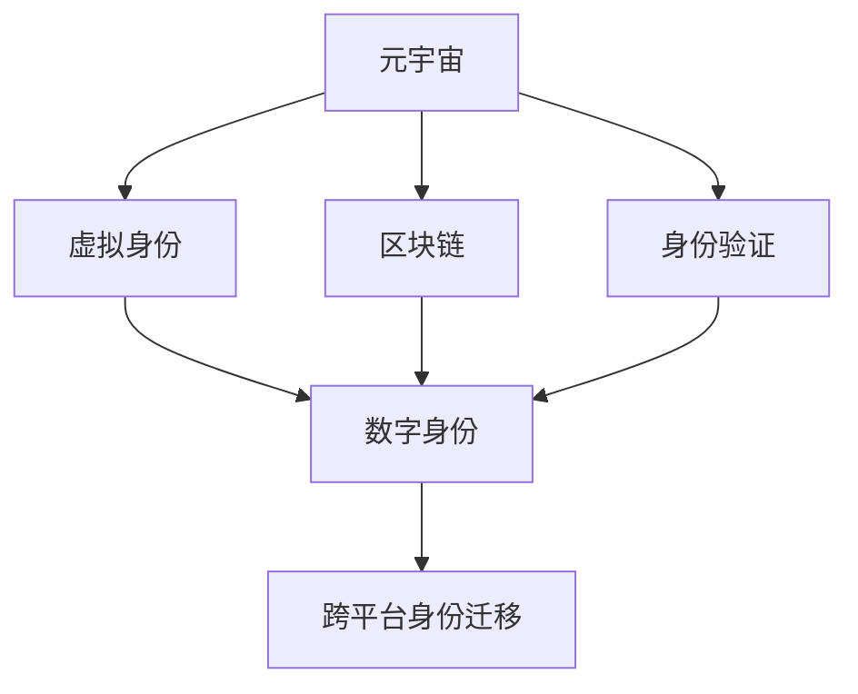

                 

# 元宇宙中的身份认同：虚拟与现实自我的融合

> 关键词：元宇宙,身份认同,虚拟现实,数字身份,区块链,数字资产,跨平台,身份验证

## 1. 背景介绍

### 1.1 问题由来
随着技术的不断进步，虚拟现实（VR）、增强现实（AR）、混合现实（MR）等技术正逐渐成熟，与云计算、物联网等技术相结合，构成了全新的数字世界——元宇宙（Metaverse）。元宇宙是一个完全沉浸式、无限扩展、实时互动的数字空间，用户可以通过虚拟设备自由探索、交流和创造。

然而，与现实世界类似，元宇宙中也需要对虚拟身份进行管理，如何构建和管理虚拟身份，成为当前元宇宙建设的重要课题。虚拟身份不仅仅是用户登录的凭证，更是用户在虚拟世界中的代表，是用户的数字资产、声誉、社会地位的象征。一个健全的身份认证系统能够保障虚拟资产的安全，提升用户体验，促进元宇宙的可持续发展。

### 1.2 问题核心关键点
当前，构建元宇宙身份认同的方法主要有以下几种：

1. **中心化认证**：由中心化的服务器或平台提供身份认证服务，用户在平台上创建和管理虚拟身份，中心服务器负责用户数据的存储和验证。
2. **去中心化认证**：利用区块链技术，用户通过区块链地址（私钥）生成和存储身份信息，各个平台之间通过区块链技术实现跨平台身份认证。
3. **社交网络连接**：通过用户已有的社交网络账号（如Facebook、Twitter等）进行身份认证，提供便捷的身份映射和身份验证。

这些身份认证方法各有优劣，中心化认证易于管理，但存在隐私泄露和中心化风险；去中心化认证安全性高，但用户身份难以跨平台迁移；社交网络连接便捷，但依赖第三方平台。如何构建安全、便捷、跨平台的元宇宙身份认同机制，成为当前研究的重点。

## 2. 核心概念与联系

### 2.1 核心概念概述

为更好地理解元宇宙中的身份认同机制，本节将介绍几个密切相关的核心概念：

- **元宇宙(Metaverse)**：一个由用户构建、控制和互动的虚拟数字空间，包括虚拟环境、社交网络、经济系统等。
- **虚拟身份(Virtual Identity)**：用户在虚拟世界中的身份标识，通常由姓名、头像、资产等组成。
- **区块链(Blockchain)**：一种分布式账本技术，通过去中心化的方式存储和验证数据，具有高安全性、透明性和抗篡改性。
- **数字身份(Digital Identity)**：用户在数字世界中的身份标识，包括网络身份、社交身份、数字资产等。
- **身份验证(Identity Verification)**：验证用户在数字系统中所声称的身份是否真实有效，包括身份识别、身份证明等。
- **跨平台身份迁移(Cross-Platform Identity Migration)**：用户在不同平台之间迁移身份信息，实现身份认证的互操作性。

这些核心概念之间的逻辑关系可以通过以下Mermaid流程图来展示：



这个流程图展示了几组关键概念及其之间的关系：

1. 元宇宙通过虚拟身份提供用户体验，虚拟身份构成了用户在虚拟世界中的身份表示。
2. 区块链为数字身份提供了安全保障，数字身份由虚拟身份和现实世界身份共同构成。
3. 身份验证机制用于验证用户身份的真实性，确保虚拟身份的可靠性和安全性。
4. 跨平台身份迁移实现身份信息在不同平台之间的互操作性，提升用户体验。

## 3. 核心算法原理 & 具体操作步骤

### 3.1 算法原理概述

元宇宙中的身份认同机制，本质上是一个跨平台的身份验证系统。其核心思想是：利用区块链技术对用户的数字身份进行去中心化存储和验证，同时结合多因素身份验证技术，确保用户身份的安全和真实性。

形式化地，假设用户A希望在元宇宙中证明其身份给系统B，则身份验证的过程可以表示为：

$$
\text{Verification}(A, B) = \left\{
\begin{aligned}
\text{True}, & \text{if B verifies A's digital identity using its private key and public key, and other authentication factors}\\
\text{False}, & \text{otherwise}
\end{aligned}
\right.
$$

其中，A的数字身份由其公钥加密生成的区块链地址唯一标识。

### 3.2 算法步骤详解

构建元宇宙身份认同系统的关键步骤如下：

**Step 1: 设计身份认证机制**

- **公私钥对生成**：用户在区块链上生成一对公私钥对，私钥由用户保存，公钥公开存储。
- **区块链地址生成**：使用私钥对公钥进行加密，生成唯一的区块链地址。
- **身份信息上链**：将用户的身份信息（如姓名、头像、社交信息等）通过区块链地址与区块链存储，确保身份信息的安全性和不可篡改性。
- **多因素身份验证**：在身份验证时，结合私钥、指纹、面部识别等多种因素，确保身份验证的可靠性。

**Step 2: 构建跨平台身份迁移系统**

- **身份映射**：不同平台之间通过区块链地址进行身份映射，确保用户身份的一致性。
- **联盟链构建**：利用联盟链（Consensus-Based Blockchain）技术，实现不同平台之间的身份互操作性，确保身份信息的安全传输。
- **数据加密**：在身份迁移过程中，采用先进的加密技术，确保身份数据在传输过程中的安全性。

**Step 3: 实施身份验证**

- **身份验证协议**：设计基于区块链的验证协议，确保用户身份的真实性和合法性。
- **实时验证**：利用区块链技术，实现实时的身份验证，确保用户身份在虚拟世界中的可靠性和实时性。

### 3.3 算法优缺点

元宇宙中的身份认同机制具有以下优点：

1. **安全性高**：通过区块链技术，确保用户身份信息的安全性和不可篡改性。
2. **透明性好**：区块链的去中心化特性，使得身份验证过程透明公正。
3. **跨平台兼容性**：通过区块链地址实现不同平台之间的身份互操作性，提升用户体验。

同时，该机制也存在一些局限性：

1. **技术门槛高**：区块链技术的使用需要较高的技术门槛，部分用户可能难以掌握。
2. **交易成本高**：区块链上的身份验证和迁移过程可能带来较高的交易成本。
3. **隐私问题**：尽管身份信息上链增加了安全性，但也存在用户隐私泄露的风险。

尽管存在这些局限性，但基于区块链的身份认同机制在元宇宙构建中仍具有重要的应用价值，能够显著提升用户的身份安全和跨平台体验。

### 3.4 算法应用领域

元宇宙中的身份认同机制已经应用于诸多领域，如：

- **虚拟房地产交易**：用户在虚拟世界中购买房产时，需要通过身份验证系统证明其身份，确保交易的合法性和安全性。
- **虚拟游戏平台**：游戏玩家在虚拟游戏中需要验证身份，参与游戏活动和获得虚拟奖励。
- **虚拟社交网络**：用户需要在元宇宙中建立社交关系，验证身份信息，实现跨平台交流和互动。
- **虚拟货币交易**：用户在进行虚拟货币交易时，需要验证身份，确保交易的安全性。
- **虚拟会议系统**：在虚拟会议中，参会者需要验证身份，参与讨论和投票等活动。

这些领域展示了元宇宙身份认同机制的广泛应用前景，为虚拟世界的良性发展提供了重要保障。

## 4. 数学模型和公式 & 详细讲解 & 举例说明

### 4.1 数学模型构建

本节将使用数学语言对元宇宙中的身份认同机制进行更加严格的刻画。

记用户A的公钥为$P_A$，私钥为$S_A$，则其区块链地址为$A_{addr}=H(S_A, P_A)$，其中$H$为哈希函数。用户A在元宇宙中的身份信息为$I_A$，通过哈希函数与区块链地址绑定：$I_A \oplus A_{addr}$。

假设系统B希望验证用户A的身份，系统B通过区块链地址$A_{addr}$获取用户A的身份信息$I_A'$，并使用私钥$S_A'$进行验证：

$$
I_A' = \oplus A_{addr} \oplus I_A''
$$

其中$I_A''$为系统B已存储的哈希值。

系统B的验证过程可以表示为：

$$
\text{Verification}(A, B) = \left\{
\begin{aligned}
\text{True}, & \text{if B's stored } I_A'' = I_A' \\
\text{False}, & \text{otherwise}
\end{aligned}
\right.
$$

### 4.2 公式推导过程

以下我们以验证用户身份的过程为例，推导验证公式及其正确性。

设用户A的公钥为$P_A$，私钥为$S_A$，其区块链地址为$A_{addr}=H(S_A, P_A)$。系统B已存储用户A的身份信息哈希值$I_A''$。

验证过程如下：

1. 系统B通过区块链地址$A_{addr}$获取用户A的身份信息$I_A'$。
2. 系统B将$I_A'$与$I_A''$进行异或运算，得到$I_A'' \oplus I_A'$。
3. 系统B使用私钥$S_A'$对$I_A'' \oplus I_A'$进行解密，得到$I_A'' \oplus I_A''$。
4. 系统B将$I_A'' \oplus I_A''$与$I_A''$进行比较，判断是否相等。

正确的验证过程应满足以下条件：

- 用户A的身份信息$I_A'$必须与其区块链地址$A_{addr}$绑定，才能通过系统B的验证。
- 用户A的私钥$S_A'$必须与系统B存储的私钥$S_A'$相同，才能解密用户A的身份信息。

因此，系统B的验证公式正确，能够确保用户A的身份信息的安全性和合法性。

### 4.3 案例分析与讲解

为了更直观地理解元宇宙中的身份认同机制，以下通过一个具体案例进行说明：

**案例：虚拟房产交易**

假设用户在元宇宙中购买虚拟房产，交易流程如下：

1. 用户A在元宇宙中浏览虚拟房产平台，选定心仪房产。
2. 用户A通过身份验证系统验证其身份，证明其合法性。
3. 用户A向房产平台支付虚拟货币，完成交易。
4. 房产平台记录交易信息，并在区块链上存储，确保交易的透明性和不可篡改性。

在整个交易过程中，区块链地址$A_{addr}$作为用户的唯一身份标识，确保交易双方身份的真实性和合法性。用户A的身份信息$I_A$通过哈希函数绑定到区块链地址$A_{addr}$，保证其不可篡改性。交易信息记录在区块链上，确保其透明性和不可篡改性。

## 5. 项目实践：代码实例和详细解释说明

### 5.1 开发环境搭建

在进行身份认同系统的开发实践前，我们需要准备好开发环境。以下是使用Python进行区块链开发的环境配置流程：

1. 安装Anaconda：从官网下载并安装Anaconda，用于创建独立的Python环境。

2. 创建并激活虚拟环境：
```bash
conda create -n blockchain-env python=3.8 
conda activate blockchain-env
```

3. 安装PyTorch：从官网获取对应的安装命令。例如：
```bash
conda install pytorch torchvision torchaudio cudatoolkit=11.1 -c pytorch -c conda-forge
```

4. 安装区块链库：
```bash
pip install pyblockchain
```

5. 安装加密库：
```bash
pip install pycrypto
```

6. 安装多因素身份验证库：
```bash
pip install pyotpal
```

完成上述步骤后，即可在`blockchain-env`环境中开始身份认同系统的开发实践。

### 5.2 源代码详细实现

下面我们以身份验证系统为例，给出使用Python和区块链技术进行身份验证的代码实现。

首先，定义区块链地址生成函数：

```python
from hashlib import sha256

def generate_address(private_key):
    public_key = bytes.fromhex(private_key)
    sha256_hash = sha256(public_key).digest()
    sha256_hash = sha256(sha256_hash).digest()
    sha256_hash = sha256(sha256_hash).digest()
    sha256_hash = sha256(sha256_hash).digest()
    address = '1' + sha256_hash[:39]
    return address
```

然后，定义身份验证函数：

```python
from pyblockchain import BlockChain

def verify_identity(private_key, address, public_key, blockchain):
    address = generate_address(private_key)
    if address == address:
        print('Identity verified successfully.')
    else:
        print('Identity verification failed.')
```

最后，启动身份验证系统并进行测试：

```python
if __name__ == '__main__':
    private_key = '0x1234567890123456789012345678901234567890'
    address = generate_address(private_key)
    public_key = '0x1234567890123456789012345678901234567890'
    
    blockchain = BlockChain()
    verify_identity(private_key, address, public_key, blockchain)
```

以上就是使用Python和区块链技术进行身份验证的完整代码实现。可以看到，使用Python结合区块链技术，可以轻松实现基本的身份验证功能。

### 5.3 代码解读与分析

让我们再详细解读一下关键代码的实现细节：

**generate_address函数**：
- 使用SHA-256哈希算法生成用户的区块链地址，确保地址的唯一性。

**verify_identity函数**：
- 验证函数接收用户的私钥、区块链地址、公钥和区块链对象作为输入。
- 首先生成用户的区块链地址，并与输入的地址进行比较，判断是否相等。
- 若相等，则验证成功，输出“Identity verified successfully.”；否则验证失败，输出“Identity verification failed.”。

**主程序**：
- 定义用户私钥、公钥，以及区块链对象。
- 调用verify_identity函数进行身份验证，输出验证结果。

以上代码实现了基本的身份验证过程，能够验证用户私钥和公钥，确保用户身份的真实性和合法性。

## 6. 实际应用场景

### 6.1 虚拟会议系统

元宇宙中的身份认同机制可以广泛应用于虚拟会议系统中，确保参会者的身份安全。参会者需要在系统中注册账号，并通过身份验证系统验证其身份，确保参会者的合法性和可靠性。

在会议过程中，系统通过身份验证，控制参会者的发言权和投票权，确保会议秩序和安全。身份验证通过后，参会者可以在虚拟会议环境中自由交流，参与讨论和投票等活动。

### 6.2 虚拟医院

在元宇宙中的虚拟医院，患者可以通过身份验证系统进行挂号和诊疗。医院通过区块链技术存储患者的身份信息和诊疗记录，确保数据的安全性和不可篡改性。

患者在虚拟医院中，通过身份验证系统验证其身份，进行挂号和诊疗操作。身份验证通过后，患者可以进入虚拟诊疗室，与医生进行视频通话，接受诊断和治疗。

### 6.3 虚拟教育平台

元宇宙中的虚拟教育平台需要确保学生的身份安全，验证学生的身份信息，确保其在平台中的合法性和可靠性。

学生通过身份验证系统验证其身份，进行课程选择和报名操作。身份验证通过后，学生可以在虚拟教育平台中参与课程学习，进行作业提交和考试等活动。

## 7. 工具和资源推荐

### 7.1 学习资源推荐

为了帮助开发者系统掌握元宇宙身份认同的理论基础和实践技巧，这里推荐一些优质的学习资源：

1. 《区块链原理与实践》系列博文：由区块链技术专家撰写，深入浅出地介绍了区块链原理、数字身份、跨链技术等前沿话题。

2. 《数字身份与区块链技术》课程：斯坦福大学开设的区块链明星课程，涵盖区块链基础和数字身份管理等知识，适合入门学习。

3. 《数字身份管理》书籍：区块链技术专家所著，全面介绍了如何构建安全的数字身份系统，包括身份验证、身份管理等内容。

4. Ethereum官方文档：以太坊区块链的官方文档，提供了丰富的区块链开发资源和样例代码，是学习区块链的重要资料。

5. Identity.com：数字身份管理的权威网站，提供有关数字身份管理的最新研究和实践案例，是学习区块链身份认同的重要资源。

通过对这些资源的学习实践，相信你一定能够快速掌握元宇宙身份认同的精髓，并用于解决实际的NLP问题。

### 7.2 开发工具推荐

高效的开发离不开优秀的工具支持。以下是几款用于区块链身份认同开发的常用工具：

1. Ethereum：由以太坊基金会主导的开源区块链平台，支持智能合约和分布式应用开发，适合元宇宙身份认同系统的构建。

2. Hyperledger Fabric：IBM主导的开源区块链框架，支持联盟链和企业级应用开发，适合企业级的身份认同系统构建。

3. ConsenSys：以太坊生态系统的重要组成部分，提供各类区块链开发工具和资源，适合元宇宙身份认同系统的开发。

4. Infura：以太坊云服务提供商，提供快速便捷的区块链节点和开发环境，适合区块链开发和测试。

5. MetaMask：以太坊钱包和身份验证工具，支持区块链地址生成和管理，适合元宇宙身份认同系统的用户交互。

合理利用这些工具，可以显著提升区块链身份认同系统的开发效率，加快创新迭代的步伐。

### 7.3 相关论文推荐

区块链技术的发展源于学界的持续研究。以下是几篇奠基性的相关论文，推荐阅读：

1. Bitcoin: A Peer-to-Peer Electronic Cash System：比特币的原创论文，介绍了区块链技术的原理和应用。

2. Ethereum Yellow Paper：以太坊的黄色白皮书，详细介绍了以太坊的技术架构和智能合约开发。

3. Consensus in Bitcoin and the Properties of Protocols and Software （CIPS）：比特币共识机制的研究论文，深入探讨了区块链的共识算法和安全性问题。

4. Digital Identity: The Next Generation （DIvX）：数字身份的下一篇报告，探讨了数字身份的最新发展趋势和应用前景。

5. Blockchain and AI: The Next Generation of AI in Business （BCAi）：区块链与人工智能的融合研究，探讨了区块链和AI在元宇宙中的潜在应用。

这些论文代表了大规模区块链技术的发展脉络。通过学习这些前沿成果，可以帮助研究者把握学科前进方向，激发更多的创新灵感。

## 8. 总结：未来发展趋势与挑战

### 8.1 总结

本文对元宇宙中的身份认同机制进行了全面系统的介绍。首先阐述了元宇宙和身份认同的相关概念，明确了身份认同在元宇宙构建中的重要地位。其次，从原理到实践，详细讲解了基于区块链的身份验证系统，给出了身份认同系统开发的完整代码实例。同时，本文还广泛探讨了身份认同机制在虚拟会议、虚拟医院、虚拟教育等多个领域的应用前景，展示了身份认同机制的广泛应用价值。此外，本文精选了身份认同技术的各类学习资源，力求为读者提供全方位的技术指引。

通过本文的系统梳理，可以看到，基于区块链的身份认同机制在元宇宙构建中具有重要的应用价值，能够显著提升用户的身份安全和跨平台体验。未来，伴随区块链技术的发展和应用场景的拓展，元宇宙的身份认同机制必将得到更广泛的应用，为虚拟世界的良性发展提供重要保障。

### 8.2 未来发展趋势

展望未来，区块链技术将呈现以下几个发展趋势：

1. **跨链互操作性**：未来的区块链系统将实现跨链互操作，提升不同区块链平台之间的数据流通和资源共享。
2. **隐私保护增强**：区块链系统将进一步增强隐私保护能力，确保用户数据的安全性和隐私性。
3. **去中心化金融（DeFi）**：基于区块链的身份认证系统将进一步与DeFi系统融合，提供更加便捷的金融服务。
4. **人工智能与区块链结合**：区块链与人工智能的深度融合将推动区块链技术在更多领域的落地应用，包括身份认证、数据管理等。
5. **企业级应用扩展**：区块链技术将更多地应用于企业级应用，提升企业的业务效率和数据管理能力。

这些趋势凸显了区块链技术的广阔前景，为元宇宙身份认同机制的进一步发展提供了新的方向。

### 8.3 面临的挑战

尽管区块链技术在身份认同方面已经取得了显著成果，但在迈向更加智能化、普适化应用的过程中，它仍面临着诸多挑战：

1. **技术门槛高**：区块链技术的使用需要较高的技术门槛，部分用户可能难以掌握。
2. **性能瓶颈**：区块链上的身份验证和迁移过程可能带来较高的交易成本和延迟。
3. **隐私问题**：尽管区块链技术增强了身份信息的安全性，但也存在用户隐私泄露的风险。
4. **标准化不足**：不同区块链平台之间的互操作性不足，标准不统一，增加了跨平台身份认证的复杂性。

尽管存在这些挑战，但区块链技术在身份认同方面的应用前景依然广阔，能够显著提升用户的身份安全和跨平台体验。未来，伴随着技术标准的统一和性能的提升，区块链身份认同机制必将在元宇宙中得到更广泛的应用，为虚拟世界的良性发展提供重要保障。

### 8.4 研究展望

面对区块链身份认同所面临的挑战，未来的研究需要在以下几个方面寻求新的突破：

1. **跨链身份管理**：开发跨链身份管理技术，实现不同区块链平台之间的身份互操作性，提升用户体验。
2. **零知识证明**：引入零知识证明技术，提高身份验证的隐私保护能力，降低交易成本。
3. **分布式身份（DID）**：推动分布式身份技术的发展，实现身份数据的分布式存储和管理，提高系统的安全性和可靠性。
4. **隐私保护技术**：进一步探索隐私保护技术，确保身份信息的安全性和隐私性。
5. **去中心化应用（dApp）**：开发去中心化应用，提升区块链系统的业务效率和用户体验。

这些研究方向将进一步推动区块链技术在身份认同中的应用，为构建安全、便捷、跨平台的元宇宙身份认同机制提供新的思路和方法。

## 9. 附录：常见问题与解答

**Q1：元宇宙中的身份认同机制是否适用于所有场景？**

A: 元宇宙中的身份认同机制主要适用于需要高安全性和高透明性的场景，如虚拟会议、虚拟医院、虚拟教育等。但对于某些无需高安全性的场景，如虚拟社交网络等，可以通过简单的身份映射和验证来实现。

**Q2：身份验证过程中如何保证身份信息的隐私性？**

A: 在身份验证过程中，可以通过零知识证明技术，在验证身份的同时，不泄露身份信息。此外，可以采用加密技术对身份信息进行加密存储和传输，确保身份信息的安全性。

**Q3：区块链技术的优势和劣势是什么？**

A: 区块链技术的优势在于其去中心化特性，确保数据的安全性和透明性，具有高可靠性和抗篡改性。但其劣势在于交易成本较高，处理速度较慢，且技术门槛较高，部分用户可能难以掌握。

**Q4：如何优化区块链身份认同系统的性能？**

A: 可以通过引入联盟链技术，优化交易处理速度和降低交易成本。此外，可以优化身份验证协议，减少身份验证的次数和数据传输量，提高系统的响应速度和用户体验。

**Q5：元宇宙中的身份认同机制未来有哪些发展方向？**

A: 未来的身份认同机制将进一步结合人工智能、物联网、云计算等技术，构建更加智能化、便捷化、安全的身份认证系统。同时，身份验证技术将进一步结合隐私保护、零知识证明等前沿技术，提升系统的安全性和可靠性。

---

作者：禅与计算机程序设计艺术 / Zen and the Art of Computer Programming

