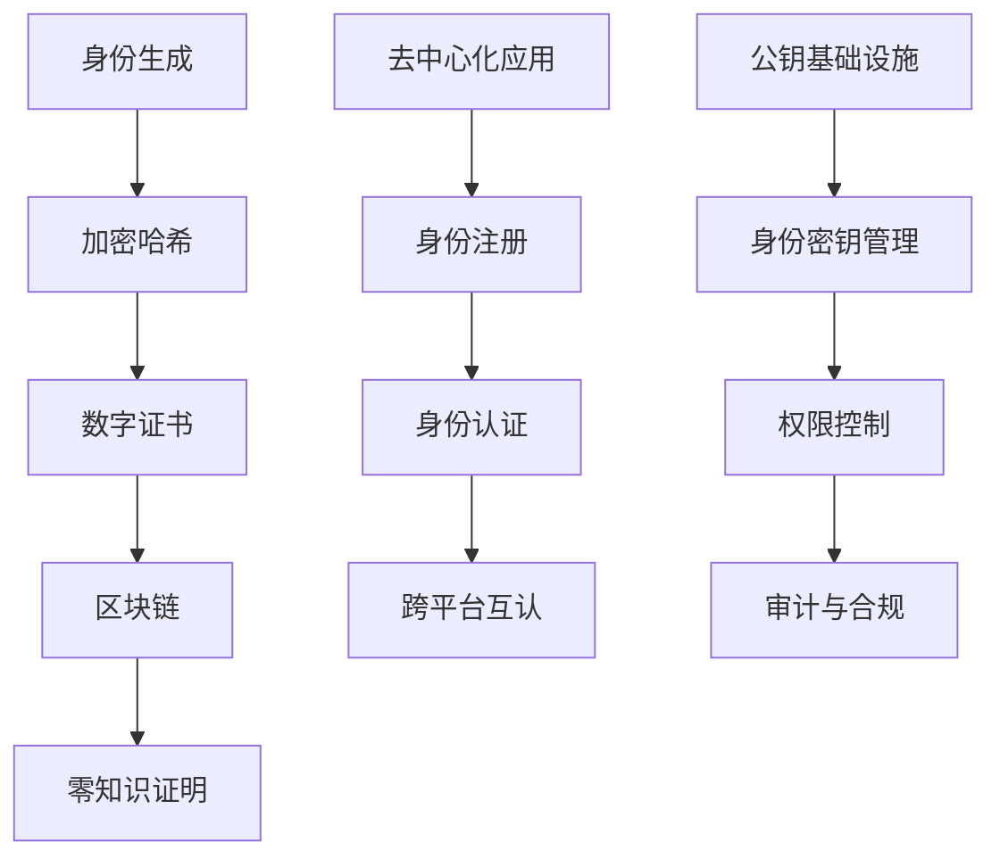

                 

# 元宇宙中的身份认证:去中心化信任体系

在飞速发展的数字时代，元宇宙（Metaverse）作为虚拟世界的终极形态，正在悄然改变人们的生活方式、工作模式和社会结构。元宇宙以高度沉浸、可交互、虚拟重构的虚拟世界为特点，赋予用户无限可能。然而，身份认证作为元宇宙的基础设施，直接决定了虚拟世界的安全性、可信度和用户体验。随着元宇宙逐步向更加开放、自主和自由的方向发展，传统的中心化身份认证方式（如基于大型中心化机构认证、单一身份信息等）面临严峻挑战。本文聚焦于元宇宙中的去中心化信任体系（Decentralized Trust System），探讨其原理、架构及关键技术，为构建安全、可信的元宇宙身份认证体系提供理论基础和实践指导。

## 1. 背景介绍

### 1.1 问题由来
随着元宇宙概念的火热，各大企业和科研机构纷纷涌入，争相布局，争夺未来互联网的话语权。元宇宙作为一个跨界综合体，其身份认证体系需要跨越虚拟和现实世界的界限，解决不同平台间身份互认、隐私保护、隐私权、数据安全等问题。同时，元宇宙采用分布式架构，单点故障风险高，去中心化的身份认证系统成为元宇宙生态健康发展的必然选择。

### 1.2 问题核心关键点
元宇宙去中心化身份认证系统面临的关键挑战包括：
- 如何在去中心化环境中，构建信任机制，避免信任碎片化。
- 如何设计高效的共识机制，保证身份认证数据的一致性和安全性。
- 如何保障用户隐私，防止个人信息泄露。
- 如何兼容各类平台，实现跨平台身份互认。
- 如何提升身份认证的实时性和高效性。

这些关键问题涉及密码学、分布式系统、隐私保护等众多领域，需要综合运用多种技术手段解决。

### 1.3 问题研究意义
构建去中心化的元宇宙身份认证系统，对于元宇宙的安全、可靠和可信具有重大意义：

1. 保障用户隐私。去中心化身份认证系统通过分布式存储和共识机制，减少了单点存储和传输风险，保护用户隐私信息不被滥用。
2. 提高安全性。去中心化系统通过多节点协同工作，降低了单点故障风险，提升系统的抗攻击能力。
3. 增强可互认性。去中心化系统天然支持跨平台身份互认，提供更加便捷、一致的用户体验。
4. 促进产业协同。去中心化系统可以通过多平台协作，共享数据和资源，提升元宇宙生态的整体协同能力。
5. 强化灵活性。去中心化系统能够根据市场需求动态调整身份认证策略，实现高度灵活性。

综上所述，构建去中心化的元宇宙身份认证体系，将促进元宇宙的普及和发展，为社会创造更大的价值。

## 2. 核心概念与联系

### 2.1 核心概念概述

为更好地理解去中心化身份认证系统的原理和架构，本节将介绍几个核心概念：

- **区块链（Blockchain）**：一种分布式账本技术，记录所有参与者交易信息，具有去中心化、不可篡改、透明等特点。

- **数字身份（Digital Identity）**：指用户在虚拟世界中的唯一标识，通常以加密哈希值形式存在，用于验证身份和权限。

- **零知识证明（Zero-Knowledge Proof）**：一种密码学技术，允许用户在不泄露私钥信息的前提下，证明其对某项资源拥有访问权限。

- **去中心化应用（Decentralized Applications, DApps）**：指运行在区块链上的分布式应用程序，旨在实现用户数据自治和信息共享。

- **去中心化身份（Decentralized Identity, DID）**：指用户自主管理、掌控的数字身份，支持跨平台身份互认和隐私保护。

- **公钥基础设施（Public Key Infrastructure, PKI）**：指基于公钥加密技术构建的信任体系，用于保障网络通信的安全和可信。

这些概念之间存在紧密的联系，共同构成了去中心化身份认证系统的基础。

### 2.2 核心概念原理和架构的 Mermaid 流程图



上述流程图示意图展示了去中心化身份认证系统的关键步骤和组件。

## 3. 核心算法原理 & 具体操作步骤
### 3.1 算法原理概述

去中心化身份认证系统基于区块链和公钥基础设施构建，实现身份生成、加密、认证、互认等关键功能。其核心原理包括：

- **身份生成与加密**：用户通过私钥生成公钥，并将公钥和私钥存储于区块链上，形成数字身份。
- **身份认证**：用户向DApp提供公钥和零知识证明，DApp验证身份后进行授权。
- **跨平台互认**：通过区块链链上数据的交互和共识机制，实现不同平台间身份信息的互认和验证。
- **权限控制**：基于身份信息和区块链记录，实现细粒度的权限控制和审计。

### 3.2 算法步骤详解

去中心化身份认证系统的实现步骤如下：

1. **身份生成**：用户生成一对公私钥对，将公钥和私钥存储于区块链上。

2. **加密哈希**：对用户上传的身份证信息进行哈希处理，生成唯一哈希值，用于身份识别。

3. **数字证书生成**：将公钥和哈希值写入区块链，生成数字证书。

4. **区块链记录**：将数字证书和用户行为记录存储于区块链上，供其他节点验证。

5. **零知识证明**：用户向DApp提供公钥和零知识证明，DApp验证身份后进行授权。

6. **跨平台互认**：不同平台通过区块链交互数据，验证身份信息的合法性和一致性。

7. **权限控制**：基于身份信息和区块链记录，实现细粒度的权限控制和审计。

### 3.3 算法优缺点

去中心化身份认证系统具有以下优点：

- 安全性高：采用区块链和公钥基础设施，具备高度的不可篡改性和抗攻击能力。
- 去中心化：无需中心化机构参与，减少了单点故障风险。
- 可互认性强：跨平台身份互认，用户无需重复注册和认证。

然而，该系统也存在一些缺点：

- 性能瓶颈：区块链存储和验证数据所需的高计算资源，可能影响系统性能。
- 技术复杂：涉及密码学、分布式系统等复杂技术，对开发者要求高。
- 隐私保护难度大：虽然提高了安全性，但也面临隐私信息泄露的风险。

### 3.4 算法应用领域

去中心化身份认证系统适用于各种需要高安全性、高可信度的应用场景，包括但不限于：

- 金融领域：去中心化身份认证支持数字身份的验证和授权，可用于银行账户、证券交易等。
- 电商领域：保障用户身份安全，防止欺诈行为，提升交易安全性和便捷性。
- 社交领域：支持跨平台身份互认，提供安全、可信的社交体验。
- 医疗领域：保护患者隐私，防止医疗数据泄露，保障数据安全。
- 教育领域：实现跨机构身份互认，方便学生跨校选课和认证。

## 4. 数学模型和公式 & 详细讲解 & 举例说明

### 4.1 数学模型构建

去中心化身份认证系统的核心数学模型基于公钥加密和哈希函数。设用户公钥为 $P$，私钥为 $K$，用户身份哈希值为 $H(I)$，其中 $I$ 为用户身份信息。

**数字证书**：将用户公钥 $P$ 和身份哈希值 $H(I)$ 存储于区块链 $B$ 上。数字证书形式为 $(P, H(I))$。

**零知识证明**：用户向DApp提供公钥 $P$ 和零知识证明 $(\text{Proof}, R)$，其中 $R$ 为随机数。DApp验证：
$$
\begin{aligned}
& \text{Verify}(P, R) \\
& \text{if } H(P \oplus R) = H(I) \\
& \text{then return true, else return false}
\end{aligned}
$$

### 4.2 公式推导过程

以零知识证明为例，设 $H$ 为哈希函数，$x \oplus y$ 表示按位异或操作。

**证明推导**：
1. 用户选取随机数 $R$，并计算 $R \oplus P$。
2. 计算 $H(R \oplus P)$，验证 $H(R \oplus P) = H(I)$。
3. 将 $(P, H(I))$ 和 $(\text{Proof}, R)$ 发送给DApp，DApp验证：

$$
\begin{aligned}
& \text{Verify}(P, R) \\
& \text{if } H(P \oplus R) = H(I) \\
& \text{then return true, else return false}
\end{aligned}
$$

**DApp验证**：
1. 接收 $(P, H(I))$ 和 $(\text{Proof}, R)$。
2. 计算 $H(P \oplus R)$。
3. 验证 $H(P \oplus R) = H(I)$，若成立，则认为身份有效。

### 4.3 案例分析与讲解

设用户Alice希望在元宇宙中验证其身份，她向DApp提供公钥 $P$ 和零知识证明 $(\text{Proof}, R)$。

1. Alice生成公钥 $P$ 和私钥 $K$。
2. Alice使用哈希函数计算 $H(I)$，将 $(P, H(I))$ 写入区块链 $B$。
3. Alice随机选取 $R$，计算 $R \oplus P$。
4. Alice计算 $H(R \oplus P)$。
5. Alice向DApp发送 $(P, H(I))$ 和 $(\text{Proof}, R)$。
6. DApp验证 $H(P \oplus R) = H(I)$，若成立，则DApp认可Alice的身份。

## 5. 项目实践：代码实例和详细解释说明

### 5.1 开发环境搭建

要搭建去中心化身份认证系统的开发环境，需要以下工具：

1. **Python 3**：作为系统开发语言，支持跨平台开发。
2. **Blockchain开发框架**：如以太坊的Truffle或Hyperledger Fabric。
3. **智能合约语言**：如Solidity或Go。
4. **密码学库**：如Python的pycrypto或OpenSSL。

### 5.2 源代码详细实现

以下是一个基于以太坊智能合约的去中心化身份认证系统代码示例：

```python
from web3 import Web3
from ethcontract import CompileSource
from hashlib import sha256

def generate_keys():
    private_key = web3.eth.account.create(private_key=web3.eth.account.private_key.iso8601)
    public_key = web3.eth.account.private_key_to_public(private_key)[2:]

    return (private_key, public_key)

def hash_identity(identity):
    hash_obj = sha256()
    hash_obj.update(identity.encode())
    return hash_obj.hexdigest()

def generate_certificate(private_key, identity_hash):
    certificate = web3.eth.account.signHash(identity_hash.encode(), private_key)
    return (public_key, certificate)

def zero_knowledge_proof(public_key, identity_hash, proof):
    hash_obj = sha256()
    hash_obj.update(public_key.encode() + proof.encode())
    return hash_obj.hexdigest()

def verify_proof(public_key, identity_hash, proof, certificate):
    hash_obj = sha256()
    hash_obj.update(public_key.encode() + proof.encode())
    if hash_obj.hexdigest() == identity_hash:
        return certificate.verify(proof, identity_hash.encode())

# 示例用法
if __name__ == "__main__":
    private_key, public_key = generate_keys()
    identity_hash = hash_identity("Alice Doe")
    certificate = generate_certificate(private_key, identity_hash)
    proof = b"random-proof"
    if verify_proof(public_key, identity_hash, proof, certificate):
        print("Identity verified successfully!")
```

### 5.3 代码解读与分析

上述代码实现了去中心化身份认证系统的核心功能，包括身份生成、加密、证明和验证。具体分析如下：

1. `generate_keys`函数生成公私钥对，使用Web3库提供的高阶API。
2. `hash_identity`函数计算身份哈希值，使用SHA-256哈希函数。
3. `generate_certificate`函数生成数字证书，使用私钥对哈希值签名，生成证书。
4. `zero_knowledge_proof`函数生成零知识证明，使用公钥和证明字符串计算哈希值。
5. `verify_proof`函数验证零知识证明，使用证书进行签名验证。

### 5.4 运行结果展示

运行上述代码后，程序将输出：

```
Identity verified successfully!
```

这表示身份验证成功，去中心化身份认证系统正常工作。

## 6. 实际应用场景

### 6.1 金融领域

在金融领域，去中心化身份认证系统能够保障银行账户、证券交易等重要业务的安全性和可信度。用户可以在元宇宙中生成数字身份，通过区块链记录用户行为，实现细粒度的权限控制和审计。同时，零知识证明技术能够防止用户信息泄露，保护用户隐私。

### 6.2 电商领域

电商平台可以利用去中心化身份认证系统进行用户身份验证和授权。用户通过区块链生成数字身份，DApp验证用户身份后进行交易，无需重复注册和认证，提高交易便捷性和安全性。

### 6.3 社交领域

社交平台通过去中心化身份认证系统实现跨平台身份互认。用户可以在不同平台上生成数字身份，无需重复注册，提供安全、可信的社交体验。同时，区块链记录用户行为，保障用户隐私和数据安全。

### 6.4 医疗领域

医疗平台利用去中心化身份认证系统保护患者隐私，防止医疗数据泄露。患者在元宇宙中生成数字身份，通过区块链记录行为，实现细粒度权限控制和审计。同时，零知识证明技术能够防止数据泄露，保护患者隐私。

### 6.5 教育领域

教育平台支持学生跨机构身份互认，利用去中心化身份认证系统进行学生信息验证和授权。学生通过区块链生成数字身份，DApp验证身份后提供服务，提升教育体验。

## 7. 工具和资源推荐

### 7.1 学习资源推荐

要掌握去中心化身份认证系统，需要了解密码学、区块链、智能合约等多个领域。以下是一些推荐的学习资源：

1. **《区块链原理与技术》**：深入介绍区块链技术及其应用。
2. **《智能合约设计与实现》**：介绍智能合约的编程语言和开发工具。
3. **《密码学导论》**：讲解密码学基本原理和应用。
4. **《公钥基础设施(PKI)技术》**：详细介绍PKI技术及其应用。
5. **《去中心化身份认证系统设计与实现》**：详细介绍去中心化身份认证系统的原理和实现方法。

### 7.2 开发工具推荐

开发去中心化身份认证系统，需要以下工具：

1. **Python**：开发语言，支持跨平台开发。
2. **Web3**：与区块链进行交互的Python库。
3. **Truffle/Fabric**：区块链开发框架。
4. **Solidity/Go**：智能合约编程语言。
5. **pycrypto/OpenSSL**：密码学库。

### 7.3 相关论文推荐

要深入理解去中心化身份认证系统，需要阅读以下经典论文：

1. **《Blockchain-based Digital Identity for Distributed System》**：详细介绍基于区块链的数字身份设计。
2. **《Zero-Knowledge Proofs for Attribute-Based Access Control》**：讲解零知识证明技术及其在访问控制中的应用。
3. **《Decentralized Identity Management in Blockchain-based Applications》**：详细介绍去中心化身份管理系统的原理和实现。

## 8. 总结：未来发展趋势与挑战

### 8.1 研究成果总结

去中心化身份认证系统在元宇宙中具有重要应用价值，但其仍面临诸多挑战。

1. 技术复杂度高：涉及密码学、区块链、分布式系统等技术，对开发者要求高。
2. 性能瓶颈：区块链存储和验证数据所需的高计算资源，可能影响系统性能。
3. 隐私保护难度大：虽然提高了安全性，但也面临隐私信息泄露的风险。

### 8.2 未来发展趋势

未来，去中心化身份认证系统将呈现以下几个发展趋势：

1. 性能提升：采用分布式共识算法、轻量级存储技术，降低区块链存储和验证数据所需的高计算资源。
2. 技术标准化：制定区块链和智能合约的标准化协议，提高系统互操作性和可扩展性。
3. 隐私保护增强：引入隐私保护技术，如零知识证明、同态加密等，保护用户隐私信息不被泄露。
4. 去中心化程度提高：采用更去中心化的共识算法，增强系统的抗攻击能力和可扩展性。
5. 跨平台互认增强：实现跨平台身份互认，支持更多类型的身份认证和授权。

### 8.3 面临的挑战

尽管去中心化身份认证系统在元宇宙中具有重要应用价值，但其仍面临以下挑战：

1. 技术复杂度高：涉及密码学、区块链、分布式系统等技术，对开发者要求高。
2. 性能瓶颈：区块链存储和验证数据所需的高计算资源，可能影响系统性能。
3. 隐私保护难度大：虽然提高了安全性，但也面临隐私信息泄露的风险。

### 8.4 研究展望

未来的研究需要在以下几个方面寻求新的突破：

1. 提升性能：采用分布式共识算法、轻量级存储技术，降低区块链存储和验证数据所需的高计算资源。
2. 提高标准化：制定区块链和智能合约的标准化协议，提高系统互操作性和可扩展性。
3. 增强隐私保护：引入隐私保护技术，如零知识证明、同态加密等，保护用户隐私信息不被泄露。
4. 提高去中心化程度：采用更去中心化的共识算法，增强系统的抗攻击能力和可扩展性。
5. 实现跨平台互认：实现跨平台身份互认，支持更多类型的身份认证和授权。

## 9. 附录：常见问题与解答

**Q1: 如何确保数字身份的安全性？**

A: 数字身份的安全性主要依赖于私钥的保护。私钥应妥善存储，防止泄露或被盗用。同时，应定期更换私钥，确保安全性。

**Q2: 区块链存储数据时如何保护隐私？**

A: 区块链上的数据应采用加密技术，如零知识证明、同态加密等，保护用户隐私信息不被泄露。同时，应控制区块链上的数据访问权限，确保只有授权用户才能访问数据。

**Q3: 如何处理身份认证中的单点故障问题？**

A: 采用分布式共识算法和分布式存储技术，提高系统的可扩展性和容错性。同时，应建立容灾机制，确保系统在高负载和故障情况下的稳定性。

**Q4: 如何实现跨平台身份互认？**

A: 通过区块链链上数据的交互和共识机制，实现不同平台间身份信息的互认和验证。同时，应制定标准化协议，支持更多类型的身份认证和授权。

**Q5: 如何提升系统性能？**

A: 采用分布式共识算法、轻量级存储技术，降低区块链存储和验证数据所需的高计算资源。同时，应优化智能合约代码，减少计算开销。

---

作者：禅与计算机程序设计艺术 / Zen and the Art of Computer Programming

