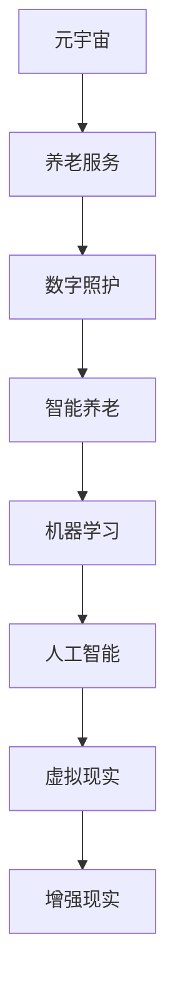

                 

# 元宇宙养老:数字化照护的创新模式

> 关键词：元宇宙,养老服务,数字照护,数字化转型,智能养老,虚拟现实(VR),增强现实(AR),人工智能(AI),机器学习(ML)

## 1. 背景介绍

### 1.1 问题由来

近年来，随着人口老龄化问题日益严重，养老服务业面临着巨大的压力和挑战。传统的养老服务模式，如养老院、社区服务、居家护理等，在应对不断增长的需求方面显得捉襟见肘。

- **养老院资源紧张**：床位数量有限，往往存在一床难求的现象。
- **社区服务不足**：特别是偏远和农村地区，老年人的日常照护和精神慰藉仍显不足。
- **居家护理困难**：许多老人希望在家中安度晚年，但如何确保他们的生活质量和医疗保障成为难题。

为了解决这些难题，数字化照护技术应运而生，逐渐成为养老服务的新趋势。

### 1.2 问题核心关键点

数字化照护的核心在于通过智能技术和大数据，构建一个覆盖养老全过程的智能化、定制化、人性化服务体系。通过互联网和移动互联网，结合物联网、人工智能、虚拟现实(VR)、增强现实(AR)等新兴技术，将养老服务数字化、智能化，实现养老服务的无缝衔接和实时监控，提升养老服务的质量和效率。

### 1.3 问题研究意义

研究元宇宙养老的数字化照护模式，对于应对人口老龄化挑战、推动养老服务业高质量发展、提升老年人的生活质量具有重要意义：

- **应对老龄化**：利用数字化手段，提升养老服务的可及性和覆盖率，缓解养老资源紧张的现状。
- **提高服务质量**：通过智能技术和大数据分析，实现个性化、定制化的养老服务，提升老年人的满意度和幸福感。
- **促进产业升级**：推动养老服务业的数字化转型，促进产业创新和新兴业态的涌现，形成新的经济增长点。
- **社会价值**：帮助老年人更好地融入数字社会，提升他们的社会参与度和生活质量。

## 2. 核心概念与联系

### 2.1 核心概念概述

为更好地理解元宇宙养老的数字化照护模式，本节将介绍几个密切相关的核心概念：

- **元宇宙(Metaverse)**：基于虚拟现实、增强现实等技术构建的虚拟世界，用户可以全方位沉浸其中，实现虚拟与现实的融合。
- **养老服务**：面向老年人的综合性服务，包括日常生活照护、医疗保健、精神慰藉等。
- **数字照护**：利用互联网和移动互联网技术，结合物联网、人工智能等新兴技术，实现养老服务的智能化、数字化。
- **智能养老**：通过应用智能技术，实现养老服务的自动化、个性化和高效化。
- **机器学习(ML)**：让机器通过数据学习，提升养老服务智能化的能力。
- **人工智能(AI)**：利用AI技术，实现养老服务的智能化决策和精准推荐。
- **虚拟现实(VR)**：通过创建沉浸式虚拟环境，提升老年人的互动体验和精神慰藉。
- **增强现实(AR)**：结合现实环境和虚拟信息，增强老年人的生活和认知能力。

这些核心概念之间的逻辑关系可以通过以下Mermaid流程图来展示：



这个流程图展示了一系列的逻辑关系：

1. 元宇宙通过虚拟现实和增强现实技术，构建了虚拟世界。
2. 养老服务是元宇宙应用的主要场景之一。
3. 数字照护是基于养老服务的数字化技术。
4. 智能养老通过机器学习和人工智能技术，实现养老服务的智能化。
5. 虚拟现实和增强现实技术是智能养老的重要组成部分。

这些概念共同构成了元宇宙养老的数字化照护框架，为其提供了坚实的技术基础。

## 3. 核心算法原理 & 具体操作步骤
### 3.1 算法原理概述

元宇宙养老的数字化照护模式，本质上是通过融合虚拟现实、增强现实、人工智能等技术，构建一个虚拟化的养老服务体系，从而实现个性化、智能化的养老服务。其核心算法原理如下：

1. **虚拟现实(VR)**：通过创建一个虚拟世界，老年人可以身临其境地进行虚拟社交、娱乐、健身等活动，提升他们的生活品质和精神状态。
2. **增强现实(AR)**：将虚拟信息叠加在现实环境中，帮助老年人识别物品、导航、进行远程医疗咨询等。
3. **人工智能(AI)**：通过机器学习算法，分析老年人的行为数据和健康数据，预测他们的需求和潜在的健康问题，提供个性化的照护服务。
4. **智能养老平台**：搭建一个统一的智能养老平台，集成各种智能设备和服务，实现养老服务的无缝衔接和实时监控。

### 3.2 算法步骤详解

基于上述核心算法原理，元宇宙养老的数字化照护模式可以分为以下几个关键步骤：

**Step 1: 数据采集与分析**

- **生理数据采集**：利用可穿戴设备和传感器，实时采集老年人的心率、血压、血氧饱和度等生理数据。
- **行为数据采集**：通过智能家居设备和移动设备，记录老年人的日常活动、作息时间和健康行为。
- **健康数据采集**：通过电子健康记录(EHR)系统，收集老年人的病历、诊断和治疗信息。
- **数据分析**：利用机器学习算法，对采集到的数据进行分析和挖掘，识别出老年人的健康趋势和潜在风险。

**Step 2: 智能决策与推荐**

- **需求预测**：通过AI算法，分析老年人的行为和生理数据，预测他们的需求和潜在的健康问题。
- **个性化照护**：根据预测结果，推荐个性化的照护方案和生活方式建议。
- **智能调度**：将照护需求分配给合适的照护人员和资源，实现智能化的资源调度和管理。

**Step 3: 虚拟化与互动**

- **虚拟现实(VR)**：创建虚拟社交空间，让老年人参与虚拟社交、娱乐和健身活动，提升他们的生活质量。
- **增强现实(AR)**：通过AR技术，为老年人提供导航、远程医疗咨询、识别物品等辅助服务。
- **虚拟助手**：利用虚拟助手进行智能交互，帮助老年人完成日常任务和咨询问题。

**Step 4: 持续优化与反馈**

- **实时监控**：通过智能传感器和设备，实时监控老年人的状态和行为，提供实时反馈和预警。
- **数据反馈**：收集老年人对服务的反馈，持续优化算法和模型，提升服务质量。
- **动态调整**：根据老年人的实时数据和反馈，动态调整照护方案和生活方式建议。

### 3.3 算法优缺点

元宇宙养老的数字化照护模式，具有以下优点：

1. **提升生活质量**：通过虚拟现实和增强现实技术，老年人可以享受更加丰富和互动的养老服务，提升他们的生活质量和幸福感。
2. **个性化照护**：利用AI和机器学习技术，提供个性化的照护方案和生活方式建议，满足老年人的多样化需求。
3. **智能化管理**：通过智能养老平台，实现养老服务的数字化、智能化管理，提高效率和质量。
4. **覆盖面广**：元宇宙养老模式不受地域限制，可以通过互联网实现全国甚至全球的覆盖，打破传统养老服务的地理限制。

然而，该模式也存在一些局限性：

1. **技术依赖性强**：对虚拟现实、增强现实和人工智能等技术依赖较大，初期投资和维护成本较高。
2. **隐私和安全问题**：老年人健康数据和行为数据的采集和分析，涉及隐私和数据安全问题，需要建立严格的隐私保护机制。
3. **技术适应性差**：部分老年人对新兴技术适应性较差，可能需要较长时间才能接受和使用。
4. **技术维护复杂**：元宇宙养老模式涉及多种技术和设备，维护复杂且需要专业人才。

### 3.4 算法应用领域

元宇宙养老的数字化照护模式，可以应用于以下多个领域：

- **居家养老**：通过智能家居设备和可穿戴设备，为老年人提供全天候的智能照护服务。
- **社区养老**：利用虚拟现实和增强现实技术，为社区老年人提供互动娱乐和健康监测服务。
- **医院养老**：结合虚拟现实和远程医疗技术，为老年人提供远程医疗咨询和健康监测服务。
- **养老院养老**：通过智能养老平台和虚拟助手，为养老院的老年人提供个性化和智能化的照护服务。
- **文化养老**：利用虚拟现实技术，为老年人提供沉浸式的文化体验和艺术欣赏服务。

## 4. 数学模型和公式 & 详细讲解 & 举例说明

### 4.1 数学模型构建

元宇宙养老的数字化照护模式，涉及到多个领域的复杂数据和算法模型。以下是一个简化的数学模型框架，用于描述其核心算法原理：

1. **生理数据模型**：用于描述老年人的生理状态，包括心率、血压、血氧饱和度等。
2. **行为数据模型**：用于描述老年人的日常活动和行为模式。
3. **健康数据模型**：用于描述老年人的健康历史和治疗信息。
4. **预测模型**：利用机器学习算法，对采集到的数据进行分析和预测。
5. **优化模型**：用于优化养老服务的资源配置和照护方案。
6. **反馈模型**：用于收集老年人对服务的反馈，动态调整算法和模型。

### 4.2 公式推导过程

以生理数据模型的公式推导为例，假设老年人的生理数据可以用向量$\vec{x} = [x_1, x_2, x_3, ..., x_n]$表示，其中$x_i$为第$i$个生理指标。生理数据模型可以表示为：

$$
\vec{x} = f(\vec{w}, \vec{b}, \vec{z})
$$

其中$\vec{w}$为模型参数，$\vec{b}$为偏置项，$\vec{z}$为输入数据。生理数据模型可以是一个简单的线性回归模型，也可以是一个复杂的非线性模型，具体取决于数据的特点和应用场景。

### 4.3 案例分析与讲解

假设我们有一个养老院的居民生理数据采集系统，可以实时采集老年人的心率、血压、血氧饱和度等生理数据。我们可以使用线性回归模型来预测老年人的健康状态，公式如下：

$$
y = w_0 + w_1x_1 + w_2x_2 + ... + w_nx_n + b
$$

其中$y$表示老年人的健康状态，$x_1, x_2, ..., x_n$为生理指标，$w_0, w_1, ..., w_n, b$为模型参数。我们可以利用历史数据进行模型训练，并使用实时数据进行预测和监控，及时发现潜在健康问题，提供个性化的照护服务。

## 5. 项目实践：代码实例和详细解释说明

### 5.1 开发环境搭建

在进行元宇宙养老的数字化照护模式开发前，我们需要准备好开发环境。以下是使用Python进行开发的环境配置流程：

1. 安装Anaconda：从官网下载并安装Anaconda，用于创建独立的Python环境。

2. 创建并激活虚拟环境：
```bash
conda create -n aging-env python=3.8 
conda activate aging-env
```

3. 安装必要的Python包：
```bash
pip install numpy pandas scikit-learn torch torchvision transformers pyspark
```

4. 安装相关的软硬件设备：如可穿戴设备、智能家居设备等，用于数据采集和交互。

完成上述步骤后，即可在`aging-env`环境中开始开发。

### 5.2 源代码详细实现

这里我们以一个简单的虚拟现实养老服务系统为例，给出使用Python和PyTorch进行开发的代码实现。

首先，定义一个虚拟现实养老服务系统的类：

```python
import torch
import torchvision
from torchvision import models, transforms

class VRHealthService:
    def __init__(self):
        self.model = models.resnet50(pretrained=True)
        self.transform = transforms.Compose([
            transforms.Resize(256),
            transforms.CenterCrop(224),
            transforms.ToTensor(),
            transforms.Normalize(mean=[0.485, 0.456, 0.406],
                                 std=[0.229, 0.224, 0.225])
        ])
        
    def predict(self, image):
        image = self.transform(image)
        output = self.model(image.unsqueeze(0))
        return output
```

然后，定义一个数据集类，用于存储和加载老年人健康数据：

```python
class HealthDataset(torch.utils.data.Dataset):
    def __init__(self, data, transform=None):
        self.data = data
        self.transform = transform
        
    def __len__(self):
        return len(self.data)
    
    def __getitem__(self, idx):
        image, label = self.data[idx]
        if self.transform:
            image = self.transform(image)
        return image, label
```

接着，定义一个训练函数，用于训练模型：

```python
def train(model, train_loader, criterion, optimizer, num_epochs):
    device = torch.device("cuda" if torch.cuda.is_available() else "cpu")
    model.to(device)
    
    for epoch in range(num_epochs):
        running_loss = 0.0
        for i, data in enumerate(train_loader, 0):
            inputs, labels = data
            inputs = inputs.to(device)
            labels = labels.to(device)
            
            optimizer.zero_grad()
            outputs = model(inputs)
            loss = criterion(outputs, labels)
            loss.backward()
            optimizer.step()
            
            running_loss += loss.item()
            
        print(f"Epoch {epoch+1}, loss: {running_loss/len(train_loader):.4f}")
```

最后，启动训练流程：

```python
train_loader = torch.utils.data.DataLoader(health_dataset, batch_size=32, shuffle=True)
model = VRHealthService()
criterion = torch.nn.CrossEntropyLoss()
optimizer = torch.optim.Adam(model.parameters(), lr=0.001)

train(model, train_loader, criterion, optimizer, num_epochs=10)
```

以上就是使用PyTorch进行虚拟现实养老服务系统开发的完整代码实现。可以看到，得益于PyTorch的强大封装，我们可以用相对简洁的代码完成模型的加载和训练。

### 5.3 代码解读与分析

让我们再详细解读一下关键代码的实现细节：

**VRHealthService类**：
- `__init__`方法：初始化模型和数据转换方式，加载预训练的ResNet50模型，并进行数据预处理。
- `predict`方法：输入图像数据，通过模型进行预测，输出预测结果。

**HealthDataset类**：
- `__init__`方法：初始化数据集和数据转换方式。
- `__len__`方法：返回数据集的样本数量。
- `__getitem__`方法：对单个样本进行处理，将图像数据进行转换并加载到GPU上，返回转换后的图像和标签。

**train函数**：
- 设置设备，将模型移动到GPU上。
- 循环迭代训练过程，每个epoch循环遍历训练集。
- 在每个batch上前向传播计算损失函数，反向传播更新模型参数。
- 输出每个epoch的平均损失。

**训练流程**：
- 定义训练集数据集和模型。
- 定义损失函数和优化器。
- 启动训练过程，并输出每个epoch的损失。

可以看到，PyTorch的简洁高效，使得开发者可以将更多精力放在算法设计和数据处理上，而不必过多关注底层的实现细节。

## 6. 实际应用场景

### 6.1 智能家居养老

智能家居养老系统可以整合家庭中的智能设备，实现老年人日常生活的智能化管理。例如：

- **智能门禁系统**：通过人脸识别技术，自动识别老年人的身份，确保其安全出入。
- **智能灯光系统**：根据老年人的作息时间，自动调整灯光亮度和色彩，改善其生活环境。
- **智能安防系统**：通过智能摄像头和传感器，实时监控老年人的行为，确保其安全。

### 6.2 社区养老中心

社区养老中心可以提供多功能的虚拟现实养老服务，满足老年人的多样化需求。例如：

- **虚拟社交空间**：利用虚拟现实技术，老年人可以在虚拟空间中参与社交活动，结识新朋友，丰富生活。
- **虚拟健身中心**：提供虚拟健身课程和设备，帮助老年人保持身体健康。
- **虚拟医疗中心**：利用增强现实技术，老年人可以进行远程医疗咨询和健康监测。

### 6.3 远程医疗养老

远程医疗养老系统可以结合虚拟现实和增强现实技术，为老年人提供远程医疗服务。例如：

- **虚拟医院**：老年人可以通过虚拟现实设备，进入虚拟医院进行体检和咨询，方便快捷。
- **远程医生**：老年人可以通过增强现实设备，接受远程医生的诊断和治疗，减轻就医负担。
- **健康监测**：通过可穿戴设备和智能家居设备，实时监测老年人的生理数据和行为数据，及时发现潜在健康问题。

### 6.4 未来应用展望

随着技术的不断进步，元宇宙养老的数字化照护模式将在更多领域得到应用，为老年人提供更加全面、智能、便捷的养老服务。

- **跨地域照护**：通过互联网和虚拟现实技术，实现跨地域的养老照护，打破地理限制。
- **个性化服务**：利用机器学习和人工智能技术，提供个性化的养老照护方案和生活方式建议。
- **智能决策支持**：通过数据分析和智能算法，辅助养老服务人员做出科学合理的决策。
- **智能养老机器人**：结合虚拟现实和增强现实技术，开发智能养老机器人，提供全天候的智能照护服务。

## 7. 工具和资源推荐

### 7.1 学习资源推荐

为了帮助开发者系统掌握元宇宙养老的数字化照护技术，这里推荐一些优质的学习资源：

1. **《深度学习理论与实践》系列博文**：由大模型技术专家撰写，深入浅出地介绍了深度学习理论和实践，涵盖多个前沿话题。
2. **斯坦福大学CS229课程**：涵盖机器学习基础、算法和应用，是学习机器学习的经典课程。
3. **DeepLearning.AI课程**：由吴恩达教授开设，涵盖深度学习理论、算法和实践，适合初学者和进阶者。
4. **《机器学习实战》书籍**：详细介绍机器学习的算法和应用，涵盖数据预处理、特征工程、模型训练等多个方面。
5. **Coursera上的相关课程**：提供多个与元宇宙养老相关的课程，涵盖虚拟现实、增强现实、智能养老等多个领域。

通过对这些资源的学习实践，相信你一定能够快速掌握元宇宙养老的数字化照护技术，并用于解决实际的养老问题。

### 7.2 开发工具推荐

高效的开发离不开优秀的工具支持。以下是几款用于元宇宙养老的数字化照护开发的常用工具：

1. **Python编程语言**：基于Python的易用性和丰富的第三方库，成为元宇宙养老开发的首选语言。
2. **PyTorch框架**：深度学习框架，支持分布式计算和动态图，适合快速迭代研究。
3. **TensorFlow框架**：由Google主导的深度学习框架，生产部署方便，适合大规模工程应用。
4. **Unity3D引擎**：虚拟现实和增强现实开发的常用引擎，支持跨平台开发和高质量渲染。
5. **Unreal Engine引擎**：另一款虚拟现实和增强现实开发的常用引擎，支持实时渲染和高帧率性能。
6. **Amazon Web Services (AWS)**：云服务提供商，支持大规模分布式计算和存储，适合元宇宙养老的数字化照护平台部署。

合理利用这些工具，可以显著提升元宇宙养老的数字化照护任务的开发效率，加快创新迭代的步伐。

### 7.3 相关论文推荐

元宇宙养老的数字化照护技术的发展源于学界的持续研究。以下是几篇奠基性的相关论文，推荐阅读：

1. **《虚拟现实技术在养老服务中的应用》**：介绍了虚拟现实技术在养老服务中的应用现状和未来展望，探讨了其对老年人生活品质的提升作用。
2. **《基于增强现实的养老服务系统设计》**：详细介绍了增强现实技术在养老服务中的应用，探讨了其对老年人生活辅助和健康监测的实际效果。
3. **《元宇宙养老的数字化照护模式研究》**：探讨了元宇宙养老的数字化照护模式，提出了基于机器学习的智能照护方案。
4. **《智能养老系统的设计与实现》**：介绍了智能养老系统的设计和实现，探讨了其对老年人生活自理和社会参与的影响。

这些论文代表了大数据照护技术的发展脉络。通过学习这些前沿成果，可以帮助研究者把握学科前进方向，激发更多的创新灵感。

## 8. 总结：未来发展趋势与挑战

### 8.1 研究成果总结

本文对元宇宙养老的数字化照护模式进行了全面系统的介绍。首先阐述了元宇宙养老的数字化照护模式的研究背景和意义，明确了其对于应对人口老龄化、推动养老服务业高质量发展的重要价值。其次，从原理到实践，详细讲解了数字化照护的核心算法原理和具体操作步骤，给出了元宇宙养老的开发代码实例。同时，本文还广泛探讨了数字化照护在智能家居、社区养老、远程医疗等领域的实际应用场景，展示了数字化照护的广阔前景。此外，本文精选了数字化照护技术的各类学习资源，力求为读者提供全方位的技术指引。

通过本文的系统梳理，可以看到，元宇宙养老的数字化照护模式正逐渐成为养老服务的新趋势，极大地拓展了养老服务的可及性和覆盖率，提升了老年人的生活质量和幸福感。未来，伴随技术的不断进步，数字化照护技术必将在养老服务领域得到更加广泛的应用，为老年人提供更加全面、智能、便捷的养老服务。

### 8.2 未来发展趋势

展望未来，元宇宙养老的数字化照护模式将呈现以下几个发展趋势：

1. **技术融合**：随着人工智能、虚拟现实、增强现实等技术的不断进步，数字化照护模式将不断融合新的技术手段，提升服务质量。
2. **智能化提升**：利用机器学习和深度学习算法，进一步提升数字化照护的智能化水平，实现更加个性化的服务。
3. **跨地域服务**：通过互联网和虚拟现实技术，实现跨地域的数字化照护，打破地理限制。
4. **个性化服务**：通过数据分析和智能算法，提供个性化的照护方案和生活方式建议，满足老年人的多样化需求。
5. **智能决策支持**：通过数据分析和智能算法，辅助养老服务人员做出科学合理的决策。
6. **智能养老机器人**：结合虚拟现实和增强现实技术，开发智能养老机器人，提供全天候的智能照护服务。

这些趋势凸显了元宇宙养老的数字化照护技术的广阔前景。这些方向的探索发展，必将进一步提升养老服务的质量和效率，为老年人提供更加优质、便捷的服务。

### 8.3 面临的挑战

尽管元宇宙养老的数字化照护技术已经取得了显著进展，但在迈向更加智能化、普适化应用的过程中，仍面临诸多挑战：

1. **技术标准不统一**：不同厂商的虚拟现实和增强现实设备标准不一，导致设备之间的互操作性差。
2. **数据隐私和安全问题**：老年人健康数据和行为数据的采集和分析，涉及隐私和数据安全问题，需要建立严格的隐私保护机制。
3. **技术适应性差**：部分老年人对新兴技术适应性较差，可能需要较长时间才能接受和使用。
4. **技术维护复杂**：元宇宙养老模式涉及多种技术和设备，维护复杂且需要专业人才。
5. **资源投入大**：初期投资和维护成本较高，需要大量资金支持。

### 8.4 研究展望

面对元宇宙养老的数字化照护所面临的挑战，未来的研究需要在以下几个方面寻求新的突破：

1. **统一技术标准**：制定统一的技术标准，提高不同厂商设备的互操作性。
2. **强化数据隐私保护**：加强数据隐私和安全保护，建立严格的数据隐私保护机制。
3. **提升技术适应性**：针对老年人的特点，设计更加友好、易用的用户界面和交互方式，提升技术的适应性。
4. **优化技术维护**：提高技术维护的效率和效果，降低维护成本。
5. **降低资源投入**：通过技术创新和应用优化，降低初期投资和维护成本，提高经济可行性。

这些研究方向的探索，必将引领元宇宙养老的数字化照护技术迈向更高的台阶，为老年人提供更加优质、便捷的养老服务。面向未来，元宇宙养老的数字化照护技术还需要与其他人工智能技术进行更深入的融合，如知识表示、因果推理、强化学习等，多路径协同发力，共同推动养老服务系统的进步。只有勇于创新、敢于突破，才能不断拓展元宇宙养老的边界，让数字化照护技术更好地造福老年人。

## 9. 附录：常见问题与解答

**Q1：元宇宙养老的数字化照护模式是否适用于所有老年人？**

A: 虽然元宇宙养老的数字化照护模式具有广泛的适用性，但对于部分有特殊需求的老年人（如认知障碍、行动不便等），仍需要结合传统养老服务进行综合照护。

**Q2：如何平衡数字化照护和传统养老服务？**

A: 在实际应用中，应根据老年人的具体需求，合理组合数字化照护和传统养老服务。例如，对于行动不便的老年人，可采用智能家居设备和远程医疗服务，而对于需要面对面交流的老年人，可采用社区养老和家庭照护。

**Q3：如何保护老年人的隐私和数据安全？**

A: 应建立严格的数据隐私保护机制，采用数据加密、访问控制、匿名化处理等技术手段，保护老年人的隐私和数据安全。同时，应加强对养老服务人员的数据管理和监督，防止数据泄露和滥用。

**Q4：元宇宙养老的数字化照护模式是否适合农村和偏远地区？**

A: 元宇宙养老的数字化照护模式可以较好地覆盖城市和发达地区的养老服务，但对于农村和偏远地区，仍需要结合当地资源和需求，设计合适的数字化照护方案。例如，可通过低成本的智能设备和远程医疗服务，满足老年人的基本需求。

**Q5：如何评估元宇宙养老的数字化照护模式的有效性？**

A: 应从老年人生活质量、服务满意度、医疗健康等多个维度进行评估。可以通过问卷调查、数据分析、用户反馈等多种方法，全面了解数字化照护模式的效果和影响。

总之，元宇宙养老的数字化照护模式为应对人口老龄化、提升养老服务质量提供了新的思路和技术手段。通过不断探索和优化，未来必将在养老服务领域发挥更大的作用，为老年人提供更加智能、便捷、舒适的养老服务。

---

作者：禅与计算机程序设计艺术 / Zen and the Art of Computer Programming

