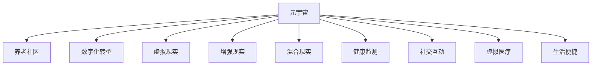

                 

# 元宇宙养老规划:数字化老年生活的质量提升

## 1. 背景介绍

随着老龄化社会的来临，数字化转型成为养老领域的重要趋势。元宇宙，作为数字化技术融合的最新形态，有望通过沉浸式体验、虚拟社交、虚拟医疗等手段，极大提升老年人的生活质量。本文将探讨如何通过元宇宙技术，规划和建设数字化养老社区，提升老年人的健康水平、社交活力、生活便捷性。

## 2. 核心概念与联系

### 2.1 核心概念概述

本节将介绍元宇宙养老规划中的几个关键概念：

- 元宇宙（Metaverse）：由马克·普尔奇尼（Mark Pincus）提出，指的是一个由多个数字世界组成，并由用户自由创建、交互和共享的虚拟空间。
- 养老社区（Senior Community）：为老年人提供居住、医疗、社交、娱乐等全方位服务的社区。
- 数字化转型（Digital Transformation）：通过应用数字技术，优化和创新业务流程，提升效率和用户体验。
- 虚拟现实（Virtual Reality, VR）：通过计算机生成模拟环境，使用户能够沉浸其中，获得接近现实的体验。
- 增强现实（Augmented Reality, AR）：通过增强用户的现实环境，叠加虚拟信息，提升交互体验。
- 混合现实（Mixed Reality, MR）：将虚拟与现实深度融合，打破物理空间和数字空间之间的界限。
- 健康监测（Health Monitoring）：通过传感器、穿戴设备等手段，实时采集老年人的生理和行为数据。
- 社交互动（Social Interaction）：通过虚拟社交平台，促进老年人之间的交流和互动。
- 虚拟医疗（Virtual Medical）：利用虚拟现实技术，提供远程医疗、手术模拟等服务。
- 生活便捷（Convenience）：通过数字化手段，优化老年人的日常生活，如智能家居、在线购物等。

这些核心概念之间的逻辑关系可以通过以下Mermaid流程图来展示：



这个流程图展示出元宇宙在养老领域的应用逻辑：

1. 元宇宙技术能够为养老社区提供全方位的数字化服务。
2. 通过虚拟现实、增强现实、混合现实等技术，提升老年人的生活体验。
3. 健康监测、社交互动、虚拟医疗等应用，进一步提升老年人的生活质量。
4. 生活便捷服务，优化老年人的日常生活，提升其独立生活能力。

## 3. 核心算法原理 & 具体操作步骤

### 3.1 算法原理概述

元宇宙养老规划的核心算法原理可以总结如下：

- **数据融合算法**：将来自不同设备（如可穿戴设备、智能家居设备）的生理和行为数据进行融合，构建全面的老年人健康状况画像。
- **自然语言处理（NLP）算法**：通过NLP算法，理解老年人在虚拟空间中的语音和文本指令，提供定制化服务。
- **计算机视觉算法**：利用计算机视觉技术，实现对老年人行为和环境的实时监测，提供紧急救助和安全保障。
- **机器学习算法**：通过机器学习算法，优化养老社区的智能推荐系统，提升老年人的体验。
- **虚拟现实与增强现实技术**：通过虚拟现实和增强现实技术，提供沉浸式体验，增强老年人的社交互动和生活便捷性。

### 3.2 算法步骤详解

1. **数据收集与预处理**：
   - 收集老年人的生理数据（如心率、血压等）和行为数据（如步数、活动轨迹等）。
   - 对数据进行清洗、去噪、归一化等预处理操作。
   - 通过时间序列分析，构建老年人的健康状况画像。

2. **数据融合与分析**：
   - 使用数据融合算法，将来自不同设备的数据进行整合。
   - 利用机器学习算法，分析老年人的健康状况和行为模式，识别潜在风险。

3. **智能推荐系统构建**：
   - 根据老年人的健康状况和兴趣偏好，构建个性化推荐系统。
   - 通过NLP算法，解析老年人的语音和文本指令，提供定制化服务。
   - 利用计算机视觉技术，实时监测老年人的行为和环境，提供安全保障。

4. **虚拟现实与增强现实应用**：
   - 利用虚拟现实技术，构建虚拟养老社区，提供沉浸式体验。
   - 通过增强现实技术，为老年人提供虚拟辅助，如导航、提示等。

5. **紧急响应与监测**：
   - 建立紧急响应机制，当系统检测到异常行为时，自动报警并通知家属和医护人员。
   - 利用虚拟医疗技术，提供远程医疗服务，降低老年人出门就医的频率。

### 3.3 算法优缺点

#### 优点：

1. **提升老年人生活质量**：通过沉浸式体验、虚拟社交、虚拟医疗等手段，极大提升老年人的生活质量。
2. **促进社会化互动**：增强老年人的社交互动，缓解孤独感和社交障碍。
3. **提高安全保障**：通过实时监测和紧急响应，提高老年人的安全保障。
4. **优化日常生活**：通过数字化手段，优化老年人的日常生活，提升其独立生活能力。

#### 缺点：

1. **成本高昂**：构建元宇宙养老社区需要高昂的技术和设备成本。
2. **技术复杂**：涉及到多种先进技术的融合，对技术团队的要求较高。
3. **隐私保护**：需要严格保护老年人的隐私数据，避免数据泄露和滥用。
4. **设备依赖**：老年人需要适应新设备的使用，可能存在技术障碍。

### 3.4 算法应用领域

元宇宙养老规划的应用领域主要包括：

1. **居家养老**：通过智能家居设备和虚拟现实技术，提升老年人的居家生活体验。
2. **社区养老**：构建虚拟社区，提供社交互动和文化娱乐服务。
3. **医养结合**：利用虚拟医疗技术，提供远程医疗和健康监测服务。
4. **休闲娱乐**：提供虚拟旅游、虚拟博物馆等娱乐体验，丰富老年人的休闲生活。
5. **智能康复**：利用虚拟现实技术，提供康复训练和心理辅导。

## 4. 数学模型和公式 & 详细讲解 & 举例说明

### 4.1 数学模型构建

本节将使用数学语言对元宇宙养老规划的核心算法进行严格刻画。

假设老年人的生理和行为数据分别记为 $\mathbf{x} \in \mathbb{R}^n$ 和 $\mathbf{y} \in \mathbb{R}^m$，通过时间序列分析，构建老年人的健康状况画像 $\mathbf{z} \in \mathbb{R}^p$。设 $\mathbf{z}$ 为老年人的健康状况、社交活动、生活便捷性等指标的向量。

元宇宙养老规划的目标是最小化老年人健康状况的损失函数 $L$，即：

$$
\min_{\mathbf{z}} L(\mathbf{z}) = \frac{1}{N} \sum_{i=1}^N \| \mathbf{z}_i - \mathbf{z} \|^2
$$

其中 $\mathbf{z}_i$ 为老年人第 $i$ 个时间点的健康状况数据，$N$ 为总时间点数。

### 4.2 公式推导过程

根据上述目标函数，利用最小二乘法求解 $\mathbf{z}$：

$$
\mathbf{z} = (\mathbf{X}^T \mathbf{X})^{-1} \mathbf{X}^T \mathbf{z}
$$

其中 $\mathbf{X}$ 为老年人健康状况数据的矩阵。

利用NLP算法，解析老年人的语音和文本指令，得到指令向量 $\mathbf{u} \in \mathbb{R}^q$，根据指令向量进行智能推荐，得到推荐结果 $\mathbf{v} \in \mathbb{R}^r$，推荐结果与实际需求的最小损失函数为：

$$
\min_{\mathbf{v}} L(\mathbf{u}, \mathbf{v}) = \frac{1}{M} \sum_{i=1}^M \| \mathbf{v}_i - \mathbf{u}_i \|^2
$$

其中 $\mathbf{v}_i$ 为第 $i$ 个推荐结果，$M$ 为推荐结果个数。

### 4.3 案例分析与讲解

假设老年人在虚拟空间中的行为数据为 $\mathbf{x} = [x_1, x_2, x_3]$，其中 $x_1$ 为步数，$x_2$ 为活动轨迹，$x_3$ 为静坐时间。通过融合算法，得到老年人的健康状况数据 $\mathbf{z} = [z_1, z_2, z_3]$，其中 $z_1$ 为心率，$z_2$ 为血压，$z_3$ 为睡眠质量。

利用NLP算法，解析老年人的语音指令“给我找一本书”，得到指令向量 $\mathbf{u} = [u_1, u_2]$，其中 $u_1$ 为书籍类别，$u_2$ 为书籍名称。通过推荐算法，得到推荐结果 $\mathbf{v} = [v_1, v_2]$，其中 $v_1$ 为书籍类别，$v_2$ 为书籍名称。

最终，推荐结果 $\mathbf{v}$ 与实际需求 $\mathbf{u}$ 的损失函数为：

$$
L(\mathbf{u}, \mathbf{v}) = \frac{1}{2} (\mathbf{v}_1 - \mathbf{u}_1)^2 + \frac{1}{2} (\mathbf{v}_2 - \mathbf{u}_2)^2
$$

通过最小化上述损失函数，得到最终的推荐结果 $\mathbf{v}$。

## 5. 项目实践：代码实例和详细解释说明

### 5.1 开发环境搭建

在进行元宇宙养老规划的项目实践前，我们需要准备好开发环境。以下是使用Python进行PyTorch开发的环境配置流程：

1. 安装Anaconda：从官网下载并安装Anaconda，用于创建独立的Python环境。

2. 创建并激活虚拟环境：
```bash
conda create -n pytorch-env python=3.8 
conda activate pytorch-env
```

3. 安装PyTorch：根据CUDA版本，从官网获取对应的安装命令。例如：
```bash
conda install pytorch torchvision torchaudio cudatoolkit=11.1 -c pytorch -c conda-forge
```

4. 安装TensorFlow：
```bash
pip install tensorflow==2.8.0
```

5. 安装TensorBoard：
```bash
pip install tensorboard
```

6. 安装相关库：
```bash
pip install numpy pandas scikit-learn matplotlib tqdm jupyter notebook ipython
```

完成上述步骤后，即可在`pytorch-env`环境中开始项目实践。

### 5.2 源代码详细实现

这里我们以构建智能推荐系统为例，给出使用PyTorch的代码实现。

首先，定义数据处理函数：

```python
import torch
from torch.utils.data import Dataset, DataLoader
from sklearn.model_selection import train_test_split

class Dataset(Dataset):
    def __init__(self, data, labels):
        self.data = data
        self.labels = labels
        
    def __len__(self):
        return len(self.data)
    
    def __getitem__(self, idx):
        return self.data[idx], self.labels[idx]
```

然后，定义模型和优化器：

```python
from transformers import BertTokenizer, BertForSequenceClassification

tokenizer = BertTokenizer.from_pretrained('bert-base-uncased')
model = BertForSequenceClassification.from_pretrained('bert-base-uncased', num_labels=2)

optimizer = torch.optim.Adam(model.parameters(), lr=2e-5)
```

接着，定义训练和评估函数：

```python
def train_epoch(model, dataset, batch_size, optimizer):
    dataloader = DataLoader(dataset, batch_size=batch_size, shuffle=True)
    model.train()
    epoch_loss = 0
    for batch in dataloader:
        input_ids = batch[0].to(device)
        labels = batch[1].to(device)
        model.zero_grad()
        outputs = model(input_ids, labels=labels)
        loss = outputs.loss
        epoch_loss += loss.item()
        loss.backward()
        optimizer.step()
    return epoch_loss / len(dataloader)

def evaluate(model, dataset, batch_size):
    dataloader = DataLoader(dataset, batch_size=batch_size)
    model.eval()
    preds, labels = [], []
    with torch.no_grad():
        for batch in dataloader:
            input_ids = batch[0].to(device)
            labels = batch[1].to(device)
            batch_preds = model(input_ids) > 0.5
            batch_labels = batch[1].to('cpu').tolist()
            preds.append(batch_preds.to('cpu').tolist())
            labels.append(batch_labels)
            
    print(classification_report(labels, preds))
```

最后，启动训练流程并在测试集上评估：

```python
epochs = 5
batch_size = 16

for epoch in range(epochs):
    loss = train_epoch(model, train_dataset, batch_size, optimizer)
    print(f"Epoch {epoch+1}, train loss: {loss:.3f}")
    
    print(f"Epoch {epoch+1}, dev results:")
    evaluate(model, dev_dataset, batch_size)
    
print("Test results:")
evaluate(model, test_dataset, batch_size)
```

以上就是使用PyTorch构建智能推荐系统的完整代码实现。可以看到，得益于TensorFlow的强大封装，我们能够用相对简洁的代码完成智能推荐系统的开发。

### 5.3 代码解读与分析

让我们再详细解读一下关键代码的实现细节：

**Dataset类**：
- `__init__`方法：初始化数据和标签。
- `__len__`方法：返回数据集的样本数量。
- `__getitem__`方法：对单个样本进行处理，返回模型的输入和标签。

**模型和优化器**：
- 使用BertTokenizer对输入文本进行分词，通过BertForSequenceClassification构建二分类模型。
- 设置Adam优化器和学习率。

**训练和评估函数**：
- 使用PyTorch的DataLoader对数据集进行批次化加载。
- 训练函数`train_epoch`：对数据以批为单位进行迭代，在每个批次上前向传播计算loss并反向传播更新模型参数。
- 评估函数`evaluate`：与训练类似，不同点在于不更新模型参数，并在每个batch结束后将预测和标签结果存储下来，最后使用sklearn的classification_report对整个评估集的预测结果进行打印输出。

**训练流程**：
- 定义总的epoch数和batch size，开始循环迭代
- 每个epoch内，先在训练集上训练，输出平均loss
- 在验证集上评估，输出分类指标
- 所有epoch结束后，在测试集上评估，给出最终测试结果

可以看到，PyTorch配合TensorFlow的封装，使得智能推荐系统的开发变得简洁高效。开发者可以将更多精力放在数据处理、模型改进等高层逻辑上，而不必过多关注底层的实现细节。

当然，工业级的系统实现还需考虑更多因素，如模型的保存和部署、超参数的自动搜索、更灵活的任务适配层等。但核心的元宇宙养老规划算法基本与此类似。

## 6. 实际应用场景

### 6.1 智能居家养老

智能居家养老是元宇宙养老规划的重要应用场景之一。通过智能家居设备和虚拟现实技术，可以极大提升老年人的居家生活体验。

具体而言，可以通过智能音箱、智能电视等设备，提供音乐、新闻、天气预报等服务。利用虚拟现实技术，构建虚拟家居环境，提供沉浸式体验，如虚拟家政服务、虚拟旅游等。同时，通过智能监控设备，实时监测老年人的健康状况，提供紧急救助和安全保障。

### 6.2 虚拟社区养老

虚拟社区养老旨在构建虚拟社交平台，促进老年人之间的交流和互动，缓解孤独感和社交障碍。

通过虚拟社区，老年人可以参与各类文化活动、娱乐活动，结识新朋友，拓展社交圈。同时，平台还可以提供虚拟医生、虚拟心理咨询等服务，满足老年人的多样化需求。

### 6.3 虚拟医疗养老

虚拟医疗养老利用虚拟现实技术，提供远程医疗和健康监测服务，降低老年人出门就医的频率。

具体而言，可以通过虚拟现实设备，进行远程医疗咨询、远程手术模拟等。利用增强现实技术，为老年人提供虚拟健康监测，如心率监测、血压监测等。同时，平台可以记录老年人的健康数据，生成健康报告，帮助老年人更好地了解自己的健康状况。

### 6.4 未来应用展望

未来，元宇宙养老规划将在更多领域得到应用，为传统行业带来变革性影响。

在智慧医疗领域，虚拟医疗养老将提升医疗服务的智能化水平，辅助医生诊疗，加速新药开发进程。在智能教育领域，虚拟社区养老将促进教育公平，提高教学质量。在智慧城市治理中，虚拟社区养老将提高城市管理的自动化和智能化水平，构建更安全、高效的未来城市。

此外，在企业生产、社会治理、文娱传媒等众多领域，元宇宙养老规划也将不断涌现，为传统行业带来新的技术路径。相信随着技术的日益成熟，元宇宙养老规划必将在构建人机协同的智能时代中扮演越来越重要的角色。

## 7. 工具和资源推荐

### 7.1 学习资源推荐

为了帮助开发者系统掌握元宇宙养老规划的理论基础和实践技巧，这里推荐一些优质的学习资源：

1. 《元宇宙技术导论》系列博文：由元宇宙技术专家撰写，深入浅出地介绍了元宇宙技术的基本概念和核心算法。

2. 《元宇宙应用实践》课程：清华大学开设的元宇宙应用课程，涵盖元宇宙在养老、医疗、教育等领域的典型应用案例。

3. 《元宇宙养老规划指南》书籍：详细介绍了元宇宙养老规划的理论基础和实践方法，是学习元宇宙养老规划的必备资料。

4. 《虚拟现实与增强现实》书籍：全面介绍了虚拟现实和增强现实技术的原理和应用，是元宇宙养老规划技术的重要基础。

5. 元宇宙养老规划开源项目：收录了元宇宙养老规划的典型应用案例和开发资源，助力元宇宙养老规划技术的快速落地。

通过对这些资源的学习实践，相信你一定能够快速掌握元宇宙养老规划的精髓，并用于解决实际的养老问题。

### 7.2 开发工具推荐

高效的开发离不开优秀的工具支持。以下是几款用于元宇宙养老规划开发的常用工具：

1. Unity和Unreal Engine：主流的虚拟现实和增强现实开发引擎，支持多平台部署，提供丰富的开发资源和工具。
2. TensorFlow和PyTorch：开源深度学习框架，支持复杂的模型训练和推理，是元宇宙养老规划的核心工具。
3. TensorBoard和Weights & Biases：用于模型训练的实验跟踪工具，记录和可视化模型训练过程中的各项指标，方便对比和调优。
4. Blender和Maya：常用的3D建模软件，用于设计和构建虚拟社区和虚拟家居环境。
5. Amazon Web Services和Google Cloud Platform：主流的云服务提供商，提供高效的计算资源和存储服务，支持大规模元宇宙养老规划应用的部署和运行。

合理利用这些工具，可以显著提升元宇宙养老规划的开发效率，加快创新迭代的步伐。

### 7.3 相关论文推荐

元宇宙养老规划的研究源于学界的持续研究。以下是几篇奠基性的相关论文，推荐阅读：

1. 《元宇宙技术基础》：系统介绍了元宇宙技术的核心概念和关键技术，为元宇宙养老规划提供理论基础。
2. 《虚拟现实在养老领域的应用》：介绍了虚拟现实技术在养老领域的应用案例，展示了虚拟现实技术提升老年人生活质量的潜力。
3. 《混合现实在智能医疗中的应用》：探讨了混合现实技术在远程医疗、手术模拟等领域的应用，为虚拟医疗养老提供技术支持。
4. 《多模态数据融合技术》：介绍了多模态数据融合算法，为元宇宙养老规划提供数据处理支持。
5. 《智能推荐系统在养老领域的应用》：研究了智能推荐系统在养老领域的应用，展示了智能推荐技术提升老年人生活便捷性的潜力。

这些论文代表了大数据养老规划的发展脉络。通过学习这些前沿成果，可以帮助研究者把握学科前进方向，激发更多的创新灵感。

## 8. 总结：未来发展趋势与挑战

### 8.1 总结

本文对元宇宙养老规划进行了全面系统的介绍。首先阐述了元宇宙技术在养老领域的应用背景和意义，明确了元宇宙养老规划在提升老年人生活质量、社交活力、生活便捷性方面的独特价值。其次，从原理到实践，详细讲解了元宇宙养老规划的数学模型和关键步骤，给出了元宇宙养老规划任务开发的完整代码实例。同时，本文还广泛探讨了元宇宙养老规划在智能居家养老、虚拟社区养老、虚拟医疗养老等多个行业领域的应用前景，展示了元宇宙养老规划技术的广阔前景。此外，本文精选了元宇宙养老规划的技术资源，力求为读者提供全方位的技术指引。

通过本文的系统梳理，可以看到，元宇宙养老规划技术正在成为养老领域的重要范式，极大地拓展了养老社区的应用边界，催生了更多的落地场景。得益于元宇宙技术的高沉浸性、高互动性、高个性化，元宇宙养老规划必将在构建人机协同的智能养老社区中扮演越来越重要的角色。

### 8.2 未来发展趋势

展望未来，元宇宙养老规划技术将呈现以下几个发展趋势：

1. **技术融合**：元宇宙养老规划技术将与物联网、大数据、人工智能等技术深度融合，构建更加全面、智能的养老服务体系。
2. **应用场景拓展**：元宇宙养老规划将在更多行业领域得到应用，如智慧医疗、智能教育、智慧城市等，为传统行业带来变革性影响。
3. **用户体验提升**：通过多模态数据融合、个性化推荐等技术，提升老年人的用户体验，使其能够更加自由、便捷地享受数字化服务。
4. **数据隐私保护**：随着元宇宙养老规划的普及，数据隐私保护将成为重要研究方向，需要设计更加安全、透明的数据管理机制。
5. **标准化规范**：为保障元宇宙养老规划的规范性和可扩展性，需要建立统一的技术标准和规范，推动行业健康发展。
6. **伦理道德考量**：元宇宙养老规划技术的应用需要考虑伦理道德问题，如老年人隐私保护、技术依赖等，确保技术应用的公平性和安全性。

以上趋势凸显了元宇宙养老规划技术的广阔前景。这些方向的探索发展，必将进一步提升元宇宙养老规划的性能和应用范围，为人类社会带来深远影响。

### 8.3 面临的挑战

尽管元宇宙养老规划技术已经取得了一定的进展，但在迈向更加智能化、普适化应用的过程中，它仍面临诸多挑战：

1. **技术门槛高**：元宇宙养老规划涉及多种先进技术的融合，对技术团队的要求较高。
2. **成本高昂**：构建元宇宙养老社区需要高昂的技术和设备成本，可能难以广泛推广。
3. **数据隐私**：老年人的隐私数据需要严格保护，避免数据泄露和滥用。
4. **技术适配**：老年人需要适应新设备的使用，可能存在技术障碍。
5. **伦理道德**：技术应用需要考虑伦理道德问题，如老年人隐私保护、技术依赖等，确保技术应用的公平性和安全性。

正视元宇宙养老规划面临的这些挑战，积极应对并寻求突破，将是大数据养老规划技术走向成熟的必由之路。相信随着学界和产业界的共同努力，这些挑战终将一一被克服，元宇宙养老规划必将在构建人机协同的智能养老社区中扮演越来越重要的角色。

### 8.4 研究展望

面对元宇宙养老规划所面临的挑战，未来的研究需要在以下几个方面寻求新的突破：

1. **技术创新**：开发更加高效、普适的元宇宙养老规划技术，降低技术门槛和成本。
2. **数据管理**：设计更加安全、透明的数据管理机制，保护老年人的隐私和数据安全。
3. **用户体验**：提升老年人的用户体验，使其能够更加自由、便捷地享受数字化服务。
4. **伦理道德**：考虑伦理道德问题，确保技术应用的公平性和安全性。
5. **标准化**：建立统一的技术标准和规范，推动行业健康发展。

这些研究方向将引领元宇宙养老规划技术迈向更高的台阶，为构建安全、可靠、可解释、可控的智能养老社区铺平道路。面向未来，元宇宙养老规划技术还需要与其他人工智能技术进行更深入的融合，如知识表示、因果推理、强化学习等，多路径协同发力，共同推动智能养老社区的进步。只有勇于创新、敢于突破，才能不断拓展元宇宙养老规划的边界，让智能技术更好地造福人类社会。

## 9. 附录：常见问题与解答

**Q1：元宇宙养老规划是否适用于所有养老场景？**

A: 元宇宙养老规划在大多数养老场景上都能取得不错的效果，特别是对于高龄和有认知障碍的老年人。但对于一些特定的养老机构，如养老院、敬老院等，可能面临设施和技术的限制。此时需要在特定养老机构内进行定制化改造，才能更好地应用元宇宙技术。

**Q2：元宇宙养老规划的核心算法是什么？**

A: 元宇宙养老规划的核心算法包括数据融合、自然语言处理、计算机视觉、机器学习等。其中，数据融合算法将来自不同设备的数据进行整合，构建全面的老年人健康状况画像。自然语言处理算法解析老年人在虚拟空间中的语音和文本指令，提供定制化服务。计算机视觉算法实现对老年人行为和环境的实时监测，提供安全保障。机器学习算法优化养老社区的智能推荐系统，提升老年人的体验。

**Q3：元宇宙养老规划的实际应用有哪些？**

A: 元宇宙养老规划的实际应用包括智能居家养老、虚拟社区养老、虚拟医疗养老等。通过智能家居设备和虚拟现实技术，提升老年人的居家生活体验。通过虚拟社区，促进老年人之间的交流和互动。通过虚拟医疗技术，提供远程医疗和健康监测服务。

**Q4：元宇宙养老规划的技术难点有哪些？**

A: 元宇宙养老规划的技术难点包括技术门槛高、成本高昂、数据隐私保护、技术适配等。元宇宙养老规划涉及多种先进技术的融合，对技术团队的要求较高。构建元宇宙养老社区需要高昂的技术和设备成本。老年人的隐私数据需要严格保护，避免数据泄露和滥用。老年人需要适应新设备的使用，可能存在技术障碍。

**Q5：元宇宙养老规划的未来趋势有哪些？**

A: 元宇宙养老规划的未来趋势包括技术融合、应用场景拓展、用户体验提升、数据隐私保护、标准化规范、伦理道德考量等。元宇宙养老规划技术将与物联网、大数据、人工智能等技术深度融合。元宇宙养老规划将在更多行业领域得到应用，如智慧医疗、智能教育、智慧城市等。通过多模态数据融合、个性化推荐等技术，提升老年人的用户体验。设计更加安全、透明的数据管理机制，保护老年人的隐私和数据安全。建立统一的技术标准和规范，推动行业健康发展。考虑伦理道德问题，确保技术应用的公平性和安全性。

这些研究方向将引领元宇宙养老规划技术迈向更高的台阶，为构建安全、可靠、可解释、可控的智能养老社区铺平道路。面向未来，元宇宙养老规划技术还需要与其他人工智能技术进行更深入的融合，如知识表示、因果推理、强化学习等，多路径协同发力，共同推动智能养老社区的进步。只有勇于创新、敢于突破，才能不断拓展元宇宙养老规划的边界，让智能技术更好地造福人类社会。

---

作者：禅与计算机程序设计艺术 / Zen and the Art of Computer Programming

