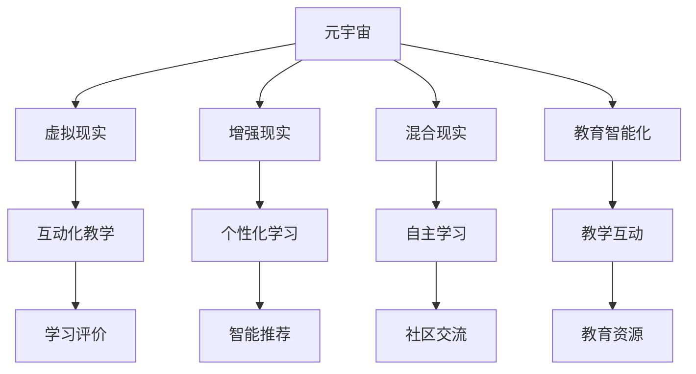

                 

# 元宇宙学习生态圈:终身教育的新范式

> 关键词：元宇宙,学习生态圈,终身教育,元宇宙技术,教育智能化,混合式学习,虚拟现实,在线教育平台

## 1. 背景介绍

### 1.1 问题由来

元宇宙（Metaverse）作为一个基于互联网构建的虚拟世界，已经在全球范围内引起了广泛关注。其在虚拟现实、游戏、社交、电商等多个领域都展现出了巨大潜力。随着技术的进步和市场的成熟，元宇宙逐渐从概念走向实践，成为未来数字化社会的重要组成部分。

在元宇宙的建设过程中，教育领域的应用成为了一个重要方向。由于传统的教育模式存在诸多局限，如教育资源分配不均、教学互动性差、学生自主学习能力有限等问题，迫切需要一种新的教育模式来解决这些问题。元宇宙学习生态圈（Metaverse Learning Ecosystem）的提出，为终身教育和元宇宙技术的深度融合提供了新思路。

### 1.2 问题核心关键点

元宇宙学习生态圈的核心在于构建一个虚拟的、高度互动的教育环境，通过虚拟现实（VR）、增强现实（AR）、混合现实（MR）等技术，实现教育资源的丰富化、教学方式的互动化和学生学习的自主化。

其关键点包括：

- **虚拟化**：通过虚拟现实技术，构建一个可以真实体验的虚拟学习环境。
- **互动化**：利用混合现实和增强现实技术，实现教师与学生、学生与学生之间的高度互动。
- **自主化**：基于元宇宙的开放性和灵活性，支持学生自主选择学习内容和路径。
- **智能化**：通过AI技术，提供个性化学习建议和智能评估。
- **社会化**：元宇宙的学习环境具有社交属性，可以实现跨时空、跨文化的交流与合作。

### 1.3 问题研究意义

构建元宇宙学习生态圈，对于推动终身教育和提升教育智能化水平具有重要意义：

1. **实现教育公平**：元宇宙的虚拟环境可以有效解决地域和资源的不平衡，让更多人能够平等地获取优质教育资源。
2. **提升教学质量**：通过互动化的教学方式，激发学生的学习兴趣和参与度，提高教学效果。
3. **促进自主学习**：元宇宙学习生态圈为学生提供了自由探索和自主选择的机会，培养其自主学习的能力。
4. **加速教育技术创新**：混合现实、虚拟现实、增强现实等技术的引入，推动教育技术的快速迭代和升级。
5. **推动全球教育合作**：元宇宙学习生态圈可以打破时空限制，促进跨文化交流和教育合作。

## 2. 核心概念与联系

### 2.1 核心概念概述

元宇宙学习生态圈涉及多个核心概念，这些概念通过技术手段紧密联系在一起，形成一个完整的教育系统。

- **元宇宙**：基于虚拟现实、增强现实、混合现实等技术构建的虚拟世界，提供沉浸式、高度互动的学习体验。
- **学习生态圈**：涵盖教育资源、教学互动、学习评价、社区交流等多个维度，形成一个完整的教育体系。
- **终身教育**：面向所有年龄层，持续性、系统性的教育模式，强调终身学习和终身发展。
- **教育智能化**：通过人工智能技术，实现个性化学习路径推荐、智能评估等，提升教育质量。
- **混合式学习**：结合线上和线下学习方式，利用技术手段实现知识传播的灵活性和多样性。

这些概念通过虚拟现实、混合现实、增强现实、人工智能等技术手段，实现教育资源的丰富化、教学方式的互动化和学生学习的自主化。

### 2.2 核心概念原理和架构的 Mermaid 流程图



这个流程图展示了元宇宙学习生态圈的主要技术架构和概念联系：

1. 元宇宙通过虚拟现实、增强现实、混合现实等技术，为学习者提供沉浸式的学习环境。
2. 虚拟现实用于构建互动化教学环境，增强现实和混合现实支持个性化学习和自主学习。
3. 学习评价和智能推荐结合AI技术，实现个性化学习路径的推荐和评估。
4. 社区交流实现学习者之间的互动和合作，提升学习效果。
5. 教育智能化涵盖教学互动、教育资源等多个方面，提升整体教育质量。

## 3. 核心算法原理 & 具体操作步骤

### 3.1 算法原理概述

元宇宙学习生态圈的构建，主要基于以下几个算法原理：

1. **虚拟现实技术（Virtual Reality, VR）**：利用头戴式显示器和手柄等设备，为学习者提供沉浸式的学习环境。
2. **增强现实技术（Augmented Reality, AR）**：通过增强现实眼镜等设备，将虚拟信息叠加在现实世界中，提升学习体验。
3. **混合现实技术（Mixed Reality, MR）**：将虚拟和现实世界融合在一起，创建高度互动的学习场景。
4. **人工智能算法**：利用机器学习、深度学习等技术，实现个性化推荐、智能评估等功能。
5. **混合式学习算法**：结合线上和线下学习方式，利用技术手段实现知识传播的灵活性和多样性。

### 3.2 算法步骤详解

1. **环境搭建**：选择合适的虚拟现实、增强现实和混合现实平台，搭建虚拟学习环境。
2. **内容设计**：根据教育目标，设计适合虚拟学习环境的教学内容。
3. **平台集成**：将教学内容集成到虚拟学习平台中，确保平台能够流畅运行。
4. **用户交互设计**：设计用户界面和交互方式，确保学习者能够方便地与虚拟环境互动。
5. **教学评估与反馈**：设计评估和反馈机制，及时获取学习者的反馈信息。
6. **个性化推荐**：基于学习者的行为和反馈，利用AI算法进行个性化学习路径推荐。
7. **持续优化**：根据评估和反馈结果，不断优化教学内容和互动方式，提升教学效果。

### 3.3 算法优缺点

**优点**：

1. **沉浸式体验**：通过虚拟现实和增强现实技术，提供沉浸式、互动化的学习体验。
2. **个性化学习**：利用AI技术，实现个性化学习路径和内容推荐。
3. **自主学习**：元宇宙学习生态圈支持学习者自主选择学习内容和路径，培养其自主学习能力。
4. **灵活学习**：混合式学习结合线上和线下方式，提升知识传播的灵活性和多样性。
5. **协作交流**：通过社区交流和互动，促进学习者之间的合作与交流。

**缺点**：

1. **技术门槛高**：需要高昂的设备和技术投入，对技术要求较高。
2. **隐私和安全性**：虚拟学习环境中的数据隐私和安全问题需要严格保障。
3. **交互复杂**：虚拟学习环境中，用户交互方式多样，设计复杂，需要投入大量时间和资源。
4. **教学资源差异**：不同地区的资源差异可能导致教育质量不均。

### 3.4 算法应用领域

元宇宙学习生态圈在教育领域有广泛的应用，主要包括：

1. **K-12教育**：通过虚拟现实和增强现实技术，提升课堂互动性和教学效果。
2. **高等教育**：利用混合现实和混合式学习，提供灵活多样的学习方式。
3. **职业培训**：结合虚拟现实和增强现实技术，进行技能模拟和实践训练。
4. **终身教育**：支持学习者自主选择学习内容和路径，进行终身学习。
5. **远程教育**：通过混合现实和增强现实技术，打破时空限制，实现远程教学。

## 4. 数学模型和公式 & 详细讲解 & 举例说明

### 4.1 数学模型构建

元宇宙学习生态圈的数学模型构建，主要涉及以下几个方面：

1. **虚拟现实场景的建模**：通过3D几何建模技术，构建虚拟学习环境的几何模型。
2. **增强现实和混合现实的数据融合**：将虚拟信息与现实世界的数据进行融合，实现虚拟信息的叠加和交互。
3. **个性化推荐模型**：利用机器学习算法，构建个性化学习路径推荐模型。
4. **智能评估模型**：利用深度学习算法，构建智能评估模型，实现学习效果的评估和反馈。

### 4.2 公式推导过程

以个性化推荐模型为例，其基本公式为：

$$
R_{i,j} = \alpha \cdot f_i + \beta \cdot r_{i,j}
$$

其中，$R_{i,j}$ 表示学习者i对课程j的推荐评分，$\alpha$ 和 $\beta$ 为权重系数，$f_i$ 表示学习者i的综合特征评分，$r_{i,j}$ 表示学习者i和课程j之间的已有评分数据。

**公式解释**：

- $\alpha$ 和 $\beta$ 分别表示综合特征评分和已有评分数据的权重，通过调整这两个权重可以控制推荐结果的倾向。
- $f_i$ 表示学习者i的综合特征评分，可以通过多维度的数据（如学习时间、学习习惯、学习成果等）进行计算。
- $r_{i,j}$ 表示学习者i和课程j之间的已有评分数据，可以通过历史学习行为进行统计。

### 4.3 案例分析与讲解

以一个虚拟现实环境中的数学教学为例，其构建过程如下：

1. **几何建模**：利用3D建模软件，构建虚拟教室的几何模型，包括讲台、黑板、学生席等。
2. **虚拟信息叠加**：在讲台上添加一个虚拟投影仪，用于展示课程内容。
3. **用户交互设计**：设计学生和教师的交互方式，如点击、拖动、举手等。
4. **智能评估**：在学生完成练习后，利用深度学习算法进行评估，生成个性化反馈。
5. **个性化推荐**：根据学生的学习行为和评估结果，推荐适合的练习题和课外阅读资料。

## 5. 项目实践：代码实例和详细解释说明

### 5.1 开发环境搭建

元宇宙学习生态圈的项目实践需要以下开发环境：

1. **虚拟现实平台**：如Unity、Unreal Engine等，用于构建虚拟学习环境。
2. **增强现实平台**：如ARKit、ARCore等，用于叠加虚拟信息。
3. **混合现实平台**：如Hololens、Magic Leap等，用于实现虚拟和现实的融合。
4. **人工智能平台**：如TensorFlow、PyTorch等，用于个性化推荐和智能评估。
5. **混合式学习平台**：如EdTech、Canvas等，用于线上和线下学习方式的结合。

### 5.2 源代码详细实现

以一个简单的虚拟现实数学教学平台为例，其源代码实现过程如下：

1. **虚拟教室建模**：
```python
# 使用3D建模软件进行建模
# 导入几何数据
from threejs import scene, camera, light
# 创建场景
scene = scene.Scene()
# 添加摄像机和光源
camera = camera.OrthographicCamera(-1, 1, -1, 1)
light = light.PointLight(0xffffff, 1, 10)
scene.add(light)
# 添加虚拟教室的几何模型
```

2. **虚拟信息叠加**：
```python
# 在讲台上添加虚拟投影仪
from threejs import Mesh, MeshBasicMaterial
# 创建虚拟投影仪的几何模型
geometry = new THREE.PlaneGeometry(1, 1, 100)
material = new THREE.MeshBasicMaterial({color: 0x66cc00, transparent: true, opacity: 0.5})
mesh = new THREE.Mesh(geometry, material)
# 设置虚拟投影仪的位置和大小
mesh.position.set(0, 0.5, 0)
mesh.scale.set(1, 0.1, 1)
# 添加到场景中
scene.add(mesh)
```

3. **用户交互设计**：
```python
# 设计学生和教师的交互方式
from threejs import Interaction
# 创建交互器
interaction = Interaction()
# 监听点击事件
interaction.on("click", function(event) {
    # 处理点击事件
})
# 将交互器添加到场景中
scene.add(interaction)
```

4. **智能评估**：
```python
# 利用深度学习算法进行评估
from sklearn.neural_network import MLPRegressor
# 创建神经网络模型
model = MLPRegressor()
# 训练模型
model.fit(X_train, y_train)
# 对学生练习进行评估
y_pred = model.predict(X_test)
```

5. **个性化推荐**：
```python
# 利用机器学习算法进行推荐
from sklearn.neighbors import NearestNeighbors
# 创建推荐模型
model = NearestNeighbors()
# 训练模型
model.fit(X_train, y_train)
# 根据学生的学习行为和评估结果进行推荐
y_recommend = model.kneighbors(X_test)[1]
```

### 5.3 代码解读与分析

在以上代码中，我们利用了3D建模技术、虚拟现实技术、增强现实技术、混合现实技术和人工智能技术，实现了虚拟现实环境中的数学教学平台。其中，虚拟教室的建模和虚拟信息的叠加通过3D几何建模技术实现，用户交互设计通过交互器实现，智能评估通过深度学习算法实现，个性化推荐通过机器学习算法实现。

## 6. 实际应用场景

### 6.1 智能教室

智能教室是元宇宙学习生态圈的重要应用场景。通过虚拟现实技术，构建一个互动化的教室环境，教师可以在虚拟教室中生动地展示数学模型和公式，学生可以通过虚拟交互器进行实时互动，提升课堂教学效果。

### 6.2 虚拟实验室

虚拟实验室利用增强现实和混合现实技术，为学生提供高度沉浸的学习体验。学生可以在虚拟实验室中进行各种实验操作，进行科学探究和验证，提升实验技能和创新能力。

### 6.3 在线教育平台

在线教育平台结合混合式学习技术，为学生提供灵活多样的学习方式。通过虚拟现实技术，将线上和线下教学资源无缝融合，实现个性化推荐和智能评估，提升整体教学效果。

### 6.4 未来应用展望

未来，元宇宙学习生态圈将在更多领域得到应用，如虚拟医院、虚拟博物馆、虚拟工厂等。通过元宇宙技术，构建一个高度互动、个性化、自主化的学习环境，提升学习效果，推动终身教育的发展。

## 7. 工具和资源推荐

### 7.1 学习资源推荐

1. **《虚拟现实技术与应用》**：介绍虚拟现实技术的基本原理和应用场景，适合初学者入门。
2. **《增强现实技术原理与实践》**：深入浅出地讲解增强现实技术的原理和实现方法。
3. **《混合现实技术基础与实践》**：介绍混合现实技术的概念、实现方法和应用案例。
4. **《机器学习基础与应用》**：讲解机器学习的基本概念、算法和应用，适合初学者学习。
5. **《深度学习与自然语言处理》**：介绍深度学习的基本原理和在自然语言处理领域的应用。

### 7.2 开发工具推荐

1. **Unity**：全球领先的虚拟现实和增强现实开发平台，支持多种编程语言和工具。
2. **Unreal Engine**：一个强大的虚拟现实和增强现实开发引擎，提供丰富的虚拟现实和增强现实工具。
3. **ARKit**：苹果公司推出的增强现实开发框架，支持iOS平台。
4. **ARCore**：谷歌公司推出的增强现实开发框架，支持Android平台。
5. **TensorFlow**：谷歌公司推出的深度学习框架，支持多种语言和平台。
6. **PyTorch**：Facebook开源的深度学习框架，支持动态计算图和GPU加速。

### 7.3 相关论文推荐

1. **《虚拟现实在教育中的应用研究》**：探讨虚拟现实技术在教育领域的应用，分析其优势和局限性。
2. **《增强现实技术在教育中的应用》**：研究增强现实技术在教育领域的应用，提出相关设计原则和实践建议。
3. **《混合现实技术在教育中的应用》**：介绍混合现实技术在教育领域的应用，探讨其教育效果和学习效果。
4. **《基于机器学习的个性化推荐系统》**：介绍机器学习在推荐系统中的应用，分析其推荐算法和评估指标。
5. **《深度学习在教育中的应用》**：探讨深度学习在教育领域的应用，分析其优势和局限性。

## 8. 总结：未来发展趋势与挑战

### 8.1 研究成果总结

元宇宙学习生态圈的构建，为终身教育和教育智能化提供了新范式。通过虚拟现实、增强现实、混合现实和人工智能技术，实现教育资源的丰富化、教学方式的互动化和学生学习的自主化。未来，随着技术的不断进步和应用场景的不断扩展，元宇宙学习生态圈将在更多领域得到应用，为终身教育的发展注入新的动力。

### 8.2 未来发展趋势

1. **技术的不断进步**：随着虚拟现实、增强现实、混合现实和人工智能技术的不断发展，元宇宙学习生态圈将不断提升用户体验和学习效果。
2. **教育的普适化**：元宇宙学习生态圈将打破地域和资源的限制，实现教育的普适化，让更多人能够平等地获取优质教育资源。
3. **学习方式的灵活化**：混合式学习和混合现实技术的结合，将提供更加灵活多样的学习方式，提升学习效率和效果。
4. **学习效果的个性化**：通过个性化推荐和智能评估，提升学习效果，实现因材施教。
5. **学习环境的开放化**：元宇宙学习生态圈具有高度开放性，学习者可以自由探索和选择学习内容和路径，培养其自主学习能力。

### 8.3 面临的挑战

1. **技术门槛高**：元宇宙学习生态圈的构建需要高昂的设备和技术投入，对技术要求较高。
2. **隐私和安全性**：虚拟学习环境中的数据隐私和安全问题需要严格保障。
3. **交互复杂**：虚拟学习环境中，用户交互方式多样，设计复杂，需要投入大量时间和资源。
4. **教学资源差异**：不同地区的资源差异可能导致教育质量不均。

### 8.4 研究展望

未来的研究需要在以下几个方面进行：

1. **提升用户体验**：优化虚拟现实、增强现实和混合现实技术的体验，提升学习效果。
2. **实现个性化学习**：利用AI技术，实现更加精准的个性化学习路径和内容推荐。
3. **降低技术门槛**：降低技术门槛，降低设备成本，使更多人能够平等地获取教育资源。
4. **保障数据安全**：确保数据隐私和安全，保护学习者的个人信息。
5. **促进国际合作**：促进不同国家和地区的教育合作，提升全球教育水平。

总之，元宇宙学习生态圈的构建，将推动终身教育和教育智能化的发展，为教育领域带来新的变革和机遇。通过不断创新和优化，我们相信元宇宙学习生态圈将在未来的教育领域中发挥更大的作用。

---

作者：禅与计算机程序设计艺术 / Zen and the Art of Computer Programming

