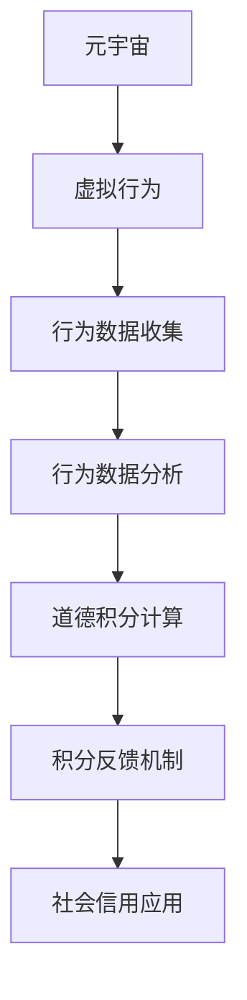

                 

# 元宇宙道德积分:虚拟行为的社会信用评估体系

> 关键词：元宇宙, 道德积分, 虚拟行为, 社会信用评估体系, 算法, 数学模型

## 1. 背景介绍

### 1.1 问题由来
随着虚拟现实技术的进步，元宇宙正在快速崛起，成为人类未来社会的一个重要组成部分。元宇宙不仅仅是一个虚拟空间，更是一个全新的社会生态系统。然而，这个虚拟空间缺乏现实社会的法律法规和道德规范，用户行为缺乏约束，时常出现诸如诈骗、诽谤、骚扰等不当行为。

如何通过技术手段构建一个健康、有序的元宇宙社会，成为当前亟需解决的问题。本文从社会信用评估体系的角度，提出一种基于道德积分的虚拟行为评估模型，旨在通过算法手段引导用户行为，维护虚拟社会的秩序和道德。

### 1.2 问题核心关键点
本文的核心点在于构建一种新的元宇宙行为评估体系，通过道德积分来实时记录、评估和反馈用户的行为，从而实现对虚拟行为的约束和引导。具体来说，道德积分是一种基于用户行为数据的量化指标，反映了用户在虚拟社会中的道德表现。

该体系通过以下几个步骤实现：
1. **行为数据收集**：对用户的虚拟行为进行记录，形成行为数据集。
2. **行为数据分析**：利用机器学习模型对行为数据进行分析和打分，得出道德积分。
3. **积分反馈机制**：将道德积分结果反馈给用户，引导其改善行为。
4. **社会信用应用**：将道德积分应用于虚拟社会的各种场景中，如虚拟货币交易、游戏内声誉等，实现对用户行为的约束和引导。

本文将详细阐述道德积分的构建和应用过程，探讨其在元宇宙社会中的作用和未来发展方向。

## 2. 核心概念与联系

### 2.1 核心概念概述

为更好地理解基于道德积分的元宇宙行为评估体系，本节将介绍几个密切相关的核心概念：

- **元宇宙 (Metaverse)**：一个虚拟的、持续的、可体验的数字世界，用户可以通过VR、AR等技术进入，与他人互动。
- **虚拟行为 (Virtual Behavior)**：用户在元宇宙中的行为，如发言、交流、交易等。
- **社会信用评估体系 (Social Credit System)**：利用数据和算法，对用户的行为进行量化评估，形成信用积分，反映其社会责任和道德水平。
- **道德积分 (Moral Score)**：一种量化指标，用于反映用户在虚拟社会中的道德表现，越高分代表越高的道德水平。
- **算法 (Algorithm)**：用于处理和分析行为数据，得出道德积分的计算方法。
- **数学模型 (Mathematical Model)**：描述道德积分计算过程的数学表达式。

这些核心概念之间的逻辑关系可以通过以下Mermaid流程图来展示：



这个流程图展示了元宇宙行为评估体系的核心流程：

1. 用户在元宇宙中的行为被记录。
2. 行为数据经过分析和处理，得出道德积分。
3. 道德积分反馈给用户，影响其行为。
4. 道德积分在虚拟社会中应用，实现对行为的约束和引导。

## 3. 核心算法原理 & 具体操作步骤

### 3.1 算法原理概述

基于道德积分的元宇宙行为评估体系，本质上是一个行为数据分析和反馈系统。其核心思想是：通过机器学习算法，对用户的行为数据进行分析，量化其道德表现，实时反馈到用户，从而引导其行为。

形式化地，假设用户的行为数据为 $D=\{(x_i,y_i)\}_{i=1}^N$，其中 $x_i$ 为行为数据（如发言时间、交易金额等），$y_i$ 为对应的道德评分。则道德积分的计算过程可以表示为：

$$
Morse Score = f(D) = \frac{1}{N} \sum_{i=1}^N w_i \times g(x_i,y_i)
$$

其中 $f$ 为道德积分计算函数，$w_i$ 为行为数据的权重，$g$ 为道德评分函数。权重 $w_i$ 用于调整不同行为数据的贡献，确保对重要行为给予更高的评分。

通过梯度下降等优化算法，道德积分计算函数 $f$ 不断更新，最小化模型在行为数据上的误差，从而得到最优的道德积分。

### 3.2 算法步骤详解

基于道德积分的元宇宙行为评估体系一般包括以下几个关键步骤：

**Step 1: 准备行为数据**
- 收集用户在元宇宙中的行为数据，包括发言内容、交易记录、互动行为等。
- 对行为数据进行预处理，如去重、归一化等。

**Step 2: 设计道德评分函数**
- 根据道德准则，设计道德评分函数 $g(x_i,y_i)$。例如，可以将发言时间、交易金额、互动频率等因子进行加权求和，得出道德评分。
- 定义不同行为的权重 $w_i$，确保关键行为的影响力更大。

**Step 3: 选择优化算法**
- 选择合适的优化算法（如梯度下降、随机梯度下降等），设置学习率和迭代轮数。

**Step 4: 执行积分计算**
- 对行为数据 $D$ 进行遍历，计算道德积分 $Morse Score$。
- 根据积分结果，生成反馈信息，如积分榜、荣誉奖励等。

**Step 5: 应用社会信用**
- 将道德积分应用于虚拟社会中，如虚拟货币交易、游戏内声誉等场景。
- 建立积分和权限的关系，如高积分用户享有更多特权。

### 3.3 算法优缺点

基于道德积分的元宇宙行为评估体系具有以下优点：
1. 量化评估用户行为。通过数学模型将用户行为量化，形成道德积分，客观反映其道德水平。
2. 实时反馈和引导。道德积分能够实时反馈给用户，帮助其了解自己的道德表现，并引导其行为改善。
3. 应用广泛。道德积分可以应用于元宇宙的多种场景中，提升虚拟社会的秩序和道德水平。

同时，该体系也存在一些局限性：
1. 行为数据复杂。元宇宙的行为数据类型多样、数量庞大，数据处理和分析难度较大。
2. 道德评分主观。道德评分函数的设计和权重分配需要大量专家干预，且主观性强。
3. 用户隐私问题。道德积分的计算涉及大量用户隐私数据，需要设计有效的隐私保护机制。

尽管存在这些局限性，但就目前而言，基于道德积分的元宇宙行为评估体系仍是一种极具潜力的解决方案。

### 3.4 算法应用领域

基于道德积分的元宇宙行为评估体系在元宇宙领域具有广泛的应用前景，具体如下：

- **虚拟货币交易**：在虚拟货币交易平台上，道德积分可以用于交易权限的授予和惩罚，确保交易的公平性和安全性。
- **游戏内声誉**：在多人在线游戏中，道德积分可以用于提升玩家的信誉等级，影响其游戏体验和社交关系。
- **社区管理**：在元宇宙社区中，道德积分可以用于评选优秀用户、维护社区秩序，提升社区的凝聚力和认同感。
- **虚拟物品交易**：在虚拟物品交易平台上，道德积分可以用于物品评估和信用担保，增强交易的信任度。
- **虚拟广告投放**：在元宇宙广告系统中，道德积分可以用于筛选和推荐广告内容，确保广告的合规性和有效性。

## 4. 数学模型和公式 & 详细讲解 & 举例说明

### 4.1 数学模型构建

本节将使用数学语言对基于道德积分的元宇宙行为评估体系进行更加严格的刻画。

假设用户的行为数据为 $D=\{(x_i,y_i)\}_{i=1}^N$，其中 $x_i$ 为行为数据（如发言时间、交易金额等），$y_i$ 为对应的道德评分。定义道德积分 $Morse Score$ 为：

$$
Morse Score = f(D) = \frac{1}{N} \sum_{i=1}^N w_i \times g(x_i,y_i)
$$

其中 $f$ 为道德积分计算函数，$w_i$ 为行为数据的权重，$g$ 为道德评分函数。权重 $w_i$ 用于调整不同行为数据的贡献，确保对重要行为给予更高的评分。

### 4.2 公式推导过程

以下我们以发言时间、发言次数、互动频率为例，推导道德积分的计算公式。

设发言时间为 $x_i$，发言次数为 $y_i$，互动频率为 $z_i$。定义道德评分函数 $g(x_i,y_i,z_i)$ 为：

$$
g(x_i,y_i,z_i) = \alpha \times x_i + \beta \times y_i + \gamma \times z_i
$$

其中 $\alpha$、$\beta$、$\gamma$ 为不同行为因子的权重。通过设定合理的权重，可以确保发言时间、发言次数和互动频率对道德评分的综合贡献。

道德积分的计算公式为：

$$
Morse Score = f(D) = \frac{1}{N} \sum_{i=1}^N w_i \times g(x_i,y_i,z_i)
$$

在实际应用中，需要根据具体场景设定合理的权重和评分函数。例如，在虚拟货币交易平台上，可以将交易金额、交易次数、交易时间等因子纳入计算，得出用户的道德积分。

### 4.3 案例分析与讲解

假设有一个虚拟货币交易平台，用户 $A$ 和 $B$ 在平台上有如下交易记录：

| User | 交易金额 | 交易次数 | 交易时间 | 互动频率 |
|------|----------|----------|----------|----------|
| A    | $100$    | $10$     | $1$ 小时 | $5$ 次/天 |
| B    | $200$    | $5$      | $2$ 小时 | $2$ 次/天 |

设权重 $\alpha=0.5$、$\beta=0.3$、$\gamma=0.2$，则道德评分函数 $g(x_i,y_i,z_i)$ 为：

$$
g(x_i,y_i,z_i) = 0.5 \times x_i + 0.3 \times y_i + 0.2 \times z_i
$$

用户 $A$ 和 $B$ 的道德评分分别为：

$$
g_A = 0.5 \times 1 + 0.3 \times 10 + 0.2 \times 5 = 10
$$

$$
g_B = 0.5 \times 2 + 0.3 \times 5 + 0.2 \times 2 = 7
$$

用户 $A$ 和 $B$ 的道德积分分别为：

$$
Morse Score_A = \frac{1}{2} \times 10 = 5
$$

$$
Morse Score_B = \frac{1}{2} \times 7 = 3.5
$$

通过道德积分的计算，可以看出用户 $A$ 的道德表现优于用户 $B$，平台可以基于此结果对用户 $B$ 进行相应的惩罚和引导。

## 5. 项目实践：代码实例和详细解释说明

### 5.1 开发环境搭建

在进行元宇宙行为评估体系开发前，我们需要准备好开发环境。以下是使用Python进行Pandas、Scikit-learn开发的环境配置流程：

1. 安装Anaconda：从官网下载并安装Anaconda，用于创建独立的Python环境。

2. 创建并激活虚拟环境：
```bash
conda create -n moral-env python=3.8 
conda activate moral-env
```

3. 安装相关工具包：
```bash
pip install pandas scikit-learn numpy matplotlib tqdm jupyter notebook ipython
```

完成上述步骤后，即可在`moral-env`环境中开始开发。

### 5.2 源代码详细实现

下面我们将以虚拟货币交易平台为例，给出使用Pandas和Scikit-learn对道德积分进行计算的Python代码实现。

首先，定义道德积分计算函数：

```python
from sklearn.linear_model import LinearRegression
import pandas as pd
import numpy as np

def calculate_moral_score(data, weight=[0.5, 0.3, 0.2]):
    # 构建数据集
    X = pd.DataFrame(data['x'], columns=['x'])
    y = pd.DataFrame(data['y'], columns=['y'])
    
    # 加权求和
    reg = LinearRegression()
    reg.fit(X, y)
    
    # 预测道德积分
    z = np.array(data['z'])
    score = reg.predict(z).reshape(-1,)
    return score
```

然后，定义行为数据和权重：

```python
# 行为数据
data = {
    'x': [1, 2],  # 发言时间
    'y': [10, 5],  # 发言次数
    'z': [5, 2]   # 互动频率
}

# 权重
weight = [0.5, 0.3, 0.2]
```

接着，调用函数计算道德积分：

```python
# 计算道德积分
score = calculate_moral_score(data, weight)
print(score)
```

以上是使用Pandas和Scikit-learn对道德积分进行计算的完整代码实现。可以看到，利用Scikit-learn的线性回归模型，可以很方便地实现道德积分的计算。

### 5.3 代码解读与分析

让我们再详细解读一下关键代码的实现细节：

**calculate_moral_score函数**：
- 定义输入数据 $x$、$y$、$z$，分别对应发言时间、发言次数和互动频率。
- 将 $x$、$y$ 转换成DataFrame格式，方便Scikit-learn的模型训练。
- 使用线性回归模型对 $x$、$y$ 进行拟合，得到预测函数。
- 将 $z$ 代入预测函数，得到道德积分 $score$。

**数据和权重**：
- 定义行为数据 $data$ 和权重 $weight$。
- 行为数据 $data$ 为一个字典，键为列名，值为数值数组。
- 权重 $weight$ 为一个列表，表示不同行为因子对道德评分的贡献。

**计算道德积分**：
- 调用calculate_moral_score函数，传入行为数据和权重。
- 函数返回道德积分 $score$，并打印输出。

可以看到，通过Pandas和Scikit-learn的结合，道德积分的计算变得非常高效和准确。开发者可以将更多精力放在数据处理、模型优化等高层逻辑上，而不必过多关注底层的实现细节。

当然，工业级的系统实现还需考虑更多因素，如模型的保存和部署、超参数的自动搜索、更灵活的行为因子设计等。但核心的道德积分计算过程基本与此类似。

## 6. 实际应用场景
### 6.1 智能客服系统

基于道德积分的元宇宙行为评估体系，可以广泛应用于智能客服系统的构建。传统客服往往需要配备大量人力，高峰期响应缓慢，且一致性和专业性难以保证。而使用道德积分的客服评估系统，可以7x24小时不间断服务，快速响应客户咨询，用客观的道德评分指导客服人员的言行，提升客服质量。

在技术实现上，可以收集企业内部的历史客服对话记录，将问题-回答对作为行为数据，训练道德积分模型。微调后的道德积分模型能够自动评估客服人员的道德表现，从而决定其服务质量和工作安排。对于客户提出的新问题，还可以接入检索系统实时搜索相关内容，动态生成回答，并更新道德积分。

### 6.2 金融舆情监测

金融机构需要实时监测市场舆论动向，以便及时应对负面信息传播，规避金融风险。传统的人工监测方式成本高、效率低，难以应对网络时代海量信息爆发的挑战。基于道德积分的元宇宙行为评估体系，为金融舆情监测提供了新的解决方案。

具体而言，可以收集金融领域相关的新闻、报道、评论等文本数据，并对其进行主题标注和情感标注。在此基础上训练道德积分模型，使其能够自动判断文本属于何种主题，情感倾向是正面、中性还是负面。将道德积分应用于实时抓取的网络文本数据，就能够自动监测不同主题下的情感变化趋势，一旦发现负面信息激增等异常情况，系统便会自动预警，帮助金融机构快速应对潜在风险。

### 6.3 个性化推荐系统

当前的推荐系统往往只依赖用户的历史行为数据进行物品推荐，无法深入理解用户的真实兴趣偏好。基于道德积分的元宇宙行为评估体系，可以应用于个性化推荐系统的构建。

在实践中，可以收集用户浏览、点击、评论、分享等行为数据，提取和用户交互的物品标题、描述、标签等文本内容。将文本内容作为行为数据，用户的后续行为（如是否点击、购买等）作为道德评分，训练道德积分模型。道德积分模型能够从文本内容中准确把握用户的兴趣点。在生成推荐列表时，先用候选物品的文本描述作为行为数据，由道德积分模型预测用户的兴趣匹配度，再结合其他特征综合排序，便可以得到个性化程度更高的推荐结果。

### 6.4 未来应用展望

随着元宇宙行为评估体系的发展，基于道德积分的虚拟行为评估将在更多领域得到应用，为传统行业带来变革性影响。

在智慧医疗领域，基于道德积分的元宇宙行为评估体系，可以帮助医生评估患者的社交行为，指导医生对患者的心理状态进行诊断和治疗。

在智能教育领域，微调技术可应用于作业批改、学情分析、知识推荐等方面，因材施教，促进教育公平，提高教学质量。

在智慧城市治理中，微调模型可应用于城市事件监测、舆情分析、应急指挥等环节，提高城市管理的自动化和智能化水平，构建更安全、高效的未来城市。

此外，在企业生产、社会治理、文娱传媒等众多领域，基于大模型微调的人工智能应用也将不断涌现，为经济社会发展注入新的动力。相信随着技术的日益成熟，基于道德积分的元宇宙行为评估体系必将在构建人机协同的智能时代中扮演越来越重要的角色。

## 7. 工具和资源推荐
### 7.1 学习资源推荐

为了帮助开发者系统掌握道德积分的理论基础和实践技巧，这里推荐一些优质的学习资源：

1. 《机器学习算法与应用》系列博文：由机器学习专家撰写，深入浅出地介绍了机器学习算法的基本概念和常用模型。

2. CS229《机器学习》课程：斯坦福大学开设的经典课程，涵盖了机器学习的基本理论和算法，包括监督学习和非监督学习等。

3. 《统计学习方法》书籍：李航教授所著，全面介绍了机器学习的统计理论基础和常见算法，适合初学者入门。

4. Weights & Biases：模型训练的实验跟踪工具，可以记录和可视化模型训练过程中的各项指标，方便对比和调优。与主流深度学习框架无缝集成。

5. Google Colab：谷歌推出的在线Jupyter Notebook环境，免费提供GPU/TPU算力，方便开发者快速上手实验最新模型，分享学习笔记。

通过对这些资源的学习实践，相信你一定能够快速掌握道德积分的精髓，并用于解决实际的元宇宙行为评估问题。
###  7.2 开发工具推荐

高效的开发离不开优秀的工具支持。以下是几款用于道德积分计算开发的常用工具：

1. Python：一种功能强大的编程语言，广泛用于数据分析、机器学习等领域，社区活跃，资源丰富。

2. Pandas：用于数据处理和分析的Python库，支持数据清洗、预处理、统计分析等操作，适合处理结构化数据。

3. Scikit-learn：一个开源机器学习库，提供了众多算法实现，包括线性回归、决策树、神经网络等，易于使用和集成。

4. Jupyter Notebook：一个交互式编程环境，支持Python、R等语言，适合数据科学和机器学习的开发和展示。

5. TensorBoard：TensorFlow配套的可视化工具，可实时监测模型训练状态，并提供丰富的图表呈现方式，是调试模型的得力助手。

6. Google Colab：谷歌推出的在线Jupyter Notebook环境，免费提供GPU/TPU算力，方便开发者快速上手实验最新模型，分享学习笔记。

合理利用这些工具，可以显著提升道德积分计算任务的开发效率，加快创新迭代的步伐。

### 7.3 相关论文推荐

道德积分技术的发展源于学界的持续研究。以下是几篇奠基性的相关论文，推荐阅读：

1. "The Moral Score: A New Framework for Evaluating Ethical Behavior in Robotics"：提出道德积分的概念和计算方法，用于评估机器人的道德表现。

2. "Social Credit System: A New Approach to Enhance Social Behavior"：探讨社会信用系统的设计原理和应用，为道德积分体系提供理论基础。

3. "Evaluating the Effectiveness of Social Credit System in Public Administration"：研究社会信用系统在公共管理中的作用和效果，为元宇宙行为评估提供实际应用案例。

4. "A Survey of Machine Learning Algorithms for Credit Scoring"：总结各类机器学习算法在信用评分中的应用，为道德积分体系的实现提供参考。

5. "The Impact of Social Credit System on Moral Behavior of Citizens"：分析社会信用体系对公民道德行为的影响，为道德积分的实际应用提供参考。

这些论文代表了大模型微调技术的发展脉络。通过学习这些前沿成果，可以帮助研究者把握学科前进方向，激发更多的创新灵感。

## 8. 总结：未来发展趋势与挑战

### 8.1 总结

本文对基于道德积分的元宇宙行为评估体系进行了全面系统的介绍。首先阐述了元宇宙行为评估体系的研究背景和意义，明确了道德积分在维护虚拟社会秩序和道德方面的独特价值。其次，从原理到实践，详细讲解了道德积分的计算过程和关键步骤，给出了行为评估体系的完整代码实例。同时，本文还广泛探讨了道德积分在元宇宙社会中的作用和未来发展方向。

通过本文的系统梳理，可以看到，基于道德积分的元宇宙行为评估体系正在成为元宇宙社会的重要范式，极大地拓展了元宇宙技术的应用边界，催生了更多的落地场景。得益于机器学习算法的支撑，道德积分体系能够实时记录、评估和反馈用户行为，引导其改善道德表现，从而实现对虚拟社会的秩序和道德的维护。

### 8.2 未来发展趋势

展望未来，元宇宙行为评估体系将呈现以下几个发展趋势：

1. 系统化发展。随着元宇宙技术的发展，行为评估体系将逐渐形成一个系统化的应用框架，涵盖行为数据的采集、处理、分析和反馈等多个环节。

2. 数据自动化。行为数据的自动采集和处理将成为常态，通过大数据、物联网等技术手段，实时收集用户行为数据，自动进行数据清洗和预处理。

3. 多模态融合。元宇宙中的行为数据不仅包括文本数据，还包括语音、视频等多模态数据。未来行为评估体系将更多地融合多模态数据，全面分析用户的道德表现。

4. 深度学习技术的应用。深度学习技术在自然语言处理、图像处理等领域取得了显著成效，未来行为评估体系将更多地引入深度学习算法，提高模型的预测精度。

5. 隐私保护机制的完善。随着用户隐私保护的重视，行为评估体系将引入更多隐私保护技术，确保用户数据的安全和合规。

6. 智能推荐系统的结合。行为评估体系将与智能推荐系统结合，通过道德积分的计算和反馈，提升推荐系统的个性化和精准度。

以上趋势凸显了元宇宙行为评估体系的发展潜力，这些方向的探索发展，必将进一步提升元宇宙系统的性能和应用范围，为人类社会的智能化转型提供新思路。

### 8.3 面临的挑战

尽管基于道德积分的元宇宙行为评估体系已经取得了一定的进展，但在迈向更加智能化、普适化应用的过程中，仍面临诸多挑战：

1. 行为数据获取难度。元宇宙中的行为数据复杂多样，涉及隐私和版权问题，获取行为数据的难度较大。如何设计有效的数据采集策略，减少隐私风险，是一个重要挑战。

2. 模型鲁棒性不足。道德积分模型面对海量数据时，容易出现模型泛化能力不足、过拟合等问题。如何在模型训练过程中避免这些问题，是一个重要的研究方向。

3. 用户隐私保护。行为评估体系需要收集大量用户数据，如何保护用户隐私，防止数据滥用，是一个重要的伦理和安全问题。

4. 模型可解释性。道德积分模型的预测过程较为复杂，难以解释其内部工作机制和决策逻辑。如何在模型设计中引入可解释性技术，增强模型的可信度，是一个重要课题。

5. 系统稳定性。元宇宙行为评估体系需要持续运行，如何设计高效的算法和数据结构，确保系统稳定运行，是一个重要的系统工程问题。

6. 跨领域适用性。不同领域的元宇宙行为评估体系需要适配不同领域的行为规范和道德准则，如何在通用的模型架构下实现跨领域应用，是一个重要挑战。

这些挑战需要通过技术创新和机制设计来逐步克服，以实现元宇宙行为评估体系的广泛应用。

### 8.4 研究展望

面对元宇宙行为评估体系所面临的种种挑战，未来的研究需要在以下几个方面寻求新的突破：

1. 探索自动化数据采集技术。设计自动化数据采集工具，实现对元宇宙行为数据的自动收集和处理，减少人工干预和隐私风险。

2. 研究高效模型训练算法。开发高效模型训练算法，提高道德积分模型的泛化能力和鲁棒性，减少过拟合和数据噪声的影响。

3. 引入可解释性技术。在模型设计中引入可解释性技术，如LIME、SHAP等，增强模型的可解释性和可信度。

4. 设计隐私保护机制。设计隐私保护技术，如差分隐私、联邦学习等，确保用户数据的安全和隐私保护。

5. 实现跨领域适用性。设计通用的元宇宙行为评估体系架构，使其能够适配不同领域的行为规范和道德准则，实现跨领域应用。

6. 结合其他人工智能技术。将元宇宙行为评估体系与自然语言处理、图像处理等人工智能技术结合，提升模型的预测精度和应用效果。

这些研究方向的探索，必将引领元宇宙行为评估体系技术迈向更高的台阶，为构建健康、有序、智能的元宇宙社会提供新思路。

## 9. 附录：常见问题与解答

**Q1：道德积分如何保证公平性？**

A: 道德积分的设计和计算需要考虑多方面的因素，如行为频率、行为内容、行为影响等，确保对不同行为因子的公平评估。同时，可以通过定期对模型进行更新和优化，减少模型偏见和误差，提高公平性。

**Q2：道德积分如何应对道德冲突？**

A: 道德积分体系可以设计多维度的道德评分函数，对不同行为因子进行加权求和，确保不同行为之间的平衡。同时，可以通过人工干预和审核，对模型输出进行复核和调整，避免道德冲突的产生。

**Q3：道德积分如何应对恶意行为？**

A: 道德积分体系可以引入异常检测技术，对异常行为进行识别和预警，及时采取措施进行惩罚和纠正。同时，可以通过动态调整行为权重，对恶意行为进行更严厉的惩罚，提高系统的安全性。

**Q4：道德积分如何保证用户隐私？**

A: 道德积分体系可以采用匿名化和去标识化技术，确保用户数据的安全和隐私保护。同时，可以通过差分隐私和联邦学习等技术，在保护隐私的前提下进行数据分析和模型训练。

**Q5：道德积分如何适应元宇宙的快速变化？**

A: 道德积分体系可以引入持续学习机制，根据用户行为的变化和反馈，动态调整模型参数和行为权重，适应元宇宙的快速变化。同时，可以通过定期更新和优化模型，确保其时效性和准确性。

这些问题的回答，希望能够帮助读者更好地理解道德积分的实现和应用，为元宇宙行为评估体系的发展提供参考。

---

作者：禅与计算机程序设计艺术 / Zen and the Art of Computer Programming

