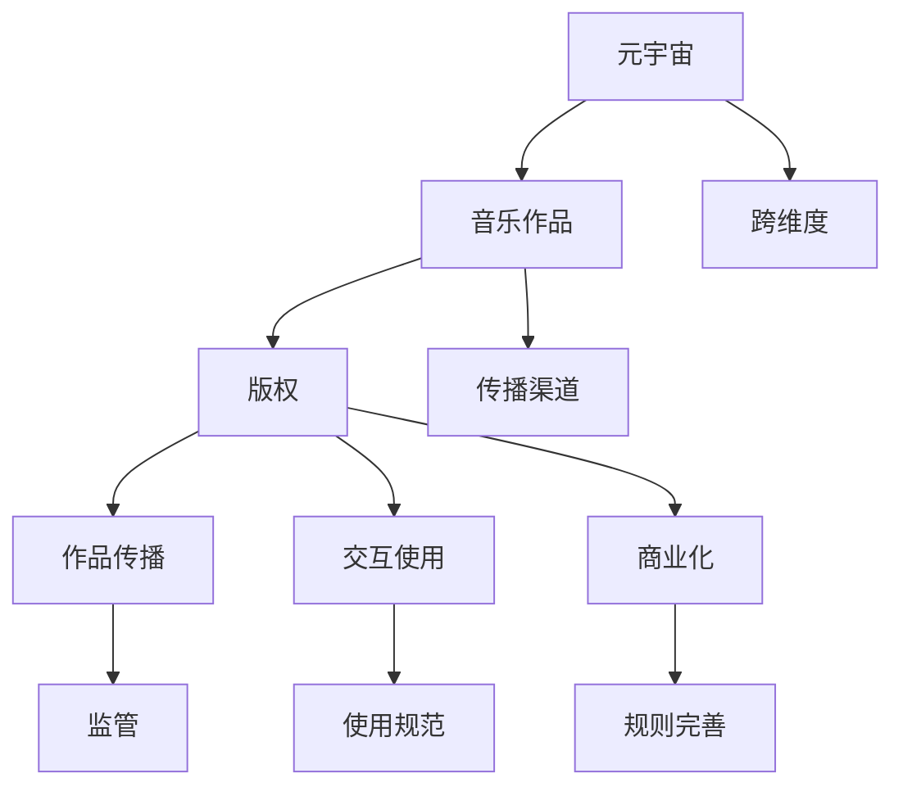

                 

# 元宇宙音乐版权:跨维度音乐作品的知识产权保护

## 1. 背景介绍

### 1.1 问题由来
随着元宇宙的兴起，音乐版权问题愈发成为关注的焦点。元宇宙作为一个虚拟与现实交织的空间，涉及到复杂且多样的版权问题。传统音乐版权主要集中在个体创作和传播过程中的权利保护，而元宇宙音乐版权问题则更复杂，涉及虚拟世界中的作品创作、传播、交互、商业化等多方面的权利保护。

元宇宙音乐版权保护的需求和挑战主要来自以下几个方面：

1. **版权归属问题**：在元宇宙中，音乐作品可能由多个实体共同创作，如虚拟角色、人工智能算法、用户群体等，版权归属问题变得尤为复杂。
2. **作品传播问题**：元宇宙中的音乐作品可以通过多维度的渠道进行传播，包括社交媒体、虚拟演唱会、虚拟音乐节、虚拟数字藏品等，传播渠道多样化带来的版权问题更加复杂。
3. **交互使用问题**：用户可以在元宇宙中自由交互，音乐作品可能被用户用于创作、表演、娱乐等，交互使用的权利问题亟需解决。
4. **商业化问题**：元宇宙音乐作品的商业化开发和运营需要面对市场准入、交易规则、盈利模式等诸多问题。

### 1.2 问题核心关键点
元宇宙音乐版权保护的核心在于如何构建一个跨维度的版权保护体系，确保音乐作品在元宇宙中的创作、传播、交互、商业化等各个环节的权利得到充分保护。主要包括以下几个关键点：

- **版权归属明确化**：确定音乐作品的原始创作主体，明确版权归属，避免多重权利纠纷。
- **作品传播监管化**：对音乐作品的传播渠道进行严格监管，确保传播过程符合版权法规定。
- **交互使用规范性**：制定音乐作品在元宇宙中的交互使用规则，保护原创作者的利益。
- **商业化规则完善化**：建立完善的元宇宙音乐商业化规则，促进版权的合法交易和运营。

## 2. 核心概念与联系

### 2.1 核心概念概述

为更好地理解元宇宙音乐版权保护，本节将介绍几个核心概念：

- **元宇宙**：一个虚拟与现实交织的空间，包括虚拟现实(VR)、增强现实(AR)、混合现实(MR)等多种形式，用户可以在其中自由交互、创作、体验。
- **音乐作品**：包括曲谱、录制音频、数字化音乐等，是音乐创作者智慧的结晶。
- **版权**：指创作者对其作品所享有的各项权利，包括复制权、发行权、表演权、表演者权等。
- **跨维度**：元宇宙中的音乐作品可能跨越物理世界和虚拟世界，版权保护需要跨越这两个维度。
- **作品传播**：包括音乐作品在元宇宙中通过多种渠道进行的传播，如虚拟演唱会、数字藏品等。
- **交互使用**：用户可以在元宇宙中自由交互，音乐作品被用于创作、表演、娱乐等，带来新的使用模式。
- **商业化**：元宇宙音乐作品的商业化开发和运营，包括音乐版权交易、版权保护费收取等。

这些核心概念之间的逻辑关系可以通过以下Mermaid流程图来展示：



这个流程图展示了一系列核心概念及其之间的关系：

1. 元宇宙作为一个虚拟与现实交织的空间，承载了音乐作品的创作、传播、交互、商业化等活动。
2. 音乐作品是创作者智慧的结晶，版权保护是其核心诉求。
3. 版权保护需要确保音乐作品的创作、传播、交互、商业化等各个环节的权利得到充分保护。
4. 音乐作品的传播渠道多样化，需要严格监管。
5. 交互使用需要规范，保护原创作者的利益。
6. 商业化开发和运营需要建立完善的规则。
7. 元宇宙音乐版权保护需要跨越物理世界和虚拟世界。

## 3. 核心算法原理 & 具体操作步骤
### 3.1 算法原理概述

元宇宙音乐版权保护的核心算法原理是通过区块链技术、智能合约等手段，构建一个跨维度、去中心化的版权保护体系。其核心思想是：将音乐作品的版权信息记录在区块链上，确保版权信息的透明性和不可篡改性，同时通过智能合约自动化执行版权规则，确保音乐作品的权利得到充分保护。

形式化地，假设版权信息包括作品的创作者、版权类型、有效期、传播渠道、交互使用规则等。版权保护的目标是构建一个公开透明、去中心化的版权保护网络，确保这些信息在音乐作品创作、传播、交互、商业化等各个环节得以充分保护。

### 3.2 算法步骤详解

元宇宙音乐版权保护的主要操作步骤如下：

**Step 1: 版权信息记录**
- 将音乐作品的版权信息（如创作者、版权类型、有效期等）记录在区块链上。
- 版权信息一旦记录，即不可篡改，确保版权信息的透明性和可信度。

**Step 2: 智能合约部署**
- 在区块链上部署智能合约，定义版权信息的生命周期和交互规则。
- 智能合约自动执行版权规则，如版权转让、授权使用、收益分配等。

**Step 3: 版权验证与监管**
- 通过区块链和智能合约，实时验证版权信息的合法性和完整性。
- 监管机构可以通过区块链平台进行实时监管，确保版权信息的透明性和合法性。

**Step 4: 交互使用许可**
- 用户在使用元宇宙音乐作品时，需要获取版权所有者的许可。
- 智能合约根据许可规则，自动生成使用许可，确保使用过程的规范性和合法性。

**Step 5: 商业化开发与交易**
- 版权所有者可以基于智能合约自动进行音乐作品的商业化开发和交易。
- 交易过程透明，确保交易的合法性和公平性。

### 3.3 算法优缺点

元宇宙音乐版权保护的主要优点包括：

- **透明性和不可篡改性**：通过区块链记录版权信息，确保信息透明且不可篡改。
- **自动化执行**：智能合约自动化执行版权规则，减少人为干预，提高版权保护的效率和公正性。
- **跨维度保护**：通过区块链和智能合约，实现跨物理世界和虚拟世界的版权保护。

然而，该算法也存在一定的局限性：

- **技术门槛高**：区块链和智能合约技术需要较高的技术门槛，实施成本较高。
- **扩展性有限**：目前的技术能力限制了版权信息的记录和交互方式。
- **法律适用性**：现有的版权法尚未全面适用于区块链技术，法律适用性有待进一步明确。

### 3.4 算法应用领域

元宇宙音乐版权保护的主要应用领域包括：

- **音乐创作与传播**：确保音乐作品的版权信息记录和传播过程的合法性和透明性。
- **交互使用规范**：制定音乐作品在元宇宙中的交互使用规则，保护原创作者的利益。
- **商业化开发与交易**：通过区块链和智能合约，确保音乐作品的商业化开发和交易过程的合法性和公平性。

## 4. 数学模型和公式 & 详细讲解  
### 4.1 数学模型构建

本节将使用数学语言对元宇宙音乐版权保护的系统构建进行更加严格的刻画。

记版权信息为 $C=\{(\text{Creator}, \text{Type}, \text{Duration}, \text{Channel}, \text{Rule})\}$，其中 $\text{Creator}$ 为创作者，$\text{Type}$ 为版权类型，$\text{Duration}$ 为有效期，$\text{Channel}$ 为传播渠道，$\text{Rule}$ 为交互使用规则。

版权保护的目标是构建一个公开透明、去中心化的版权保护网络，确保这些信息在音乐作品创作、传播、交互、商业化等各个环节得以充分保护。

### 4.2 公式推导过程

以下我们以版权转让为例，推导智能合约自动执行的公式。

假设版权转让过程如下：创作者将版权转让给购买者，购买者支付相应的费用。版权转让过程可以表示为以下数学公式：

$$
T(C, P, F) = \begin{cases}
0 & \text{如果创作者同意转让} \\
-1 & \text{如果创作者不同意转让} \\
1 & \text{如果创作者转让给购买者} \\
\end{cases}
$$

其中 $P$ 为购买者，$F$ 为转让费用。

在智能合约中，版权转让过程可以表示为：

$$
T(C, P, F) = \begin{cases}
0 & \text{如果智能合约验证创作者同意转让} \\
-1 & \text{如果智能合约验证创作者不同意转让} \\
1 & \text{如果智能合约验证创作者将版权转让给购买者，并扣除相应费用} \\
\end{cases}
$$

具体实现上，可以使用智能合约编程语言（如Solidity）编写代码，实现版权转让过程的自动执行。

### 4.3 案例分析与讲解

以虚拟演唱会版权保护为例，分析版权保护的全过程：

1. **版权信息记录**：在区块链上记录虚拟演唱会的版权信息，包括创作者、版权类型、有效期、传播渠道等。
2. **智能合约部署**：部署智能合约，定义版权信息的生命周期和交互规则。例如，智能合约规定，创作者可以在版权有效期内对作品进行商业化开发和运营，并授权平台对作品进行传播。
3. **版权验证与监管**：平台通过区块链实时验证版权信息的合法性和完整性，确保作品传播过程符合版权法规定。
4. **交互使用许可**：观众在使用虚拟演唱会时，需要获取创作者和平台的许可，智能合约自动生成使用许可，确保使用过程的规范性和合法性。
5. **商业化开发与交易**：创作者和平台基于智能合约自动进行商业化开发和交易，确保交易的合法性和公平性。

## 5. 项目实践：代码实例和详细解释说明
### 5.1 开发环境搭建

在进行元宇宙音乐版权保护实践前，我们需要准备好开发环境。以下是使用Solidity进行区块链开发的环境配置流程：

1. 安装Geth：从官网下载并安装Geth，用于搭建区块链开发环境。
2. 创建并激活账户：使用Geth创建多个账户，用于测试和部署智能合约。
3. 编写智能合约代码：使用Solidity编写版权保护智能合约，并在Geth环境中进行测试。

### 5.2 源代码详细实现

以下是以虚拟演唱会版权保护为例，编写的版权保护智能合约代码：

```solidity
// SPDX-License-Identifier: MIT
pragma solidity ^0.8.0;

contract VirtualConcert {

    struct CopyrightInfo {
        address creator;
        uint256 duration;
        bool isTransferred;
        bool isLicenced;
    }

    mapping(uint256 => CopyrightInfo) public copyrights;

    constructor() public {
        // 记录版权信息
        copyrights[1] = CopyrightInfo(
            0x1234567890, // 创作者地址
            31536000, // 版权有效期
            false, // 版权未转让
            false // 版权未授权
        );
    }

    // 记录版权信息
    function recordCopyright(uint256 id, address creator, uint256 duration) public {
        copyrights[id] = CopyrightInfo(creator, duration, false, false);
    }

    // 验证版权信息
    function verifyCopyright(uint256 id) public view returns (bool) {
        return copyrights[id].isTransferred && copyrights[id].isLicenced;
    }

    // 转让版权
    function transferCopyright(uint256 id, address receiver) public {
        if (msg.sender != copyrights[id].creator) {
            return false;
        }
        copyrights[id].creator = receiver;
        copyrights[id].isTransferred = true;
        return true;
    }

    // 授权使用
    function licenseUsage(uint256 id, address platform) public {
        if (msg.sender != copyrights[id].creator) {
            return false;
        }
        copyrights[id].isLicenced = true;
        return true;
    }

    // 收取费用
    function chargeFee(uint256 id, uint256 fee) public payable {
        if (msg.sender != copyrights[id].creator) {
            return false;
        }
        copyrights[id].creator.send(fee);
        return true;
    }

    // 获取版权信息
    function getCopyright(uint256 id) public view returns (address creator, uint256 duration, bool isTransferred, bool isLicenced) {
        return copyrights[id];
    }
}
```

### 5.3 代码解读与分析

让我们再详细解读一下关键代码的实现细节：

**CopyrightInfo结构体**：
- 定义了版权信息的组成部分，包括创作者、有效期、版权转让状态、版权授权状态。

**mapping类型**：
- 使用mapping类型记录版权信息，键为版权ID，值为版权信息。

**构造函数**：
- 初始化版权信息，记录创作者、有效期、版权转让状态、版权授权状态。

**recordCopyright函数**：
- 记录版权信息，更新版权信息。

**verifyCopyright函数**：
- 验证版权信息，判断版权是否转让和授权。

**transferCopyright函数**：
- 转让版权，更新创作者和版权转让状态。

**licenseUsage函数**：
- 授权使用，更新版权授权状态。

**chargeFee函数**：
- 收取费用，更新创作者余额。

**getCopyright函数**：
- 获取版权信息，返回创作者、有效期、版权转让状态、版权授权状态。

**使用Solidity编写智能合约**：
- 使用Solidity语言编写代码，使用Geth编译和部署到区块链上。

## 6. 实际应用场景
### 6.1 音乐创作与传播

元宇宙音乐版权保护在音乐创作与传播中的应用主要体现在以下几个方面：

1. **版权记录**：创作者可以在元宇宙平台上记录和声明自己的版权信息，确保版权信息的透明性和可信度。
2. **版权转让**：创作者可以通过智能合约进行版权转让，确保版权交易过程的合法性和透明性。
3. **版权授权**：创作者可以授权平台对作品进行传播和商业化运营，确保传播过程的合法性。

### 6.2 交互使用规范

在元宇宙中，用户可以自由交互，音乐作品可能被用户用于创作、表演、娱乐等，交互使用的权利问题亟需解决。元宇宙音乐版权保护可以通过以下方式实现：

1. **使用许可管理**：平台可以通过智能合约自动生成使用许可，确保用户使用过程的规范性和合法性。
2. **版权声明与提示**：平台可以在元宇宙中对音乐作品进行版权声明，提醒用户尊重版权，避免侵权行为。

### 6.3 商业化开发与交易

元宇宙音乐作品的商业化开发和交易需要面对市场准入、交易规则、盈利模式等诸多问题。元宇宙音乐版权保护可以通过以下方式实现：

1. **智能合约自动执行**：基于智能合约，自动进行版权转让、授权使用、收益分配等操作，确保交易过程的透明性和合法性。
2. **版权收益分配**：创作者可以基于智能合约自动进行版权收益的分配和管理，确保收益的合理性和公正性。

### 6.4 未来应用展望

随着区块链技术和智能合约的不断演进，元宇宙音乐版权保护将呈现以下几个发展趋势：

1. **版权信息多样性**：版权信息将不仅仅包括创作者、有效期等基本信息，还将涉及更多维度，如作品使用方式、版本控制等。
2. **跨平台版权保护**：版权保护将跨越不同的平台和系统，实现跨平台版权信息的统一管理和保护。
3. **智能合约自动化**：智能合约将实现更多功能的自动化执行，提高版权保护的效率和公正性。
4. **去中心化版权治理**：通过区块链和智能合约，实现去中心化的版权治理，确保版权保护过程的透明性和可信度。

## 7. 工具和资源推荐
### 7.1 学习资源推荐

为了帮助开发者系统掌握元宇宙音乐版权保护的理论基础和实践技巧，这里推荐一些优质的学习资源：

1. **Blockchain Basics**：《区块链基础》系列博文，由大模型技术专家撰写，深入浅出地介绍了区块链的基本概念和应用场景。

2. **Solidity官方文档**：Solidity语言的官方文档，提供了丰富的智能合约开发教程和示例代码，是学习Solidity开发的重要资源。

3. **Ethereum Developer Portal**：以太坊开发者门户，提供全面的区块链开发资源，包括智能合约编写、测试、部署等。

4. **OpenZeppelin**：智能合约安全性和优化工具，提供多种智能合约模板和最佳实践，帮助开发者提高智能合约的安全性和性能。

5. **Consensys Academy**：以太坊联盟旗下的教育平台，提供丰富的区块链和智能合约课程，覆盖从基础到高级的多种内容。

通过对这些资源的学习实践，相信你一定能够快速掌握元宇宙音乐版权保护的精髓，并用于解决实际的版权保护问题。

### 7.2 开发工具推荐

高效的开发离不开优秀的工具支持。以下是几款用于元宇宙音乐版权保护开发的常用工具：

1. Geth：基于以太坊的区块链开发工具，提供了完整的区块链开发环境，方便开发者进行智能合约开发和测试。

2. Remix：流行的智能合约开发平台，支持Solidity语言，提供可视化编辑器、测试网络等工具，适合初学者和高级开发者使用。

3. Truffle：基于以太坊的开源区块链开发框架，提供全面的开发工具链，包括项目管理和智能合约部署等功能。

4. Web3.js：JavaScript库，用于与以太坊智能合约进行交互，提供丰富的API和工具，方便开发者进行区块链应用开发。

5. MetaMask：以太坊钱包和浏览器扩展，支持智能合约交互、资产管理等功能，方便用户使用元宇宙音乐版权保护平台。

合理利用这些工具，可以显著提升元宇宙音乐版权保护开发的效率和质量，加快创新迭代的步伐。

### 7.3 相关论文推荐

元宇宙音乐版权保护的研究源于学界的持续研究。以下是几篇奠基性的相关论文，推荐阅读：

1. **Copyright and Peer-to-Peer Sharing in a Virtual Music Marketplace**：研究版权在元宇宙音乐市场中的保护和分配问题。

2. **Blockchain for Digital Music Rights Management**：探讨区块链技术在数字音乐版权管理中的应用。

3. **Ethereum-Based Platform for Digital Rights Management of Music Rights**：构建基于以太坊的数字版权管理平台，用于音乐版权的记录、转让和授权。

4. **Intellectual Property Rights in Virtual Reality Environments**：研究虚拟现实环境中的知识产权保护问题。

5. **Copyright for Works Created in Virtual Reality**：探讨虚拟现实环境中的版权问题，提出相应的版权保护策略。

这些论文代表了大语言模型微调技术的发展脉络。通过学习这些前沿成果，可以帮助研究者把握学科前进方向，激发更多的创新灵感。

## 8. 总结：未来发展趋势与挑战
### 8.1 总结

本文对元宇宙音乐版权保护进行了全面系统的介绍。首先阐述了元宇宙音乐版权问题的背景和核心关键点，明确了版权保护在元宇宙中的重要性和挑战。其次，从原理到实践，详细讲解了元宇宙音乐版权保护的系统构建，给出了完整的代码实例。同时，本文还广泛探讨了版权保护在元宇宙音乐创作、传播、交互、商业化等各个环节的应用前景，展示了版权保护范式的巨大潜力。

通过本文的系统梳理，可以看到，元宇宙音乐版权保护是一个复杂且多维度的系统工程，涉及技术、法律、商业等多个方面。只有从多个维度综合考虑，才能确保版权信息的透明性和合法性，确保音乐作品在元宇宙中的全面保护。

### 8.2 未来发展趋势

展望未来，元宇宙音乐版权保护将呈现以下几个发展趋势：

1. **技术不断演进**：区块链和智能合约技术将不断演进，版权信息的记录和交互方式将更加多样化和高效化。
2. **法律逐步明确**：现有的版权法将逐步适应区块链技术，版权保护的法律体系将更加完善。
3. **应用场景多样化**：版权保护将涵盖更多的应用场景，如虚拟演唱会、数字音乐节、虚拟数字藏品等。
4. **去中心化治理**：通过区块链和智能合约，实现去中心化的版权治理，确保版权保护过程的透明性和可信度。
5. **跨平台保护**：版权保护将跨越不同的平台和系统，实现跨平台版权信息的统一管理和保护。

这些趋势凸显了元宇宙音乐版权保护技术的广阔前景。这些方向的探索发展，必将进一步提升版权保护的效率和公正性，为元宇宙音乐作品的创作和传播提供有力保障。

### 8.3 面临的挑战

尽管元宇宙音乐版权保护技术已经取得了一定的进展，但在迈向更加智能化、普适化应用的过程中，它仍面临诸多挑战：

1. **技术门槛高**：区块链和智能合约技术需要较高的技术门槛，实施成本较高。
2. **扩展性有限**：当前的技术能力限制了版权信息的记录和交互方式。
3. **法律适用性**：现有的版权法尚未全面适用于区块链技术，法律适用性有待进一步明确。
4. **平台协同**：元宇宙音乐版权保护需要平台之间的协同合作，确保版权保护的一致性和公平性。
5. **用户认知**：元宇宙用户对版权保护的认知程度不一，需要加强版权意识的教育和引导。

这些挑战需要通过技术创新、法律完善、平台合作等方式逐步解决，才能真正实现元宇宙音乐版权保护的全面覆盖和有效保护。

### 8.4 研究展望

面向未来，元宇宙音乐版权保护研究需要在以下几个方面寻求新的突破：

1. **跨平台版权保护**：建立统一的版权保护标准，实现跨平台版权信息的统一管理和保护。
2. **用户权益保障**：加强版权保护的同时，保障元宇宙用户的合法权益，确保音乐作品在元宇宙中的公平使用。
3. **智能合约优化**：优化智能合约的设计和执行，提高版权保护的安全性和效率。
4. **社区治理机制**：建立社区治理机制，鼓励用户参与版权保护和监督，共同维护元宇宙版权秩序。
5. **技术演进与创新**：持续关注区块链和智能合约技术的演进，推动版权保护技术的前沿创新。

这些研究方向将进一步推动元宇宙音乐版权保护的成熟和完善，为元宇宙音乐作品的创作和传播提供更加全面的保护。

## 9. 附录：常见问题与解答

**Q1：元宇宙音乐版权保护的技术实现难点是什么？**

A: 元宇宙音乐版权保护的技术实现难点主要在于以下几点：
1. **技术门槛高**：区块链和智能合约技术需要较高的技术门槛，实施成本较高。
2. **扩展性有限**：当前的技术能力限制了版权信息的记录和交互方式。
3. **法律适用性**：现有的版权法尚未全面适用于区块链技术，法律适用性有待进一步明确。

**Q2：如何进行元宇宙音乐版权的跨平台保护？**

A: 进行元宇宙音乐版权的跨平台保护，主要需要以下几个步骤：
1. **统一版权标准**：建立统一的版权标准，确保不同平台之间的版权信息一致。
2. **跨平台接口**：实现跨平台的版权保护接口，确保版权信息的统一管理和保护。
3. **跨平台验证**：通过区块链和智能合约，实现跨平台的版权验证，确保版权信息的透明性和可信度。
4. **跨平台协同**：建立平台之间的协同机制，确保版权保护的公平性和一致性。

**Q3：如何提高元宇宙音乐版权保护的效率？**

A: 提高元宇宙音乐版权保护的效率，主要需要以下几个方面的改进：
1. **智能合约优化**：优化智能合约的设计和执行，提高版权保护的安全性和效率。
2. **分布式存储**：采用分布式存储技术，减少版权信息的存储和传输时间。
3. **多链交互**：利用多区块链技术，实现跨链版权信息的交互和验证。
4. **去中心化治理**：建立去中心化的版权治理机制，提高版权保护的效率和公正性。

**Q4：元宇宙音乐版权保护面临的法律挑战是什么？**

A: 元宇宙音乐版权保护面临的法律挑战主要在于以下几点：
1. **法律适用性**：现有的版权法尚未全面适用于区块链技术，法律适用性有待进一步明确。
2. **平台协同**：元宇宙音乐版权保护需要平台之间的协同合作，确保版权保护的一致性和公平性。
3. **用户认知**：元宇宙用户对版权保护的认知程度不一，需要加强版权意识的教育和引导。

**Q5：如何进行元宇宙音乐作品的跨维度版权保护？**

A: 进行元宇宙音乐作品的跨维度版权保护，主要需要以下几个步骤：
1. **跨维度版权记录**：在物理世界和虚拟世界中，记录版权信息，确保版权信息的透明性和可信度。
2. **跨维度智能合约**：部署跨维度的智能合约，确保版权信息的统一管理和保护。
3. **跨维度验证**：通过区块链和智能合约，实现跨维度的版权验证，确保版权信息的透明性和可信度。
4. **跨维度治理**：建立跨维度的版权治理机制，确保版权保护的公平性和一致性。

这些问题的解答展示了元宇宙音乐版权保护的复杂性和多维度特性，需要在技术、法律、商业等多个方面进行全面考虑和协同创新。

---

作者：禅与计算机程序设计艺术 / Zen and the Art of Computer Programming

