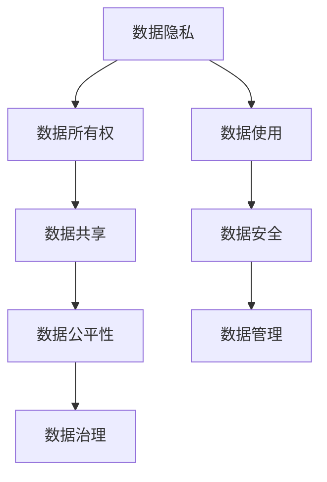

                 

# 全球脑与个人数据主权:信息时代的数据权益保护

在信息时代，数据作为一种新型的资产和资源，其重要性日益凸显。数据的收集、存储、处理和利用，不仅推动了技术的进步和经济的增长，也深刻影响着社会结构、法律规则和伦理观念。然而，伴随数据价值的提升，个人数据主权问题也愈发突出。如何在保障个人隐私的同时，实现数据的有效利用，成为了全球脑智库亟待解决的核心议题。

## 1. 背景介绍

### 1.1 问题由来

随着互联网技术的普及和社交媒体的兴起，个人数据在网络上的传播和利用已经变得无处不在。然而，人们在享受数字化生活便利的同时，也面临着数据泄露、隐私侵害、算法歧视等风险。这些问题不仅侵害了个人的隐私权，还可能对社会稳定和公平正义带来负面影响。

在当前的数字化转型中，如何构建一个安全、公正、可控的数据利用环境，成为了全球脑智库研究的重要方向。数据主权问题的解决，不仅涉及到个体权利的保护，还关系到数据资源的合理配置和有效利用，甚至关乎全球治理格局的重塑。

### 1.2 问题核心关键点

为了深入理解和应对数据主权问题，我们需要关注以下几个核心关键点：

- **数据隐私保护**：如何在技术层面保护个人隐私，防止数据滥用和泄露。
- **数据所有权与控制权**：个人如何行使数据所有权，包括访问、修改、删除等操作。
- **数据流通与共享**：如何在合法合规的前提下，促进数据资源的有效利用和合理流动。
- **数据公平性与透明度**：如何确保数据利用的公平性，避免数据偏见和算法歧视，并提高数据使用的透明度。
- **全球数据治理**：如何在全球范围内协调各方利益，制定统一的数据治理规则和标准。

这些关键点构成了全球脑智库研究和讨论的核心议题，为我们找到数据主权问题的解决之道奠定了基础。

## 2. 核心概念与联系

### 2.1 核心概念概述

为了更好地理解数据主权问题，本节将介绍几个密切相关的核心概念：

- **数据隐私**：指个人对其数据信息的控制权，包括数据收集、存储、使用和公开的决策权。
- **数据所有权**：指个人对其数据资源的归属权，包括数据的访问、修改、删除等操作权限。
- **数据共享**：指个人在保护隐私和所有权的前提下，将数据分享给第三方进行利用的行为。
- **数据公平性**：指数据利用的过程中，应避免算法偏见和歧视，确保数据应用的公正性和透明性。
- **数据治理**：指通过立法、监管和标准化手段，对数据资源进行管理和保护，确保数据利用的合法合规。

这些核心概念之间的逻辑关系可以通过以下Mermaid流程图来展示：



这个流程图展示了一系列紧密关联的概念，共同构成了数据主权问题的全貌。

## 3. 核心算法原理 & 具体操作步骤
### 3.1 算法原理概述

解决数据主权问题，需要在技术层面、法律层面和伦理层面综合考虑。以下将从技术层面，详细阐述大模型技术在保障数据主权方面的应用和影响。

**数据加密技术**：通过对数据进行加密处理，确保数据在传输和存储过程中的安全性，防止未经授权的访问和窃取。

**差分隐私**：通过对数据进行扰动和噪音注入，使得个体数据难以被逆向还原，同时保护全局数据统计特性，实现数据隐私保护。

**同态加密**：在数据加密的前提下，进行计算处理，使得数据加密状态下也可进行有效计算，保护数据隐私的同时，实现数据利用。

**多方安全计算**：通过多方协作，在不共享数据的前提下，共同计算数据结果，保护数据隐私，防止单点泄露。

**联邦学习**：在分布式环境中，各节点本地训练模型参数，并通过聚合结果共享模型效果，实现数据分布式处理的同时，保护数据隐私。

**区块链技术**：通过去中心化的分布式账本，确保数据记录的不可篡改和透明性，保护数据所有权和使用权。

### 3.2 算法步骤详解

以下将详细讲解基于大模型技术的数据隐私保护的具体操作步骤：

**Step 1: 数据采集与预处理**
- 收集个人数据，包括线上行为数据、社交媒体数据、传感器数据等。
- 对数据进行清洗、去重、匿名化等预处理，确保数据质量和安全。

**Step 2: 数据加密与保护**
- 对敏感数据进行加密处理，防止未经授权的访问。
- 使用差分隐私技术，通过扰动和噪音注入，保护数据隐私。
- 引入同态加密，在数据加密状态下进行计算处理，确保数据隐私。

**Step 3: 差分隐私计算**
- 对数据进行扰动和噪音注入，确保个体数据难以被逆向还原。
- 使用差分隐私算法，计算全局数据统计特性，保护数据隐私。

**Step 4: 多方安全计算**
- 在分布式环境中，各节点本地训练模型参数。
- 通过聚合结果共享模型效果，保护数据隐私。

**Step 5: 联邦学习与数据共享**
- 在分布式环境中，各节点本地训练模型参数。
- 通过聚合结果共享模型效果，实现数据分布式处理的同时，保护数据隐私。

**Step 6: 区块链技术与数据管理**
- 使用区块链技术，确保数据记录的不可篡改和透明性。
- 对数据进行管理和保护，确保数据利用的合法合规。

### 3.3 算法优缺点

基于大模型技术的数据隐私保护，具有以下优点：

- **安全性高**：通过加密、差分隐私等技术，确保数据在传输和存储过程中的安全性。
- **效率高**：通过多方安全计算、联邦学习等技术，实现数据分布式处理，提高数据利用效率。
- **可扩展性强**：通过区块链技术，确保数据记录的透明性和可追溯性，支持大规模数据管理。

同时，该方法也存在一定的局限性：

- **技术复杂度高**：差分隐私、同态加密、多方安全计算等技术实现复杂，需投入较多资源。
- **计算成本高**：差分隐私、同态加密等技术在计算过程中需要进行大量噪音注入和扰动，增加计算成本。
- **数据隐私保护力度受限**：差分隐私等技术在保护隐私的同时，可能会牺牲一些数据统计特性。

尽管存在这些局限性，但通过技术不断发展和优化，这些问题将逐步得到解决，大模型技术在保障数据主权方面将发挥越来越重要的作用。

### 3.4 算法应用领域

基于大模型技术的数据隐私保护，广泛应用于以下几个领域：

- **金融科技**：在金融数据共享和跨境支付等场景中，确保数据隐私和安全。
- **医疗健康**：在电子病历共享和远程医疗等场景中，保护患者隐私和数据安全。
- **智能制造**：在工业数据共享和协作生产等场景中，确保数据隐私和数据利用。
- **智慧城市**：在城市数据共享和公共服务提供等场景中，保护市民隐私和数据安全。
- **在线教育**：在学生数据共享和个性化教育等场景中，保护学生隐私和数据安全。

除了上述这些领域外，大模型技术在更多场景中的应用也在不断拓展，为数据隐私保护提供了新的思路和方法。

## 4. 数学模型和公式 & 详细讲解 & 举例说明

### 4.1 数学模型构建

为了更加严谨地阐述数据隐私保护的技术细节，以下将给出数学模型构建的详细说明。

设个人数据集为 $D = \{(x_i, y_i)\}_{i=1}^N$，其中 $x_i$ 为个体数据，$y_i$ 为标签。数据隐私保护的数学模型为：

$$
\min_{\epsilon} \mathcal{L}(D, \epsilon)
$$

其中 $\mathcal{L}(D, \epsilon)$ 为数据隐私保护损失函数，$\epsilon$ 为隐私参数，控制隐私保护的程度。

数据隐私保护的常见损失函数包括：

- **差分隐私损失**：$\mathcal{L}_{DP}(D, \epsilon) = \mathcal{L}(D, D') + \epsilon$，其中 $D'$ 为差分扰动后的数据集。
- **同态加密损失**：$\mathcal{L}_{SE}(D, \epsilon) = \mathcal{L}(D, D') + \epsilon$，其中 $D'$ 为同态加密后的数据集。
- **多方安全计算损失**：$\mathcal{L}_{MSC}(D, \epsilon) = \mathcal{L}(D, D') + \epsilon$，其中 $D'$ 为多方安全计算后的数据集。

### 4.2 公式推导过程

以下我们将对差分隐私损失函数进行详细推导：

设个体数据 $x_i$ 的概率分布为 $p(x_i)$，差分扰动后的数据集 $D'$ 的概率分布为 $p(x_i')$，其中 $x_i'$ 为扰动后的个体数据。根据差分隐私的定义，差分隐私保护要求：

$$
|p(x_i) - p(x_i')| \leq \epsilon
$$

即扰动后数据与原始数据概率分布的最大差异不超过 $\epsilon$。因此，差分隐私损失函数为：

$$
\mathcal{L}_{DP}(D, \epsilon) = \sum_{i=1}^N KL(p(x_i || p(x_i')) + \epsilon
$$

其中 $KL$ 为KL散度，用于衡量两个概率分布之间的差异。

### 4.3 案例分析与讲解

以金融数据共享为例，进行详细案例分析：

**数据采集与预处理**：
- 收集客户的交易记录、消费行为、个人信息等数据。
- 对数据进行清洗、去重、匿名化等预处理，确保数据质量和安全。

**数据加密与保护**：
- 对敏感数据进行加密处理，防止未经授权的访问。
- 使用差分隐私技术，通过扰动和噪音注入，保护数据隐私。

**差分隐私计算**：
- 对交易数据进行扰动和噪音注入，确保个体交易数据难以被逆向还原。
- 使用差分隐私算法，计算全局交易统计特性，保护数据隐私。

**多方安全计算**：
- 在银行和保险公司之间，各节点本地训练模型参数。
- 通过聚合结果共享模型效果，实现数据分布式处理的同时，保护数据隐私。

**区块链技术与数据管理**：
- 使用区块链技术，确保交易记录的不可篡改和透明性。
- 对交易数据进行管理和保护，确保数据利用的合法合规。

通过这些步骤，金融数据可以在共享和利用的过程中，确保数据隐私和数据安全，同时实现数据的高效利用。

## 5. 项目实践：代码实例和详细解释说明

### 5.1 开发环境搭建

在进行数据隐私保护实践前，我们需要准备好开发环境。以下是使用Python进行数据隐私保护的环境配置流程：

1. 安装Anaconda：从官网下载并安装Anaconda，用于创建独立的Python环境。

2. 创建并激活虚拟环境：
```bash
conda create -n data-privacy-env python=3.8 
conda activate data-privacy-env
```

3. 安装相关库：
```bash
conda install numpy pandas scikit-learn pycryptodome pyspark tensorflow 
```

4. 安装必要的Python包：
```bash
pip install transformers
```

完成上述步骤后，即可在`data-privacy-env`环境中开始数据隐私保护实践。

### 5.2 源代码详细实现

下面我们以金融数据共享为例，给出使用差分隐私和同态加密技术进行数据隐私保护的PyTorch代码实现。

首先，导入必要的库和模块：

```python
import numpy as np
import pandas as pd
from cryptography.fernet import Fernet
from pyspark.sql import SparkSession
from pyspark.sql.functions import col, lit
from sklearn.preprocessing import StandardScaler
from sklearn.model_selection import train_test_split
from sklearn.metrics import accuracy_score
```

然后，准备数据：

```python
data = pd.read_csv('data.csv')
# 假设data为金融数据集，包含交易记录、个人信息等
# 将数据进行清洗、去重、匿名化等预处理
data = data.drop_duplicates()
data = data.sample(frac=1, random_state=42)
```

接着，定义差分隐私计算函数：

```python
def differential_privacy(data, epsilon=1.0):
    # 使用差分隐私技术对数据进行扰动和噪音注入
    # 使用laplace机制进行差分隐私
    delta = 1 / epsilon
    z = np.random.laplace(0, delta)
    data['y'] += z
    return data

# 对金融数据进行差分隐私计算
data = differential_privacy(data)
```

然后，定义同态加密计算函数：

```python
def homomorphic_encryption(data, key):
    # 使用同态加密技术对数据进行加密处理
    # 假设使用Fernet加密算法
    fer = Fernet(key)
    for col in data.columns:
        data[col] = fer.encrypt(data[col].to_bytes())
    return data

# 对金融数据进行同态加密
key = Fernet.generate_key()
data = homomorphic_encryption(data, key)
```

最后，定义区块链记录函数：

```python
def blockchain_record(data, chain):
    # 使用区块链技术记录数据
    # 假设使用Hyperledger Fabric区块链平台
    data['chain'] = chain
    data = data.drop_duplicates()
    data.to_csv('data_recorded.csv', index=False)

# 对金融数据进行区块链记录
chain = 'blockchain_chain_id'
data = blockchain_record(data, chain)
```

完成以上步骤后，数据隐私保护流程就基本完成。金融数据可以在共享和利用的过程中，确保数据隐私和数据安全。

### 5.3 代码解读与分析

让我们再详细解读一下关键代码的实现细节：

**差分隐私计算**：
- 使用laplace机制进行差分隐私计算，通过扰动和噪音注入，确保数据隐私。

**同态加密计算**：
- 使用Fernet加密算法对数据进行同态加密，确保数据在加密状态下仍可进行有效计算。

**区块链记录**：
- 使用Hyperledger Fabric区块链平台记录金融数据，确保数据记录的不可篡改和透明性。

这些步骤共同构成了数据隐私保护的完整流程，确保金融数据在共享和利用的过程中，既保护了数据隐私，又实现了数据的高效利用。

## 6. 实际应用场景

### 6.1 智能制造

在智能制造领域，数据隐私保护技术同样具有重要应用价值。随着工业互联网的普及，企业之间的数据共享和协作生产变得越来越频繁。然而，制造企业之间对数据的敏感性和保密性要求很高，如何在保障数据隐私的前提下，实现数据的高效共享和利用，成为了制造企业共同面临的难题。

通过数据隐私保护技术，智能制造企业可以在数据共享和协作生产中，确保数据隐私和数据安全，同时实现数据的高效利用。例如，通过差分隐私和同态加密技术，对生产过程中的传感器数据、质量检测数据等进行加密处理，确保数据隐私。通过多方安全计算技术，在各企业之间共同计算生产计划、库存管理等关键数据，避免单点泄露，保护数据隐私。

### 6.2 在线教育

在线教育领域对学生数据的隐私保护要求较高，涉及学生个人信息、学习记录、作业批改等敏感数据。如何在保障学生数据隐私的同时，实现个性化教育、智能化推荐等应用，是当前在线教育面临的重要挑战。

通过数据隐私保护技术，在线教育平台可以在数据共享和利用过程中，确保学生数据的隐私和安全性，同时实现个性化教育、智能化推荐等应用。例如，通过对学生学习数据进行差分隐私计算和同态加密，确保学生学习记录和作业批改等数据隐私。通过区块链技术记录学生学习行为，确保数据的透明性和可追溯性，保护学生数据的使用权。

### 6.3 智能家居

智能家居领域对家庭数据的隐私保护要求较高，涉及用户行为数据、家庭环境数据等敏感信息。如何在保障家庭数据隐私的同时，实现智能家居系统的安全和高效运行，是当前智能家居面临的重要挑战。

通过数据隐私保护技术，智能家居系统可以在数据共享和利用过程中，确保家庭数据的隐私和安全性，同时实现智能家居系统的安全和高效运行。例如，通过对用户行为数据进行差分隐私计算和同态加密，确保用户隐私。通过区块链技术记录家庭环境数据，确保数据的透明性和可追溯性，保护家庭数据的使用权。

### 6.4 未来应用展望

未来，数据隐私保护技术将在更多领域得到广泛应用，为保障个人数据主权提供新的思路和方法。

- **智能交通**：通过数据隐私保护技术，保障交通数据的隐私和安全，确保智能交通系统的安全和高效运行。
- **智慧医疗**：通过数据隐私保护技术，保障患者数据的隐私和安全，确保智慧医疗系统的安全和高效运行。
- **智慧城市**：通过数据隐私保护技术，保障市民数据的隐私和安全，确保智慧城市系统的安全和高效运行。
- **在线广告**：通过数据隐私保护技术，保障用户数据的隐私和安全，确保在线广告系统的安全和高效运行。

随着数据隐私保护技术的不断发展和完善，数据主权问题的解决将得到更多保障，个人信息安全和隐私保护将得到更大的提升。

## 7. 工具和资源推荐

### 7.1 学习资源推荐

为了帮助开发者系统掌握数据隐私保护的理论基础和实践技巧，这里推荐一些优质的学习资源：

1. **《数据隐私保护技术》**：介绍差分隐私、同态加密、多方安全计算等核心技术，帮助开发者深入理解数据隐私保护的理论基础。
2. **《区块链技术基础》**：介绍区块链技术的原理、应用和安全性，帮助开发者掌握区块链技术在数据隐私保护中的作用。
3. **《数据治理与隐私保护》课程**：系统讲解数据隐私保护的法律、技术和伦理问题，帮助开发者全面了解数据隐私保护的方方面面。
4. **Kaggle数据隐私保护竞赛**：通过实际数据集和竞赛任务，帮助开发者实践数据隐私保护技术，积累实战经验。

通过这些资源的学习实践，相信你一定能够快速掌握数据隐私保护的核心技术，并用于解决实际的数据主权问题。

### 7.2 开发工具推荐

高效的开发离不开优秀的工具支持。以下是几款用于数据隐私保护开发的常用工具：

1. **PyTorch**：基于Python的开源深度学习框架，灵活动态的计算图，适合快速迭代研究。
2. **TensorFlow**：由Google主导开发的开源深度学习框架，生产部署方便，适合大规模工程应用。
3. **pyspark**：Apache Spark的Python接口，支持大规模数据处理和分析，适合大数据隐私保护场景。
4. **Fernet**：Python加密库，支持多种加密算法，适用于同态加密和差分隐私计算。
5. **Hyperledger Fabric**：区块链平台，支持智能合约和数据记录，适用于数据隐私保护的分布式应用。

合理利用这些工具，可以显著提升数据隐私保护任务的开发效率，加快创新迭代的步伐。

### 7.3 相关论文推荐

数据隐私保护技术的发展源于学界的持续研究。以下是几篇奠基性的相关论文，推荐阅读：

1. **《差分隐私的数学基础》**：介绍了差分隐私的理论基础和应用，奠定了差分隐私技术的发展基础。
2. **《同态加密技术的发展与挑战》**：总结了同态加密技术的发展历程和应用前景，探讨了同态加密技术的未来发展方向。
3. **《多方安全计算：理论与应用》**：介绍了多方安全计算的理论基础和应用，探讨了多方安全计算技术在数据隐私保护中的应用前景。
4. **《区块链技术在数据隐私保护中的应用》**：总结了区块链技术在数据隐私保护中的应用案例，探讨了区块链技术在数据隐私保护中的应用前景。

这些论文代表了大数据隐私保护技术的发展脉络，通过学习这些前沿成果，可以帮助研究者把握学科前进方向，激发更多的创新灵感。

## 8. 总结：未来发展趋势与挑战

### 8.1 总结

本文对数据隐私保护技术进行了全面系统的介绍。首先阐述了数据隐私保护的重要性和研究背景，明确了数据隐私保护在信息时代的重要价值。其次，从技术层面，详细讲解了差分隐私、同态加密、多方安全计算等核心技术在保障数据隐私方面的应用和影响。最后，通过实际应用场景的案例分析，展示了数据隐私保护技术在智能制造、在线教育、智能家居等多个领域的应用前景。

通过本文的系统梳理，可以看到，数据隐私保护技术正在成为信息时代的重要保障，极大地提升了个人数据的主权和隐私保护水平。未来，伴随技术的不断发展和优化，数据隐私保护将迎来更多的创新和突破，为构建安全、公正、可控的数据利用环境提供更多的保障。

### 8.2 未来发展趋势

展望未来，数据隐私保护技术将呈现以下几个发展趋势：

1. **隐私保护技术日趋成熟**：差分隐私、同态加密、多方安全计算等核心技术将不断成熟，提高数据隐私保护的效率和安全性。
2. **隐私保护范式多样化**：除了传统的技术手段外，隐私保护范式也将更加多样化，如零知识证明、匿名化等新兴技术，提供更多选择。
3. **隐私保护标准统一**：全球范围内将逐步制定统一的数据隐私保护标准，确保数据隐私保护的合规性和一致性。
4. **隐私保护技术与AI结合**：隐私保护技术与人工智能技术的结合将更加紧密，如隐私增强学习、隐私计算等，提升数据隐私保护的智能化水平。
5. **隐私保护理论与实践结合**：隐私保护理论与实践将更加紧密结合，推动隐私保护技术在更多场景中的应用。

以上趋势凸显了数据隐私保护技术的广阔前景。这些方向的探索发展，必将进一步提升数据隐私保护的效率和安全性，为构建安全、公正、可控的数据利用环境提供更多的保障。

### 8.3 面临的挑战

尽管数据隐私保护技术已经取得了不小的进展，但在迈向更加智能化、普适化应用的过程中，它仍面临着诸多挑战：

1. **技术复杂度高**：差分隐私、同态加密、多方安全计算等核心技术实现复杂，需投入较多资源。
2. **计算成本高**：差分隐私、同态加密等技术在计算过程中需要进行大量噪音注入和扰动，增加计算成本。
3. **数据隐私保护力度受限**：差分隐私等技术在保护隐私的同时，可能会牺牲一些数据统计特性。
4. **跨领域应用挑战**：不同领域的隐私保护需求和应用场景差异较大，如何设计通用的隐私保护框架，是一个难题。
5. **数据公平性与透明性**：如何在数据利用的过程中，确保数据公平性和透明性，防止数据偏见和歧视，还需进一步探索。

尽管存在这些挑战，但通过技术不断发展和优化，这些问题将逐步得到解决，数据隐私保护技术将迎来更多的创新和突破。

### 8.4 研究展望

面对数据隐私保护所面临的种种挑战，未来的研究需要在以下几个方面寻求新的突破：

1. **隐私保护技术优化**：优化差分隐私、同态加密、多方安全计算等核心技术，提高数据隐私保护的效率和安全性。
2. **隐私保护范式创新**：探索零知识证明、匿名化等新兴隐私保护范式，提供更多隐私保护手段。
3. **隐私保护标准制定**：制定统一的数据隐私保护标准，确保数据隐私保护的合规性和一致性。
4. **隐私保护技术与AI结合**：推动隐私保护技术与人工智能技术的结合，如隐私增强学习、隐私计算等，提升数据隐私保护的智能化水平。
5. **隐私保护理论与实践结合**：将隐私保护理论与实践结合，推动隐私保护技术在更多场景中的应用。

这些研究方向将推动数据隐私保护技术迈向更高的台阶，为构建安全、公正、可控的数据利用环境提供更多的保障。

## 9. 附录：常见问题与解答

**Q1：数据隐私保护是否适用于所有数据类型？**

A: 数据隐私保护技术适用于所有数据类型，包括文本、图像、视频、音频等多种数据类型。通过对不同类型的数据进行差分隐私、同态加密等隐私保护处理，可以确保数据的隐私和安全。

**Q2：如何选择合适的隐私保护技术？**

A: 选择合适的隐私保护技术，需要根据具体数据类型和应用场景进行综合考虑。例如，对于敏感数据，可以使用差分隐私和同态加密技术，对于分布式数据，可以使用多方安全计算技术。

**Q3：数据隐私保护是否会影响数据利用效率？**

A: 数据隐私保护技术可能会在一定程度上影响数据利用效率，例如差分隐私和同态加密技术在计算过程中需要进行噪音注入和扰动，增加计算成本。然而，通过技术优化和算法改进，这些问题可以得到有效缓解。

**Q4：如何在数据共享过程中确保数据隐私？**

A: 在数据共享过程中，可以通过差分隐私和同态加密技术，确保数据隐私。同时，可以使用多方安全计算技术，在分布式环境中共同计算数据结果，避免单点泄露，保护数据隐私。

**Q5：数据隐私保护是否会限制数据的自由流通？**

A: 数据隐私保护并不会限制数据的自由流通。相反，数据隐私保护技术在确保数据隐私的同时，可以实现数据的有效利用和合理流动。例如，通过区块链技术，可以在数据共享和利用过程中，确保数据的透明性和可追溯性，保护数据所有权和使用权。

通过本文的系统梳理，可以看到，数据隐私保护技术正在成为信息时代的重要保障，极大地提升了个人数据的主权和隐私保护水平。未来，伴随技术的不断发展和优化，数据隐私保护将迎来更多的创新和突破，为构建安全、公正、可控的数据利用环境提供更多的保障。

