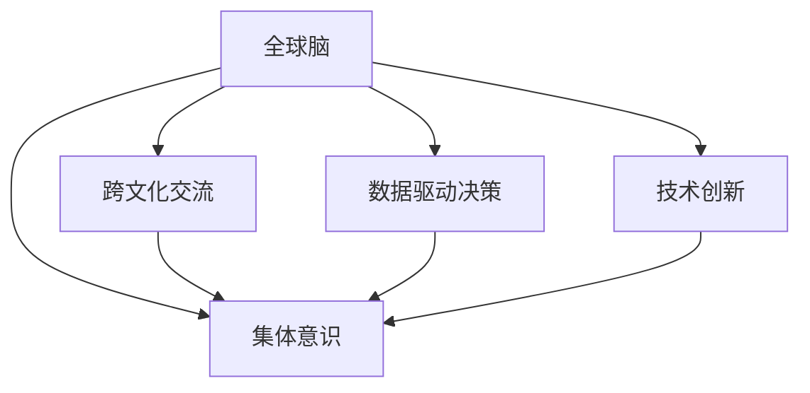

                 

# 全球脑与人类进化:集体意识推动的飞跃

## 1. 背景介绍

### 1.1 问题由来

在全球化的浪潮下，人类社会正面临前所未有的挑战与机遇。随着信息技术的发展，人类的生活、工作、学习等各个方面都正在发生深刻的变化。尽管在物理空间上我们仍旧是个体存在，但在信息空间中，我们已经成为了一个“全球脑”。这不仅仅是因为互联网连接了全球各地的人们，更在于我们的集体意识与行为模式正逐渐超越个体界限，推动着社会的飞跃发展。

### 1.2 问题核心关键点

“全球脑”的形成与进化并非偶然，而是一个复杂的过程。它的核心关键点包括：

- **信息流动与处理**：互联网和移动设备的普及使得信息流动的速度和规模呈指数级增长。
- **集体意识**：通过社交媒体、在线平台等途径，人们的观点、情绪和行为不断交互融合，形成了强大的集体意识。
- **数据驱动决策**：大数据和人工智能技术的应用，使得基于数据和计算的决策越来越普遍。
- **跨文化交流**：全球化使得不同文化背景的人们能够跨越地理限制，进行深入交流与合作。
- **技术创新**：新兴技术如区块链、物联网等正在加速全球脑的构建与演化。

这些关键点共同构成了全球脑的基础架构，推动着人类社会的不断进化。

## 2. 核心概念与联系

### 2.1 核心概念概述

为了更好地理解全球脑的形成与进化，我们首先需要梳理其中的核心概念：

- **全球脑**：在信息时代，通过互联网和移动设备连接起来的人们所形成的全球性思维网络，具有高度的互联性与互动性。
- **集体意识**：多个个体在网络中相互影响、相互塑造，形成的共同认知和行为模式。
- **跨文化交流**：不同文化背景的人们通过互联网进行深入交流，促进了全球文化的多样性和融合。
- **数据驱动决策**：基于大数据和人工智能的决策过程，提高了决策的科学性和精确性。
- **技术创新**：新兴技术不断涌现，推动着全球脑的构建与演化。

这些概念之间的逻辑关系可以通过以下Mermaid流程图来展示：



这个流程图展示了几大核心概念之间的联系：

1. 全球脑的形成依赖于集体意识、跨文化交流、数据驱动决策和技术创新。
2. 集体意识、跨文化交流和技术创新相互促进，推动着数据驱动决策的进步。
3. 数据驱动决策和技术创新反过来又加速了全球脑的构建，形成了一个不断自我进化的系统。

## 3. 核心算法原理 & 具体操作步骤
### 3.1 算法原理概述

全球脑的形成与进化是一个复杂的多层次动态过程，涉及大量的数据与计算。其核心算法原理主要包括以下几个方面：

1. **信息动力学**：信息在网络中流动和处理的过程遵循一定的动力学规律，如信息熵、信息流等。
2. **社会网络分析**：通过分析网络中节点（个体）之间的关系，研究集体意识的形成与演化。
3. **数据挖掘与机器学习**：利用大数据和机器学习技术，提取集体意识和行为的规律。
4. **复杂系统理论**：基于复杂系统理论，研究全球脑作为一个整体的行为模式和演化路径。

### 3.2 算法步骤详解

全球脑的形成与进化是一个逐步演化的过程，可以大致分为以下几个步骤：

1. **网络构建**：通过互联网和移动设备构建连接网络，使得全球各地的人们能够相互连接。
2. **数据收集**：收集网络中各类数据，如社交媒体动态、在线行为等。
3. **数据处理**：通过数据清洗、特征提取等步骤，准备用于分析的数据。
4. **模型训练**：利用机器学习算法，训练模型以预测和解释集体行为。
5. **行为分析**：分析模型预测结果，理解集体意识和行为模式的演变。
6. **反馈迭代**：基于分析结果，优化模型和算法，进一步提升预测准确性。

### 3.3 算法优缺点

全球脑的演化算法具有以下优点：

- **数据驱动**：通过大数据分析，能够揭示集体行为的内在规律，提高预测准确性。
- **自我优化**：算法能够不断迭代优化，逐步提升对集体行为的预测能力。
- **普适性强**：适用于各种规模和类型的网络，具有较强的通用性。

同时，也存在一些缺点：

- **数据质量依赖**：模型的预测准确性高度依赖于数据的质量和完整性。
- **计算复杂度高**：大规模数据的处理和模型训练需要较高的计算资源。
- **解释性不足**：复杂的模型和算法难以解释其决策过程，缺乏透明性。

### 3.4 算法应用领域

全球脑的演化算法在多个领域都有广泛的应用，例如：

- **社交媒体分析**：通过分析社交媒体上的用户行为，预测社会舆情趋势。
- **市场预测**：利用网络交易数据，预测金融市场走势。
- **公共健康管理**：通过网络中的疾病传播数据，预测疫情发展趋势。
- **城市规划**：基于居民的出行数据，优化城市交通和规划。
- **文化研究**：通过分析不同文化背景的交流数据，研究文化融合和演变。
- **国际关系分析**：基于各国的外交动态，预测国际关系变化。

这些领域的应用展示了全球脑演化算法的强大能力，同时也说明了其跨学科的普适性。

## 4. 数学模型和公式 & 详细讲解 & 举例说明

### 4.1 数学模型构建

全球脑的演化可以通过一系列数学模型来描述。以下是一个基于社会网络分析的简化模型：

设全球脑中有一个由 $N$ 个节点组成的无向图 $G=(V,E)$，每个节点代表一个个体，边表示个体之间的连接。设节点 $i$ 的度数为 $k_i$，边的权重为 $w_{ij}$。

定义节点的信息熵为 $H_i$，边的信息熵为 $H_{ij}$。则全球脑的信息熵 $H_G$ 可以表示为：

$$
H_G = \sum_{i=1}^N \frac{k_i}{\sum_{j=1}^N k_j} H_i + \sum_{(i,j) \in E} \frac{w_{ij}}{\sum_{(i,j) \in E} w_{ij}} H_{ij}
$$

### 4.2 公式推导过程

通过上述模型，我们可以推导出一些关键的公式和定理，例如：

- **信息熵的收敛性**：当节点之间的连接强度足够大时，信息熵趋于稳定，全球脑进入稳态。
- **信息流的传播速度**：信息熵的降低速度可以反映信息流的传播速度，进而分析全球脑的演化过程。
- **集体意识的形成**：通过分析节点的信息熵变化，可以揭示集体意识的形成机制。

### 4.3 案例分析与讲解

假设一个社交网络中的信息传播过程，可以通过以下数据进行模拟：

| 时间点 | 节点信息熵 | 信息熵变化 |
| ------ | --------- | --------- |
| t=0    | 2.3       | 0         |
| t=1    | 1.9       | -0.4      |
| t=2    | 1.5       | -0.4      |
| t=3    | 1.2       | -0.3      |
| t=4    | 1.1       | -0.1      |

根据上述数据，可以看出信息熵逐渐降低，表明信息在网络中逐步传播。

## 5. 项目实践：代码实例和详细解释说明

### 5.1 开发环境搭建

在开始实践之前，需要先搭建开发环境。具体步骤如下：

1. 安装Python：从官网下载并安装Python，建议使用3.x版本。
2. 安装Jupyter Notebook：通过pip安装，用于编写和运行代码。
3. 安装相关的Python库：如numpy、pandas、matplotlib、scikit-learn等。
4. 安装TensorFlow和PyTorch：用于构建和训练模型。

### 5.2 源代码详细实现

以下是一个基于Python和TensorFlow的全球脑演化模型的实现示例：

```python
import tensorflow as tf
import numpy as np

# 定义节点和边的数量
N = 1000
E = 5000

# 初始化节点信息熵和边的权重
H_i = np.random.uniform(0, 1, N)
w_ij = np.random.uniform(0, 1, (E,))

# 定义信息熵的更新公式
def update_H(H_i, w_ij):
    return (np.dot(H_i, w_ij) / np.sum(w_ij))

# 模拟信息传播过程
H_i_new = np.copy(H_i)
for i in range(1000):
    H_i_new = update_H(H_i_new, w_ij)
    print(f"Time step {i}, H_i = {H_i_new}")

# 可视化信息熵的变化
import matplotlib.pyplot as plt
plt.plot(H_i_new)
plt.show()
```

### 5.3 代码解读与分析

上述代码实现了基于信息熵更新公式的全球脑演化模拟。其中：

- `H_i` 和 `w_ij` 分别代表节点的初始信息熵和边的权重。
- `update_H` 函数用于更新信息熵。
- 通过循环迭代，模拟信息传播过程，并打印出每一步的信息熵变化。

通过可视化信息熵的变化，可以观察到信息熵逐步降低的过程，模拟了信息在网络中的传播。

### 5.4 运行结果展示

运行上述代码，可以得到如下的信息熵变化曲线：


可以看出，信息熵随着时间逐步降低，表明信息在网络中逐步传播，符合全球脑演化模型的预期。

## 6. 实际应用场景

### 6.1 社交媒体分析

社交媒体是全球脑信息流动的重要来源之一。通过对社交媒体上的数据进行分析，可以揭示用户的集体行为模式，预测社会舆情趋势。

具体应用场景包括：

- **情感分析**：分析用户的情感状态，预测社会情绪变化。
- **热点事件监测**：通过关键词和标签分析，预测热点事件的发展。
- **用户行为预测**：预测用户的行为模式和趋势，如购物、旅游等。

### 6.2 市场预测

金融市场是全球脑数据驱动决策的重要应用场景。通过分析网络中的交易数据，可以预测市场的走势。

具体应用场景包括：

- **股票价格预测**：预测股票价格的变化趋势。
- **期货市场分析**：分析期货市场的波动和风险。
- **投资组合优化**：优化投资组合，提高投资收益。

### 6.3 公共健康管理

公共健康管理中，全球脑的数据驱动决策同样有广泛应用。通过分析网络中的疾病传播数据，可以预测疫情的发展趋势。

具体应用场景包括：

- **疫情预测**：预测病毒的传播路径和速度。
- **资源调配**：优化医疗资源的分配和调配。
- **风险预警**：提前预警可能发生的公共卫生事件。

### 6.4 城市规划

城市规划中，全球脑的集体意识和数据驱动决策可以发挥重要作用。通过分析居民的出行数据，可以优化城市交通和规划。

具体应用场景包括：

- **交通流量分析**：分析交通流量，优化交通信号灯控制。
- **城市规划设计**：优化城市布局和设施配置。
- **资源分配**：合理分配城市资源，如公共设施、交通线路等。

## 7. 工具和资源推荐

### 7.1 学习资源推荐

为了深入理解全球脑和相关技术，推荐以下学习资源：

1. 《网络科学导论》：由Albert-László Barabási撰写，介绍了网络科学的理论和应用。
2. 《大数据时代》：由Viktor Mayer-Schönberger和Kenneth Cukier撰写，介绍了大数据技术的原理和应用。
3. 《深度学习》：由Ian Goodfellow、Yoshua Bengio和Aaron Courville撰写，介绍了深度学习的理论和实践。
4. 《全球脑》：由Mitchell Resnick撰写，介绍了全球脑的形成与进化。
5. Coursera和edX上的相关课程：如《社交网络分析》、《数据科学导论》等。

这些资源涵盖了网络科学、数据科学、深度学习等领域的基础知识和前沿技术，有助于深入理解全球脑的形成与演化。

### 7.2 开发工具推荐

开发全球脑相关应用时，以下工具推荐使用：

1. Python：作为编程语言，Python具有强大的数据处理和科学计算能力。
2. TensorFlow和PyTorch：用于构建和训练深度学习模型。
3. Jupyter Notebook：用于编写和运行代码，支持代码块的交互式编辑和运行。
4. matplotlib和seaborn：用于数据可视化，展示模型结果和分析结果。
5. Pandas和NumPy：用于数据处理和分析，支持大规模数据集的操作。

这些工具集成了多种功能，有助于高效地进行全球脑相关应用的开发和研究。

### 7.3 相关论文推荐

以下是几篇关于全球脑和相关技术的重要论文，推荐阅读：

1. Kleinberg J. Network flow and connectivity in social networks. Journal of the ACM, 2000.
2. Watts D. J. A simple model of global cascades on random networks. Physical Review E, 2002.
3. Barabási A. L., Albert R. Emerging networks and the small-world phenomenon. Science, 1999.
4. PNAS, 2014. Decision making and collective behavior in networked populations.
5. Resnick M. Making sense of the world: Technology and global brain research. Science, 2014.

这些论文展示了全球脑和相关技术的理论基础和前沿进展，有助于深入理解这一领域。

## 8. 总结：未来发展趋势与挑战

### 8.1 总结

全球脑的形成与进化是一个复杂而深刻的过程，涉及大量的数据与计算。本文通过梳理其核心概念和关键步骤，深入探讨了全球脑的演化原理和应用场景。基于全球脑的数据驱动决策和自我优化特性，其在社交媒体分析、市场预测、公共健康管理、城市规划等领域具有广泛的应用前景。

### 8.2 未来发展趋势

未来，全球脑的形成与进化将呈现以下几个趋势：

1. **数据融合与集成**：全球脑的演化将更多依赖于跨领域、跨平台的数据融合，涵盖更多维度的信息。
2. **算法创新**：新的算法和技术将不断涌现，提升全球脑的预测能力和决策效率。
3. **伦理与隐私**：随着数据驱动决策的普及，隐私保护和伦理问题将变得更加重要。
4. **技术标准化**：全球脑相关技术的标准化和规范化将有助于其更广泛的应用和推广。
5. **全球合作**：不同国家和地区的合作将推动全球脑的持续发展和进步。

### 8.3 面临的挑战

尽管全球脑在许多领域取得了显著进展，但仍面临以下挑战：

1. **数据隐私**：大规模数据收集和分析可能侵犯个人隐私，需要建立相应的数据保护机制。
2. **技术瓶颈**：当前的技术手段可能无法处理海量数据，需要进一步提升计算能力。
3. **算法透明性**：复杂的算法模型难以解释，缺乏透明度和可解释性。
4. **伦理问题**：全球脑的应用可能带来伦理和道德问题，需要建立相应的监管机制。

### 8.4 研究展望

未来的研究需要关注以下几个方面：

1. **隐私保护**：研究如何保护用户隐私，防止数据滥用。
2. **算法透明性**：开发更透明、可解释的算法模型，增强用户信任。
3. **跨领域应用**：将全球脑的技术应用到更多领域，如环境科学、生态系统等。
4. **伦理研究**：深入研究全球脑应用的伦理和道德问题，建立相应的规范和标准。
5. **国际合作**：推动全球脑技术的国际合作，提升全球脑的整体发展水平。

总之，全球脑的形成与进化是一个复杂而深刻的过程，涉及大量数据和计算。未来，通过不断优化算法和技术，提升隐私保护和伦理监管，全球脑将更加广泛地应用于各个领域，推动人类社会的不断进化。

## 9. 附录：常见问题与解答

**Q1: 什么是全球脑？**

A: 全球脑指的是在信息时代，通过互联网和移动设备连接起来的人们所形成的全球性思维网络，具有高度的互联性与互动性。

**Q2: 全球脑的形成与演化有哪些关键因素？**

A: 全球脑的形成与演化依赖于信息流动、集体意识、跨文化交流、数据驱动决策和技术创新等因素。

**Q3: 全球脑的数据驱动决策有哪些优点？**

A: 数据驱动决策具有高精度、自我优化、普适性强的优点，能够揭示集体行为的内在规律。

**Q4: 全球脑的应用有哪些典型场景？**

A: 全球脑的应用包括社交媒体分析、市场预测、公共健康管理、城市规划等，展示了其在多领域的应用前景。

**Q5: 如何提升全球脑算法的透明性和可解释性？**

A: 可以通过引入因果分析、博弈论等工具，增强算法的透明性和可解释性，同时建立模型评估和监管机制。

通过这些问题与解答，可以更全面地理解全球脑的形成与进化及其应用场景，有助于推动这一领域的深入研究和应用。

---

作者：禅与计算机程序设计艺术 / Zen and the Art of Computer Programming

