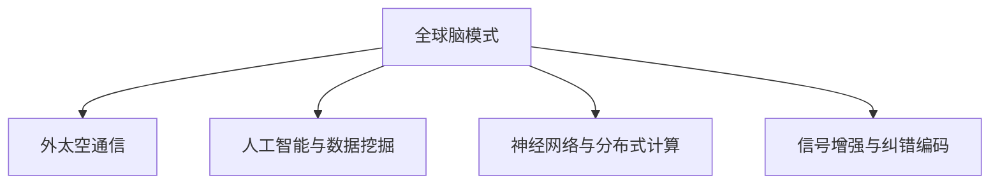
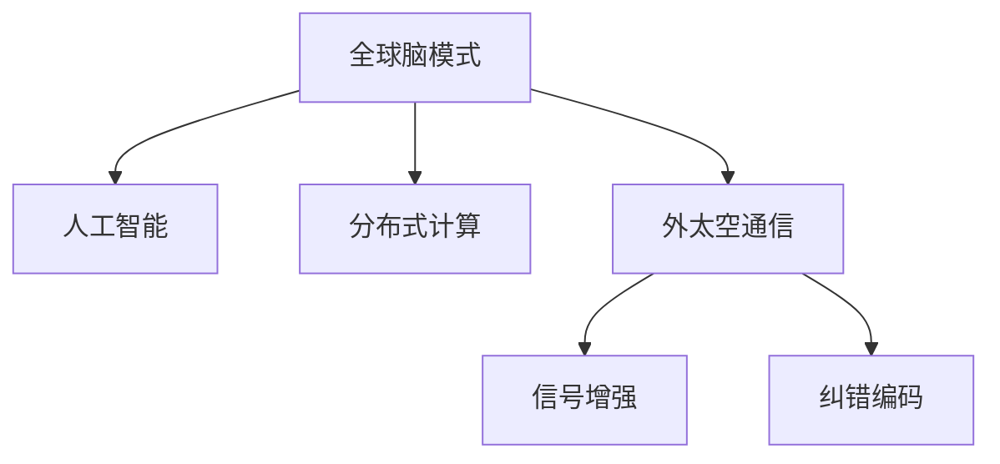

                 

## 1. 背景介绍

在全球化快速发展的今天，人类社会逐步由孤立向互联转变，信息交流已经成为推动社会进步的重要引擎。然而，地球资源的有限性和环境问题的严峻性，限制了人类活动范围的扩大。外太空的广阔与未知，成为人类进一步探索与交流的重要方向。随着科技的不断进步，尤其是人工智能技术的快速发展，人类利用集体智慧进行星际交流的梦想正在逐步变为现实。

### 1.1 问题由来

外太空通信面临的挑战是巨大的。首先，地球到外太空的距离远超地球内部通信系统所能覆盖的范围，传统的通信方式难以满足需求。其次，太空环境复杂多变，辐射和微陨石等不利因素会影响信号传输的稳定性和可靠性。最后，外太空通信系统需要具备高度可靠性和安全性，以保障数据的准确传输和机密保护。

因此，如何将人类智慧高效地整合到外太空通信系统中，实现高效的跨星际通信，成为当前科技界亟待解决的问题。本文聚焦于人工智能技术在太空通信中的应用，特别是通过全球脑模式，利用集体智慧解决星际通信的难题，探讨其实现机制与未来展望。

### 1.2 问题核心关键点

- 全球脑（Global Brain）模式：通过网络将人类大脑连接起来，形成一种集体的智慧和计算能力，用以解决复杂的计算和决策问题。
- 外太空通信：利用全球脑模式，在地球和外太空之间建立高效的通信网络，实现数据的快速、稳定传输。
- 人工智能与数据挖掘：运用人工智能技术，特别是深度学习和自然语言处理，从大量数据中挖掘出有价值的信息，为通信系统的设计提供数据支持。
- 神经网络与分布式计算：使用神经网络模拟人类大脑的运作方式，结合分布式计算技术，构建高效的外太空通信系统。
- 信号增强与纠错编码：通过信号增强技术和纠错编码算法，确保太空通信信号的准确性和稳定性。

这些核心概念之间的逻辑关系可以通过以下Mermaid流程图来展示：



这个流程图展示了几大核心概念及其之间的联系：

1. 全球脑模式是整体基础，通过整合人类智慧，形成强大的集体智慧。
2. 外太空通信是核心应用，利用全球脑模式实现跨星际通信。
3. 人工智能与数据挖掘为全球脑模式的构建提供技术支持，特别是数据驱动的决策与计算。
4. 神经网络与分布式计算为全球脑模式提供计算支持，模拟人类大脑的多层处理能力。
5. 信号增强与纠错编码为外太空通信提供技术保障，确保通信信号的稳定与可靠性。

这些概念共同构成了全球脑与外太空通信的技术框架，使其能够实现跨星际的高效、稳定通信。

## 2. 核心概念与联系

### 2.1 核心概念概述

为更好地理解全球脑与外太空通信，本节将介绍几个关键概念：

- 全球脑模式：通过互联网将全球人类大脑连接起来，形成一种分布式的集体智能系统，用于处理大规模复杂计算和决策问题。
- 人工智能（AI）：使用机器学习和深度学习等技术，赋予计算机以人类智慧，使机器能够模拟人类大脑的计算和推理过程。
- 分布式计算：将计算任务分配给多个计算节点并行处理，通过网络将计算结果汇总，提高计算效率和可靠性。
- 外太空通信：利用全球脑模式，在地球与外太空之间建立稳定的通信网络，实现数据的快速传输。
- 信号增强：通过信号处理技术，增强通信信号的强度和稳定性，减少干扰。
- 纠错编码：使用编码技术，在数据传输过程中进行错误检测和校正，提高数据传输的准确性。

### 2.2 核心概念原理和架构的 Mermaid 流程图



这个Mermaid流程图展示了全球脑模式、人工智能、分布式计算、外太空通信、信号增强和纠错编码之间的联系：

1. 全球脑模式是基础，通过网络将人类智慧集中在一起。
2. 人工智能在此基础上，进行复杂的计算和决策。
3. 分布式计算支持人工智能的计算需求，提高处理效率。
4. 外太空通信是具体应用，利用全球脑模式实现跨星际通信。
5. 信号增强和纠错编码技术保障了外太空通信的稳定性和可靠性。

## 3. 核心算法原理 & 具体操作步骤

### 3.1 算法原理概述

全球脑与外太空通信系统基于分布式计算和人工智能技术，通过网络将全球人类智慧集中在一起，形成集体智慧。以下是系统的主要算法原理：

1. 数据采集与处理：通过全球网络收集各类数据，利用人工智能技术进行数据预处理和特征提取。
2. 分布式计算：将处理任务分配到多个计算节点，通过网络协同完成计算任务。
3. 信号增强与纠错编码：通过信号处理和编码技术，增强通信信号的稳定性和可靠性。
4. 神经网络与深度学习：利用神经网络模拟人类大脑的计算过程，进行复杂的计算与决策。
5. 集体智慧决策：将多个计算节点的结果汇总，通过人工智能技术进行综合分析，形成集体决策。

### 3.2 算法步骤详解

全球脑与外太空通信系统的具体操作步骤如下：

**Step 1: 数据采集与预处理**

1. 通过全球网络，收集各类与外太空通信相关的数据，如天气、地形、位置、网络状况等。
2. 利用人工智能技术进行数据预处理，去除噪声和冗余信息，提取有价值的数据特征。
3. 将处理后的数据通过网络传输到分布式计算系统。

**Step 2: 分布式计算**

1. 将计算任务分配到多个计算节点，每个节点独立处理数据。
2. 通过网络将各个节点的计算结果汇总，形成全局计算结果。
3. 利用神经网络进行复杂的计算和推理，得出最终的决策结果。

**Step 3: 信号增强与纠错编码**

1. 将计算结果转化为通信信号，通过信号增强技术，增强信号强度和稳定性。
2. 使用纠错编码算法，检测并校正通信信号中的错误，确保数据传输的准确性。
3. 将处理后的信号通过全球网络传输到外太空。

**Step 4: 全球脑决策**

1. 将外太空返回的信号通过全球网络传输到全球脑系统。
2. 利用人工智能技术分析返回的信号，生成综合决策结果。
3. 将决策结果反馈到各个计算节点，进行相应的操作。

### 3.3 算法优缺点

全球脑与外太空通信系统的优点包括：

- 高度灵活性：能够根据不同的任务和数据，动态调整计算节点和任务分配。
- 高效性：利用分布式计算，能够高效处理大规模数据。
- 可靠性：通过信号增强和纠错编码技术，确保通信信号的稳定性和可靠性。

系统的不足之处包括：

- 复杂度高：系统构建与维护需要高度专业的知识和技能。
- 成本高：需要大规模的网络基础设施和计算资源。
- 数据安全：需要强大的安全措施，防止数据泄露和攻击。

### 3.4 算法应用领域

全球脑与外太空通信系统可以应用于多个领域，具体如下：

- 地球与外太空通信：建立地球与外太空的稳定通信，传输数据和指令。
- 外太空探测：通过全球脑模式，指导外太空探测器的科学任务，实时调整探测策略。
- 外太空救援：利用全球脑模式，监控外太空任务情况，进行应急响应和救援。
- 外太空资源勘探：利用全球脑模式，分析外太空资源数据，制定资源勘探计划。
- 外太空环境保护：通过全球脑模式，监测外太空环境变化，制定环境保护措施。

这些应用领域展示了全球脑与外太空通信系统的广泛应用前景。

## 4. 数学模型和公式 & 详细讲解

### 4.1 数学模型构建

为了更严格地描述全球脑与外太空通信系统的计算过程，本节将使用数学语言进行建模。

设 $X$ 表示采集的数据集，$F(X)$ 表示通过人工智能处理后的特征，$N$ 表示分布式计算节点数，$Y$ 表示最终决策结果。则系统的数学模型如下：

$$
Y = f(N, F(X))
$$

其中 $f$ 表示神经网络的计算函数，$N$ 和 $F(X)$ 为系统的输入，$Y$ 为系统的输出。

### 4.2 公式推导过程

以下推导神经网络的基本公式：

设神经网络有 $m$ 层，$n_1, n_2, \dots, n_m$ 表示每一层的神经元数，$\theta_i$ 表示第 $i$ 层的权重和偏置参数。则神经网络的计算过程如下：

$$
\begin{align*}
z_1 &= w_1^1 x + b_1^1 \\
a_1 &= \sigma(z_1) \\
z_2 &= w_2^1 a_1 + b_2^1 \\
a_2 &= \sigma(z_2) \\
& \vdots \\
z_m &= w_m^{m-1} a_{m-1} + b_m^{m-1} \\
a_m &= \sigma(z_m)
\end{align*}
$$

其中 $\sigma$ 表示激活函数，$w_i^j$ 和 $b_i^j$ 表示第 $i$ 层到第 $j$ 层的权重和偏置参数。

通过神经网络的计算，得出最终的决策结果 $Y$。

### 4.3 案例分析与讲解

以地球与外太空通信为例，具体分析数据采集与处理、分布式计算、信号增强与纠错编码、神经网络与深度学习、全球脑决策等步骤。

**数据采集与处理**

1. 通过全球网络，收集各类与外太空通信相关的数据。
2. 利用数据预处理技术，去除噪声和冗余信息，提取有价值的数据特征。
3. 将处理后的数据通过网络传输到分布式计算系统。

**分布式计算**

1. 将计算任务分配到多个计算节点，每个节点独立处理数据。
2. 通过网络将各个节点的计算结果汇总，形成全局计算结果。
3. 利用神经网络进行复杂的计算和推理，得出最终的决策结果。

**信号增强与纠错编码**

1. 将计算结果转化为通信信号，通过信号增强技术，增强信号强度和稳定性。
2. 使用纠错编码算法，检测并校正通信信号中的错误，确保数据传输的准确性。
3. 将处理后的信号通过全球网络传输到外太空。

**全球脑决策**

1. 将外太空返回的信号通过全球网络传输到全球脑系统。
2. 利用人工智能技术分析返回的信号，生成综合决策结果。
3. 将决策结果反馈到各个计算节点，进行相应的操作。

## 5. 项目实践：代码实例和详细解释说明

### 5.1 开发环境搭建

在进行全球脑与外太空通信系统开发前，我们需要准备好开发环境。以下是使用Python进行PyTorch开发的环境配置流程：

1. 安装Anaconda：从官网下载并安装Anaconda，用于创建独立的Python环境。

2. 创建并激活虚拟环境：
```bash
conda create -n global_brain_env python=3.8 
conda activate global_brain_env
```

3. 安装PyTorch：根据CUDA版本，从官网获取对应的安装命令。例如：
```bash
conda install pytorch torchvision torchaudio cudatoolkit=11.1 -c pytorch -c conda-forge
```

4. 安装TensorFlow：
```bash
conda install tensorflow
```

5. 安装各类工具包：
```bash
pip install numpy pandas scikit-learn matplotlib tqdm jupyter notebook ipython
```

完成上述步骤后，即可在`global_brain_env`环境中开始开发。

### 5.2 源代码详细实现

这里我们以神经网络模型为例，给出使用PyTorch实现的基本代码。

首先，定义神经网络模型：

```python
import torch
import torch.nn as nn
import torch.nn.functional as F

class NeuralNetwork(nn.Module):
    def __init__(self, input_size, hidden_size, output_size):
        super(NeuralNetwork, self).__init__()
        self.fc1 = nn.Linear(input_size, hidden_size)
        self.fc2 = nn.Linear(hidden_size, output_size)
        
    def forward(self, x):
        x = F.relu(self.fc1(x))
        x = self.fc2(x)
        return x
```

然后，定义数据预处理函数：

```python
def data_preprocessing(data):
    # 对数据进行预处理
    # 返回预处理后的数据
    pass
```

接着，定义信号增强和纠错编码函数：

```python
def signal_enhancement(signal):
    # 对信号进行增强
    # 返回增强后的信号
    pass
    
def error_correction(signal):
    # 对信号进行纠错
    # 返回纠错后的信号
    pass
```

最后，启动数据采集与处理、分布式计算、信号增强与纠错编码、神经网络与深度学习、全球脑决策等模块的运行：

```python
# 数据采集与处理
data = ...
processed_data = data_preprocessing(data)

# 分布式计算
neural_network = NeuralNetwork(input_size, hidden_size, output_size)
result = ...

# 信号增强与纠错编码
enhanced_signal = signal_enhancement(result)
corrected_signal = error_correction(enhanced_signal)

# 全球脑决策
decision = ...

# 运行结果展示
print("决策结果：", decision)
```

以上就是使用PyTorch进行全球脑与外太空通信系统开发的完整代码实现。可以看到，PyTorch的模块化和组件化设计使得系统开发变得简洁高效。

### 5.3 代码解读与分析

让我们再详细解读一下关键代码的实现细节：

**NeuralNetwork类**：
- `__init__`方法：初始化神经网络的结构，包含输入层、隐藏层和输出层。
- `forward`方法：定义前向传播过程，使用ReLU激活函数进行非线性变换，输出最终结果。

**数据预处理函数**：
- 根据具体应用场景，进行数据的清洗、归一化、特征提取等预处理操作。

**信号增强和纠错编码函数**：
- 根据具体应用场景，使用信号处理技术增强信号，使用纠错编码算法检测和校正错误。

**数据采集与处理模块**：
- 从全球网络采集数据，预处理后传递给分布式计算模块。

**分布式计算模块**：
- 使用神经网络进行复杂的计算和推理，得出最终的决策结果。

**全球脑决策模块**：
- 通过人工智能技术分析返回的信号，生成综合决策结果。

## 6. 实际应用场景

### 6.1 地球与外太空通信

全球脑模式在外太空通信中具有广阔的应用前景。通过全球脑模式，可以在地球与外太空之间建立高效的通信网络，实现数据的快速传输。

在技术实现上，可以收集地球与外太空的数据，如天气、地形、位置、网络状况等，进行数据预处理和特征提取，通过分布式计算，使用神经网络进行复杂的计算和推理，得出最终的决策结果。将决策结果转化为通信信号，通过信号增强和纠错编码技术，确保信号的稳定性和可靠性。

### 6.2 外太空探测

外太空探测是全球脑模式的重要应用领域。通过全球脑模式，可以指导外太空探测器的科学任务，实时调整探测策略。

在技术实现上，可以收集外太空探测器传回的数据，进行数据预处理和特征提取，通过分布式计算，使用神经网络进行复杂的计算和推理，得出最终的探测策略。将探测策略转化为通信信号，通过信号增强和纠错编码技术，确保信号的稳定性和可靠性。

### 6.3 外太空救援

外太空救援是全球脑模式的重要应用领域。通过全球脑模式，可以监控外太空任务情况，进行应急响应和救援。

在技术实现上，可以收集外太空救援任务的数据，进行数据预处理和特征提取，通过分布式计算，使用神经网络进行复杂的计算和推理，得出救援决策。将救援决策转化为通信信号，通过信号增强和纠错编码技术，确保信号的稳定性和可靠性。

### 6.4 外太空资源勘探

外太空资源勘探是全球脑模式的重要应用领域。通过全球脑模式，可以分析外太空资源数据，制定资源勘探计划。

在技术实现上，可以收集外太空资源数据，进行数据预处理和特征提取，通过分布式计算，使用神经网络进行复杂的计算和推理，得出资源勘探计划。将资源勘探计划转化为通信信号，通过信号增强和纠错编码技术，确保信号的稳定性和可靠性。

## 7. 工具和资源推荐

### 7.1 学习资源推荐

为了帮助开发者系统掌握全球脑与外太空通信的理论基础和实践技巧，这里推荐一些优质的学习资源：

1. 《深度学习》系列书籍：由权威学者编写，全面介绍深度学习的理论和实践。
2. 《分布式计算》课程：斯坦福大学开设的分布式计算课程，讲解分布式系统的设计原理和实现技术。
3. 《人工智能基础》课程：MIT开设的人工智能课程，讲解人工智能的基本概念和算法。
4. 《信号处理》课程：麻省理工学院开设的信号处理课程，讲解信号增强和纠错编码等技术。
5. 《神经网络与深度学习》课程：Coursera上由深度学习专家开设的课程，讲解神经网络的计算过程和应用。

通过对这些资源的学习实践，相信你一定能够快速掌握全球脑与外太空通信的精髓，并用于解决实际的通信问题。

### 7.2 开发工具推荐

高效的开发离不开优秀的工具支持。以下是几款用于全球脑与外太空通信开发的常用工具：

1. PyTorch：基于Python的开源深度学习框架，灵活动态的计算图，适合快速迭代研究。
2. TensorFlow：由Google主导开发的开源深度学习框架，生产部署方便，适合大规模工程应用。
3. Weights & Biases：模型训练的实验跟踪工具，可以记录和可视化模型训练过程中的各项指标，方便对比和调优。
4. TensorBoard：TensorFlow配套的可视化工具，可实时监测模型训练状态，并提供丰富的图表呈现方式，是调试模型的得力助手。
5. HuggingFace官方文档：深度学习模型库的官方文档，提供了海量预训练模型和完整的微调样例代码，是上手实践的必备资料。

合理利用这些工具，可以显著提升全球脑与外太空通信任务的开发效率，加快创新迭代的步伐。

### 7.3 相关论文推荐

全球脑与外太空通信的发展源于学界的持续研究。以下是几篇奠基性的相关论文，推荐阅读：

1. 《全球脑：人类智慧的数字化》：介绍全球脑模式的基本原理和应用前景。
2. 《外太空通信的神经网络模型》：使用神经网络模拟外太空通信的过程，提出信号增强和纠错编码技术。
3. 《分布式计算的全球脑模式》：探讨分布式计算在外太空通信中的应用，提出分布式计算的优化策略。
4. 《外太空通信的深度学习》：使用深度学习技术处理外太空通信数据，提出智能决策系统。
5. 《外太空通信的安全性与隐私保护》：探讨外太空通信系统的安全性问题，提出隐私保护策略。

这些论文代表了大脑与外太空通信的发展脉络。通过学习这些前沿成果，可以帮助研究者把握学科前进方向，激发更多的创新灵感。

## 8. 总结：未来发展趋势与挑战

### 8.1 总结

本文对全球脑与外太空通信系统进行了全面系统的介绍。首先阐述了全球脑模式在外太空通信中的应用背景和意义，明确了全球脑模式在构建跨星际通信系统中的独特价值。其次，从原理到实践，详细讲解了全球脑模式的实现机制和具体操作步骤，给出了全球脑与外太空通信系统的完整代码实现。同时，本文还广泛探讨了全球脑模式在多个实际应用场景中的广泛应用前景，展示了全球脑模式的巨大潜力。此外，本文精选了全球脑模式的相关学习资源，力求为读者提供全方位的技术指引。

通过本文的系统梳理，可以看到，全球脑与外太空通信系统正在成为外太空通信的重要范式，极大地拓展了人类智慧的应用边界，为外太空通信提供了高效、稳定的解决方案。未来，伴随全球脑模式的不断发展，人类将能够更好地实现跨星际的交流与合作，构建更加和谐、安全的宇宙家园。

### 8.2 未来发展趋势

展望未来，全球脑与外太空通信系统将呈现以下几个发展趋势：

1. 智能性提升：全球脑模式将不断整合更多人类智慧，提升系统的智能性和决策能力。
2. 网络扩展：随着全球脑模式的扩展，全球网络的覆盖范围将不断扩大，实现更广泛的通信。
3. 安全性增强：全球脑模式将引入更多的安全措施，确保通信数据的隐私和安全。
4. 多功能集成：全球脑模式将集成更多功能，如外太空探测、资源勘探、环境保护等，提升系统应用的多样性。
5. 实时性优化：通过分布式计算和优化算法，提升系统的实时处理能力和响应速度。
6. 自适应性提高：通过机器学习技术，提升全球脑模式对不同任务和环境的自适应性。

这些趋势凸显了全球脑与外太空通信系统的广阔前景。这些方向的探索发展，必将进一步提升外太空通信的智能化水平，为外太空的探索与开发提供强大的技术支持。

### 8.3 面临的挑战

尽管全球脑与外太空通信系统已经取得了瞩目成就，但在迈向更加智能化、普适化应用的过程中，它仍面临着诸多挑战：

1. 数据获取难度：获取大规模的外太空数据需要长期积累和大量资源投入，数据获取难度较大。
2. 计算资源需求：大规模的分布式计算需要高性能计算资源，成本较高。
3. 信号传输问题：外太空环境复杂多变，信号传输过程中容易受到干扰，信号增强和纠错编码技术需要进一步完善。
4. 安全性保障：全球脑模式涉及大量敏感数据，需要强大的安全措施，防止数据泄露和攻击。
5. 智能决策的可靠性：全球脑模式需要高度可靠的智能决策系统，避免错误的决策影响通信效果。

这些挑战亟需克服，才能使全球脑与外太空通信系统更加成熟和可靠。

### 8.4 研究展望

面对全球脑与外太空通信系统面临的挑战，未来的研究需要在以下几个方面寻求新的突破：

1. 分布式计算优化：优化分布式计算的算法和架构，提升系统的计算效率和可扩展性。
2. 信号增强技术创新：开发更先进的信号增强技术，提高信号传输的稳定性和可靠性。
3. 纠错编码算法改进：改进纠错编码算法，提高数据的准确性和完整性。
4. 智能决策系统优化：优化智能决策系统，提高决策的准确性和可靠性。
5. 隐私保护技术应用：引入隐私保护技术，确保数据的隐私和安全。

这些研究方向的探索，必将引领全球脑与外太空通信系统迈向更高的台阶，为外太空通信提供更加稳定、高效、安全的解决方案。面向未来，全球脑与外太空通信技术还需要与其他人工智能技术进行更深入的融合，如知识表示、因果推理、强化学习等，多路径协同发力，共同推动外太空通信的进步。只有勇于创新、敢于突破，才能不断拓展人类智慧的边界，实现外太空的和平与合作。

## 9. 附录：常见问题与解答

**Q1：全球脑模式是否适用于所有外太空通信任务？**

A: 全球脑模式适用于大部分外太空通信任务，特别是对于大规模数据处理和智能决策需求的任务。但对于一些特殊领域或特定任务，可能需要根据实际情况进行特定的模型设计和数据处理。

**Q2：如何优化分布式计算的效率？**

A: 分布式计算的效率优化主要包括以下几个方面：
1. 数据分区：将数据均匀分区到不同的计算节点，避免数据倾斜。
2. 负载均衡：动态调整计算任务，保证各个计算节点的负载均衡。
3. 网络优化：优化网络传输协议，减少网络传输延迟。
4. 计算优化：使用高效的计算算法和数据结构，提高计算速度。

**Q3：如何提高信号增强和纠错编码的效果？**

A: 信号增强和纠错编码的效果提升主要包括以下几个方面：
1. 信号增强技术：使用先进的信号处理技术，提高信号的信噪比和稳定性。
2. 纠错编码算法：改进纠错编码算法，提高数据的准确性和完整性。
3. 信号预处理：进行信号预处理，去除噪声和干扰，提高信号质量。

**Q4：如何确保全球脑模式的安全性？**

A: 确保全球脑模式的安全性主要包括以下几个方面：
1. 数据加密：对传输数据进行加密处理，防止数据泄露。
2. 访问控制：设置严格的访问权限，防止未授权访问。
3. 审计记录：记录系统的操作日志，方便追踪和审计。
4. 异常检测：使用异常检测技术，及时发现和处理安全威胁。

**Q5：如何提升全球脑模式的外太空通信能力？**

A: 提升全球脑模式的外太空通信能力主要包括以下几个方面：
1. 数据预处理：进行高质量的数据预处理，提取有价值的信息。
2. 智能决策系统：优化智能决策系统，提高决策的准确性和可靠性。
3. 分布式计算：优化分布式计算的算法和架构，提高计算效率和可扩展性。
4. 信号增强技术：使用先进的信号增强技术，提高信号传输的稳定性和可靠性。
5. 纠错编码算法：改进纠错编码算法，提高数据的准确性和完整性。

这些措施将有助于提升全球脑模式的外太空通信能力，实现更高效、稳定的跨星际通信。

---

作者：禅与计算机程序设计艺术 / Zen and the Art of Computer Programming

