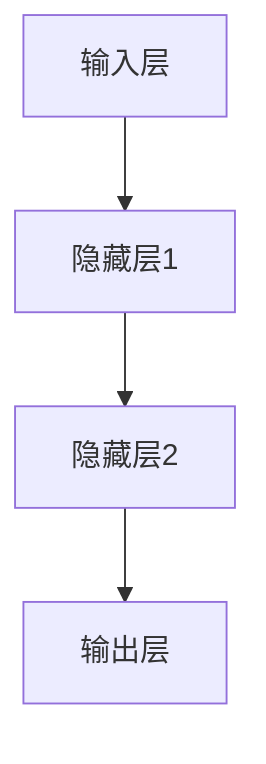

                 

# 全球脑与意识上传:数字化永生的伦理与技术探讨

> 关键词：数字化永生,脑机接口,BMI,意识上传,数据加密,人工智能,伦理问题,隐私保护,公共政策,技术发展,未来展望

## 1. 背景介绍

### 1.1 问题由来

数字化永生（Digital Immortality）是近年来科技和哲学界的热门话题，旨在通过技术手段，将人的意识或大脑数据上传至数字世界中，实现某种形式的“生命延续”。这一理念深深吸引了公众的关注，也引发了一系列伦理、技术和社会挑战。脑机接口（Brain-Machine Interface, BMI）和意识上传（Consciousness Upload）成为实现数字化永生的关键技术，其伦理与技术问题也成为讨论的焦点。

### 1.2 问题核心关键点

脑机接口与意识上传技术主要依赖于神经科学、生物工程、计算机科学等多学科的交叉融合，其核心在于将大脑活动转化为数字信号，并在数字世界中进行重构和模拟。这一过程中，涉及多个核心技术点：

- **神经信号采集与处理**：使用脑电图（EEG）、功能性磁共振成像（fMRI）、磁脑磁图（MEG）等技术，采集大脑活动数据。
- **信号转换与解码**：将采集到的神经信号通过算法进行解码，转化为计算机可读的数字信号。
- **数据存储与传输**：将处理后的数据存储至高容量、高安全性的存储设备，并通过网络传输至目标设备。
- **重构与模拟**：在数字世界中重建大脑信号，实现对其行为的模拟和控制。

这些技术环节中，每一环都存在潜在的伦理问题，如隐私保护、数据安全、个人自由等。因此，研究这些技术，不仅需要技术上的突破，更需要跨学科的深入探讨。

## 2. 核心概念与联系

### 2.1 核心概念概述

为了更好地理解脑机接口与意识上传，本节将介绍几个关键概念及其之间的联系：

- **脑机接口（BMI）**：一种技术，通过记录大脑活动信号，将其转化为计算机可读的形式，实现人脑与计算机系统的交互。
- **神经信号处理**：包括信号采集、预处理、特征提取、信号解码等步骤，旨在从大脑信号中提取有用的信息。
- **意识上传**：将大脑数据存储至数字设备，并在虚拟世界中进行重构和模拟，以实现某种形式的“意识永生”。
- **数据加密与隐私保护**：涉及数据的加密存储、安全传输等技术，保障用户隐私和数据安全。
- **人工智能（AI）**：脑机接口与意识上传技术的实施，离不开AI技术在信号处理、模式识别、数据重构等方面的应用。
- **伦理问题**：涉及技术应用的道德边界，如知情同意、隐私权、身份认同等。

这些核心概念之间的逻辑关系可以通过以下Mermaid流程图来展示：

```mermaid
graph TB
    A[脑机接口(BMI)] --> B[神经信号处理]
    A --> C[意识上传]
    B --> D[数据加密与隐私保护]
    C --> E[人工智能(AI)]
    E --> F[伦理问题]
```

这个流程图展示了脑机接口与意识上传技术的核心组成及其相互联系：

1. 脑机接口通过神经信号处理获取大脑活动数据。
2. 意识上传依赖脑机接口实现，将数据存储至数字世界。
3. 数据加密与隐私保护贯穿整个技术流程，保障用户数据安全。
4. 人工智能技术在信号处理、数据重构等方面提供支持。
5. 伦理问题贯穿技术实施的各个环节，需要与技术发展同步考虑。

## 3. 核心算法原理 & 具体操作步骤

### 3.1 算法原理概述

脑机接口与意识上传技术的核心算法原理涉及神经信号处理、数据压缩与加密、数据存储与传输、数字世界的重构等多个环节。以下将逐一介绍这些关键技术。

### 3.2 算法步骤详解

#### 3.2.1 神经信号采集与处理

1. **数据采集**：使用EEG、fMRI、MEG等技术，获取大脑活动信号。
2. **预处理**：对原始信号进行滤波、去噪、归一化等预处理，提高信号质量。
3. **特征提取**：从预处理后的信号中提取关键特征，如频率、幅度、相位等。
4. **信号解码**：使用机器学习算法，如支持向量机（SVM）、深度神经网络（DNN）等，对特征进行解码，转化为计算机可读的数据。

#### 3.2.2 数据压缩与加密

1. **数据压缩**：使用无损压缩算法（如Huffman编码）或有损压缩算法（如JPEG、PNG）对数据进行压缩，减少存储和传输开销。
2. **数据加密**：使用对称加密算法（如AES）或非对称加密算法（如RSA）对数据进行加密，保障数据传输过程中的安全性。

#### 3.2.3 数据存储与传输

1. **数据存储**：使用高容量、高安全性的存储设备，如硬盘、SSD、云存储等，存储压缩和加密后的数据。
2. **数据传输**：通过网络传输数据，可以使用HTTP、FTP等协议，或专用通信协议（如TLS）。

#### 3.2.4 数字世界的重构

1. **数据重构**：在数字世界中重建原始数据，可以使用计算机图形学、虚拟现实（VR）等技术。
2. **模拟与控制**：通过AI算法，实现对重构数据的模拟和控制，如使用强化学习算法训练虚拟环境中的行为策略。

### 3.3 算法优缺点

脑机接口与意识上传技术的优点包括：

- **数据容量大**：大脑信号复杂多样，含有大量信息。
- **非侵入性**：相比传统的脑外科手术接口，非侵入性技术使用更安全、更易接受。
- **高度可定制**：可针对不同应用场景定制算法和设备。

缺点包括：

- **技术挑战高**：神经信号复杂，解码难度大；数据量大，存储和传输成本高。
- **伦理争议多**：涉及隐私权、知情同意、身份认同等伦理问题。
- **技术成熟度低**：仍处于研究阶段，应用推广面临诸多障碍。

### 3.4 算法应用领域

脑机接口与意识上传技术在多个领域具有广泛的应用前景：

- **医学**：用于诊断、治疗、康复等领域，如神经反馈疗法、脑刺激疗法等。
- **娱乐**：在虚拟现实、游戏、影视制作等领域，实现人与计算机的交互。
- **人工智能**：提供丰富的人类认知数据，推动AI算法的迭代。
- **教育**：用于心理辅导、认知训练等教育应用。
- **科学研究**：探索大脑机制、认知过程等科学研究问题。

## 4. 数学模型和公式 & 详细讲解 & 举例说明

### 4.1 数学模型构建

脑机接口与意识上传技术的数学模型构建涉及多个环节，如神经信号处理、数据压缩、数据加密等。以下以神经信号解码为例，给出数学模型构建的详细讲解。

假设大脑活动信号为 $X = \{x_1, x_2, \ldots, x_n\}$，信号解码的目标是将这些信号转化为计算机可读的数据 $Y = \{y_1, y_2, \ldots, y_m\}$。设 $F$ 为信号解码函数，则解码过程可表示为：

$$
Y = F(X)
$$

常用的解码算法包括线性解码和深度神经网络解码。以下以深度神经网络解码为例，构建数学模型。

设解码网络为 $N = \{W_1, b_1, W_2, b_2, \ldots, W_k, b_k\}$，其中 $W_i$ 为网络层权重，$b_i$ 为偏置项，$n_i$ 为网络层神经元个数，$x_{i,j}$ 为第 $i$ 层第 $j$ 个神经元的输入值。解码过程可表示为：

$$
y_1 = \sigma(W_1x_1 + b_1)
$$
$$
y_2 = \sigma(W_2y_1 + b_2)
$$
$$
\ldots
$$
$$
y_k = \sigma(W_ky_{k-1} + b_k)
$$

其中 $\sigma$ 为激活函数，通常使用ReLU函数。

### 4.2 公式推导过程

深度神经网络解码的公式推导过程如下：

设解码网络的输入层、隐藏层和输出层的神经元个数分别为 $n_1, n_2, n_3$，解码器由 $L$ 层组成。解码过程可以表示为：

$$
z_1 = W_1x + b_1
$$
$$
a_1 = \sigma(z_1)
$$
$$
z_2 = W_2a_1 + b_2
$$
$$
a_2 = \sigma(z_2)
$$
$$
\ldots
$$
$$
z_L = W_La_{L-1} + b_L
$$
$$
a_L = \sigma(z_L)
$$

其中 $z_i$ 为第 $i$ 层的网络输出，$a_i$ 为第 $i$ 层的激活值。解码器的输出层神经元个数为 $m$，解码后的信号 $y$ 为：

$$
y = W_my_L + b_m
$$

其中 $W_m$ 为输出层的权重，$b_m$ 为输出层的偏置项。

### 4.3 案例分析与讲解

以BMI技术为例，说明神经信号解码在脑机接口中的应用。

假设某BMI系统使用深度神经网络进行信号解码，其网络结构如图：



输入层有 $n_1$ 个神经元，输出层有 $m$ 个神经元，隐藏层有 $n_2$ 个神经元。设输入信号 $X = \{x_1, x_2, \ldots, x_{n_1}\}$，隐藏层的激活值为 $a_1 = \sigma(W_1x + b_1)$，$z_1 = W_1x + b_1$，隐藏层的激活值为 $a_2 = \sigma(W_2a_1 + b_2)$，$z_2 = W_2a_1 + b_2$，输出层的激活值为 $a_L = \sigma(W_La_{L-1} + b_L)$，$z_L = W_La_{L-1} + b_L$。解码后的信号 $y$ 为：

$$
y = W_my_L + b_m
$$

该解码器通过训练得到最优的权重和偏置项，实现对大脑信号的有效解码。在实际应用中，解码器还需要结合其他算法（如信号预处理、特征提取等），才能完成完整的BMI过程。

## 5. 项目实践：代码实例和详细解释说明

### 5.1 开发环境搭建

在进行脑机接口与意识上传技术开发前，需要准备相应的开发环境。以下是使用Python进行深度学习开发的环境配置流程：

1. 安装Anaconda：从官网下载并安装Anaconda，用于创建独立的Python环境。

2. 创建并激活虚拟环境：
```bash
conda create -n pytorch-env python=3.8 
conda activate pytorch-env
```

3. 安装PyTorch：根据CUDA版本，从官网获取对应的安装命令。例如：
```bash
conda install pytorch torchvision torchaudio cudatoolkit=11.1 -c pytorch -c conda-forge
```

4. 安装TensorFlow：
```bash
pip install tensorflow
```

5. 安装Keras：
```bash
pip install keras
```

6. 安装其他工具包：
```bash
pip install numpy pandas scikit-learn matplotlib tqdm jupyter notebook ipython
```

完成上述步骤后，即可在`pytorch-env`环境中开始开发实践。

### 5.2 源代码详细实现

以下以深度神经网络解码器为例，给出使用Keras实现神经信号解码的代码：

```python
from keras.models import Sequential
from keras.layers import Dense, Activation
from keras.optimizers import SGD

# 定义解码器模型
model = Sequential()
model.add(Dense(64, input_dim=100, activation='relu'))
model.add(Dense(32, activation='relu'))
model.add(Dense(10, activation='softmax'))

# 编译模型
model.compile(loss='categorical_crossentropy', optimizer=SGD(learning_rate=0.01, momentum=0.9))

# 训练模型
model.fit(X_train, y_train, epochs=10, batch_size=32)
```

### 5.3 代码解读与分析

让我们再详细解读一下关键代码的实现细节：

**代码解读**：

1. `Sequential`模型：使用Keras中的`Sequential`模型创建解码器，依次添加输入层、隐藏层和输出层。
2. `Dense`层：使用`Dense`层创建全连接层，设置层神经元个数和激活函数。
3. `Activation`层：使用`Activation`层添加激活函数。
4. `compile`方法：使用`compile`方法编译模型，指定损失函数和优化器。
5. `fit`方法：使用`fit`方法训练模型，指定训练数据、迭代次数和批大小。

**代码分析**：

1. 输入层神经元个数为 $n_1$，输出层神经元个数为 $m$，隐藏层神经元个数为 $n_2$。
2. 使用ReLU激活函数，增加模型的非线性能力。
3. 使用softmax激活函数，对解码后的信号进行归一化，便于输出结果。
4. 损失函数使用交叉熵损失，优化器使用随机梯度下降（SGD）。
5. 训练过程中，批量大小为32，迭代次数为10次，训练数据为 $X_{train}$ 和 $y_{train}$。

## 6. 实际应用场景

### 6.1 医学诊断

脑机接口与意识上传技术在医学领域具有广泛应用前景，如用于神经疾病诊断、康复治疗、认知训练等。例如，通过采集脑电信号，解码其与疾病状态的关系，可以实现对癫痫、帕金森等神经疾病的早期诊断和实时监控。

### 6.2 虚拟现实

在虚拟现实和游戏领域，脑机接口可以将用户的脑信号转化为游戏操作，实现脑控游戏。例如，用户可以通过脑电信号控制游戏中的角色，进行射击、飞行等操作，提升游戏体验。

### 6.3 人工智能研究

脑机接口与意识上传技术为人工智能研究提供了丰富的数据来源。通过解码脑信号，获取人类认知过程的特征，可以用于训练AI模型，提升其理解和推理能力。

### 6.4 未来应用展望

未来，脑机接口与意识上传技术将在更多领域得到应用，为人类认知智能的进步提供新思路：

1. **智慧医疗**：通过脑机接口，实时监控患者的脑电信号，辅助医生进行诊断和治疗。
2. **教育培训**：在教育培训中，使用脑机接口分析学生的学习状态，个性化调整教学内容。
3. **娱乐游戏**：在虚拟现实和游戏领域，实现脑控游戏、虚拟体验等应用。
4. **科学研究**：通过脑机接口，研究大脑机制、认知过程等科学问题，推动认知科学的发展。

## 7. 工具和资源推荐

### 7.1 学习资源推荐

为了帮助开发者系统掌握脑机接口与意识上传技术，这里推荐一些优质的学习资源：

1. **《深度学习》教材**：由Ian Goodfellow、Yoshua Bengio、Aaron Courville所著，是深度学习领域的经典教材，涵盖了神经网络、深度学习等基础知识。
2. **《神经科学原理》**：由Eric R. Kandel、James H. Schwarz、Timothy H. Jessell所著，介绍了神经系统的基本原理和功能。
3. **《脑机接口技术》**：由Mikhail V. Burdick、Reza Shafei、Prashant D. Mishra所著，介绍了脑机接口的技术原理和应用案例。
4. **Kaggle竞赛**：Kaggle上有很多脑机接口和意识上传相关的竞赛项目，通过实际竞赛项目，可以了解最新的技术进展和应用场景。

### 7.2 开发工具推荐

高效的开发离不开优秀的工具支持。以下是几款用于脑机接口与意识上传技术开发的常用工具：

1. **Python**：作为一种高级编程语言，Python广泛应用于深度学习、数据处理等领域，是脑机接口技术开发的首选语言。
2. **PyTorch**：由Facebook开发的深度学习框架，支持动态计算图，适合快速迭代研究。
3. **TensorFlow**：由Google主导开发的深度学习框架，生产部署方便，适合大规模工程应用。
4. **Keras**：Keras是深度学习领域的高级API，易于上手，支持多种后端，如TensorFlow、Theano等。
5. **Matplotlib**：用于数据可视化，支持绘制各种图表，方便分析模型性能。

### 7.3 相关论文推荐

脑机接口与意识上传技术的发展源于学界的持续研究。以下是几篇奠基性的相关论文，推荐阅读：

1. **《Brain Computer Interfaces: An Overview》**：由Vasudevan Kumar、Gowri Rao、Mahendra Singh所著，介绍了脑机接口的基本原理和技术。
2. **《Deep Brain Stimulation》**：由Andreiater等著，介绍了深度脑刺激技术在脑机接口中的应用。
3. **《Consciousness Upload: An Exploration》**：由Nick Bostrom、Zachary Knobe、John Goertzel所著，探讨了意识上传的伦理和技术问题。
4. **《The Future of Brain-Computer Interfaces》**：由Anish V. Anokian、Adam R. C. Lanckriet、Holger König所著，介绍了脑机接口的未来发展方向。

这些论文代表了大语言模型微调技术的发展脉络。通过学习这些前沿成果，可以帮助研究者把握学科前进方向，激发更多的创新灵感。

## 8. 总结：未来发展趋势与挑战

### 8.1 总结

本文对脑机接口与意识上传技术进行了全面系统的介绍。首先阐述了该技术的研究背景和意义，明确了其在数字化永生领域的独特价值。其次，从原理到实践，详细讲解了脑机接口与意识上传技术的核心算法和操作步骤，给出了实际应用场景和代码实例。同时，本文还探讨了该技术在医学、虚拟现实、人工智能等领域的应用前景，展示了其巨大的潜力。最后，本文精选了脑机接口与意识上传技术的各类学习资源，力求为读者提供全方位的技术指引。

通过本文的系统梳理，可以看到，脑机接口与意识上传技术正在成为数字化永生领域的重要范式，极大地拓展了人类认知智能的边界，为技术应用提供了新的思路。未来，伴随技术不断进步和伦理问题深入探讨，脑机接口与意识上传技术必将引领数字化永生进入新的阶段。

### 8.2 未来发展趋势

展望未来，脑机接口与意识上传技术将呈现以下几个发展趋势：

1. **技术成熟度提升**：随着研究的深入，脑机接口与意识上传技术的精度、鲁棒性、实时性等性能将不断提升，实现更加稳定的数据采集和处理。
2. **应用场景多样化**：除了医学、娱乐等领域，脑机接口技术将在更多领域得到应用，如教育、科研、军事等。
3. **伦理与法律框架完善**：随着技术的推广应用，伦理与法律问题将受到越来越多的关注，需要建立完善的法律法规体系，保障用户权益。
4. **隐私保护加强**：数据隐私和安全是脑机接口技术的重要问题，需要采用先进的加密技术和隐私保护策略，保障用户数据的安全。
5. **跨学科融合**：脑机接口与意识上传技术涉及神经科学、计算机科学、生物工程等多个学科，需要跨学科合作，推动技术进步。

### 8.3 面临的挑战

尽管脑机接口与意识上传技术已经取得了一定进展，但在迈向实际应用的过程中，仍面临诸多挑战：

1. **技术挑战高**：神经信号的复杂性、数据量庞大等技术问题，使得脑机接口技术的研究和应用面临较高难度。
2. **伦理问题复杂**：涉及隐私权、知情同意、身份认同等伦理问题，需要跨学科研究，建立伦理规范。
3. **法律法规缺失**：目前相关法律法规体系尚不完善，技术应用过程中需要逐步建立和完善相关法律框架。
4. **社会接受度低**：公众对脑机接口技术的接受度较低，需要加强科普教育，提高社会认知。

### 8.4 研究展望

面对脑机接口与意识上传技术面临的挑战，未来的研究需要在以下几个方面寻求新的突破：

1. **提高技术精度**：通过改进神经信号采集和解码算法，提高脑机接口技术的精度和鲁棒性。
2. **降低技术成本**：采用低成本、易操作的技术，降低脑机接口设备的使用门槛，推动技术普及。
3. **加强伦理研究**：建立完善的伦理规范，确保技术应用符合伦理要求，保障用户权益。
4. **推动法律法规建设**：制定相关的法律法规，规范脑机接口技术的应用，保障数据安全和隐私。
5. **促进跨学科合作**：加强神经科学、计算机科学等学科的合作，推动脑机接口技术的创新发展。

这些研究方向的探索，必将引领脑机接口与意识上传技术迈向更高的台阶，为数字化永生领域提供更多可能性。面向未来，脑机接口与意识上传技术还需要与其他人工智能技术进行更深入的融合，共同推动人类认知智能的进步。只有勇于创新、敢于突破，才能不断拓展语言模型的边界，让智能技术更好地造福人类社会。

## 9. 附录：常见问题与解答

**Q1：脑机接口技术是否适用于所有神经疾病？**

A: 脑机接口技术主要应用于神经信号采集和解码，对于不同类型的神经疾病，其适用性有所差异。例如，在癫痫、帕金森等疾病的早期诊断和治疗中，脑机接口技术可以发挥重要作用。但对于一些遗传性疾病，如阿尔茨海默症，脑机接口技术的干预效果有限。

**Q2：意识上传的可行性如何？**

A: 意识上传的可行性仍是一个高度争议的问题。目前，技术尚未实现将完整的意识状态转移到数字世界，只能实现部分功能的模拟。未来，随着技术的不断进步，意识上传的可行性有望得到进一步探索。

**Q3：如何保障脑机接口技术的安全性？**

A: 脑机接口技术的安全性主要涉及数据隐私、网络攻击、系统漏洞等问题。保障安全性需要从技术、法律和伦理多个层面入手，如使用先进的数据加密技术、建立完善的安全体系等。

**Q4：脑机接口技术在教育中的应用前景如何？**

A: 脑机接口技术在教育中的应用前景广阔，可以实现个性化学习、心理辅导等功能。例如，通过监测学生的脑电信号，了解其学习状态，个性化调整教学内容，提高学习效果。

**Q5：如何实现意识上传技术的伦理审查？**

A: 实现意识上传技术的伦理审查，需要建立专门的伦理委员会，制定明确的伦理规范和标准，对技术应用进行监督和评估。同时，需要广泛征求公众意见，确保技术应用符合伦理要求。

---

作者：禅与计算机程序设计艺术 / Zen and the Art of Computer Programming

