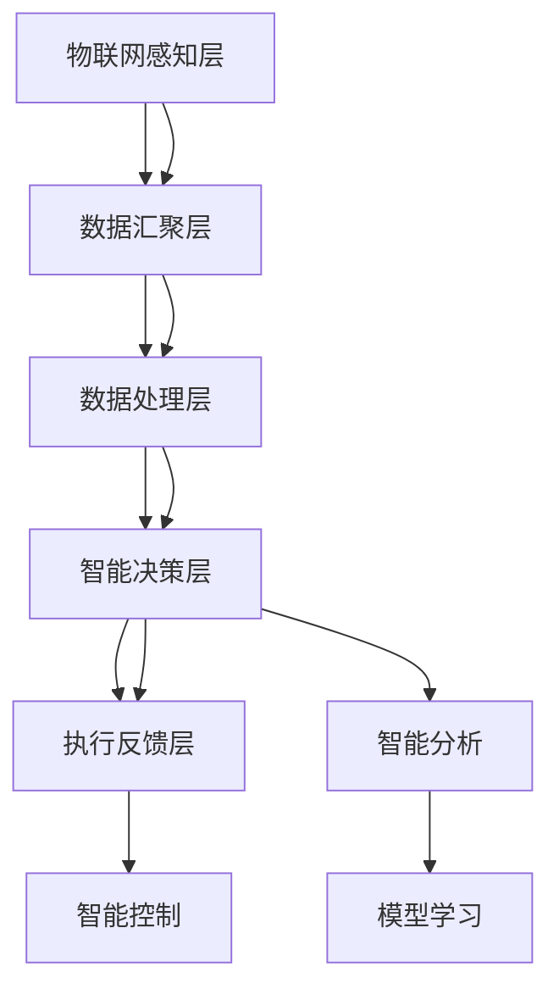

                 

# 全球脑与智慧城市:数字化城市管理的终极形态

> 关键词：全球脑,智慧城市,数字化,城市管理,智能基础设施,大数据,人工智能

## 1. 背景介绍

### 1.1 问题由来

随着全球人口持续增长和经济快速发展，城市化进程不断加快，城市环境和管理面临巨大的压力和挑战。传统的城市管理方式，如依赖人力巡逻、手动监测、纸质文档等，效率低下，无法及时响应突发事件，难以应对复杂的城市运行需求。同时，城市环境污染、资源浪费、交通拥堵等问题，也对城市的可持续发展带来了严峻考验。

在这样的背景下，数字化城市管理应运而生，通过融合物联网、大数据、人工智能等先进技术，实现对城市运行状态的实时监测、分析和预测，以提升城市管理效率、优化资源配置、保障城市运行安全，实现城市的智能管理。

## 2. 核心概念与联系

### 2.1 核心概念概述

智慧城市（Smart City）是基于物联网、大数据、人工智能等技术，通过全面感知、深度融合、实时分析和精细管理，提升城市管理效率、优化资源配置、保障城市运行安全，实现城市运行智能化、精细化和可持续发展的城市管理模式。智慧城市建设的核心在于构建“全球脑”（Global Brain），即通过信息网络的全面覆盖和数据融合，实现城市运行信息的实时采集和精准分析，为城市管理提供决策支持。

### 2.2 核心概念原理和架构的 Mermaid 流程图



以上流程图展示了智慧城市“全球脑”的核心架构：

1. **物联网感知层**：通过各类传感器、摄像头、RFID等技术手段，实现对城市运行状态的实时感知。
2. **数据汇聚层**：将感知层采集的海量数据进行汇聚、清洗和标准化，形成城市运行大数据。
3. **数据处理层**：采用分布式计算和大数据技术，对汇聚层的数据进行存储、计算和处理，实现数据的实时分析和预测。
4. **智能决策层**：基于人工智能和机器学习技术，对处理层分析结果进行深度挖掘和智能决策，生成决策指令。
5. **执行反馈层**：通过智能控制和实时反馈机制，执行决策指令，调整城市运行状态，形成闭环管理。

### 2.3 核心概念之间的联系

智慧城市的核心在于构建“全球脑”，实现对城市运行信息的全面感知和精准分析。通过物联网感知层、数据汇聚层、数据处理层、智能决策层和执行反馈层的协同工作，智慧城市能够实现对城市运行的实时监测、分析、预测和优化，提升城市管理效率和智能化水平。

## 3. 核心算法原理 & 具体操作步骤

### 3.1 算法原理概述

智慧城市的“全球脑”架构中，人工智能和大数据技术发挥着关键作用。其中，人工智能算法通过对城市运行数据的深度学习和分析，实现对城市运行状态的精准预测和智能决策；大数据技术则通过海量数据的存储和计算，实现对城市运行信息的全面感知和精准分析。

### 3.2 算法步骤详解

智慧城市“全球脑”的建设主要包括以下几个关键步骤：

**Step 1: 数据采集与汇聚**

1. **感知设备部署**：在城市关键区域和设施，如交通路口、公共场所、工业园区等，部署各类感知设备，实现对城市运行状态的实时感知。
2. **数据汇聚平台搭建**：构建统一的数据汇聚平台，通过API接口、数据同步工具等手段，将感知设备采集的数据汇聚到城市大数据中心。
3. **数据清洗与标准化**：对汇聚的数据进行清洗和标准化处理，去除噪音和错误数据，形成统一格式的数据集，便于后续分析。

**Step 2: 数据存储与计算**

1. **分布式存储**：采用分布式存储技术，如Hadoop、Spark等，将城市大数据存储在多台服务器上，实现数据的可靠性和高可用性。
2. **实时计算**：通过分布式计算平台，如Storm、Flink等，实现对城市运行数据的实时计算和处理，提升数据处理的效率和准确性。

**Step 3: 数据挖掘与分析**

1. **特征提取**：从城市运行大数据中提取关键特征，如交通流量、空气质量、能耗数据等，形成特征向量。
2. **模型训练**：基于机器学习和大数据分析技术，对特征向量进行模型训练，形成城市运行预测模型和决策支持模型。
3. **智能分析**：对模型进行智能分析，实现对城市运行状态的实时监测、分析和预测，生成决策指令。

**Step 4: 决策与执行**

1. **智能决策**：基于智能分析结果，生成城市管理决策指令，如交通信号灯控制、能源管理、环境监测等。
2. **智能控制**：通过智能控制系统，执行决策指令，调整城市运行状态，如调整交通信号、调节能源分配、优化环境治理等。
3. **实时反馈**：建立实时反馈机制，通过传感器、摄像头等感知设备，监测城市运行状态的变化，及时调整决策指令，形成闭环管理。

### 3.3 算法优缺点

智慧城市“全球脑”架构的优势在于：

1. **数据驱动决策**：通过海量数据的实时分析和深度学习，实现对城市运行状态的精准预测和智能决策，提升城市管理效率。
2. **智能闭环管理**：通过智能控制和实时反馈机制，实现城市运行状态的持续优化和调整，保障城市运行安全。
3. **资源优化配置**：通过对城市运行数据的深度挖掘和分析，优化资源配置，提升城市运行效率和智能化水平。

同时，该架构也存在一些局限性：

1. **技术复杂性**：智慧城市“全球脑”架构涉及物联网、大数据、人工智能等先进技术，技术实现复杂，对技术人才要求较高。
2. **数据隐私与安全**：城市运行数据涉及个人隐私和敏感信息，数据安全和隐私保护是智慧城市建设的重要挑战。
3. **投资成本高**：智慧城市建设需要大量的资金投入，特别是在初始阶段，对财政和政策支持依赖较大。
4. **标准化问题**：智慧城市建设需要各部门的协同配合，不同系统间的标准化问题也是一个难题。

### 3.4 算法应用领域

智慧城市“全球脑”架构在多个领域具有广泛应用：

- **智慧交通**：通过实时感知和智能分析，实现交通信号灯控制、智能导航、公交调度等，提升交通运行效率和安全性。
- **智慧环保**：通过实时监测和智能分析，实现空气质量监测、水体污染检测、噪音监测等，优化环境治理和资源配置。
- **智慧安防**：通过实时感知和智能分析，实现视频监控、入侵检测、智能识别等，提升城市安防水平和应急响应能力。
- **智慧能源**：通过实时感知和智能分析，实现能源监测、智能调度和能源管理，优化能源配置和利用效率。
- **智慧医疗**：通过实时感知和智能分析，实现医疗监测、智能诊断、健康管理等，提升医疗服务质量和效率。

## 4. 数学模型和公式 & 详细讲解 & 举例说明

### 4.1 数学模型构建

智慧城市“全球脑”架构中，涉及多种数学模型，包括数据汇聚模型、分布式存储模型、数据挖掘模型和智能决策模型等。以智能决策模型为例，其数学模型如下：

**输入**：城市运行数据 $X$，特征向量 $F$。

**输出**：决策指令 $Y$。

智能决策模型的数学公式为：

$$
Y = f(X,F; \theta)
$$

其中，$f$ 为决策函数，$\theta$ 为模型参数，$X$ 和 $F$ 分别为城市运行数据和特征向量。

### 4.2 公式推导过程

以智能交通系统为例，其决策模型的推导过程如下：

1. **输入特征提取**：将交通路口的摄像头采集的图像数据 $X$，转换为交通流量、车速、车辆类型等特征向量 $F$。
2. **模型训练**：基于交通流量、车速等特征向量 $F$，通过深度学习算法训练决策模型 $f$，预测交通信号灯状态。
3. **决策生成**：根据实时获取的交通流量、车速等特征向量 $F$，输入到决策模型 $f$，生成决策指令 $Y$，如调整信号灯状态、优化交通流等。

### 4.3 案例分析与讲解

以智慧交通为例，智能决策模型的实现过程如下：

1. **数据采集与汇聚**：通过摄像头、传感器等设备，采集交通路口的图像和车辆信息，汇聚到城市大数据中心。
2. **特征提取**：将图像数据转换为交通流量、车速、车辆类型等特征向量。
3. **模型训练**：基于交通流量、车速等特征向量，通过深度学习算法训练决策模型，预测交通信号灯状态。
4. **智能分析**：根据实时获取的交通流量、车速等特征向量，输入到决策模型，生成决策指令，如调整信号灯状态、优化交通流等。
5. **智能控制**：通过智能控制系统，执行决策指令，调整交通信号灯状态，优化交通流。
6. **实时反馈**：通过摄像头等设备，监测交通流量的变化，及时调整决策指令，形成闭环管理。

## 5. 项目实践：代码实例和详细解释说明

### 5.1 开发环境搭建

智慧城市“全球脑”架构的实现，需要搭建多个系统平台和应用，包括数据采集平台、数据汇聚平台、数据处理平台、智能决策平台和智能控制平台等。以下以智能交通系统为例，介绍开发环境搭建流程：

1. **开发环境准备**：安装Python、TensorFlow、Keras等开发环境。
2. **数据采集平台搭建**：部署摄像头、传感器等设备，实现对交通路口的实时感知。
3. **数据汇聚平台搭建**：搭建数据汇聚平台，将采集的交通数据汇聚到城市大数据中心。
4. **数据处理平台搭建**：搭建分布式计算平台，对汇聚的交通数据进行实时计算和处理。
5. **智能决策平台搭建**：搭建智能决策平台，基于深度学习算法训练决策模型，生成交通信号灯控制指令。
6. **智能控制平台搭建**：搭建智能控制系统，执行交通信号灯控制指令，调整交通信号灯状态。

### 5.2 源代码详细实现

以下以智能交通系统为例，给出智能决策模型的源代码实现：

```python
import tensorflow as tf
from tensorflow.keras import layers, models

# 定义特征向量
def extract_features(X):
    # 特征提取代码
    features = []
    # ...
    return features

# 定义模型结构
def build_model():
    input_layer = layers.Input(shape=(128,))
    hidden_layer1 = layers.Dense(64, activation='relu')(input_layer)
    hidden_layer2 = layers.Dense(32, activation='relu')(hidden_layer1)
    output_layer = layers.Dense(2, activation='softmax')(hidden_layer2)
    model = models.Model(inputs=input_layer, outputs=output_layer)
    return model

# 定义模型训练函数
def train_model(model, X, y):
    optimizer = tf.keras.optimizers.Adam(learning_rate=0.001)
    model.compile(optimizer=optimizer, loss='categorical_crossentropy', metrics=['accuracy'])
    model.fit(X, y, epochs=10, batch_size=32)

# 数据准备
X_train = extract_features(train_data)
y_train = train_labels
X_test = extract_features(test_data)
y_test = test_labels

# 模型训练
model = build_model()
train_model(model, X_train, y_train)

# 模型评估
loss, accuracy = model.evaluate(X_test, y_test)
print(f'Test accuracy: {accuracy:.4f}')
```

### 5.3 代码解读与分析

在上述代码中，首先定义了特征提取函数 `extract_features`，用于将交通数据转换为特征向量。然后定义了模型结构，包括输入层、两个隐藏层和一个输出层，使用softmax激活函数。通过 `model.compile` 和 `model.fit` 函数训练模型，并使用 `model.evaluate` 函数评估模型性能。

## 6. 实际应用场景

### 6.1 智慧交通

智慧交通系统通过实时感知和智能分析，实现交通信号灯控制、智能导航、公交调度等，提升交通运行效率和安全性。具体应用如下：

1. **智能信号灯控制**：基于实时交通流量数据，智能决策模型预测信号灯状态，实现交通流量均衡，减少交通拥堵。
2. **智能导航**：通过实时监测道路状况和交通流量，智能决策模型生成最佳路线，提供智能导航服务。
3. **公交调度优化**：基于实时公交位置和乘客流量数据，智能决策模型优化公交线路和发车频率，提升公交运行效率。

### 6.2 智慧环保

智慧环保系统通过实时监测和智能分析，实现空气质量监测、水体污染检测、噪音监测等，优化环境治理和资源配置。具体应用如下：

1. **空气质量监测**：通过传感器实时监测空气质量指数，智能决策模型分析污染源和传播路径，优化污染治理措施。
2. **水体污染检测**：通过传感器监测水质参数，智能决策模型预测污染趋势，提前预警和治理。
3. **噪音监测**：通过麦克风监测城市噪音水平，智能决策模型分析噪音来源和影响，采取降噪措施。

### 6.3 智慧安防

智慧安防系统通过实时感知和智能分析，实现视频监控、入侵检测、智能识别等，提升城市安防水平和应急响应能力。具体应用如下：

1. **视频监控**：通过摄像头实时监测公共场所，智能决策模型识别异常行为，及时预警和报警。
2. **入侵检测**：通过传感器监测安防区域，智能决策模型分析入侵行为，生成报警指令。
3. **智能识别**：通过人脸识别等技术，智能决策模型识别犯罪嫌疑人，提高安防效率。

### 6.4 未来应用展望

智慧城市“全球脑”架构的未来应用展望如下：

1. **智能公共服务**：通过智能决策模型，优化公共服务资源的配置和管理，提升城市居民的幸福感和满意度。
2. **智能城市治理**：通过智能决策模型，优化城市治理结构和管理流程，提升城市治理效率和质量。
3. **智能灾害预警**：通过智能决策模型，实时监测自然灾害和突发事件，提前预警和应对，保障城市运行安全。

## 7. 工具和资源推荐

### 7.1 学习资源推荐

1. **《智慧城市：从概念到实践》**：介绍智慧城市的定义、发展历程、关键技术和典型案例，是智慧城市建设的学习指南。
2. **《大数据技术与应用》**：详细介绍大数据技术的原理、技术和应用，为智慧城市建设提供数据驱动支持。
3. **《人工智能与城市管理》**：结合人工智能技术，探讨城市管理中的智能化应用，提升城市管理效率和智能化水平。

### 7.2 开发工具推荐

1. **Python**：智慧城市建设的核心开发语言，支持丰富的第三方库和框架。
2. **TensorFlow**：广泛用于深度学习和智能决策的框架，支持分布式计算和大数据处理。
3. **Keras**：简单易用的深度学习框架，适用于快速原型开发和模型训练。

### 7.3 相关论文推荐

1. **《智慧城市建设与运营：国际经验与实践》**：总结了智慧城市建设的国际经验和技术实践，为智慧城市建设提供参考。
2. **《大数据驱动的城市管理：方法与技术》**：结合大数据技术，探讨城市管理中的数据驱动方法，提升城市管理效率和质量。
3. **《人工智能在智慧城市中的应用与挑战》**：结合人工智能技术，探讨智慧城市建设中的技术挑战和应用前景。

## 8. 总结：未来发展趋势与挑战

### 8.1 研究成果总结

智慧城市“全球脑”架构通过整合物联网、大数据和人工智能技术，实现对城市运行状态的全面感知和精准分析，提升城市管理效率和智能化水平。当前研究已经取得了显著成果，未来将继续探索更多应用场景和技术突破。

### 8.2 未来发展趋势

智慧城市“全球脑”架构的未来发展趋势如下：

1. **技术融合**：未来智慧城市将更加注重多技术的融合应用，如5G、物联网、人工智能等，提升城市运行的智能化和精细化水平。
2. **数据驱动**：大数据技术将在智慧城市建设中发挥更加重要的作用，实现对城市运行状态的全面感知和精准分析。
3. **协同治理**：智慧城市建设需要各部门的协同配合，未来将更加注重跨部门、跨领域的数据共享和协同治理。

### 8.3 面临的挑战

智慧城市“全球脑”架构在建设过程中面临以下挑战：

1. **技术复杂性**：智慧城市建设涉及多种先进技术，技术实现复杂，对技术人才要求较高。
2. **数据隐私与安全**：城市运行数据涉及个人隐私和敏感信息，数据安全和隐私保护是智慧城市建设的重要挑战。
3. **投资成本高**：智慧城市建设需要大量的资金投入，特别是在初始阶段，对财政和政策支持依赖较大。
4. **标准化问题**：智慧城市建设需要各部门的协同配合，不同系统间的标准化问题也是一个难题。

### 8.4 研究展望

未来智慧城市“全球脑”架构的研究方向如下：

1. **技术创新**：探索更多先进技术在智慧城市建设中的应用，如5G、物联网、人工智能等，提升城市运行的智能化和精细化水平。
2. **数据治理**：建立数据共享和安全机制，提升城市运行数据的治理水平，保障数据安全和隐私保护。
3. **跨部门协同**：建立跨部门、跨领域的数据共享和协同治理机制，提升智慧城市建设的整体效能。

## 9. 附录：常见问题与解答

**Q1: 智慧城市“全球脑”架构的建设需要哪些关键技术？**

A: 智慧城市“全球脑”架构的建设需要以下关键技术：

1. **物联网技术**：通过各类传感器、摄像头等设备，实现对城市运行状态的实时感知。
2. **大数据技术**：通过分布式计算和大数据技术，实现对城市运行数据的实时计算和处理，提升数据处理的效率和准确性。
3. **人工智能技术**：通过深度学习和大数据分析技术，实现对城市运行状态的精准预测和智能决策，提升城市管理效率。

**Q2: 智慧城市“全球脑”架构的建设对技术人才有何要求？**

A: 智慧城市“全球脑”架构的建设对技术人才有以下要求：

1. **技术专业性**：需要具备物联网、大数据、人工智能等技术的专业知识。
2. **系统设计能力**：需要具备系统设计和架构设计的能力，能够构建复杂的技术系统。
3. **跨领域协作能力**：需要具备跨部门、跨领域的协作能力，能够协同各方资源和技术，实现系统集成。

**Q3: 智慧城市“全球脑”架构的建设需要哪些基础设施？**

A: 智慧城市“全球脑”架构的建设需要以下基础设施：

1. **感知设备**：部署各类传感器、摄像头等设备，实现对城市运行状态的实时感知。
2. **网络设施**：构建高速、稳定的网络设施，保障数据传输的实时性和可靠性。
3. **计算设施**：构建分布式计算平台，实现对海量数据的存储和计算，提升数据处理的效率和能力。

**Q4: 智慧城市“全球脑”架构的建设需要哪些政策支持？**

A: 智慧城市“全球脑”架构的建设需要以下政策支持：

1. **资金支持**：需要政府提供资金支持，保障智慧城市建设的初期投入和持续发展。
2. **政策法规**：需要出台相关政策法规，保障数据安全和隐私保护，促进数据共享和开放。
3. **标准化规范**：需要建立标准化规范，推动跨部门、跨领域的数据共享和协同治理。

**Q5: 智慧城市“全球脑”架构的建设有哪些社会意义？**

A: 智慧城市“全球脑”架构的建设具有以下社会意义：

1. **提升城市管理效率**：通过实时感知和智能分析，实现城市运行状态的精准预测和智能决策，提升城市管理效率和智能化水平。
2. **优化资源配置**：通过智能决策模型，优化城市资源配置，提升城市运行效率和环境治理水平。
3. **改善居民生活**：通过智能公共服务，提升城市居民的幸福感和满意度，改善生活质量。

---

作者：禅与计算机程序设计艺术 / Zen and the Art of Computer Programming

