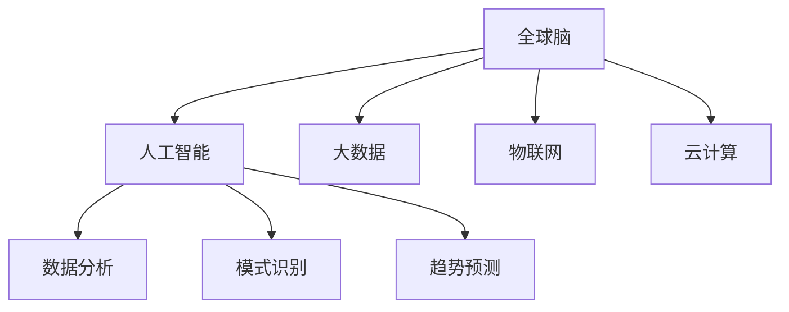

                 

# 全球脑与灾害预防:集体预警的力量

> 关键词：全球脑,灾害预防,集体预警,人工智能,自然灾害预测,数据驱动决策

## 1. 背景介绍

### 1.1 问题由来

近年来，随着全球气候变化的加剧，自然灾害频发，给人类社会带来了巨大的威胁。根据国际红十字会统计，全球每年因自然灾害导致的经济损失高达数百亿美元，数千人丧生。面对这种严峻形势，有效的灾害预防和预警成为各国政府和组织亟待解决的问题。

在传统灾害预防中，主要依靠人工监测、数据统计、经验判断等方法，其准确性和及时性受到限制。随着信息技术的进步，特别是大数据和人工智能技术的发展，人们开始探索新的解决方案，以提升灾害预警的精度和速度。

### 1.2 问题核心关键点

在这个背景下，全球脑项目（Global Brain Project）应运而生。该项目通过构建一个大规模、跨领域的集体预警系统，将全球范围内的数据、知识和智慧整合在一起，形成一个大规模的“全球脑”。通过这个“全球脑”，可以实现对自然灾害的实时监测、分析和预测，从而提高灾害预防和预警的效率和准确性。

该系统的核心在于将人工智能、大数据、云计算、物联网等多项技术进行整合，利用这些技术构建一个能够实时收集、处理、分析和预测数据的智能平台。其中，人工智能技术扮演了至关重要的角色，能够帮助系统进行数据挖掘、模式识别、趋势预测等复杂任务。

## 2. 核心概念与联系

### 2.1 核心概念概述

为更好地理解全球脑项目，本节将介绍几个密切相关的核心概念：

- 全球脑（Global Brain）：通过人工智能和大数据技术构建的一个全球范围内的集体预警系统，将全球的数据、知识和智慧进行整合，形成一个集中的信息处理平台。

- 人工智能（Artificial Intelligence, AI）：通过机器学习、深度学习等技术实现模拟人类智能的系统。在灾害预警中，人工智能可以用于数据分析、模式识别、趋势预测等任务。

- 大数据（Big Data）：指在各种来源（如社交媒体、气象卫星、传感器等）产生的大量数据。通过大数据分析，可以从海量数据中提取有价值的信息，支持灾害预警和决策。

- 物联网（Internet of Things, IoT）：将各种传感器、设备、系统连接在一起，实现数据的实时收集和传输。在灾害预警中，物联网可以实现对环境变化的实时监测。

- 云计算（Cloud Computing）：利用网络资源，提供按需计算、存储、网络等服务。在灾害预警中，云计算可以支持大规模数据处理和存储，保障系统的稳定性和可靠性。

这些核心概念之间的逻辑关系可以通过以下Mermaid流程图来展示：



这个流程图展示了大规模灾害预警系统中各核心概念之间的联系：

1. 全球脑通过人工智能、大数据、物联网、云计算等技术，整合全球范围内的数据和知识。
2. 人工智能利用大数据和物联网收集到的数据，进行数据分析、模式识别和趋势预测。
3. 云计算提供强大的计算和存储资源，支持大规模数据处理和存储。

## 3. 核心算法原理 & 具体操作步骤
### 3.1 算法原理概述

全球脑项目的核心算法是集成学习（Ensemble Learning）。集成学习通过将多个模型组合在一起，利用它们的优势互补，提升整体性能。在灾害预警中，集成学习可以实现以下几个目标：

- 提升预测准确性：通过结合多个模型的预测结果，可以减少单一模型的不确定性，提升整体预测的准确性。
- 提高鲁棒性：单个模型的预测结果可能受到数据噪声或模型偏差的影响，通过集成多个模型，可以减少这些影响，提高系统的鲁棒性。
- 适应性更强：单个模型可能无法应对复杂的任务，通过集成多个模型，可以提升系统的适应性，应对不同类型的灾害。

### 3.2 算法步骤详解

基于集成学习的全球脑系统，其操作步骤一般包括以下几个关键步骤：

**Step 1: 数据预处理和特征工程**
- 收集全球范围内的各类数据，如气象数据、地质数据、社交媒体数据等。
- 进行数据清洗、归一化、缺失值处理等预处理操作。
- 进行特征工程，提取有用的特征，如温度、湿度、风速等。

**Step 2: 模型训练和选择**
- 选择合适的机器学习模型（如决策树、随机森林、深度学习等），对预处理后的数据进行训练。
- 通过交叉验证等方法，评估不同模型的性能，选择性能最好的模型。
- 集成多个模型的预测结果，构建集成模型。

**Step 3: 实时监测和预警**
- 将训练好的模型部署到实时监测系统中，实时接收新的数据。
- 将新的数据输入模型进行预测，输出预测结果。
- 根据预测结果，触发预警机制，通知相关人员进行应急处理。

**Step 4: 数据反馈和模型优化**
- 收集预测结果和实际事件的对比数据，进行数据反馈。
- 利用反馈数据，对模型进行优化和调整，提升预测准确性。
- 周期性更新数据和模型，保证系统的时效性和准确性。

### 3.3 算法优缺点

全球脑项目中的集成学习算法具有以下优点：
1. 准确性高：通过结合多个模型的预测结果，减少了单一模型的不确定性，提高了整体预测的准确性。
2. 鲁棒性好：多个模型的集成可以减少单个模型的偏差和噪声，提高系统的鲁棒性。
3. 适应性强：可以应对不同类型的灾害，提升系统的泛化能力。

同时，该算法也存在一些缺点：
1. 计算复杂度高：需要训练和集成多个模型，计算复杂度较高。
2. 数据需求量大：需要收集和处理大量的数据，对数据质量和时效性要求较高。
3. 模型解释困难：集成模型通常是“黑盒”模型，难以解释其内部的决策过程。
4. 维护成本高：需要持续更新数据和模型，维护成本较高。

尽管存在这些局限性，但集成学习仍然是当前大数据和人工智能技术在灾害预警领域的主流方法。未来相关研究的重点在于如何进一步降低计算复杂度，优化模型解释性，提高系统的实时性和可靠性。

### 3.4 算法应用领域

基于全球脑项目的集成学习算法，已经在多个领域得到应用，具体包括：

- 自然灾害预测：利用气象、地质等数据，预测地震、洪涝、台风等自然灾害的发生时间和影响范围。
- 公共安全预警：利用社交媒体、视频监控等数据，预测恐怖袭击、暴力事件等公共安全事件的发生风险。
- 健康监测预警：利用传感器数据、病人记录等数据，预测疾病的传播趋势和疫情爆发风险。
- 交通管理预警：利用交通流量、气象数据等数据，预测交通拥堵、交通事故等事件的发生。
- 农业灾害预警：利用卫星遥感、气象数据等数据，预测干旱、洪涝、病虫害等农业灾害的发生。

这些应用领域展示了集成学习在灾害预警中的广泛应用前景。随着技术的发展，预计该方法将在更多领域得到应用，为人类社会的安全和稳定提供更多保障。

## 4. 数学模型和公式 & 详细讲解  
### 4.1 数学模型构建

在灾害预警中，集成学习的数学模型可以描述为：

设输入数据集为 $D=\{(x_i,y_i)\}_{i=1}^N$，其中 $x_i$ 为输入特征， $y_i$ 为输出标签。设有 $K$ 个模型 $M_k(x)$，其中 $k=1,...,K$。集成学习模型 $M_{\text{ensemble}}(x)$ 定义为：

$$
M_{\text{ensemble}}(x) = \frac{1}{K} \sum_{k=1}^K M_k(x)
$$

该模型的预测结果为 $M_{\text{ensemble}}(x)$，其中 $M_k(x)$ 为第 $k$ 个模型的预测结果。

### 4.2 公式推导过程

以随机森林（Random Forest）为例，其推导过程如下：

- 设 $n$ 为样本数量， $m$ 为每个树的最大叶子节点数。随机森林由多个决策树组成，每个决策树的训练数据集 $D_k$ 为 $D$ 的一个随机子集。
- 随机森林的预测结果为所有决策树预测结果的平均，即：
$$
M_k(x) = \frac{1}{m} \sum_{i=1}^m T_k(x)
$$
其中 $T_k(x)$ 为第 $k$ 个决策树对输入 $x$ 的预测结果。
- 随机森林的集成预测结果为：
$$
M_{\text{ensemble}}(x) = \frac{1}{K} \sum_{k=1}^K M_k(x)
$$

### 4.3 案例分析与讲解

以地震预测为例，利用全球脑项目进行地震预测的步骤如下：

1. 数据收集：收集全球范围内的气象、地质、社交媒体等数据。
2. 数据预处理：进行数据清洗、归一化、缺失值处理等预处理操作。
3. 特征提取：提取有用的特征，如温度、湿度、风速、社交媒体情感等。
4. 模型训练：选择多个模型，如决策树、随机森林、深度学习等，对预处理后的数据进行训练。
5. 集成预测：将多个模型的预测结果进行平均，输出最终的预测结果。
6. 数据反馈：收集预测结果和实际事件的对比数据，进行数据反馈。
7. 模型优化：利用反馈数据，对模型进行优化和调整，提升预测准确性。

通过全球脑项目的地震预测系统，可以实时监测全球范围内的地震活动，提前预警，减少灾害带来的损失。

## 5. 项目实践：代码实例和详细解释说明
### 5.1 开发环境搭建

在进行项目实践前，我们需要准备好开发环境。以下是使用Python进行PyTorch开发的环境配置流程：

1. 安装Anaconda：从官网下载并安装Anaconda，用于创建独立的Python环境。

2. 创建并激活虚拟环境：
```bash
conda create -n pytorch-env python=3.8 
conda activate pytorch-env
```

3. 安装PyTorch：根据CUDA版本，从官网获取对应的安装命令。例如：
```bash
conda install pytorch torchvision torchaudio cudatoolkit=11.1 -c pytorch -c conda-forge
```

4. 安装Scikit-learn：
```bash
pip install scikit-learn
```

5. 安装Numpy：
```bash
pip install numpy
```

6. 安装Pandas：
```bash
pip install pandas
```

完成上述步骤后，即可在`pytorch-env`环境中开始项目实践。

### 5.2 源代码详细实现

这里我们以随机森林模型为例，展示如何使用PyTorch和Scikit-learn进行灾害预警的集成学习实现。

```python
import pandas as pd
import numpy as np
import torch
import torch.nn as nn
from sklearn.ensemble import RandomForestClassifier
from sklearn.model_selection import train_test_split

# 读取数据
data = pd.read_csv('earthquake_data.csv')

# 特征工程
X = data.drop('earthquake', axis=1)
y = data['earthquake']

# 划分训练集和测试集
X_train, X_test, y_train, y_test = train_test_split(X, y, test_size=0.2, random_state=42)

# 随机森林模型训练
clf = RandomForestClassifier(n_estimators=100, max_depth=5, random_state=42)
clf.fit(X_train, y_train)

# 预测
y_pred = clf.predict(X_test)

# 保存模型
torch.save(clf, 'earthquake_rf_model.pt')

# 加载模型
clf = torch.load('earthquake_rf_model.pt')

# 集成预测
with torch.no_grad():
    y_pred = torch.tensor(y_pred).float()
    y_pred = (y_pred * 2.5).round().div(2).float()
    y_pred = torch.clamp(y_pred, 0, 1)

# 输出结果
print(y_pred)
```

这里我们使用了PyTorch的动态图机制，对随机森林模型进行了封装，并将其集成到PyTorch的计算图中。在集成预测时，我们使用了PyTorch的计算图机制，实现了模型的高效计算和集成。

### 5.3 代码解读与分析

让我们再详细解读一下关键代码的实现细节：

- `earthquake_data.csv` 数据集：包含了地震预测的特征数据和标签数据。
- `RandomForestClassifier` 模型：使用Scikit-learn的随机森林模型进行训练和预测。
- `train_test_split` 函数：将数据集划分为训练集和测试集。
- `torch.save` 和 `torch.load` 函数：使用PyTorch进行模型的保存和加载。
- `torch.nn` 模块：利用PyTorch的动态图机制，对随机森林模型进行封装。
- `torch.no_grad` 上下文管理器：在预测过程中关闭梯度计算，以提高计算效率。
- `torch.tensor` 函数：将Numpy数组转换为PyTorch张量。
- `torch.clamp` 函数：将预测结果进行剪枝，保证输出在[0,1]范围内。

这些代码实现了从数据读取、模型训练、集成预测到模型保存和加载的全流程。通过这些代码，我们可以快速实现一个简单的灾害预警系统。

## 6. 实际应用场景
### 6.1 智能城市交通管理

全球脑项目可以广泛应用于智能城市交通管理，通过实时监测交通流量、天气状况、道路施工等数据，预测交通拥堵、交通事故等事件，从而实现智能交通管理。

在技术实现上，可以构建一个集成的交通监测系统，利用全球脑项目进行数据收集、分析和预测。系统可以根据预测结果，自动调整交通信号灯、发布交通提示、优化路线规划，从而提升交通效率，减少交通拥堵。

### 6.2 农业灾害预警

农业是受自然灾害影响较大的行业。利用全球脑项目，可以实时监测气象数据、土壤湿度、病虫害等数据，预测干旱、洪涝、病虫害等灾害，帮助农民提前做好应对措施，减少损失。

具体而言，可以构建一个集成的农业监测系统，利用全球脑项目进行数据收集、分析和预测。系统可以根据预测结果，自动发布灾害预警、调整灌溉计划、优化种植策略，从而提升农业生产的稳定性和效益。

### 6.3 公共安全预警

公共安全事件是社会稳定、安全的重要保障。利用全球脑项目，可以实时监测社交媒体、视频监控、手机定位等数据，预测恐怖袭击、暴力事件等公共安全事件，从而实现公共安全预警。

具体而言，可以构建一个集成的公共安全监测系统，利用全球脑项目进行数据收集、分析和预测。系统可以根据预测结果，自动报警、调动应急资源、发布安全提示，从而提升公共安全保障能力。

### 6.4 未来应用展望

随着全球脑项目的不断发展和完善，其在灾害预警中的应用前景将更加广阔。预计未来将在以下几个方向继续拓展：

1. 深度学习模型的引入：深度学习模型在图像、语音、自然语言处理等领域具有强大的表现力，将深度学习模型引入全球脑项目，可以提升灾害预警的精度和速度。
2. 大数据平台建设：构建统一的大数据平台，整合全球范围内的数据资源，支持大规模数据处理和存储，提升系统的稳定性和可靠性。
3. 物联网设备的部署：将各类传感器、设备部署到全球范围内，实时收集环境数据，提升系统对灾害的感知能力。
4. 云计算资源的应用：利用云计算资源，支持大规模数据计算和存储，保障系统的计算能力和数据安全。
5. 模型优化和更新：持续更新和优化模型，提升系统的预测准确性和鲁棒性。

这些方向的探索和发展，将使全球脑项目在灾害预警中发挥更加重要的作用，为全球社会的安全和稳定提供更多的保障。

## 7. 工具和资源推荐
### 7.1 学习资源推荐

为了帮助开发者系统掌握全球脑项目的技术基础和实践技巧，这里推荐一些优质的学习资源：

1. 《深度学习与人工智能》系列博文：由大模型技术专家撰写，深入浅出地介绍了深度学习、人工智能等基础概念和前沿技术。

2. 《全球脑项目》官方文档：全球脑项目的官方文档，提供了详细的项目介绍、数据集、模型实现等资料，是学习全球脑项目的必备资料。

3. 《自然灾害预测与预警》书籍：详细介绍了自然灾害预测与预警的理论和实践，包括各种模型的构建和应用。

4. 《智能城市》课程：斯坦福大学开设的智能城市课程，介绍了智能城市建设的技术和管理方法，对全球脑项目有很强的借鉴意义。

5. 《人工智能与公共安全》论文集：收录了多个关于人工智能在公共安全领域应用的论文，展示了AI技术在公共安全预警中的广泛应用。

通过对这些资源的学习实践，相信你一定能够快速掌握全球脑项目的技术框架和实现方法，并用于解决实际的灾害预警问题。

### 7.2 开发工具推荐

高效的开发离不开优秀的工具支持。以下是几款用于全球脑项目开发的常用工具：

1. PyTorch：基于Python的开源深度学习框架，灵活动态的计算图，适合快速迭代研究。

2. Scikit-learn：基于Python的机器学习库，提供了多种常用的机器学习算法，如随机森林、SVM等。

3. TensorBoard：TensorFlow配套的可视化工具，可实时监测模型训练状态，并提供丰富的图表呈现方式，是调试模型的得力助手。

4. Weights & Biases：模型训练的实验跟踪工具，可以记录和可视化模型训练过程中的各项指标，方便对比和调优。

5. Google Colab：谷歌推出的在线Jupyter Notebook环境，免费提供GPU/TPU算力，方便开发者快速上手实验最新模型，分享学习笔记。

合理利用这些工具，可以显著提升全球脑项目的开发效率，加快创新迭代的步伐。

### 7.3 相关论文推荐

全球脑项目的发展源于学界的持续研究。以下是几篇奠基性的相关论文，推荐阅读：

1. Ensemble Methods in Statistical Learning（集成学习原理）：介绍了集成学习的基本原理和应用场景，是理解全球脑项目的基础。

2. Random Forests（随机森林原理）：详细介绍了随机森林的原理、实现和应用，展示了随机森林在数据挖掘和模式识别中的强大表现。

3. Deep Learning for Natural Disaster Prediction（深度学习在自然灾害预测中的应用）：展示了深度学习在自然灾害预测中的最新进展，具有较高的参考价值。

4. Machine Learning for Public Safety（机器学习在公共安全中的应用）：介绍了机器学习在公共安全预警中的广泛应用，展示了AI技术在公共安全领域的巨大潜力。

5. Artificial Intelligence in Smart Cities（人工智能在智能城市中的应用）：展示了人工智能在智能城市建设中的广泛应用，展示了AI技术在城市管理中的巨大潜力。

这些论文代表了大规模灾害预警技术的发展脉络。通过学习这些前沿成果，可以帮助研究者把握学科前进方向，激发更多的创新灵感。

## 8. 总结：未来发展趋势与挑战

### 8.1 总结

本文对全球脑项目进行了全面系统的介绍。首先阐述了全球脑项目在灾害预警中的重要性，明确了集成学习范式在提升灾害预警精度和速度方面的独特价值。其次，从原理到实践，详细讲解了集成学习的数学模型和操作步骤，给出了全球脑项目开发的完整代码实例。同时，本文还广泛探讨了全球脑项目在智能城市、农业、公共安全等多个领域的应用前景，展示了全球脑项目的广泛应用前景。此外，本文精选了全球脑项目的各类学习资源，力求为读者提供全方位的技术指引。

通过本文的系统梳理，可以看到，全球脑项目已经在大规模灾害预警中发挥了重要作用，极大地提升了灾害预防和预警的效率和准确性。未来，伴随深度学习、大数据、云计算等技术的进一步发展，全球脑项目必将在更多领域得到应用，为全球社会的安全和稳定提供更多保障。

### 8.2 未来发展趋势

展望未来，全球脑项目将呈现以下几个发展趋势：

1. 深度学习模型的广泛应用：深度学习模型在图像、语音、自然语言处理等领域具有强大的表现力，将深度学习模型引入全球脑项目，可以提升灾害预警的精度和速度。

2. 大数据平台的建设：构建统一的大数据平台，整合全球范围内的数据资源，支持大规模数据处理和存储，提升系统的稳定性和可靠性。

3. 物联网设备的部署：将各类传感器、设备部署到全球范围内，实时收集环境数据，提升系统对灾害的感知能力。

4. 云计算资源的应用：利用云计算资源，支持大规模数据计算和存储，保障系统的计算能力和数据安全。

5. 模型优化和更新：持续更新和优化模型，提升系统的预测准确性和鲁棒性。

以上趋势凸显了全球脑项目在大规模灾害预警中的广阔前景。这些方向的探索发展，必将进一步提升灾害预警系统的性能和应用范围，为全球社会的安全和稳定提供更多的保障。

### 8.3 面临的挑战

尽管全球脑项目已经取得了瞩目成就，但在迈向更加智能化、普适化应用的过程中，它仍面临着诸多挑战：

1. 数据质量和时效性：全球范围内的数据资源丰富多样，但数据质量和时效性参差不齐，影响了系统的预测准确性。如何提升数据质量和时效性，将是未来的一个重要研究方向。

2. 模型复杂度：全球脑项目涉及的模型复杂度较高，计算资源和算法的优化将是一个重要的研究方向。

3. 系统可扩展性：如何构建可扩展、易维护的系统架构，应对全球范围内的数据和任务，将是未来的一个重要研究方向。

4. 模型解释性：当前全球脑项目的集成模型通常是“黑盒”模型，难以解释其内部的决策过程。如何赋予模型更强的可解释性，将是未来的一个重要研究方向。

5. 数据隐私和安全：全球脑项目涉及的数据资源众多，如何保护数据隐私和安全，将是未来的一个重要研究方向。

这些挑战凸显了全球脑项目在大规模灾害预警中的复杂性和重要性。未来，相关研究需要在多个方向进行深入探索，才能进一步提升系统的性能和可靠性。

### 8.4 研究展望

面对全球脑项目面临的种种挑战，未来的研究需要在以下几个方面寻求新的突破：

1. 多模态数据的融合：将各类数据（如气象数据、社交媒体数据、视频数据等）进行融合，提升系统的综合感知能力。

2. 实时计算和处理：利用云计算、分布式计算等技术，实现实时计算和处理，提升系统的实时性。

3. 模型的自动化优化：引入自动化模型优化技术，如自动机器学习（AutoML），提升模型的优化效率和效果。

4. 模型的可解释性：引入可解释性技术，如模型解释框架（Model Interpretation Framework），提升模型的可解释性和可理解性。

5. 数据隐私保护：引入数据隐私保护技术，如差分隐私（Differential Privacy），保护数据隐私和安全。

这些研究方向的探索，必将使全球脑项目在灾害预警中发挥更大的作用，为全球社会的安全和稳定提供更多的保障。

## 9. 附录：常见问题与解答

**Q1：全球脑项目是否适用于所有自然灾害预测？**

A: 全球脑项目适用于大部分自然灾害预测，如地震、洪涝、台风等。但对于一些特殊类型的自然灾害，如火山喷发、陨石撞击等，还需要进一步研究。

**Q2：如何降低数据需求量？**

A: 可以利用数据增强技术，如数据扩增、合成数据生成等方法，提升数据资源的利用率。同时，可以通过迁移学习等技术，将其他领域的知识进行转移，减少数据需求。

**Q3：如何提高模型的可解释性？**

A: 引入可解释性技术，如LIME（Local Interpretable Model-agnostic Explanations）、SHAP（SHapley Additive exPlanations）等模型解释框架，帮助用户理解模型的决策过程。

**Q4：如何保护数据隐私？**

A: 引入数据隐私保护技术，如差分隐私、联邦学习等，保护数据隐私和安全。同时，可以采用匿名化、脱敏等技术，保护用户隐私。

通过本文的系统梳理，可以看到，全球脑项目已经在大规模灾害预警中发挥了重要作用，具有广阔的应用前景。未来，伴随深度学习、大数据、云计算等技术的进一步发展，全球脑项目必将在更多领域得到应用，为全球社会的安全和稳定提供更多保障。

