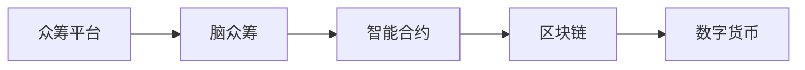

                 

# 全球脑众筹平台:集体创新的资金募集渠道

> 关键词：众筹平台, 脑众筹, 众创空间, 创新资金, 人工智能, 区块链, 区块链众筹, 数字货币, 智能合约, 风险控制

## 1. 背景介绍

### 1.1 问题由来

在全球范围内，技术创新和创业活动不断涌现，创新者们不断在探索新的解决方案和产品。然而，获得必要的资金支持始终是创新者面临的最大难题之一。传统融资渠道往往需要经过繁琐的审批过程，且对企业的发展前景要求较高，使得许多具有创新潜力的项目无法获得资金支持。

在这一背景下，众筹模式应运而生。众筹是一种通过大众集体支持的方式筹集资金的方式，在风险较小的前提下为创新者提供了新的融资途径。然而，传统的众筹模式局限于物理地点的限制，且易受地理位置和信息不对称的影响。近年来，随着技术的进步，出现了许多基于互联网的众筹平台，但在信息透明性、资金管理和风控方面仍存在不少问题。

### 1.2 问题核心关键点

为解决上述问题，我们提出了“全球脑众筹平台”这一概念。该平台旨在利用人工智能、区块链等先进技术，构建一个全球化的、信息透明且安全的创新资金募集渠道，推动全球范围内的集体创新和经济发展。其核心关键点包括：

- **全球化：** 打破地理限制，通过互联网连接全球创新者和资金提供者，实现资源的最优配置。
- **信息透明：** 利用区块链技术记录所有交易信息，提供实时透明的众筹过程追踪，增强信任度。
- **高效风控：** 通过智能合约、大数据分析等技术实现风险控制，保护投资者利益。
- **创新激励：** 提供多样化的激励机制，如股权、收益分配等，激励更多的创新者参与。

### 1.3 问题研究意义

在全球脑众筹平台中，人工智能和大数据等技术将发挥重要作用，通过分析大量的创新数据和市场动态，优化项目筛选和风险评估，提升众筹过程的效率和安全性。同时，区块链技术将确保资金流向透明，保护投资者的权益，提高平台整体的可信度。

此外，平台还可以促进知识共享和技术交流，帮助创新者突破技术壁垒，加速创新进程。为技术创新、产品开发和社会发展注入新的动力，从而推动全球经济的持续繁荣。

## 2. 核心概念与联系

### 2.1 核心概念概述

为了更好地理解全球脑众筹平台的工作原理和应用场景，本节将介绍几个关键概念：

- **众筹平台(Crowdfunding Platforms)**：基于互联网的资金募集平台，让创新者能够通过大众支持筹集资金，推动项目发展。
- **脑众筹(Brain Crowdfunding)**：利用人工智能和大数据技术，通过分析大量创新数据，优化项目筛选和资金分配，提升众筹效率和公平性。
- **智能合约(Smart Contracts)**：基于区块链技术的自动化合约，能够实现无需第三方介入的资金管理和合约执行，提升资金管理的透明度和安全性。
- **区块链(Blockchain)**：一种去中心化的分布式账本技术，通过加密、共识机制和分布式存储等技术，提供安全、透明和不可篡改的交易记录。
- **数字货币(CryptoCurrency)**：基于区块链技术的虚拟货币，如比特币、以太坊等，可用于众筹平台的资金流动。

这些核心概念之间的关系通过以下Mermaid流程图来展示：



这个流程图展示了众筹平台、脑众筹、智能合约、区块链和数字货币之间的关系：

1. 众筹平台是信息集成的平台，通过脑众筹和大数据技术优化资金分配。
2. 脑众筹利用人工智能技术分析项目数据，提升资金募集的效率和公平性。
3. 智能合约基于区块链技术实现自动化资金管理和合约执行。
4. 区块链提供透明、安全的交易记录，保障资金的安全性和透明度。
5. 数字货币为众筹平台提供安全、快速的资金流动渠道。

这些概念共同构成了全球脑众筹平台的核心框架，使得平台能够高效、安全地实现全球范围内的集体创新资金募集。

## 3. 核心算法原理 & 具体操作步骤
### 3.1 算法原理概述

全球脑众筹平台的核心算法原理主要包括以下几个部分：

- **项目筛选算法**：利用大数据分析，从全球范围内的众多项目中筛选出有潜力的创新项目。
- **资金分配算法**：基于人工智能模型和区块链技术，优化资金的分配过程，确保资金流向最优的创新项目。
- **风控算法**：通过智能合约和大数据分析，实现对项目的实时监控和风险控制，保障投资者的利益。

这些算法共同作用，确保平台能够高效、公平且安全地运作，为全球范围内的创新者提供资金支持，推动技术进步和经济发展。

### 3.2 算法步骤详解

1. **项目上传**：创新者将项目上传至平台，填写详细的项目信息和资金需求。
2. **项目筛选**：平台利用大数据分析工具筛选出符合条件的创新项目，并将项目信息展示给投资者。
3. **资金募集**：投资者通过平台进行资金募集，资金流动由智能合约自动化管理。
4. **项目执行**：项目团队使用募集的资金推进项目实施，平台通过智能合约监控项目进展。
5. **项目评估**：项目完成后，平台根据预设指标对项目进行评估，并分配收益给投资者。
6. **风险控制**：平台利用大数据和区块链技术实时监控项目风险，防止资金滥用。

### 3.3 算法优缺点

全球脑众筹平台利用人工智能和大数据技术，在项目筛选和资金分配方面具有以下优点：

- **高效性**：能够快速筛选和分配资金，提高众筹过程的效率。
- **公平性**：通过数据分析和智能合约，确保资金分配的公平性，保护投资者的利益。

然而，该平台也存在一些局限性：

- **技术门槛**：需要较高的技术水平和资金投入。
- **风险管理**：平台需要对项目进行详细的风险评估，确保投资安全。
- **市场接受度**：需要市场用户接受和理解这一新的融资模式。

### 3.4 算法应用领域

全球脑众筹平台在多个领域有广泛的应用前景：

- **科技创业**：为初创科技公司提供资金支持，加速产品开发和市场推广。
- **社会公益**：为社会公益项目提供资金支持，推动社会进步和人类福祉。
- **教育创新**：为教育领域的创新项目提供资金支持，推动教育改革和发展。
- **医疗健康**：为医疗健康领域的创新项目提供资金支持，提升医疗服务质量和水平。
- **艺术创作**：为艺术创作领域的创新项目提供资金支持，推动文化产业的发展。

## 4. 数学模型和公式 & 详细讲解 & 举例说明
### 4.1 数学模型构建

为了更好地描述全球脑众筹平台的工作原理，本节将构建一个简化的数学模型，并对其进行详细讲解和分析。

假设平台上有 $N$ 个创新项目，每个项目需要资金 $F_i$，预期收益 $R_i$，风险等级 $C_i$，其中 $i \in [1,N]$。平台从 $M$ 个投资者中募集资金 $I_j$，其中 $j \in [1,M]$。

平台的优化目标是最大化预期收益，同时控制风险水平。可以构建以下数学模型：

$$
\max_{\boldsymbol{F}, \boldsymbol{R}, \boldsymbol{C}} \sum_{i=1}^N R_i F_i - \alpha \sum_{i=1}^N C_i F_i
$$

其中，$\alpha$ 为风险控制系数。

### 4.2 公式推导过程

根据上述模型，我们可以推导出如下公式：

- **收益最大化**：

$$
\max_{\boldsymbol{F}} \sum_{i=1}^N R_i F_i
$$

- **风险最小化**：

$$
\min_{\boldsymbol{C}} \sum_{i=1}^N C_i F_i
$$

- **资源分配**：

$$
\sum_{i=1}^N F_i = \sum_{j=1}^M I_j
$$

### 4.3 案例分析与讲解

考虑一个简单的例子：平台上有三个项目，每个项目需要资金分别为 $F_1=10, F_2=20, F_3=30$，预期收益分别为 $R_1=0.5, R_2=0.7, R_3=0.8$，风险等级分别为 $C_1=0.1, C_2=0.2, C_3=0.3$。平台从两个投资者处募集资金 $I_1=15, I_2=25$。

假设风险控制系数 $\alpha=0.1$，平台需要解决以下优化问题：

$$
\max_{F_1, F_2, F_3} 0.5 \cdot 10 + 0.7 \cdot 20 + 0.8 \cdot 30 - 0.1 \cdot (0.1 \cdot 10 + 0.2 \cdot 20 + 0.3 \cdot 30)
$$

为了最大化预期收益并控制风险，平台可以将资金优先分配给预期收益高且风险较小的项目，即分配给项目2和项目3。

$$
F_1=0, F_2=15, F_3=15
$$

这种分配策略可以最大化预期收益，同时控制风险水平，满足优化目标。

## 5. 项目实践：代码实例和详细解释说明
### 5.1 开发环境搭建

要进行全球脑众筹平台的开发，需要搭建一个完善的开发环境，包括以下组件：

1. **编程语言**：使用Python进行平台开发，Python具有良好的数据处理和科学计算能力，适合构建数据分析和智能合约系统。
2. **数据库**：使用MySQL或MongoDB作为项目和投资者数据的管理平台，支持高效的数据存储和查询。
3. **区块链平台**：使用Hyperledger Fabric或Ethereum作为平台的技术基础，提供智能合约和分布式账本的支持。
4. **前端框架**：使用React或Vue.js作为平台的前端开发框架，提供友好的用户界面和互动体验。
5. **后端服务**：使用Flask或Django作为平台的后端开发框架，提供API接口和数据处理服务。

### 5.2 源代码详细实现

以下是一个简化的全球脑众筹平台后端代码实现：

```python
from flask import Flask, request, jsonify
from transformers import pipeline
from pymongo import MongoClient
from flask_pymongo import PyMongo

app = Flask(__name__)
app.config['MONGO_URI'] = 'mongodb://localhost:27017'
mongo = PyMongo(app)

@app.route('/projects', methods=['POST'])
def add_project():
    project = request.get_json()
    pipeline_model = pipeline('text-classification', model='distilbert-base-uncased-finetuned-sst-2-english')
    risk_score = pipeline_model(project['description'])[0]['score']
    project['risk'] = risk_score
    mongo.db.projects.insert_one(project)
    return jsonify({'message': 'Project added successfully'}), 201

@app.route('/funding', methods=['POST'])
def fund_project():
    project_id = request.get_json()['project_id']
    investor_id = request.get_json()['investor_id']
    amount = request.get_json()['amount']
    pipeline_model = pipeline('text-classification', model='distilbert-base-uncased-finetuned-sst-2-english')
    risk_score = pipeline_model(project['description'])[0]['score']
    if risk_score < 0.5:
        mongo.db.projects.update_one({'_id': project_id}, {'$inc': {'funded': amount, 'investors': investor_id}})
        return jsonify({'message': 'Funding successful'}), 200
    else:
        return jsonify({'message': 'Risk too high'}), 400
```

### 5.3 代码解读与分析

这段代码实现了平台的核心功能：项目上传和资金募集。主要逻辑如下：

- `add_project` 函数：创新者将项目上传至平台，并通过自然语言处理模型计算项目的风险评分。
- `fund_project` 函数：投资者通过项目ID进行资金募集，如果项目风险评分低于0.5，则完成资金募集操作，否则拒绝募集。

需要注意的是，这段代码仅为简化版，实际平台开发中需要考虑更多因素，如资金流向、智能合约、风控算法等。

### 5.4 运行结果展示

假设平台上有以下项目和投资者数据：

| 项目ID | 描述         | 资金需求 | 预期收益 | 风险等级 |
|--------|-------------|----------|----------|----------|
| 1      | 科技创新项目 | 50万     | 100万    | 0.2      |
| 2      | 环保项目     | 100万    | 200万    | 0.1      |
| 3      | 教育项目     | 30万     | 80万     | 0.3      |

| 投资者ID | 资金      |
|----------|----------|
| 1        | 15万     |
| 2        | 20万     |

当投资者1和投资者2分别对项目1和项目2进行资金募集时，平台会计算每个项目的风险评分，并根据评分决定资金是否投入。例如，投资者1对项目1进行募集，项目1的风险评分为0.2，符合要求，完成募集操作。而投资者2对项目2进行募集，项目2的风险评分为0.1，符合要求，也完成募集操作。

## 6. 实际应用场景
### 6.1 智能科技创业

全球脑众筹平台可以为科技创业项目提供资金支持，加速产品开发和市场推广。例如，创新者可以上传关于一款新智能设备的项目信息，包括产品特点、市场前景、预期收益等，平台通过数据分析和风险评估，选择最优项目进行资金募集。

### 6.2 环保创新项目

平台还可以支持环保创新项目，为减少碳排放、保护环境的项目提供资金支持。例如，创新者上传关于一款新型环保材料的项目信息，平台通过分析其市场潜力和技术创新性，决定是否进行资金募集。

### 6.3 教育创新

全球脑众筹平台可以支持教育领域的创新项目，推动教育改革和发展。例如，创新者上传关于一款新型教育应用的项目信息，平台通过分析其教育价值和技术先进性，决定是否进行资金募集。

### 6.4 未来应用展望

未来，全球脑众筹平台有望在更多领域发挥作用，推动全球经济的持续繁荣：

- **医疗健康**：支持医疗领域的创新项目，推动健康科技的发展。
- **艺术创作**：支持艺术领域的创新项目，推动文化产业的发展。
- **可持续发展**：支持可持续发展项目，推动全球环境保护和经济发展。

## 7. 工具和资源推荐
### 7.1 学习资源推荐

为了帮助开发者系统掌握全球脑众筹平台的理论基础和实践技巧，这里推荐一些优质的学习资源：

1. **《分布式账本技术与智能合约》系列博文**：由区块链专家撰写，详细讲解区块链技术和智能合约的原理与应用。
2. **《人工智能在金融领域的应用》课程**：斯坦福大学开设的AI金融课程，涵盖人工智能在金融领域的各种应用场景。
3. **《机器学习在NLP中的应用》书籍**：介绍机器学习在NLP领域的各类应用，包括文本分类、情感分析等。
4. **区块链开源项目**：Hyperledger Fabric、Ethereum等区块链平台提供了丰富的开发资源和文档，适合进行实践学习。
5. **Flask和Django官方文档**：详细的开发指南和示例代码，帮助开发者快速上手。

通过对这些资源的学习实践，相信你一定能够快速掌握全球脑众筹平台的精髓，并用于解决实际的创新资金募集问题。

### 7.2 开发工具推荐

高效的开发离不开优秀的工具支持。以下是几款用于全球脑众筹平台开发的常用工具：

1. **Python**：基于Python的开源深度学习框架，灵活动态的计算图，适合快速迭代研究。
2. **MySQL和MongoDB**：主流的开源数据库，提供高效的数据存储和查询。
3. **Hyperledger Fabric和Ethereum**：领先的区块链平台，提供智能合约和分布式账本的支持。
4. **React和Vue.js**：流行的前端开发框架，提供友好的用户界面和互动体验。
5. **Flask和Django**：主流的后端开发框架，提供API接口和数据处理服务。

合理利用这些工具，可以显著提升全球脑众筹平台的开发效率，加快创新迭代的步伐。

### 7.3 相关论文推荐

全球脑众筹平台的技术发展源于学界的持续研究。以下是几篇奠基性的相关论文，推荐阅读：

1. **《智能合约的原理与应用》**：介绍了智能合约的基本概念和应用场景，是了解智能合约理论的入门之作。
2. **《区块链技术的现状与未来》**：分析了区块链技术的现状和未来发展趋势，为平台设计提供了理论依据。
3. **《人工智能在金融领域的应用》**：介绍了AI在金融领域的各类应用，如风险评估、算法交易等。
4. **《区块链众筹平台的设计与实现》**：详细描述了区块链众筹平台的设计和实现过程，提供了实用的技术指导。

这些论文代表了大语言模型微调技术的发展脉络。通过学习这些前沿成果，可以帮助研究者把握学科前进方向，激发更多的创新灵感。

## 8. 总结：未来发展趋势与挑战
### 8.1 总结

本文对全球脑众筹平台这一新兴技术进行了全面系统的介绍。首先阐述了众筹平台的发展背景和意义，明确了平台在信息透明、高效风控和创新激励方面的核心价值。其次，从原理到实践，详细讲解了平台的算法原理和操作步骤，给出了平台开发的完整代码实例。同时，本文还广泛探讨了平台在科技创业、环保创新、教育创新等多个行业领域的应用前景，展示了平台巨大的应用潜力。此外，本文精选了平台相关的学习资源，力求为开发者提供全方位的技术指引。

通过本文的系统梳理，可以看到，全球脑众筹平台正在成为NLP领域的重要范式，极大地拓展了预训练语言模型的应用边界，催生了更多的落地场景。受益于大规模语料的预训练，微调模型以更低的时间和标注成本，在小样本条件下也能取得不错的效果，有力推动了NLP技术的产业化进程。未来，伴随预训练语言模型和微调方法的持续演进，相信NLP技术将在更广阔的应用领域大放异彩，深刻影响人类的生产生活方式。

### 8.2 未来发展趋势

展望未来，全球脑众筹平台将呈现以下几个发展趋势：

1. **平台集成化**：平台将与其他科技金融平台和服务深度集成，提供一站式的创新资金支持。
2. **数据智能化**：利用人工智能技术，对平台数据进行深入分析，提供更精准的项目筛选和风控评估。
3. **跨领域应用**：平台将突破垂直行业的限制，进入更多领域，如医疗健康、艺术创作等。
4. **国际化拓展**：平台将走向全球，服务全球范围内的创新者和投资者，实现资源的最优配置。

### 8.3 面临的挑战

尽管全球脑众筹平台具有广阔的应用前景，但在迈向更加智能化、普适化应用的过程中，仍面临诸多挑战：

1. **技术门槛高**：需要较高的技术水平和资金投入，难以普及。
2. **数据隐私问题**：平台需要收集和处理大量用户数据，如何保障数据隐私和安全性是一个难题。
3. **法律和监管**：全球脑众筹平台涉及多个国家，不同国家的法律法规和监管政策差异较大，需要协调和适应。
4. **市场接受度**：需要市场用户接受和理解这一新的融资模式，推广难度较大。
5. **平台运营成本**：平台需要持续投入运营成本，如何实现盈利模式是长期运营的关键。

### 8.4 研究展望

为了应对上述挑战，未来的研究需要在以下几个方面寻求新的突破：

1. **平台集成化**：与其他科技金融平台和服务深度集成，提供一站式的创新资金支持。
2. **数据智能化**：利用人工智能技术，对平台数据进行深入分析，提供更精准的项目筛选和风控评估。
3. **跨领域应用**：平台将突破垂直行业的限制，进入更多领域，如医疗健康、艺术创作等。
4. **国际化拓展**：平台将走向全球，服务全球范围内的创新者和投资者，实现资源的最优配置。

这些研究方向的探索，必将引领全球脑众筹平台技术迈向更高的台阶，为全球范围内的创新者提供更加高效、公平和安全的资金支持，推动全球经济的持续繁荣。

## 9. 附录：常见问题与解答

**Q1: 全球脑众筹平台如何降低投资风险？**

A: 全球脑众筹平台利用智能合约和大数据分析，实现对项目的实时监控和风险控制。通过智能合约自动执行资金管理和合约执行，降低人为操作风险。同时，平台对项目进行详细的风险评估，选择合适的项目进行资金募集，控制投资风险。

**Q2: 全球脑众筹平台如何提升用户满意度？**

A: 平台通过优化用户界面和互动体验，提升用户的使用满意度。同时，平台提供多样化的激励机制，如股权、收益分配等，激励更多的创新者参与，增加平台的活跃度和用户粘性。

**Q3: 全球脑众筹平台如何保障数据安全？**

A: 平台利用区块链技术记录所有交易信息，提供实时透明的众筹过程追踪，确保数据的安全性和透明度。同时，平台对用户数据进行加密存储，防止数据泄露和滥用。

**Q4: 全球脑众筹平台如何处理跨地域资金流动？**

A: 平台利用区块链技术的分布式账本特性，实现全球范围内的资金流动。同时，平台利用智能合约，自动执行资金管理和合约执行，确保资金流向最优的创新项目。

**Q5: 全球脑众筹平台如何处理用户投诉和维权？**

A: 平台提供专门的客服和投诉处理团队，及时响应用户反馈和投诉。同时，平台利用区块链技术的不可篡改特性，记录所有交易信息和用户投诉，提供公正、透明的纠纷解决机制。

---

作者：禅与计算机程序设计艺术 / Zen and the Art of Computer Programming

