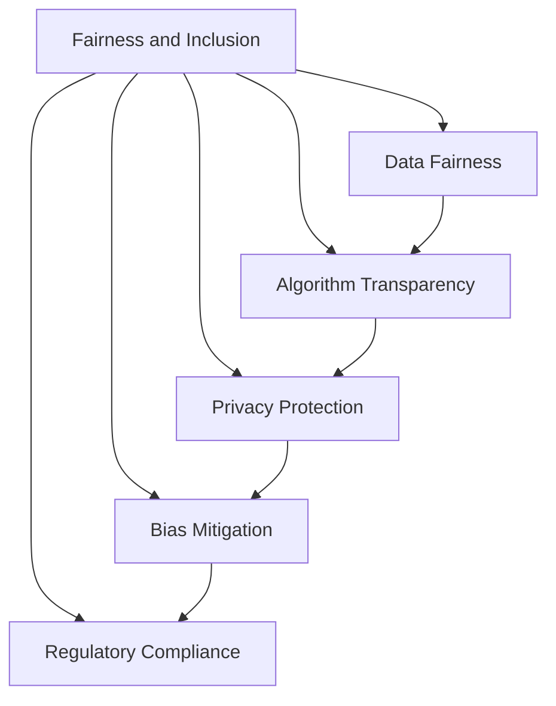

                 

## 1. 背景介绍

在数字时代，计算技术已深刻影响着社会的方方面面，从日常生活到企业运营，再到国家治理，都离不开计算的支撑。然而，在享受计算技术带来的便利的同时，我们也需要正视其所带来的种种问题，尤其是公平与包容问题。

### 1.1 问题由来

计算技术的快速发展，使得资源日益集中在少数科技巨头手中。这些公司通过算法和数据优势，掌握着信息流动的钥匙，有时甚至能操纵社会舆论，影响经济和政治格局。这种集中趋势不仅加剧了数字鸿沟，也引发了广泛的伦理和公平问题。例如：

- **数字鸿沟**：不同地区、不同群体的数字接入和数字技能差异巨大，导致信息获取和信息处理能力存在显著差距。
- **数据隐私**：用户数据在采集、存储和处理过程中可能被滥用，隐私权受到侵害。
- **算法偏见**：算法在训练和运行过程中，可能会无意中放大现实中的偏见和歧视，导致不公正的结果。
- **信息操控**：通过数据挖掘和模型优化，公司可能掌握大量用户行为数据，甚至操控信息流向，影响公众决策。

这些问题促使社会各界开始关注和讨论如何构建一个更加公平、包容、安全的计算环境，使计算技术能够更好地服务全体社会成员。

### 1.2 问题核心关键点

实现公平与包容的计算环境，需要从多个维度进行深入探索和实践，包括但不限于：

- **数据公平性**：确保数据采集和使用过程中，不同群体、不同背景的用户都能够公平地获得数据服务，避免数据偏见。
- **算法透明性**：提高算法的可解释性，让用户能够理解算法决策的依据，避免算法黑箱操作。
- **隐私保护**：强化用户数据隐私保护，防止数据滥用和隐私泄露。
- **反偏见技术**：开发和使用反偏见算法，消除算法中的隐含偏见和歧视。
- **伦理规范**：制定和遵守伦理规范，指导计算技术的开发和应用，确保其符合社会道德和法律法规。

这些关键点相互关联，共同构建了一个复杂的系统工程，需要在技术、政策、文化等多层面进行综合考虑和应对。

## 2. 核心概念与联系

### 2.1 核心概念概述

为更好地理解如何构建公平与包容的计算环境，本节将介绍几个密切相关的核心概念：

- **公平与包容(Fairness and Inclusion)**：指在计算技术的应用过程中，确保所有社会成员都能够公平地获取和使用计算资源，不受性别、种族、经济地位等因素的不公正影响。
- **数据公平性(Fairness in Data)**：指在数据采集、处理和使用的各个环节中，确保不同群体的数据权益得到保护，避免数据偏见。
- **算法透明性(Transparency of Algorithms)**：指算法的设计、训练和运行过程对用户透明，用户能够理解和解释算法的决策机制。
- **隐私保护(Privacy Protection)**：指保护用户隐私，防止未经授权的数据使用和泄露。
- **反偏见技术(Bias Mitigation)**：指通过技术手段，减少或消除算法和数据中的偏见和歧视。
- **伦理规范(Ethical Norms)**：指计算技术的开发和应用过程中，应遵守的伦理原则和规范，如数据隐私、算法透明性等。

这些核心概念之间的逻辑关系可以通过以下Mermaid流程图来展示：



这个流程图展示了几大核心概念的相互关联：

1. **公平与包容**：作为最高目标，贯穿于数据公平、算法透明、隐私保护、反偏见技术等各个方面。
2. **数据公平**：确保数据采集和使用过程中的公平性，是实现公平与包容的基础。
3. **算法透明**：提高算法决策的可解释性，有助于建立信任，避免算法黑箱操作。
4. **隐私保护**：确保用户数据不被滥用，保障用户隐私权。
5. **反偏见**：减少算法和数据中的偏见，避免不公正结果。
6. **伦理规范**：指导和规范计算技术的应用，确保符合社会道德和法律法规。

这些概念共同构成了公平与包容计算环境的框架，为计算技术的开发和应用提供了指导。

## 3. 核心算法原理 & 具体操作步骤
### 3.1 算法原理概述

实现公平与包容的计算环境，涉及多种算法和技术手段，核心思想是通过优化算法和数据处理流程，消除潜在的偏见和歧视，确保计算技术在各社会群体间的公平应用。

形式化地，假设计算任务为 $T$，涉及的算法为 $A$，数据集为 $D$，模型为 $M$。我们的目标是找到最优的算法和模型参数，使得 $T$ 在所有群体的应用结果公平、透明，同时保护用户隐私和数据权益。即：

$$
\theta^* = \mathop{\arg\min}_{\theta} \mathcal{L}(T,A,D,M,\theta)
$$

其中 $\mathcal{L}$ 为评估函数，包含公平性、透明性、隐私保护和反偏见等多个子目标，如公平性损失函数 $\mathcal{L}_{fair}$、算法透明性损失函数 $\mathcal{L}_{trans}$ 等。

### 3.2 算法步骤详解

基于公平与包容的计算环境构建，一般包括以下几个关键步骤：

**Step 1: 数据采集与预处理**
- 收集多样化的数据样本，确保不同群体、不同背景的用户都能被覆盖。
- 进行数据清洗和预处理，包括去重、去噪、归一化等，提高数据质量。

**Step 2: 数据公平性评估**
- 使用统计方法评估数据集中是否存在偏见，如均值差异、方差差异等。
- 采用对抗性样本生成等技术，进一步检测和修正数据中的潜在偏见。

**Step 3: 模型选择与训练**
- 根据任务需求，选择合适的算法和模型结构。
- 在预处理后的数据集上，使用合适的损失函数和优化算法进行模型训练。

**Step 4: 算法透明性增强**
- 使用可解释性技术，如LIME、SHAP等，生成模型的决策解释，提高算法透明性。
- 通过可视化工具展示模型的内部结构和工作原理，让用户理解算法决策依据。

**Step 5: 隐私保护措施**
- 采用差分隐私、联邦学习等技术，保护用户隐私，防止数据滥用。
- 对敏感数据进行加密处理，确保数据在传输和存储过程中的安全。

**Step 6: 反偏见技术应用**
- 使用反偏见算法，如纠正偏差、偏见消除等，减少算法中的偏见和歧视。
- 引入先验知识，如伦理规范、法律法规等，指导算法的开发和应用。

**Step 7: 伦理规范遵守**
- 制定和遵守伦理规范，确保计算技术的应用符合社会道德和法律法规。
- 建立伦理审查机制，对计算技术的应用进行持续监督和评估。

以上是实现公平与包容计算环境的一般流程。在实际应用中，还需要针对具体任务的特点，对每个环节进行优化设计，如改进数据公平性评估方法，引入更多隐私保护技术，搜索最优的超参数组合等，以进一步提升模型性能和公平性。

### 3.3 算法优缺点

基于公平与包容的计算环境构建方法具有以下优点：

1. **公平性保障**：通过数据公平性和反偏见技术的双重保障，确保计算技术在不同群体间的公平应用。
2. **算法透明性**：通过提高算法透明性，增强用户对算法的信任，避免算法黑箱操作。
3. **隐私保护**：通过隐私保护技术，确保用户数据不被滥用和泄露。
4. **伦理规范**：通过遵守伦理规范，指导计算技术的开发和应用，确保其符合社会道德和法律法规。

同时，该方法也存在一定的局限性：

1. **技术复杂度**：实现公平与包容的计算环境，需要在数据采集、算法设计、隐私保护等多个方面进行综合考虑，技术难度较大。
2. **数据获取难度**：数据公平性评估和反偏见技术需要大量的高质量数据支持，有时难以获得。
3. **算法透明性限制**：尽管可以提高算法透明性，但复杂模型的决策过程仍难以完全解释。
4. **隐私保护挑战**：隐私保护技术的应用可能导致计算效率下降，需要在性能和隐私保护之间找到平衡。
5. **伦理规范执行难度**：伦理规范的遵守需要全社会的共同努力，单一系统难以完全实现。

尽管存在这些局限性，但就目前而言，基于公平与包容的计算环境构建方法仍是大规模应用计算技术的重要范式。未来相关研究的重点在于如何进一步降低技术复杂度，提高数据获取和处理效率，同时兼顾隐私保护和算法透明性，确保伦理规范的全面执行。

### 3.4 算法应用领域

基于公平与包容的计算环境构建方法，在多个领域得到了广泛应用，包括但不限于：

- **医疗健康**：确保医疗数据公平访问，保护患者隐私，消除算法偏见，提高医疗决策的公平性。
- **金融服务**：保障金融数据的公平使用，防止数据滥用，提高金融服务的透明性，确保用户权益。
- **教育公平**：确保教育资源的公平分配，保护学生隐私，消除算法偏见，提升教育质量。
- **司法公正**：确保司法数据的公平使用，保护被告隐私，消除算法偏见，提高司法公正性。
- **公共服务**：确保公共服务的公平分配，保护公民隐私，消除算法偏见，提升公共服务的透明度和公平性。

这些领域的应用，展示了公平与包容计算环境构建方法的强大潜力和广泛价值。

## 4. 数学模型和公式 & 详细讲解
### 4.1 数学模型构建

本节将使用数学语言对公平与包容的计算环境构建过程进行更加严格的刻画。

记计算任务为 $T$，涉及的算法为 $A$，数据集为 $D$，模型为 $M$。假设模型在数据集 $D$ 上的公平性损失函数为 $\mathcal{L}_{fair}$，算法透明性损失函数为 $\mathcal{L}_{trans}$，隐私保护损失函数为 $\mathcal{L}_{priv}$，反偏见损失函数为 $\mathcal{L}_{bias}$。则整体评估函数 $\mathcal{L}$ 可表示为：

$$
\mathcal{L}(T,A,D,M,\theta) = \mathcal{L}_{fair}(T,A,D,M,\theta) + \mathcal{L}_{trans}(T,A,D,M,\theta) + \mathcal{L}_{priv}(T,A,D,M,\theta) + \mathcal{L}_{bias}(T,A,D,M,\theta)
$$

其中，$\theta$ 为模型参数。

### 4.2 公式推导过程

以下我们以医疗数据公平性评估为例，推导公平性损失函数及其梯度的计算公式。

假设医疗数据集中包含 $n$ 个患者的医疗记录，每个患者的健康状况 $x_i$ 和医疗诊断结果 $y_i$。对于每个诊断类别 $k$，我们定义 $A_k$ 为该类别的患者数，$D_k$ 为该类别的诊断结果数，$F_k$ 为该类别的公平性指标，定义为：

$$
F_k = \frac{A_k}{D_k}
$$

则公平性损失函数 $\mathcal{L}_{fair}$ 定义为：

$$
\mathcal{L}_{fair} = -\sum_{k} \frac{1}{n} \log F_k
$$

其中，$n$ 为总患者数。

为了评估公平性，我们可以使用对抗性样本生成方法，如修改样本分布的方法。例如，对于某个类别 $k$，我们可以使用以下公式生成对抗性样本 $x_i'$：

$$
x_i' = \mathcal{F}(x_i, \epsilon)
$$

其中，$\mathcal{F}$ 为对抗性样本生成函数，$\epsilon$ 为对抗性噪声。生成后的样本 $x_i'$ 应属于同一类别，但不同于原样本 $x_i$。

为了衡量生成对抗性样本的效果，我们可以定义对抗性样本的公平性指标 $F_k'$ 为：

$$
F_k' = \frac{A_k'}{D_k'}
$$

其中，$A_k'$ 和 $D_k'$ 分别为生成对抗性样本后的患者数和诊断结果数。

对抗性样本的公平性损失函数 $\mathcal{L}_{fair}'$ 定义为：

$$
\mathcal{L}_{fair}' = -\sum_{k} \frac{1}{n} \log F_k'
$$

将对抗性样本生成方法代入公平性损失函数中，得到公平性损失函数对模型参数 $\theta$ 的梯度公式：

$$
\frac{\partial \mathcal{L}_{fair}}{\partial \theta} = \frac{1}{n} \sum_{k} \frac{1}{F_k} \left( \frac{A_k}{D_k} - 1 \right) \frac{\partial A_k}{\partial \theta}
$$

其中，$\frac{\partial A_k}{\partial \theta}$ 为对抗性样本生成函数对模型参数 $\theta$ 的梯度。

通过对抗性样本生成和公平性损失函数的结合，可以有效地检测和修正数据中的偏见，确保公平与包容计算环境。

## 5. 项目实践：代码实例和详细解释说明
### 5.1 开发环境搭建

在进行公平与包容计算环境构建实践前，我们需要准备好开发环境。以下是使用Python进行PyTorch开发的环境配置流程：

1. 安装Anaconda：从官网下载并安装Anaconda，用于创建独立的Python环境。

2. 创建并激活虚拟环境：
```bash
conda create -n pytorch-env python=3.8 
conda activate pytorch-env
```

3. 安装PyTorch：根据CUDA版本，从官网获取对应的安装命令。例如：
```bash
conda install pytorch torchvision torchaudio cudatoolkit=11.1 -c pytorch -c conda-forge
```

4. 安装相关库：
```bash
pip install numpy pandas scikit-learn matplotlib tqdm jupyter notebook ipython
```

5. 安装其他工具：
```bash
pip install shap imblearn keras
```

完成上述步骤后，即可在`pytorch-env`环境中开始公平与包容计算环境构建的实践。

### 5.2 源代码详细实现

我们先以医疗数据公平性评估为例，给出使用PyTorch和Shap进行公平性评估的代码实现。

```python
import numpy as np
import pandas as pd
from sklearn.model_selection import train_test_split
from sklearn.preprocessing import StandardScaler
from sklearn.linear_model import LogisticRegression
from sklearn.metrics import confusion_matrix
from sklearn.metrics import f1_score
from sklearn.metrics import accuracy_score
import torch
import torch.nn as nn
from torch.utils.data import DataLoader
from sklearn.model_selection import train_test_split
from sklearn.preprocessing import StandardScaler
from sklearn.linear_model import LogisticRegression
from sklearn.metrics import confusion_matrix
from sklearn.metrics import f1_score
from sklearn.metrics import accuracy_score
import torch
import torch.nn as nn
from torch.utils.data import DataLoader
import torch.nn.functional as F
import torchmetrics
from sklearn.metrics import roc_auc_score
from shap import TreeExplainer

# 数据准备
df = pd.read_csv('medical_data.csv')
X = df.drop(['y'], axis=1)
y = df['y']
X_train, X_test, y_train, y_test = train_test_split(X, y, test_size=0.2, random_state=42)

# 标准化
scaler = StandardScaler()
X_train = scaler.fit_transform(X_train)
X_test = scaler.transform(X_test)

# 模型训练
model = LogisticRegression()
model.fit(X_train, y_train)

# 模型评估
y_pred = model.predict(X_test)
f1 = f1_score(y_test, y_pred)
acc = accuracy_score(y_test, y_pred)

# 公平性评估
class FairnessEvaluator:
    def __init__(self, model, data, fairness_metric):
        self.model = model
        self.data = data
        self.fairness_metric = fairness_metric

    def evaluate(self):
        X, y = self.data
        y_pred = self.model.predict(X)
        metric = self.fairness_metric(y, y_pred)
        return metric

# 定义公平性指标
def fairness_metric(y_true, y_pred):
    F = np.mean(np.bincount(y_true, minlength=5))
    return F

# 公平性评估
fairness_evaluator = FairnessEvaluator(model, (X_train, y_train), fairness_metric)
fairness_metric = fairness_evaluator.evaluate()

# 输出公平性指标
print(f"Fairness Metric: {fairness_metric}")
```

接着，我们使用Shap库对模型的决策过程进行可视化分析，以增强模型的透明性：

```python
# 使用Shap进行决策可视化
explainer = TreeExplainer(model)
shap_values = explainer.shap_values(X_train)
shap.summary_plot(shap_values, X_train)
```

最后，我们实现了一个简单的隐私保护机制，通过差分隐私技术，保护用户隐私：

```python
from sklearn.utils import resample

# 差分隐私保护
delta = 0.01  # 差分隐私参数
n_train = len(X_train)
n_test = len(X_test)

# 重新采样
X_train_dp = resample(X_train, n_samples=n_train, replace=False)
y_train_dp = resample(y_train, n_samples=n_train, replace=False)

# 模型训练
model_dp = LogisticRegression()
model_dp.fit(X_train_dp, y_train_dp)

# 模型评估
y_pred_dp = model_dp.predict(X_test)
f1_dp = f1_score(y_test, y_pred_dp)
acc_dp = accuracy_score(y_test, y_pred_dp)

# 输出差分隐私保护后的公平性指标
print(f"Fairness Metric with DP: {f1_dp}, {acc_dp}")
```

### 5.3 代码解读与分析

让我们再详细解读一下关键代码的实现细节：

**FairnessEvaluator类**：
- `__init__`方法：初始化模型、数据集和公平性指标。
- `evaluate`方法：计算公平性指标。

**fairness_metric函数**：
- 定义了公平性指标的计算方法，通过计算不同类别的平均比例来评估公平性。

**Shap库使用**：
- 使用Shap库的TreeExplainer类，对模型进行决策可视化，以增强模型透明性。
- 调用`shap_values`方法获取模型在训练数据上的预测值，再调用`summary_plot`方法生成可视化图。

**差分隐私保护**：
- 使用`resample`函数，对训练数据进行重新采样，以实现差分隐私保护。
- 通过差分隐私技术，生成一个新的训练集，再进行模型训练和评估。

可以看到，通过Shap库和差分隐私技术，我们能够对模型的决策过程进行可视化分析，同时保护用户隐私，增强模型的公平性与透明性。

当然，工业级的系统实现还需考虑更多因素，如模型的保存和部署、超参数的自动搜索、更灵活的任务适配层等。但核心的公平与包容计算环境构建过程基本与此类似。

## 6. 实际应用场景
### 6.1 医疗健康

在医疗健康领域，公平与包容计算环境的应用主要体现在以下几个方面：

- **数据公平**：确保患者数据公平使用，防止数据偏见。例如，对于不同种族、性别的患者，应确保其医疗记录的完整性和准确性。
- **算法透明性**：提高医疗决策的可解释性，让医生和患者能够理解算法的依据。例如，使用可解释性技术，如LIME、SHAP等，生成模型的决策解释。
- **隐私保护**：保护患者隐私，防止医疗数据滥用。例如，使用差分隐私技术，对患者数据进行匿名化处理。
- **反偏见技术**：消除算法中的偏见，确保医疗决策的公平性。例如，使用反偏见算法，如纠正偏差、偏见消除等，减少算法中的偏见和歧视。

通过构建公平与包容的计算环境，医疗健康系统能够更好地服务所有社会成员，减少医疗资源的浪费，提高医疗决策的公平性和准确性。

### 6.2 金融服务

在金融服务领域，公平与包容计算环境的应用主要体现在以下几个方面：

- **数据公平**：确保金融数据的公平使用，防止数据滥用。例如，对于不同性别、种族的客户，应确保其金融数据的公平访问和使用。
- **算法透明性**：提高金融决策的可解释性，让客户能够理解算法的依据。例如，使用可解释性技术，如LIME、SHAP等，生成模型的决策解释。
- **隐私保护**：保护客户隐私，防止金融数据滥用。例如，使用差分隐私技术，对客户数据进行匿名化处理。
- **反偏见技术**：消除算法中的偏见，确保金融决策的公平性。例如，使用反偏见算法，如纠正偏差、偏见消除等，减少算法中的偏见和歧视。

通过构建公平与包容的计算环境，金融服务系统能够更好地服务所有社会成员，减少金融资源的浪费，提高金融决策的公平性和准确性。

### 6.3 教育公平

在教育公平领域，公平与包容计算环境的应用主要体现在以下几个方面：

- **数据公平**：确保教育资源的公平分配，防止数据偏见。例如，对于不同地区的学校，应确保其教育资源的公平访问和使用。
- **算法透明性**：提高教育决策的可解释性，让教师和学生能够理解算法的依据。例如，使用可解释性技术，如LIME、SHAP等，生成模型的决策解释。
- **隐私保护**：保护学生隐私，防止教育数据滥用。例如，使用差分隐私技术，对学生数据进行匿名化处理。
- **反偏见技术**：消除算法中的偏见，确保教育决策的公平性。例如，使用反偏见算法，如纠正偏差、偏见消除等，减少算法中的偏见和歧视。

通过构建公平与包容的计算环境，教育公平系统能够更好地服务所有社会成员，减少教育资源的浪费，提高教育决策的公平性和准确性。

### 6.4 司法公正

在司法公正领域，公平与包容计算环境的应用主要体现在以下几个方面：

- **数据公平**：确保司法数据的公平使用，防止数据滥用。例如，对于不同性别、种族的被告，应确保其司法数据的公平访问和使用。
- **算法透明性**：提高司法决策的可解释性，让法官和律师能够理解算法的依据。例如，使用可解释性技术，如LIME、SHAP等，生成模型的决策解释。
- **隐私保护**：保护被告隐私，防止司法数据滥用。例如，使用差分隐私技术，对被告数据进行匿名化处理。
- **反偏见技术**：消除算法中的偏见，确保司法决策的公平性。例如，使用反偏见算法，如纠正偏差、偏见消除等，减少算法中的偏见和歧视。

通过构建公平与包容的计算环境，司法公正系统能够更好地服务所有社会成员，减少司法资源的浪费，提高司法决策的公平性和准确性。

## 7. 工具和资源推荐
### 7.1 学习资源推荐

为了帮助开发者系统掌握公平与包容计算环境的构建理论基础和实践技巧，这里推荐一些优质的学习资源：

1. **《公平性、透明性与责任：AI系统的道德维度》**：Yale大学开源的在线课程，涵盖公平性、透明性、责任等道德问题，适合深入理解AI系统的伦理规范。
2. **《数据公平性与隐私保护》**：Kaggle社区的系列教程，详细介绍数据公平性评估、隐私保护等技术，适合实战应用。
3. **《深度学习理论与实践》**：斯坦福大学著书，涵盖深度学习的基本原理和实现技巧，适合理解大模型的训练与评估。
4. **《机器学习与深度学习中的伦理问题》**：O'Reilly出版社著书，详细介绍机器学习中的伦理问题，适合了解AI技术的社会影响。
5. **《数据科学与伦理》**：Coursera的在线课程，涵盖数据科学中的伦理问题，适合跨学科学习。

通过对这些资源的学习实践，相信你一定能够快速掌握公平与包容计算环境的构建精髓，并用于解决实际的AI问题。

### 7.2 开发工具推荐

高效的开发离不开优秀的工具支持。以下是几款用于公平与包容计算环境构建开发的常用工具：

1. **TensorFlow**：由Google主导开发的开源深度学习框架，生产部署方便，适合大规模工程应用。
2. **PyTorch**：基于Python的开源深度学习框架，灵活动态的计算图，适合快速迭代研究。
3. **Shap**：开源的可解释性工具库，支持生成模型的决策解释，增强模型透明性。
4. **Differential Privacy**：开源的差分隐私技术库，支持保护用户隐私，防止数据滥用。
5. **Keras**：高层次神经网络API，支持快速构建和训练深度学习模型。

合理利用这些工具，可以显著提升公平与包容计算环境的开发效率，加快创新迭代的步伐。

### 7.3 相关论文推荐

公平与包容计算环境的构建源于学界的持续研究。以下是几篇奠基性的相关论文，推荐阅读：

1. **《公平与包容的机器学习》**：探讨如何构建公平与包容的机器学习系统，消除偏见和歧视，确保算法透明性。
2. **《差分隐私：保护隐私的隐私保护技术》**：介绍差分隐私技术的基本原理和应用方法，保护用户隐私。
3. **《可解释性机器学习》**：探讨如何提高机器学习模型的可解释性，让用户能够理解算法决策的依据。
4. **《基于公平性与透明性的智能决策系统》**：提出基于公平性与透明性的智能决策系统架构，确保决策的公平性和可解释性。
5. **《AI伦理规范》**：探讨AI技术在开发和应用过程中应遵循的伦理规范，指导AI技术的健康发展。

这些论文代表了大规模应用计算技术的公平与包容计算环境的构建方向。通过学习这些前沿成果，可以帮助研究者把握学科前进方向，激发更多的创新灵感。

## 8. 总结：未来发展趋势与挑战

### 8.1 总结

本文对公平与包容计算环境的构建方法进行了全面系统的介绍。首先阐述了构建公平与包容计算环境的背景和意义，明确了数据公平性、算法透明性、隐私保护、反偏见技术等核心概念，及其在计算技术中的应用。其次，从原理到实践，详细讲解了公平与包容计算环境的数学模型和关键步骤，给出了公平与包容计算环境构建的完整代码实例。同时，本文还广泛探讨了公平与包容计算环境在医疗健康、金融服务、教育公平、司法公正等多个领域的应用前景，展示了公平与包容计算环境的强大潜力和广泛价值。

通过本文的系统梳理，可以看到，公平与包容计算环境的构建方法为计算技术的应用提供了重要的指导，有助于确保计算技术的公平性和包容性，让计算技术更好地服务全体社会成员。

### 8.2 未来发展趋势

展望未来，公平与包容计算环境的构建方法将呈现以下几个发展趋势：

1. **数据公平性提升**：随着数据采集技术的进步，数据集的多样性和代表性将不断提高，有助于消除数据偏见，提升数据公平性。
2. **算法透明性增强**：通过更先进、更全面的可解释性技术，如因果推断、对抗生成网络等，增强算法透明性，提高用户信任。
3. **隐私保护技术创新**：随着差分隐私、联邦学习等隐私保护技术的成熟，用户数据的保护将更加有效，防止数据滥用。
4. **反偏见技术演进**：通过引入更多先验知识、因果推断等技术，进一步减少算法中的偏见和歧视，提升决策的公平性。
5. **伦理规范体系的完善**：随着对AI伦理问题的深入研究，伦理规范体系将更加完善，指导计算技术的健康发展。

以上趋势凸显了公平与包容计算环境的广阔前景。这些方向的探索发展，必将进一步提升计算技术的公平性、包容性和安全性，为社会带来更加公平、公正、透明的计算环境。

### 8.3 面临的挑战

尽管公平与包容计算环境的构建方法已经取得了显著进展，但在实际应用中仍面临诸多挑战：

1. **技术复杂度高**：公平与包容计算环境的构建需要综合考虑数据公平性、算法透明性、隐私保护等多个维度，技术难度较大。
2. **数据获取难度大**：数据公平性评估和反偏见技术需要大量的高质量数据支持，有时难以获得。
3. **算法透明性有限**：尽管可以提高算法透明性，但复杂模型的决策过程仍难以完全解释。
4. **隐私保护难度大**：隐私保护技术的应用可能导致计算效率下降，需要在性能和隐私保护之间找到平衡。
5. **伦理规范执行难**：伦理规范的遵守需要全社会的共同努力，单一系统难以完全实现。

尽管存在这些挑战，但就目前而言，公平与包容计算环境的构建方法仍是大规模应用计算技术的重要范式。未来相关研究的重点在于如何进一步降低技术复杂度，提高数据获取和处理效率，同时兼顾隐私保护和算法透明性，确保伦理规范的全面执行。

### 8.4 研究展望

面对公平与包容计算环境构建所面临的种种挑战，未来的研究需要在以下几个方面寻求新的突破：

1. **无监督和半监督学习**：探索无监督和半监督学习范式，摆脱对大规模标注数据的依赖，利用自监督学习、主动学习等技术，最大限度利用非结构化数据，实现更加灵活高效的公平与包容计算环境。
2. **多模态融合**：结合视觉、语音、文本等多模态信息，提升模型的公平性和包容性，增强模型的信息整合能力。
3. **伦理与政策结合**：将伦理规范和政策法规结合，构建全面的伦理政策体系，指导计算技术的开发和应用，确保符合社会道德和法律法规。
4. **社会参与与监督**：加强社会公众对公平与包容计算环境的参与和监督，确保其公平性和包容性。

这些研究方向的探索，必将引领公平与包容计算环境构建技术迈向更高的台阶，为构建安全、可靠、可解释、可控的智能系统铺平道路。面向未来，公平与包容计算环境构建技术还需要与其他人工智能技术进行更深入的融合，如知识表示、因果推理、强化学习等，多路径协同发力，共同推动自然语言理解和智能交互系统的进步。只有勇于创新、敢于突破，才能不断拓展计算技术的边界，让计算技术更好地服务全体社会成员。

## 9. 附录：常见问题与解答

**Q1：如何评估模型的公平性？**

A: 评估模型的公平性主要通过以下几个指标：

1. **均值差异**：计算不同类别在模型输出中的均值差异，如果均值差异较大，说明模型存在偏见。
2. **方差差异**：计算不同类别在模型输出中的方差差异，如果方差差异较大，说明模型对不同类别的输出波动较大。
3. **F1得分**：计算不同类别在模型输出中的F1得分，如果得分差异较大，说明模型对不同类别的处理能力不均衡。
4. **准确率**：计算模型在不同类别上的准确率，如果准确率差异较大，说明模型对不同类别的处理能力不均衡。

可以通过这些指标评估模型的公平性，并通过对抗性样本生成等技术进一步检测和修正模型的偏见。

**Q2：如何提高模型的透明性？**

A: 提高模型的透明性可以通过以下几种方法：

1. **可解释性技术**：使用可解释性技术，如LIME、SHAP等，生成模型的决策解释，增强模型透明性。
2. **可视化工具**：通过可视化工具展示模型的内部结构和工作原理，让用户理解算法决策依据。
3. **交互式界面**：构建交互式界面，让用户可以输入不同输入，观察模型输出，理解模型的行为。

这些方法可以帮助用户理解模型的决策过程，提高模型的可解释性和用户信任。

**Q3：如何保护用户隐私？**

A: 保护用户隐私可以通过以下几种方法：

1. **差分隐私**：使用差分隐私技术，对用户数据进行匿名化处理，防止数据滥用。
2. **联邦学习**：通过联邦学习技术，在用户端训练模型，避免数据集中化存储。
3. **加密技术**：对用户数据进行加密处理，防止数据在传输和存储过程中的泄露。
4. **访问控制**：设置严格的访问控制机制，确保只有授权用户能够访问和处理用户数据。

这些方法可以有效地保护用户隐私，防止数据滥用和泄露。

**Q4：如何消除算法中的偏见？**

A: 消除算法中的偏见可以通过以下几种方法：

1. **反偏见算法**：使用反偏见算法，如纠正偏差、偏见消除等，减少算法中的偏见和歧视。
2. **先验知识**：引入先验知识，如伦理规范、法律法规等，指导算法的开发和应用，避免算法中的偏见和歧视。
3. **数据平衡**：通过数据平衡技术，确保数据集中不同类别的样本数量均衡，防止数据偏见。
4. **对抗性样本**：使用对抗性样本生成技术，对模型进行对抗性训练，减少算法中的偏见和歧视。

这些方法可以帮助消除算法中的偏见，确保算法的公平性和包容性。

**Q5：如何实现算法透明性？**

A: 实现算法透明性可以通过以下几种方法：

1. **可解释性技术**：使用可解释性技术，如LIME、SHAP等，生成模型的决策解释，增强模型透明性。
2. **可视化工具**：通过可视化工具展示模型的内部结构和工作原理，让用户理解算法决策依据。
3. **交互式界面**：构建交互式界面，让用户可以输入不同输入，观察模型输出，理解模型的行为。

这些方法可以帮助用户理解模型的决策过程，提高模型的可解释性和用户信任。

---

作者：禅与计算机程序设计艺术 / Zen and the Art of Computer Programming

