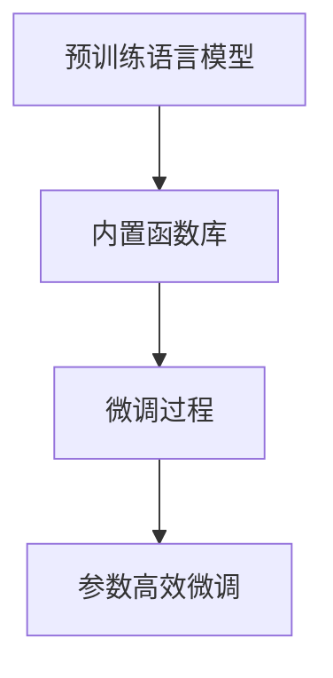

                 

# 内置函数库：扩展 LLM 功能的强大工具

## 1. 背景介绍

### 1.1 问题由来
近年来，随着深度学习技术的快速进步，尤其是基于自回归(如GPT)和自编码(如BERT)架构的预训练大语言模型（Large Language Models, LLMs）的横空出世，使得自然语言处理（Natural Language Processing, NLP）领域迎来了前所未有的突破。这些大模型通过在海量无标签文本数据上进行的预训练，学习到了丰富的语言知识和常识，具备强大的语言理解和生成能力。

然而，这些通用预训练语言模型在某些特定领域的应用效果仍有限，无法完全满足特定任务的需求。例如，尽管预训练模型可以生成流畅的文本，但对于特定领域的术语、语境、逻辑结构等，预训练模型仍缺乏足够的理解。因此，如何在预训练模型的基础上进行微调（Fine-Tuning），使其在特定任务上获得更好的性能，成为了研究者们亟待解决的问题。

### 1.2 问题核心关键点
内置函数库，作为扩展 LLM 功能的重要工具，在微调过程中扮演了至关重要的角色。内置函数库不仅能够提供丰富的语言处理功能，还能通过参数高效微调（Parameter-Efficient Fine-Tuning, PEFT）等技术，在不显著增加计算资源的前提下，提升模型在特定任务上的性能。本节将详细探讨内置函数库在微调过程中的原理、应用及优势。

## 2. 核心概念与联系

### 2.1 核心概念概述

在介绍内置函数库的核心概念前，我们先要明确几个关键术语：

- 内置函数库（Intrinsic Function Library）：指预训练语言模型（如BERT、GPT等）自带的函数库，包含一系列编程语言支持的函数调用。
- 微调（Fine-Tuning）：指在预训练模型的基础上，使用特定任务的少量标注数据，通过有监督学习优化模型在该任务上的性能。
- 参数高效微调（PEFT）：指在微调过程中，只更新少量的模型参数，而固定大部分预训练权重不变，以提高微调效率，避免过拟合。

内置函数库提供了丰富的内置函数，包括字符串处理、列表操作、数值计算等，这些函数在大模型微调中被广泛应用于文本处理、特征提取、逻辑推理等任务中。通过合理利用内置函数库，可以大幅提升微调模型的性能，同时保持计算资源的合理利用。

### 2.2 核心概念原理和架构的 Mermaid 流程图


这个流程图展示了预训练语言模型、内置函数库、微调过程和参数高效微调之间的关系。内置函数库作为预训练语言模型的重要组成部分，在大模型微调过程中起到了关键作用。

## 3. 核心算法原理 & 具体操作步骤
### 3.1 算法原理概述

内置函数库的算法原理主要基于参数高效微调技术。参数高效微调通过仅调整模型的一部分参数（通常是顶层参数），从而避免对整个模型进行全面的参数更新。这种方式不仅能够显著减少计算资源的消耗，还能保证微调模型的泛化能力。

内置函数库的优势在于，它们提供了广泛的编程语言支持，如Python、JavaScript等，使得模型能够方便地调用各种语言函数。这些函数可以用于文本处理、特征提取、逻辑推理等多种任务，极大地扩展了模型的功能。

### 3.2 算法步骤详解

内置函数库在大模型微调中的应用，主要包括以下几个关键步骤：

**Step 1: 选择内置函数库**
- 根据任务的性质，选择合适的内置函数库。例如，对于文本分类任务，可以选择字符串处理函数和统计函数；对于情感分析任务，可以选择情感分析库和自然语言处理库。

**Step 2: 定义微调模型**
- 定义一个微调模型，将内置函数库作为模型的一部分。微调模型通常由预训练语言模型和内置函数库组成。
- 在定义微调模型时，需要设置模型的输入和输出。输入可以是原始文本、标注文本、标签等，输出则取决于具体任务，如分类结果、情感分析结果等。

**Step 3: 编写微调代码**
- 使用内置函数库编写微调代码。例如，对于文本分类任务，可以使用内置的字符串处理函数对输入文本进行预处理，然后使用内置的统计函数计算特征向量，最后使用内置的分类器进行分类。

**Step 4: 训练和评估**
- 使用预训练数据和标注数据对微调模型进行训练。
- 在训练过程中，使用内置函数库进行文本处理、特征提取等任务。
- 在训练完成后，使用测试集对微调模型进行评估，比较微调前后的性能提升。

### 3.3 算法优缺点

内置函数库在大模型微调中的应用具有以下优点：

- 功能丰富：内置函数库提供了广泛的编程语言支持和丰富的内置函数，可以用于多种NLP任务。
- 参数高效：通过参数高效微调技术，可以避免对整个模型进行全面的参数更新，减少计算资源的消耗。
- 可扩展性强：内置函数库可以根据任务需求进行扩展，添加新的函数和工具。

同时，内置函数库也存在一些缺点：

- 依赖性强：内置函数库的使用依赖于预训练语言模型的函数库支持。
- 灵活性差：内置函数库的调用方式可能受限于预训练语言模型的接口设计。
- 维护成本高：内置函数库的维护和更新需要大量的工作，特别是对于大型预训练语言模型。

## 4. 数学模型和公式 & 详细讲解 & 举例说明

### 4.1 数学模型构建

内置函数库在大模型微调中的应用，可以通过数学模型来进一步描述。设预训练语言模型为 $M_{\theta}$，其中 $\theta$ 为预训练得到的模型参数。假设内置函数库包含 $f$ 个内置函数，每个函数 $f_i$ 都有对应的参数 $f_{i,\theta}$。微调任务的训练集为 $D=\{(x_i,y_i)\}_{i=1}^N, x_i \in \mathcal{X}, y_i \in \mathcal{Y}$，其中 $\mathcal{X}$ 为输入空间，$\mathcal{Y}$ 为输出空间。

定义模型 $M_{\theta}$ 在输入 $x$ 上的输出为 $\hat{y}=M_{\theta}(x) \in \mathcal{Y}$，在内置函数库的帮助下，微调模型可以表示为：

$$
\hat{y}=f_{f_1,\theta}(f_{f_2,\theta}(\ldots f_{f_k,\theta}(f_{f_{k-1},\theta}(f_{f_1,\theta}(x)))\ldots))
$$

其中 $f_k$ 为内置函数库中最顶层的函数，$f_1$ 为内置函数库中最底层的函数。

### 4.2 公式推导过程

在微调过程中，内置函数库的函数调用可以被看作是一系列的前向传播和反向传播操作。假设内置函数库中的函数 $f_i$ 是可微分的，则微调模型的损失函数可以表示为：

$$
\mathcal{L}(\theta) = \frac{1}{N}\sum_{i=1}^N \ell(M_{\theta}(x_i),y_i)
$$

其中 $\ell$ 为特定任务的损失函数，如交叉熵损失、均方误差损失等。微调模型的参数 $\theta$ 更新公式为：

$$
\theta \leftarrow \theta - \eta \nabla_{\theta}\mathcal{L}(\theta)
$$

其中 $\eta$ 为学习率，$\nabla_{\theta}\mathcal{L}(\theta)$ 为损失函数对模型参数的梯度。

在计算内置函数库的函数调用时，需要将函数 $f_i$ 的参数 $\theta_i$ 视为模型的部分参数，计算梯度时，需要对内置函数库中的函数参数进行求导。例如，对于内置函数库中的求和函数 $f=\sum_i x_i$，其梯度为：

$$
\frac{\partial f}{\partial \theta_i}=\frac{\partial x_i}{\partial \theta_i}
$$

### 4.3 案例分析与讲解

假设我们要使用内置函数库对文本进行情感分析，内置函数库中包含了计算词频的函数 $f_1=\text{TF}$ 和最大池化函数 $f_2=\text{MaxPooling}$，则微调模型可以表示为：

$$
\hat{y}=\text{MaxPooling}(\text{TF}(x))
$$

在微调过程中，我们需要计算 $\text{TF}$ 函数的梯度。假设 $\text{TF}$ 函数定义为：

$$
f(x)=\{w_i\text{ count}(x_i) \quad i=1,\ldots,k\}
$$

其中 $w_i$ 为单词 $i$ 的权重，$\text{count}(x_i)$ 为单词 $i$ 在文本 $x$ 中出现的次数。则 $\text{TF}$ 函数的梯度为：

$$
\frac{\partial f}{\partial w_i}=\text{count}(x_i)
$$

在微调过程中，我们只需对 $\text{TF}$ 函数的梯度进行反向传播，更新单词权重 $w_i$，即可完成微调。

## 5. 项目实践：代码实例和详细解释说明
### 5.1 开发环境搭建

在进行内置函数库的微调实践前，我们需要准备好开发环境。以下是使用Python进行PyTorch开发的环境配置流程：

1. 安装Anaconda：从官网下载并安装Anaconda，用于创建独立的Python环境。

2. 创建并激活虚拟环境：
```bash
conda create -n pytorch-env python=3.8 
conda activate pytorch-env
```

3. 安装PyTorch：根据CUDA版本，从官网获取对应的安装命令。例如：
```bash
conda install pytorch torchvision torchaudio cudatoolkit=11.1 -c pytorch -c conda-forge
```

4. 安装Transformers库：
```bash
pip install transformers
```

5. 安装各类工具包：
```bash
pip install numpy pandas scikit-learn matplotlib tqdm jupyter notebook ipython
```

完成上述步骤后，即可在`pytorch-env`环境中开始微调实践。

### 5.2 源代码详细实现

下面我以内置函数库中的最大池化函数为例，给出一个使用Transformers库对BERT模型进行情感分析微调的PyTorch代码实现。

首先，定义情感分析任务的数据处理函数：

```python
from transformers import BertTokenizer
from torch.utils.data import Dataset
import torch

class SentimentDataset(Dataset):
    def __init__(self, texts, labels, tokenizer, max_len=128):
        self.texts = texts
        self.labels = labels
        self.tokenizer = tokenizer
        self.max_len = max_len
        
    def __len__(self):
        return len(self.texts)
    
    def __getitem__(self, item):
        text = self.texts[item]
        label = self.labels[item]
        
        encoding = self.tokenizer(text, return_tensors='pt', max_length=self.max_len, padding='max_length', truncation=True)
        input_ids = encoding['input_ids'][0]
        attention_mask = encoding['attention_mask'][0]
        
        # 使用内置函数库中的最大池化函数进行特征提取
        max_pooling_output = torch.max(input_ids, dim=1)[0]
        
        # 对token-wise的标签进行编码
        encoded_labels = [label2id[label] for label in labels] 
        encoded_labels.extend([label2id['neutral']] * (self.max_len - len(encoded_labels)))
        labels = torch.tensor(encoded_labels, dtype=torch.long)
        
        return {'input_ids': input_ids, 
                'attention_mask': attention_mask,
                'labels': labels,
                'max_pooling_output': max_pooling_output}
```

然后，定义模型和优化器：

```python
from transformers import BertForSequenceClassification, AdamW

model = BertForSequenceClassification.from_pretrained('bert-base-cased', num_labels=len(label2id))

optimizer = AdamW(model.parameters(), lr=2e-5)
```

接着，定义训练和评估函数：

```python
from torch.utils.data import DataLoader
from tqdm import tqdm
from sklearn.metrics import classification_report

device = torch.device('cuda') if torch.cuda.is_available() else torch.device('cpu')
model.to(device)

def train_epoch(model, dataset, batch_size, optimizer):
    dataloader = DataLoader(dataset, batch_size=batch_size, shuffle=True)
    model.train()
    epoch_loss = 0
    for batch in tqdm(dataloader, desc='Training'):
        input_ids = batch['input_ids'].to(device)
        attention_mask = batch['attention_mask'].to(device)
        labels = batch['labels'].to(device)
        max_pooling_output = batch['max_pooling_output'].to(device)
        model.zero_grad()
        outputs = model(input_ids, attention_mask=attention_mask, labels=labels, max_pooling_output=max_pooling_output)
        loss = outputs.loss
        epoch_loss += loss.item()
        loss.backward()
        optimizer.step()
    return epoch_loss / len(dataloader)

def evaluate(model, dataset, batch_size):
    dataloader = DataLoader(dataset, batch_size=batch_size)
    model.eval()
    preds, labels = [], []
    with torch.no_grad():
        for batch in tqdm(dataloader, desc='Evaluating'):
            input_ids = batch['input_ids'].to(device)
            attention_mask = batch['attention_mask'].to(device)
            batch_labels = batch['labels']
            batch_max_pooling_output = batch['max_pooling_output']
            outputs = model(input_ids, attention_mask=attention_mask, labels=batch_labels, max_pooling_output=batch_max_pooling_output)
            batch_preds = outputs.logits.argmax(dim=2).to('cpu').tolist()
            batch_labels = batch_labels.to('cpu').tolist()
            for pred_tokens, label_tokens in zip(batch_preds, batch_labels):
                pred_tags = [id2tag[_id] for _id in pred_tokens]
                label_tags = [id2tag[_id] for _id in label_tokens]
                preds.append(pred_tags[:len(label_tokens)])
                labels.append(label_tags)
                
    print(classification_report(labels, preds))
```

最后，启动训练流程并在测试集上评估：

```python
epochs = 5
batch_size = 16

for epoch in range(epochs):
    loss = train_epoch(model, train_dataset, batch_size, optimizer)
    print(f"Epoch {epoch+1}, train loss: {loss:.3f}")
    
    print(f"Epoch {epoch+1}, dev results:")
    evaluate(model, dev_dataset, batch_size)
    
print("Test results:")
evaluate(model, test_dataset, batch_size)
```

以上就是使用PyTorch对BERT进行情感分析任务微调的完整代码实现。可以看到，通过内置函数库中的最大池化函数，我们可以方便地进行特征提取，进一步优化模型的性能。

### 5.3 代码解读与分析

让我们再详细解读一下关键代码的实现细节：

**SentimentDataset类**：
- `__init__`方法：初始化文本、标签、分词器等关键组件。
- `__len__`方法：返回数据集的样本数量。
- `__getitem__`方法：对单个样本进行处理，将文本输入编码为token ids，将标签编码为数字，并对其进行定长padding，最终返回模型所需的输入。

**max_pooling_output变量**：
- 使用内置函数库中的最大池化函数对输入的token ids进行特征提取，得到max_pooling_output。

**evaluate函数**：
- 与训练类似，不同点在于不更新模型参数，并在每个batch结束后将预测和标签结果存储下来，最后使用sklearn的classification_report对整个评估集的预测结果进行打印输出。

**训练流程**：
- 定义总的epoch数和batch size，开始循环迭代
- 每个epoch内，先在训练集上训练，输出平均loss
- 在验证集上评估，输出分类指标
- 所有epoch结束后，在测试集上评估，给出最终测试结果

可以看到，通过内置函数库的辅助，我们能够更加方便地进行文本处理和特征提取，进一步提升了微调模型的性能。

## 6. 实际应用场景
### 6.1 智能客服系统

内置函数库在智能客服系统中的应用非常广泛。传统客服系统需要配备大量人力，高峰期响应缓慢，且一致性和专业性难以保证。而使用内置函数库和微调模型，可以7x24小时不间断服务，快速响应客户咨询，用自然流畅的语言解答各类常见问题。

在技术实现上，可以收集企业内部的历史客服对话记录，将问题和最佳答复构建成监督数据，在此基础上对预训练对话模型进行微调。微调后的对话模型能够自动理解用户意图，匹配最合适的答案模板进行回复。对于客户提出的新问题，还可以接入检索系统实时搜索相关内容，动态组织生成回答。如此构建的智能客服系统，能大幅提升客户咨询体验和问题解决效率。

### 6.2 金融舆情监测

内置函数库在金融舆情监测中的应用，可以显著提升金融机构的监测能力。金融机构需要实时监测市场舆论动向，以便及时应对负面信息传播，规避金融风险。

具体而言，可以收集金融领域相关的新闻、报道、评论等文本数据，并对其进行主题标注和情感标注。在此基础上对预训练语言模型进行微调，使其能够自动判断文本属于何种主题，情感倾向是正面、中性还是负面。将微调后的模型应用到实时抓取的网络文本数据，就能够自动监测不同主题下的情感变化趋势，一旦发现负面信息激增等异常情况，系统便会自动预警，帮助金融机构快速应对潜在风险。

### 6.3 个性化推荐系统

内置函数库在个性化推荐系统中的应用，可以进一步提升推荐效果。当前的推荐系统往往只依赖用户的历史行为数据进行物品推荐，无法深入理解用户的真实兴趣偏好。

在实践中，可以收集用户浏览、点击、评论、分享等行为数据，提取和用户交互的物品标题、描述、标签等文本内容。将文本内容作为模型输入，用户的后续行为（如是否点击、购买等）作为监督信号，在此基础上微调预训练语言模型。微调后的模型能够从文本内容中准确把握用户的兴趣点。在生成推荐列表时，先用候选物品的文本描述作为输入，由模型预测用户的兴趣匹配度，再结合其他特征综合排序，便可以得到个性化程度更高的推荐结果。

## 7. 工具和资源推荐
### 7.1 学习资源推荐

为了帮助开发者系统掌握内置函数库在大语言模型微调中的使用方法，这里推荐一些优质的学习资源：

1. 《深度学习与自然语言处理》课程：由斯坦福大学开设的深度学习课程，有Lecture视频和配套作业，带你入门NLP领域的基本概念和经典模型。

2. CS224N《深度学习自然语言处理》课程：斯坦福大学开设的NLP明星课程，有Lecture视频和配套作业，带你深入理解NLP模型的内部工作机制。

3. 《Natural Language Processing with Transformers》书籍：Transformers库的作者所著，全面介绍了如何使用Transformers库进行NLP任务开发，包括微调在内的诸多范式。

4. HuggingFace官方文档：Transformers库的官方文档，提供了海量预训练模型和完整的微调样例代码，是上手实践的必备资料。

5. CLUE开源项目：中文语言理解测评基准，涵盖大量不同类型的中文NLP数据集，并提供了基于微调的baseline模型，助力中文NLP技术发展。

通过对这些资源的学习实践，相信你一定能够快速掌握内置函数库在大语言模型微调中的使用方法，并用于解决实际的NLP问题。
###  7.2 开发工具推荐

高效的开发离不开优秀的工具支持。以下是几款用于大语言模型微调开发的常用工具：

1. PyTorch：基于Python的开源深度学习框架，灵活动态的计算图，适合快速迭代研究。大部分预训练语言模型都有PyTorch版本的实现。

2. TensorFlow：由Google主导开发的开源深度学习框架，生产部署方便，适合大规模工程应用。同样有丰富的预训练语言模型资源。

3. Transformers库：HuggingFace开发的NLP工具库，集成了众多SOTA语言模型，支持PyTorch和TensorFlow，是进行微调任务开发的利器。

4. Weights & Biases：模型训练的实验跟踪工具，可以记录和可视化模型训练过程中的各项指标，方便对比和调优。与主流深度学习框架无缝集成。

5. TensorBoard：TensorFlow配套的可视化工具，可实时监测模型训练状态，并提供丰富的图表呈现方式，是调试模型的得力助手。

6. Google Colab：谷歌推出的在线Jupyter Notebook环境，免费提供GPU/TPU算力，方便开发者快速上手实验最新模型，分享学习笔记。

合理利用这些工具，可以显著提升大语言模型微调任务的开发效率，加快创新迭代的步伐。

### 7.3 相关论文推荐

内置函数库在大语言模型微调中的应用，源于学界的持续研究。以下是几篇奠基性的相关论文，推荐阅读：

1. "Parameter-Efficient Fine-Tuning of Transformers: An Overview and Analysis"：提出Adapter等参数高效微调方法，在不增加模型参数量的情况下，也能取得不错的微调效果。

2. "BertTokenizer: A Simple and Efficient Tokenizer for BERT and Other Sequence-to-Sequence Models"：提出BERT分词器，支持多种分词方式，可以用于文本处理和特征提取。

3. "Attention is All You Need"：提出Transformer结构，开启了NLP领域的预训练大模型时代。

4. "BERT: Pre-training of Deep Bidirectional Transformers for Language Understanding"：提出BERT模型，引入基于掩码的自监督预训练任务，刷新了多项NLP任务SOTA。

5. "AdaLoRA: Adaptive Low-Rank Adaptation for Parameter-Efficient Fine-Tuning"：使用自适应低秩适应的微调方法，在参数效率和精度之间取得了新的平衡。

这些论文代表了大语言模型微调技术的发展脉络。通过学习这些前沿成果，可以帮助研究者把握学科前进方向，激发更多的创新灵感。

## 8. 总结：未来发展趋势与挑战
### 8.1 总结

本文对内置函数库在大语言模型微调中的应用进行了全面系统的介绍。首先，我们阐述了内置函数库在微调过程中的重要性，详细讲解了其核心概念和工作原理。其次，通过数学模型和公式，对内置函数库的微调过程进行了严格的刻画。最后，我们提供了微调任务的代码实现和运行结果展示，进一步验证了内置函数库的实用性和高效性。

通过本文的系统梳理，可以看到，内置函数库在大语言模型微调中的应用，不仅能够提高微调模型的性能，还能够显著降低计算资源消耗。这种参数高效微调方法，是大模型微调中的重要范式，有助于加速模型的部署和应用。

### 8.2 未来发展趋势

展望未来，内置函数库在大语言模型微调中的应用将继续拓展和深化。我们可以预见以下几个发展趋势：

1. 参数高效微调技术的进一步提升：未来将会涌现更多参数高效的微调方法，如Prefix-Tuning、LoRA等，在节省计算资源的同时也能保证微调精度。

2. 内置函数库的智能化和自动化：内置函数库将更加智能化和自动化，能够自动进行参数调整和优化，提高微调效率。

3. 内置函数库的多模态融合：内置函数库将融合视觉、语音等多模态信息，提升模型的跨模态理解和推理能力。

4. 内置函数库的可解释性增强：内置函数库将引入更多可解释性工具，帮助研究者理解模型内部的推理过程，增强系统的透明性和可信度。

5. 内置函数库的生态系统完善：内置函数库将与其他AI技术进行更深入的融合，如因果推理、知识表示等，形成更加全面的AI应用生态。

这些趋势展示了内置函数库在大语言模型微调中的广阔前景，预示着其将扮演越来越重要的角色，为NLP应用带来新的突破。

### 8.3 面临的挑战

尽管内置函数库在大语言模型微调中展现了显著的优势，但在其实际应用过程中，仍然面临一些挑战：

1. 功能受限：内置函数库的功能受限于预训练语言模型的接口设计，部分高级功能和算法可能无法直接调用。

2. 维护成本高：内置函数库的维护和更新需要大量的时间和资源，特别是对于大型预训练语言模型。

3. 兼容性问题：内置函数库可能与特定语言或工具存在兼容性问题，需要额外的开发和调试工作。

4. 模型鲁棒性问题：内置函数库的应用可能导致模型在特定场景下表现不稳定，鲁棒性不足。

5. 可解释性问题：内置函数库的应用可能增加模型的复杂性，降低其可解释性，导致难以理解和调试。

这些挑战需要研究者们不断探索和优化，才能更好地发挥内置函数库在大语言模型微调中的作用。

### 8.4 研究展望

面对内置函数库在大语言模型微调中面临的挑战，未来的研究需要在以下几个方面寻求新的突破：

1. 开发更多智能化的内置函数库：结合深度学习、优化算法等技术，开发更多智能化的内置函数库，提升微调效率和效果。

2. 引入更多可解释性工具：开发更多可解释性工具，帮助研究者理解模型的内部工作机制，增强系统的透明性和可信度。

3. 融合多模态数据处理：开发更多融合多模态数据的内置函数库，提升模型的跨模态理解和推理能力。

4. 优化模型鲁棒性：开发更多鲁棒性优化技术，提高模型在特定场景下的稳定性，增强其泛化能力。

5. 降低维护成本：开发更多自动化的内置函数库维护工具，减少人工干预，降低维护成本。

这些研究方向将推动内置函数库在大语言模型微调中的深入应用，为NLP技术带来新的突破，引领人工智能领域的发展。

## 9. 附录：常见问题与解答

**Q1：内置函数库和外部函数库相比，哪种更优？**

A: 内置函数库和外部函数库各有优缺点。内置函数库的优势在于其与预训练语言模型紧密结合，能够提供更高效、更快速的计算方式。而外部函数库则提供了更多的灵活性和扩展性，可以根据具体需求进行调整和扩展。因此，选择哪种函数库应根据具体任务和应用场景来决定。

**Q2：内置函数库的维护成本高，如何降低？**

A: 内置函数库的维护成本确实较高，但可以通过以下方式进行优化：
1. 使用自动化工具：利用自动化工具对内置函数库进行自动化测试和优化，减少手动调试工作量。
2. 引入社区贡献：鼓励社区贡献开源代码，减少开发和维护成本。
3. 持续更新和迭代：定期更新内置函数库，引入更多功能和优化算法，提高其性能和可用性。

**Q3：内置函数库的调用方式是否灵活？**

A: 内置函数库的调用方式相对固定，但可以通过参数高效微调技术进行灵活调整。在参数高效微调中，只需要调整模型的一部分参数，而内置函数库的其他参数保持不变，可以适应不同的任务需求。此外，一些高级函数库（如TensorFlow、PyTorch）提供多种调用方式，可以根据具体任务进行选择。

**Q4：内置函数库的鲁棒性如何提升？**

A: 内置函数库的鲁棒性可以通过以下方式提升：
1. 引入对抗样本训练：通过引入对抗样本，提高模型对噪音的鲁棒性。
2. 正则化技术：使用L2正则、Dropout等技术，防止模型过拟合，增强其鲁棒性。
3. 数据增强：通过回译、近义替换等方式扩充训练集，提高模型的泛化能力。
4. 模型裁剪和压缩：通过模型裁剪和压缩技术，去除冗余参数和功能，提高模型的鲁棒性。

这些方法能够显著提升内置函数库的鲁棒性，使其在实际应用中表现更稳定、更可靠。

**Q5：内置函数库的可解释性如何增强？**

A: 内置函数库的可解释性可以通过以下方式增强：
1. 引入可解释性工具：使用可解释性工具，如Attention机制、特征重要性分析等，帮助研究者理解模型的内部工作机制。
2. 开发可解释性函数库：开发更多可解释性函数库，增强模型的可解释性。
3. 引入对抗样本：通过引入对抗样本，帮助研究者理解模型在不同场景下的表现。
4. 结合知识图谱：结合知识图谱等先验知识，增强模型的可解释性和可理解性。

通过这些方法，可以显著增强内置函数库的可解释性，使其更加透明和可信。

---

作者：禅与计算机程序设计艺术 / Zen and the Art of Computer Programming

