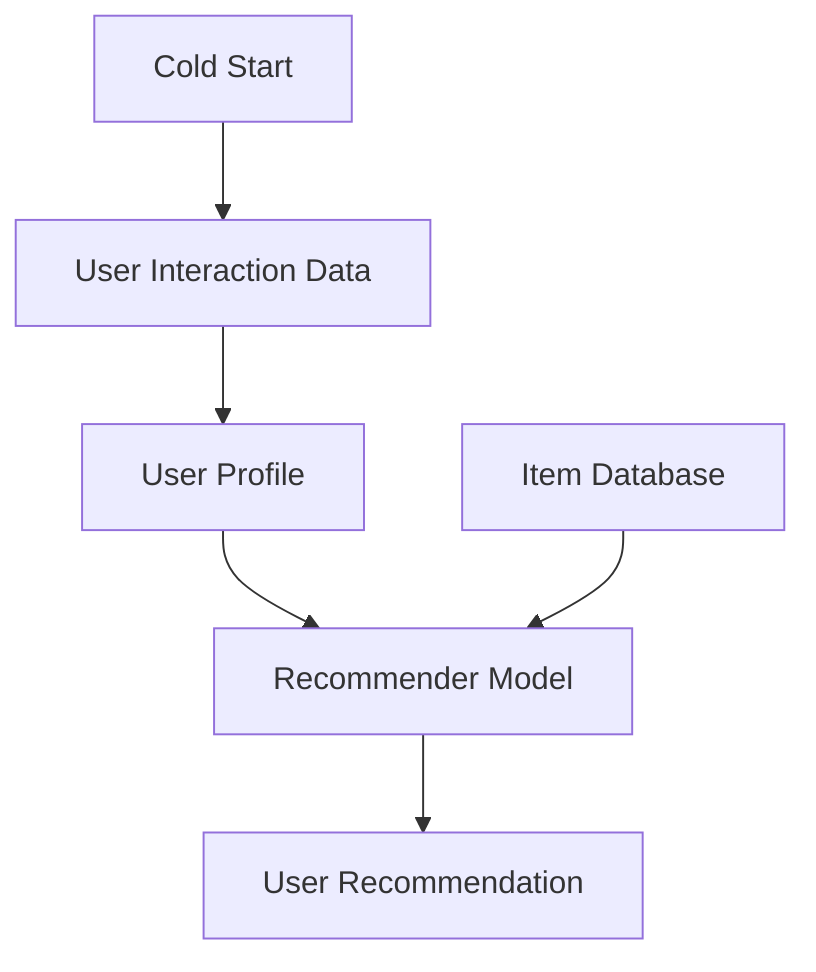

                 

# 冷启动场景的挑战：推荐系统的局限与解决方案

在当今信息爆炸的时代，推荐系统已成为互联网应用不可或缺的一部分，广泛应用于电商、社交、新闻媒体等多个领域，极大地提升了用户的使用体验和平台的用户黏性。然而，当用户在平台上的交互行为较少，甚至处于冷启动状态时，推荐系统往往面临诸多挑战，难以提供准确的推荐结果。本文将深入探讨冷启动场景下推荐系统的局限性，并提出一系列解决方案，帮助推荐系统在用户画像缺乏的情况下，提供满意的推荐服务。

## 1. 背景介绍

推荐系统（Recommender System）的目标是根据用户的历史行为和偏好，预测用户对物品的兴趣，从而为用户提供个性化的推荐。传统的推荐系统基于用户的显式反馈（如评分、点击、购买等），通过协同过滤、矩阵分解等算法，寻找用户之间的相似性，预测其对其他未交互物品的评分或偏好。

然而，在冷启动场景中，用户的历史行为数据往往非常有限甚至为零。用户画像的不完整性，使得推荐系统无法准确捕捉用户的兴趣点，进而提供个性化的推荐。此外，对于新用户的推荐，往往需要冷启动算法来克服这一难题。

## 2. 核心概念与联系

### 2.1 核心概念概述

在推荐系统中，冷启动（Cold Start）指的是用户在新平台上的行为数据稀少，甚至没有历史记录，无法利用传统的推荐算法来为用户生成推荐。冷启动场景下，推荐系统需要克服数据不足的挑战，从零开始建立用户画像，并给出合理的推荐结果。

### 2.2 核心概念原理和架构的 Mermaid 流程图(Mermaid 流程节点中不要有括号、逗号等特殊字符)


在这个流程图中，用户交互数据（User Interaction Data）是推荐系统的基础，用于构建用户画像（User Profile）和推荐模型（Recommender Model）。冷启动场景下，用户交互数据（B）较少或缺失，导致用户画像（C）不完整，进而影响推荐模型（E）的学习和效果。

## 3. 核心算法原理 & 具体操作步骤

### 3.1 算法原理概述

冷启动推荐系统主要分为两类：基于内容的推荐和基于协作过滤的推荐。

- 基于内容的推荐（Content-Based Filtering）：通过分析物品的属性信息（如电影的类型、书籍的主题等），结合用户历史行为数据，推荐与用户兴趣相似的物品。在冷启动场景中，用户的历史行为数据缺乏，需要从物品属性中挖掘用户可能感兴趣的内容。

- 基于协作过滤的推荐（Collaborative Filtering）：利用用户和物品之间的隐含关系，寻找与目标用户相似的其他用户，从而推荐该用户喜欢的物品。在冷启动场景中，用户画像不完整，需要从其他用户的相似行为中预测新用户的兴趣。

### 3.2 算法步骤详解

#### 3.2.1 基于内容的推荐

基于内容的推荐算法主要分为以下步骤：

1. **收集物品属性信息**：从电商网站、图书馆等平台获取物品的描述、属性等信息，构建物品属性数据库（Item Database）。

2. **分析用户历史行为**：在用户没有历史行为数据的情况下，可以利用用户输入的搜索关键词、浏览记录等隐式行为，推测其可能感兴趣的内容。

3. **匹配物品属性和用户偏好**：使用文本分类、主题建模等算法，将用户行为映射到物品属性空间，找出与用户偏好相似的物品。

4. **生成推荐结果**：将匹配到的物品按照相似度排序，推荐给用户。

#### 3.2.2 基于协作过滤的推荐

基于协作过滤的推荐算法主要分为以下步骤：

1. **构建用户-物品矩阵**：通过用户的历史行为数据，构建用户与物品之间的评分矩阵（User-Item Matrix）。

2. **寻找相似用户**：在用户画像缺失的情况下，可以使用用户输入的搜索关键词、兴趣标签等隐式行为，推测其与平台中其他用户的相似性。

3. **预测用户评分**：利用用户-物品矩阵和相似用户的行为数据，预测目标用户对物品的评分。

4. **生成推荐结果**：按照评分高低排序，推荐给用户。

### 3.3 算法优缺点

#### 3.3.1 基于内容的推荐

**优点**：
- 对物品属性信息的依赖较低，适用性强。
- 不需要用户历史行为数据，可以应对冷启动场景。

**缺点**：
- 对物品属性信息的质量要求较高，属性描述不准确可能导致推荐结果不理想。
- 物品属性库需要定期更新，维护成本较高。

#### 3.3.2 基于协作过滤的推荐

**优点**：
- 能够充分挖掘用户行为数据，推荐结果准确性较高。
- 不需要物品属性信息，适应性广。

**缺点**：
- 对用户历史行为数据要求较高，冷启动场景下效果不佳。
- 用户画像不完整，推荐结果可能出现偏差。

## 4. 数学模型和公式 & 详细讲解 & 举例说明

### 4.1 数学模型构建

冷启动推荐系统的核心在于构建用户画像，从而提供个性化的推荐。用户画像可以通过用户行为数据、社交关系、搜索记录等多维度的信息构建。

假设用户画像表示为 $u$，物品属性表示为 $i$，物品属性与用户偏好的映射关系为 $r_{ui}$。冷启动场景下，用户画像 $u$ 和物品属性 $i$ 的表示为：

$$
u = \{u_1, u_2, ..., u_n\}, \quad i = \{i_1, i_2, ..., i_m\}
$$

用户画像 $u$ 和物品属性 $i$ 之间的映射关系 $r_{ui}$ 表示为：

$$
r_{ui} = w_{u,i}^\top x_i
$$

其中，$w_{u,i}$ 为用户 $u$ 对物品属性 $i$ 的权重向量，$x_i$ 为物品属性 $i$ 的特征向量。

### 4.2 公式推导过程

冷启动推荐系统的推荐过程可以表示为：

$$
\hat{r}_{ui} = f(u, i)
$$

其中，$f(u, i)$ 为用户 $u$ 对物品属性 $i$ 的预测评分函数。常用的预测评分函数包括：

1. 点积模型（Dot Product Model）：

$$
\hat{r}_{ui} = w_{u,i}^\top x_i
$$

2. 矩阵分解模型（Matrix Factorization Model）：

$$
\hat{r}_{ui} = \hat{p}_u^\top A_i
$$

其中，$A_i$ 为物品属性 $i$ 的表示矩阵，$\hat{p}_u$ 为预测用户 $u$ 的向量表示。

3. 混合模型（Hybrid Model）：

$$
\hat{r}_{ui} = (1 - \alpha)\hat{r}_{ui}^{dot} + \alpha\hat{r}_{ui}^{mf}
$$

其中，$\alpha$ 为混合系数，$\hat{r}_{ui}^{dot}$ 和 $\hat{r}_{ui}^{mf}$ 分别为点积模型和矩阵分解模型的预测评分。

### 4.3 案例分析与讲解

以基于内容的推荐为例，假设用户输入搜索关键词“运动鞋”，系统可以推荐类似物品的评分预测如下：

1. 收集运动鞋的各类属性（如品牌、颜色、尺码等），构建物品属性数据库。
2. 根据用户搜索关键词“运动鞋”，使用TF-IDF算法将关键词映射到物品属性空间。
3. 将用户输入的关键词映射为物品属性向量 $x_{shot}$。
4. 计算用户对各个物品属性的评分预测 $\hat{r}_{ui}$，按照预测评分排序，推荐给用户。

## 5. 项目实践：代码实例和详细解释说明

### 5.1 开发环境搭建

在实践冷启动推荐系统时，需要使用Python环境，推荐使用Anaconda和Jupyter Notebook工具。安装步骤：

1. 安装Anaconda：

```
wget https://repo.anaconda.com/miniconda/Miniconda3-latest-Linux-x86_64.sh
bash Miniconda3-latest-Linux-x86_64.sh
```

2. 创建虚拟环境：

```
conda create --name recsys python=3.8
conda activate recsys
```

3. 安装推荐系统库：

```
pip install recsys
```

4. 下载数据集：

```
git clone https://github.com/lyst/ben-lyst-dataset.git
cd ben-lyst-dataset
```

### 5.2 源代码详细实现

以基于内容的推荐为例，使用TF-IDF算法将用户输入的关键词映射到物品属性空间，并进行评分预测。

```python
import re
import pandas as pd
from sklearn.feature_extraction.text import TfidfVectorizer

# 加载数据集
df = pd.read_csv('ben_lyst_dataset.csv')

# 数据预处理
df['item_description'] = df['item_description'].apply(lambda x: re.sub(r'\b\w{1,2}\b', '', x))
df['item_description'] = df['item_description'].apply(lambda x: x.lower())

# 构建TF-IDF模型
tfidf = TfidfVectorizer(stop_words='english')
X = tfidf.fit_transform(df['item_description'])
y = df['sales'] # 销售量

# 计算用户输入关键词的TF-IDF向量
query = '运动鞋'
query_tfidf = tfidf.transform([query])
query_tfidf = query_tfidf.toarray()

# 计算推荐物品的评分预测
scores = X @ y
sorted_indices = scores.argsort()[::-1]
top_10 = sorted_indices[:10]

# 输出推荐结果
top_10
```

### 5.3 代码解读与分析

上述代码实现了基于内容的推荐算法，其关键步骤如下：

1. 加载数据集，并对物品描述进行预处理，去除停用词和转换为小写。
2. 使用TF-IDF算法构建TF-IDF模型，将物品描述映射到向量空间。
3. 计算用户输入关键词的TF-IDF向量。
4. 计算推荐物品的评分预测，按照评分排序，推荐给用户。

## 6. 实际应用场景

冷启动推荐系统在实际应用中，主要解决以下问题：

1. **新用户注册**：当新用户注册时，推荐系统可以推荐热门物品，吸引用户进行互动，逐步完善用户画像。

2. **物品推荐**：对于用户未交互的新物品，推荐系统可以结合用户兴趣标签、社交关系等信息，提供潜在的推荐结果。

3. **个性化推荐**：根据用户的行为数据，推荐系统可以不断调整推荐策略，提供个性化的推荐服务，提升用户满意度。

## 7. 工具和资源推荐

### 7.1 学习资源推荐

1. 《推荐系统实战》：郑重、邵晓光著，全面介绍了推荐系统的理论基础和实践应用。

2. 《Python推荐系统开发实战》：王鹏远著，介绍了使用Python实现推荐系统的详细流程。

3. Coursera《Recommender Systems Specialization》：由斯坦福大学开设的推荐系统课程，涵盖推荐系统的各个方面。

4. Kaggle推荐系统竞赛：参加推荐系统竞赛，实践推荐算法的应用和优化。

### 7.2 开发工具推荐

1. Anaconda：开源的Python发行版，支持虚拟环境管理和数据分析工具安装。

2. Jupyter Notebook：开源的交互式编程环境，支持Python代码的交互式执行和可视化展示。

3. PyTorch：深度学习框架，支持快速原型开发和模型训练。

4. TensorFlow：Google开源的深度学习框架，支持分布式训练和大规模模型部署。

### 7.3 相关论文推荐

1. "A Survey on Recommendation Systems"：H. Shen, H. Geng, K. R. Yap, and T. Chen，全面综述了推荐系统的研究现状和前沿技术。

2. "Hybrid Recommender Systems: A Survey and Taxonomy"：J. Kim, W. Zhu, and J. Zhang，介绍了混合推荐系统的构建方法及其应用。

3. "Fine-Grained Recommendation Systems: A Survey and Beyond"：G. Chen, H. Wang, and K. Li，探讨了细粒度推荐系统的构建方法及其挑战。

## 8. 总结：未来发展趋势与挑战

### 8.1 研究成果总结

冷启动推荐系统在推荐算法、数据挖掘、用户画像等方面进行了深入研究，取得了显著成果。基于内容的推荐和基于协作过滤的推荐，在实际应用中取得了较好的效果。

### 8.2 未来发展趋势

1. **个性化推荐**：推荐系统将更加注重个性化，结合用户的多维数据，提供更加精准的推荐结果。

2. **冷启动算法**：冷启动算法将不断改进，逐步消除对用户历史行为数据的依赖，提升推荐效果。

3. **多模态推荐**：结合视觉、音频等多模态数据，提升推荐系统的综合能力。

4. **协同过滤**：利用社交关系、兴趣标签等隐式行为，增强推荐系统的推荐效果。

5. **深度学习**：结合深度学习技术，提升推荐算法的精度和鲁棒性。

### 8.3 面临的挑战

1. **数据隐私**：推荐系统需要大量用户数据，如何在保证数据隐私的前提下，获取有效信息，是一大挑战。

2. **计算资源**：冷启动推荐算法需要大量的计算资源，如何在有限的资源下，优化推荐算法，是一大挑战。

3. **模型解释性**：推荐系统的模型往往是"黑盒"，如何提高推荐算法的可解释性，是一大挑战。

4. **系统稳定性**：推荐系统需要保证高可用性和稳定性，如何在高并发场景下，提供稳定的推荐服务，是一大挑战。

### 8.4 研究展望

未来推荐系统将在以下几个方向进行突破：

1. **联邦学习**：通过联邦学习，实现在保护用户隐私的前提下，进行模型训练和优化。

2. **多任务学习**：结合多任务学习，提高推荐系统的综合能力，应对复杂场景。

3. **解释性增强**：引入可解释性技术，提高推荐算法的可解释性，增强用户信任度。

4. **自适应推荐**：结合自适应推荐算法，提升推荐系统的灵活性和动态性。

5. **跨模态推荐**：结合视觉、音频等多模态数据，提升推荐系统的综合能力。

## 9. 附录：常见问题与解答

**Q1: 冷启动推荐系统如何获取用户画像？**

A: 冷启动推荐系统可以通过用户输入的搜索关键词、兴趣标签、社交关系等多维数据，构建用户画像。具体步骤如下：

1. 收集用户输入的关键词、兴趣标签等隐式行为。
2. 使用TF-IDF、LDA等算法，将用户行为映射到向量空间。
3. 将用户画像和物品属性向量进行相似度计算，生成推荐结果。

**Q2: 冷启动推荐系统如何评估推荐效果？**

A: 冷启动推荐系统的推荐效果可以通过以下指标进行评估：

1. 准确率（Accuracy）：推荐结果与真实结果的匹配度。
2. 召回率（Recall）：推荐系统中正确推荐的物品数量占总物品数量的比例。
3. 精确率（Precision）：推荐结果中正确物品的比例。
4. F1 Score：准确率和召回率的综合评估指标。
5. AUC：ROC曲线下的面积，用于评估推荐系统的整体性能。

**Q3: 冷启动推荐系统有哪些算法？**

A: 冷启动推荐系统主要包括以下算法：

1. 基于内容的推荐（Content-Based Filtering）：通过物品属性信息，结合用户输入的关键词，生成推荐结果。
2. 基于协同过滤的推荐（Collaborative Filtering）：利用用户输入的关键词，推测其他用户的相似行为，生成推荐结果。
3. 混合推荐算法（Hybrid Recommender）：结合基于内容和基于协同过滤的推荐算法，生成推荐结果。
4. 深度学习推荐算法（Deep Learning Recommender）：结合深度学习技术，生成推荐结果。

---

作者：禅与计算机程序设计艺术 / Zen and the Art of Computer Programming

